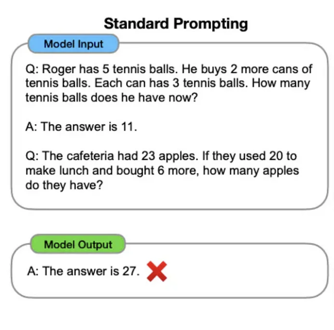
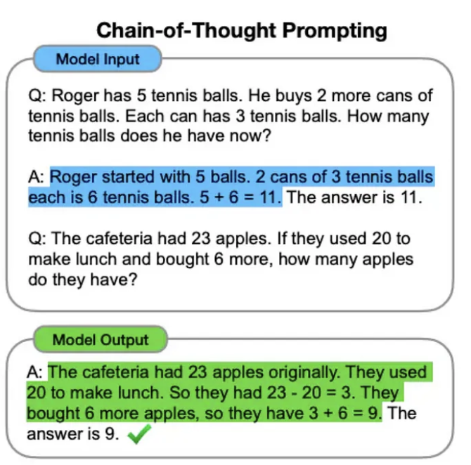
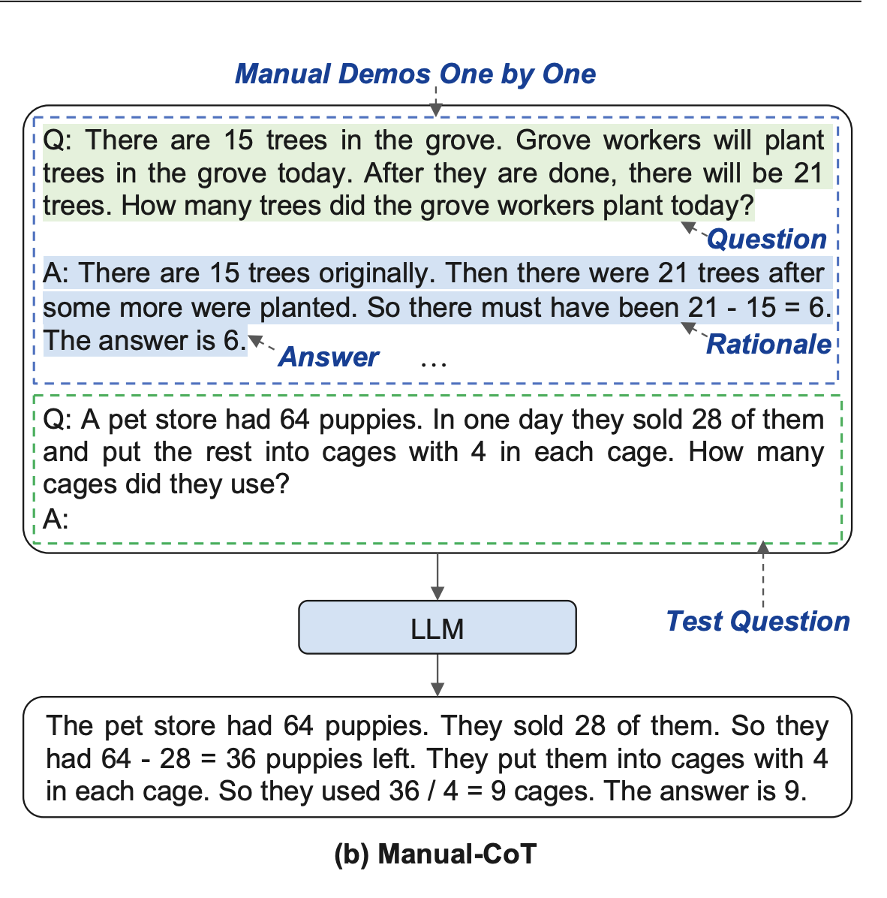
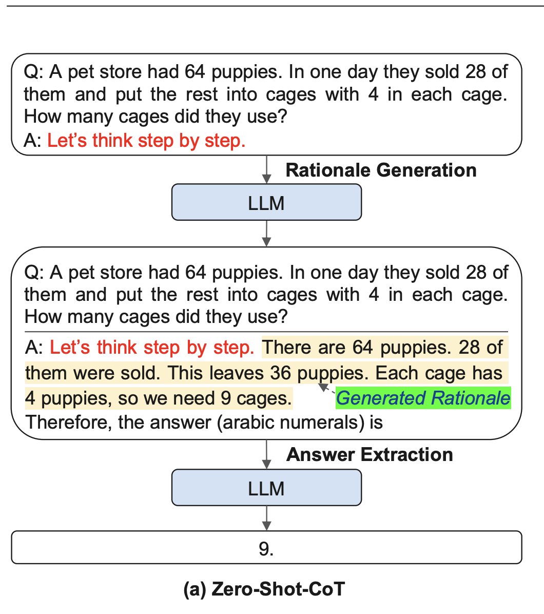
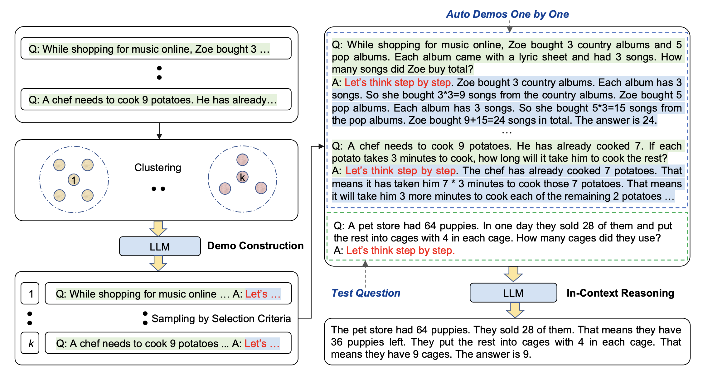

# Basics of Prompt Engineering

## Few shot prompting

Few-shot prompting is a significant technique in natural language processing (NLP), particularly when working with large language models such as Claude and GPT-4. This method allows models to perform specific tasks by providing them with a small number of examples, known as "shots," which can range typically from 1 to 10. By presenting a few labeled input/output pairs, few-shot prompting helps the model to learn the underlying patterns and rules of a task, effectively training it with limited resources. After receiving these examples, the model is evaluated on a separate dataset, known as the query set, to assess its performance.

## Chain-of-Thought Prompting

Chain-of-thought (CoT) prompting is a technique designed to enhance the reasoning abilities of large language models (LLMs) by breaking down intricate queries into manageable steps, thereby enabling LLMs to generate more coherent and accurate responses (a.k.a resoning chains). CoT prompting stands out for its innovative use of structured prompt-and-answer pairs, which allow models to learn and replicate the reasoning process.
|  |  |
| -------------------------- | -------------------------- |

### Techniques

1. Manual CoT:
   Employs question, reasoning and answer pattern to teach llm to solve a complecated reasoning task
2. Zero Shot CoT:
   Unlike CoT prompting which provides examples with reasoning steps, ZS CoT prompting just adds the phrase **Let's think step by step.** This additional phrase encourages the LLM to generate its own chain of thought, leading to enhanced reasoning.
   |||
   | ------------- | ---------------- |
3. Auto CoT: It involves partitioning questions of a given dataset into a few clusters and then selecting a representative question from each cluster and generating its reasoning chain using Zero-Shot-CoT with simple heuristics. By automates the task of creating demonstrations Auto CoT achieves results on par with few-shot CoT prompting.

### Variants of Chain-of-Thought Prompting

Chain-of-Thought (CoT) prompting has inspired a range of related techniques aimed at enhancing reasoning capabilities in language models (LLMs). Notable among these are the **Least-to-Most prompting** method, <ins>which organizes reasoning steps from simpler to more complex tasks</ins>, and the Self-consistency approach, which leverages multiple reasoning paths to improve model reliability. Additionally, the Tree-of-Thoughts (ToT) technique has emerged, simulating a more human-like trial-and-error problem-solving process by allowing LLMs to explore multiple potential solutions simultaneously, akin to the cognitive "dual models" proposed by researchers

## [PlayList](https://youtube.com/playlist?list=PLhRXULtLjLtcT5Ig8f7V-_YAVw9mrjmQA&si=3CejZFx_bd30sS5J)

## [Webpage](https://llmnanban.akmmusai.pro/Introductory/Generative-AI-Explained/)
