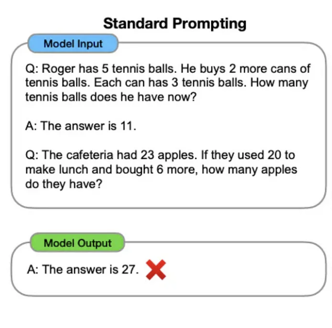
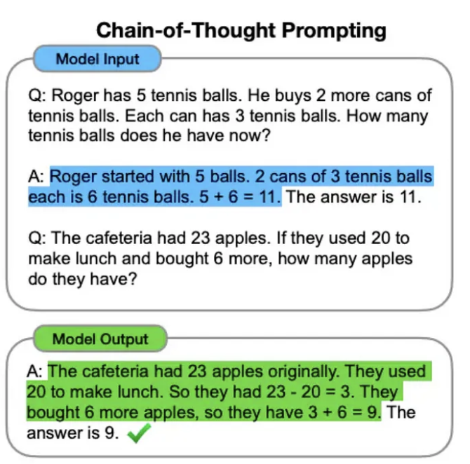
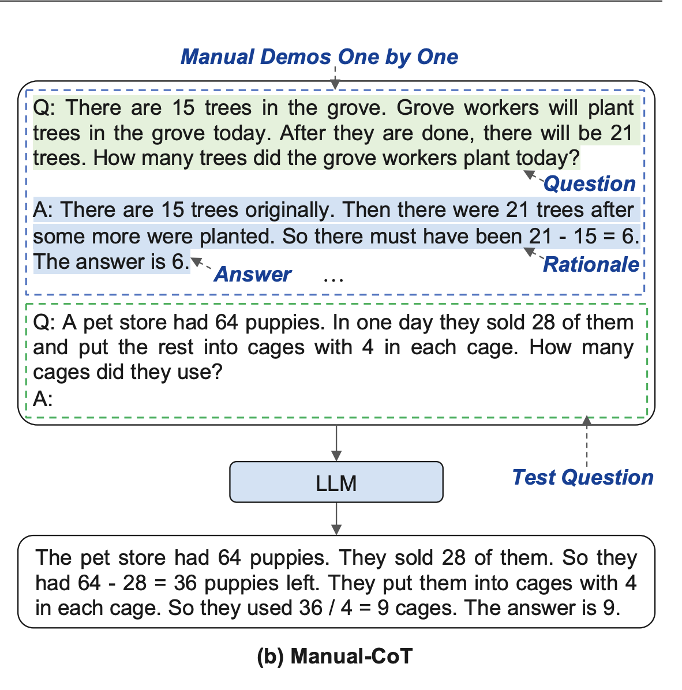
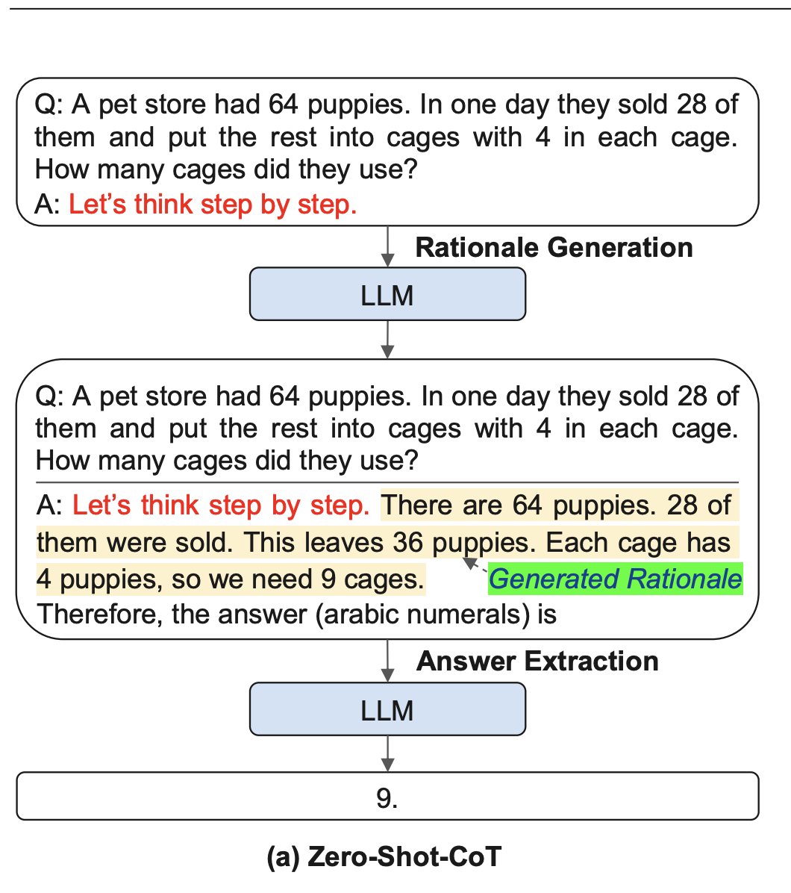
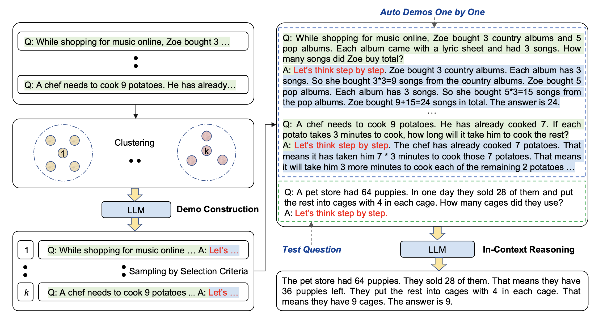

# LLM concepts

## corpus of data

    data that was used to train LLM

## [Pre training](https://www.youtube.com/shorts/0SDDzQuL8m0)

    learns from a large, diverse dataset of often trillions of tokens.
    develop a broad understanding of language, context, and various types of knowledge.
    MASSIVELY computationally expensive and requires HUGE amounts of data.

## Fine Tuning

    further train it on a more specific dataset. This dataset is typically smaller and focused on a particular domain or task.
    The purpose of fine-tuning is to adapt the model to perform better in specific scenarios or on tasks that were not well covered during pre-training.

## Instruct Tuning

    model is trained (or further trained) to follow instructions in prompts better.
    doesn't necessarily involve adding new factual knowledge to the model
    improving the model's ability to parse and respond to prompts in a way that aligns with user intentions.

## Important elements of a good prompt

1. Persona: The role you want the llm to play, e.g. you are tax expert. This controlls the _style_, _tone_ and _depth_ of the generated texts
2. Context: Any relevant or background information related to the task that the model can use to generate relevant response.
3. Task: Clearly defines the action the AI needs to take, outlining the goal of the prompt. Try using action verbs to describe the task.
4. Input: Provide the raw data the model uses to generate output
5. Format: Specifies the desired structure of the models response, ensuring it is organized and easy to understand.

## Zero shot prompting

Zero shot prompting is a technique used with generative AI models to generate content without exposing it with any relevant examples or fine tuning. The model uses only the pretrained information to come up with the response.

## Few shot prompting

Few-shot allows models to perform specific tasks by providing them with a small number of examples, known as "shots," which can range typically from 1 to 10. By presenting a few labeled input/output pairs, few-shot prompting helps the model to learn the underlying patterns and rules of a task, effectively training it with limited resources. This enables the llm to solve similar problems. An area where few shot prompting fails is when llm is tasked with soliving complex arithmetic, reasoning question. This is where Chain of thought prompting comes handy.

## [Chain-of-Thought Prompting](https://www.youtube.com/watch?v=tiTjA0nfDXo&t=75s)

Chain-of-thought (CoT) prompting is a technique designed to enhance the reasoning abilities of large language models (LLMs) by breaking down intricate queries into manageable steps, thereby enabling LLMs to generate more coherent and accurate responses (a.k.a resoning chains). CoT prompting stands out for its innovative use of structured prompt-and-answer pairs, which allow models to learn and replicate the reasoning process.
|  |  |
| -------------------------- | -------------------------- |

### Techniques

1. Manual CoT:
   Employs question, reasoning and answer pattern to teach llm to solve a complecated reasoning task
2. Zero Shot CoT:
   Unlike CoT prompting which provides examples with reasoning steps, ZS CoT prompting just adds the phrase **Let's think step by step.** This additional phrase encourages the LLM to generate its own chain of thought, leading to enhanced reasoning.
   |||
   | ------------- | ---------------- |
3. Auto CoT: It involves partitioning questions of a given dataset into a few clusters and then selecting a representative question from each cluster and generating its reasoning chain using Zero-Shot-CoT with simple heuristics. By automates the task of creating demonstrations Auto CoT achieves results on par with few-shot CoT prompting.

### Variants of Chain-of-Thought Prompting

Chain-of-Thought (CoT) prompting has inspired a range of related techniques aimed at enhancing reasoning capabilities in language models (LLMs). Notable among these are the **Least-to-Most prompting** method, <ins>which organizes reasoning steps from simpler to more complex tasks</ins>, and the Self-consistency approach, which leverages multiple reasoning paths to improve model reliability. Additionally, the Tree-of-Thoughts (ToT) technique has emerged, simulating a more human-like trial-and-error problem-solving process by allowing LLMs to explore multiple potential solutions simultaneously, akin to the cognitive "dual models" proposed by researchers

## [Prompt Chaining](https://www.youtube.com/watch?v=B4MR8m7V17A)

Prompt chaining helps us solve complex tasks by breaking them into smaller tasks. Simple prompts are used to solve these individual small task where in the output from one prompt flows into another prompt as input

## [PlayList](https://youtube.com/playlist?list=PLhRXULtLjLtcT5Ig8f7V-_YAVw9mrjmQA&si=3CejZFx_bd30sS5J)

## [Webpage](https://llmnanban.akmmusai.pro/Introductory/Generative-AI-Explained/)

RAG
https://aws.amazon.com/what-is/retrieval-augmented-generation/

https://www.youtube.com/watch?v=LAfrShnpVIk
https://www.youtube.com/watch?v=rBbXcO5Rp2o

https://stackoverflow.com/a/77318216
