# System Design Study Guide

Goal: review the core ideas in about one hour. Read the diagrams first, then use the bullets to lock in the mental models.

<!-- SECTION: table-of-contents - DONE -->

## Table of Contents

1. [OSI Layers for System Design](#1-osi-layers-for-system-design)
2. [Internet Request Flow](#2-internet-request-flow)
3. [VIP, Anycast, and Load Balancer Entry Points](#3-vip-anycast-and-load-balancer-entry-points)
4. [DDoS Protection by Layer](#4-ddos-protection-by-layer)
5. [Scaling Fundamentals](#5-scaling-fundamentals)
6. [Storage Patterns](#6-storage-patterns)
7. [Real-Time Networking with UDP](#7-real-time-networking-with-udp)
8. [Final Mental Model](#8-final-mental-model)
9. [One-Hour Review Checklist](#9-one-hour-review-checklist)

<!-- SECTION: osi-layers - DONE -->

## 1. OSI Layers for System Design

You do not need to memorize every protocol detail. For system design, the OSI model is mostly a map that explains what each component can see.

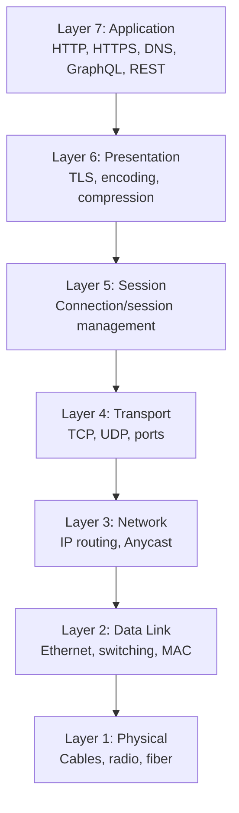

| Layer | Beginner meaning | System design examples |
|---|---|---|
| L7 Application | Understands the actual app request | HTTP path, headers, REST, GraphQL, API gateway |
| L6 Presentation | Formats and protects data | TLS encryption, compression, encoding |
| L5 Session | Keeps conversations organized | Long-lived connections, session handling |
| L4 Transport | Moves data between ports | TCP, UDP, L4 load balancer, SYN flood handling |
| L3 Network | Moves packets between networks | IP routing, Anycast, packet filtering |
| L2 Data Link | Moves frames on a local network | Switches, MAC addresses, local network delivery |
| L1 Physical | Moves bits through hardware | Cable, fiber, radio signal |

System design shortcut: **L3 finds a network path, L4 handles connections/ports, and L7 understands the application request.**

<!-- SECTION: request-flow - DONE -->

## 2. Internet Request Flow

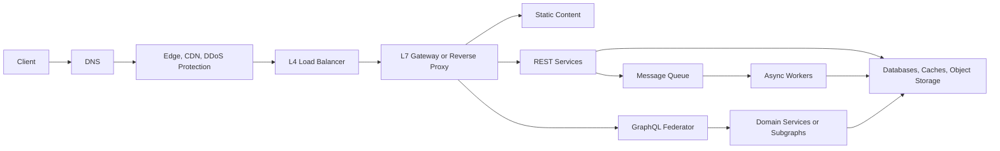

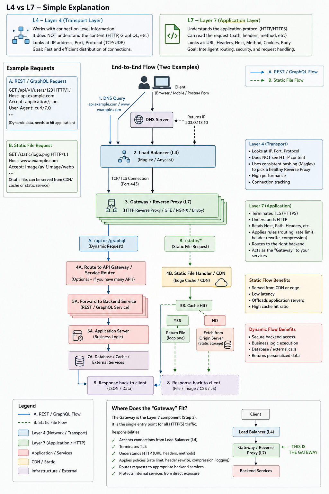

- **DNS** maps a hostname to reachable IPs. It is useful for coarse traffic steering, but browser, OS, and resolver caching means failover is not instant.
- **Edge/CDN/DDoS layer** is the public perimeter. It absorbs large traffic, filters bad packets, caches static content, and hides origins.
- **L4 load balancer** works at transport level: IP, port, TCP/UDP, connection state. Its question is: which frontend gets this connection?
- **L7 gateway/reverse proxy** understands HTTP: host, path, method, headers, cookies, body size. Its question is: what does this request mean, and which backend should handle it?
- **GraphQL federator** understands GraphQL schema, fields, query planning, entity resolution, and response composition.

Mental shortcut: **L4 routes connections. L7 routes requests. Federators route GraphQL fields.**

### Gateway vs Federator

| Layer | Understands | Typical decisions |
|---|---|---|
| Gateway / reverse proxy | HTTP/HTTPS | `/static/*` to CDN/static origin, `/api/*` to REST, `/graphql` to GraphQL tier |
| GraphQL federator | GraphQL | Which subgraph owns `user`, `orders`, `product`, and how to merge results |

<!-- SECTION: vip-anycast - DONE -->

## 3. VIP, Anycast, and Load Balancer Entry Points

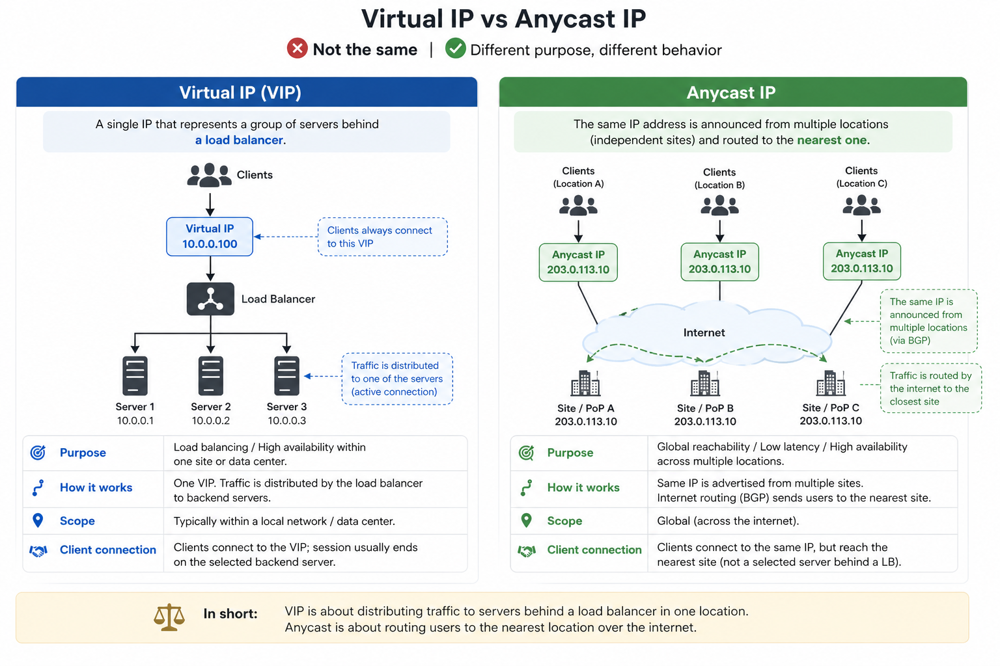

- **VIP (Virtual IP):** one IP represents a group of servers or load balancers, usually within a data center or local environment.
- **Anycast IP:** the same IP is announced from multiple locations. Internet routing usually sends users to the nearest or best reachable site/POP.
- A cached IP does not necessarily mean one physical machine. The IP may be Anycast, a VIP, or backed by a load balancer fleet.
- Existing TCP/TLS connections usually stay on the selected frontend until they close; balancing mostly affects new connections and failover.

### How a Load Balancer Is Load Balanced

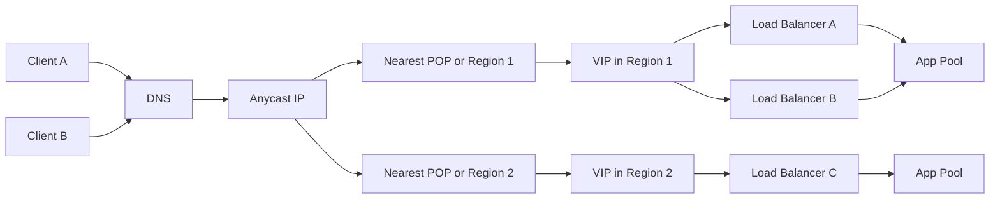

- **DNS** can return one or more entry IPs. This is the first coarse steering layer.
- **Anycast** lets the same IP exist in many places. Internet routing sends the client to a nearby or reachable POP.
- **VIPs** hide a local group of load balancers behind one regional IP.
- **Health checks** remove bad load balancers or regions from rotation.
- **Inside the region**, the selected load balancer distributes traffic to gateways, proxies, or app servers.

Mental shortcut: **DNS chooses an address, Anycast chooses a location, VIP/load-balancer clustering chooses a frontend, and the load balancer chooses a backend.**

<!-- SECTION: ddos-protection - DONE -->

## 4. DDoS Protection by Layer

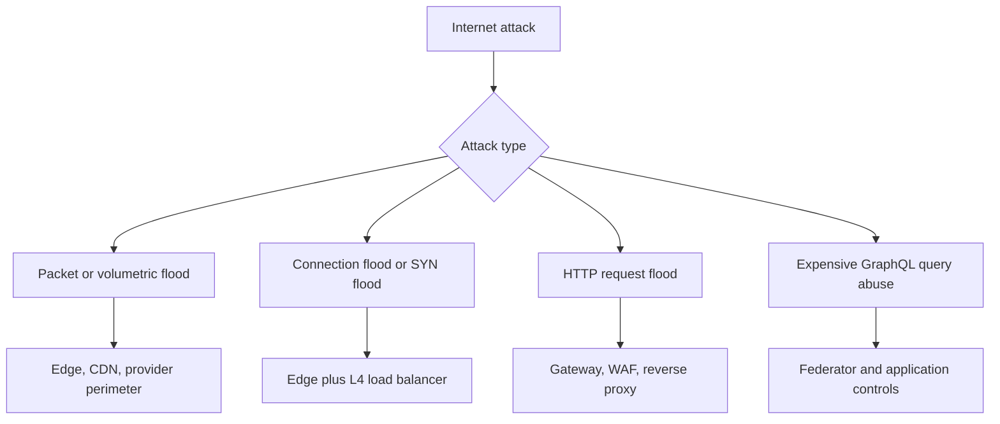

- **Edge/L3/L4:** absorbs packet floods, UDP floods, SYN floods, malformed packets, and obvious protocol abuse.
- **L4 load balancer:** helps with connection handling, connection tracking, health-based distribution, and resilience.
- **Gateway/L7:** handles HTTP floods, rate limits, body-size limits, malformed HTTP, auth checks, and WAF-like rules.
- **Federator/app:** handles depth limits, complexity limits, resolver timeouts, pagination limits, and expensive query controls.

Key idea: stop cheap attacks cheaply. Do not let junk traffic reach TLS termination, HTTP parsing, GraphQL execution, or databases if the edge can reject it.

<!-- SECTION: scaling - DONE -->

## 5. Scaling Fundamentals

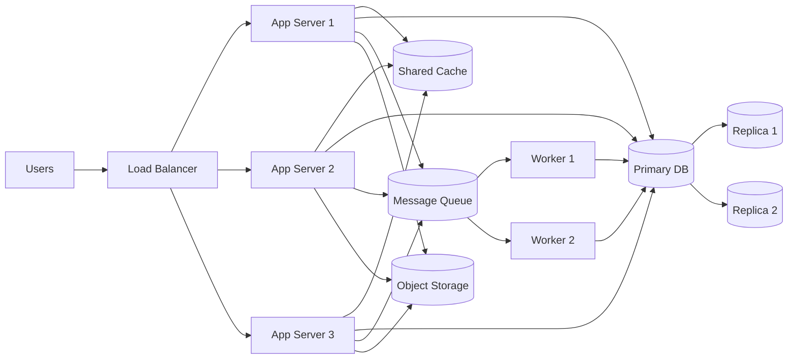

- **Vertical scaling:** make one machine bigger. It is simple, but has hardware, cost, and failure-domain limits.
- **Horizontal scaling:** add more machines. It improves capacity and resilience, but introduces routing, shared state, consistency, and failure handling.
- **Stateless app servers** are easier to scale because sessions, files, and shared data live outside the individual server.
- **Cache** reduces repeated expensive work, but adds invalidation and freshness concerns.
- **Queues** smooth bursts and decouple slow work from user-facing requests.

### Queues

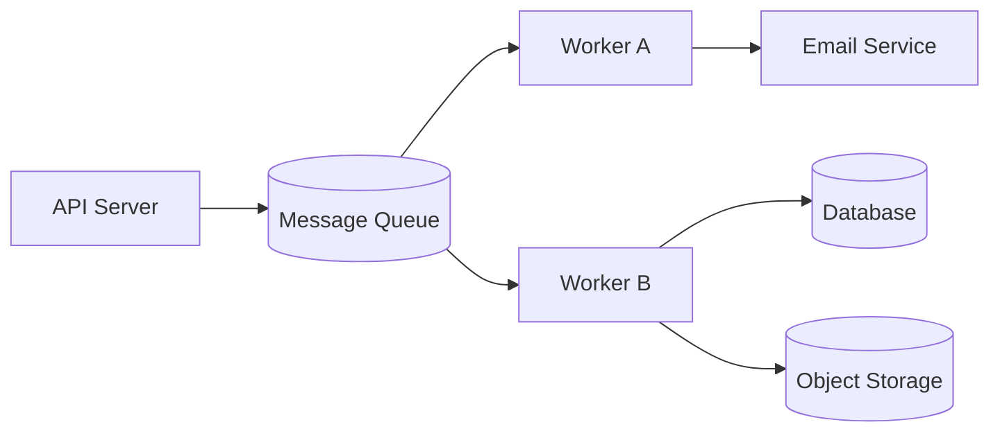

- A **queue** stores work to be processed later, usually by background workers.
- Use queues for slow, bursty, or retryable work: email, image processing, webhooks, report generation, data exports, indexing, and notifications.
- Queues improve user latency because the API can accept the request quickly and let workers finish the heavy work.
- They also improve resilience because failed jobs can be retried without making the user resend the request.
- Tradeoffs: work becomes eventually consistent, duplicate processing can happen, ordering is not always guaranteed, and idempotency matters.

Mental shortcut: **synchronous request for immediate answers, queue for work that can safely finish later.**

### Replication

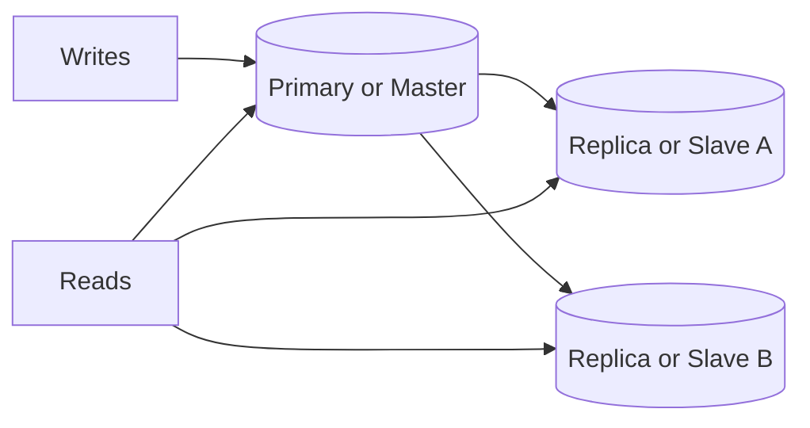

- **Primary-replica**, also called **master-slave** in older material, means one node accepts writes and replicas copy from it.
- Writes go to the primary/master. Reads can go to replicas/slaves when slightly stale reads are acceptable.
- It is the common default for read scaling and simpler correctness.
- **Replica lag:** a write may succeed on the primary before a replica has caught up, so a read from the replica can briefly return old data.
- Failover promotes a replica if the primary fails, but clients and apps must route writes to the new primary.

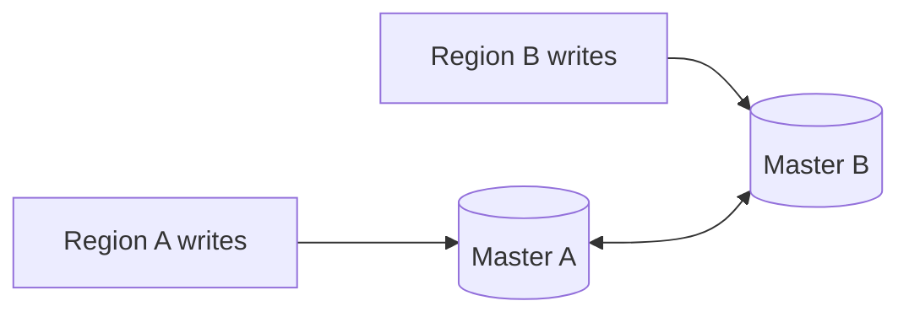

- **Multi-primary**, also called **master-master**, means more than one node can accept writes.
- Use it only when local writes in multiple regions are truly needed.
- It can improve write availability and regional latency, but adds conflict resolution, ordering problems, replication loops, and split-brain risk.
- Safe master-master systems need clear rules for conflicts, unique IDs, idempotent writes, and operational discipline.

<!-- SECTION: storage - DONE -->

## 6. Storage Patterns

### Object Storage

- Stores large blobs: images, videos, documents, backups, logs, data lake files, ML artifacts.
- SQL stores metadata such as owner, object key, timestamps, permissions, and relationships.
- Object storage stores bytes cheaply and durably behind keys like `user/42/avatar.png`.
- Common examples: Amazon S3, Azure Blob Storage, Google Cloud Storage, MinIO, Ceph Object Gateway, NetApp StorageGRID, Dell ECS.
- For upload/download patterns, presigned URLs, virus scanning, and quarantine buckets see [Guide 16: Blob Storage & File Upload Patterns](16.blob-storage-file-upload-study-guide.md).

### Partitioning vs Sharding

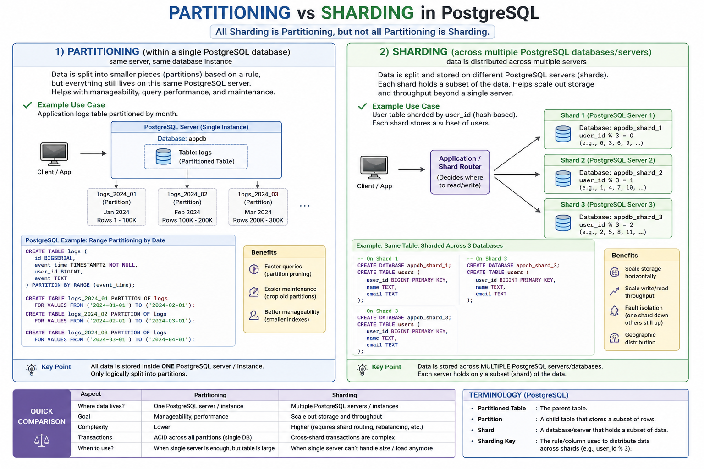

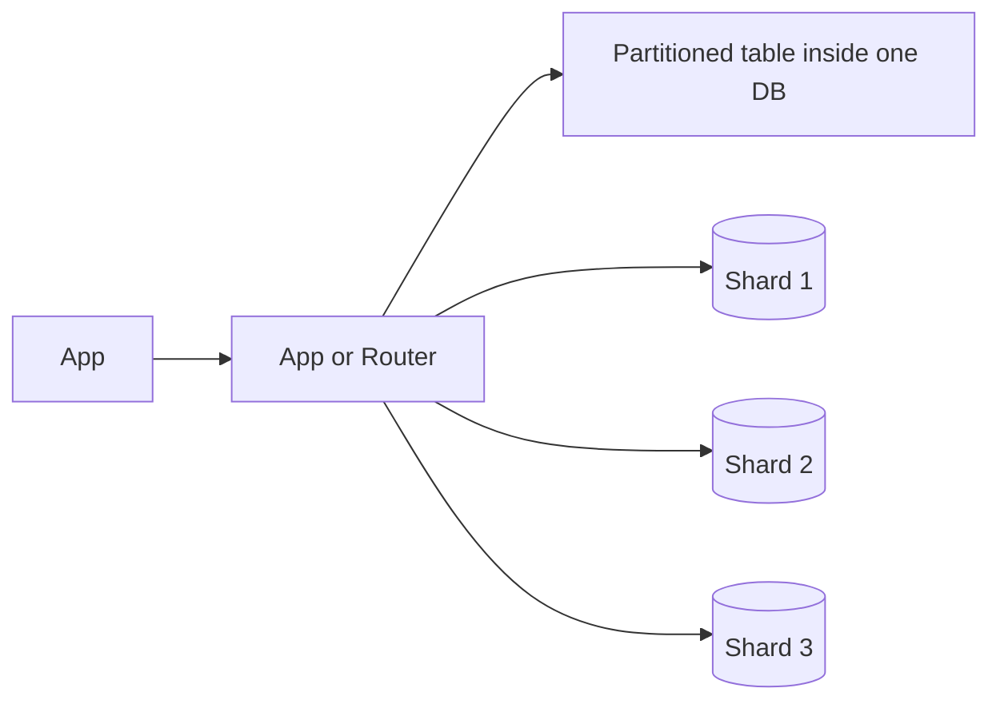

- **Partitioning:** splits one logical table into smaller pieces, often inside one database instance. PostgreSQL supports range, list, and hash partitioning.
- **Why partition:** partition pruning, smaller indexes, easier bulk load/delete, lifecycle management, and better local query performance for very large tables.
- **Sharding:** partitions data across multiple databases or servers. Each shard owns a subset of the data.
- **Why shard:** scale storage/write/read throughput beyond one machine, improve fault isolation, or support geographic distribution.
- **Sharding costs:** routing, rebalancing, cross-shard joins, distributed transactions, uneven hot shards, and harder operations.

Shortcut: **All sharding is partitioning, but not all partitioning is sharding.**

*See [guide 15](15.sharding-partitioning-study-guide.md) for a deep dive on sharding strategies, consistent hashing, hot spot mitigations, and rebalancing.*

### RAID

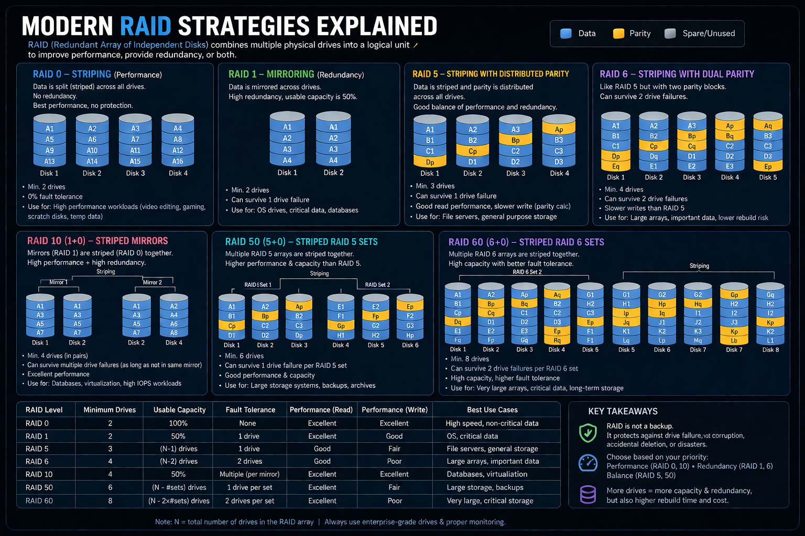

| RAID | Minimum drives | Capacity idea | Fault tolerance | Best fit |
|---|---:|---|---|---|
| RAID 0 | 2 | 100% | None | Speed, temporary/non-critical data |
| RAID 1 | 2 | 50% | 1 drive | OS disks, critical small data |
| RAID 5 | 3 | N-1 drives | 1 drive | General file storage |
| RAID 6 | 4 | N-2 drives | 2 drives | Larger arrays, important data |
| RAID 10 | 4 | 50% | One per mirror pair | Databases, virtualization, high IOPS |
| RAID 50 | 6 | N minus one per RAID 5 set | One per RAID 5 set | Large storage, backups |
| RAID 60 | 8 | N minus two per RAID 6 set | Two per RAID 6 set | Very large or critical arrays |

- **Striping** spreads data across disks for performance.
- **Mirroring** stores duplicate copies for redundancy.
- **Parity** stores calculated recovery information, not a full copy. Think of it as a recovery clue: if data blocks `A`, `B`, and `C` create parity block `P`, then losing `B` can be rebuilt from `A + C + P`.
- **RAID 5 parity:** one parity block per stripe, so the array can survive one drive failure.
- **RAID 6 parity:** two parity blocks per stripe, often described as `P` and `Q`, so the array can survive two drive failures.
- **RAID is not backup.** It helps with disk failure, not deletion, corruption, ransomware, accidental overwrite, or site loss.

<!-- SECTION: realtime-udp - DONE -->

## 7. Real-Time Networking with UDP

- UDP does not guarantee delivery, ordering, retransmission, or congestion control like TCP.
- Real-time systems use it because old data can be useless. A late player position or stale audio packet is often worse than a dropped packet.
- Apps add their own lightweight reliability: sequence numbers, timestamps, interpolation buffers, prediction, reconciliation, and smoothing.
- Games often render slightly in the past so nearby updates can be interpolated smoothly.
- VoIP uses jitter buffers, drops packets that arrive too late, and hides small gaps with packet-loss concealment.

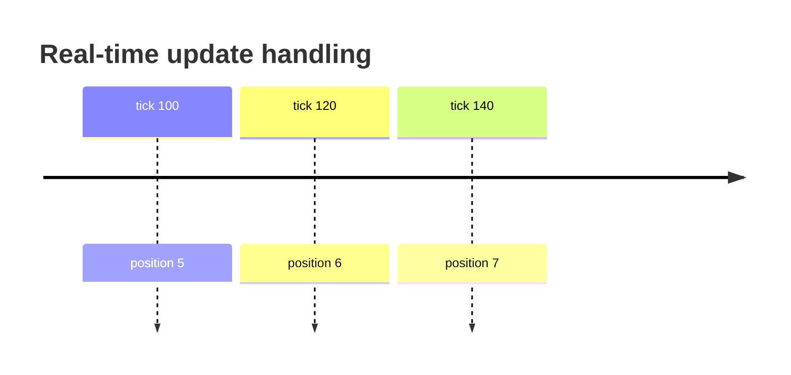

Mental shortcut: **TCP protects completeness. UDP protects latency. Real-time apps decide what reliability they actually need.**

<!-- SECTION: final-model - DONE -->

## 8. Final Mental Model

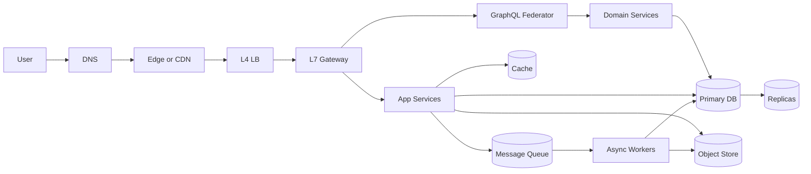

If you can explain this diagram, you understand the core path: **DNS finds an entry point, the edge protects it, L4 chooses a connection target, L7 routes the HTTP request, services execute business logic, queues offload async work, and storage systems hold state at the right shape and scale.**

<!-- SECTION: review-checklist - DONE -->

## 9. One-Hour Review Checklist

1. Explain what L3, L4, and L7 mean in a real system.
2. Explain L4 vs L7 without using the word "layer" first.
3. Describe why a gateway sits between a load balancer and backend services.
4. Explain how DNS, Anycast, VIPs, and load balancer clusters combine to balance load balancers.
5. Explain where GraphQL federation starts and what it adds.
6. Map packet flood, SYN flood, HTTP flood, and expensive GraphQL query abuse to defense layers.
7. Explain VIP vs Anycast in one sentence each.
8. Compare vertical and horizontal scaling, including the hidden complexity of horizontal scaling.
9. Explain why stateless app servers are easier to scale.
10. Explain when to use a queue and what tradeoffs it adds.
11. Compare primary-replica/master-slave with multi-primary/master-master replication.
12. Explain object storage vs SQL metadata.
13. Compare partitioning and sharding, including why sharding is operationally harder.
14. Explain RAID parity and why RAID is not a backup.
15. Explain why games and VoIP prefer UDP and how they handle out-of-order or late packets.
