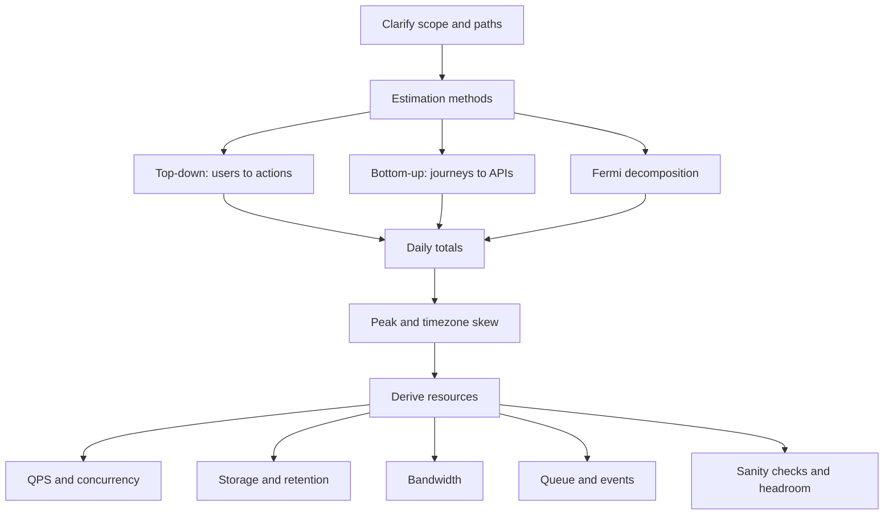
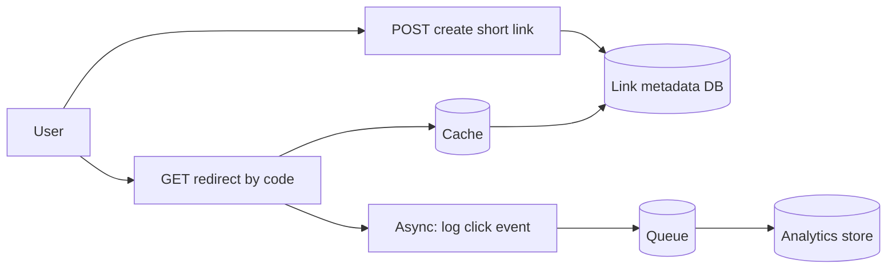
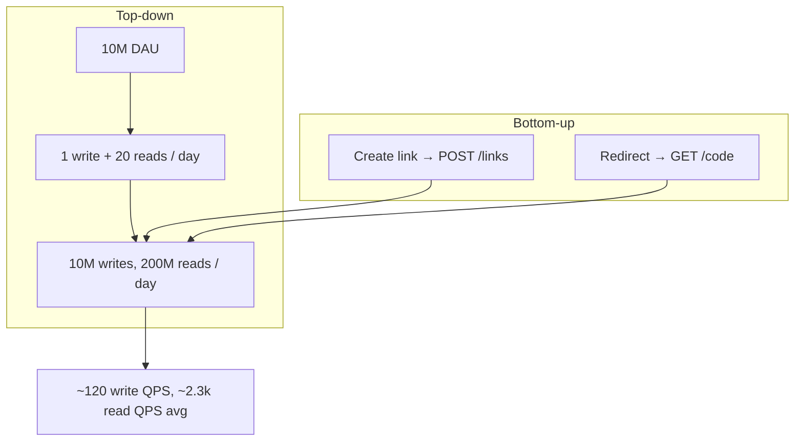
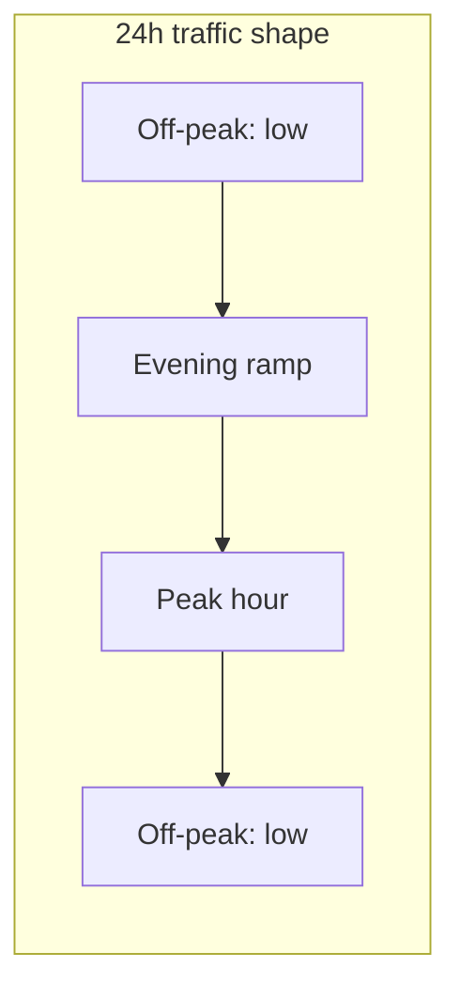
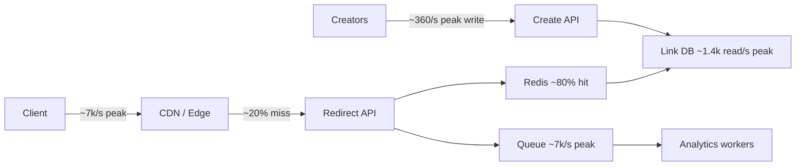
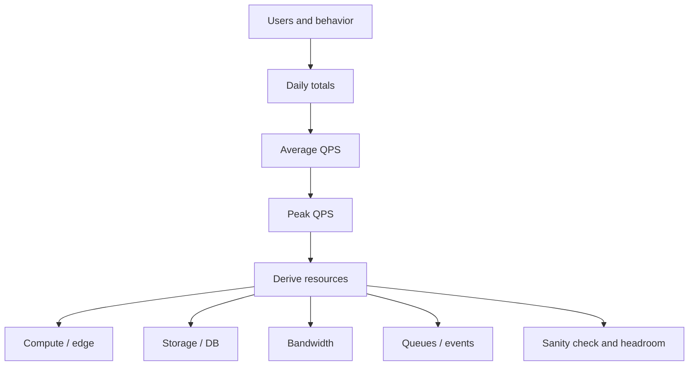

# Traffic Estimation 30–45 Minute Study Guide

Goal: understand traffic estimation techniques well enough to derive QPS, storage, bandwidth, and async throughput for a new service—and explain your assumptions clearly—in a system design interview.

Related:
- [System Design guide §5](1.system-design-study-guide.md#5-scaling-fundamentals) — horizontal scaling, queues, replication
- [Caching Patterns guide](4.caching-patterns-study-guide.md) — cache hit ratio and working-set sizing
- [Event-Driven Architecture guide §7](7.event-driven-architecture-study-guide.md#7-messaging-and-message-brokers) — queue throughput and consumers
- [Stability Patterns guide §8](8.stability-patterns-study-guide.md#8-throttling) — rate limits driven by estimated load

**Running example (used throughout):** a new **URL shortener with redirect analytics**.

| Assumption | Value | Notes |
|---|---|---|
| Registered users | 50M | Total accounts |
| DAU | 10M | 20% of registered users active daily |
| Short links created per DAU per day | 1 | Write path |
| Redirects followed per DAU per day | 20 | Read path |
| Link metadata retention | 5 years | Long-lived mapping store |
| Redirect log hot window | 90 days | Analytics / trending |
| Metadata per link | ~500 B | URL, owner, timestamps, indexes |
| Bytes per redirect log event | ~200 B | Aggregated click record |

Round numbers are intentional. Interviews reward clear assumptions more than false precision.

<!-- SECTION: table-of-contents - DONE -->

## Table of Contents

1. [Traffic Estimation Mental Model](#1-traffic-estimation-mental-model)
2. [Clarify Before You Calculate](#2-clarify-before-you-calculate)
3. [Top-Down Estimation](#3-top-down-estimation)
4. [Bottom-Up Estimation](#4-bottom-up-estimation)
5. [Fermi and Decomposition](#5-fermi-and-decomposition)
6. [Time Distribution and Peak Factor](#6-time-distribution-and-peak-factor)
7. [Read/Write and Hot-Path Skew](#7-readwrite-and-hot-path-skew)
8. [Storage Estimation](#8-storage-estimation)
9. [Bandwidth and Payload Estimation](#9-bandwidth-and-payload-estimation)
10. [Async, Queue, and Event Throughput](#10-async-queue-and-event-throughput)
11. [Anchoring and Comparable Systems](#11-anchoring-and-comparable-systems)
12. [Sensitivity and Headroom](#12-sensitivity-and-headroom)
13. [Worked Example: URL Shortener End-to-End](#13-worked-example-url-shortener-end-to-end)
14. [Design Warnings](#14-design-warnings)
15. [Interview Language](#15-interview-language)
16. [Final Mental Model](#16-final-mental-model)
17. [30–45 Minute Review Checklist](#17-3045-minute-review-checklist)

<!-- SECTION: mental-model - DONE -->

## 1. Traffic Estimation Mental Model

In system design interviews, traffic estimation answers:

> **How much load will this service see, and what breaks first if we are wrong?**

Estimates drive concrete decisions:

| Decision | What estimates inform |
|---|---|
| API tier size | QPS, concurrency, peak factor |
| Database choice | Write QPS, storage growth, consistency needs |
| Caching | Read QPS, working set, hit ratio |
| CDN / edge | Read-heavy static or redirect traffic |
| Sharding | Storage size and hot-key risk |
| Queues | Enqueue rate vs consumer throughput |
| Rate limits | Per-user and global caps from peak QPS |
| Multi-region | Geo distribution and failover capacity |



The practical estimation question is:

> **What do users do per day, how does that spread over time, and which paths are hot?**

Estimation is not accounting. You are looking for **order-of-magnitude correctness** so the architecture is plausible:

- 100 QPS vs 100,000 QPS changes the design completely.
- 100 GB vs 100 PB of storage changes the storage tier.
- A missing peak factor can make autoscaling and connection pools fail in production.

Mental shortcut: **state assumptions, round aggressively, sanity-check the result.**

### Reference Constants (Interview Shortcuts)

| Constant | Value | Use |
|---|---|---|
| Seconds per day | 86,400 | Convert daily actions → average QPS |
| Seconds per month | ~2.6M | Monthly batch / billing jobs |
| Seconds per year | ~31.5M | Annual retention math |
| KiB → GiB | powers of 1024 | Storage back-of-envelope |
| Typical DAU/registered | 10–30% | Social/utility apps unless stated |
| Read:write (URL shortener) | 10:1 to 100:1 | Redirects dominate creates |

<!-- SECTION: clarify - DONE -->

## 2. Clarify Before You Calculate

Spend 2–3 minutes clarifying scope. Wrong scope produces precise but useless numbers.

### Questions to Ask the Interviewer

| Topic | Question | Why it matters |
|---|---|---|
| Users | Total registered vs DAU vs MAU? | DAU drives daily volume |
| Actions | What does an active user do per day? | Defines read/write counts |
| Payload | Request/response sizes? Uploads? | Bandwidth and storage |
| Retention | How long is data kept? Archival? | Storage grows with TTL |
| Consistency | Strong consistency on writes? | DB and replication design |
| Latency | p99 target for redirects? | Cache vs DB on read path |
| Geography | Single region or global? | Peak overlap, replication |
| Async work | What is synchronous vs queued? | User-facing QPS ≠ worker load |
| Peak events | Flash sales, viral links, cron? | Peak multiplier |
| Growth | Year 1 vs year 3 expectations? | Headroom and sharding timing |

### Map the System Paths First



For the URL shortener:

- **Write path:** create short link (low volume, needs durability).
- **Read path:** redirect lookup (high volume, latency-sensitive).
- **Async path:** analytics logging (must not block redirect).

Mental shortcut: **list user actions before you multiply anything.**

<!-- SECTION: top-down - DONE -->

## 3. Top-Down Estimation

**Top-down** starts from user scale and infers actions per day, then converts to QPS.

### Steps

1. Estimate **DAU** (or MAU × daily engagement).
2. Estimate **actions per DAU per day** per action type (read, write).
3. Sum **daily totals** per action type.
4. Convert to average QPS: `daily_total / 86,400`.
5. Apply **peak factor** (see §6).

### Formulas

```text
daily_writes  = DAU × writes_per_DAU_per_day
daily_reads   = DAU × reads_per_DAU_per_day

QPS_write_avg = daily_writes / 86,400
QPS_read_avg  = daily_reads / 86,400
```

### URL Shortener (Top-Down)

| Action | Calculation | Daily total | Avg QPS |
|---|---|---|---|
| Create link | 10M DAU × 1/day | 10M/day | ~120/s |
| Redirect | 10M DAU × 20/day | 200M/day | ~2,300/s |

```text
QPS_write_avg ≈ 10,000,000 / 86,400 ≈ 116 → round to ~120/s
QPS_read_avg  ≈ 200,000,000 / 86,400 ≈ 2,315 → round to ~2.3k/s
```

Read:write ratio ≈ **20:1** (200M reads / 10M writes).

| When to use | Strength | Common mistake |
|---|---|---|
| Greenfield product with user metrics | Fast, interview-friendly | Forgetting peak and geography |
| "10M users" prompt | Easy to narrate | Treating registered users as DAU |

**Interview phrase:** "I'll assume 10M DAU, one link created and twenty redirects per user per day, which gives roughly 120 write QPS and 2.3k read QPS on average."

Mental shortcut: **top-down = users × actions ÷ seconds per day.**

<!-- SECTION: bottom-up - DONE -->

## 4. Bottom-Up Estimation

**Bottom-up** walks user journeys and counts **API calls per action**, including internal fan-out.

### Steps

1. List **user journeys** (create link, follow redirect, view dashboard).
2. Count **external API calls** per journey.
3. Count **internal calls** (DB, cache, auth) per external call if sizing dependencies.
4. Sum daily calls per endpoint.
5. Convert to QPS; apply peak factor.

### Formulas

```text
daily_API_calls(endpoint) =
  DAU × journeys_per_day × calls_per_journey(endpoint)

QPS_avg(endpoint) = daily_API_calls(endpoint) / 86,400
```

**Fan-out multiplier** (critical for dependency sizing):

```text
internal_load ≈ external_QPS × fan_out_per_request
```

### URL Shortener (Bottom-Up)

| Journey | External calls | Notes |
|---|---|---|
| Create short link | 1× `POST /api/v1/links` | Auth + validate URL + insert |
| Follow redirect | 1× `GET /{code}` | Cache lookup; DB on miss |
| View analytics dashboard | 1× `GET /api/v1/stats` | Heavier; lower volume |

Assume dashboard traffic is **5% of DAU once per day** (optional path):

```text
dashboard QPS ≈ (10M × 0.05) / 86,400 ≈ 6/s  (negligible vs redirects)
```

Redirect path internal fan-out (per redirect request):

| Step | Calls |
|---|---|
| Edge/CDN | 1 (cache hit common) |
| API on miss | 1 |
| Cache get | 1 |
| DB read on miss | 1 |

If **80% cache hit rate**, origin sees 20% of redirect QPS:

```text
origin_read_QPS ≈ 2,300 × 0.2 ≈ 460/s average
DB read QPS at peak (3×) ≈ 1,400/s
```

Create path fan-out:

| Step | Calls |
|---|---|
| API | 1 |
| Auth service | 1 |
| DB insert | 1 |
| Cache invalidate / warm | 1 |

```text
internal_write_load ≈ 120 × 3 ≈ 360 dependency calls/s average
```

Bottom-up should **reconcile** with top-down on external QPS. If they diverge by 10×, revisit assumptions.

| When to use | Strength | Common mistake |
|---|---|---|
| Known API surface / microservices | Exposes fan-out and per-endpoint limits | Counting only external calls and starving the DB |
| REST-heavy designs | Maps to rate limits per route | Omitting rare admin endpoints that are heavy |

**Interview phrase:** "Each redirect is one external GET, but with 80% cache hits the origin only sees about 20% of read QPS—roughly 460/s average to the app and DB layer."

Mental shortcut: **bottom-up = journeys × calls; multiply by fan-out for dependencies.**



<!-- SECTION: fermi - DONE -->

## 5. Fermi and Decomposition

**Fermi estimation** breaks an unknown into parts you can guess, then multiplies. It is useful when the interviewer gives a fuzzy prompt ("Instagram-scale sharing") or when top-down and bottom-up should cross-check.

### Steps

1. Decompose into **countable units** (links, redirects, bytes).
2. Assign **plausible ranges** to each unit.
3. Multiply; round to one significant figure.
4. **Sanity-check** against known systems (§11).

### URL Shortener (Fermi)

**How many redirects per second at peak?**

```text
US peak-hour fraction: assume 20% of daily redirects in 1 hour

redirects in peak hour ≈ 200M × 0.20 = 40M
peak second (smooth hour) ≈ 40M / 3,600 ≈ 11k/s

With burstiness inside the hour (×2): ~20k/s peak redirect QPS
```

Compare to average 2.3k/s: peak hour is ~5× daily average; burst within hour adds another ~2×. **Peak factor ~10×** is defensible for viral-link scenarios; **3×** is a conservative planning default (§6).

**How much new storage per day?**

```text
links/day × bytes/link = 10M × 500 B ≈ 5 GB/day metadata (raw)
redirect logs/day = 200M × 200 B ≈ 40 GB/day hot analytics
```

**Five-year link metadata (order of magnitude):**

```text
10M/day × 365 × 5 ≈ 18B links
18B × 500 B ≈ 9 TB raw
×2 index overhead ≈ 18 TB
×3 replication ≈ 54 TB
```

Sanity check: **tens of TB**, not petabytes, for this assumption set. If you got PB/day, you likely dropped a unit conversion.

| When to use | Strength | Common mistake |
|---|---|---|
| Fuzzy product scale | Shows structured thinking | Fake precision (4 significant figures) |
| Cross-check | Catches 1000× errors | Copying "Twitter numbers" without matching product |

**Interview phrase:** "I'll decompose into links created and redirects followed, convert to bytes per day, then multiply by retention to see if we're in TB or PB territory."

Mental shortcut: **Fermi = break into units, multiply, then ask 'does this magnitude make sense?'**

<!-- SECTION: peak-time - DONE -->

## 6. Time Distribution and Peak Factor

Traffic is **not uniform**. Interviews want both **average QPS** and **peak QPS**.

### Average QPS

```text
QPS_avg = daily_total / 86,400
```

Average is useful for **cost models** and **rough capacity** conversation.

### Peak QPS

```text
QPS_peak ≈ QPS_avg × peak_factor
```

| Product shape | Typical peak_factor | Example |
|---|---|---|
| Steady B2B API | 1.5–2× | Business hours only |
| Consumer social | 2–4× | Evening usage spike |
| Global SaaS | 2–3× | Timezone overlap partial |
| Viral / ticket drop | 10–50× | Single event dominates |

### Time-of-Day Sketch



For the URL shortener, assume **peak_factor = 3×** for capacity planning unless the prompt mentions viral links:

| Metric | Avg | Peak (3×) |
|---|---|---|
| Write QPS | ~120/s | ~360/s |
| Read QPS | ~2.3k/s | ~7k/s |
| Origin read (80% CDN/cache hit) | ~460/s | ~1.4k/s |

### Timezone and Region Effects

- **Single region:** peak is regional evening.
- **Global service:** peaks may **overlap** across US + EU → use higher combined peak_factor.
- **Cron jobs:** nightly batch can add **write spikes** unrelated to user QPS—size workers separately.

| Common mistake | Better approach |
|---|---|
| Only quoting average QPS | Give avg + peak + how you chose peak_factor |
| Using peak for cost, avg for sizing | Size infra for peak (with headroom); use avg for rough monthly cost |

**Interview phrase:** "Average redirect QPS is about 2.3k; I'd plan autoscaling and connection pools for roughly 3× that, about 7k/s, and revisit if we expect viral campaigns."

Mental shortcut: **average for the napkin; peak for what you provision.**

<!-- SECTION: read-write-skew - DONE -->

## 7. Read/Write and Hot-Path Skew

Separate **read QPS** and **write QPS** before sizing databases and caches.

### Read/Write Ratio

```text
read_write_ratio = daily_reads / daily_writes
```

URL shortener: `200M / 10M = 20:1`.

| System type | Typical read:write | Implication |
|---|---|---|
| URL shortener / CDN | 10:1 – 100:1 | Cache + read replicas |
| Social feed | 50:1+ | Heavy cache, fan-out |
| OLTP banking | 2:1 – 5:1 | Stronger write path design |
| Write-heavy logging | 1:10+ | Optimize ingest, not read cache |

### 80/20 on Endpoints

Often **80% of traffic** hits **20% of routes**:

- Redirect `GET /{code}` dominates.
- Create link is small but latency-sensitive for creators.
- Admin/analytics APIs are low QPS but **heavy queries**—do not ignore them in DB design.

### Cache Hit Ratio and Origin QPS

```text
origin_read_QPS ≈ read_QPS × (1 - cache_hit_rate)
```

| cache_hit_rate | Origin fraction of 2.3k read QPS |
|---|---|
| 90% | ~230/s |
| 80% | ~460/s |
| 50% | ~1,150/s |

Size the **cache working set** for hot codes (recent viral links), not all links ever created. See [caching guide](4.caching-patterns-study-guide.md).

| Common mistake | Better approach |
|---|---|
| Sizing DB for full read QPS | Apply cache hit ratio to origin load |
| One pool for reads and writes | Separate read replicas / cache for read-heavy paths |

**Interview phrase:** "Reads dominate about 20:1; I'd put redirects behind a CDN and Redis with an 80–90% hit target so the database sees hundreds, not thousands, of read QPS at average."

Mental shortcut: **split read vs write, then apply skew and cache to the hot path.**

<!-- SECTION: storage - DONE -->

## 8. Storage Estimation

Storage estimates need **how many records**, **how big each record is**, **how long you keep them**, and **overhead**.

### Formula

```text
storage ≈ records_per_day × bytes_per_record × retention_days
          × (1 + index_overhead) × replication_factor
```

| Factor | Typical range | Notes |
|---|---|---|
| index_overhead | 0.5–1.0× (50–100% extra) | Secondary indexes, PK/FK |
| replication_factor | 3× | HA across AZs |
| compression | 0.3–0.7× | Columnar / log compression |

### URL Shortener: Link Metadata

```text
links/day = 10M
retention = 5 years ≈ 1,825 days
total links ≈ 10M × 1,825 ≈ 18B rows (rounded)

raw ≈ 18B × 500 B ≈ 9 TB
with indexes (×2) ≈ 18 TB
with replication (×3) ≈ 54 TB
```

Plan **sharding** by `link_id` or hash of short code once a single primary cannot hold writes (~120/s avg is modest, but **54 TB** and billions of rows require partitioning).

### URL Shortener: Redirect Analytics (Hot 90 Days)

```text
events/day = 200M
hot window = 90 days
events in hot store ≈ 200M × 90 ≈ 18B events

raw ≈ 18B × 200 B ≈ 3.6 TB
with overhead (×2 ×3) ≈ 20 TB (order of magnitude)
```

Older logs → **cold object storage** (S3/GCS) at lower cost; keep queryable aggregates (daily counts per link).

### Growth Headroom

| Horizon | Multiplier | Why |
|---|---|---|
| 1 year launch | 2× | Safety on assumptions |
| 3 year product growth | 3–5× DAU | Sharding before emergency |
| Retention policy change | Non-linear | Legal hold can spike storage |

| Common mistake | Better approach |
|---|---|
| `records × size` without retention | Always ask TTL and archival |
| Ignoring indexes and replicas | Multiply by overhead explicitly |
| Storing full click stream forever in OLTP | Tier hot vs cold storage |

**Interview phrase:** "Link metadata is on the order of tens of TB over five years with replication; redirect logs for ninety days are a few TB hot, with cold archive for history."

Mental shortcut: **storage = rate × size × time × overhead.**

<!-- SECTION: bandwidth - DONE -->

## 9. Bandwidth and Payload Estimation

Bandwidth is **bytes per second** on the wire, often ingress (upload) and egress (download) separately.

### Formula

```text
bits_per_second = QPS × payload_bytes × 8
Mbps ≈ bits_per_second / 1e6
```

For mixed request/response:

```text
egress ≈ QPS × response_bytes
ingress ≈ QPS × request_bytes
```

### URL Shortener: Redirect Path (Dominant)

Assume **302 redirect**, small response (~500 B), tiny request (~200 B):

```text
egress_avg ≈ 2,300 × 500 B ≈ 1.15 MB/s
ingress_avg ≈ 2,300 × 200 B ≈ 0.46 MB/s
```

At **peak 7k read QPS**:

```text
egress_peak ≈ 7,000 × 500 B ≈ 3.5 MB/s
```

Most redirect bandwidth is served at **CDN/edge**; origin bandwidth is the **cache-miss fraction** (~20% without CDN on body—often less if edge handles redirect).

### Create Link API

Request with long URL (~2 KB) + response (~500 B), ~120 QPS avg:

```text
ingress ≈ 120 × 2 KB ≈ 240 KB/s
egress ≈ 120 × 500 B ≈ 60 KB/s
```

Negligible vs reads unless bulk import API exists.

### Large Payload Warning

If the product adds **file upload** or **bulk CSV import**, model that path separately—one 10 MB upload at 100 QPS is **1 GB/s** ingress.

| Path | Dominant payload | Size tier |
|---|---|---|
| Redirect | 302 + Location header | Small |
| Create link | JSON body | Small |
| Analytics export | CSV / Parquet | Large—async job |

| Common mistake | Better approach |
|---|---|
| Multiplying full read QPS × huge payload | Use actual response size per endpoint |
| Forgetting CDN absorbs egress | Origin bandwidth ≠ user-visible bandwidth |

**Interview phrase:** "Redirect bandwidth is small per request; at peak we're in the low megabytes per second range—CDN handles most of it."

Mental shortcut: **bandwidth = QPS × bytes; split heavy uploads from hot paths.**

<!-- SECTION: async-queue - DONE -->

## 10. Async, Queue, and Event Throughput

User-facing QPS does not always equal **worker** or **queue** load. Separate:

- **Synchronous path:** user waits (redirect lookup).
- **Asynchronous path:** enqueue and process later (click analytics).

### Enqueue Rate

For the URL shortener, enqueue **one analytics event per redirect**:

```text
enqueue_rate_avg ≈ read_QPS ≈ 2,300 events/s
enqueue_rate_peak ≈ 7,000 events/s (3× avg)
```

### Consumer Throughput

```text
required_consumers ≈ peak_enqueue_rate × processing_time_seconds
```

Example: **50 ms** processing per event (parse, enrich, write batch):

```text
consumers ≈ 7,000 × 0.05 ≈ 350 worker equivalents
```

In practice, **batch writes** (100–1000 events per DB flush) reduce effective consumer count.

### Partitions and Ordering

| Need | Partition key | Risk |
|---|---|---|
| Per-link ordering | `short_code` or `link_id` | Hot partition on viral link |
| Global throughput | hash(event_id) | Loses per-link order |

For analytics, **per-link order is usually optional**—partition by hash for even load.

### Backlog Under Spike

If consumers lag:

```text
backlog growth = enqueue_rate - dequeue_rate
```

Size queue retention and **autoscaled consumers** for peak; consider [throttling](8.stability-patterns-study-guide.md#8-throttling) on enqueue during extreme events.

See [EDA guide §7](7.event-driven-architecture-study-guide.md#7-messaging-and-message-brokers) for broker choice (Kafka for replay, SQS for simpler queues).

| Common mistake | Better approach |
|---|---|
| Sizing queue from write QPS only | Count every async side effect |
| Unbounded queue during outage | Max retention + DLQ + alerts on lag |

**Interview phrase:** "Each redirect emits an analytics event—about 2.3k/s average, 7k/s peak—consumed by a pool that batches writes; partition by event id to avoid hot spots unless we need strict per-link ordering."

Mental shortcut: **async load = events per user action × action rate.**

<!-- SECTION: anchoring - DONE -->

## 11. Anchoring and Comparable Systems

**Anchoring** compares your estimate to a known system or industry ballpark to catch 1000× errors.

### Good Anchors

| Anchor | Order of magnitude | Use |
|---|---|---|
| Single modest app server | ~1k–10k simple HTTP QPS | Sanity-check compute |
| Redis single node | ~100k ops/s (varies) | Cache layer |
| OLTP primary | ~1k–10k simple reads/s | Before sharding |
| "Our product is 1% of Twitter" | Only if interviewer agrees | Scale down public stats |

### URL Shortener Anchor

- **Bitly-class public shorteners** handle huge global traffic; our **2.3k avg / 7k peak read QPS** is **medium scale**, not hyperscale.
- **120 write QPS** fits a **sharded or well-indexed** SQL/NoSQL cluster without exotic hardware.
- **54 TB metadata** suggests **distributed storage**, not a single laptop—but not a hyperscale data lake.

### Bad Anchors

| Bad anchor | Why |
|---|---|
| "Twitter does 500M tweets/day so we do too" | No product linkage |
| Random FAANG QPS from a blog | Unverified, wrong domain |
| Peak viral video CDN numbers | Wrong access pattern |

### Sanity Checks

```text
1. Does QPS imply more requests than humans physically possible?
2. Does storage exceed reasonable disk/$$ for the business stage?
3. Does bandwidth exceed a 10 Gbps NIC at peak?
4. Do reads + writes match the stories you told about user behavior?
```

| Common mistake | Better approach |
|---|---|
| Citing competitor scale without adjustment | "We're earlier stage—1% of X" with explicit reasoning |
| No comparison | One-line anchor: "single region, thousands of QPS, tens of TB" |

**Interview phrase:** "This is thousands of read QPS at peak, not millions—consistent with a successful consumer app but not Twitter scale."

Mental shortcut: **anchor to one believable comparison, not the biggest number you've heard.**

<!-- SECTION: sensitivity - DONE -->

## 12. Sensitivity and Headroom

Show **what changes** when assumptions move. Interviewers care that you understand elasticity.

### Sensitivity Table (URL Shortener)

| Variable | Base | 10× scenario | Effect |
|---|---|---|---|
| DAU | 10M | 100M | Read ~23k avg; write ~1.2k avg QPS |
| Redirects per DAU | 20/day | 20/day (unchanged) | Linear on reads |
| Redirects per DAU | 20 | 200 (viral usage) | Read ~23k avg without more users |
| Retention (links) | 5 yr | 10 yr | ~2× metadata storage |
| Cache hit rate | 80% | 60% | Origin read +50% |

### What Breaks First (Base → 10× DAU)

| Component | Base stress | 10× stress |
|---|---|---|
| Redirect cache | Comfortable | Hot-key risk; need more cache RAM |
| DB read replicas | Hundreds QPS origin | Thousands QPS origin |
| Link write primary | ~120/s | ~1.2k/s—still moderate |
| Analytics pipeline | ~2.3k events/s | ~23k events/s—scale consumers |
| Storage growth | ~5 GB/day links | ~50 GB/day links |

### Headroom Strategies

Pick **one** headroom story and state it:

| Strategy | Rule | When to say it |
|---|---|---|
| Peak multiplier | Provision **2–3×** measured peak | Default interview answer |
| Growth runway | Design for **3 year 5× DAU** | Product-led growth expected |
| Elastic autoscale | Auto-scale between avg and peak | Cloud-native, stateless tiers |

```text
provisioned_read_QPS ≈ QPS_peak × headroom_factor
headroom_factor ≈ 1.5–2.0 on top of peak
```

Example: peak 7k read QPS × 2 = **14k provisioned** redirect capacity at edge.

| Common mistake | Better approach |
|---|---|
| "We'll scale when needed" with no trigger | Name metric: p95 latency, cache miss, queue lag |
| 10× users but same retention | Storage and compliance both grow |

**Interview phrase:** "If DAU 10×, read QPS goes to roughly 23k average—I'd shard link storage, expand cache for hot codes, and scale the analytics consumer group; metadata storage grows roughly linearly with links created per day."

Mental shortcut: **sensitivity = which knob moves which resource.**

<!-- SECTION: worked-example - DONE -->

## 13. Worked Example: URL Shortener End-to-End

Single pass tying all techniques together. Numbers rounded; assumptions stated.

### Assumptions (Recap)

- 10M DAU; 1 link created and 20 redirects per DAU per day
- Peak factor **3×** on user traffic; **2×** provisioning headroom on peak
- Cache/CDN **80%** hit on redirects
- 5-year link retention; 90-day hot analytics

### Step 1 — Daily Actions (Top-Down)

```text
writes/day = 10M
reads/day  = 200M
```

### Step 2 — Average QPS

```text
write_QPS_avg ≈ 120/s
read_QPS_avg  ≈ 2,300/s
read:write ≈ 20:1
```

### Step 3 — Peak QPS

```text
write_QPS_peak ≈ 360/s
read_QPS_peak  ≈ 7,000/s
origin_read_peak ≈ 7,000 × 0.2 ≈ 1,400/s
```

### Step 4 — Storage

| Store | Calculation | Order of magnitude |
|---|---|---|
| Link metadata (5 yr, replicated) | 18B rows × 500 B × overhead | ~50 TB |
| Hot redirect logs (90 d, replicated) | 18B events × 200 B × overhead | ~20 TB |
| Cold archive | Older than 90 d | Cheaper object storage |

### Step 5 — Bandwidth (Origin-Scale)

Redirect egress at peak (if edge misses): **low MB/s**—not the bottleneck; **latency and DB/cache** are.

### Step 6 — Async Pipeline

```text
enqueue_peak ≈ 7,000 events/s
batch consumers + columnar/BigQuery-style sink
```

### Step 7 — Architecture Sketch with Estimates



### Step 8 — Sanity Check

| Check | Result |
|---|---|
| QPS vs one server | 7k peak is many machines at edge, not one JVM |
| Storage | TB scale, plausible with sharding |
| Bandwidth | MB/s, not TB/s |
| Consistency | Top-down and bottom-up both land ~2.3k read QPS |
| Viral scenario | Single hot code → add hot-key cache replica; mention in interview |

### Interview Summary (30 Seconds)

> Ten million DAU, twenty redirects and one new link per day gives two hundred million reads and ten million writes daily—about 2.3k read and 120 write QPS on average, 7k and 360 at 3× peak. Reads are 20:1 over writes; I'd cache and CDN redirects for an 80% hit rate so the database sees on the order of 1.4k read QPS at peak. Metadata is tens of terabytes over five years with replication; analytics is a few terabytes hot plus cold archive. Each redirect enqueues an analytics event at peak around 7k/s. I'd provision roughly 2× peak at the edge and plan sharding on link id as storage crosses tens of terabytes.

Mental shortcut: **one example, three methods, one architecture story.**

<!-- SECTION: warnings - DONE -->

## 14. Design Warnings

Common interview mistakes:

| Mistake | Why it hurts | Better approach |
|---|---|---|
| Single QPS with no peak | Under-provision connection pools | avg + peak + peak_factor |
| Forgetting fan-out | DB melts while API looks fine | `external_QPS × fan_out` |
| Storage without retention | "100 GB" that is actually 100 PB | rate × size × time |
| Cache sized for all data ever | RAM impossible | hot working set + TTL |
| Precision theater | Loses trust | round; state range |
| No sanity check | 1000× errors slip through | anchor to §11 |
| Queue sized on write QPS | Analytics backlog | count async events per read |
| Same number for CDN and origin | Wrong capacity plan | apply hit ratio |

### Useful Invariants While Estimating

| Workflow | Invariant |
|---|---|
| Short code assignment | Unique codes; no collisions on create |
| Redirect | Correct 302 target; bounded p99 latency |
| Analytics | At-least-once acceptable if aggregates idempotent |
| Abuse | Rate limit creates per user |

Mental shortcut: **estimation supports invariants—wrong scale breaks them.**

<!-- SECTION: interview-language - DONE -->

## 15. Interview Language

### Phrases That Sound Strong

```text
I'll clarify DAU, actions per user per day, and retention before I calculate.
Top-down: 10M DAU × 20 redirects ÷ 86,400 ≈ 2.3k average read QPS.
I'll separate read and write QPS—this system is roughly 20:1 read-heavy.
At 3× peak that's about 7k read QPS; I provision 2× peak at the edge.
With 80% cache hits, origin read load is about 20% of edge read QPS.
Storage is rate × size × time: tens of TB for five-year link metadata with replication.
Each redirect emits an async event—enqueue tracks read QPS, not write QPS.
I'll sanity-check: thousands of QPS and tens of TB, not millions of QPS and petabytes.
If DAU 10×, read QPS scales linearly; I'd shard storage and expand cache for hot codes.
```

### Sample 60-Second Answer

> I'll start with who is active: assume 10M DAU. Each creates one short link and follows twenty redirects per day—that's 10M writes and 200M reads daily, or about 120 write and 2,300 read QPS on average. Reads dominate, so I'd CDN-cache redirects and target 80% hit rate, leaving roughly 460 read QPS to origin on average and about 1,400 at 3× peak. For capacity I plan near 7k peak read QPS at the edge with 2× headroom. Storage: link rows over five years land in the tens of terabytes with indexes and replication; ninety-day hot click logs are a few terabytes. Analytics enqueue matches redirect rate, near 7k events per second at peak, with batched consumers. I'll sanity-check that we're in thousands of QPS, not millions, unless the product goes viral.

### Technique Cheat Sheet (Quick Reference)

| Technique | One-line formula |
|---|---|
| Top-down | `DAU × actions / 86,400` |
| Bottom-up | `Σ journeys × API calls / 86,400` |
| Fermi | Decompose units → multiply → sanity-check |
| Peak | `QPS_peak ≈ QPS_avg × peak_factor` |
| Origin read | `read_QPS × (1 - hit_rate)` |
| Storage | `records/day × bytes × days × overhead` |
| Bandwidth | `QPS × bytes × 8` |
| Consumers | `peak_enqueue × process_time` |

Mental shortcut: **say assumptions, show one multiplication, round, anchor.**

<!-- SECTION: final-model - DONE -->

## 16. Final Mental Model



Use this map:

```text
Clarify:
Who is active? What do they do? What is sync vs async?

Estimate:
Top-down AND bottom-up should agree roughly.

Time:
Average for cost conversation; peak for provisioning.

Skew:
Split read vs write; find the hot endpoint.

Resources:
QPS → machines, cache, DB replicas
Storage → rate × size × retention × overhead
Bandwidth → QPS × payload (split fat uploads)
Async → events per action × peak rate

Validate:
Anchor to a known scale; fix 1000× errors.
```

For system design interviews, the strongest flow:

```text
1. State assumptions (DAU, actions, retention).
2. Compute daily totals, then average QPS.
3. Apply peak factor; split read/write.
4. Adjust for cache hit ratio on origin.
5. Estimate storage and async enqueue separately.
6. Sanity-check magnitude; mention 10× sensitivity.
7. Connect numbers to architecture (CDN, shard, queue).
```

Final shortcut: **traffic estimation is not math for math's sake—it is choosing the right shape for the load.**

<!-- SECTION: checklist - DONE -->

## 17. 30–45 Minute Review Checklist

Use this checklist to test whether you can explain the topic:

- Can you explain why interviews ask for traffic estimates (capacity, cost, bottlenecks)?
- Can you list clarifying questions (DAU, actions, retention, peak events, async)?
- Can you compute average QPS from daily actions using 86,400?
- Can you apply a peak factor and justify 2× vs 3× vs 10×?
- Can you do top-down estimation from DAU and actions per day?
- Can you do bottom-up estimation from user journeys and API calls?
- Can you use Fermi decomposition to cross-check magnitude?
- Can you separate read QPS and write QPS and state read:write ratio?
- Can you explain 80/20 hot endpoints and size cache for working set?
- Can you compute origin load with `read_QPS × (1 - hit_rate)`?
- Can you estimate storage with rate × size × retention × overhead × replication?
- Can you estimate bandwidth with QPS × payload bytes?
- Can you size async enqueue from events per user action?
- Can you estimate consumer count with `peak_rate × processing_time`?
- Can you name good vs bad anchoring comparisons?
- Can you run a sensitivity table (e.g., 10× DAU) and say what breaks first?
- Can you walk the URL shortener example end-to-end in under 60 seconds?
- Can you name common estimation mistakes (no peak, no retention, fan-out ignored)?

If you remember only one thing:

```text
Clarify behavior → daily totals → average QPS → peak QPS →
split read/write → cache-adjusted origin → storage and async separately →
sanity-check → connect to architecture.
```
