# HTTP, SSE, and WebSockets 30-Minute Study Guide

Goal: understand how HTTP, SSE, and WebSockets work, how L4 and L7 see each protocol differently, and how to choose the right communication pattern in a system design interview.

<!-- SECTION: table-of-contents - DONE -->

## Table of Contents

1. [Communication Mental Model](#1-communication-mental-model)
2. [HTTP Fundamentals](#2-http-fundamentals)
3. [L4 vs L7 — What Each Layer Sees](#3-l4-vs-l7--what-each-layer-sees)
4. [HTTP at L4 and L7](#4-http-at-l4-and-l7)
5. [Server-Sent Events](#5-server-sent-events)
6. [WebSockets](#6-websockets)
7. [HTTP/2 and HTTP/3](#7-http2-and-http3)
8. [Choosing the Right Protocol](#8-choosing-the-right-protocol)
9. [Failure, Scale, and Sticky Sessions](#9-failure-scale-and-sticky-sessions)
10. [Final Mental Model](#10-final-mental-model)
11. [30-Minute Review Checklist](#11-30-minute-review-checklist)

<!-- SECTION: mental-model - DONE -->

## 1. Communication Mental Model

Every client-server communication pattern makes a choice about who initiates, how long the connection stays open, and which direction data flows.

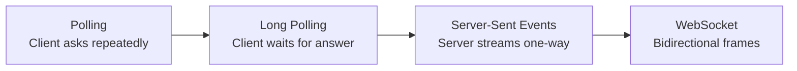

| Pattern | Who initiates | Connection | Data direction | Best fit |
|---|---|---|---|---|
| Polling | Client, every N seconds | New request each time | Client → Server → Client | Simple status checks, no real-time need |
| Long polling | Client holds request open | One request at a time | Client → Server → Client | Basic real-time when WebSocket is unavailable |
| SSE | Client opens once | One persistent HTTP response | Server → Client only | Live feeds, dashboards, notifications |
| WebSocket | Client upgrades HTTP connection | Persistent full-duplex TCP | Both directions freely | Chat, games, collaborative editing |
| gRPC streaming | Client or server | Persistent HTTP/2 stream | Both directions | Service-to-service real-time, not browser-native |

The practical question in an interview is:

> Does the client need to send messages after the connection is open? If yes, use WebSocket. If the server only pushes, SSE is simpler.

Mental shortcut: **polling asks, SSE tells, WebSocket talks.**

<!-- SECTION: http-fundamentals - DONE -->

## 2. HTTP Fundamentals

HTTP is a request-response protocol. The client sends a request and the server sends a response. Every exchange starts with the client.

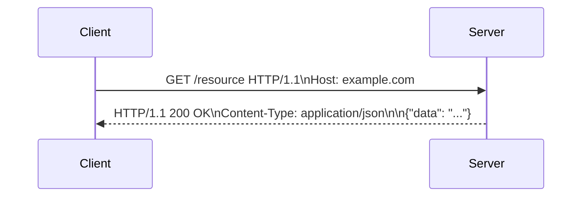

### HTTP Versions

| Version | Transport | Key behavior | System design implication |
|---|---|---|---|
| HTTP/1.0 | TCP | New connection per request | High connection overhead at scale |
| HTTP/1.1 | TCP | Keep-alive (reuse connection), pipelining | Default for most APIs; pipelining rarely enabled |
| HTTP/2 | TCP | Multiplexed streams on one connection, header compression, server push | Reduces latency; SSE works well; WS still needs separate TCP |
| HTTP/3 | UDP (QUIC) | Multiplexed streams without TCP head-of-line blocking, 0-RTT reconnect | Faster on lossy networks; changes what L4 sees |

### Key Headers in System Design

| Header | What it does | Why it matters |
|---|---|---|
| `Connection: keep-alive` | Reuse TCP connection across requests | Default in HTTP/1.1; reduces handshake cost |
| `Transfer-Encoding: chunked` | Send response in pieces without a final Content-Length | Required for SSE and streaming responses |
| `Upgrade: websocket` | Request protocol switch on existing connection | Triggers WebSocket handshake at L7 |
| `Cache-Control` | Control caching at browser, CDN, proxy | SSE and WebSocket responses must not be cached |

Mental shortcut: **HTTP/1.1 keeps connections alive; HTTP/2 multiplexes many requests on one; HTTP/3 moves to UDP to remove TCP blocking.**

<!-- SECTION: l4-vs-l7 - DONE -->

## 3. L4 vs L7 — What Each Layer Sees

L4 and L7 refer to the OSI model layers at which a load balancer, proxy, or firewall operates. The key difference is how much of the traffic each layer understands.

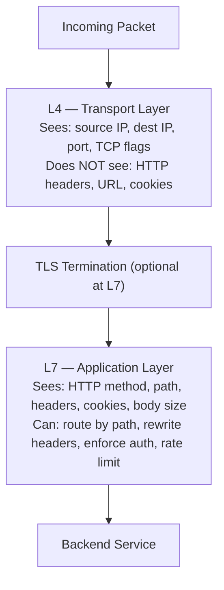

| What | L4 sees | L7 sees |
|---|---|---|
| IP addresses | Yes | Yes |
| TCP port | Yes | Yes |
| TCP flags (SYN, FIN, RST) | Yes | Yes |
| TLS (encrypted payload) | Opaque bytes unless it terminates TLS | Full plaintext after TLS termination |
| HTTP method (GET, POST) | No | Yes |
| HTTP path (`/api/v1/...`) | No | Yes |
| HTTP headers | No | Yes |
| Cookies or auth tokens | No | Yes |
| WebSocket frames | Opaque TCP bytes | Can inspect upgrade handshake |
| SSE stream body | Opaque TCP bytes | Can inspect, buffer, or timeout |

The consequence: an L4 load balancer routes blindly by connection. An L7 proxy routes intelligently by request content.

Mental shortcut: **L4 sees the envelope; L7 reads the letter.**

<!-- SECTION: http-l4-l7 - DONE -->

## 4. HTTP at L4 and L7

Understanding how HTTP flows through L4 and L7 components is a foundation for explaining SSE and WebSocket behavior.

### L4 Load Balancer with HTTP

An L4 load balancer forwards raw TCP connections to backend servers without reading HTTP headers.

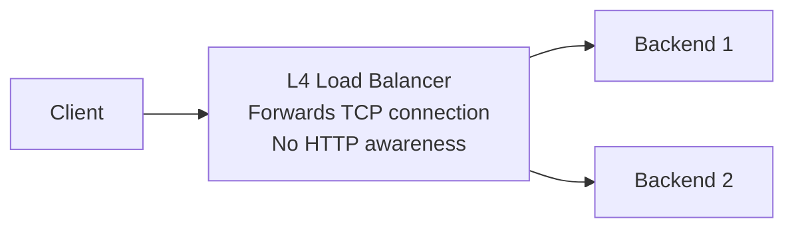

| Capability | L4 LB |
|---|---|
| Route by URL path | No |
| Route by Host header | No |
| TLS termination | Possible (passthrough or terminate) |
| Sticky sessions by cookie | No (can by IP hash or connection affinity) |
| Health check | TCP connect check only |
| WebSocket support | Yes — it is just TCP |
| SSE support | Yes — it is just a long TCP connection |

### L7 Reverse Proxy with HTTP

An L7 reverse proxy terminates the TCP and TLS connection, parses HTTP, and makes routing decisions based on the full request.

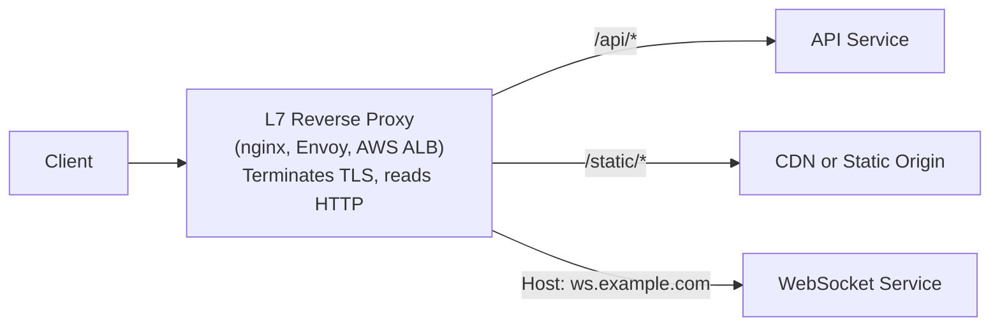

| Capability | L7 Reverse Proxy |
|---|---|
| Route by URL path or Host | Yes |
| TLS termination | Yes |
| Sticky sessions by cookie | Yes |
| Auth header enforcement | Yes |
| Rate limiting | Yes |
| WebSocket support | Yes, but must be configured to pass Upgrade header |
| SSE support | Yes, but proxy buffering must be disabled |
| Health check | HTTP status check |

The most common interview mistake is assuming L7 proxies "just work" for WebSocket and SSE. They require explicit configuration because default proxy behavior buffers responses and does not expect long-lived connections.

Mental shortcut: **L7 proxies are powerful but must be told that WebSocket and SSE connections are special.**

<!-- SECTION: sse - DONE -->

## 5. Server-Sent Events

SSE is an HTTP response that never ends. The server keeps the connection open and pushes new data as `data:` lines in the response body.

### How SSE Works

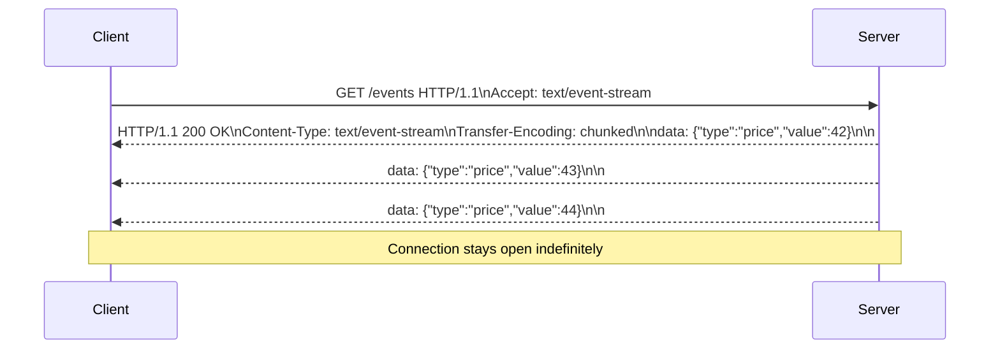

The response format is plain text:

```text
data: first message\n\n
data: second message\n\n
event: custom-type\ndata: typed message\n\n
id: 123\ndata: message with id for reconnect\n\n
```

The browser `EventSource` API handles reconnection automatically using the `Last-Event-ID` header.

### How L4 and L7 See SSE

| Layer | What it sees | Typical problem |
|---|---|---|
| L4 load balancer | One long-lived TCP connection routed to one backend | None — it is just TCP; but connection is pinned to one server |
| L7 reverse proxy | HTTP response that never finishes | Proxy buffers the body waiting for the response to complete, which breaks SSE |
| CDN | Never-ending response | CDNs almost never cache or forward SSE correctly; they must be bypassed |

### Fixing SSE at L7

To prevent a reverse proxy from buffering an SSE response:

```text
nginx: proxy_buffering off; proxy_read_timeout 86400s;
AWS ALB: idle timeout must be longer than the SSE session
Envoy: disable buffer filter on SSE routes
nginx with header: X-Accel-Buffering: no (set by the app server)
```

| SSE strength | SSE limitation |
|---|---|
| Plain HTTP — works through any proxy that handles HTTP | Server-to-client only — client cannot push |
| Browser EventSource reconnects automatically | Each SSE connection uses one HTTP/1.1 TCP connection |
| Simpler than WebSocket — no upgrade handshake | Proxy buffering must be explicitly disabled |
| Works with HTTP/2 — multiple SSE streams on one connection | |

Mental shortcut: **SSE is a streaming HTTP response — everything that handles HTTP can carry it, but proxies must be told not to buffer it.**

<!-- SECTION: websockets - DONE -->

## 6. WebSockets

WebSocket starts as HTTP and then switches to a persistent bidirectional TCP channel. After the upgrade, the connection is no longer HTTP.

### WebSocket Handshake

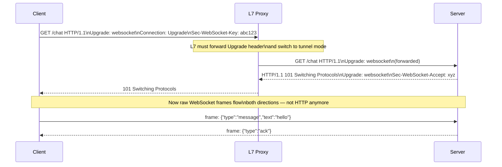

### How L4 and L7 See WebSocket

| Layer | What it sees | Requirement |
|---|---|---|
| L4 load balancer | TCP connection — works transparently | Connection stays pinned to one backend for the session |
| L7 reverse proxy | Sees HTTP Upgrade header; after 101, proxies raw TCP bytes | Must be configured to support WebSocket upgrade; otherwise returns 400 or drops Upgrade header |
| CDN | CDN typically cannot relay WebSocket; must bypass | Route WebSocket connections directly, not through CDN |

### L7 Proxy Configuration for WebSocket

An L7 proxy must:

1. Forward the `Upgrade` and `Connection` headers (by default, some proxies strip hop-by-hop headers)
2. Switch from HTTP response mode to TCP tunnel mode after the 101 response
3. Keep the connection alive for the full session — no response timeout

```text
nginx: proxy_http_version 1.1;
       proxy_set_header Upgrade $http_upgrade;
       proxy_set_header Connection "upgrade";
       proxy_read_timeout 86400s;
```

### WebSocket vs SSE Comparison

| | WebSocket | SSE |
|---|---|---|
| Direction | Bidirectional | Server → Client only |
| Protocol after connect | Binary/text frames (not HTTP) | HTTP chunked response |
| Browser support | All modern browsers | All modern browsers (not IE) |
| Proxy friendliness | Requires explicit upgrade support | Works on any HTTP proxy (with buffering disabled) |
| Reconnect | App must implement | EventSource reconnects automatically |
| Firewall traversal | Usually fine on port 443 | Same as HTTPS |
| HTTP/2 support | Separate TCP connection required | Multiplexed on one HTTP/2 connection |

Mental shortcut: **WebSocket upgrades HTTP into a TCP tunnel — after the handshake, L7 proxies must forward raw bytes, not HTTP.**

<!-- SECTION: http2-http3 - DONE -->

## 7. HTTP/2 and HTTP/3

HTTP/2 and HTTP/3 change the underlying transport, which affects how L4 and L7 see SSE and WebSocket.

### HTTP/2

HTTP/2 multiplexes many requests as streams over a single TCP connection.

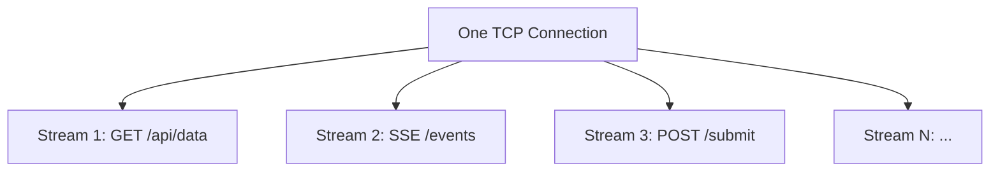

| Topic | HTTP/1.1 | HTTP/2 |
|---|---|---|
| Connections per client | 6–8 per domain (browser limit) | 1 connection, many streams |
| SSE | Uses one TCP connection per SSE stream | SSE stream is one HTTP/2 stream; multiple SSE streams share one TCP connection |
| WebSocket | Uses one TCP connection per WebSocket | WebSocket over HTTP/2 (`RFC 8441`) is possible but rarely deployed; most WebSocket still uses HTTP/1.1 upgrade |
| Head-of-line blocking | Per connection | Per stream (reduced but not eliminated at TCP level) |
| Header compression | None | HPACK compression |

HTTP/2 server push (server proactively sends resources before client requests them) was deprecated in Chrome in 2022 and is rarely used in system design interviews. Prefer SSE for server-push patterns.

### HTTP/3 and QUIC

HTTP/3 runs over QUIC, which uses UDP instead of TCP.

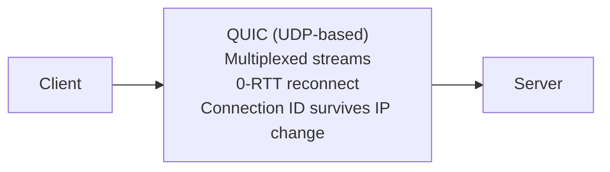

| What changes | Implication |
|---|---|
| L4 sees UDP datagrams instead of TCP streams | L4 firewalls and load balancers that block UDP will block HTTP/3 |
| No TCP handshake — 0-RTT on reconnect | Faster connection establishment, better on mobile (IP changes don't drop connection) |
| Stream-level flow control in QUIC | No TCP-level head-of-line blocking between streams |
| SSE over HTTP/3 | Works as a QUIC stream — benefits from 0-RTT and no HOL blocking |
| WebSocket over HTTP/3 | Specified in draft RFC but not widely deployed |

In interviews, the key HTTP/3 point is: **L4 infrastructure must allow UDP on port 443 for HTTP/3 to reach users**.

Mental shortcut: **HTTP/2 multiplexes streams over TCP; HTTP/3 multiplexes over UDP — both improve SSE; WebSocket mostly stays on HTTP/1.1 TCP.**

<!-- SECTION: choosing - DONE -->

## 8. Choosing the Right Protocol

Use these questions to pick a communication pattern in an interview:

1. Does the client need to send messages after the connection opens?
2. How many concurrent connections will the server hold?
3. Does the client run in a browser?
4. Are intermediate proxies or firewalls a constraint?
5. Can the client tolerate reconnect latency on disconnect?

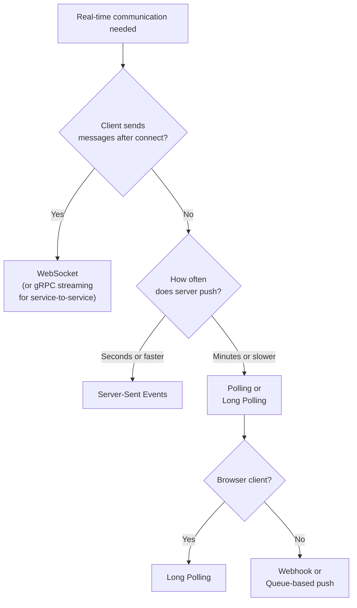

| Pattern | Connection | Direction | Browser native | Proxy safe | Scales easily |
|---|---|---|---|---|---|
| Polling | New per interval | Client → Server → Client | Yes | Yes | Yes |
| Long polling | One at a time | Client → Server → Client | Yes | Yes | Moderate |
| SSE | Persistent HTTP | Server → Client | Yes (EventSource) | Yes (disable buffering) | Yes (stateless server) |
| WebSocket | Persistent TCP tunnel | Both directions | Yes | Requires config | Needs sticky sessions |
| gRPC streaming | Persistent HTTP/2 | Both directions | Limited (grpc-web) | Requires HTTP/2 proxy | Yes |

### Interview Language

When asked how a feature like a live leaderboard, chat, or stock feed works:

```text
For a live leaderboard (server pushes updates, client only reads):
I would use SSE. The client opens one persistent HTTP connection.
The server pushes score updates as chunked events.
SSE is proxy-friendly, reconnects automatically, and does not require WebSocket infrastructure.
I would configure the reverse proxy to disable buffering and set a long idle timeout.

For a chat application (bidirectional messages):
I would use WebSocket. After the HTTP upgrade handshake, both sides send frames freely.
The L7 proxy must support the Upgrade header and switch to tunnel mode.
Horizontal scaling requires sticky sessions or a pub/sub layer (like Redis) to fan out messages across servers.
```

Mental shortcut: **SSE for server push, WebSocket for conversation.**

<!-- SECTION: failure-scale - DONE -->

## 9. Failure, Scale, and Sticky Sessions

Long-lived connections introduce scaling and failure problems that short HTTP requests do not have.

### WebSocket Scaling Problem

WebSocket connections are stateful. One backend server owns each connection.

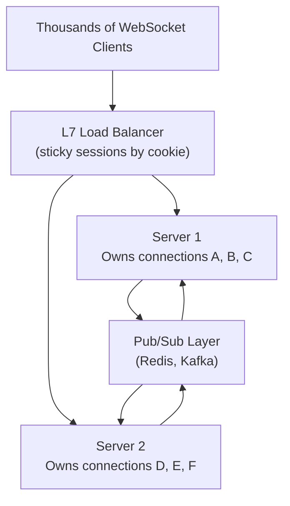

If Server 1 receives a message for a client on Server 2, it must route through a shared pub/sub layer. The pub/sub layer fans the message out to the correct server, which then sends it to its connected client.

### Problems and Mitigations

| Problem | Layer where it lives | Mitigation |
|---|---|---|
| WebSocket connection bound to one server | L4/L7 — connection is TCP-pinned | Sticky sessions at L7 LB by cookie or session ID |
| Server dies, all connections drop | Application | Clients must reconnect with exponential backoff; server must clean up session state |
| Cross-server message fan-out | Application | Pub/sub layer (Redis Pub/Sub, Kafka, or internal message bus) |
| SSE proxy buffering | L7 | `proxy_buffering off` in nginx; `X-Accel-Buffering: no` from app; long `proxy_read_timeout` |
| SSE CDN caching | CDN (L7) | Never route SSE through CDN; bypass to origin directly |
| HTTP/2 connection coalescing | L7 | Clients sharing an L7 proxy may share one HTTP/2 connection; a slow SSE stream blocks teardown |
| WebSocket at L7 without Upgrade support | L7 | Proxy returns 400; must enable upgrade forwarding explicitly |
| Long-polling timeout too short | L4/L7 | Set idle timeout longer than the server's hold timeout |
| Too many concurrent SSE connections | Server | Each SSE connection holds a server thread/handle; use async I/O and connection limits |

### Sticky Sessions

Sticky sessions mean the L7 load balancer always routes a given client to the same backend.

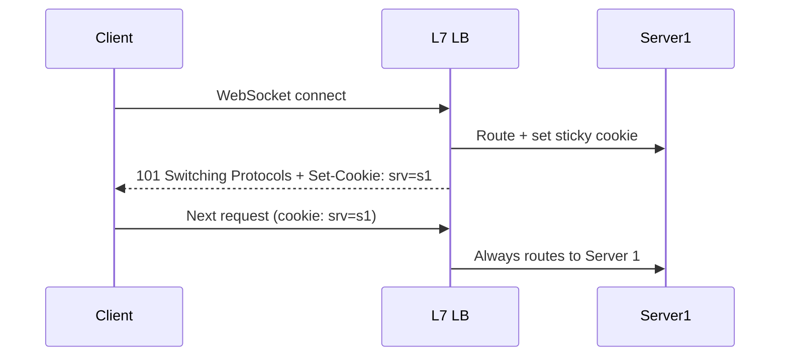

Sticky sessions help with WebSocket. They are a workaround, not a scalability solution — they cause uneven load if some connections are more active than others.

Mental shortcut: **WebSocket connections are sticky; build a pub/sub layer so any server can reach any client.**

<!-- SECTION: final-model - DONE -->

## 10. Final Mental Model

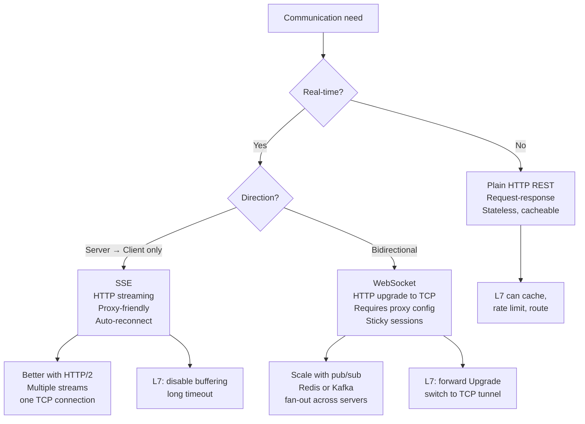

One-line mental model:

```text
HTTP = request-response; SSE = server streams over HTTP; WebSocket = bidirectional TCP tunnel after HTTP handshake.
L4 sees connections. L7 sees requests. SSE and WebSocket need L7 to be explicitly configured.
```

In an interview, a strong answer sounds like:

```text
For this feature I would use SSE because the server pushes updates and the client only reads.
SSE runs over standard HTTP so it works through existing L7 proxies — I just need to disable buffering and set a long idle timeout.
The server can be stateless because each event is pushed to all connected clients.
If I needed the client to also send messages, I would switch to WebSocket,
add sticky sessions at the L7 load balancer, and use Redis Pub/Sub to fan out messages across servers.
```

<!-- SECTION: review-checklist - DONE -->

## 11. 30-Minute Review Checklist

1. Explain the difference between polling, long polling, SSE, and WebSocket in one sentence each.
2. What does L4 see in an HTTP request? What does L7 see?
3. What is the difference between an L4 load balancer and an L7 reverse proxy?
4. What HTTP header triggers a WebSocket upgrade? What status code confirms it?
5. After a WebSocket upgrade, does the L7 proxy still see HTTP? Explain.
6. Why does a default L7 proxy break SSE? How do you fix it?
7. What is `Transfer-Encoding: chunked` and why does SSE need it?
8. Compare HTTP/1.1 keep-alive with HTTP/2 multiplexing.
9. How does HTTP/3 change what L4 sees?
10. Can WebSocket use HTTP/2? Is it commonly deployed?
11. How does SSE behave differently on HTTP/2 vs HTTP/1.1?
12. Why was HTTP/2 server push deprecated, and what replaced it for server push patterns?
13. Explain the WebSocket horizontal scaling problem.
14. What are sticky sessions? Why are they needed for WebSocket and not for SSE?
15. How does a pub/sub layer (Redis) solve the cross-server WebSocket message problem?
16. Why should SSE responses never be routed through a CDN?
17. When would you choose SSE over WebSocket? Name two reasons.
18. When would you choose WebSocket over SSE? Name two reasons.
19. What nginx configuration changes are needed to support WebSocket at L7?
20. Design the communication layer for a live sports scoreboard. Explain your protocol choice, proxy config, and scaling approach.
