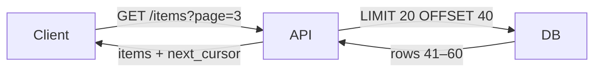
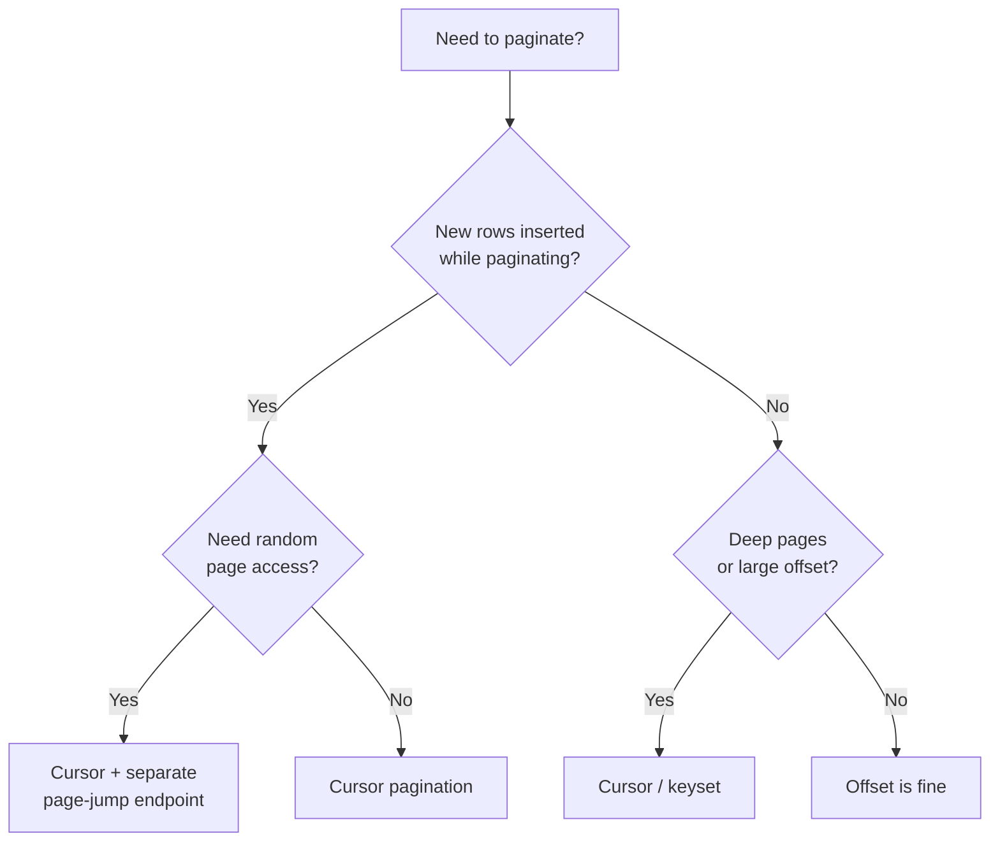

# Pagination Study Guide

Goal: explain offset vs cursor-based pagination clearly enough to choose the right approach in a system design interview and defend that choice under follow-up questions.

## Table of Contents

1. [Mental Model](#1-mental-model)
2. [Offset Pagination](#2-offset-pagination)
3. [Cursor-Based Pagination](#3-cursor-based-pagination)
4. [Keyset Pagination (Under the Hood)](#4-keyset-pagination-under-the-hood)
5. [Comparison Table](#5-comparison-table)
6. [Interview Talking Points](#6-interview-talking-points)
7. [How to Choose](#7-how-to-choose)
8. [Review Checklist](#8-review-checklist)

---

## 1. Mental Model

When a query returns thousands of rows, returning all of them at once is impractical — it overloads the DB, the network, and the client. Pagination breaks the result set into pages, returning one chunk at a time.

The core tradeoff:

> **Simplicity vs. stability.** Offset pagination is easy to implement but fragile under mutations. Cursor pagination is stable and efficient but loses random access.



The two questions that drive the choice:
1. Is new data being inserted while the user is paginating?
2. Does the user need to jump to an arbitrary page number?

---

## 2. Offset Pagination

### How it works

Pass a `page` number or raw `offset` as a query parameter. The DB skips `offset` rows and returns the next `limit`.

```sql
SELECT * FROM posts
ORDER BY created_at DESC
LIMIT 20 OFFSET 100;
```

The API contract:
```
GET /posts?page=6&limit=20
→ { items: [...], total: 500, page: 6 }
```

### The problems

**Scan cost** — the DB must read and discard `offset` rows before returning anything. `OFFSET 10000` on a large table is slow even with an index.

**Shifting rows** — if a new post is inserted while a user is on page 2, every subsequent page shifts by one row. The user sees a duplicate or skips an item.

```
Page 1 loaded:  [A, B, C, D, E]
New item X inserted at top
Page 2 loaded:  [E, F, G, H, I]   ← E is duplicated
```

### When offset is fine

- Total result set is small and bounded (search results, admin tables)
- Data is mostly static or append-only with low frequency
- Users need to jump to page N directly ("go to page 47")
- You want to show a total count

---

## 3. Cursor-Based Pagination

### How it works

Instead of a page number, the server returns an opaque `cursor` token with each response. The client passes it back to get the next page.

The cursor encodes the position of the last item seen — typically a unique, ordered field like `id` or a `(timestamp, id)` tuple.

```
GET /posts                         → { items: [...], next_cursor: "eyJpZCI6MTAwfQ==" }
GET /posts?cursor=eyJpZCI6MTAwfQ== → { items: [...], next_cursor: "eyJpZCI6ODB9" }
```

The cursor is base64-encoded JSON so clients treat it as opaque:
```json
{ "id": 100 }  →  "eyJpZCI6MTAwfQ=="
```

The DB query uses a `WHERE` clause instead of `OFFSET`:
```sql
SELECT * FROM posts
WHERE id < 100          -- decoded from cursor
ORDER BY id DESC
LIMIT 20;
```

### Why it's stable

New inserts don't affect the cursor position. The query anchors to a specific row, not a row count.

```
Page 1 loaded, cursor = id 100
New item X inserted (id 200)
Page 2 query: WHERE id < 100  →  [99, 98, 97 ...]   ← unaffected
```

### The limitations

- No random access — you cannot jump to page 47 without walking every prior page
- No total count (without a separate COUNT query)
- Sort column must be unique or stable (use a compound cursor if not)
- Implementation is more complex than `OFFSET`

---

## 4. Keyset Pagination (Under the Hood)

Keyset pagination is the DB-level mechanism that makes cursor pagination fast. It filters on an indexed column instead of scanning rows:

```sql
-- Offset (slow on deep pages)
SELECT * FROM posts ORDER BY created_at DESC LIMIT 20 OFFSET 10000;

-- Keyset (always fast)
SELECT * FROM posts
WHERE created_at < '2024-01-15 10:00:00'
ORDER BY created_at DESC LIMIT 20;
```

The keyset query uses the index directly — it does not scan and discard rows.

**Compound keyset for non-unique sort columns:**

`created_at` alone can have ties. Use `(created_at, id)` to break them deterministically:

```sql
SELECT * FROM posts
WHERE (created_at, id) < ('2024-01-15 10:00:00', 500)
ORDER BY created_at DESC, id DESC
LIMIT 20;
```

The cursor encodes both fields:
```json
{ "created_at": "2024-01-15T10:00:00Z", "id": 500 }
```

---

## 5. Comparison Table

| Dimension | Offset | Cursor |
|---|---|---|
| Implementation | Simple | Moderate |
| DB performance (deep pages) | Degrades (O(offset) scan) | Constant |
| Stable under inserts | No — rows shift | Yes — anchored to position |
| Random page access | Yes | No |
| Total count | Easy | Requires separate query |
| Infinite scroll / feeds | Poor | Good |
| Admin table with page numbers | Good | Poor |

---

## 6. Interview Talking Points

> "Offset pagination is simple — just `LIMIT` and `OFFSET` in SQL — but it breaks when rows are inserted mid-session because every subsequent page shifts. It also gets slow on deep pages since the DB has to scan and discard all prior rows."

> "Cursor pagination encodes the position of the last item seen as an opaque token. The next query uses `WHERE id < last_id` instead of `OFFSET`, so it's always a fast index seek, and inserts don't shift anything."

> "I'd use cursor pagination for anything with real-time data: activity feeds, notification lists, chat history. Offset is fine for search results or admin tables where the data is stable and users want to jump to a specific page."

> "The cursor should be opaque — base64-encoded — so the client can't depend on its internal structure. If I'm sorting by `created_at`, I'd use a compound cursor with `(created_at, id)` to handle timestamp ties."

> "If someone asks for infinite scroll, that's a strong signal for cursor. If they ask for 'show page 5 of 10', that's offset."

---

## 7. How to Choose



**Rules of thumb:**
- Infinite scroll, feeds, timelines → cursor
- Search results, reports, admin tables → offset
- Large dataset + performance matters → cursor / keyset
- Need a total page count → offset (or cursor + separate COUNT)

---

## 8. Review Checklist

- [ ] Can explain `LIMIT/OFFSET` and why deep pages are slow
- [ ] Can explain the row-shifting problem with a concrete example
- [ ] Can describe how a cursor token is generated and decoded
- [ ] Can write the keyset SQL (`WHERE id < last_id ORDER BY id LIMIT n`)
- [ ] Can explain compound cursors and when they're needed
- [ ] Can state when to use offset vs cursor in one sentence each
- [ ] Know that cursor tokens should be opaque to the client
