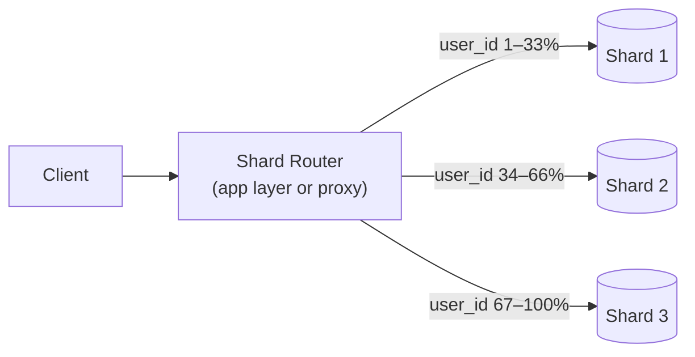
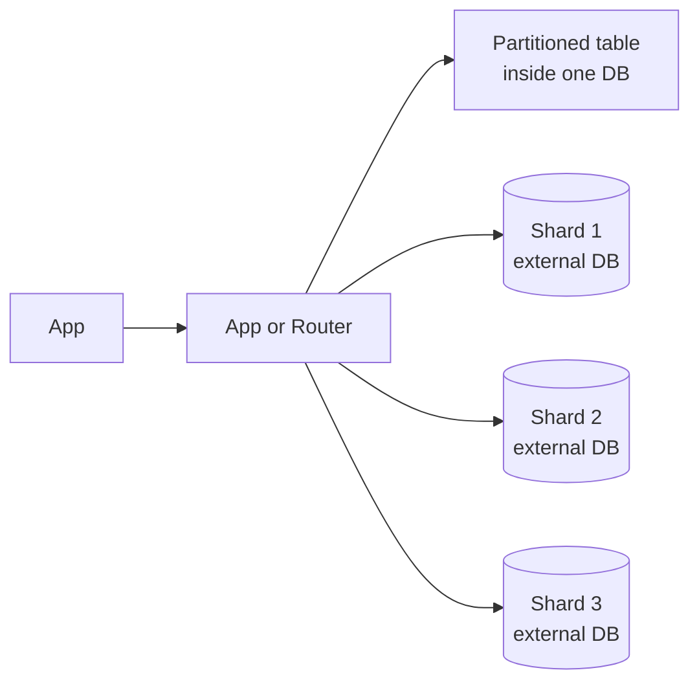
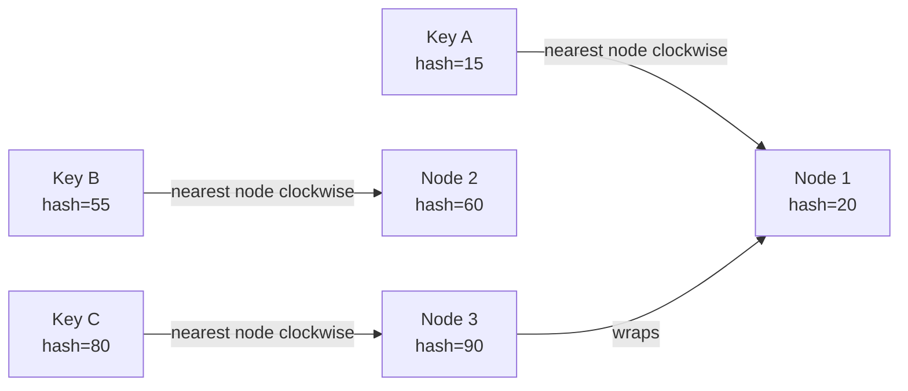
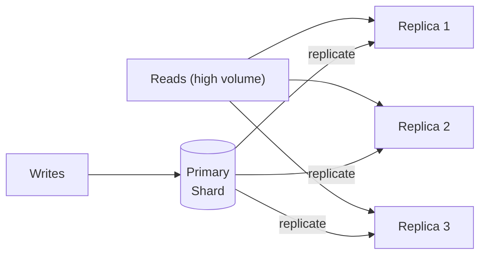
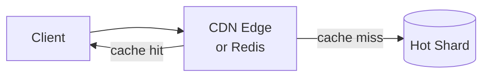
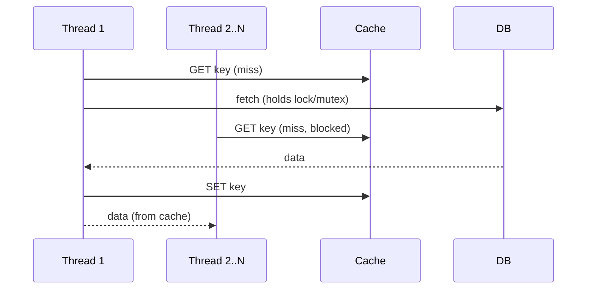
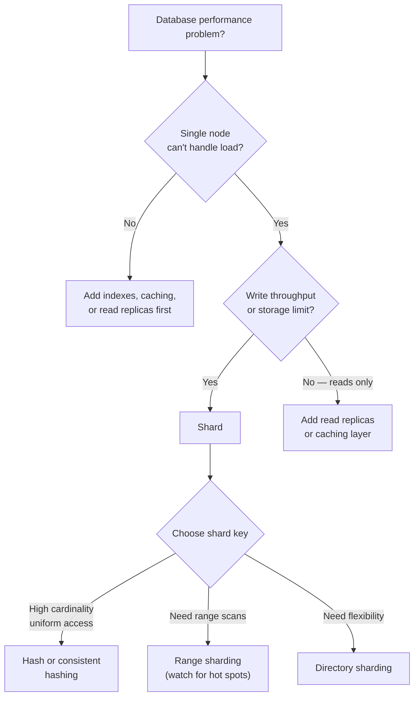

# Sharding and Partitioning Study Guide

Goal: understand sharding and partitioning well enough to design a data distribution strategy, handle hot spots, and defend your choices under follow-up questions in a system design interview.

## Table of Contents

1. [Mental Model](#1-mental-model)
2. [Partitioning vs Sharding](#2-partitioning-vs-sharding)
3. [Sharding Strategies](#3-sharding-strategies)
4. [Consistent Hashing and Virtual Nodes](#4-consistent-hashing-and-virtual-nodes)
5. [Hot Spots — What They Are and How Production Systems Fix Them](#5-hot-spots--what-they-are-and-how-production-systems-fix-them)
6. [Rebalancing](#6-rebalancing)
7. [Cross-Shard Queries and Distributed Transactions](#7-cross-shard-queries-and-distributed-transactions)
8. [Decision Guide: When to Shard](#8-decision-guide-when-to-shard)
9. [Interview Talking Points](#9-interview-talking-points)
10. [Review Checklist](#10-review-checklist)

---

## 1. Mental Model

A single database node has physical limits: CPU, RAM, and disk. When one machine can no longer handle the data volume or request rate, you split the data across multiple nodes.

> **Core tradeoff: scalability vs. complexity.**  
> Sharding lets you scale beyond one machine but introduces routing, rebalancing, cross-shard queries, hot spots, and harder operations. Shard as late as you can justify.



Two questions anchor every sharding decision:
1. What is the shard key? (the field that determines which shard a row lives on)
2. What are the access patterns? (determines whether the key will cause hot spots)

Mental shortcut: **pick a shard key with high cardinality and uniform access, then resist the urge to shard early.**

---

## 2. Partitioning vs Sharding



- **Partitioning** splits one logical table into smaller pieces, often inside one database instance. PostgreSQL supports range, list, and hash partitioning natively.
- **Why partition:** partition pruning, smaller per-partition indexes, easier bulk load/delete, lifecycle management (e.g., drop old partitions instead of DELETE).
- **Sharding** distributes data across multiple separate databases or servers. Each shard is an independent node that owns a subset of the data.
- **Why shard:** scale storage, write throughput, or read throughput beyond what one machine can provide; improve fault isolation; support geographic distribution.
- **Sharding costs:** routing logic, rebalancing complexity, cross-shard joins, distributed transactions, uneven hot shards, and harder operations.

Mental shortcut: **all sharding is partitioning, but not all partitioning is sharding.**

---

## 3. Sharding Strategies

### Range Sharding

Rows with keys in a given range go to the same shard.

```
Shard 1: user_id  1 – 1,000,000
Shard 2: user_id  1,000,001 – 2,000,000
Shard 3: user_id  2,000,001 – 3,000,000
```

**Pros:** easy to reason about, supports range scans efficiently.  
**Cons:** prone to hot spots if traffic isn't uniformly distributed across the range (e.g., new users always land on the last shard).

### Hash Sharding

Apply a hash function to the shard key and use the result modulo N shards.

```
shard = hash(user_id) % num_shards
```

**Pros:** distributes data uniformly; no hot spots from skewed key ranges.  
**Cons:** range queries become scatter-gather across all shards; resharding changes the modulus, which invalidates most assignments.

### Directory / Lookup Sharding

A separate lookup table maps each key (or key range) to its shard. The router consults this table on every request.

```
user_id 42 → Shard 3
user_id 99 → Shard 1
```

**Pros:** full flexibility; can hand-move individual hot keys without resharding.  
**Cons:** the lookup table itself becomes a bottleneck and single point of failure unless carefully replicated and cached.

### Strategy Comparison

| Strategy | Distribution | Range scans | Resharding | Hot spot risk |
|---|---|---|---|---|
| Range | Uneven if traffic skews | Efficient | Easy (add new ranges) | High for sequential keys |
| Hash | Uniform | Scatter-gather | Hard (changes all assignments) | Low |
| Directory | Configurable | Depends | Easy (update the map) | Controllable |

---

## 4. Consistent Hashing and Virtual Nodes

Standard hash sharding (`hash(key) % N`) breaks when N changes — almost every key remaps. Consistent hashing fixes this by placing both nodes and keys on a circular hash ring. Adding or removing a node only remaps the keys on the arc adjacent to that node, not the entire dataset.



**Virtual nodes (vnodes):** instead of one point per physical node, each node owns many small virtual points spread across the ring. When a physical node is added or removed, its virtual nodes are redistributed individually, balancing load more evenly.

| Approach | Keys remapped on node change | Load balance |
|---|---|---|
| Hash mod N | All | Uniform if N is static |
| Consistent hashing (1 token/node) | ~1/N of keys | Uneven (large arc = more keys) |
| Consistent hashing + vnodes | ~1/N of keys | Even |

**Used by:** Cassandra, DynamoDB, Amazon's internal systems.

Mental shortcut: **consistent hashing + vnodes gives you graceful resharding with even load — it's the default choice for distributed key-value stores.**

---

## 5. Hot Spots — What They Are and How Production Systems Fix Them

A hot spot occurs when one shard receives disproportionate traffic while others sit idle. The canonical example: Taylor Swift's data on one shard getting hammered when she announces a tour.

Hot spots have two flavors:
- **Read hot spots:** one record is read at very high rate (celebrity profile, viral post)
- **Write hot spots:** one key receives continuous writes (a global counter, a trending topic, a last-write-wins record)

### Mitigation 1: Read Replicas

Route reads to replicas of the hot shard; writes still go to the primary.



**Best for:** read-heavy hot spots. Most common first line of defense. Works without changing the shard key or data model.

### Mitigation 2: Application-Layer Caching (CDN / Redis)

Put a cache in front of the hot shard. The shard only sees cache misses.



**Best for:** read-heavy hot spots where data changes slowly. During a Taylor Swift tour announcement, CDN absorbs 99%+ of reads before they reach the database. Combine with read replicas for defense in depth.

### Mitigation 3: Key Salting + Scatter-Gather

For write-heavy hot keys, append a random suffix to spread writes across multiple shards:

```
# Instead of one key:
taylor_swift

# Salt it across N buckets:
taylor_swift_0, taylor_swift_1, ..., taylor_swift_N-1
```

Writes hash to different shards. Reads must query all N shards and merge the results — this is the **scatter-gather** pattern.

**Best for:** write-heavy hot spots (counters, leaderboards, trending data). The cost is read-time fan-out and merge logic.

### Mitigation 4: Request Coalescing / Thundering Herd Protection

When a cached hot key expires, thousands of requests can simultaneously miss and hammer the underlying shard. Coalescing ensures only one thread fetches from the DB on expiry; the rest wait and share the result.



**Best for:** any cache layer in front of a hot shard. Prevents the "cache stampede" pattern.

### Mitigation 5: Consistent Hashing + Virtual Nodes

When a physical node is overwhelmed, move some of its virtual nodes to another machine. Traffic is redistributed without a full reshard. (See §4.)

**Best for:** infrastructure-level rebalancing where the hot spot is a structural imbalance in the ring.

### Mitigation 6: Adaptive / Manual Resharding

Some systems monitor per-shard QPS and automatically split hot shards:
- **Vitess, CockroachDB**: auto-split hot shards in real time based on load metrics
- **Older Cassandra / MySQL setups**: ops team manually adds nodes and rebalances

**Best for:** long-term structural hot spots that can't be fixed at the application or cache layer.

### Summary: Which Mitigation to Reach For

| Mechanism | Solves | When to use | Real-world example |
|---|---|---|---|
| Read replicas | Read hot spot | Always try first; no data model change | MySQL RDS read replicas, Postgres replicas |
| CDN / Redis cache | Read hot spot | Slowly-changing or cacheable data | Cloudflare + any DB, Redis in front of MySQL |
| Key salting + scatter-gather | Write hot spot | High write rate to one key | Twitter likes counters, DynamoDB hot partitions |
| Request coalescing | Cache stampede | Any cache-fronted shard | Redis mutex lock, Nginx proxy_cache_lock |
| Virtual node rebalancing | Structural imbalance | Ring-based store | Cassandra, DynamoDB |
| Adaptive resharding | Long-term structural hot | Write-heavy, can't cache | CockroachDB auto-split, Vitess |

Mental shortcut: **the real-world stack is layered — CDN → Redis → read replicas → virtual node rebalancing. No single mechanism is sufficient.**

---

## 6. Rebalancing

When you add or remove nodes, keys need to move to the new assignment. Three strategies:

**Fixed number of partitions:** pre-create many more partitions than nodes (e.g., 1000 partitions for 10 nodes). When a node is added, some partitions are moved to it. Partition count never changes; only partition-to-node assignment does. Used by Elasticsearch, Riak.

**Dynamic partitioning:** partitions split when they exceed a size threshold and merge when they fall below it. Number of partitions grows with data. Used by HBase, MongoDB.

**Consistent hashing with vnodes:** add a node, it picks up vnodes from neighbors. No fixed partition count required.

**The key constraint:** rebalancing while the system is live means data is moving under live traffic. Two approaches:
- **Automatic rebalancing:** convenient but can overload the network at the wrong time
- **Manual approval:** ops team triggers rebalancing during low-traffic windows

---

## 7. Cross-Shard Queries and Distributed Transactions

Sharding's biggest operational cost is queries that span multiple shards.

**Scatter-gather:** fan out the query to all (or relevant) shards, collect and merge results at the application layer. Expensive — latency is bounded by the slowest shard.

**Cross-shard joins:** not possible in SQL across shards. Options:
1. Denormalize — duplicate the joined data into the same shard
2. Fetch from multiple shards and join in application code
3. Route all related data to the same shard (co-location) — requires careful shard key choice

**Distributed transactions:** if a single business operation writes to multiple shards, you need either:
- **Two-phase commit (2PC):** strong consistency, but slow and blocking
- **Saga pattern:** eventual consistency through compensating transactions (preferred for microservices)

Mental shortcut: **the best cross-shard query is the one you avoid — design your shard key so related data lands on the same shard.**

---

## 8. Decision Guide: When to Shard



**Rules of thumb:**
- Exhaust vertical scaling, indexes, caching, and read replicas before sharding
- Shard key must have high cardinality (many distinct values) to avoid hot spots
- Avoid shard keys that trend in one direction (auto-increment IDs, timestamps) — they make the newest shard a hot spot
- User ID is often a safe shard key; email or username can work if hashed

---

## 9. Interview Talking Points

> "Sharding is the last resort after vertical scaling, indexes, read replicas, and caching. I'd reach for it when write throughput or storage genuinely exceeds what one machine can provide."

> "The shard key is the most important decision. It needs high cardinality and uniform access. Auto-increment IDs and timestamps trend in one direction — the newest shard becomes a write hot spot."

> "For read hot spots, I'd start with read replicas and a caching layer — Redis or CDN. That usually absorbs 90–99% of the traffic without touching the data model."

> "For write hot spots on a single key, key salting breaks the key into N buckets. Writes spread across shards; reads scatter-gather and merge. It's a deliberate tradeoff: worse read complexity for better write scalability."

> "Cross-shard joins are painful. I'd design the shard key so related data is co-located on the same shard, or denormalize to avoid the join."

> "Consistent hashing with virtual nodes is what Cassandra and DynamoDB use. When a node is added, only the keys on adjacent arcs move — not the entire dataset."

---

## 10. Review Checklist

- [ ] Can explain the difference between partitioning and sharding with a concrete example
- [ ] Can name all three sharding strategies (range, hash, directory) and state one pro/con each
- [ ] Can explain why `hash(key) % N` breaks during resharding and how consistent hashing fixes it
- [ ] Can explain virtual nodes and why they improve load balance on the hash ring
- [ ] Can describe at least 4 hot spot mitigations and state which flavor of hot spot (read vs. write) each addresses
- [ ] Can explain the thundering herd problem and how request coalescing prevents it
- [ ] Can explain key salting and the scatter-gather read pattern it requires
- [ ] Can articulate why cross-shard joins are expensive and how to avoid them
- [ ] Know when to reach for 2PC vs. the saga pattern for distributed transactions across shards
- [ ] Can state the decision criteria for when to shard vs. when to add replicas or caching
