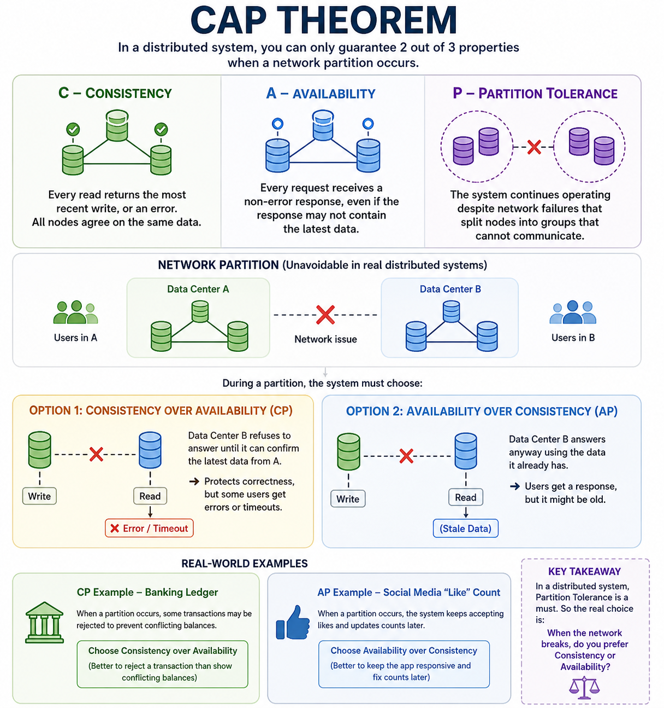
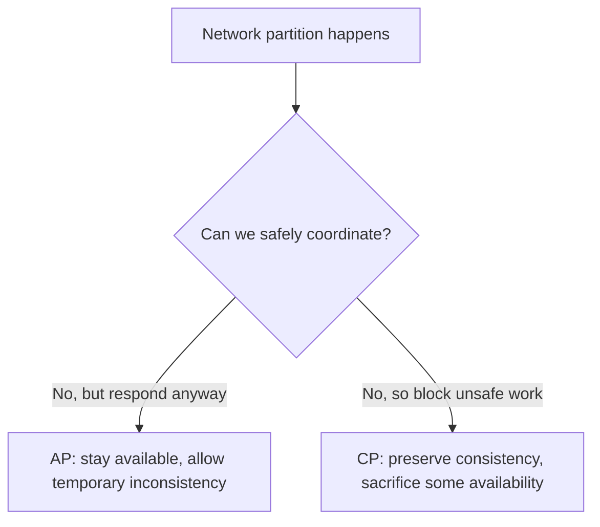
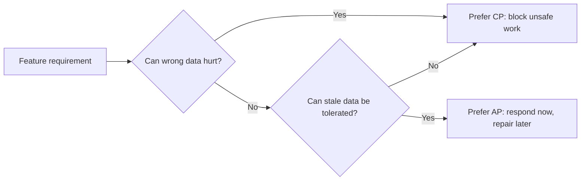

# 2.1 CAP Theorem 30-Minute Study Guide

Goal: understand CAP theorem well enough to explain the tradeoff in a system design interview. Read the diagram first, then use the examples to lock in the mental model.

Related: [2.2 PACELC theorem guide](2.2.pacelc-theorem-study-guide.md) — latency vs consistency when the network is healthy (the Else branch)

<!-- SECTION: table-of-contents - DONE -->

## Table of Contents

1. [The CAP Mental Model](#1-the-cap-mental-model)
2. [What Each Letter Means](#2-what-each-letter-means)
3. [Why Partition Changes the Question](#3-why-partition-changes-the-question)
4. [AP Example: Global Likes](#4-ap-example-global-likes)
5. [CP Example: Payments and Inventory](#5-cp-example-payments-and-inventory)
6. [How to Choose CP vs AP](#6-how-to-choose-cp-vs-ap)
7. [Interview Language](#7-interview-language)
8. [Final Mental Model](#8-final-mental-model)
9. [30-Minute Review Checklist](#9-30-minute-review-checklist)

<!-- SECTION: cap-mental-model - DONE -->

## 1. The CAP Mental Model

CAP theorem applies to **distributed systems**: systems with multiple nodes, databases, replicas, services, or regions that need to coordinate over a network.



The practical CAP question is:

> When the network breaks, should the system protect correctness or keep responding?

In real distributed systems, **partition tolerance is not optional** because network failures can happen. So CAP is usually not "pick any two" in the abstract. It is mostly:

```text
During a partition:
choose Consistency or Availability.
```

Mental shortcut: **CAP is about behavior during network partitions, not normal healthy operation.**

<!-- SECTION: letters - DONE -->

## 2. What Each Letter Means

| Letter | Meaning | Beginner explanation |
|---|---|---|
| C | Consistency | Every successful read sees the latest correct data |
| A | Availability | Every request receives a non-error response |
| P | Partition tolerance | The system continues operating when nodes cannot talk to each other |

### Consistency

Consistency means the system avoids returning stale or conflicting data. If one region updates a value, other regions should not claim an older value is correct.

Example:

```text
Inventory = 1 item left
```

A consistent system should not let two regions both sell that final item.

### Availability

Availability means each request gets a response, even if the response might be based on local or stale state.

Example:

```text
User clicks Like
→ Local region accepts the like
→ Other regions may see it later
```

### Partition Tolerance

A partition means parts of the system are still running, but cannot communicate.

```text
USA Region        network partition        Europe Region
Local DB works                             Local DB works
Cross-region sync is broken
```

Mental shortcut: **a partition is not always user-facing downtime; it can be backend nodes losing contact with each other.**

<!-- SECTION: partition-question - DONE -->

## 3. Why Partition Changes the Question

When there is no partition, many systems can provide both useful consistency and availability.

During a partition, the system faces a forced choice:



If both sides keep accepting writes independently, they may disagree. If one side refuses unsafe writes, some users may see errors or timeouts.

Mental shortcut: **AP says "accept now, fix later." CP says "do not answer unless it is safe."**

<!-- SECTION: ap-likes - DONE -->

## 4. AP Example: Global Likes

Likes, view counts, comments counters, feeds, recommendations, analytics, and notifications often prefer **Availability over Consistency**.

Initial state:

```text
article_123 likes = 100
```

A partition happens between USA and Europe.

```text
USA users add 5 likes
Europe users add 3 likes
```

During the partition:

```text
USA DB:    likes = 105
Europe DB: likes = 103
```

This is temporarily inconsistent, but users can still like the article.

After the partition heals:

```text
USA and Europe exchange missing events
Final likes = 108
```

This is **eventual consistency**.

AP design usually relies on:

- Local writes per region
- Async replication
- Durable event logs
- Idempotent operations
- Conflict resolution or reconciliation

Mental shortcut: **AP design accepts local writes now and synchronizes globally later.**

<!-- SECTION: cp-critical - DONE -->

## 5. CP Example: Payments and Inventory

Payments, bank balances, permissions, seat booking, inventory reservation, and order state transitions often prefer **Consistency over Availability**.

Example:

```text
Inventory = 1 item left
```

During a partition, USA and Europe both think the item is available.

If both regions sell it independently:

```text
USA sale = 1 item
Europe sale = 1 item
Total sold = 2
Actual inventory = 1
```

That is incorrect. A CP system may reject, delay, or timeout one side until it can confirm the latest state.

```text
Cannot confirm inventory owner
→ reject or delay reservation
→ avoid overselling
```

CP design usually relies on:

- Leader-based writes
- Quorum reads and writes
- Transactions
- Consensus
- Distributed locks for carefully scoped cases
- Fail-fast behavior for unsafe operations

Mental shortcut: **CP design protects correctness even when some users temporarily cannot complete the action.**

<!-- SECTION: choose - DONE -->

## 6. How to Choose CP vs AP

Apply CAP **feature by feature**, not to the whole system.

| Feature | Likely choice | Reason |
|---|---|---|
| Product catalog | AP | Slightly stale product info is acceptable |
| Likes and view counts | AP | Counts can be corrected later |
| Search results | AP | Stale results are usually tolerable |
| Recommendations | AP | Freshness is useful but not correctness-critical |
| Cart | Usually AP | Temporary sync delay is often acceptable |
| Inventory reservation | CP | Prevent overselling |
| Payment authorization | CP | Avoid incorrect charges or double-spend |
| Permissions | CP | Avoid unauthorized access |
| Order state transitions | Usually CP | Avoid impossible states like shipped before paid |

Ask four questions:

1. Can users tolerate stale data?
2. Can the system tolerate conflicting writes?
3. Is it better to fail than return wrong data?
4. Is it better to return stale data than fail?

If stale data is acceptable, AP may be a good fit. If wrong data creates financial, security, legal, or inventory problems, prefer CP.

<!-- SECTION: interview-language - DONE -->

## 7. Interview Language

For AP systems, use terms like:

```text
eventual consistency
async replication
local writes
conflict resolution
reconciliation
idempotency
message queues
```

AP answer:

> For likes, I would choose availability over consistency. Each region can accept likes locally and replicate events asynchronously. Users may temporarily see stale counts, but reconciliation will converge the final value after the partition heals.

For CP systems, use terms like:

```text
strong consistency
leader-based writes
quorum
transactions
consensus
fail fast
```

CP answer:

> For payments, I would choose consistency over availability. If the system cannot confirm the latest account state, it should reject or delay the transaction rather than risk double-spending or incorrect charges.

<!-- SECTION: final-model - DONE -->

## 8. Final Mental Model



CAP is not about labeling a whole application as CP or AP. A real system often mixes both:

- The same ecommerce site may use AP for product browsing and CP for inventory reservation.
- The same social app may use AP for likes and CP for account permissions.
- The same banking app may use AP for marketing content and CP for balance-changing operations.

One-line mental model:

```text
During a partition, AP protects responsiveness and CP protects correctness.
```

<!-- SECTION: review-checklist - DONE -->

## 9. 30-Minute Review Checklist

1. Explain why CAP matters only for distributed systems.
2. Define consistency, availability, and partition tolerance in plain English.
3. Explain why partition tolerance is usually required in real systems.
4. Describe the difference between user-facing downtime and backend network partition.
5. Walk through the global likes AP example from 100 likes to 108 likes.
6. Explain why eventual consistency is acceptable for likes but dangerous for payments.
7. Walk through the inventory oversell example.
8. Name three mechanisms used in AP designs.
9. Name three mechanisms used in CP designs.
10. Explain why CAP should be applied feature by feature.
11. Classify product catalog, likes, payments, inventory, permissions, and order state as CP or AP.
12. Give one interview-ready AP answer and one interview-ready CP answer.
