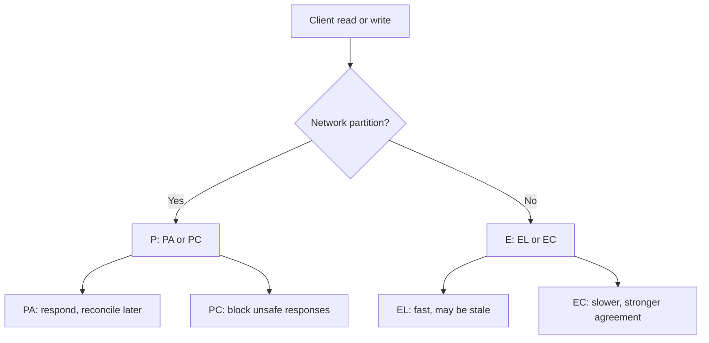
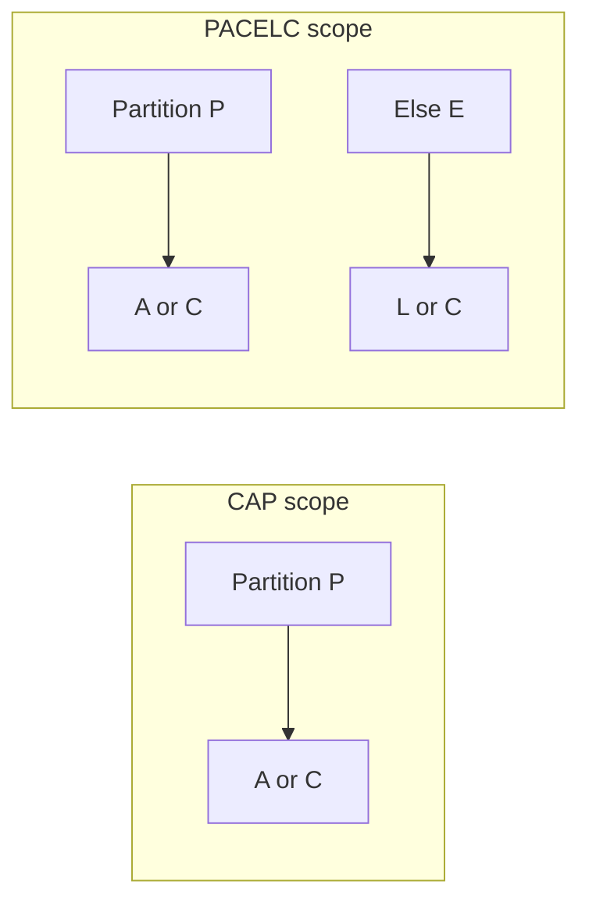
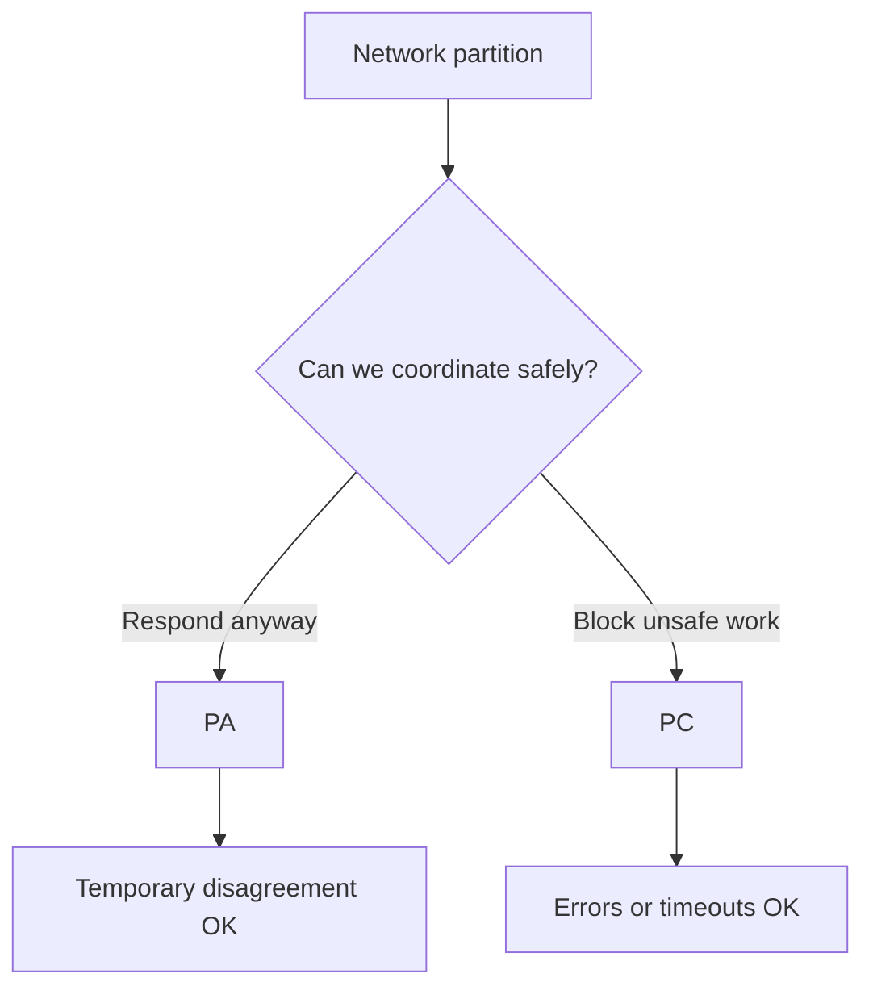
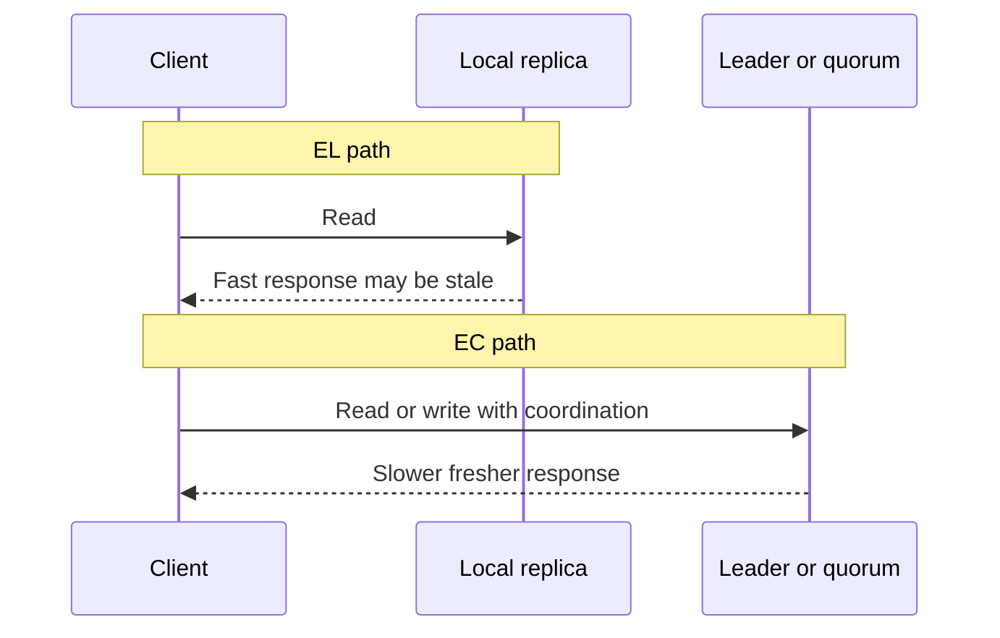
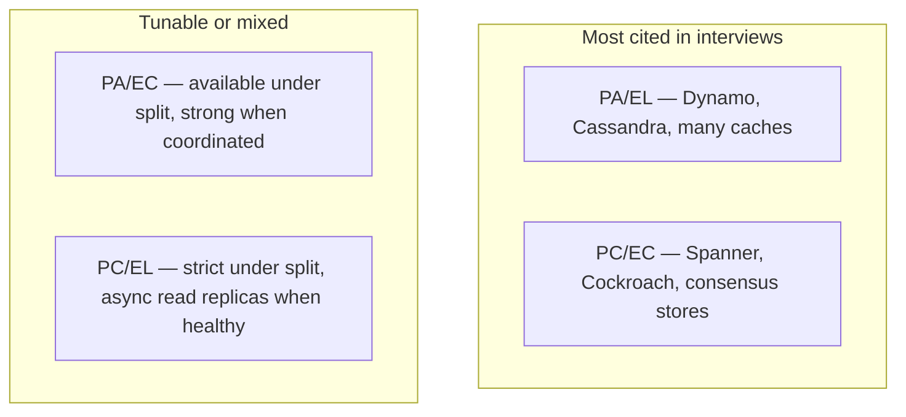
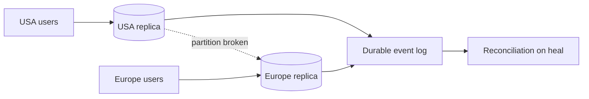
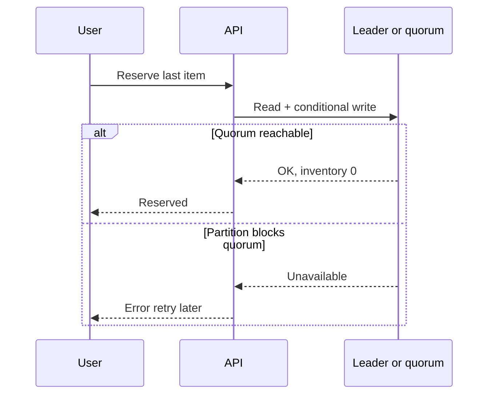
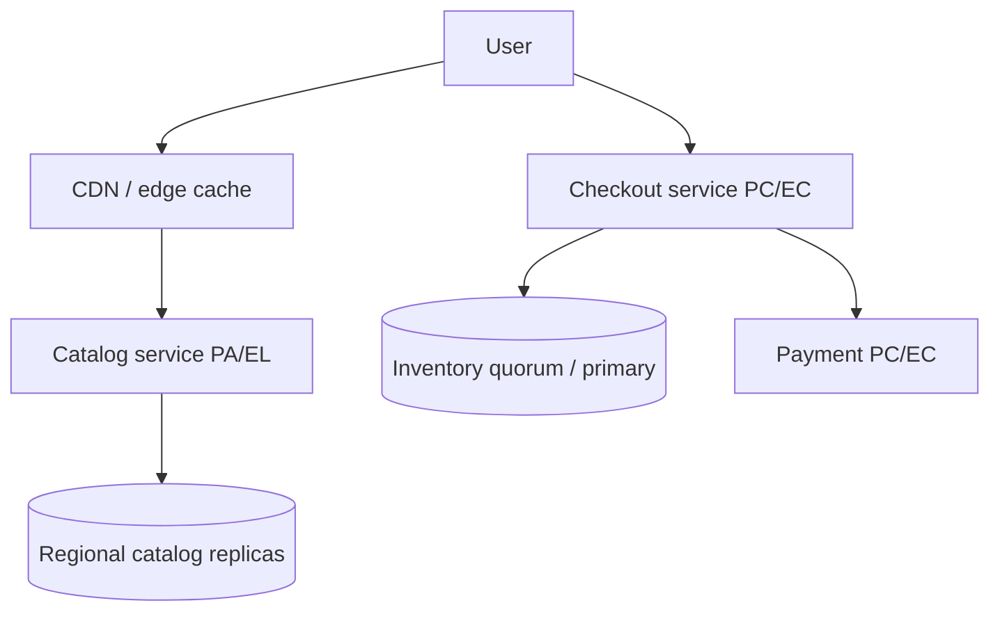
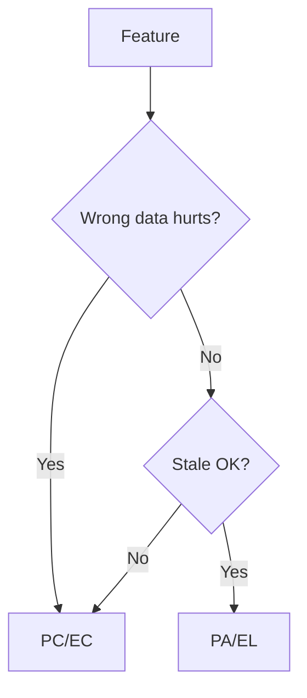
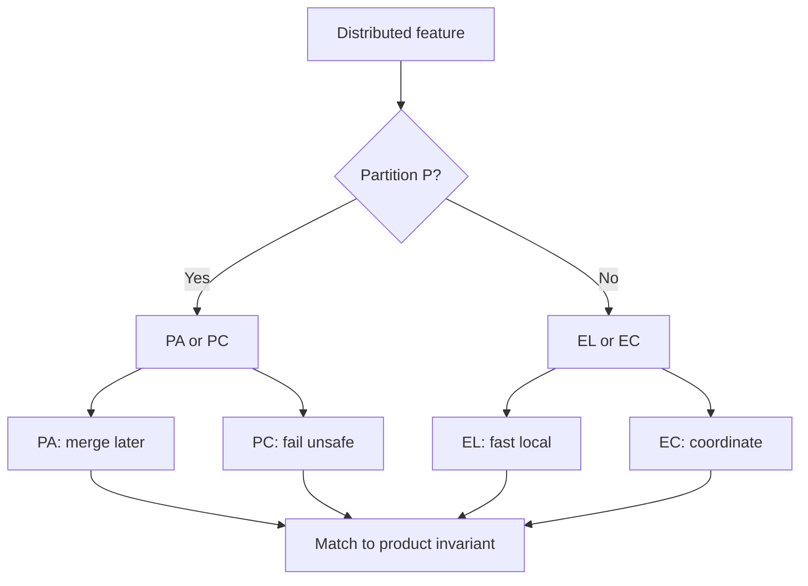

# 2.2 PACELC Theorem 30–45 Minute Study Guide

Goal: understand PACELC well enough to explain how distributed databases trade off consistency, availability, and latency—during partitions and during normal operation—with detailed examples and interview-ready talking points.

Numbered **2.2** as a companion to **2.1 CAP**—same topic family (distributed consistency tradeoffs), not a separate top-level track.

Related:
- [2.1 CAP theorem guide](2.1.cap-theorem-study-guide.md) — partition branch (PA vs PC); global likes and payments examples
- [RDBMS, NoSQL, ACID, and BASE guide §4–5](5.rdbms-nosql-acid-study-guide.md#4-acid-transactions) — ACID vs BASE; ACID-C vs CAP/PACELC-C
- [Availability guide](3.Availability-study-guide.md) — replication, multi-region behavior

PACELC extends CAP (Daniel Abadi, 2012): **when the network is healthy, you still choose between latency and consistency.**

<!-- SECTION: table-of-contents - DONE -->

## Table of Contents

1. [PACELC Mental Model](#1-pacelc-mental-model)
2. [Letters and Definitions](#2-letters-and-definitions)
3. [The Partition Branch (PA vs PC)](#3-the-partition-branch-pa-vs-pc)
4. [The Else Branch (EL vs EC)](#4-the-else-branch-el-vs-ec)
5. [The Four PACELC Labels](#5-the-four-pacelc-labels)
6. [Consistency Levels Cheat Sheet](#6-consistency-levels-cheat-sheet)
7. [What Drives Latency (L)](#7-what-drives-latency-l)
8. [Worked Example: Global Likes (PA/EL)](#8-worked-example-global-likes-pael)
9. [Worked Example: Payments and Inventory (PC/EC)](#9-worked-example-payments-and-inventory-pcec)
10. [Worked Example: E-Commerce Mixed](#10-worked-example-e-commerce-mixed)
11. [Database and Store Classifications](#11-database-and-store-classifications)
12. [Feature-by-Feature in One System](#12-feature-by-feature-in-one-system)
13. [PACELC vs CAP vs BASE vs ACID](#13-pacelc-vs-cap-vs-base-vs-acid)
14. [Design Warnings](#14-design-warnings)
15. [Interview Language](#15-interview-language)
16. [Final Mental Model and Review Checklist](#16-final-mental-model-and-review-checklist)

<!-- SECTION: mental-model - DONE -->

## 1. PACELC Mental Model

**CAP** applies to distributed systems during a **network partition (P)**:

> Choose **Availability (A)** or **Consistency (C)**.

**PACELC** adds a second question for **normal operation (Else)**:

> When there is **no partition**, choose **Latency (L)** or **Consistency (C)**.



### Why CAP Alone Is Incomplete

Many databases are described as "AP" because they stay available during partitions. That label hides everyday behavior:

- Reads from a **local replica** (low latency, possibly stale) → **EL**
- Reads from **leader or quorum** (higher latency, fresher) → **EC**

Interviewers often follow "Are you AP or CP?" with "What consistency do reads get in the happy path?" PACELC answers that directly.

### Scope

| Applies to | Does not replace |
|---|---|
| Distributed databases, multi-region replicas, quorum systems | Single-node Postgres on one machine (ACID only) |
| Feature-level design (likes vs payments) | End-to-end product labeling |

The practical PACELC question is:

> **During a partition, do we favor A or C? When healthy, do we favor L or C for this feature?**

Mental shortcut: **CAP is the outage branch; PACELC adds the everyday latency branch.**



<!-- SECTION: letters - DONE -->

## 2. Letters and Definitions

| Letter | In PACELC | Meaning |
|---|---|---|
| **P** | Partition | Nodes cannot communicate reliably across a split |
| **A** | Availability | Every request gets a non-error response (CAP sense) |
| **C** | Consistency | Linearizability-style agreement on latest value (CAP/PACELC sense) |
| **E** | Else | No partition; network is healthy |
| **L** | Latency | Low response time; often via local or single-replica reads |

A system is labeled with **two pairs**, e.g. **PA/EL** or **PC/EC**:

```text
PA/EL  →  During partition: Availability; Else: Latency
PC/EC  →  During partition: Consistency; Else: Consistency
```

### Three Different "Consistency" Words (Interview Critical)

| Term | Layer | Meaning |
|---|---|---|
| **ACID Consistency** | Single database transaction | Valid state transitions; constraints (FK, unique) |
| **CAP / PACELC Consistency** | Distributed replicas | All nodes agree on the latest write order |
| **Eventual consistency** | Distributed, BASE-style | Replicas converge if writes stop |

**Talking point:** "When I say consistency in PACELC, I mean distributed agreement—linearizable reads—not ACID schema rules."

| Confusion | Fix |
|---|---|
| "Postgres is consistent so we're EC" | Single-node ACID ≠ global PACELC-C until multi-region replication |
| "Eventual consistency means no rules" | Business invariants still enforced in app or primary |

Mental shortcut: **name which C you mean before debating tradeoffs.**

<!-- SECTION: partition-branch - DONE -->

## 3. The Partition Branch (PA vs PC)

When **P** happens, PACELC matches CAP. Partition tolerance is not optional in real distributed systems—networks fail.



### PA (Availability over Consistency)

- Both sides keep accepting reads/writes.
- Replicas may diverge until the partition heals.
- Requires reconciliation: last-write-wins, CRDTs, idempotent events, merge.

**Product fit:** likes, view counts, feeds, recommendations, non-critical catalog metadata.

See [CAP guide §4](2.1.cap-theorem-study-guide.md#4-ap-example-global-likes).

### PC (Consistency over Availability)

- System refuses or delays operations that cannot be verified against a quorum or leader.
- Avoids split-brain writes (double sell, double charge).

**Product fit:** payments, inventory holds, permissions, seat booking, ledger balances.

See [CAP guide §5](2.1.cap-theorem-study-guide.md#5-cp-example-payments-and-inventory).

### Talking Points (Partition Branch)

```text
Under partition, we're PA for likes—local writes, merge later.
Under partition, we're PC for payments—if we can't reach quorum, we fail fast.
Partition tolerance is assumed; the real choice is A vs C for this feature.
```

Mental shortcut: **PA = accept now, fix later. PC = do not answer unless it is safe.**

<!-- SECTION: else-branch - DONE -->

## 4. The Else Branch (EL vs EC)

When the network is **healthy (E)**, PACELC asks: optimize for **low latency (L)** or **strong consistency (C)**?

### EL (Else: Latency)

Typical mechanisms:

- Read from **nearest replica** without cross-region quorum
- **Async replication**; ACK after local write
- **Bounded staleness** acceptable to product (seconds, not hours, for many apps)

**Cost of consistency avoided:** extra RTT to leader, quorum read (R+W > N), serializable isolation.

### EC (Else: Consistency)

Typical mechanisms:

- **Leader reads** or **quorum reads** before responding
- **Synchronous replication** to multiple replicas before ACK
- **Serializable / linearizable** transactions across shards (expensive)

**Cost:** higher p99 latency, lower throughput under contention.



### Tunable Per Request

Many stores let you pick per operation:

| Operation | Else choice | Example knob |
|---|---|---|
| Feed timeline | EL | `read from local`, `eventual` |
| Balance check | EC | `linearizable`, `strong`, quorum read |
| Add to cart | EL | local session store |
| Place order | EC | transaction on primary |

**Talking point:** "We're PA/EL by default for reads, but checkout uses EC via quorum/transaction on the inventory service."

Mental shortcut: **Else is where interview designs win or lose on read latency.**

<!-- SECTION: four-labels - DONE -->

## 5. The Four PACELC Labels

Common combinations:

| Label | Partition (P) | Else (E) | Typical systems / use cases |
|---|---|---|---|
| **PA/EL** | Available | Low latency, eventual | Dynamo-style, Cassandra default, regional caches |
| **PC/EC** | Consistent | Strong when healthy | Spanner, Cockroach, etcd, ZooKeeper |
| **PA/EC** | Available | Strong when possible | Rare; tunable stores under partition stress |
| **PC/EL** | Consistent | Fast reads when healthy | Some replicated SQL with async replicas for reads |



### PA/EL (Most Common NoSQL Story)

- **Partition:** keep serving from local region (PA).
- **Else:** read local replica, async replicate (EL).
- **Interview line:** "Social counters and feeds—stale OK, fast required."

### PC/EC (Strong Global Correctness)

- **Partition:** minority partition unavailable for writes/reads that need quorum (PC).
- **Else:** still pay coordination cost for linearizable operations (EC).
- **Interview line:** "Money and inventory—latency secondary to correctness."

### PA/EC and PC/EL (Nuanced)

- **PA/EC:** partition accepts writes locally; when network is fine, some operations use strong reads/writes (per-request tuning).
- **PC/EL:** under partition, refuse unsafe ops; when healthy, offload read traffic to async replicas (SQL read replicas)—**reads EL, writes EC**.

Mental shortcut: **lead with PA/EL or PC/EC; mention tunability if the store allows it.**

<!-- SECTION: consistency-levels - DONE -->

## 6. Consistency Levels Cheat Sheet

Consistency is a **spectrum**. PACELC **C** usually means the strong end; **L** often means weaker levels on the left.

| Level | What the client may see | PACELC lean | Example |
|---|---|---|---|
| Eventual | Stale until convergence | EL | Cross-region like count |
| Causal | Causally related ops in order | EL / light EC | Comment thread after post |
| Read-your-writes | User sees own updates | EL+ | Session stickiness to region |
| Monotonic reads | No time going backward | EL+ | Timeline |
| Strong / linearizable | Global latest | EC | Bank balance debit |

```text
Weaker ←————————————————————→ Stronger
Eventual    causal    RYW    linearizable
   ↑ more L-friendly              ↑ more C-friendly
```

### Mapping to Interview Language

| Interviewer asks | Answer frame |
|---|---|
| "What consistency for likes?" | Eventual / PA/EL; merge on heal |
| "What about cart?" | Often EL before checkout; EC at checkout |
| "What about payment?" | Linearizable or transactional; PC/EC |

**Talking point:** "Consistency level is a product choice per feature; PACELC labels summarize the default."

Mental shortcut: **name the consistency level, then map it to EL or EC.**

<!-- SECTION: latency-drivers - DONE -->

## 7. What Drives Latency (L)

Understanding **L** makes the Else branch concrete.

| Factor | Effect on latency | PACELC lever |
|---|---|---|
| Geo distance | +RTT per cross-region hop | EL: local region; EC: global quorum |
| Quorum size | More replicas = more round trips | Smaller quorum for EL reads |
| Sync replication | Wait for N replicas before ACK | EC writes |
| Leader election | Brief unavailability or reroute | PC behavior during partition |
| Contention | Locking, serializable isolation | EC throughput cost |
| Hot keys | Single partition overload | Not PACELC label but affects SLA |

### Order-of-Magnitude RTT Reminder

| Path | Rough RTT |
|---|---|
| Same AZ | < 1 ms |
| Cross-region | 50–150+ ms |
| Quorum across 3 regions | Multiple RTTs |

**Talking point:** "Strong consistency across regions often costs at least one cross-region RTT per operation—that is why we default feeds to EL and only use EC on the payment path."

Mental shortcut: **EL = avoid extra coordination; EC = pay RTT for agreement.**

<!-- SECTION: likes-example - DONE -->

## 8. Worked Example: Global Likes (PA/EL)

### Scenario

A global news site shows **like counts** on articles. Users in USA and Europe both like the same article. Counts should feel instant; exact global totals can lag slightly.

### Assumptions

- Multi-region deployment (USA, Europe)
- Product accepts **stale counts for seconds**; not used for billing
- Network partitions are rare but possible

### PACELC Label: **PA/EL**

| Branch | Choice | Why |
|---|---|---|
| **P** | PA | Users can still like during partition |
| **E** | EL | Reads/writes served from local region for low latency |

### Timeline — Normal Operation (Else: EL)

```text
T0: article_123 likes = 100 (replicated baseline)
T1: USA user likes → USA region increments locally → 101 (fast ACK)
T2: USA read sees 101 from local replica (~low ms)
T3: Async replication to Europe (~tens–hundreds ms)
T4: Europe read may still show 100 briefly, then 101
```

**Mechanisms:** local write, async replication, durable event log, idempotent `like_id`, counter merge or sum of deltas.

### Timeline — Partition (P: PA)

```text
Partition cuts USA ↔ Europe sync
USA: +5 likes → local count 105
Europe: +3 likes → local count 103
Both sides keep accepting likes (PA)
Reads are local and fast (EL within each region)
Partition heals → exchange missed events → merge → 108
```

Aligns with [CAP guide §4](2.1.cap-theorem-study-guide.md#4-ap-example-global-likes): 100 → 105/103 → 108.



### Talking Points

```text
Likes are PA/EL: available under partition, low latency when healthy.
We optimize for responsiveness; exact global order is not required.
Each region writes locally; replication is async with idempotent events.
After heal, we reconcile—sum deltas or CRDT-style counter merge.
Stale count of 103 vs 105 is a product-tolerable inconsistency.
We would NOT use this model for account balance or inventory.
```

### 30-Second Answer

> For likes we choose PA/EL. In normal operation reads hit the local replica for low latency, so counts may be slightly stale across regions. If USA and Europe partition, both sides keep accepting likes and we reconcile when the network heals—like 100 plus five plus three converging to 108. Eventual consistency is fine because a wrong like total does not create financial harm.

### 60-Second Answer

> Global likes are a classic PA/EL feature. Else branch: we favor latency—users read and write against the regional replica without waiting for cross-region quorum on every click. Partition branch: we favor availability—both regions keep serving likes rather than erroring. We use durable events, idempotency, and merge on recovery. The tradeoff is temporary disagreement—105 vs 103—until sync completes. We would not apply PA/EL to payments or inventory; those need PC/EC because stale or divergent state causes oversell or double charge.

### Follow-Up Traps

| Interviewer pushback | Short reply |
|---|---|
| "Isn't that inconsistent?" | Yes, temporarily; product allows it; we converge. |
| "How do you merge?" | Sum unique like events, or CRDT counter; idempotency keys. |
| "What if a user refreshes and count drops?" | Should not if merge is monotonic; test reconciliation. |
| "Can we make likes strong?" | Yes, but cross-region quorum hurts latency—usually not worth it. |

Mental shortcut: **likes = PA/EL = fast local + merge later.**

<!-- SECTION: payments-example - DONE -->

## 9. Worked Example: Payments and Inventory (PC/EC)

### Scenario

An e-commerce service **reserves the last item in stock** and **charges a card** when the user checks out. Overselling one unit or double-charging must not happen.

### Assumptions

- Inventory and ledger are distributed across regions
- **Wrong state is worse than a timeout**
- Regulatory and financial invariants apply

### PACELC Label: **PC/EC**

| Branch | Choice | Why |
|---|---|---|
| **P** | PC | Refuse reservation if quorum/leader unreachable |
| **E** | EC | Normal path uses transactions / quorum for fresh state |

### Timeline — Normal Operation (Else: EC)

```text
T0: inventory(sku_42) = 1 (authoritative on primary or quorum)
T1: checkout starts → begin transaction or linearizable read
T2: read inventory with leader/quorum → confirms 1 available
T3: decrement inventory + create payment hold in same transaction
T4: commit → ACK to user (higher latency than local replica read)
```

**Mechanisms:** leader-based writes, quorum reads/writes (R+W > N), distributed transactions or sagas with strict steps, idempotency keys on payment API.

### Timeline — Partition (P: PC)

```text
Partition splits USA and Europe
Both see cached "1 available" locally → DANGER if both sell
PC design: minority side or unsynced side rejects checkout
User may see "try again" or timeout (availability sacrificed)
No double sell: only quorum side commits decrement
```

Aligns with [CAP guide §5](2.1.cap-theorem-study-guide.md#5-cp-example-payments-and-inventory).



### Talking Points

```text
Payments and inventory are PC/EC—not PA/EL.
Else: we pay latency for quorum or transactional reads before commit.
Partition: we fail fast rather than guess from stale replica.
Overselling two items when only one exists is unacceptable.
Availability loss on minority partition is the intended tradeoff.
Idempotency keys prevent duplicate charge on client retry.
```

### 30-Second Answer

> For inventory and payment we use PC/EC. When healthy, reads and writes go through a leader or quorum so we never commit against stale stock. During a partition, if we cannot confirm global state, we reject or timeout the checkout instead of risking oversell. Users may see errors, but we protect the invariant that we never sell the same unit twice.

### 60-Second Answer

> This path is PC/EC. In the Else branch we choose consistency over latency—transaction or quorum read before decrementing inventory or capturing payment. In the Partition branch we choose consistency over availability—if the quorum is split, the minority partition stops accepting commits that could diverge. That is different from likes: financial and inventory errors are permanent customer problems; a temporary "try again" is acceptable. We combine this with idempotent payment APIs so retries after timeout do not double-charge.

### Follow-Up Traps

| Interviewer pushback | Short reply |
|---|---|
| "Can we be AP for payments?" | No—invariants: no double charge, no oversell. |
| "Users hate errors." | Correct; we add retries, status polling, and clear UX—not local commits. |
| "What about saga compensation?" | Sagas still need dedup and single-writer per entity at commit point. |
| "Read from local replica?" | Only for display; commit path must be EC. |

Mental shortcut: **money and stock = PC/EC = coordinate or refuse.**

<!-- SECTION: ecommerce-mixed - DONE -->

## 10. Worked Example: E-Commerce Mixed

### Scenario

One **e-commerce site**: users **browse products** (stale OK) and **checkout** (must be correct). Same company, **different PACELC labels per feature**.

### Architecture



### Feature Comparison

| Feature | PACELC | Normal (Else) | Partition (P) |
|---|---|---|---|
| Product browse | **PA/EL** | CDN + regional catalog; stale price OK | Serve cache; async refresh |
| Search / recommendations | **PA/EL** | Approximate ranking | Degraded results OK |
| Shopping cart draft | **PA/EL** | Regional session; merge before checkout | Local cart; reconcile |
| Inventory hold | **PC/EC** | Quorum/transaction on stock | Reject if cannot confirm |
| Payment capture | **PC/EC** | Leader + idempotent charge | Fail if quorum split |
| Order state machine | **PC/EC** | No impossible transitions | Block unsafe transitions |

### Timeline — Browse vs Checkout (Same Session)

```text
Browse (PA/EL):
  User sees price $19.99 from EU cache (USA already $21.99) → stale OK for browsing

Checkout (PC/EC):
  Re-read price + inventory from authoritative source
  If still available at confirmed price → charge
  If partition blocks quorum → "checkout unavailable, try again"
```

### Talking Points

```text
We do not label the whole site AP or CP—we label each feature.
Catalog is PA/EL: fast, eventually consistent metadata.
Checkout is PC/EC: authoritative inventory and payment.
Stale catalog during browse is OK; stale inventory at commit is not.
At checkout we re-validate against the source of truth.
This matches CAP guide feature-by-feature thinking.
```

### 30-Second Answer

> The storefront is mixed PACELC. Browsing and catalog reads are PA/EL—we cache at CDN and region for speed and accept slight staleness. Checkout, inventory reservation, and payment are PC/EC—we read from quorum or primary and fail if we cannot guarantee correctness during a partition.

### 60-Second Answer

> Real e-commerce is never one quadrant. Product images and descriptions are PA/EL: we want low latency globally and can refresh asynchronously. When the user commits money, we switch to PC/EC: re-fetch price and stock from the authoritative service, use transactions, and reject checkout if a partition prevents safe coordination. Cart drafts can stay EL until checkout boundary. I'd draw two paths on the whiteboard so the interviewer sees we match consistency to business risk.

### Follow-Up Traps

| Interviewer pushback | Short reply |
|---|---|
| "User saw $19.99 but charged $21.99" | Browse is EL; checkout re-prices from EC source; show in UX. |
| "Why not make catalog PC too?" | Cost and latency; marketing accepts staleness not oversell. |
| "Single database?" | Still per-feature if using cache layers; DB alone does not fix CDN stale. |

Mental shortcut: **one product, multiple PACELC labels—tied to business risk.**

<!-- SECTION: db-classifications - DONE -->

## 11. Database and Store Classifications

Typical **default** PACELC labels (tunable per request in many systems):

| Store | Typical label | Interview caveat | One-line script |
|---|---|---|---|
| **Cassandra** | PA/EL | `ONE` vs `QUORUM` per query | "Default AP + fast local reads; crank consistency for critical ops." |
| **DynamoDB** | PA/EL | Consistent read costs 2× RCU | "Eventually consistent reads by default; strong when needed." |
| **MongoDB** | PA/EL | Read/write concern per op | "Document store; EL default, `majority` for stronger paths." |
| **Redis Cluster** | PA/EL | Cache/session, not financial SoT | "Speed layer; not my ledger of record." |
| **Memcached** | PA/EL | Ephemeral | "Pure cache; no durability guarantees." |
| **Spanner** | PC/EC | TrueTime + Paxos; higher latency | "Globally consistent SQL; pays RTT for correctness." |
| **CockroachDB** | PC/EC | Serializable default | "Distributed SQL with consensus per range." |
| **etcd / ZooKeeper** | PC/EC | Coordination, not app data tier | "CP coordination service for locks and config." |
| **PostgreSQL (single node)** | N/A (not distributed PACELC) | One machine = ACID | "PACELC starts when I add cross-region replicas." |
| **PostgreSQL (primary + async replica)** | PC/EL reads / EC writes | Read replicas lag | "Writes EC to primary; analytics reads EL from replica." |

### Talking Points by Store Type

**Cassandra / Dynamo (PA/EL):**

```text
Designed for scale and partition tolerance; default path is local/fast.
We tune consistency per query—likes use ONE/EVENTUAL, rare strong reads for locks.
```

**Spanner / Cockroach (PC/EC):**

```text
Consensus on writes; strong reads when configured.
We use when global invariants matter more than single-digit ms reads.
```

**Postgres replicated:**

```text
Single-region Postgres is ACID on one node.
Multi-region: async replica gives EL reads; sync/replication quorum gives EC.
```

### Follow-Up Traps

| Pushback | Reply |
|---|---|
| "Is Mongo CP or AP?" | "Depends on config; default PA/EL with tunable concern." |
| "Redis is CP?" | "Often described CP in cluster, but we use it PA/EL as cache." |
| "Spanner is AP?" | "No—PC/EC; it sacrifices availability on minority partition." |

Mental shortcut: **store label is a default; per-operation tuning still matters.**

<!-- SECTION: feature-by-feature - DONE -->

## 12. Feature-by-Feature in One System

Apply PACELC **per feature**, not per company. Same pattern as [CAP guide §6](2.1.cap-theorem-study-guide.md#6-how-to-choose-cp-vs-ap).

| Feature | PACELC | Else behavior | Partition behavior |
|---|---|---|---|
| Likes / reactions | PA/EL | Local fast read/write | Keep accepting; merge |
| View counts | PA/EL | Approximate counters | Same |
| Product catalog browse | PA/EL | CDN + regional cache | Stale catalog OK |
| Search index | PA/EL | Eventually indexed | Degraded search OK |
| Recommendations | PA/EL | Stale model scores | Fallback defaults |
| Session / cart draft | PA/EL | Regional session store | Reconcile at checkout |
| User permissions | PC/EC | Authoritative ACL read | Deny if unsure |
| Inventory reservation | PC/EC | Quorum / transaction | Reject unsafe hold |
| Payment / ledger | PC/EC | Strong read + idempotent write | Fail if no quorum |
| Order state (paid → shipped) | PC/EC | State machine invariants | Block illegal transitions |

### Four Questions (Per Feature)

1. Can users tolerate **stale** reads? → favors **EL**
2. Can the system tolerate **divergent** writes during partition? → favors **PA**
3. Is **wrong** data worse than **failure**? → favors **PC** and **EC**
4. Is **slow** data worse than **stale** data? → favors **EL** vs **EC**



Mental shortcut: **classify the feature, not the logo on the building.**

<!-- SECTION: comparisons - DONE -->

## 13. PACELC vs CAP vs BASE vs ACID

| Framework | When it applies | Main question | Typical interview use |
|---|---|---|---|
| **ACID** | Single DB transaction | Are multi-step writes atomic and valid? | Orders, transfers on one database |
| **BASE** | Distributed, available stores | Can we be basically available and eventually consistent? | Describes PA/EL family behavior |
| **CAP** | During **partition** | A or C? | Outage / split-brain behavior |
| **PACELC** | Partition **and** normal ops | P→A or C; E→L or C | Full story for Dynamo vs Spanner |

### Relationship Diagram

```text
ACID (transaction on one DB)
  └── distributed replication introduces CAP/PACELC tradeoffs
        CAP: behavior during partition (P)
        PACELC: adds Else (E) — latency vs consistency when healthy
        BASE: often describes PA/EL systems (Basically Available, Soft state, Eventual)
```

### One-Table Interview Answer

| | Partition | Normal operation | Example |
|---|---|---|---|
| Likes | PA | EL | Dynamo-style counters |
| Payments | PC | EC | Spanner / quorum SQL |
| Single-node SQL | N/A | ACID | One Postgres instance |

**Talking point:** "BASE describes the philosophy of many PA/EL stores; PACELC names the two tradeoffs explicitly; ACID is the transactional box on a single node."

Mental shortcut: **ACID = single node; CAP = split; PACELC = split + everyday latency.**

<!-- SECTION: warnings - DONE -->

## 14. Design Warnings

| Mistake | Why it hurts | Better answer |
|---|---|---|
| "We're an AP system" only | Hides EL vs EC in normal path | "We're PA/EL for reads; EC on checkout." |
| Confusing ACID C with CAP C | Talking past each other | Name which consistency |
| One label for entire company | Wrong architecture | Per-feature table |
| Strong consistency everywhere | High latency, low throughput | EC only on critical paths |
| Claiming Spanner is PA/EL | Incorrect | PC/EC with global consensus |
| Ignoring partition branch | Only discusses happy path | State both P and E choices |
| EL for payment display **and** commit | Oversell risk | EL display OK; EC commit |
| No reconciliation for PA | Permanent drift | Idempotent events + merge |

### Useful Invariants

| Domain | Invariant | PACELC implication |
|---|---|---|
| Likes | Count converges | PA/EL + merge |
| Inventory | Never oversell | PC/EC |
| Payments | No double charge | PC/EC + idempotency |
| Permissions | No privilege escalation | PC/EC |

Mental shortcut: **invariant first, then pick PACELC label.**

<!-- SECTION: interview-language - DONE -->

## 15. Interview Language

### Phrases That Sound Strong

```text
PACELC extends CAP: during partition we choose A or C; otherwise we choose latency or consistency.
For likes we're PA/EL—local writes, async replication, merge on heal.
For checkout we're PC/EC—quorum or transaction, fail if we can't verify stock.
We don't label the whole system; catalog is EL, payment is EC.
When I say consistency I mean distributed agreement, not ACID schema rules.
Dynamo and Cassandra are typically PA/EL; Spanner is PC/EC.
Strong cross-region reads cost RTT—that's the Else tradeoff.
```

### How PACELC Differs From CAP (30-Second Script)

> CAP only tells you what to do during a network partition—availability or consistency. PACELC adds that even when the network is fine, distributed databases still trade latency against consistency. Most large NoSQL systems are PA/EL: they stay available under partition and serve fast possibly stale reads when healthy. Financial paths are PC/EC: they coordinate or fail.

### Full PACELC Answer (60-Second Script)

> I'd split the design by feature. Social engagement like likes is PA/EL: under partition both regions keep accepting likes; when healthy we read from the local replica for low latency and reconcile asynchronously—temporary 105 vs 103 is OK. Checkout and inventory are PC/EC: when healthy we use quorum or transactions so reads and writes see authoritative stock; under partition we fail checkout rather than oversell. The ecommerce catalog can stay PA/EL on CDN while payment stays PC/EC. That's PACELC: partition branch from CAP, plus Else branch choosing latency versus consistency for normal traffic.

### Terms to Use

```text
PACELC
PA/EL, PC/EC
partition / else branch
eventual consistency
linearizable / strong read
quorum read/write
leader-based write
local replica
async replication
reconciliation / merge
idempotency key
fail fast
read concern / write concern
tunable consistency
```

Mental shortcut: **state label, mechanism, and what you would not use it for.**

<!-- SECTION: final-checklist - DONE -->

## 16. Final Mental Model and Review Checklist

### Final Mental Model



```text
Step 1: Is wrong data catastrophic? → if yes, lean PC/EC.
Step 2: Is stale data acceptable? → if yes, lean PA/EL.
Step 3: Under partition (CAP): A or C?
Step 4: When healthy (PACELC Else): L or C?
Step 5: Name mechanisms (quorum, async, idempotency).
Step 6: Sanity-check store default vs per-operation tuning.
```

Final shortcut:

```text
PACELC = CAP during partition + latency vs consistency when healthy.
Likes: PA/EL. Money: PC/EC. Real apps: both.
```

### 30–45 Minute Review Checklist

- [ ] Can you explain why PACELC extends CAP?
- [ ] Can you define P, A, C, E, L in PACELC terms?
- [ ] Can you distinguish ACID-C, CAP-C, and eventual consistency?
- [ ] Can you describe PA vs PC during partition?
- [ ] Can you describe EL vs EC when the network is healthy?
- [ ] Can you name the four common labels (PA/EL, PC/EC, PA/EC, PC/EL)?
- [ ] Can you map eventual → linearizable on the consistency spectrum?
- [ ] Can you list what drives latency (geo, quorum, sync replication)?
- [ ] Can you walk the global likes example (100 → 105/103 → 108) with PA/EL?
- [ ] Can you walk the inventory oversell example with PC/EC?
- [ ] Can you explain mixed PACELC in one e-commerce system?
- [ ] Can you classify Cassandra, Dynamo, Spanner, Postgres replicas?
- [ ] Can you build a per-feature PACELC table for one app?
- [ ] Can you compare PACELC, CAP, BASE, and ACID in one table?
- [ ] Can you give a 30s "PACELC vs CAP" answer?
- [ ] Can you give a 60s full PACELC answer with two features?
- [ ] Can you handle follow-ups: "Isn't that inconsistent?" and "Can payments be AP?"

If you remember only one thing:

```text
Partition: CAP's A vs C.
Normal operation: PACELC's L vs C.
Classify per feature—not per company.
```
