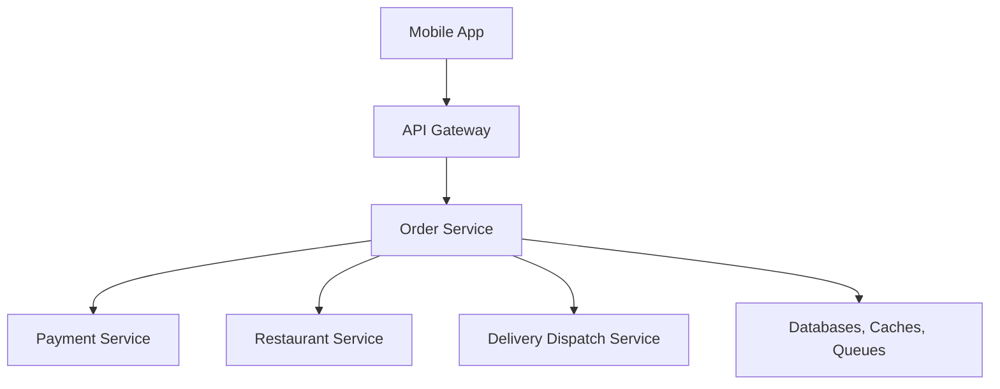
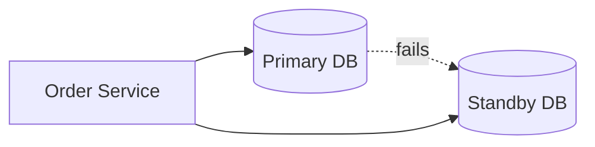
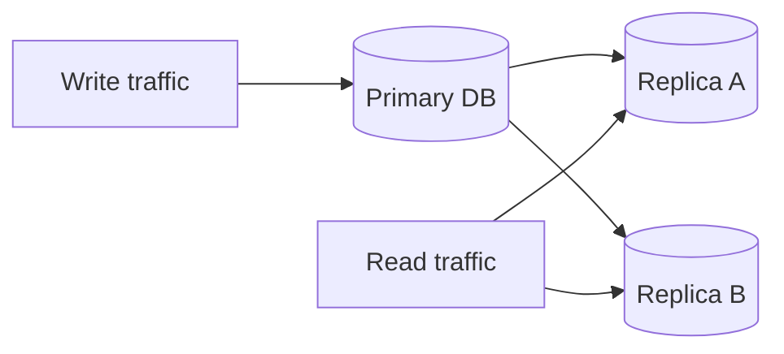
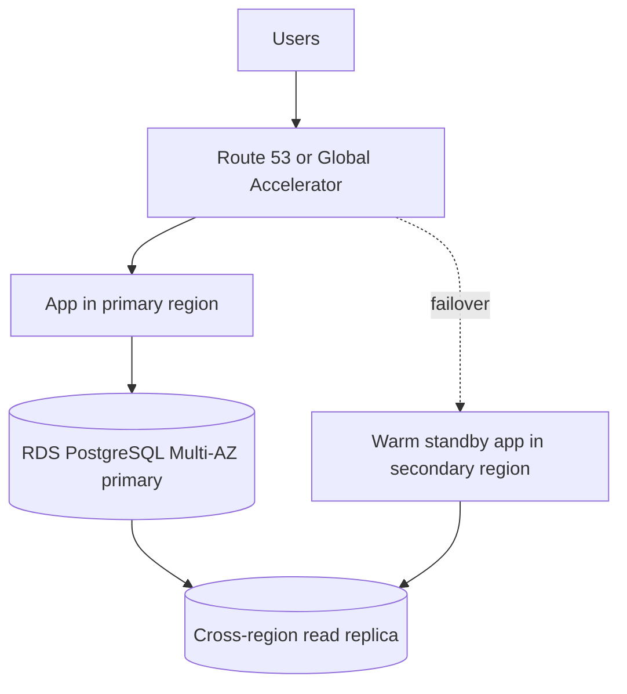
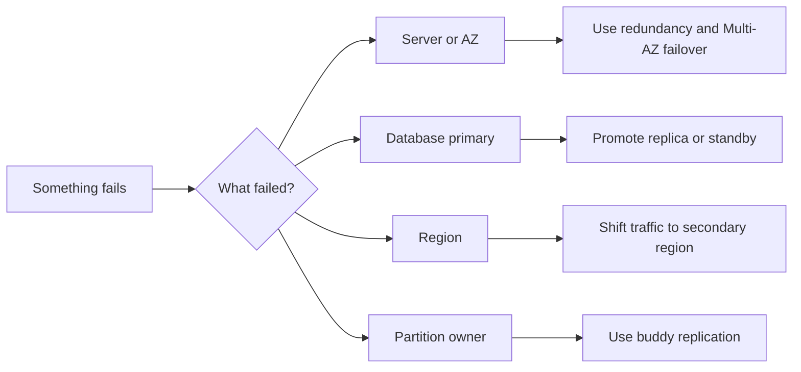

# Availability 30-Minute Study Guide

Goal: understand the main availability patterns well enough to explain how a system keeps working when servers, databases, networks, or regions fail.

<!-- SECTION: table-of-contents - DONE -->

## Table of Contents

1. [Availability Mental Model](#1-availability-mental-model)
2. [Failover](#2-failover)
3. [Replication](#3-replication)
4. [Replication Patterns](#4-replication-patterns)
5. [RPO, RTO, and Replication Lag](#5-rpo-rto-and-replication-lag)
6. [AWS PostgreSQL Availability](#6-aws-postgresql-availability)
7. [Design Warnings](#7-design-warnings)
8. [Final Mental Model](#8-final-mental-model)
9. [30-Minute Review Checklist](#9-30-minute-review-checklist)

<!-- SECTION: mental-model - DONE -->

## 1. Availability Mental Model

Availability patterns answer one question:

> What keeps the system useful when something fails?

Use a food delivery app as the running example:



Availability is not one feature. It is a combination of traffic routing, replicated data, health checks, failover plans, and clear decisions about what can be stale.

Mental shortcut: **availability design is failure planning before failure happens.**

<!-- SECTION: failover - DONE -->

## 2. Failover

Failover means a backup system takes over when the active system fails.



Common styles:

| Style | Meaning | Best fit | Main tradeoff |
|---|---|---|---|
| Active-passive | One system serves traffic, backup waits | Simpler disaster recovery | Backup may be cold or slightly behind |
| Active-active | Multiple systems serve traffic at once | Higher availability and lower latency | Harder data consistency and conflict handling |
| Warm standby | Secondary stack is running but not primary | Regional disaster recovery | Costs more than cold standby |

Failover requires more than a backup. You also need health checks, traffic shifting, database promotion, connection/config updates, and validation after the switch.

Mental shortcut: **failover answers "who takes over when this thing dies?"**

<!-- SECTION: replication - DONE -->

## 3. Replication

Replication means keeping copies of data or services in multiple places.



Replication improves:

- **Availability:** another copy can serve traffic if one node fails.
- **Read scalability:** read traffic can be spread across replicas.
- **Latency:** users can read from a nearby region or cache.
- **Disaster recovery:** a secondary copy can be promoted after a regional outage.

The main question is:

```text
How fresh must each copy be?
```

If a restaurant changes its hours from 9 PM to 10 PM, replicas and caches may not all learn it instantly. That delay is the cost of replication.

Mental shortcut: **replication answers "where else does this data exist?"**

<!-- SECTION: replication-patterns - DONE -->

## 4. Replication Patterns

| Pattern | Main idea | Good for | Main risk |
|---|---|---|---|
| Primary-replica | One writer, many readers | Read-heavy systems, simpler correctness | Replica lag |
| Tree replication | Data flows through hierarchy | Menus, catalogs, config, edge caches | Slower propagation |
| Multi-primary | Multiple nodes accept writes | Regional writes when conflicts are tolerable | Write conflicts |
| Buddy replication | Each partition has a partner backup | Partitioned services, dispatch ownership | Buddy pair failure |

### Primary-Replica

Also called master-slave or leader-follower replication. Writes go to the primary; replicas copy changes and serve reads when stale reads are acceptable.

```text
Create order -> Primary Order DB
View order history -> Replica Order DB
```

Use read-your-writes behavior when a user writes and immediately reads. For example, after placing an order, route that user's immediate order-status read to the primary or a caught-up replica.

### Tree Replication

Tree replication spreads data through levels:

```text
Global Menu DB
-> Regional menu replicas
-> City caches
-> Edge caches near users
```

This works well for read-heavy, less frequently updated data such as menus, restaurant photos, product catalogs, promotions, and configuration.

### Multi-Primary

Multi-primary means more than one region can accept writes.

```text
US-East DB accepts writes <-> US-West DB accepts writes
```

This improves write availability and latency, but creates conflict problems. It is risky for payments, inventory, order finalization, reservations, and balances.

### Buddy Replication

Buddy replication pairs nodes or partitions so one node can recover another's state.

```text
Dispatch Node A <-> Dispatch Node B
Dispatch Node C <-> Dispatch Node D
```

This is useful when work is partitioned by city, zone, shard, or owner. It is more efficient than copying everything everywhere.

<!-- SECTION: rpo-rto - DONE -->

## 5. RPO, RTO, and Replication Lag

Two disaster recovery terms matter in interviews:

| Term | Meaning | Simple question |
|---|---|---|
| RPO | Recovery Point Objective | How much data can we afford to lose? |
| RTO | Recovery Time Objective | How long can recovery take? |

### Synchronous Replication

```text
App -> Primary DB -> Replica confirms -> App gets success
```

Synchronous replication gives stronger durability, but adds latency. It is more common inside one region across Availability Zones.

### Asynchronous Replication

```text
App -> Primary DB -> App gets success
              |
        Replica catches up later
```

Asynchronous replication is common across regions. It keeps writes fast, but the replica can lag. If the primary fails before the latest changes replicate, those writes may be lost.

Mental shortcut: **sync replication improves RPO but hurts latency; async replication improves latency but can lose recent writes.**

<!-- SECTION: aws-postgres - DONE -->

## 6. AWS PostgreSQL Availability

For AWS hosted PostgreSQL, think in layers:

| Need | AWS option |
|---|---|
| Survive instance or AZ failure | RDS Multi-AZ |
| Keep a standby database in another region | RDS PostgreSQL cross-region read replica |
| Faster PostgreSQL-compatible regional disaster recovery | Aurora PostgreSQL Global Database |
| Read near users in other regions | Cross-region read replicas or Aurora secondary clusters |

Baseline enterprise pattern:



Failure plan:

1. Detect primary region failure.
2. Stop or fence writes to the old primary if possible.
3. Promote the secondary replica.
4. Point the secondary app stack to the promoted database.
5. Shift traffic with Route 53 or Global Accelerator.
6. Validate application health.
7. Rebuild replication later.

Mental shortcut: **Multi-AZ protects against local failure; cross-region replicas protect against regional failure.**

<!-- SECTION: warnings - DONE -->

## 7. Design Warnings

Do not assume two databases in two regions should both accept writes.

```text
us-east-1 DB accepts writes
us-west-2 DB accepts writes
```

This can create conflicts:

```text
Same order updated in both regions
Same inventory item sold twice
Same payment processed twice
Conflicting account changes
```

For critical workflows, the safer enterprise default is:

```text
single-writer, multi-reader
```

Use multi-primary only when you have a deliberate conflict-resolution model and the business can tolerate it.

<!-- SECTION: final-model - DONE -->

## 8. Final Mental Model



Use these questions in design discussions:

- What fails: node, AZ, database, queue, cache, or region?
- Who detects the failure?
- Who takes over?
- Where is the latest copy of the data?
- How much data loss is acceptable?
- How long can recovery take?
- Which workflows must stop instead of risking wrong data?

One-line mental model:

```text
Availability = redundancy + replication + failover + clear data-loss tradeoffs.
```

<!-- SECTION: review-checklist - DONE -->

## 9. 30-Minute Review Checklist

1. Explain failover in one sentence.
2. Compare active-passive, active-active, and warm standby.
3. Explain why replication improves availability and read scalability.
4. Define primary-replica replication and replica lag.
5. Explain when read-your-writes consistency matters.
6. Explain tree replication with menu or catalog data.
7. Explain why multi-primary replication creates conflicts.
8. Explain buddy replication using dispatch nodes or shards.
9. Define RPO and RTO.
10. Compare synchronous and asynchronous replication.
11. Explain RDS Multi-AZ vs cross-region read replica.
12. Explain when Aurora Global Database is useful.
13. Explain why single-writer, multi-reader is safer for payments, orders, inventory, and balances.
