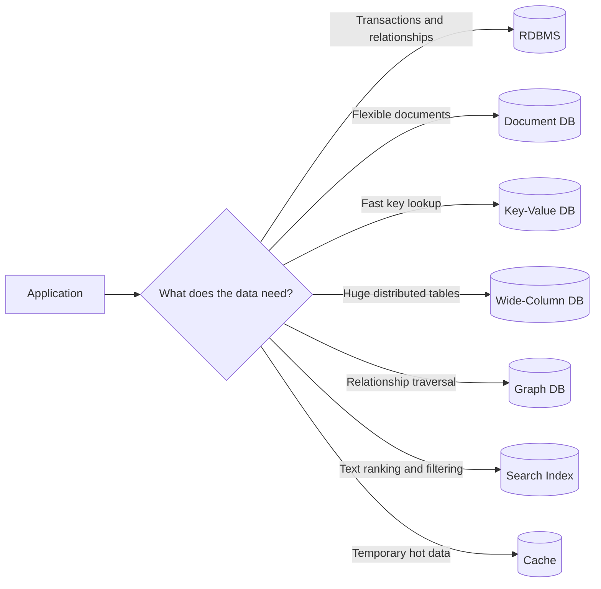
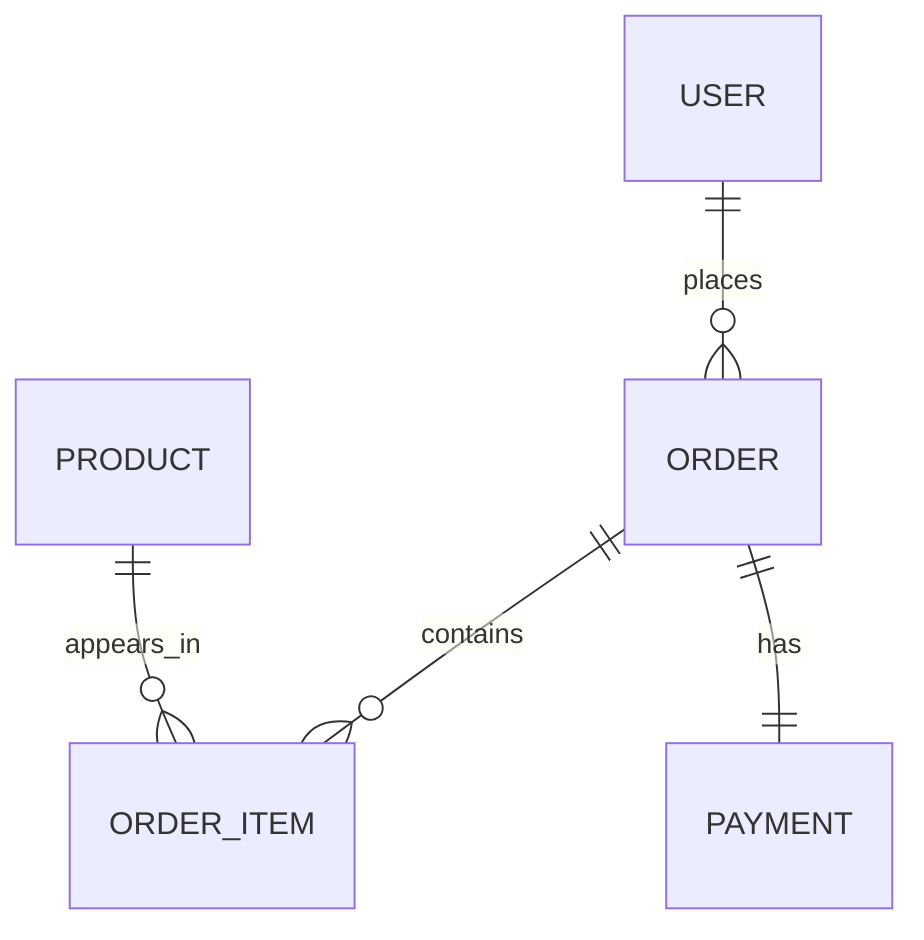
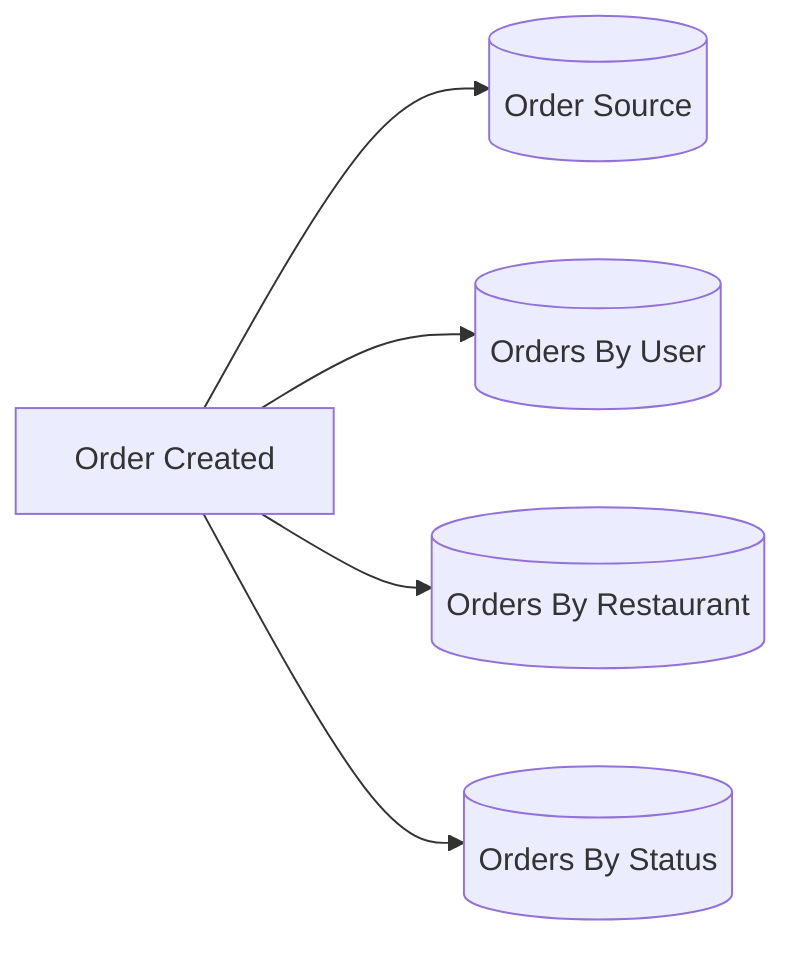
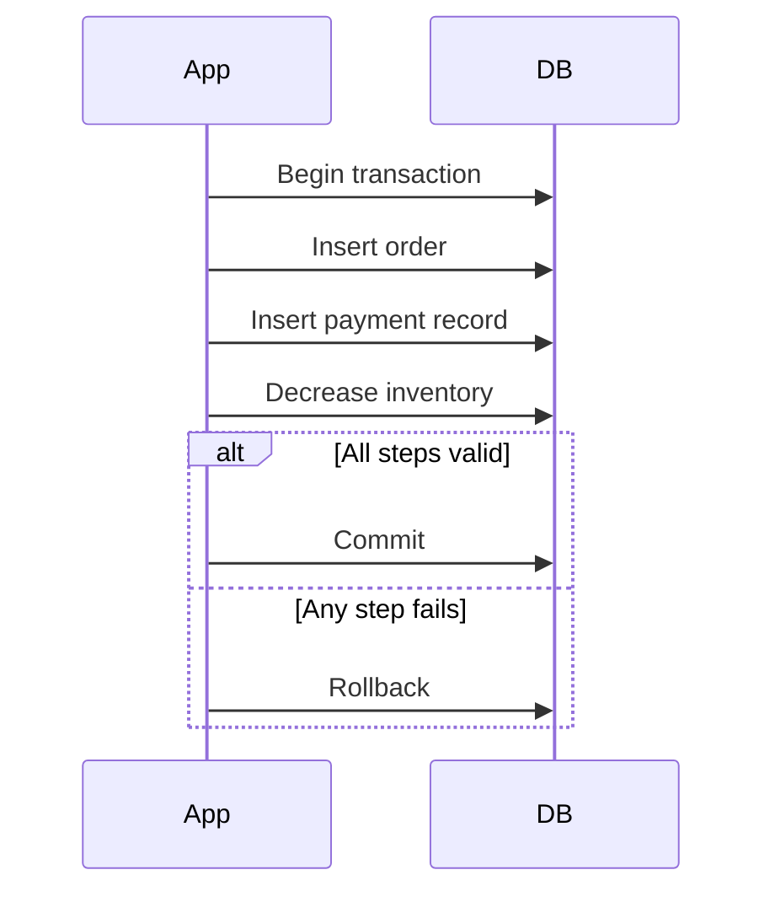
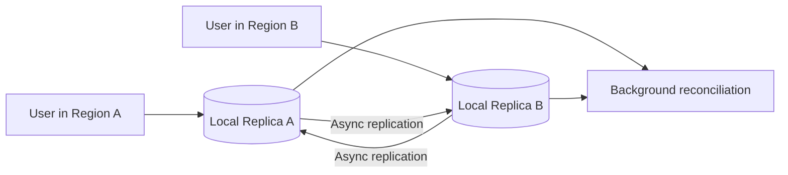
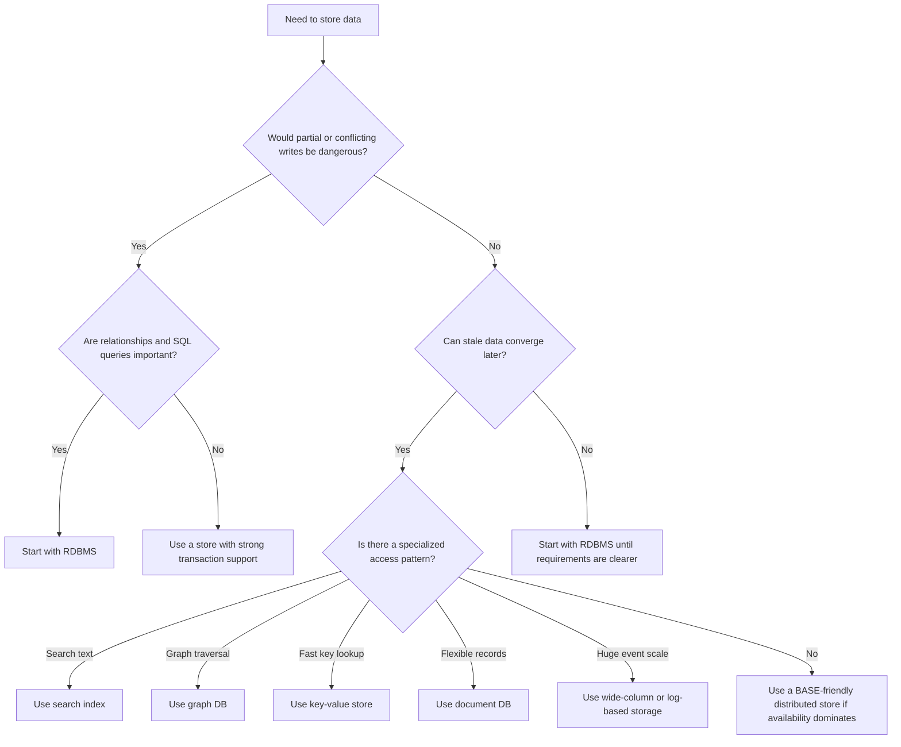
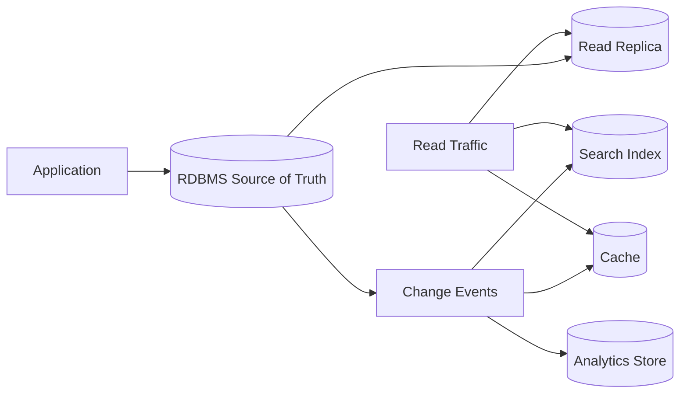
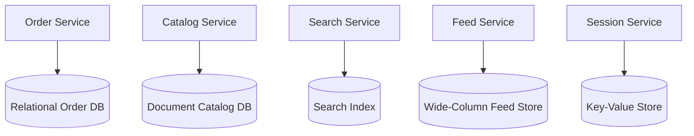

# RDBMS, NoSQL, ACID, and BASE 30-Minute Study Guide

Goal: understand relational databases, NoSQL databases, ACID transactions, BASE tradeoffs, and how to choose the right storage model in a system design interview.

<!-- SECTION: table-of-contents - DONE -->

## Table of Contents

1. [Database Mental Model](#1-database-mental-model)
2. [RDBMS Introduction](#2-rdbms-introduction)
3. [NoSQL Introduction](#3-nosql-introduction)
4. [ACID Transactions](#4-acid-transactions)
5. [BASE Tradeoffs](#5-base-tradeoffs)
6. [RDBMS vs NoSQL Decision Guide](#6-rdbms-vs-nosql-decision-guide)
7. [How to Choose in Interviews](#7-how-to-choose-in-interviews)
8. [Common Architecture Patterns](#8-common-architecture-patterns)
9. [Final Mental Model](#9-final-mental-model)
10. [30-Minute Review Checklist](#10-30-minute-review-checklist)

<!-- SECTION: mental-model - DONE -->

## 1. Database Mental Model

A database is not just where data lives. It is where the system decides how data is shaped, queried, protected, scaled, and recovered.

The practical database question is:

> What guarantees does this data need, and what access pattern must be fast?



Most real systems use more than one storage model. The hard part is deciding which system owns the source of truth and which systems are read models, indexes, caches, or analytics stores.

| Question | Why it matters |
|---|---|
| What is the data shape? | Tables, documents, key-value pairs, graphs, events, or time series lead to different stores. |
| What are the main queries? | A database should match the reads and writes the product actually needs. |
| How correct must writes be? | Money, inventory, orders, and permissions need stronger guarantees than likes or view counts. |
| How much scale is expected? | One-region transactional scale is different from global high-volume event ingestion. |
| How often does the schema change? | Stable domains fit relational schemas; evolving payloads may fit document stores. |

Mental shortcut: **choose the database for the access pattern and correctness requirement, not because SQL or NoSQL sounds modern.**

<!-- SECTION: rdbms-intro - DONE -->

## 2. RDBMS Introduction

RDBMS means Relational Database Management System. Common examples include PostgreSQL, MySQL, Oracle, SQL Server, and MariaDB.

Relational databases organize data into tables:

```text
users
id | email             | created_at
1  | a@example.com     | 2026-05-20

orders
id | user_id | status   | total
10 | 1       | created  | 42.00
```

The main idea is:

```text
Store facts once.
Connect related facts with keys.
Use SQL to query and join them.
```

| Concept | Beginner meaning | Example |
|---|---|---|
| Table | A collection of one type of thing | `users`, `orders`, `payments` |
| Row | One record in a table | One user or one order |
| Column | A named field with a type | `email`, `status`, `created_at` |
| Schema | The defined structure of tables and columns | `orders.total` is decimal, not random text |
| Primary key | Unique ID for a row | `orders.id` |
| Foreign key | Link to another table | `orders.user_id` points to `users.id` |
| Index | Data structure that speeds up lookup | Index on `orders.user_id` |
| Constraint | Rule enforced by the database | `email` must be unique |
| Join | Query that combines related tables | User plus their orders |

### Why RDBMS Is Strong

RDBMS is usually the safest default when the domain has important relationships and correctness rules.



Good fits:

| Use case | Why RDBMS fits |
|---|---|
| Orders | Order, payment, user, address, and inventory are related. |
| Payments | Correctness, transactions, and auditability matter. |
| Inventory | You must prevent selling items that do not exist. |
| Ledgers | Every change must be durable and explainable. |
| Admin reporting | SQL can join and aggregate across normalized data. |

RDBMS tradeoffs:

| Strength | Tradeoff |
|---|---|
| Strong transactions | Distributed writes can be harder to scale. |
| Rich SQL queries | Queries can become expensive without good indexes. |
| Enforced constraints | Schema changes require planning and migrations. |
| Joins across tables | Cross-shard joins are difficult at very large scale. |

Mental shortcut: **RDBMS is excellent when relationships, constraints, and transactions are central to the product.**

<!-- SECTION: nosql-intro - DONE -->

## 3. NoSQL Introduction

NoSQL does not mean one database type. It means a family of non-relational databases optimized for different data shapes, access patterns, and scale profiles.

The practical NoSQL question is:

> Can I model this data around the query I need to serve quickly?

| Type | Data model | Good for | Examples |
|---|---|---|---|
| Document | JSON-like documents | Profiles, catalogs, content, flexible records | MongoDB, Couchbase, DynamoDB document patterns |
| Key-value | Key maps directly to value | Sessions, carts, feature flags, cached objects | Redis, DynamoDB, Riak |
| Wide-column | Rows with many sparse columns across partitions | Large-scale events, timelines, metrics | Cassandra, HBase, Bigtable |
| Graph | Nodes and edges | Friend graphs, fraud rings, recommendations | Neo4j, JanusGraph, Neptune |
| Search | Inverted index over text and fields | Search boxes, filtering, ranking, logs | Elasticsearch, OpenSearch, Solr |
| Time-series | Measurements over time | Metrics, IoT readings, observability | InfluxDB, TimescaleDB, Prometheus storage |

### Query-First Modeling

In an RDBMS, you often normalize the data first and then query it in many ways. In many NoSQL systems, you start with the access pattern.

```text
Question:
Show the last 50 orders for user_123.

Possible NoSQL key:
PK = user_123
SK = order_created_at
```

This makes the target query fast, but it may duplicate data into multiple shapes.



Denormalization is common in NoSQL. Instead of joining at read time, you precompute or duplicate data into the shape the read needs.

| NoSQL idea | Meaning | Main caution |
|---|---|---|
| Flexible schema | Records do not all need identical columns | Validation may move into application code. |
| Denormalization | Duplicate data to make reads fast | Updates must keep copies consistent enough. |
| Partition key | Field used to distribute data | Bad keys create hot partitions. |
| Eventual consistency | Replicas may converge later | Users may briefly see stale or conflicting data. |
| Horizontal scaling | Add nodes to handle more data and traffic | Operations and data modeling become more important. |

Mental shortcut: **NoSQL often trades general-purpose querying for scale, speed, flexible shape, or specialized access.**

<!-- SECTION: acid - DONE -->

## 4. ACID Transactions

ACID describes transaction guarantees that protect data correctness.

| Letter | Meaning | Beginner explanation |
|---|---|---|
| A | Atomicity | All steps happen, or none of them happen. |
| C | Consistency | Valid rules remain valid after the transaction. |
| I | Isolation | Concurrent transactions do not corrupt each other. |
| D | Durability | Once committed, data survives crashes. |

### Order Example

Imagine checkout has three steps:

```text
1. Create order
2. Charge payment
3. Decrease inventory
```

Atomicity says the system should not create a paid order without reducing inventory, or reduce inventory without creating the order.



### Atomicity

Atomicity means a transaction is one unit.

```text
Transfer $50 from Account A to Account B:
subtract from A
add to B
```

If the second step fails, the first step must be undone. Otherwise money disappears.

### Consistency

Consistency means the database moves from one valid state to another valid state.

Examples:

- An order cannot reference a user that does not exist.
- Account balance cannot violate a rule the database enforces.
- A unique email cannot be inserted twice.

This is different from CAP consistency. ACID consistency is about preserving database rules inside a transaction.

### Isolation

Isolation controls what concurrent transactions can see.

Without isolation, two users might both buy the last item:

```text
Inventory = 1
User A reads 1
User B reads 1
User A buys it
User B buys it
Inventory becomes invalid
```

Common concurrency problems:

| Problem | Meaning |
|---|---|
| Dirty read | A transaction reads another transaction's uncommitted data. |
| Non-repeatable read | Reading the same row twice gives different results because another transaction committed. |
| Phantom read | Re-running a query returns new matching rows inserted by another transaction. |
| Lost update | Two writers overwrite each other without noticing. |

Higher isolation usually improves correctness but can reduce concurrency and throughput.

### Durability

Durability means committed data survives process crashes, machine restarts, and power loss within the database's promised failure model.

Databases usually achieve this with write-ahead logs, replication, snapshots, and disk persistence.

Mental shortcut: **ACID protects multi-step correctness when partial success would be dangerous.**

<!-- SECTION: base - DONE -->

## 5. BASE Tradeoffs

BASE describes a looser consistency model often used by highly available, distributed systems.

| Letter | Meaning | Beginner explanation |
|---|---|---|
| BA | Basically Available | The system tries to respond even when parts are failing. |
| S | Soft state | Data may change over time because background replication or repair is still happening. |
| E | Eventual consistency | If no new updates happen, replicas should eventually converge to the same value. |

BASE is not the opposite of correctness. It means the system accepts temporary inconsistency in places where availability, latency, or scale matters more than immediate global agreement.



### BASE Example: Likes Counter

Suppose a post has 100 likes.

```text
Region A accepts 5 new likes.
Region B accepts 3 new likes.
For a short time, one region may show 105 and another may show 103.
After replication, both converge to 108.
```

This is usually acceptable because a temporarily stale like count does not corrupt money, inventory, or permissions.

### When BASE Fits

BASE fits when the system can tolerate temporary disagreement.

| Use case | Why BASE can fit |
|---|---|
| Likes and reactions | Exact global count can converge later. |
| View counters | Approximate or delayed counts are usually fine. |
| Feeds and timelines | Slightly stale ordering is acceptable for availability and latency. |
| Shopping cart drafts | Temporary sync delay can be repaired before checkout. |
| Analytics events | Events can be ingested now and processed later. |
| Notifications | Duplicate or delayed delivery can often be handled with idempotency. |

### ACID vs BASE

| Question | Prefer ACID | Prefer BASE |
|---|---|---|
| What happens if two writes conflict? | Block, serialize, or reject one write. | Accept writes and reconcile later. |
| What matters most? | Immediate correctness. | Availability, latency, and partition tolerance. |
| What can users see? | Latest committed valid state. | Possibly stale state for a short time. |
| Common examples | Payments, ledgers, inventory, permissions. | Likes, feeds, metrics, caches, analytics. |
| Main cost | Lower availability or throughput under contention. | Reconciliation logic and temporary inconsistency. |

Mental shortcut: **ACID says "make it correct before commit." BASE says "accept now, converge later."**

<!-- SECTION: decision-guide - DONE -->

## 6. RDBMS vs NoSQL Decision Guide

Do not choose RDBMS or NoSQL as a brand identity. Choose based on what the workload needs.

| Dimension | RDBMS | NoSQL |
|---|---|---|
| Data model | Tables with relationships | Documents, keys, columns, graphs, search indexes, time series |
| Schema | Explicit and enforced | Flexible or query-specific |
| Transactions | Strong ACID support is common | Varies by product and scope |
| Joins | Native and expressive | Often avoided or modeled manually |
| Query flexibility | Strong SQL ad hoc querying | Usually optimized for known access patterns |
| Scaling | Often vertical first, then replicas and sharding | Often horizontal and partitioned from the start |
| Consistency | Strong consistency is common on primary writes | Can be strong, eventual, or tunable depending on system |
| Consistency model | Often ACID-first | Often BASE-friendly, though not always |
| Best fit | Correctness-heavy relational domains | High-scale, flexible, or specialized access patterns |
| Main risk | Harder global write scaling and migrations | Poor modeling can cause duplication and consistency bugs |

### Use RDBMS When

Use an RDBMS when:

- The data has important relationships.
- You need multi-row or multi-table transactions.
- The database should enforce constraints.
- You need flexible SQL reporting and joins.
- Correctness matters more than accepting every write during failure.
- The schema represents a stable business domain.

Good examples:

| System | Why |
|---|---|
| Banking ledger | Every debit and credit must be correct and auditable. |
| Ecommerce checkout | Orders, payments, users, addresses, and inventory are related. |
| Subscription billing | Plan, invoice, tax, payment, and entitlement rules need consistency. |
| Enterprise admin app | Users need filters, reports, joins, and constraints. |

### Use NoSQL When

Use a NoSQL database when:

- Access patterns are known and need very low latency.
- The data is naturally document-shaped or graph-shaped.
- The system needs massive partitioned write throughput.
- The schema changes frequently.
- BASE-style eventual consistency is acceptable for this workflow.
- You need a specialized engine for search, graph traversal, metrics, or caching.

Good examples:

| System | Likely store | Why |
|---|---|---|
| Session store | Key-value | Fast lookup by session ID. |
| Product catalog | Document | Product attributes vary by category. |
| Social feed | Wide-column or key-value | Fast partitioned reads by user or timeline. |
| Friend recommendations | Graph | Relationship traversal matters. |
| Search page | Search index | Ranking, tokenization, and filtering matter. |
| Metrics dashboard | Time-series | Writes and queries are time-window based. |

Mental shortcut: **RDBMS is usually source-of-truth and ACID friendly; NoSQL is often access-pattern, scale, and BASE friendly.**

<!-- SECTION: interview-choice - DONE -->

## 7. How to Choose in Interviews

A strong interview answer starts with requirements, not technology.



### Interview Language

Use this style:

```text
I would start with PostgreSQL for the source of truth because orders,
payments, users, and inventory need relationships and transactions.
If read traffic grows, I would add read replicas, caching, and a search
index for product discovery rather than moving the core transactional
workflow to NoSQL immediately.
```

For a high-scale feed:

```text
The feed read path is latency-sensitive and query-specific. I would not
join relational tables on every request. I would store the authoritative
user and post records separately, then fan out or materialize feed entries
into a key-value or wide-column store optimized by user_id and time.
```

Avoid weak statements:

| Weak answer | Better answer |
|---|---|
| SQL is consistent and NoSQL is inconsistent. | Consistency depends on the database, topology, and configuration. RDBMS commonly gives strong local ACID transactions. Many NoSQL systems offer tunable or limited transactions. |
| NoSQL is always faster. | NoSQL can be faster for the access pattern it is modeled for. Bad NoSQL modeling can be slower and harder to fix. |
| RDBMS does not scale. | RDBMS can scale with indexes, replicas, partitioning, caching, and sharding, but global multi-writer transactions are difficult. |
| Use MongoDB because schema changes. | Use a document database if the data is document-shaped and access patterns fit. Schema flexibility alone is not enough. |
| BASE means no consistency. | BASE means eventual consistency. The system still needs reconciliation, idempotency, and conflict rules. |

Mental shortcut: **say what must be correct, what must be fast, and what can be stale.**

<!-- SECTION: architecture-patterns - DONE -->

## 8. Common Architecture Patterns

### RDBMS as Source of Truth

This is common for systems where writes must be correct but reads need help scaling.



Examples:

| Product area | Source of truth | Extra stores |
|---|---|---|
| Ecommerce orders | RDBMS | Cache for order status, search for product discovery |
| Banking | RDBMS ledger | Analytics warehouse, fraud graph, cache for safe summaries |
| SaaS app | RDBMS | Search index, read replicas, object storage for files |

The source of truth handles correctness. Other stores are optimized projections.

### Polyglot Persistence

Polyglot persistence means using multiple database types in one system because different data has different needs.



This can be powerful, but each extra database adds operational cost, data sync complexity, backups, monitoring, and failure modes.

### CQRS and Read Models

CQRS means separating the write model from one or more read models.

```text
Write model:
normalized, transactional, correct

Read model:
denormalized, query-specific, fast
```

This is useful when reads are much heavier than writes or when the UI needs precomputed views.

### Event and Audit Logs

Some systems store an append-only log of events:

```text
OrderCreated
PaymentAuthorized
InventoryReserved
OrderShipped
```

Append-only data is useful for auditing, replay, analytics, and debugging. It does not replace the need to decide what the current query model should be.

### BASE with Reconciliation

BASE-style systems need a plan for convergence. That plan may be last-write-wins, version vectors, conflict queues, idempotency keys, or domain-specific merge rules.

```text
Accept local write
Replicate asynchronously
Detect conflict or duplicate
Apply merge rule
Expose converged state
```

For example, a duplicate notification can be deduped by notification ID. A shopping cart conflict might merge item quantities. A bank transfer should not use this pattern for the money movement itself.

Mental shortcut: **one database does not need to solve every problem; one database should own each truth.**

<!-- SECTION: final-model - DONE -->

## 9. Final Mental Model

Start with the data's job:

| If the data needs... | Start with... |
|---|---|
| Strong transactions and relationships | RDBMS |
| Fast lookup by key | Key-value store |
| Flexible nested records | Document store |
| Huge partitioned event writes | Wide-column or log-based store |
| Relationship traversal | Graph database |
| Text search and ranking | Search index |
| Low-latency temporary reads | Cache |
| Time-window metrics | Time-series store |

The safest general-purpose starting point is often an RDBMS, especially before scale is proven. Move or copy specific read paths into specialized stores when the access pattern demands it.

Final shortcut:

```text
RDBMS: protect truth with relationships and transactions.
NoSQL: shape data around scale, latency, flexibility, or a specialized query.
ACID: prevent dangerous partial or conflicting writes.
BASE: stay available now and converge later when temporary inconsistency is safe.
```

<!-- SECTION: checklist - DONE -->

## 10. 30-Minute Review Checklist

Use this checklist to review before an interview:

- Can I explain tables, rows, columns, primary keys, foreign keys, indexes, constraints, and joins?
- Can I explain why RDBMS is a strong default for orders, payments, inventory, ledgers, and admin reporting?
- Can I name the major NoSQL categories: document, key-value, wide-column, graph, search, and time-series?
- Can I explain denormalization and query-first modeling?
- Can I define Atomicity, Consistency, Isolation, and Durability with an example?
- Can I define Basically Available, Soft state, and Eventual consistency with an example?
- Can I explain the difference between ACID consistency and CAP consistency?
- Can I explain when ACID is safer than BASE and when BASE is acceptable?
- Can I describe dirty reads, non-repeatable reads, phantom reads, and lost updates at a high level?
- Can I say when data can be stale and when it cannot?
- Can I explain why NoSQL is not automatically faster and RDBMS is not automatically unscalable?
- Can I design an architecture where RDBMS is the source of truth and cache/search/read models support fast reads?

One-sentence interview answer:

> I choose ACID-friendly RDBMS patterns when correctness, relationships, and transactions dominate; I choose BASE-friendly NoSQL patterns when availability, scale, flexible data shape, or specialized access dominates and temporary inconsistency is acceptable.
