# Concurrency 30-Minute Study Guide

Goal: understand the main concurrency models well enough to explain how systems coordinate work safely and efficiently in a system design interview.

<!-- SECTION: table-of-contents - DONE -->

## Table of Contents

1. [Concurrency Mental Model](#1-concurrency-mental-model)
2. [Concurrency vs Parallelism](#2-concurrency-vs-parallelism)
3. [Shared-State Concurrency](#3-shared-state-concurrency)
4. [Message-Passing Concurrency](#4-message-passing-concurrency)
5. [Dataflow Concurrency](#5-dataflow-concurrency)
6. [Software Transactional Memory](#6-software-transactional-memory)
7. [How to Choose a Concurrency Model](#7-how-to-choose-a-concurrency-model)
8. [System Design Examples](#8-system-design-examples)
9. [Design Warnings](#9-design-warnings)
10. [Final Mental Model](#10-final-mental-model)
11. [30-Minute Review Checklist](#11-30-minute-review-checklist)

<!-- SECTION: mental-model - DONE -->

## 1. Concurrency Mental Model

Concurrency is about managing multiple pieces of work that are in progress at the same time. The work may run on one CPU, many CPU cores, many machines, or many services.

The practical concurrency question is:

> What work can happen at the same time, and what must be coordinated?

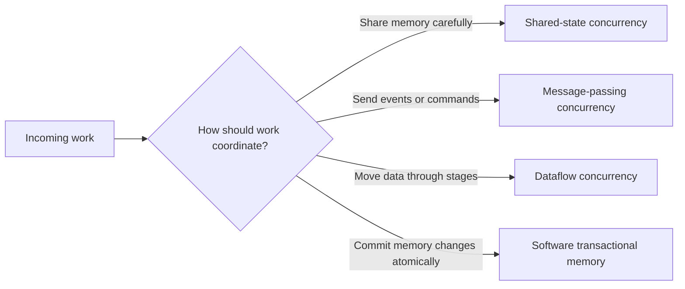

Concurrency usually optimizes:

| Goal | Meaning | Example |
|---|---|---|
| Responsiveness | Keep accepting work while other work waits | Web server handles other requests while one request waits on I/O |
| Throughput | Complete more total work per unit time | Worker pool processes many jobs |
| Resource usage | Keep CPU, network, and disk busy | Async service overlaps network calls |
| Isolation | Prevent one slow task from blocking everything | Queue workers process jobs independently |

The tradeoff is coordination complexity. Once multiple tasks can touch the same data, ordering, retries, failures, and partial progress become design problems.

Mental shortcut: **concurrency is about structure; safety comes from controlling who can touch what and when.**

<!-- SECTION: concurrency-vs-parallelism - DONE -->

## 2. Concurrency vs Parallelism

Concurrency and parallelism are related, but not the same.

| Concept | Beginner meaning | Example |
|---|---|---|
| Concurrency | Multiple tasks are in progress during the same time period | One server interleaves many requests |
| Parallelism | Multiple tasks execute at the exact same time | Four CPU cores run four tasks simultaneously |

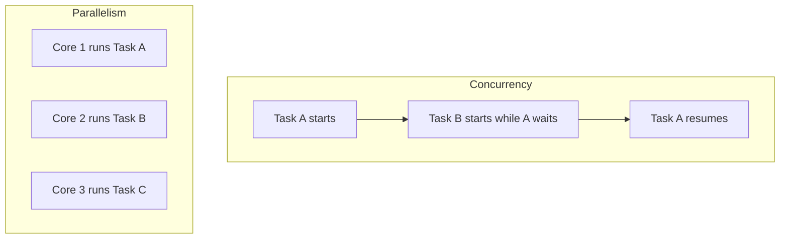

A single-threaded event loop can be concurrent if it switches between tasks while waiting on I/O. A multi-core worker pool can be both concurrent and parallel.

In system design, the important part is usually not the CPU detail. It is whether work can overlap safely without corrupting state, duplicating side effects, or overwhelming downstream systems.

Mental shortcut: **concurrency is dealing with many things at once; parallelism is doing many things at once.**

<!-- SECTION: shared-state - DONE -->

## 3. Shared-State Concurrency

Shared-state concurrency means multiple tasks access the same mutable data. The data might be an in-memory object, a database row, a file, a cache key, or a distributed lock.

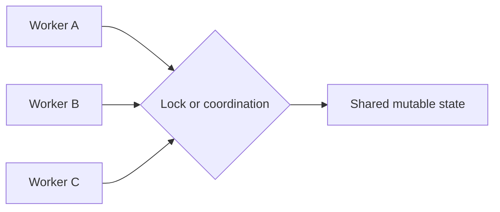

The core problem is that reading and writing are often not one indivisible action.

```text
current_count = read()
new_count = current_count + 1
write(new_count)
```

If two workers do this at the same time, both can read the same old value and one update can be lost.

### Common Tools

| Tool | What it protects | Best fit | Main caution |
|---|---|---|---|
| Mutex / lock | One critical section | Simple shared updates | Can reduce throughput under contention |
| Read/write lock | Many readers or one writer | Read-heavy shared data | Writer starvation is possible |
| Atomic operation | One low-level update | Counters, flags, compare-and-swap | Hard to compose across multiple values |
| Semaphore | Limited number of concurrent users | Connection pools, rate-limited resources | Bad sizing can bottleneck or overload |
| Database transaction | Shared persistent state | Money, orders, inventory | Locks and isolation levels affect latency |
| Distributed lock | Cross-process coordination | One leader, one scheduled job, one resource owner | Expiration and network failure are tricky |

### Race Conditions

A race condition happens when the result depends on timing.

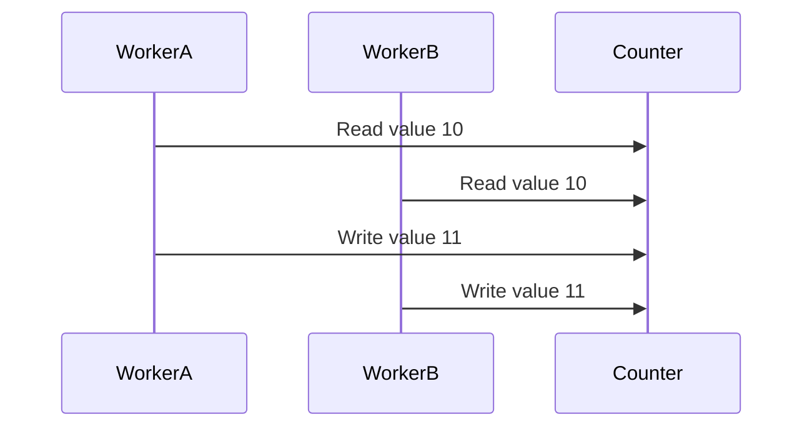

The expected final value was 12, but the actual final value is 11. One increment was lost.

### Deadlocks

A deadlock happens when tasks wait forever because each one holds a resource the other needs.

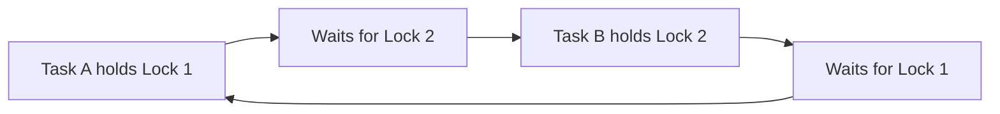

Ways to reduce deadlocks:

- Acquire locks in a consistent order.
- Keep critical sections small.
- Use timeouts for lock acquisition.
- Prefer one owner for a piece of state when possible.
- Use database constraints or atomic operations instead of broad locks when they fit.

Shared state is common because it is direct and familiar, but it becomes harder as the number of workers, resources, and failure modes grows.

Mental shortcut: **shared state is powerful, but every shared mutable value needs an ownership and coordination story.**

<!-- SECTION: message-passing - DONE -->

## 4. Message-Passing Concurrency

Message-passing concurrency means tasks communicate by sending messages instead of directly sharing mutable memory. The message can be a queue item, channel value, actor message, event, command, or stream record.

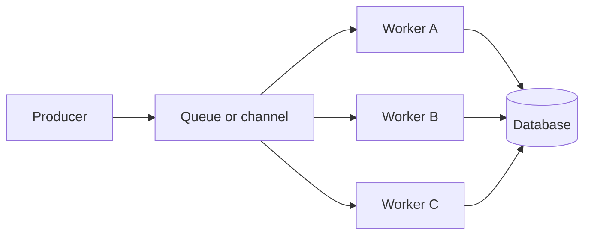

The main idea is:

```text
Do not let every worker mutate the same object directly.
Send work to the component that owns the mutation.
```

### Common Forms

| Form | Meaning | Example |
|---|---|---|
| Actor model | Each actor owns its state and processes messages one at a time | Chat room actor owns room membership |
| Queue workers | Producers enqueue work; workers pull and process | Email sending, image processing, billing jobs |
| Channels | Tasks communicate through typed pipes | Go channels, async runtime channels |
| Event bus | Services publish facts for other services to consume | `OrderCreated` event triggers fulfillment |
| Command bus | A message asks a specific handler to do something | `ChargePayment` command goes to payment worker |

### Why It Helps

Message passing can reduce shared-memory bugs because state ownership becomes clearer.

| Benefit | Why it matters |
|---|---|
| Clear ownership | One actor or worker can own a piece of mutable state |
| Natural buffering | Queues absorb traffic spikes for a while |
| Failure isolation | A failed message can be retried or sent to a dead-letter queue |
| Horizontal scaling | Add more consumers for independent work |
| Loose coupling | Producers do not need to know every downstream consumer |

### Main Tradeoffs

Message passing moves complexity from locks into delivery semantics.

| Problem | Design question |
|---|---|
| Duplicate messages | Is the handler idempotent? |
| Out-of-order messages | Does ordering matter per user, account, or aggregate? |
| Queue buildup | What is the backpressure or shedding plan? |
| Poison messages | Where do permanently failing messages go? |
| Slow consumers | Can producers keep sending forever? |
| Partial failure | What happens after a message succeeds but the acknowledgement fails? |

Message passing works well when work can be described as independent commands or events. It is less natural when many tasks need low-latency reads and writes over the same complex in-memory structure.

Mental shortcut: **message passing avoids shared memory by turning coordination into ownership, ordering, and delivery questions.**

<!-- SECTION: dataflow - DONE -->

## 5. Dataflow Concurrency

Dataflow concurrency organizes work as a graph of stages. Data moves through the graph, and stages can run concurrently when their inputs are ready.

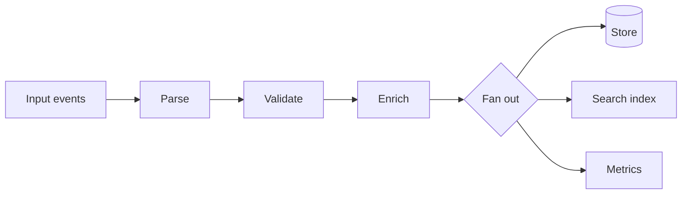

The main idea is:

```text
Each stage does one transformation.
Concurrency comes from running independent stages and records at the same time.
```

Dataflow appears in:

| System | Dataflow example |
|---|---|
| Web backend | Request validation -> business logic -> persistence -> event publish |
| Stream processing | Kafka topic -> parse -> enrich -> aggregate -> sink |
| Data pipeline | Extract -> transform -> load -> quality checks |
| Media processing | Upload -> virus scan -> transcode -> thumbnail -> publish |
| Machine learning | Ingest -> feature generation -> training -> evaluation |

### Fan-Out and Fan-In

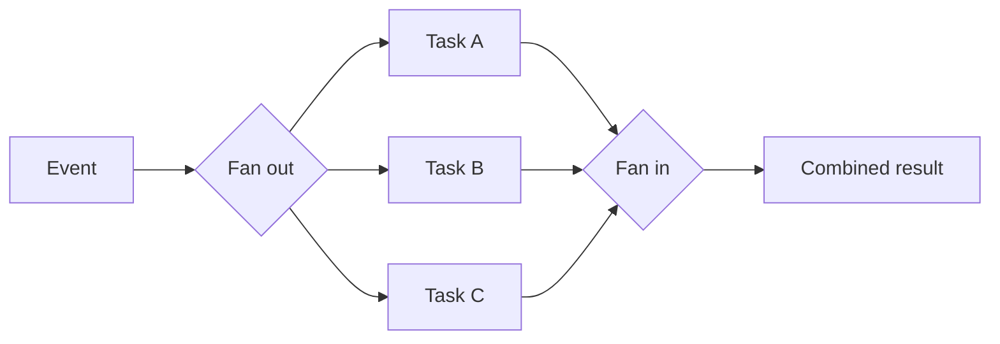

Fan-out improves throughput when tasks are independent. Fan-in is where coordination returns: the system must decide whether to wait for all branches, accept partial results, retry failed branches, or time out.

### Stream Processing Concerns

| Concern | Why it matters |
|---|---|
| Ordering | Some operations need events in order per key |
| Windowing | Aggregates may be calculated over time windows |
| Backpressure | Slow sinks can cause upstream queues to grow |
| Retry behavior | Retrying a stage can duplicate side effects |
| Checkpointing | The system needs a restart point after failure |
| Exactly-once claims | Usually depend on idempotent writes and transactional sinks |

Dataflow is useful because it makes dependencies visible. Independent steps can scale separately, and bottlenecks are easier to find.

Mental shortcut: **dataflow concurrency is a pipeline; the design work is choosing stage boundaries, ordering guarantees, and retry points.**

<!-- SECTION: stm - DONE -->

## 6. Software Transactional Memory

Software transactional memory, or STM, treats memory updates like transactions. Code reads and writes shared memory inside a transaction. If no conflicting transaction changed the same data, the transaction commits. If there is a conflict, the transaction retries.

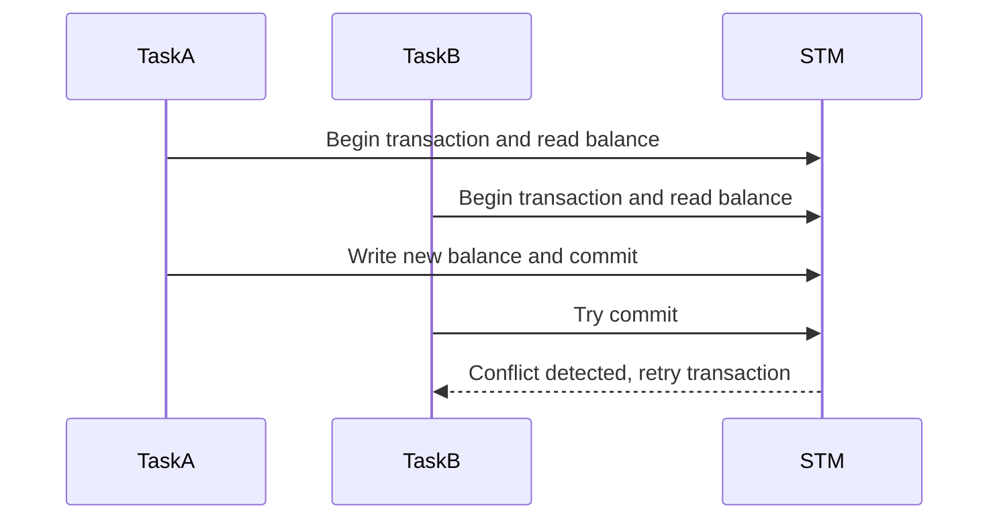

The main idea is:

```text
Write code as if updates are isolated.
Let the STM runtime detect conflicts and retry.
```

### How STM Usually Works

| Step | Meaning |
|---|---|
| Begin | Start a memory transaction |
| Read set | Track values read by the transaction |
| Write set | Track values the transaction wants to change |
| Validate | Check whether another transaction changed the read values |
| Commit | Apply all writes atomically |
| Retry | Re-run the transaction if validation fails |

STM is optimistic. It assumes conflicts are not constant. That can work well when many tasks read shared state and only occasionally write overlapping values.

### Benefits and Limits

| Benefit | Limit |
|---|---|
| Avoids manual lock ordering | Retries can waste work under high contention |
| Composes multiple memory updates | Side effects inside transactions are dangerous |
| Reduces some deadlock risk | Not common in mainstream distributed system designs |
| Can make concurrent code easier to reason about | Runtime support and language ecosystem matter |

STM is more common in language/runtime discussions than in typical web architecture interviews. Still, the mental model is useful because it shows another way to handle shared mutable state: optimistic coordination instead of explicit locks.

Important warning: do not send emails, charge cards, publish events, or call external services inside a retryable memory transaction unless the runtime has a safe side-effect mechanism. The transaction might run more than once.

Mental shortcut: **STM is optimistic locking for memory: try the whole change, commit if nothing conflicted, retry if it did.**

<!-- SECTION: choosing - DONE -->

## 7. How to Choose a Concurrency Model

In interviews, do not choose a concurrency model by naming a favorite language feature. Choose based on ownership, coordination, latency, and failure behavior.

| Situation | Usually fits | Why |
|---|---|---|
| Small shared data inside one process | Shared state with locks or atomics | Simple and low overhead |
| Counter, flag, or compare-and-set update | Atomic operation | Avoids broad locking |
| Many independent background tasks | Message passing with queue workers | Easy to scale and retry |
| One component should own one mutable entity | Actor or single-owner queue | Serializes updates per owner |
| Multi-stage processing | Dataflow pipeline | Makes dependencies and bottlenecks clear |
| Large event stream | Stream dataflow | Partitions work and tracks progress |
| Many memory transactions with low conflict | STM | Avoids manual lock composition |
| Money, inventory, or durable correctness | Database transaction plus idempotency | Persistence needs stronger guarantees than memory alone |

### Decision Questions

Ask these questions:

| Question | What it reveals |
|---|---|
| Who owns the mutable state? | Whether shared memory is safe or ownership should be isolated |
| Does ordering matter? | Whether work can be parallelized freely |
| Can work be retried? | Whether queues and pipelines need idempotency keys |
| What is the failure boundary? | Whether one failed task can poison a worker, queue, or pipeline |
| What is the contention point? | Where locks, hot partitions, or single consumers might bottleneck |
| What side effects happen? | Whether retries can duplicate external actions |

Good designs often combine models. A service might use an async event loop for request concurrency, a database transaction for durable state, a queue for background work, and a stream pipeline for analytics.

Mental shortcut: **choose the model that makes ownership obvious and retries safe.**

<!-- SECTION: examples - DONE -->

## 8. System Design Examples

### Example 1: Web Request Workers

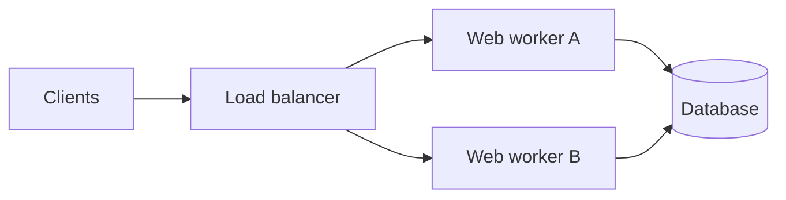

Each web worker handles many requests concurrently. The application should avoid storing important mutable user state only in worker memory because different requests may land on different workers.

Better choices:

- Keep durable state in the database.
- Use transactions or constraints for critical updates.
- Use Redis or another shared store for short-lived shared state when needed.
- Make request handlers idempotent when clients can retry.

### Example 2: Background Jobs

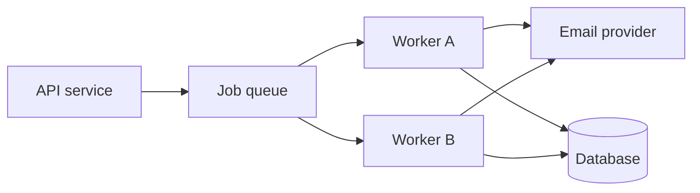

This is message-passing concurrency. The API accepts work quickly, then workers process jobs asynchronously.

Design points:

- Include an idempotency key so retrying a job does not send two emails or charge twice.
- Use visibility timeouts or acknowledgements so failed workers do not lose jobs.
- Add a dead-letter queue for jobs that repeatedly fail.
- Monitor queue depth and job age, not just worker CPU.

### Example 3: Stream Processing Pipeline

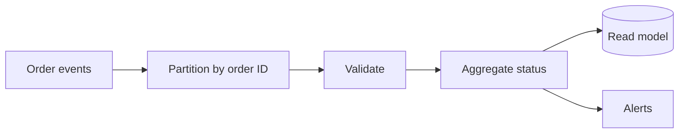

This is dataflow concurrency. Events for different order IDs can be processed in parallel, while events for the same order may need ordering.

Design points:

- Partition by the key that needs ordering.
- Checkpoint progress so workers can restart.
- Make sink writes idempotent.
- Decide what to do with late or malformed events.

### Example 4: Collaborative Document Editing

Many users can edit the same document at the same time. This is a hard concurrency problem because users expect low latency and correct merging.

Possible approaches:

| Approach | Fit |
|---|---|
| Shared lock | Simple but blocks collaboration |
| Server-owned document actor | Serializes operations through one owner |
| Operational transform | Transforms concurrent edits so intent is preserved |
| CRDT | Allows replicas to merge concurrent edits eventually |

For an interview, the important move is to name the invariant. For example: "All clients must converge to the same document state, even if edits arrive in different orders."

Mental shortcut: **examples become easier when you first identify the state owner, ordering key, and retry behavior.**

<!-- SECTION: warnings - DONE -->

## 9. Design Warnings

Concurrency bugs are often rare in testing and painful in production because they depend on timing, traffic, and failure.

| Warning | What can go wrong | Safer design habit |
|---|---|---|
| Race condition | Two workers overwrite each other | Use locks, transactions, atomics, or single ownership |
| Deadlock | Workers wait forever | Use lock ordering and timeouts |
| Starvation | One task never gets access | Use fair queues or bounded retries |
| Contention | Too many workers fight over one resource | Shard state, reduce critical sections, or change ownership |
| Queue buildup | Producers outpace consumers | Add backpressure, autoscaling, rate limits, or shedding |
| Duplicate side effects | Retries repeat external actions | Use idempotency keys and dedupe tables |
| Out-of-order events | Newer state is overwritten by older state | Use versions, sequence numbers, or partition ordering |
| Hidden shared state | Local caches or globals become inconsistent | Make ownership explicit and invalidate carefully |

### Red Flags in Interviews

Be careful when you hear:

- "Just run more workers" without checking contention or downstream limits.
- "Use a queue" without discussing retries, duplicates, and dead-letter handling.
- "Use a lock" without discussing scope, timeout, and failure.
- "Exactly once" without explaining idempotency or transactional writes.
- "Global ordering" when only per-user or per-entity ordering is needed.
- "Store it in memory" when there are multiple app instances.

### Useful Invariants

Concurrency design is easier when you state the rule that must always be true.

| System | Invariant |
|---|---|
| Inventory | Stock cannot go below zero |
| Payments | One order should not be charged twice |
| Likes | A user can like an item at most once |
| Chat | Messages in one room should have a stable order |
| Job processing | A completed job should not be applied twice |
| Document editing | All replicas should converge to the same content |

Mental shortcut: **concurrency safety starts with the invariant, not the primitive.**

<!-- SECTION: final-model - DONE -->

## 10. Final Mental Model

Concurrency means multiple units of work are active at the same time. The design challenge is not just making work faster. It is preserving correctness while work overlaps.

Use this map:

```text
Shared state:
Protect the same data with locks, atomics, transactions, or ownership rules.

Message passing:
Send work to owners through queues, channels, actors, commands, or events.

Dataflow:
Move data through independent stages and coordinate at boundaries.

Software transactional memory:
Try memory changes optimistically and retry if there is a conflict.
```

For system design interviews, the strongest answer usually sounds like:

```text
This state is owned by X.
Work is partitioned by Y.
Retries are safe because Z.
The invariant we protect is W.
```

Final shortcut: **concurrency is safe when ownership, ordering, retries, and invariants are explicit.**

<!-- SECTION: checklist - DONE -->

## 11. 30-Minute Review Checklist

Use this checklist to test whether you can explain the topic:

- Can you explain concurrency vs parallelism in one sentence?
- Can you describe a race condition with a lost update example?
- Can you explain why locks help and how they can cause deadlocks?
- Can you name when an atomic operation is better than a broad lock?
- Can you explain message passing through queues, actors, or channels?
- Can you describe why retries require idempotency?
- Can you explain backpressure and queue buildup?
- Can you describe dataflow as a pipeline or DAG of stages?
- Can you explain fan-out, fan-in, and where coordination returns?
- Can you explain STM as optimistic transactions over memory?
- Can you name why side effects are dangerous inside retryable transactions?
- Can you choose a concurrency model based on ownership, ordering, and failure behavior?
- Can you state the invariant for a concurrent system before choosing the primitive?

If you remember only one thing:

```text
Concurrency is not just doing more at once.
It is deciding which work may overlap, who owns shared state, and how correctness survives retries and failures.
```
