# Event-Driven Architecture 30-Minute Study Guide

Goal: understand event-driven patterns well enough to explain how services communicate asynchronously, how state is derived from events, and what tradeoffs matter in a system design interview.

<!-- SECTION: table-of-contents - DONE -->

## Table of Contents

1. [Event-Driven Architecture Mental Model](#1-event-driven-architecture-mental-model)
2. [Events, Commands, and Messages](#2-events-commands-and-messages)
3. [Domain Events](#3-domain-events)
4. [Event Sourcing](#4-event-sourcing)
5. [CQRS Pattern](#5-cqrs-pattern)
6. [Event Stream Processing](#6-event-stream-processing)
7. [Messaging and Message Brokers](#7-messaging-and-message-brokers)
8. [Enterprise Service Bus](#8-enterprise-service-bus)
9. [Actor Model](#9-actor-model)
10. [Enterprise Integration Architecture](#10-enterprise-integration-architecture)
11. [Delivery Guarantees, Ordering, and Idempotency](#11-delivery-guarantees-ordering-and-idempotency)
12. [When to Use Event-Driven Architecture](#12-when-to-use-event-driven-architecture)
13. [Design Warnings](#13-design-warnings)
14. [Interview Language](#14-interview-language)
15. [Final Mental Model](#15-final-mental-model)
16. [30-Minute Review Checklist](#16-30-minute-review-checklist)

<!-- SECTION: mental-model - DONE -->

## 1. Event-Driven Architecture Mental Model

Event-driven architecture (EDA) means services react to facts that already happened instead of calling each other synchronously for every step.

The practical EDA question is:

> What happened, who needs to know, and how do we keep side effects safe when delivery is not perfect?

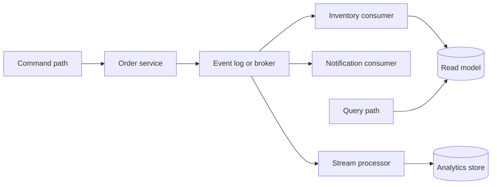

EDA usually optimizes:

| Goal | Meaning | Example |
|---|---|---|
| Loose coupling | Producers do not need every consumer online | `OrderPlaced` triggers shipping, billing, and email independently |
| Scalability | Consumers scale separately from producers | Add more notification workers without changing order API |
| Responsiveness | Accept work now, finish later | API returns after writing event; fulfillment runs async |
| Auditability | History of changes is explicit | Event log shows who changed order status and when |
| Extensibility | New behavior can subscribe to existing events | Fraud service listens to `PaymentCaptured` without API changes |

The tradeoff is distributed complexity. Once work becomes asynchronous, you must design for duplicates, delays, partial failures, ordering, schema evolution, and observability.

Mental shortcut: **EDA turns coordination into published facts plus safe consumers.**

<!-- SECTION: events-commands-messages - DONE -->

## 2. Events, Commands, and Messages

These three words are often mixed up. In interviews, name the intent of each message type.

| Type | Meaning | Tense / direction | Example |
|---|---|---|---|
| Event | A fact that already happened | Past tense, broadcast-friendly | `OrderPlaced`, `PaymentFailed` |
| Command | A request for one handler to do something | Imperative, point-to-point | `PlaceOrder`, `ChargeCard` |
| Message | Generic envelope moving through a channel | Depends on payload | Queue item, bus message, stream record |

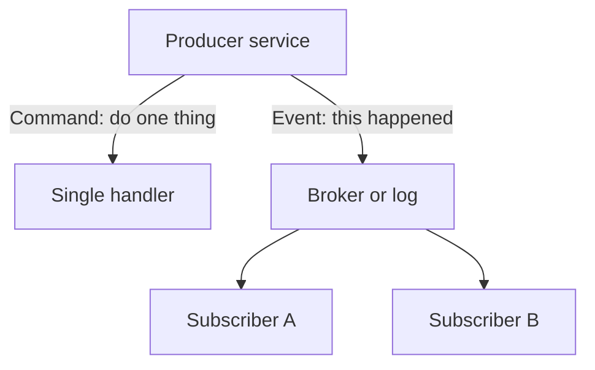

### Events vs Commands

| Question | Event | Command |
|---|---|---|
| Can many consumers react? | Usually yes | Usually one intended handler |
| Does sender know all receivers? | No | Often yes |
| Is failure the sender's problem? | Not for every subscriber | Yes, if command cannot be handled |
| Good naming | `InvoicePaid` | `PayInvoice` |

### Message Envelope

A message usually carries more than the payload:

| Field | Why it matters |
|---|---|
| Message ID | Deduplication and tracing |
| Correlation ID | Tie related commands and events across services |
| Causation ID | Show which event caused this event |
| Type / schema version | Safe evolution over time |
| Timestamp | Ordering, replay, and SLA monitoring |
| Partition key | Per-entity ordering in streams |

Mental shortcut: **commands ask; events announce; messages are the transport wrapper.**

<!-- SECTION: domain-events - DONE -->

## 3. Domain Events

A domain event records something meaningful in the business domain. It should use the language of the business, not infrastructure jargon.

Good examples:

- `OrderPlaced`
- `SeatReserved`
- `SubscriptionRenewed`
- `InventoryReserved`

Weak examples:

- `DatabaseUpdated`
- `KafkaMessageReceived`
- `HandlerFinished`

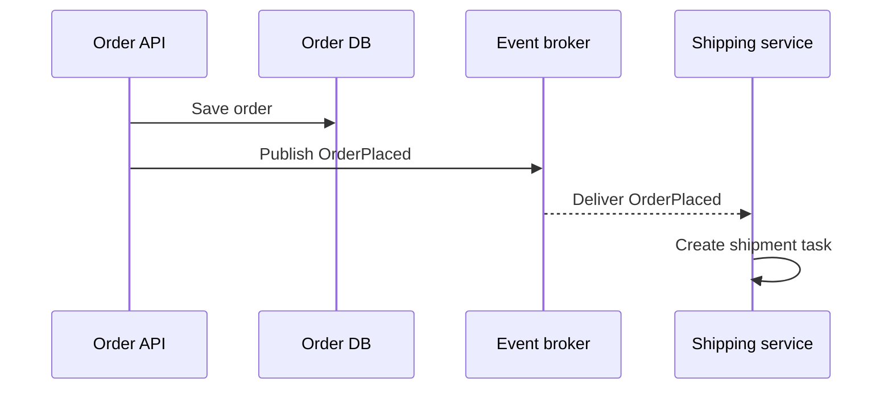

### Domain Event Design Rules

| Rule | Reason |
|---|---|
| Name events in past tense | Events describe facts |
| Keep payload focused | Consumers should not need the entire aggregate |
| Include identifiers, not full graphs | `orderId`, `customerId`, `totalAmount` |
| Version schemas carefully | Old consumers may still be running |
| Publish after durable state change | Avoid announcing facts that were not committed |

### Outbox Pattern

A common problem: the database commit succeeds, but the broker publish fails, or the opposite happens.

The outbox pattern writes the event to an outbox table in the same database transaction as the business write. A separate relay process publishes outbox rows to the broker.

```text
BEGIN TRANSACTION
  INSERT order
  INSERT outbox_event
COMMIT
Relay worker reads outbox and publishes to broker
```

Mental shortcut: **domain events are business facts, and they should not be published unless the fact is durable.**

<!-- SECTION: event-sourcing - DONE -->

## 4. Event Sourcing

Event sourcing stores state as an append-only sequence of events instead of overwriting the latest row.

Current state is derived by replaying events:

```text
OrderCreated
ItemAdded
ItemAdded
OrderSubmitted
```

The aggregate's current state is the result of applying those events in order.

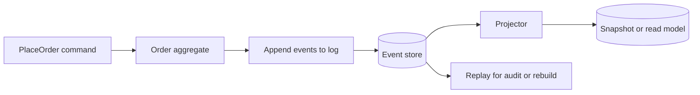

### Benefits and Costs

| Benefit | Cost |
|---|---|
| Full audit history | More storage and operational complexity |
| Rebuild state by replay | Replay time grows without snapshots |
| Temporal queries | Schema evolution must be planned |
| Natural fit with EDA | Projections can lag behind writes |
| Debugging and analytics | Duplicate or out-of-order events must be handled |

### Snapshots

Snapshots store the aggregate state at a point in time so replay does not start from event 1 every time.

| Approach | When to use |
|---|---|
| No snapshot | Small aggregates or early prototypes |
| Periodic snapshot | Large event histories |
| Cached projection | Fast reads through CQRS read models |

### Event Sourcing vs Event-Driven

| Idea | Event sourcing | Event-driven architecture |
|---|---|---|
| Primary goal | Persist state as events | Communicate asynchronously between services |
| Storage | Event log is source of truth | Often database plus broker |
| Scope | Usually one bounded context / aggregate | Often cross-service |

You can use EDA without event sourcing, and event sourcing often publishes integration events after commits.

Mental shortcut: **event sourcing is how one aggregate remembers its history; EDA is how services react to each other.**

<!-- SECTION: cqrs - DONE -->

## 5. CQRS Pattern

Command Query Responsibility Segregation separates writes from reads.

| Path | Responsibility | Optimized for |
|---|---|---|
| Command side | Validate business rules and change state | Correctness and invariants |
| Query side | Serve read-optimized models | Latency and flexible queries |

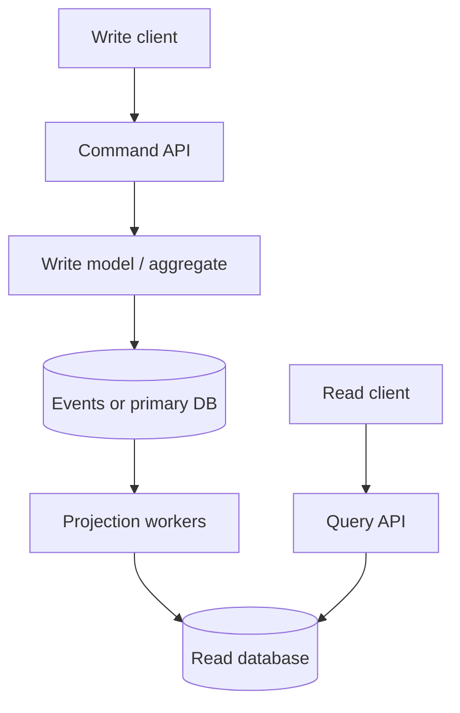

### Why CQRS Helps in EDA

| Problem | CQRS response |
|---|---|
| Write schema is normalized | Read schema can be denormalized |
| Complex joins slow reads | Build purpose-built views |
| Many consumers need different shapes | Multiple projections from same events |
| Reporting competes with OLTP | Separate read stores |

### CQRS Levels

| Level | Description | Interview note |
|---|---|---|
| Simple separation | Different methods or services for read and write | Common and practical |
| Separate models | Different tables or documents for reads | Useful when query patterns differ |
| Separate databases | Write DB plus one or more read DBs | Adds eventual consistency |
| Full event sourcing plus CQRS | Writes append events; reads are projections | Powerful but operationally heavy |

### Consistency Caveat

After a command succeeds, a read model may be stale for milliseconds or seconds. The UI should tolerate eventual consistency or show a pending state.

Mental shortcut: **CQRS means optimize writes and reads separately, then accept projection lag.**

<!-- SECTION: stream-processing - DONE -->

## 6. Event Stream Processing

Stream processing continuously reads events from a log and computes transformations, aggregations, joins, or alerts.

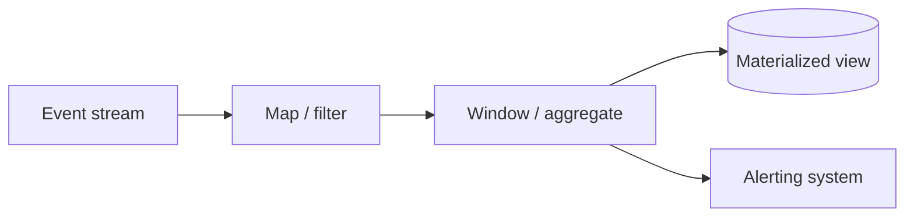

Common use cases:

| Use case | Example |
|---|---|
| Real-time analytics | Count signups per minute |
| Fraud detection | Flag unusual payment velocity |
| Metrics and monitoring | Error rate over 5-minute windows |
| Enrichment | Join clickstream with user profile stream |
| State tracking | Maintain per-user session state |

### Stream vs Batch

| Aspect | Stream processing | Batch processing |
|---|---|---|
| Latency | Seconds or less | Minutes to hours |
| Input | Unbounded event flow | Bounded dataset |
| Failure recovery | Offsets, checkpoints, state stores | Job rerun on partition |
| Examples | Flink, Kafka Streams, Spark Structured Streaming | Spark batch, warehouse ETL |

### Key Concepts

| Concept | Meaning |
|---|---|
| Partition | Shard of the stream for parallel processing |
| Key | Events with same key often need ordered processing |
| Window | Time or count boundary for aggregation |
| Watermark | Estimate of how late events may arrive |
| State store | Durable operator state for joins and aggregates |
| Checkpoint | Restart position after failure |

### Processing Guarantees

Stream systems often claim at-least-once processing. Exactly-once end-to-end usually depends on:

- Idempotent sinks
- Transactional writes to external systems
- Deduplication keys

Mental shortcut: **stream processing is moving computation to the event flow instead of polling databases.**

<!-- SECTION: messaging-brokers - DONE -->

## 7. Messaging and Message Brokers

A message broker decouples producers and consumers. It buffers messages, routes them, and applies delivery semantics.

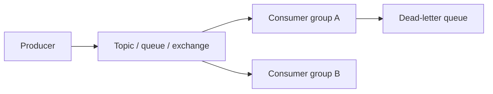

### Queue vs Log / Stream

| Model | Behavior | Good fit |
|---|---|---|
| Queue | Message often removed after ack | Task distribution, job workers |
| Pub/sub topic | Many subscribers see copies | Notifications, fan-out |
| Log / stream | Durable ordered append-only log | Replay, multiple consumer groups, audit |

| System style | Examples |
|---|---|
| Traditional broker | RabbitMQ, ActiveMQ, Amazon SQS |
| Distributed log | Apache Kafka, Amazon Kinesis, Pulsar |

### Messaging vs Event Streaming

| Question | Message queue mindset | Event log mindset |
|---|---|---|
| Primary unit | Message / task | Event / record |
| Consumer progress | Ack and delete or hide | Offset in partition |
| Replay | Usually limited | First-class |
| History | Often transient | Retained by policy |
| Multiple independent consumers | Possible but varies | Consumer groups read same log differently |

### Common Broker Features

| Feature | Why it matters |
|---|---|
| Acknowledgement | Consumer confirms successful processing |
| Visibility timeout | Unacked message becomes available again |
| Dead-letter queue | Isolate poison messages |
| Retry with backoff | Handle transient downstream failures |
| Routing keys / headers | Send subset of messages to specific consumers |
| Partitioning | Scale and preserve order per key |

Mental shortcut: **queues distribute work; logs retain history and enable replay.**

<!-- SECTION: enterprise-service-bus - DONE -->

## 8. Enterprise Service Bus

An Enterprise Service Bus (ESB) is a centralized integration layer that routes, transforms, mediates, and often orchestrates messages between many enterprise applications.

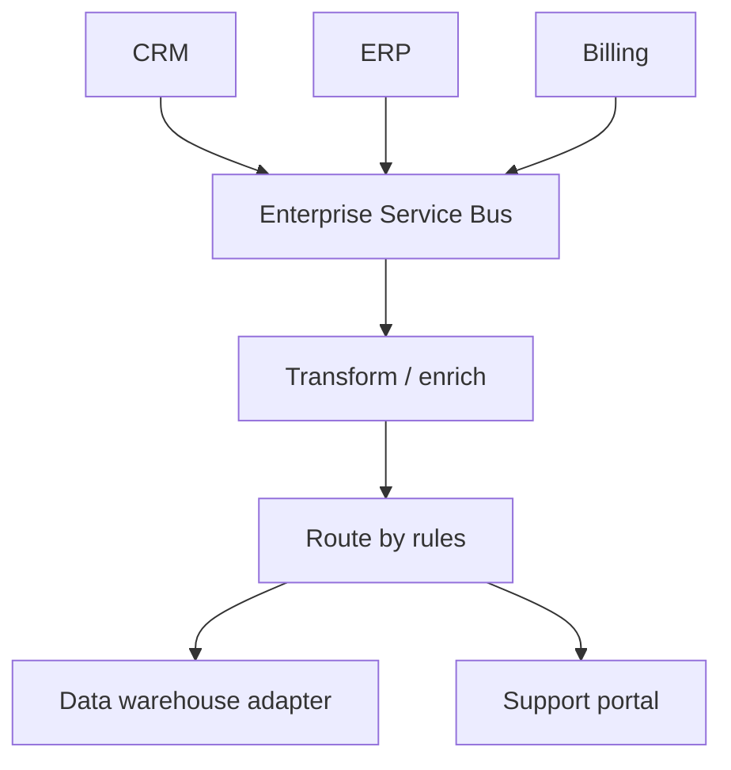

### What an ESB Typically Provides

| Capability | Example |
|---|---|
| Protocol bridging | HTTP to JMS to FTP |
| Message transformation | XML to JSON, canonical model mapping |
| Routing | Content-based routing |
| Mediation | Enrich message with reference data |
| Orchestration | Multi-step business process across systems |

### ESB vs Modern EDA

| ESB style | Modern event-driven style |
|---|---|
| Central hub with heavy middleware | Smaller services plus shared broker |
| Smart pipe, thinner endpoints in theory | Smart endpoints, dumb pipe preferred |
| Often synchronous-feeling orchestration | Choreography through events is common |
| Strong vendor and governance model | Cloud-native logs and schema registries |

In interviews, ESB thinking is still useful for legacy integration, but greenfield designs usually prefer:

- Domain-owned services
- Well-defined event contracts
- Schema registry or contract tests
- Choreography over centralized orchestration when possible

Mental shortcut: **ESB centralizes integration logic; modern EDA pushes ownership to services and shared contracts.**

<!-- SECTION: actor-model - DONE -->

## 9. Actor Model

The actor model treats each actor as a lightweight unit that:

- Owns private state
- Processes one message at a time
- Communicates only by sending messages
- Can create more actors

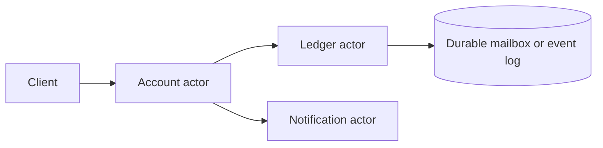

### Why Actors Relate to EDA

| Idea | Actor interpretation |
|---|---|
| No shared mutable memory | State is isolated per actor |
| Message passing | Commands and events become actor messages |
| Failure isolation | Supervisors can restart failed actors |
| Location transparency | Actor addresses hide deployment details |

### Actor Systems

| Platform | Notes |
|---|---|
| Akka | JVM, common in Scala/Java systems |
| Orleans | .NET virtual actors with activation model |
| Erlang/OTP | Classic actor runtime, strong supervision trees |

### Actors vs Queue Workers

| Aspect | Actor | Queue worker |
|---|---|---|
| State | Often in-memory per actor | Often stateless, state in DB |
| Ordering | Per actor mailbox is serial | Depends on queue partitioning |
| Scaling | Many actors across nodes | Many consumers on shared queue |
| Durability | Needs persistence layer for recovery | Queue or log provides durability |

Actors are strong when many independent entities need serialized updates, such as one actor per user session, game room, or bank account.

Mental shortcut: **actors are event-driven at the object level: one owner, one mailbox, no shared locks.**

<!-- SECTION: enterprise-integration - DONE -->

## 10. Enterprise Integration Architecture

Enterprise Integration Patterns (EIP) describe how systems connect in large organizations. Many EDA ideas map directly to these patterns.

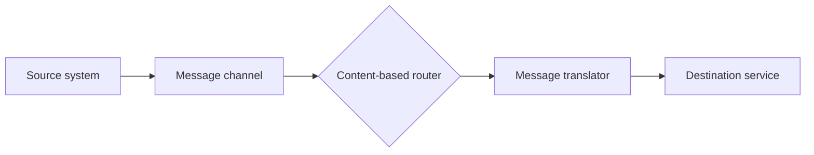

### High-Value Patterns for Interviews

| Pattern | Meaning | EDA example |
|---|---|---|
| Message channel | Reliable path between components | Kafka topic, SQS queue |
| Publish-subscribe | One publisher, many subscribers | `OrderPlaced` fan-out |
| Message router | Send messages by rule | Route by country or product type |
| Message translator | Convert formats | Legacy XML to JSON event |
| Aggregator | Combine multiple messages into one | Wait for all shipment parts |
| Splitter | Break one message into many | Bulk import to per-row events |
| Dead-letter channel | Handle poison messages | DLQ after max retries |
| Claim check | Store large payload elsewhere, send reference | S3 object ID in event body |
| Saga / process manager | Coordinate multi-step business process | Order workflow across payment and inventory |

### Choreography vs Orchestration

| Style | How it works | Tradeoff |
|---|---|---|
| Choreography | Services react to events without a central controller | Loose coupling, harder global visibility |
| Orchestration | Central coordinator tells each step what to do next | Easier process view, central failure point |

Example saga for `PlaceOrder`:

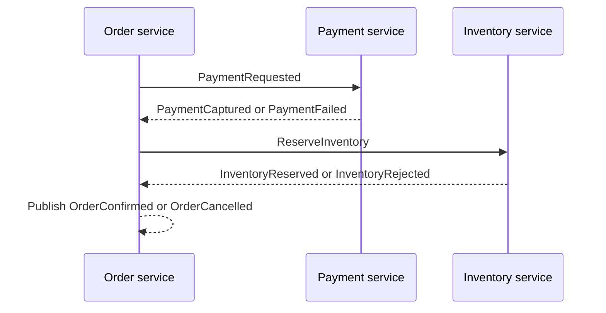

Compensating events undo prior steps when a later step fails:

- `PaymentCaptured` then `InventoryRejected` may trigger `PaymentRefunded`

Mental shortcut: **integration patterns name the pipes and routers; sagas name the multi-step business workflow.**

<!-- SECTION: delivery-ordering-idempotency - DONE -->

## 11. Delivery Guarantees, Ordering, and Idempotency

Distributed messaging is rarely perfect. Design for the guarantee you actually have, not the one you wish you had.

### Delivery Guarantees

| Guarantee | Meaning | Typical reality |
|---|---|---|
| At-most-once | Message may be lost, not duplicated | Fire-and-forget |
| At-least-once | Message arrives one or more times | Most common with retries |
| Exactly-once | Appears once end-to-end | Hard; usually "effectively once" via idempotency |

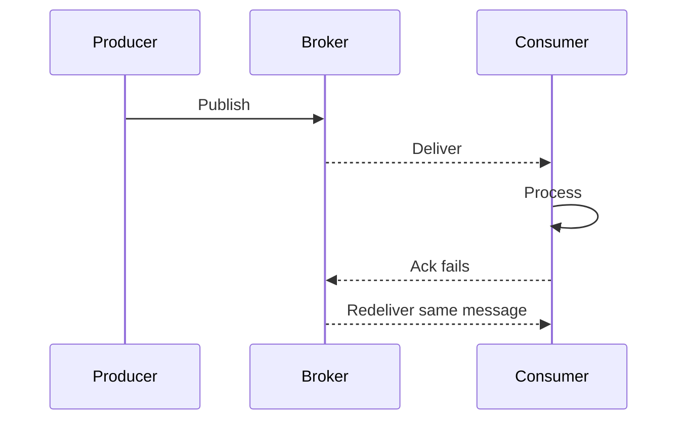

### Ordering

| Scope | Rule of thumb |
|---|---|
| Global order | Expensive and usually unnecessary |
| Per-partition order | Common in Kafka-style logs |
| Per-entity order | Usually what business needs, such as per `orderId` |
| No order | Independent tasks can process in parallel |

If ordering matters, use the same partition key for related events.

### Idempotency

An operation is idempotent if running it more than once has the same effect as running it once.

| Technique | How it helps |
|---|---|
| Idempotency key | Client sends `Idempotency-Key`; server stores result |
| Dedup table | Store processed message IDs |
| Natural keys | `orderId + eventType` uniqueness constraint |
| Upserts | `INSERT ... ON CONFLICT` or equivalent |
| Version checks | Ignore older events with stale version numbers |

### Safe Consumer Template

```text
1. Receive message
2. Check dedup store / idempotency key
3. If already processed, ack and exit
4. Process business logic in transaction
5. Mark message processed
6. Ack broker
```

Mental shortcut: **assume at-least-once delivery and make consumers safe to run twice.**

<!-- SECTION: when-to-use - DONE -->

## 12. When to Use Event-Driven Architecture

EDA is a tool, not a default architecture.

### Good Fits

| Situation | Why EDA helps |
|---|---|
| Many downstream reactions to one action | Fan-out without coupling producers |
| Peak traffic smoothing | Queue or log absorbs bursts |
| Cross-team integration | Stable event contracts reduce API churn |
| Audit and analytics needs | Events create a natural trail |
| Long-running workflows | Async steps with retries and compensation |
| Read/write shape mismatch | CQRS projections from same event stream |

### Poor Fits

| Situation | Why EDA hurts |
|---|---|
| Simple CRUD with one database | Sync API plus DB is simpler |
| Strong immediate read-your-writes everywhere | Projections add lag |
| Small team, low scale | Operational overhead may not pay off |
| Tight latency on every step | Extra hops and consumer lag |
| Hard-to-define event contracts | Poor schemas create more coupling than REST |

### Decision Questions

| Question | If yes, EDA is more attractive |
|---|---|
| Can downstream work happen asynchronously? | Yes |
| Will multiple services need the same fact? | Yes |
| Is replay or audit valuable? | Yes |
| Can users tolerate brief read lag? | Yes |
| Are you ready to operate brokers, DLQs, and lag alerts? | Yes |

Mental shortcut: **use EDA when facts fan out, time decouples, and you can operate async failure modes.**

<!-- SECTION: warnings - DONE -->

## 13. Design Warnings

Event-driven bugs often appear only under retries, deploys, or traffic spikes.

| Warning | What can go wrong | Safer design habit |
|---|---|---|
| Dual writes | DB saved, event not published | Outbox pattern or transactional messaging |
| Chatty synchronous chains disguised as EDA | Still coupled and slow | Publish once, consume many |
| God events | One huge payload breaks consumers | Small facts plus claim check for large data |
| Missing schema versioning | Deploy breaks old consumers | Versioned contracts and compatibility tests |
| Hidden ordering assumptions | Newer state overwritten by older event | Sequence numbers or version checks |
| No DLQ | Poison message blocks queue | Dead-letter and replay tooling |
| Infinite retries | Bad message never exits | Max attempts plus alert |
| Unclear ownership | Nobody owns contract or consumer lag | Service owns its published events |
| "Exactly once" hand-waving | Duplicate charges or emails | Idempotency keys and dedup |
| Global ordering demand | System becomes single-lane | Order only per business key |

### Red Flags in Interviews

Be careful when you hear:

- "Kafka solves consistency" without discussing consumers and projections.
- "Events instead of APIs" for every query path.
- "Microservices so we need Kafka" without a fan-out or async reason.
- "Saga" without naming compensating actions.
- "Event sourcing everywhere" when CRUD would suffice.

### Useful Invariants

| System | Invariant |
|---|---|
| Payments | A payment intent should not be captured twice |
| Inventory | Reserved stock cannot be oversold |
| Notifications | A user should not receive duplicate emails for one event |
| Order status | Status transitions should follow allowed state machine |
| Projections | Read model should converge after all events processed |

Mental shortcut: **EDA safety starts with delivery assumptions, idempotency, and explicit invariants.**

<!-- SECTION: interview-language - DONE -->

## 14. Interview Language

For event-driven designs, use terms like:

```text
domain event
integration event
pub/sub
event log
consumer group
projection
eventual consistency
outbox pattern
idempotency key
dead-letter queue
partition key
saga
compensating event
choreography
orchestration
schema evolution
at-least-once delivery
```

Strong opening move:

> I would treat the write path and read path separately. The order service commits state, publishes `OrderPlaced` through an outbox, and downstream services build their own read models or side effects asynchronously.

EDA answer for fan-out:

> When an order is placed, I do not want the order API to call shipping, billing, analytics, and email synchronously. I would emit one domain event to a durable log so each consumer can scale independently and retry safely with idempotent handlers.

Event sourcing answer:

> For this bounded context, I would store state as an append-only event history so we can audit changes and rebuild projections. I would add snapshots because replay cost will grow over time.

CQRS answer:

> Writes go through the command model that enforces invariants. Reads come from a denormalized projection optimized for the UI, accepting brief lag after a write.

Saga answer:

> This is a multi-step workflow across payment and inventory. I would use a saga with compensating events: if inventory reservation fails after payment capture, publish `PaymentRefundRequested` rather than leaving inconsistent state.

<!-- SECTION: final-model - DONE -->

## 15. Final Mental Model

Event-driven architecture means services coordinate by reacting to durable facts.

Use this map:

```text
Command:
Ask one handler to change state.

Domain event:
Announce a business fact after a successful change.

Broker or log:
Decouple producers and consumers.

Projection / CQRS:
Build read models from events.

Stream processing:
Continuously transform event flows.

Delivery reality:
Assume at-least-once; design idempotent consumers.

Workflow:
Use saga patterns when multiple services must agree over time.
```

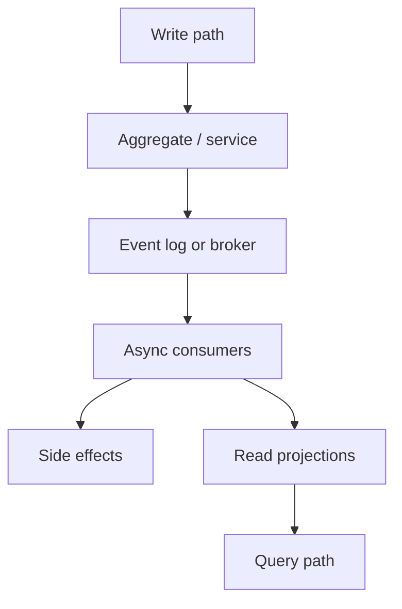

For system design interviews, the strongest answer usually sounds like:

```text
The business fact is X.
It is published after Y commit.
Consumers Z1 and Z2 react independently.
Ordering is required per K.
Retries are safe because of idempotency rule I.
Read models may lag briefly by design.
```

Final shortcut: **EDA is publish facts once, react many times safely, and separate writes from reads when needed.**

<!-- SECTION: checklist - DONE -->

## 16. 30-Minute Review Checklist

Use this checklist to test whether you can explain the topic:

- Can you explain EDA as reacting to facts instead of synchronous chaining?
- Can you distinguish events, commands, and messages with examples?
- Can you define a domain event and name good payload fields?
- Can you explain the outbox pattern and why dual writes fail?
- Can you describe event sourcing as append-only history plus replay?
- Can you explain when snapshots or projections are needed?
- Can you describe CQRS and acceptable read lag?
- Can you contrast queue-based messaging with log-based streaming?
- Can you name broker features like acks, DLQ, and partitioning?
- Can you explain what an ESB does and how it differs from modern EDA?
- Can you describe the actor model as isolated state plus a mailbox?
- Can you name at least three enterprise integration patterns?
- Can you compare choreography and orchestration in a saga?
- Can you explain at-least-once delivery and idempotent consumers?
- Can you describe when per-entity ordering is enough?
- Can you name when EDA is a good fit and when it is overkill?
- Can you state invariants for payments, inventory, or notifications in an event flow?

If you remember only one thing:

```text
Event-driven design is not "add Kafka."
It is deciding which facts to publish, who reacts asynchronously,
and how the system stays correct when messages are duplicated or delayed.
```
