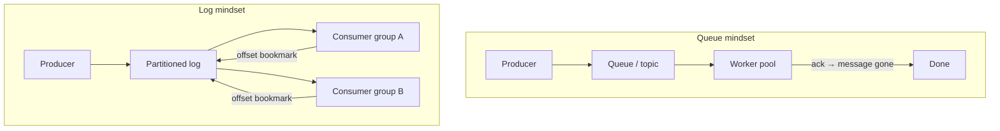
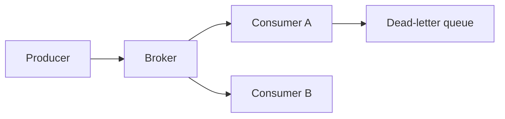
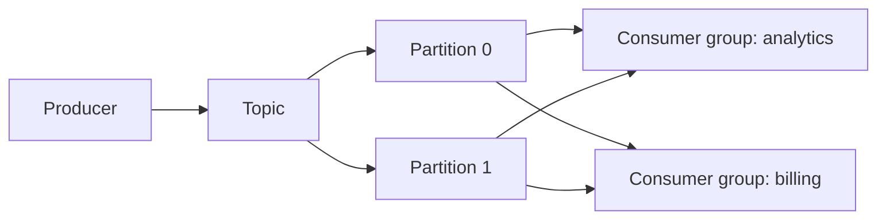
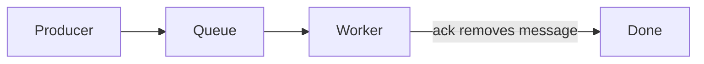
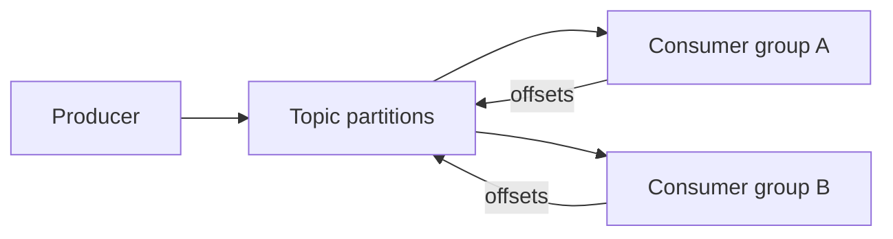
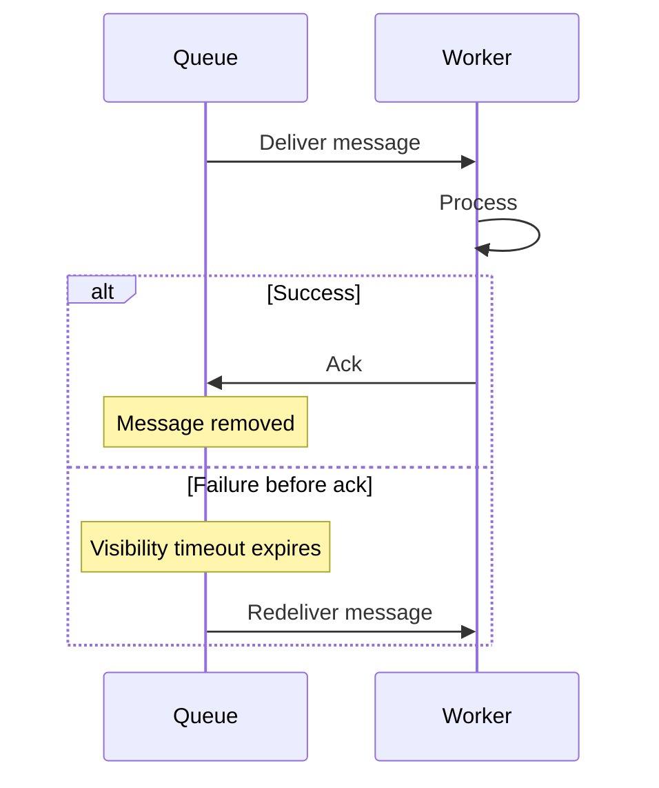
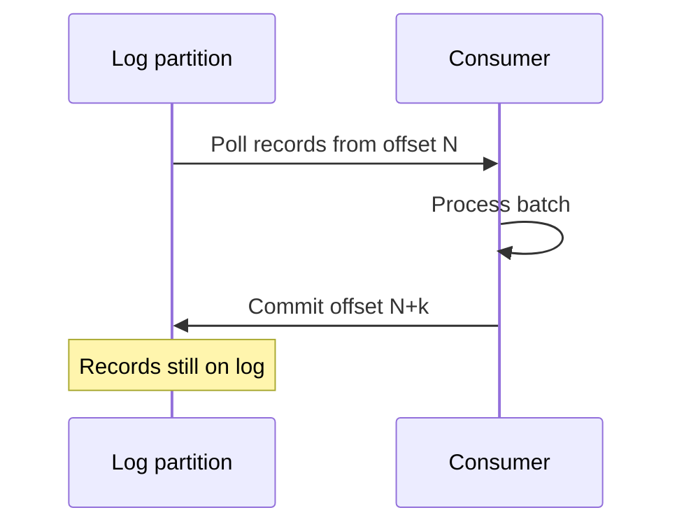
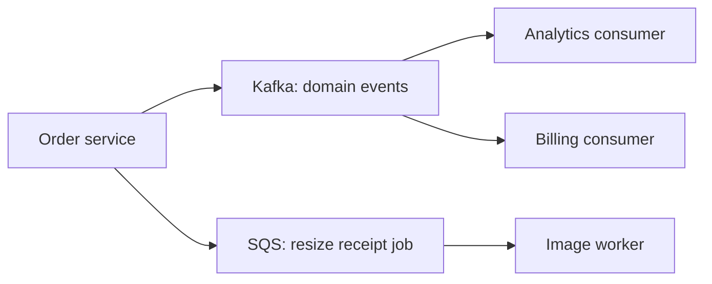
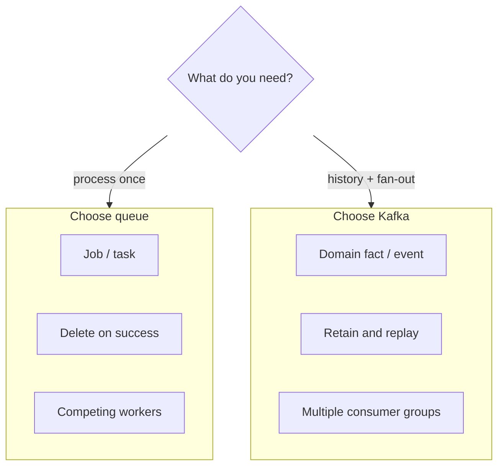

# Kafka vs Messaging Systems 30-Minute Study Guide

Goal: understand the difference between queue-based message brokers and log-based streaming platforms (Kafka) well enough to choose the right tool and explain tradeoffs in a system design interview.

Related: [Event-Driven Architecture guide §7](7.event-driven-architecture-study-guide.md#7-messaging-and-message-brokers)

<!-- SECTION: table-of-contents - DONE -->

## Table of Contents

1. [Messaging Mental Model](#1-messaging-mental-model)
2. [What Counts as a Messaging System](#2-what-counts-as-a-messaging-system)
3. [What Kafka Is (and Is Not)](#3-what-kafka-is-and-is-not)
4. [Queue vs Log — Core Comparison](#4-queue-vs-log--core-comparison)
5. [Consumer Semantics](#5-consumer-semantics)
6. [Delivery Guarantees and Ordering](#6-delivery-guarantees-and-ordering)
7. [Feature and Ops Comparison](#7-feature-and-ops-comparison)
8. [When to Use Which](#8-when-to-use-which)
9. [Design Warnings and Red Flags](#9-design-warnings-and-red-flags)
10. [Interview Language](#10-interview-language)
11. [Final Mental Model](#11-final-mental-model)
12. [30-Minute Review Checklist](#12-30-minute-review-checklist)

<!-- SECTION: mental-model - DONE -->

## 1. Messaging Mental Model

In interviews, "Kafka vs messaging" usually means:

> **Queue-based brokers** (distribute work, delete on success) vs **log-based streaming** (retain history, consumers track offsets).

Kafka is not the opposite of messaging. It is messaging infrastructure built as a **distributed, append-only log**.

The practical question is:

> Do I need a **task queue** (process this once, then forget) or a **durable event log** (many readers, replay, retained history)?



| Mindset | Primary question | Typical outcome |
|---|---|---|
| Queue | Who processes this job next? | Work is consumed and removed |
| Log | What happened, and who needs to read it? | Records stay; readers advance independently |

Mental shortcut: **queues distribute work; logs retain history and enable replay.**

<!-- SECTION: traditional-messaging - DONE -->

## 2. What Counts as a Messaging System

"Messaging system" in interviews usually means a **message broker** that decouples producers and consumers with buffering, routing, and delivery semantics.



### Common Broker Styles

| Style | Behavior | Examples |
|---|---|---|
| Point-to-point queue | One consumer typically owns a message until ack | Amazon SQS, IBM MQ queues |
| Pub/sub topic | Many subscribers receive copies | RabbitMQ fanout, SNS topics |
| Enterprise bus | Central routing, transform, orchestration | Legacy ESB, JMS hubs |

### Well-Known Traditional Brokers

| System | Strengths | Interview note |
|---|---|---|
| RabbitMQ | Flexible routing (exchanges, bindings), mature AMQP | Great for task queues and complex routing |
| Amazon SQS | Managed, simple, scales with ops burden low | Visibility timeout + DLQ are core concepts |
| ActiveMQ / JMS | Enterprise Java integration | Often legacy; know ack and durable subscriptions |
| Azure Service Bus | Queues and topics with sessions | Sessions give ordered processing per session ID |

### What Queue-Based Brokers Optimize For

| Goal | Meaning | Example |
|---|---|---|
| Work distribution | Split load across workers | Image resize workers pull from a queue |
| Decoupling | Producer does not wait for slow consumer | API enqueues email job, returns fast |
| Backpressure | Buffer spikes without dropping requests | Order spikes buffered in SQS |
| Simple semantics | Message processed → removed | Payroll job runs once per message |

The tradeoff is limited history. After ack (or TTL expiry), the message is usually gone. Replay is not a first-class feature.

Mental shortcut: **traditional messaging = buffer and route tasks; success often means delete.**

<!-- SECTION: kafka-model - DONE -->

## 3. What Kafka Is (and Is Not)

Apache Kafka is a **distributed commit log** used for high-throughput event streaming. Similar systems: Amazon Kinesis, Apache Pulsar, Redpanda.



### Core Kafka Concepts

| Concept | Meaning |
|---|---|
| Topic | Named stream of records |
| Partition | Ordered, append-only shard of a topic; unit of parallelism |
| Offset | Position of a consumer within a partition (bookmark) |
| Consumer group | Set of consumers that cooperatively read a topic; each partition assigned to one member |
| Retention | Records kept by time or size policy, not deleted on read |
| Replication | Copies of partitions on multiple brokers for durability |

### What Kafka Is

| Property | Why it matters in interviews |
|---|---|
| Durable append-only log | Events survive after consumers read them |
| Replay | Rewind offsets and reprocess |
| Multiple consumer groups | Same data, different independent readers |
| High throughput | Designed for millions of events/sec at scale |
| Per-partition ordering | Events with same key land in same partition |

### What Kafka Is Not

| Misconception | Reality |
|---|---|
| A simple job queue | Records are retained; "done" means offset committed, not deleted |
| Guaranteed global ordering | Ordering is per partition, not across entire topic |
| Exactly-once everywhere | Requires idempotent producers, transactions, and careful consumer design |
| Free of operational cost | Cluster sizing, rebalance, retention, and monitoring matter |

Mental shortcut: **Kafka is a retained log with offsets, not a delete-on-success queue.**

<!-- SECTION: core-comparison - DONE -->

## 4. Queue vs Log — Core Comparison

This is the table most interviews expect you to know cold.

| Question | Queue / traditional broker | Log / Kafka-style stream |
|---|---|---|
| Primary unit | Message / task | Event / record |
| After successful consume | Often deleted or hidden | Stays until retention expires |
| Consumer progress | Ack (and delete or visibility hide) | Offset per partition |
| Replay | Usually limited or absent | First-class |
| History | Often transient (TTL) | Retained by policy |
| Multiple independent consumers | Possible; behavior varies by broker | Consumer groups read same log differently |
| Competing workers | Split messages across pool | Partitions split work within one group |
| Ordering | Per queue (varies) | Per partition (strong within partition) |
| Good fit | Jobs, RPC-style async, simple tasks | Fan-out, audit, stream processing, reprocessing |

### Three Models Side by Side

| Model | Behavior | Good fit |
|---|---|---|
| Queue | Message often removed after ack | Task distribution, job workers |
| Pub/sub topic | Many subscribers see copies | Notifications, fan-out |
| Log / stream | Durable ordered append-only log | Replay, multiple consumer groups, audit |





### Messaging vs Event Streaming Mindset

| Dimension | Message queue mindset | Event log mindset |
|---|---|---|
| Sender intent | "Please process this" | "This fact happened" |
| Consumer contract | Process and acknowledge | Read at your offset, commit when ready |
| Adding a new consumer | May need new queue or copy setup | New consumer group reads from chosen offset |
| Failure recovery | Message becomes visible again | Re-read from last committed offset |

Mental shortcut: **if the business needs history and independent readers, think log; if it needs one-time work, think queue.**

<!-- SECTION: consumer-semantics - DONE -->

## 5. Consumer Semantics

How consumers track progress is the biggest behavioral difference.

### Queue-Based: Ack and Visibility



| Mechanism | Meaning |
|---|---|
| Ack | Consumer confirms success; broker removes or hides message |
| Visibility timeout | Unacked message becomes available again (SQS pattern) |
| Competing consumers | Multiple workers pull from same queue; each message goes to one worker |
| Prefetch / in-flight limits | Control how many unacked messages a consumer holds |

**Pitfall:** Long processing without extending visibility → duplicate delivery to another worker.

### Log-Based: Offsets and Consumer Groups



| Mechanism | Meaning |
|---|---|
| Poll | Consumer reads batch of records from assigned partitions |
| Commit offset | Bookmark "I have processed up to here" |
| Consumer group | Partitions divided among members; rebalance on join/leave |
| Replay | Reset offset to earlier position and re-read |

**Pitfall:** Commit offset before side effects finish → message "lost" on crash. Commit after success → possible duplicate on crash (design for at-least-once).

### Competing Consumers Compared

| Scenario | Queue | Kafka |
|---|---|---|
| Scale workers | Add more consumers to same queue | Add consumers to same group (up to partition count) |
| Max parallelism | Queue depth and consumer count | Number of partitions in topic |
| Same message to many apps | Usually duplicate via fanout or multiple queues | Multiple consumer groups on same topic |
| Reprocess history | Hard | Reset offsets or new group from `earliest` |

Mental shortcut: **queues ack away work; Kafka bookmarks position in a retained log.**

<!-- SECTION: delivery-ordering - DONE -->

## 6. Delivery Guarantees and Ordering

Both styles face duplicates and ordering limits. Name the guarantee you actually have.

### Delivery Semantics

| Guarantee | Meaning | Typical reality |
|---|---|---|
| At-most-once | May lose messages, no duplicates | Fire-and-forget publish or commit-before-process |
| At-least-once | No loss, duplicates possible | Most common default with retries |
| Exactly-once | Process once end-to-end | Hard; needs idempotency + transactions + dedup |

| System | Default leaning | Interview line |
|---|---|---|
| SQS / RabbitMQ | At-least-once with ack + retry | "I assume duplicates and make handlers idempotent." |
| Kafka | At-least-once with offset commit | "I commit offsets after side effects and use idempotency keys." |
| Kafka transactions | Exactly-once within Kafka ecosystem | "Only when full pipeline supports it; otherwise at-least-once + dedup." |

### Ordering

| Scope | Queue brokers | Kafka |
|---|---|---|
| Global order | Sometimes single queue = FIFO | Not across whole topic |
| Per entity | FIFO queue or message group ID | Partition by key (`orderId`) |
| Parallelism vs order | One lane = strict order, no scale | More partitions = more parallelism, order only per key |

```text
Rule: If two events for the same Order must be processed in order,
route them to the same partition (Kafka) or same message group (SQS FIFO).
```

### Idempotency (Required for Both)

| Technique | Example |
|---|---|
| Idempotency key | `paymentId` stored before charging |
| Dedup table | Processed message IDs with TTL |
| Natural idempotency | `SET status = SHIPPED WHERE id = X AND status = PACKED` |
| Upsert by business key | Warehouse projection keyed by `sku` |

Mental shortcut: **assume at-least-once everywhere; ordering is per key, not global.**

<!-- SECTION: feature-ops - DONE -->

## 7. Feature and Ops Comparison

| Feature | Traditional broker | Kafka |
|---|---|---|
| Routing | Rich (exchanges, headers, bindings) | Topic + key → partition |
| Message size | Often smaller default limits | Larger records; use claim check for blobs |
| Retention | Short / until consumed | Policy-based (days, compacted topics) |
| Dead-letter queue | Built-in or common pattern | Custom DLQ topic + skip/retry tooling |
| Delayed delivery | Native in some brokers | Less common; use scheduling layer |
| Request-reply | Temp reply queues common | Possible but not primary pattern |
| Schema management | Ad hoc JSON/XML | Schema Registry common in mature shops |
| Throughput | Strong for task workloads | Built for very high event volume |
| Ops complexity | Lower for managed queues (SQS) | Cluster ops, rebalance, retention tuning |

### Managed vs Self-Hosted (Interview Context)

| Choice | When to mention |
|---|---|
| SQS / SNS / Service Bus | Fast to adopt, AWS/Azure-native, less ops |
| RabbitMQ self-hosted | Full routing control, team owns uptime |
| MSK / Confluent Cloud | Kafka without running ZooKeeper/KRaft yourself |
| Self-hosted Kafka | Maximum control, highest operational burden |

Mental shortcut: **brokers trade routing flexibility for log retention and replay; Kafka trades ops cost for scale and history.**

<!-- SECTION: when-to-use - DONE -->

## 8. When to Use Which

### Decision Table

| Requirement | Prefer queue (SQS, RabbitMQ) | Prefer log (Kafka, Kinesis) |
|---|---|---|
| One-time task processing | Yes | Rarely |
| Message should disappear after success | Yes | No (retention-based) |
| Multiple services need same event history | Awkward | Yes |
| Replay / reprocess from past | Limited | Yes |
| Audit trail of all facts | Weak | Yes |
| High fan-out (many independent consumers) | Possible with fanout | Yes (consumer groups) |
| Stream analytics (aggregations, windows) | Poor fit | Yes |
| Complex routing rules | Yes | Simpler model |
| Small team, minimal ops | Managed queue | Managed Kafka |

### Hybrid Pattern (Strong Interview Answer)

Many production systems use both:



| Path | Tool | Why |
|---|---|---|
| `OrderPlaced`, `PaymentCaptured` | Kafka | Fan-out, replay, multiple teams consume |
| Generate PDF, send email batch job | SQS / RabbitMQ | Task done once, no long retention needed |
| Poison message isolation | DLQ on both | Queue DLQ native; Kafka → dead-letter topic |

### Example Scenarios

| Scenario | Recommendation | One-line reason |
|---|---|---|
| Background email after signup | SQS / queue | Fire-and-forget task, no replay needed |
| Order events to inventory, billing, search | Kafka | One fact, many consumers, retained history |
| Payment webhook retry | Queue with DLQ | Process once, visibility timeout for retries |
| Fraud model retrain on last 90 days | Kafka | Replay from retained log |
| RPC between two services | HTTP/gRPC first | Messaging adds async complexity without need |

Mental shortcut: **Kafka for facts that fan out and may be replayed; queues for jobs that should complete once and disappear.**

<!-- SECTION: warnings - DONE -->

## 9. Design Warnings and Red Flags

| Warning | What can go wrong | Safer habit |
|---|---|---|
| Kafka without fan-out or replay need | Unnecessary ops and complexity | Start with a queue; upgrade when retention/replay required |
| Queue for event sourcing | History lost; cannot rebuild projections | Use a log with retention |
| Commit offset before side effect | Lost processing on crash | Commit after success; accept duplicates |
| Global ordering demand | Single partition bottleneck | Order per business key only |
| Replay without idempotency | Double charges, duplicate emails | Idempotency keys before replay |
| Too few partitions | Cannot scale consumers | Size partitions for peak parallelism |
| Too many partitions | Rebalance overhead, file handles | Plan partition count with growth |
| Treating Kafka like SQS | Confusion about delete vs offset | Explain log retention explicitly |
| No DLQ / poison handling | Stuck consumer lag | Dead-letter topic or queue |
| Dual writes | DB saved, event not published | Outbox pattern |

### Red Flags in Interviews

Be careful when you hear (or say):

- "We need Kafka" without naming fan-out, replay, or retention.
- "Kafka gives exactly-once" without consumer and downstream design.
- "Messages are processed once" on Kafka without offset and retry discussion.
- "Ordering across the whole system" without partition or key strategy.
- "Replace all APIs with events" when queries need synchronous read paths.

### Useful Invariants (Either Broker)

| Domain | Invariant |
|---|---|
| Payments | Do not capture the same payment twice |
| Inventory | Do not oversell reserved stock |
| Notifications | One business event → one user-visible email |
| Offsets / acks | Progress marker reflects completed side effects |

Mental shortcut: **the broker does not make you correct; delivery semantics and idempotency do.**

<!-- SECTION: interview-language - DONE -->

## 10. Interview Language

Use terms like:

```text
message broker
point-to-point queue
pub/sub
topic
partition
offset
consumer group
ack
visibility timeout
dead-letter queue
retention
replay
at-least-once
idempotency key
partition key
fan-out
claim check
outbox pattern
compacted topic
```

### Strong Opening Moves

**Clarify the question:**

> When you say messaging vs Kafka, I would separate queue-based brokers that delete or hide messages after ack from log-based platforms like Kafka that retain records and let each consumer group track its own offset.

**Task queue design:**

> For background jobs like image resizing, I would use a queue such as SQS or RabbitMQ. Workers compete for messages, ack on success, and failed work becomes visible again or moves to a DLQ. I do not need long retention or multiple independent readers of the same history.

**Event backbone design:**

> For order lifecycle facts, I would publish to Kafka. Inventory, billing, and analytics each use their own consumer group on the same topic. If billing deploys a bug, we can reset offsets and replay with idempotent handlers.

**Hybrid design:**

> I would use Kafka for domain events that fan out and may be replayed, and a queue for imperative tasks that should run once and disappear. They solve different decoupling problems.

**Ordering answer:**

> Strict ordering only applies per business key. I would partition by `orderId` so all events for one order stay ordered, while the topic still scales across many orders.

**Delivery guarantee answer:**

> I assume at-least-once delivery. Producers may retry, consumers may crash before commit, so handlers use idempotency keys and stores check version or state before applying side effects.

<!-- SECTION: final-model - DONE -->

## 11. Final Mental Model

```text
Messaging (classic):
  Producer → broker queue/topic → consumer acks → message gone.

Kafka (log):
  Producer → append to partition log → consumer groups read at offsets → records retained.

Choose queue when:
  Work distribution, one-time processing, simple ops.

Choose Kafka when:
  Fan-out, replay, audit history, stream processing, many independent readers.

Both require:
  At-least-once thinking, idempotent consumers, per-key ordering when needed.
```



For system design interviews, the strongest answer usually sounds like:

```text
The workload is [task | fact].
I need [one consumer | many independent consumers].
I need [no history | replay/audit].
Ordering is required per [key].
Duplicates are safe because [idempotency rule].
Therefore I pick [SQS/RabbitMQ | Kafka] for this path.
```

Final shortcut: **Kafka is not "better messaging" — it is a retained log. Queues are not "worse" — they are optimized for work distribution.**

<!-- SECTION: checklist - DONE -->

## 12. 30-Minute Review Checklist

Use this checklist to test whether you can explain the topic:

- Can you state that Kafka is messaging infrastructure, but log-based rather than queue-based?
- Can you name three traditional brokers and what each is good for?
- Can you define topic, partition, offset, and consumer group?
- Can you contrast ack/delete with offset commit on a retained log?
- Can you draw or describe competing consumers on a queue vs partitions in a consumer group?
- Can you explain why replay is natural in Kafka and limited in most queues?
- Can you describe at-least-once delivery and why idempotency is required for both?
- Can you explain per-partition (or per-key) ordering vs global ordering?
- Can you give a scenario where a queue is the right choice?
- Can you give a scenario where Kafka is the right choice?
- Can you describe a hybrid architecture using both?
- Can you name two design warnings (offset commit timing, replay without dedup)?
- Can you list three interview red flags about choosing Kafka?
- Can you deliver a 30-second "strong opening move" for a fan-out event design?

If you remember only one thing:

```text
Queues distribute work and forget.
Logs retain facts and let many readers catch up at their own pace.
Pick based on whether the business needs history and replay, not hype.
```
