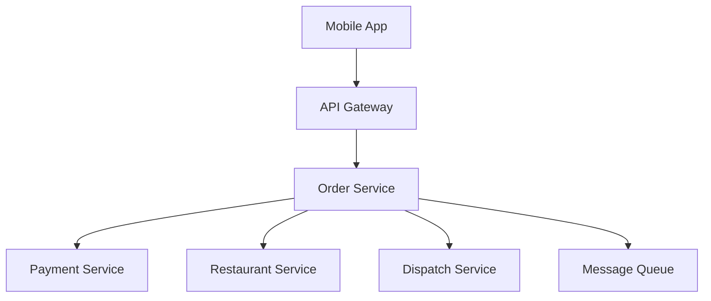
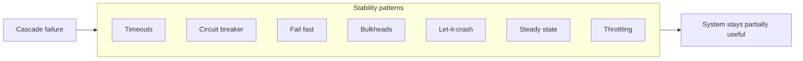
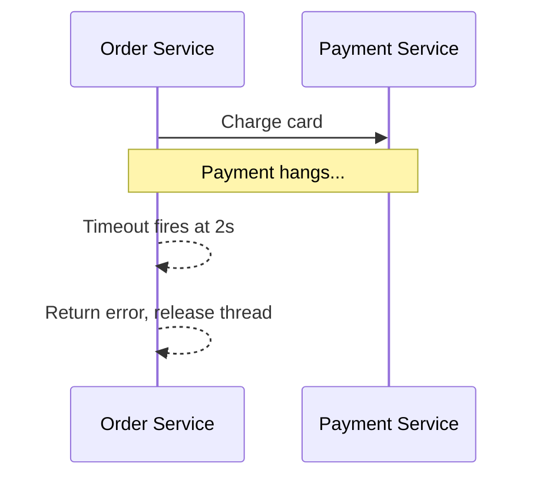
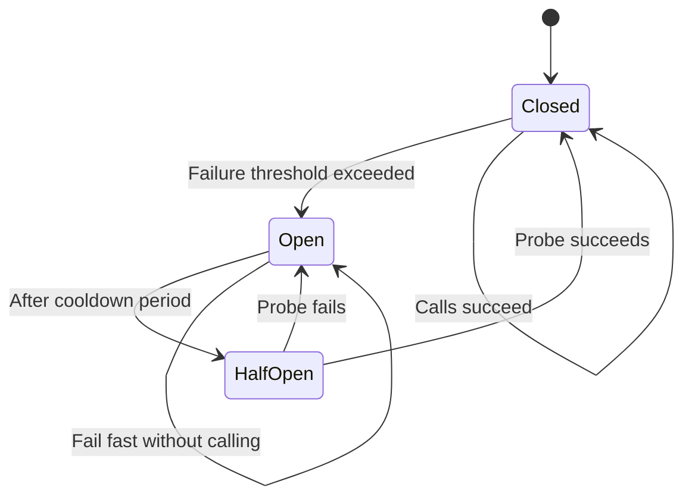
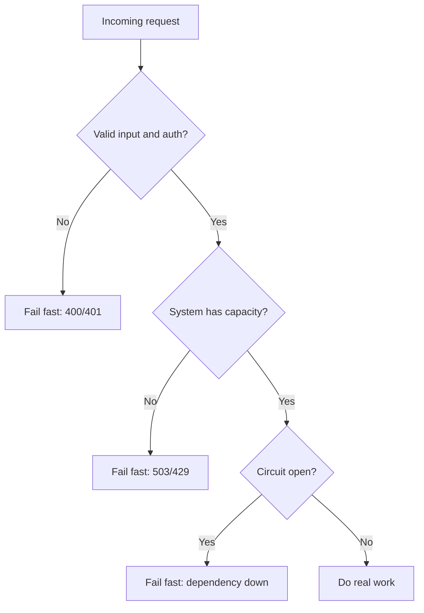
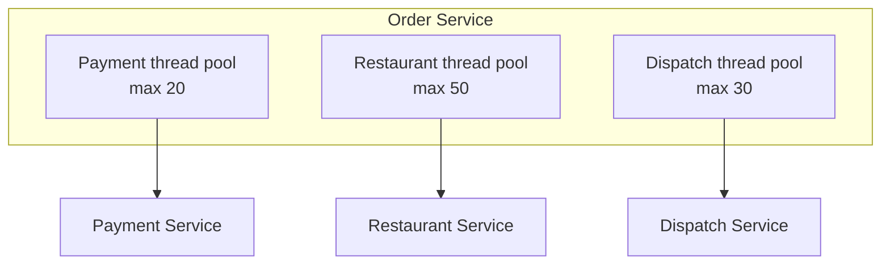
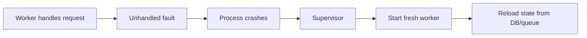
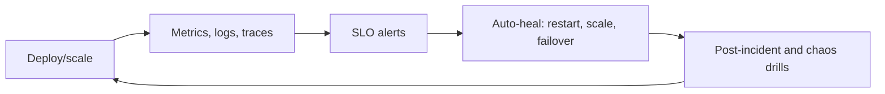
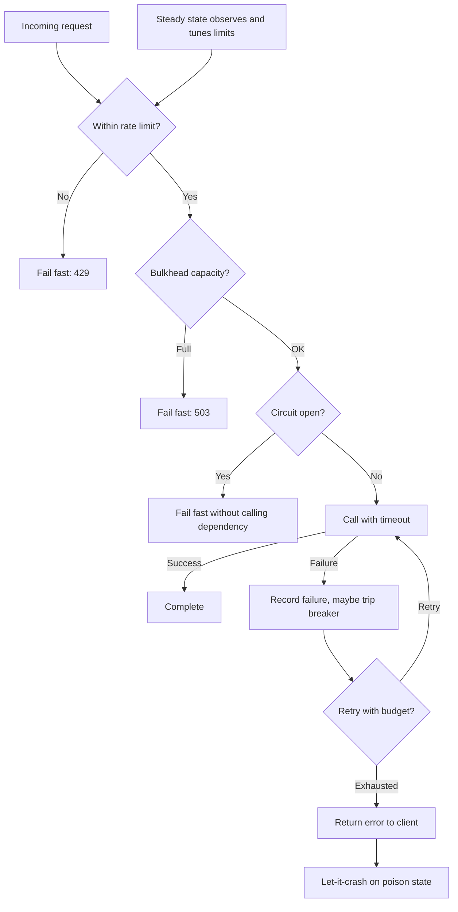
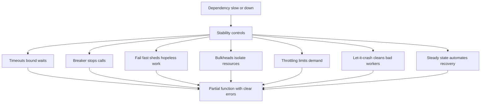

# Stability Patterns 30–45 Minute Study Guide

Goal: understand stability patterns well enough to explain how a system limits blast radius, sheds load, and stays healthy when dependencies slow down or fail in a system design interview. A focused pass on sections 1, 9, and 12–14 takes about 15 minutes; a full read is roughly 40–45 minutes.

<!-- SECTION: table-of-contents - DONE -->

## Table of Contents

1. [Stability Mental Model](#1-stability-mental-model)
2. [Timeouts](#2-timeouts)
3. [Circuit Breaker](#3-circuit-breaker)
4. [Fail Fast](#4-fail-fast)
5. [Bulkheads](#5-bulkheads)
6. [Let-it-crash](#6-let-it-crash)
7. [Steady State](#7-steady-state)
8. [Throttling](#8-throttling)
9. [How Patterns Compose](#9-how-patterns-compose)
10. [System Design Examples](#10-system-design-examples)
11. [Design Warnings](#11-design-warnings)
12. [Interview Language](#12-interview-language)
13. [Final Mental Model](#13-final-mental-model)
14. [30-Minute Review Checklist](#14-30-minute-review-checklist)

<!-- SECTION: mental-model - DONE -->

## 1. Stability Mental Model

Stability patterns answer one question:

> When something breaks or slows down, how do we stop the whole system from breaking with it?

Use a food delivery app as the running example:



If Payment becomes slow, Order threads can block waiting. More users arrive. Order runs out of threads. Restaurant and Dispatch calls also stall. The outage spreads even though only Payment is unhealthy.

That is a **cascade failure**: one weak dependency consumes shared resources and drags down unrelated work.

Stability design is about:

| Problem | Pattern family | Interview phrase |
|---|---|---|
| Waiting forever | Timeouts | Bound every wait |
| Hammering a sick dependency | Circuit breaker | Stop calling while it recovers |
| Wasting work on doomed requests | Fail fast | Reject early |
| One failure sinks everything | Bulkheads | Isolate resources |
| Corrupted in-memory recovery | Let-it-crash | Restart clean units |
| Manual firefighting forever | Steady state | Automate health and recovery |
| Too much demand at once | Throttling | Limit rate and concurrency |



Stability is different from **availability** (failover, replication, regional DR). Availability answers "who takes over when a node dies?" Stability answers "how do we behave while something is slow or failing right now?"

Mental shortcut: **stability is blast-radius control under stress.**

<!-- SECTION: timeouts - DONE -->

## 2. Timeouts

A timeout is a maximum time budget for an operation. If the work does not finish in time, stop waiting and treat it as failure.

The practical timeout question is:

> How long are we willing to block this thread, connection, or user request waiting on someone else?



### Why Timeouts Matter

Without timeouts:

- Worker threads stay blocked on slow I/O.
- Connection pools fill up.
- Queues grow.
- Retries multiply load on the already sick dependency.
- Users see long hangs instead of a clear error.

### Common Timeout Types

| Type | What it limits | Example |
|---|---|---|
| Connection timeout | Time to establish TCP/TLS | 500 ms to open socket |
| Request / read timeout | Time waiting for response bytes | 2 s for HTTP response body |
| Idle timeout | Time with no activity on open connection | 60 s on keep-alive |
| Client deadline | End-to-end budget for caller | Mobile app gives up at 5 s total |
| Lock / queue wait timeout | Time waiting for a resource | 200 ms to acquire DB connection |

### Timeout Hierarchy

Each layer’s timeout must fit the work it still owns: budget for all downstream calls on that path, and pass **remaining deadline** to children (gRPC deadline / `context` propagation).

```text
Client deadline:     5 s
API gateway:         4 s
Order service:       3 s
Payment call:        2 s
```

If Payment is allowed 5 s but Order only has 3 s total, Order will always time out first and waste work.

### Food Delivery Example

Order calls Payment with a 2 s timeout. Payment is degraded and responds in 8 s. Order fails fast at 2 s, returns "payment temporarily unavailable," and frees the thread. Other orders for restaurant lookup can still proceed on separate bulkheads.

### Observability

Distinguish in metrics and logs:

- **Timeout:** caller gave up waiting.
- **Error:** dependency returned 4xx/5xx quickly.
- **Slow success:** dependency succeeded after high latency.

Mental shortcut: **timeouts turn "hang forever" into a bounded, recoverable failure.**

<!-- SECTION: circuit-breaker - DONE -->

## 3. Circuit Breaker

A circuit breaker stops calls to a dependency that is failing too often. While open, the caller fails immediately instead of waiting on a sick service.

The practical circuit breaker question is:

> When should we stop hammering a dependency and give it time to recover?



### States

| State | Behavior | Purpose |
|---|---|---|
| Closed | Normal calls through | Default healthy path |
| Open | Reject immediately, no call | Protect dependency and caller resources |
| Half-open | Allow a few probe calls | Test whether dependency recovered |

### Typical Configuration Knobs

| Knob | Meaning | Tradeoff |
|---|---|---|
| Failure threshold | How many errors or what error rate trips the breaker | Too low causes flapping; too high allows damage |
| Sliding window | Time span for measuring failures | Short window reacts fast; long window is smoother |
| Open duration | How long to stay open before half-open | Longer gives more recovery time; shorter restores traffic sooner |
| Half-open permits | How many trial calls in probe state | Too many can re-overload a weak dependency |

### Circuit Breaker vs Retries

| Approach | Good for | Risk |
|---|---|---|
| Circuit breaker | Stopping call storms during outages | Users see errors while open |
| Retry with backoff | Transient blips | Retries during outages amplify load |
| Both together | Brief glitches vs sustained failure | Must cap total retry budget and respect open circuit |

When the breaker is **open**, fail fast with a clear response or fallback. Do not retry blindly into an open circuit.

### Graceful Degradation and Fallbacks

When a dependency is down or the circuit is open, **graceful degradation** keeps the product partially useful instead of failing the whole request.

| Strategy | Behavior | Food delivery example |
|---|---|---|
| Cached fallback | Serve last-known good data | Show cached menu if Restaurant API is down |
| Default / stub | Return safe placeholder | Hide recommendations block on home feed |
| Feature toggle | Disable non-critical path | Turn off promo banners during payment outage |
| Async repair | Accept request, fix later | Queue receipt email if notification service is down |

Fallbacks are not free: stale cache needs TTL and invalidation rules; async repair needs idempotency and user-visible status.

Pair with **fail fast** on critical paths (checkout, charge) and **degraded mode** on read-heavy paths (browse, track order).

### Retry Policy (With Breakers and Timeouts)

Retries help only for **transient** failures. During an outage they become a retry storm unless bounded.

| Rule | Why |
|---|---|
| Max attempts | Stops infinite loops (e.g. 3 total tries) |
| Exponential backoff | Spreads load: 100 ms, 200 ms, 400 ms |
| Jitter | Randomizes retry timing so clients do not retry in sync |
| Retry only idempotent ops | Safe on GET, reads, or writes with idempotency key |
| No retry on open circuit | Breaker already decided dependency is unhealthy |
| Shorter timeout per retry | Do not extend total deadline unbounded |

```text
Idempotency key: order-123-charge
First attempt: timeout
Retry 1 (after backoff): same key → Payment returns "already charged"
```

Food delivery: retry Payment once on network blip; do not retry on 402/declined card; never retry without idempotency key on charge.

### Food Delivery Example

Payment error rate exceeds 50% over 30 seconds. Order's payment breaker opens. New checkout requests get "payments unavailable" in 5 ms instead of waiting 2 s per call. After 60 s, half-open sends a few probe charges. Successes close the circuit; failures re-open it.

Common libraries (names only): Resilience4j, Polly, Hystrix (legacy).

Mental shortcut: **a circuit breaker is a traffic light for a sick dependency.**

<!-- SECTION: fail-fast - DONE -->

## 4. Fail Fast

Fail fast means detect a problem early and return an error immediately instead of doing more work, waiting longer, or queueing work that will probably fail.

The practical fail-fast question is:

> Do we know this request cannot succeed before we spend expensive resources?



### Where Fail Fast Appears

| Layer | Fail-fast trigger | User impact |
|---|---|---|
| API gateway | Invalid token, missing header | 401 immediately |
| Service | Schema validation, business rule | 400 immediately |
| Load shedder | Queue depth or CPU too high | 503 immediately |
| Circuit breaker open | Dependency known unhealthy | 503 or degraded response |
| Graceful degradation | Non-critical dependency down | Partial page with cache/default |
| CP workflow | Cannot confirm latest state | Reject write rather than risk wrong data |

See also: fail fast under partition in [`2.cap-theorem-study-guide.md`](2.cap-theorem-study-guide.md) for CP systems.

### Fail Fast vs Fail Slow

| Style | Behavior | Risk |
|---|---|---|
| Fail fast | Reject or error quickly | Higher error rate visible to users |
| Fail slow | Accept work into queues and wait | Queue buildup, memory pressure, multi-hour recovery |

Fail slow feels polite but can turn a small outage into a system-wide backlog that is harder to drain than the original failure.

### Food Delivery Example

- Invalid coupon code: reject at Order API before calling Payment.
- Payment circuit open: return clear error without calling Payment.
- Dispatch overloaded: return "try again" instead of accepting orders that cannot be assigned for an hour.

Mental shortcut: **fail fast preserves resources for work that can still succeed.**

<!-- SECTION: bulkheads - DONE -->

## 5. Bulkheads

A bulkhead isolates resources so failure or slowness in one area does not consume all shared capacity.

The name comes from ship compartments: flooding one section does not sink the whole vessel.

The practical bulkhead question is:

> If this dependency slows down, what else must keep working?



### Common Bulkhead Forms

| Form | Isolation | Best fit | Caution |
|---|---|---|---|
| Thread pool per dependency | Threads | Sync HTTP clients | Wrong pool sizes starve or waste capacity |
| Semaphore / in-flight limit | Concurrent calls per dependency | Async fan-out (12 parallel HTTP calls) | Limits blast radius without blocking a thread per call |
| Connection pool per dependency | DB/HTTP connections | Database-heavy services | Total connections across pools still matter |
| Separate process or container | CPU/memory | Noisy neighbor workloads | More operational overhead |
| Queue per workflow or tenant | Async work | Multi-tenant or priority tiers | Queue depth needs limits and DLQ |
| Separate service instance pool | Deployable units | Critical vs batch traffic | Higher cost |

### Bulkheads and Queues

A queue can act as a bulkhead between producers and consumers. If Payment consumers lag, the payment queue grows, but restaurant menu reads can still use a different queue and worker pool.

See also: backpressure and worker pools in [`6.concurrency-study-guide.md`](6.concurrency-study-guide.md).

### Food Delivery Example

Payment slowness fills only the payment pool. Restaurant menu lookups still use the restaurant pool. Dispatch assignment keeps its own pool. Checkout may degrade, but browsing restaurants and tracking an existing order can continue.

For async home-feed fan-out, a semaphore caps concurrent calls per downstream (e.g. max 3 in-flight to Recommendations) so one slow service does not launch unlimited parallel waits.

### Sizing Guidance

| Mistake | Effect |
|---|---|
| One giant pool for everything | One slow dependency blocks all outbound calls |
| Pool too small | False saturation under normal peak |
| Pool too large | Still overloads downstream when many threads fire at once |

Mental shortcut: **bulkheads separate failure domains for resources.**

<!-- SECTION: let-it-crash - DONE -->

## 6. Let-it-crash

Let-it-crash means when a unit of work hits an unrecoverable error, terminate that unit cleanly and let a supervisor restart it instead of trying to patch corrupted in-memory state.

The philosophy is common in Erlang/OTP, actor systems, and container platforms.

The practical let-it-crash question is:

> Is it safer to restart this process than to continue with unknown internal state?



### Core Ideas

| Idea | Meaning |
|---|---|
| Small isolated units | One request handler, actor, or pod owns little mutable state |
| Externalize state | Durable truth lives in database, cache, or queue |
| Supervision tree | Parent restarts children with a defined strategy |
| Idempotent recovery | Retries after restart do not double-charge or duplicate side effects |

### When Let-it-crash Fits

- Stateless app servers behind a load balancer.
- Kubernetes pods replaced on failure.
- Queue consumers that crash and redeliver messages (with idempotency).
- Actor processes that reload mailbox state from persistence.

### When It Does Not Fit Alone

- Long-lived in-memory sessions without external store.
- Non-idempotent side effects without deduplication keys.
- Shared mutable process state that cannot be rebuilt.

Let-it-crash pairs with **steady state** automation: health checks, restart policies, and alerts when restart loops happen.

### Food Delivery Example

A Dispatch worker corrupts an in-memory routing table after a rare bug. Instead of catch-and-continue with bad routes, the pod crashes. Kubernetes starts a new pod. Dispatch reloads assignments from the database and replays unacked queue messages idempotently.

Mental shortcut: **let-it-crash trades in-place recovery for a clean restart with external truth.**

<!-- SECTION: steady-state - DONE -->

## 7. Steady State

Steady state means the system is designed to run indefinitely without constant manual intervention. Normal operation includes self-checks, automated recovery, and feedback loops.

The practical steady state question is:

> Will this system still be healthy next month without a human rerunning the same fixes?



### Steady State Practices

| Practice | What it prevents | Example |
|---|---|---|
| Health checks | Routing traffic to dead instances | `/health` removes bad pods |
| Autoscaling | Permanent overload or waste | HPA on CPU and queue depth |
| Automated rollbacks | Bad deploys staying live | Canary fails, revert |
| Configuration as code | Snowflake servers | Same image in every region |
| Periodic chaos tests | Unknown brittle dependencies | Kill payment dependency in staging |
| Capacity reviews | Slow drift into overload | Quarterly load test |
| Runbooks only for exceptions | Hero-driven ops | Automate the third repeat incident |

### Feedback Loops

Good steady-state systems measure:

- Error rate and latency per dependency.
- Pool utilization and queue depth.
- Circuit breaker state changes.
- Restart counts and crash loops.
- Saturation of throttles.

An alert that fires every day is not steady state. It is a missing automation or wrong threshold.

### Food Delivery Example

Payment latency SLO breach triggers autoscale on Payment, opens a breaker in Order after sustained errors, pages on-call only if error budget burns for the week, and monthly game day validates that Order degrades checkout without killing menu browse.

Mental shortcut: **steady state means the system maintains itself; humans handle novel failures.**

<!-- SECTION: throttling - DONE -->

## 8. Throttling

Throttling limits how much work enters the system or reaches a dependency over time.

The practical throttling question is:

> How much load are we willing to accept right now?


### Throttling Mechanisms

| Mechanism | Behavior | Typical use |
|---|---|---|
| Fixed window counter | N requests per minute | Simple API quotas |
| Token bucket | Steady rate with bursts allowed | User-facing APIs with burst traffic |
| Leaky bucket | Smooth output rate | Protecting steady downstream |
| Concurrency limit | Cap in-flight requests | Expensive compute or DB |
| Adaptive throttling | Lower limit when errors/latency rise | Protect dependencies under stress |

### Where to Throttle

| Layer | Protects | Example |
|---|---|---|
| CDN / edge | Origin from global traffic | Static asset rate limits |
| API gateway | All backend services | 1000 req/min per API key |
| Service | Its own CPU and pools | Max 50 concurrent checkouts per instance |
| Dependency client | External vendor quotas | Payment provider 100 TPS cap |
| Consumer | Queue processing rate | Dispatch workers max 200 jobs/s |

### Throttling vs Fail Fast

| Response | Meaning | User experience |
|---|---|---|
| 429 Too Many Requests | Rate quota exceeded | Retry after `Retry-After` |
| 503 Service Unavailable | System overloaded or degraded | Retry with backoff |
| Degraded mode | Serve partial functionality | Show cached menu, disable promotions |

Throttling is proactive protection. Fail fast is often the response when a limit or health gate trips.

### Food Delivery Example

- Per-user: 10 order attempts per minute (stops abuse).
- Per-API-key partner: 500 menu sync calls per hour.
- Global: gateway sheds 20% of search traffic during peak before Order exhausts threads.
- Payment: client-side throttle to provider's 100 TPS so the breaker does not trip from self-inflicted overload.

See also: consumer visibility timeout and queue pacing in [`7.event-driven-architecture-study-guide.md`](7.event-driven-architecture-study-guide.md).

Mental shortcut: **throttling controls demand before demand controls you.**

<!-- SECTION: compose - DONE -->

## 9. How Patterns Compose

In production, stability patterns stack. Order matters for clarity in interviews.



### Layered Responsibilities

| Pattern | Primary job in the stack |
|---|---|
| Throttling | Limit how much enters |
| Bulkhead | Limit how much shares each resource |
| Circuit breaker | Stop calling known-bad dependencies |
| Timeout | Bound each wait |
| Fail fast | Exit early when success is unlikely |
| Let-it-crash | Recover corrupted workers cleanly |
| Steady state | Keep the stack tuned and automated |

### Pattern Pairs That Work Well

| Pair | Why |
|---|---|
| Timeout + circuit breaker | Timeouts feed failure signals; open breaker stops timeout pile-up |
| Bulkhead + throttling | Throttle ingress; bulkhead isolates egress |
| Fail fast + throttling | Shed load before queues absorb it |
| Let-it-crash + steady state | Restarts are safe because automation detects crash loops |
| Retry + idempotency | Bounded retries with backoff/jitter after timeout without double side effects |
| Breaker open + fallback | Degrade reads; fail fast on writes that need the dependency |

Mental shortcut: **throttle ingress, isolate resources, bound waits, stop calling the sick, restart clean.**

<!-- SECTION: examples - DONE -->

## 10. System Design Examples

### Example 1: Checkout When Payment Degrades

**Scenario:** Payment latency rises from 200 ms to 10 s.

| Pattern | Application |
|---|---|
| Timeout | Order allows 2 s per payment call |
| Circuit breaker | Open after sustained payment failures |
| Fail fast | Return clear checkout error while open |
| Bulkhead | Payment pool does not block restaurant reads |
| Throttling | Cap checkout attempts per user |
| Steady state | Alert on payment SLO; autoscale payment workers |
| Let-it-crash | Restart poisoned payment adapter pods |

**Interview line:** "Checkout may fail, but browsing and order tracking stay up because pools and breakers isolate payment from the rest."

### Example 2: Search Fan-out

**Scenario:** Home feed calls 12 downstream services.

| Pattern | Application |
|---|---|
| Bulkhead | Separate small pool per downstream |
| Timeout | Aggressive per-call budget; partial results OK |
| Fail fast / degrade | Omit failed section; serve cached or default blocks |
| Circuit breaker | Disable recommendations if service is down |
| Bulkhead | Semaphore per downstream on async fan-out |
| Throttling | Limit expensive search per IP |

**Interview line:** "I'd return a degraded feed with defaults rather than block the entire response on one slow dependency."

### Example 3: Regional Payment Outage

**Scenario:** Payment provider fails in one region.

| Pattern | Application |
|---|---|
| Circuit breaker | Region-specific breaker instance |
| Fail fast | Stop charging attempts in that region |
| Throttling | Shift only allowed traffic to backup provider within quota |
| Steady state | Runbook-free failover only if rehearsed; otherwise manual regional flag |
| Availability cross-link | Multi-region app stack from [`3.Availability-study-guide.md`](3.Availability-study-guide.md) for DR; stability for runtime behavior |

Mental shortcut: **name the failing dependency, then show how other paths stay alive.**

<!-- SECTION: warnings - DONE -->

## 11. Design Warnings

Common interview mistakes:

| Mistake | Why it hurts | Better answer |
|---|---|---|
| "Add retries" with no cap | Retry storm on failing dependency | Exponential backoff, jitter, max attempts, respect open circuit |
| "Infinite timeout" | Thread and connection exhaustion | End-to-end deadline with nested budgets |
| "One thread pool" | Any slow call blocks everything | Bulkhead per dependency or workflow |
| "Breaker without metrics" | Flapping or never opens | Use error rate, latency, and half-open probes |
| "Throttle only at the edge" | Internal fan-out still overloads DB | Throttle at gateway and critical inner bottlenecks |
| "Catch all exceptions and continue" | Corrupted state spreads | Let-it-crash for unknown faults; handle only expected cases |
| "Queue everything" under overload | Fail slow; hours to drain | Fail fast and throttle at the door |
| "Exactly-once" without idempotency | Restarts and retries double-charge | Idempotency keys and deduplication store |

### Useful Invariants Under Stress

| Workflow | Invariant under failure |
|---|---|
| Payments | Never double-charge for one order |
| Orders | Do not accept unbounded backlog without SLA |
| Inventory | Do not oversell because retries duplicated reservations |
| Notifications | At-least-once delivery is OK if deduplicated |

Mental shortcut: **stability patterns protect invariants when the happy path breaks.**

<!-- SECTION: interview-language - DONE -->

## 12. Interview Language

### Phrases That Sound Strong

```text
I'd bound every outbound call with a timeout shorter than the client deadline.
I'd use a bulkhead so payment slowness cannot exhaust threads for menu reads.
If payment error rate stays high, I'd open a circuit breaker and fail fast on checkout, but serve cached menu data on browse paths.
I'd cap retries with backoff, jitter, and idempotency keys—never retry into an open circuit.
I'd throttle checkout attempts per user so abuse does not amplify an outage.
Workers would be stateless; on unexpected failure, let the platform restart them.
For steady state, I'd automate health checks, scaling, and periodic failure drills.
```

### Sample 60-Second Answer

> For checkout, I'd set a 2 second timeout on the payment client inside a 3 second order budget. Payment calls use their own thread pool so restaurant and tracking paths stay isolated. If payment errors exceed our threshold, a circuit breaker opens and we fail fast with a clear message instead of blocking threads. I'd add per-user throttling on checkout to limit retry storms. Services stay stateless so bad workers restart cleanly, and we'd alert on payment SLO burn and run game days to verify the breaker and bulkheads actually limit blast radius.

### How This Differs From Availability

| Topic | Question | Patterns |
|---|---|---|
| Availability | What takes over after failure? | Failover, replication, Multi-AZ, DR |
| Stability | How do we behave during failure? | Timeout, breaker, bulkhead, throttle, fail fast |

Mental shortcut: **availability is redundancy; stability is controlled degradation.**

<!-- SECTION: final-model - DONE -->

## 13. Final Mental Model



Use this map:

```text
Timeouts:
No unbounded waits.

Circuit breaker:
Do not keep calling what is already failing.

Fail fast:
Reject early when success is unlikely.

Bulkheads:
Do not let one dependency consume all resources.

Let-it-crash:
Restart dirty workers; keep truth external.

Steady state:
Automate health, scaling, and learning.

Throttling:
Limit how much work enters under stress.
```

For system design interviews, the strongest answer usually sounds like:

```text
The weak dependency is X.
We bound waits with Y.
We isolate it with Z.
If it stays unhealthy, we stop calling and fail fast.
We limit ingress with throttling.
We automate detection and recovery for steady state.
The invariant we protect is W.
```

Final shortcut: **stability is not zero errors; it is preventing one error from becoming a system-wide outage.**

<!-- SECTION: checklist - DONE -->

## 14. 30–45 Minute Review Checklist

Use this checklist to test whether you can explain the topic:

- Can you explain cascade failure with a slow payment dependency example?
- Can you name timeout types and why outer deadlines must be tighter than inner sums?
- Can you draw or describe circuit breaker states: closed, open, half-open?
- Can you explain when a circuit breaker should open vs when retries are appropriate?
- Can you describe retry backoff, jitter, max attempts, and idempotency keys?
- Can you explain graceful degradation vs fail fast on critical vs read paths?
- Can you name a bulkhead for async fan-out (semaphore / in-flight limit)?
- Can you define fail fast and contrast it with fail slow queue buildup?
- Can you explain bulkheads with thread pools, queues, or separate instances?
- Can you describe let-it-crash and why state must live outside the process?
- Can you list steady state practices: health checks, autoscaling, chaos drills?
- Can you compare token bucket, fixed window, and concurrency limits?
- Can you explain where to throttle: edge, service, and downstream?
- Can you stack patterns in order: throttle, bulkhead, breaker, timeout, fail fast?
- Can you give a degraded-mode answer for search fan-out without total failure?
- Can you distinguish stability patterns from availability failover patterns?
- Can you state an invariant payments or inventory must keep under retries and restarts?

If you remember only one thing:

```text
Stability design is not "hope dependencies stay healthy."
It is bounding waits, isolating resources, stopping call storms,
shedding load, and restarting clean so one slow service
does not drown the entire system.
```
