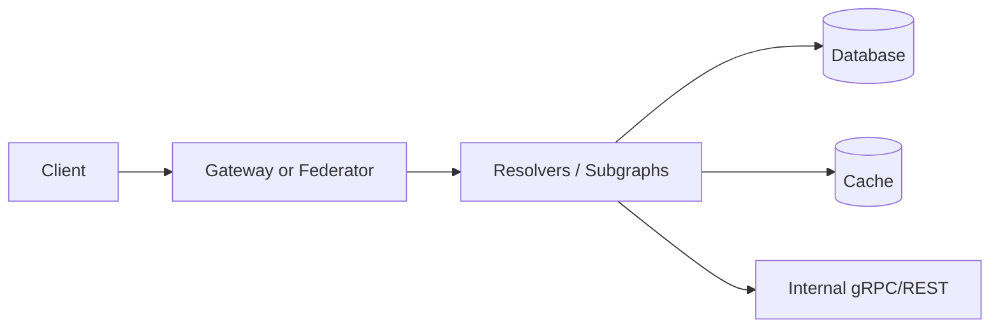
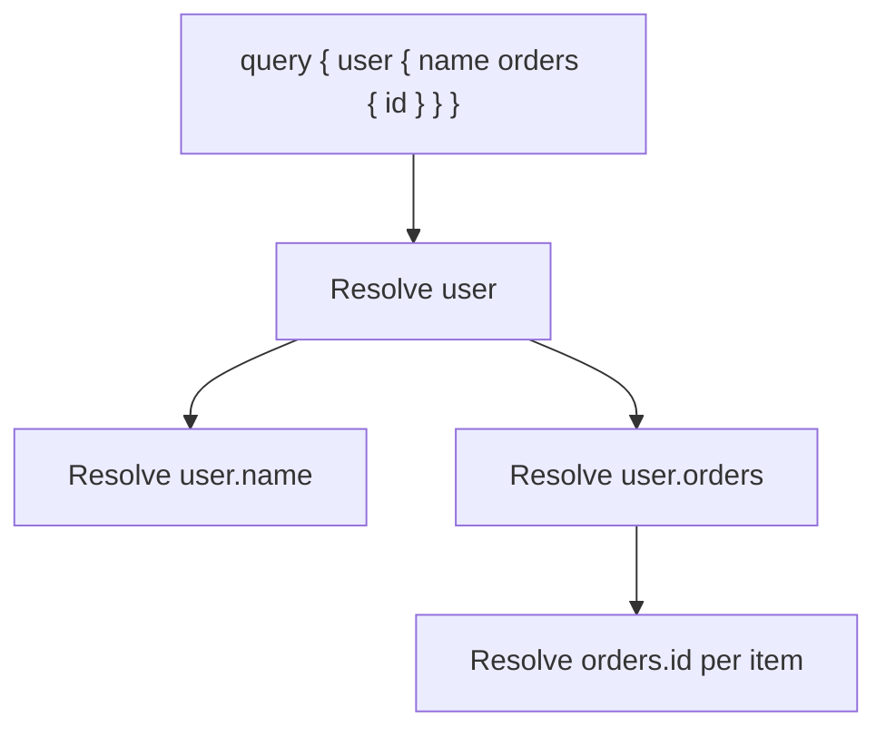
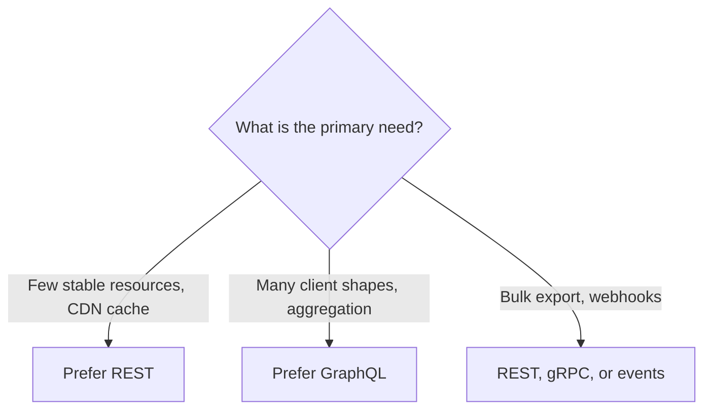
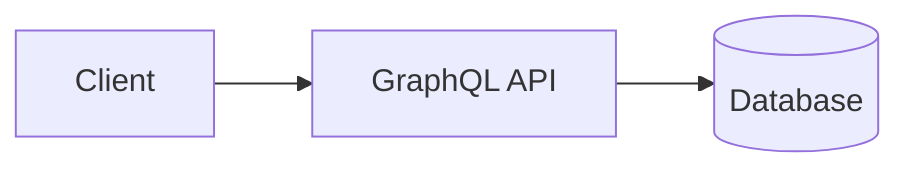
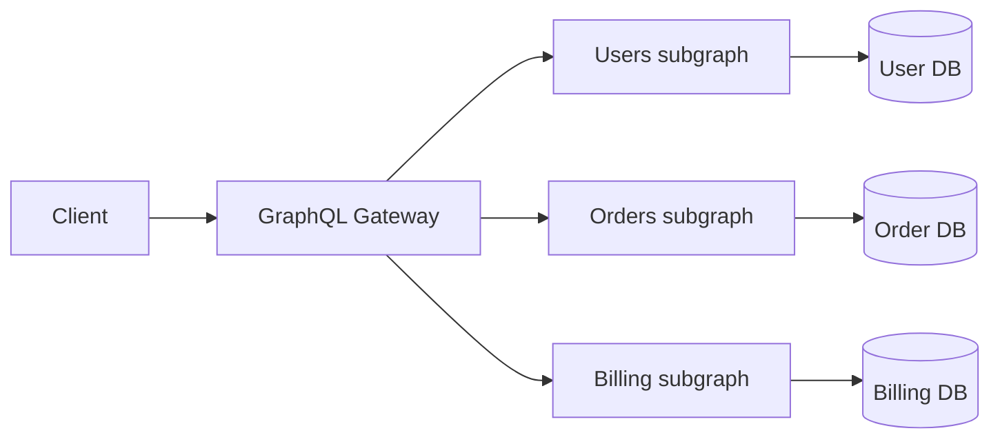
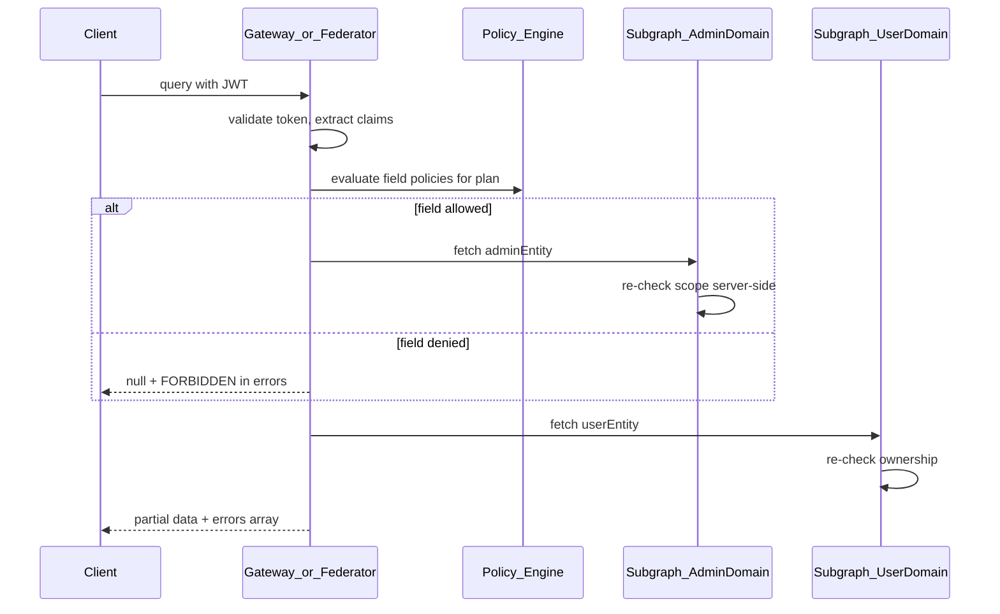
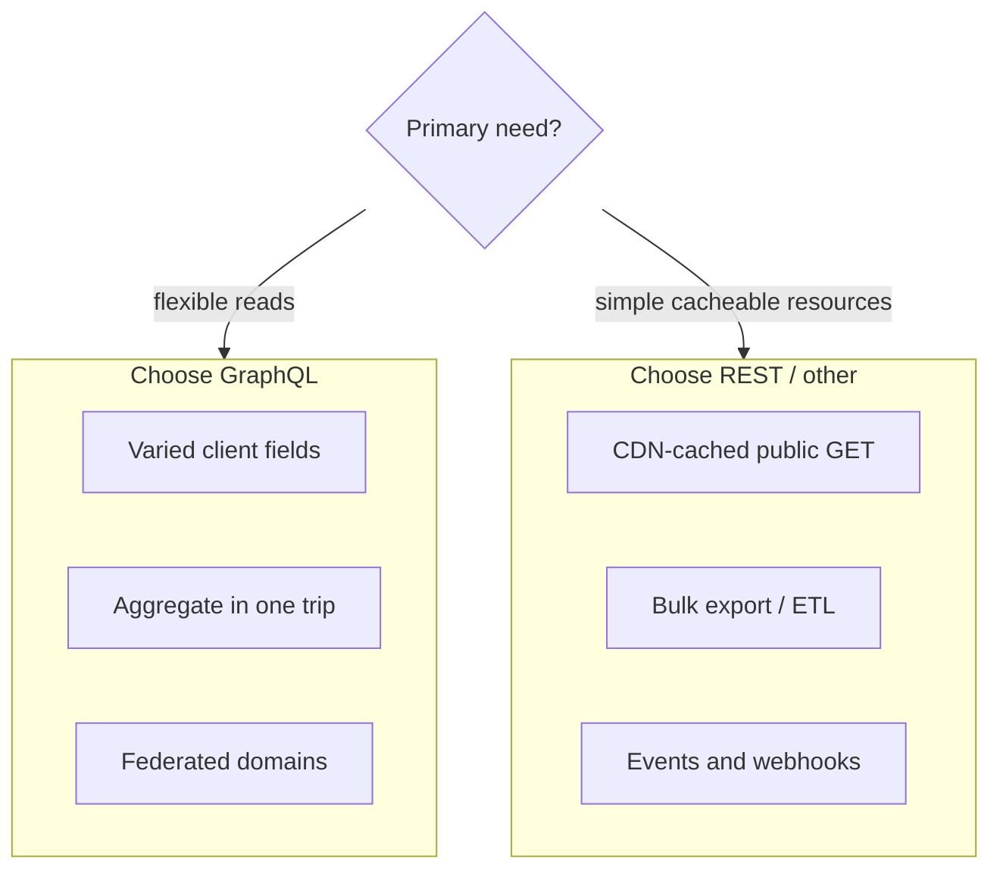

# GraphQL 30-Minute Study Guide

Goal: understand GraphQL well enough to choose it over REST (or not), explain common production problems and fixes, and answer authorization questions—including mixed admin and user permissions in one query—in a system design interview.

Related:
- [System Design guide §2](1.system-design-study-guide.md#2-internet-request-flow) — L7 gateway vs GraphQL federator, query-abuse controls
- [Caching Patterns guide](4.caching-patterns-study-guide.md) — why HTTP/CDN caching is harder with GraphQL
- [Concurrency guide](6.concurrency-study-guide.md) — resolver parallelism, timeouts, bulkheads

<!-- SECTION: table-of-contents - DONE -->

## Table of Contents

1. [GraphQL Mental Model](#1-graphql-mental-model)
2. [Core Concepts](#2-core-concepts)
3. [GraphQL vs REST](#3-graphql-vs-rest)
4. [Architecture Patterns](#4-architecture-patterns)
5. [When to Use GraphQL](#5-when-to-use-graphql)
6. [When Not to Use GraphQL](#6-when-not-to-use-graphql)
7. [Common Problems and How to Solve Them](#7-common-problems-and-how-to-solve-them)
8. [Authorization](#8-authorization)
9. [Performance, Security, and Operations](#9-performance-security-and-operations)
10. [Design Warnings and Red Flags](#10-design-warnings-and-red-flags)
11. [Interview Language](#11-interview-language)
12. [Practical Interview Scenarios](#12-practical-interview-scenarios)
13. [Final Mental Model](#13-final-mental-model)
14. [30-Minute Review Checklist](#14-30-minute-review-checklist)

<!-- SECTION: mental-model - DONE -->

## 1. GraphQL Mental Model

In interviews, GraphQL usually means:

> **A schema is the contract; the client picks the shape; the server resolves each field.**

The practical GraphQL question is:

> Which fields does this client need, and how do we resolve them safely without melting the database?



| Operation | Purpose | Interview note |
|---|---|---|
| Query | Read data | Idempotent; safe to retry on network failure |
| Mutation | Change data | Side effects; design idempotency keys for payments |
| Subscription | Push updates | Long-lived connections; scale separately |

GraphQL usually optimizes:

| Goal | Meaning | Example |
|---|---|---|
| Flexible reads | One request, many related objects | Mobile home screen: user + orders + alerts |
| Typed contract | Schema is the API spec | Codegen for web, iOS, Android |
| Fewer round trips | Client orchestration moves server-side | Dashboard without 6 REST calls |
| Team ownership | Each domain owns its subgraph | Orders team owns `Order` type |

The tradeoff is operational and security complexity. You gain client flexibility but must manage resolver cost, authz per field, caching, and abuse (deep or expensive queries).

Mental shortcut: **GraphQL optimizes flexible reads; it does not remove backend complexity.**

<!-- SECTION: core-concepts - DONE -->

## 2. Core Concepts

### Schema Building Blocks

| Concept | Meaning | Interview note |
|---|---|---|
| Schema | All types, fields, and operations | Single source of truth for clients |
| Object type | Entity with fields | `User`, `Order`, `Product` |
| Field | Property on a type | Each field can have a resolver |
| Argument | Input to a field or operation | `user(id: "123")` |
| Interface / Union | Polymorphic types | `SearchResult = User \| Product` |
| Enum | Fixed set of values | `OrderStatus` |
| Non-null (`!`) | Required in response or input | `ID!` cannot be null |

### Resolvers and Execution

A **resolver** is a function that returns the value for one field. Execution collects all requested fields, runs resolvers (often in parallel per level), and assembles the JSON response.



- Execution is typically **breadth-first by level**: parent fields before children.
- **N+1 risk** appears when a list field triggers one DB call per item (see §7).
- **Context** carries request-scoped data: auth principal, DataLoaders, trace IDs.

### Introspection

Introspection lets tools read the schema (`__schema`, `__type`). Useful in dev; often **disabled in production** to reduce attack surface.

### Pagination

| Style | Behavior | When to mention |
|---|---|---|
| Offset (`limit`/`offset`) | Simple; skips rows | Poor at large offsets; unstable if data shifts |
| Cursor (Relay-style) | Opaque cursor + `first`/`after` | Stable feeds; index-friendly |

Interview line: *"I default to cursor pagination for user-facing lists; offset only for small admin tables."*

### Federation Vocabulary

| Term | Meaning |
|---|---|
| Subgraph | One service's slice of the graph |
| Supergraph | Composed API the gateway exposes |
| Entity | Type owned by a subgraph, referenced elsewhere (`@key`) |
| Query plan | Gateway decides which subgraph resolves each field |
| `_entities` | Federation batch lookup for references |

Aligns with the federator role in [guide 1](1.system-design-study-guide.md#gateway-vs-federator): the gateway understands GraphQL fields; subgraphs own domains.

Mental shortcut: **schema defines what is possible; resolvers define what it costs.**

<!-- SECTION: graphql-vs-rest - DONE -->

## 3. GraphQL vs REST

| Dimension | REST | GraphQL |
|---|---|---|
| Data shape | Fixed per endpoint | Client-selected per request |
| Round trips | Often many for screens | Usually one (if designed well) |
| Over-fetching (client) | Common | Reduced |
| Over-fetching (server) | Endpoint loads fixed payload | Resolver may still load full row |
| Caching | HTTP cache keys (URL) | Harder at CDN; entity/cache layer |
| Versioning | `/v1`, `/v2` paths | Schema evolution + deprecation |
| Abuse surface | Per-endpoint limits | Query depth/complexity |
| Tooling | Universal | Strong with codegen + schema registry |
| Errors | HTTP status per request | Often HTTP 200 + `errors[]` partial data |



Mental shortcut: **REST wins on simple resources and edge caching; GraphQL wins on varied clients and aggregation.**

<!-- SECTION: architecture - DONE -->

## 4. Architecture Patterns

### Monolith Schema

One service exposes the entire graph. Simplest ops; schema becomes a bottleneck as teams grow.



Good for: early-stage products, small teams, single domain.

### BFF GraphQL

A **Backend-for-Frontend** layer exposes one schema per channel (web BFF, mobile BFF). BFF aggregates internal REST/gRPC services.

| Pros | Cons |
|---|---|
| Tailored shapes per client | Multiple schemas to maintain |
| Hides internal microservice churn | BFF can become thick orchestration layer |

Good for: different UX needs on web vs mobile without polluting a public API.

### Federated Supergraph

A **gateway/federator** composes subgraphs. Each team owns types in its service; entities link via `@key`.



Good for: large orgs, domain ownership, independent deploys.

### When to Mention gRPC / REST Internally

| Layer | Typical choice |
|---|---|
| Public / partner edge | GraphQL or REST (product decision) |
| Service-to-service sync | gRPC or REST (strong contracts, binary efficiency) |
| Async facts | Kafka / queues (not GraphQL) |

Interview line: *"GraphQL is often the edge contract; inside the mesh I still use gRPC between services and events for facts."*

Mental shortcut: **GraphQL at the edge composes; gRPC and events connect domains behind it.**

<!-- SECTION: when-to-use - DONE -->

## 5. When to Use GraphQL

### Decision Table

| Requirement | GraphQL fit |
|---|---|
| Multiple clients need different field sets | Strong |
| Aggregate many resources in one round trip | Strong |
| Strong typed contract + codegen | Strong |
| Microservices with domain-owned schemas | Strong (federation) |
| Reduce chatty client orchestration | Strong |
| Simple CRUD, few endpoints | Weak |
| Anonymous CDN-cached GET pages | Weak |
| Bulk export / reporting | Weak |
| Event delivery | Wrong tool |

### Example Scenarios

| Scenario | Recommendation | One-line reason |
|---|---|---|
| Mobile home screen (user, orders, promos) | GraphQL | One query, variable fields per screen |
| Partner API with evolving fields | GraphQL + schema registry | Deprecate fields without `/v2` explosion |
| E-commerce product page (public, cacheable) | REST + CDN | URL-level cache is trivial |
| Admin + user widgets on same SPA | GraphQL + field auth | Partial success; see §8 |
| Microservices migration | Federation | Teams ship subgraphs independently |
| Payment capture | Mutation + idempotency key | Not a query problem; design writes carefully |

Mental shortcut: **use GraphQL when client shape variability and aggregation matter more than URL-level caching simplicity.**

<!-- SECTION: when-not - DONE -->

## 6. When Not to Use GraphQL

| Avoid GraphQL when… | Prefer instead | Example |
|---|---|---|
| Simple CRUD, few stable resources | REST | Health check, feature flags GET |
| Heavy CDN edge caching of anonymous GET | REST | Public product catalog HTML/JSON |
| Bulk export / ETL / reporting | REST batch, SQL, object store | Million-row CSV export |
| File/binary-first workflows | REST + presigned URL | Large uploads to S3 |
| Team lacks GraphQL maturity | REST until controls exist | No depth limits, no tracing |
| Strict security isolation between domains | Separate APIs or hard scopes | PCI domain isolated from general graph |
| Async notifications / domain facts | Webhooks, Kafka | `OrderShipped` event, not a subscription for everything |
| High cache hit ratio at edge required | REST + CDN | Same JSON for all anonymous users |

### Red Flags in Interviews

Be careful when you hear (or say):

- "GraphQL fixes over-fetching" without mentioning **server-side** resolver cost.
- "One graph for the entire company" without federation ownership rules.
- "We'll add auth later" on a public schema.
- "Subscriptions replace Kafka" for domain events.

Mental shortcut: **GraphQL is a read/compose layer—not a cache, queue, or file system.**

<!-- SECTION: common-problems - DONE -->

## 7. Common Problems and How to Solve Them

| Problem | Symptom | Fixes | Interview sound bite |
|---|---|---|---|
| N+1 queries | DB QPS spikes with list size | DataLoader per request; SQL `IN` batch; join in repository | "I batch per request with DataLoader so 100 orders don't mean 100 round trips." |
| Depth / complexity abuse | CPU/DB meltdown on crafted query | `maxDepth`, cost analysis, persisted query allowlist, rate limits | "I reject expensive queries at the gateway before resolvers run." |
| Resolver fan-out / timeouts | Tail latency, cascading failure | Per-field timeouts, bulkheads, circuit breakers on subgraph calls | "Each subgraph call has a budget; slow billing doesn't hang the whole graph." |
| Server-side over-fetching | Resolver loads full row for one field | Projections in DAO; field-aware repositories | "GraphQL fixes client over-fetch; resolvers still need lean data access." |
| Caching | No simple URL cache key | Entity cache (Redis), `@cacheControl`, APQ, CQRS read models | "I cache by entity ID and type, not by raw query string, unless using persisted queries." |
| Partial failures | Some fields null, errors present | Spec: `data` + `errors[]`; consistent `extensions.code` | "Partial success is a feature—I return allowed fields and FORBIDDEN on the rest." |
| Schema breaking changes | Clients break silently | `@deprecated`, schema checks in CI, registry | "Breaking changes are caught in composition checks before deploy." |
| Federation entity gaps | `_entities` returns null | `@key` design, reference resolvers, clear ownership | "Every entity has one owning subgraph and a stable `@key`." |
| Subscription scale | Memory and connection pressure | Dedicated sub service; pub/sub backbone | "Subscriptions are for live UX, not my primary event bus." |
| Authz leakage in lists | User A sees User B rows | Filter in DB with principal scope | "I never rely on the client `userId` argument without matching the token subject." |

### N+1 — Slightly Deeper

```graphql
query {
  users { id orders { id total } }
}
```

Naive resolvers: 1 query for users + N queries for orders. **DataLoader** collects `userId`s for the level and issues one `WHERE user_id IN (...)`.

Rules:
- Create DataLoaders **per request**, not global singletons.
- Batch and cache within the request lifecycle only.

### Query Cost Controls

| Control | What it limits |
|---|---|
| `maxDepth` | Nested selection depth |
| `maxAliases` | Alias explosion |
| Complexity/cost score | Weighted field costs |
| Persisted queries / APQ | Only known operation hashes in prod |
| Rate limit | Per token, per operation name |

See [guide 1 §4](1.system-design-study-guide.md#4-ddos-protection-by-layer): expensive GraphQL abuse is handled at federator/app layer.

Mental shortcut: **every flexible query needs a cost model—flexibility without limits is an outage.**

<!-- SECTION: authorization - DONE -->

## 8. Authorization

Authorization in GraphQL is **per principal, per field (or per object)**, often across multiple domains in one operation.

### AuthN vs AuthZ Layers

| Layer | Responsibility |
|---|---|
| Edge / gateway | Validate JWT/API key, extract claims, rate limit, query cost |
| Policy engine (optional) | Evaluate field rules against query plan |
| Resolver / subgraph | **Authoritative** check: can this principal read/write this object? |
| Data store | Row-level filters (`WHERE tenant_id = ?`) |



**Authenticate once at the edge; authorize again in every resolver/subgraph.** Gateway claims are hints, not proof—especially in federation where subgraphs are trust boundaries.

### Multi-Entity / Mixed-Permission Queries

Typical interview case: one query asks for **user-scoped** data and **admin-scoped** data together.

```graphql
query Dashboard($accountId: ID!) {
  account(id: $accountId) {
    name
    plan
  }
  billingAdminView(accountId: $accountId) {
    internalCost
    marginNotes
  }
}
```

Token: `role=user`, subject owns `accountId`. Expected: `account` resolves; `billingAdminView` is `null` with error path `/billingAdminView` and `extensions.code = FORBIDDEN`. Audit log records denied admin field access.

#### Four Strategies

| # | Strategy | Behavior | Best when |
|---|---|---|---|
| 1 | Field-level auth, partial response | Allowed fields in `data`; denied fields `null` + `errors` | Dashboards where most UI is user-safe |
| 2 | Policy at query-plan time | Gateway strips or rejects forbidden fields before subgraph calls | Reduce wasted work; central policy |
| 3 | Fail-fast entire operation | 403, no `data` | Strict compliance, no leakage of resource existence |
| 4 | Split by trust boundary | `userDashboard` vs `adminPanel` operations or tokens | Radically different roles or audit regimes |

**Interview line for strategy 1:**

> GraphQL supports partial success. I don't fail the whole dashboard because one admin widget is forbidden—I return user data and a field-level FORBIDDEN on the admin selection set.

**Interview line for strategy 2:**

> I evaluate policy against the query plan so we don't call the billing subgraph at all when the principal lacks `billing:read`.

**Interview line for strategy 3:**

> For HIPAA-style boundaries I'd fail the operation if any selection set is unauthorized, so clients can't probe for hidden fields.

**Interview line for strategy 4:**

> If admin and user modes never share a session, I split operations and scopes rather than mixing trust levels in one query.

### Implementation Patterns

| Pattern | How it works |
|---|---|
| Directive (`@auth(requires: ADMIN)`) | Schema marks sensitive fields; framework enforces |
| Policy engine (OPA, custom) | Rules on `principal`, `action`, `resource` |
| Resolver guard | First line of resolver checks scope |
| Field middleware | Wrap resolvers with auth decorator |
| Federation | Each subgraph enforces its own rules; gateway passes signed internal context |

### Rules You Should State in Interviews

- **Never trust client arguments alone for authz.** `account(id: $accountId)` must match token subject or provable delegation.
- **List fields:** filter in SQL/DB with principal scope, not only filter in memory after over-fetching.
- **Decide "hidden" vs "denied":** null without error (existence hidden) vs explicit FORBIDDEN—be consistent.
- **Mutations:** check authz before side effects; use idempotency keys for retries.
- **Introspection off in prod** so attackers can't map admin fields easily.
- **Metrics:** count denials by field path to detect probing.

### Federation Authorization Note

When `User` is in subgraph A and `billingAdminView` in subgraph B:

1. Gateway validates JWT and builds query plan.
2. Subgraph B receives internal auth context (mTLS + signed headers, not raw client spoofing).
3. Subgraph B resolver checks `billing:read` on `accountId`.
4. Denied field returns null + error; other subgraph results still return if strategy 1 applies.

Mental shortcut: **GraphQL authz is field-scoped; mixed permissions mean partial data or split operations—not skipping server checks.**

<!-- SECTION: perf-security-ops - DONE -->

## 9. Performance, Security, and Operations

### Performance

| Technique | Purpose |
|---|---|
| DataLoader | Batch loads within a request |
| Persisted queries / APQ | Known operations only in production |
| Query complexity limits | Block abusive selections |
| `@defer` / `@stream` (where supported) | Progressive responses for large payloads |
| CDN for static, not arbitrary GraphQL | Edge cache rarely fits ad-hoc queries |
| Read replicas / CQRS | Heavy read fields served from read models |

### Security (with [guide 1](1.system-design-study-guide.md#4-ddos-protection-by-layer))

| Threat | Defense |
|---|---|
| Deep nested query | `maxDepth`, cost limits |
| Alias explosion | `maxAliases`, cost limits |
| Batch attack (many operations) | Rate limit per IP/token |
| Introspection mapping | Disable in production |
| BOLA / IDOR | Resolver checks principal vs resource ID |

### Observability

| Signal | Why |
|---|---|
| Operation name | Group latency and errors (`Dashboard`) |
| Field resolver spans | Find slow subgraph or N+1 |
| Error rate by `path` | Detect auth probing or broken resolvers |
| Complexity score rejected | Tune limits |

### Operations Checklist

- Schema registry + composition checks in CI
- Breaking change policy (`@deprecated` with sunset date)
- Load test representative **operations**, not random queries
- Runbooks for gateway and subgraph failures (degrade non-critical fields)

Mental shortcut: **operate GraphQL like a product API: named operations, limits, traces, and schema governance.**

<!-- SECTION: warnings - DONE -->

## 10. Design Warnings and Red Flags

| Warning | What can go wrong | Safer habit |
|---|---|---|
| GraphQL "fixes" over-fetching | Resolvers still load wide rows | Project fields in data layer |
| One graph for everything | Ownership fights, slow schema reviews | Federation or BFF per boundary |
| Auth only at gateway | Subgraph bypass, IDOR | Re-check in every resolver |
| Global DataLoader across requests | Cross-user data leaks | Per-request loader instances |
| No complexity limits | One query takes down DB | Gateway cost analysis + persisted queries |
| HTTP 200 with errors ignored | Clients miss partial failures | Teach client to read `errors[]` |
| Subscriptions for all async work | Connection storms | Kafka for facts; subs for live UI |
| Caching full query responses by URL | Cache poisoning, auth leaks | Entity-level cache with principal in key |
| Breaking schema without CI checks | Silent client breakage | Registry composition checks |

### Red Flags in Interviews

- "We'll use GraphQL so we don't need versioning."
- "The gateway validated the token, so subgraphs are fine."
- "We'll expose the whole database as types."
- "Subscriptions replace our event bus."

Mental shortcut: **flexibility without governance becomes an outage or a data leak.**

<!-- SECTION: interview-language - DONE -->

## 11. Interview Language

Use terms like:

```text
schema
resolver
query / mutation / subscription
DataLoader
N+1
query plan
subgraph
supergraph
federation
@key
entity resolver
BFF
introspection
cursor pagination
complexity cost
persisted query
APQ
field-level authorization
partial null
extensions.code
schema registry
composition check
@deprecated
IDOR / BOLA
```

### Strong Opening Moves

**When to choose GraphQL over REST:**

> I'd use GraphQL when multiple clients need different shapes and we want to aggregate related objects in one round trip. I'd stay on REST when resources are stable, anonymously cacheable at the CDN, or when the workload is bulk export or simple CRUD.

**Federated architecture:**

> Each domain team owns a subgraph with clear entity keys. The gateway builds a query plan, calls subgraphs in parallel where possible, and composes one response. Internal traffic stays gRPC; GraphQL is the edge contract.

**Mixed admin + user permissions:**

> For a dashboard query mixing user and admin fields, I'd return partial data: user fields resolve under the user scope, admin fields null with FORBIDDEN in errors, and I'd still re-authorize in the billing subgraph. If compliance requires no partial leakage, I'd fail the whole operation or split admin into a separate operation with an admin token.

**N+1 fix:**

> List fields use DataLoader scoped to the request to batch IDs into one database query. I also ensure repository methods fetch only the columns needed for the selected fields.

**Abuse prevention:**

> Production allows persisted queries or APQ, enforces depth and complexity budgets at the gateway, and rate-limits by operation name so crafted queries never reach resolvers.

**Caching:**

> I don't rely on CDN URL caching for ad-hoc GraphQL. I cache entities in Redis keyed by type and ID with TTL and explicit invalidation on mutation, or use read models for hot fields.

**Why not GraphQL for export:**

> Million-row exports need streaming REST or batch jobs, not a GraphQL selection set that risks timeouts and memory pressure.

<!-- SECTION: scenarios - DONE -->

## 12. Practical Interview Scenarios

### Mobile app with variable screens

**Question:** How would you API a mobile app where each screen needs different data?

**Answer skeleton:**

> A BFF or mobile-tuned GraphQL schema lets each screen request only its fields. We codegen against the schema, version with `@deprecated`, and enforce complexity limits. Heavy static content still comes from CDN REST, not the graph.

### Admin + user data on the same page

**Question:** One query loads account info and internal billing metrics. User token only.

**Answer skeleton:**

> Field-level auth: `account` resolves after verifying `accountId` matches the subject; `billingAdminView` returns null with FORBIDDEN. We log denials, metric by path, and enforce the same rule in the billing subgraph. Alternative: separate admin operation if compliance forbids mixed queries.

### Migrating microservices to federation

**Question:** Teams own services; clients want one API.

**Answer skeleton:**

> Introduce subgraphs per domain with `@key` on shared entities. Gateway composes the supergraph. CI runs composition checks. Teams deploy subgraphs independently; breaking changes are caught against the registry.

### Why not GraphQL for file export?

**Answer skeleton:**

> Exports are large, long-running, and not field-selection problems. REST download, async job + polling, or S3 presigned URLs fit better. GraphQL mutations can *trigger* an export job, but the bytes don't flow through the graph.

### How do you cache GraphQL?

**Answer skeleton:**

> Per-entity cache with principal/tenant in the cache key where needed; invalidate on mutation. For public identical responses, persisted queries enable limited CDN caching. See [caching guide](4.caching-patterns-study-guide.md) for cache-aside and TTL tradeoffs.

### GraphQL gateway is down; subgraphs are healthy

**Answer skeleton:**

> Clients lose the composed API. Mitigations: gateway HA, health checks, circuit breakers to subgraphs, and critical paths kept on REST or gRPC as fallback for payments—not everything behind a single graph.

<!-- SECTION: final-model - DONE -->

## 13. Final Mental Model

```text
GraphQL:
  Schema = contract.
  Client = picks fields.
  Server = resolves per field (cost + authz each).

Use when:
  Many client shapes, aggregation, typed evolution, federation.

Avoid when:
  Simple CRUD, CDN-cached public GET, bulk export, events, immature ops.

Always:
  Depth/cost limits, per-request DataLoaders, resolver-level authz,
  partial errors understood, schema governance in CI.
```



For system design interviews, the strongest answer usually sounds like:

```text
The clients need [one shape | many shapes].
Reads are [aggregated | simple resources].
Caching is [entity-level | CDN URL].
Auth is [field-level with partial errors | fail-fast | split operations].
Abuse risk is controlled by [depth/cost/persisted queries].
Therefore [GraphQL + federation | REST | hybrid].
```

Final shortcut: **GraphQL trades backend discipline for client flexibility—worth it only when that flexibility is the bottleneck.**

<!-- SECTION: checklist - DONE -->

## 14. 30-Minute Review Checklist

Use this checklist to test whether you can explain the topic:

- Can you state the mental model: schema = contract, client picks shape, server resolves fields?
- Can you name the difference between query, mutation, and subscription?
- Can you explain when GraphQL beats REST and when REST wins?
- Can you describe monolith schema, BFF, and federated supergraph patterns?
- Can you give three scenarios where GraphQL is the right choice?
- Can you give three scenarios where GraphQL is the wrong choice?
- Can you explain N+1 and how DataLoader fixes it?
- Can you list depth, complexity, and persisted query controls?
- Can you explain why server-side over-fetching still happens?
- Can you describe caching without URL-level CDN keys?
- Can you explain partial success (`data` + `errors[]`)?
- Can you diagram auth layers: gateway vs resolver vs subgraph?
- Can you answer the mixed admin + user query with field-level FORBIDDEN?
- Can you name four strategies for mixed-permission queries and tradeoffs?
- Can you state why client-supplied IDs must match the token subject?
- Can you list five design warnings or red flags?
- Can you deliver a 30-second opening move for "GraphQL vs REST"?
- Can you deliver a 30-second answer for federation architecture?

If you remember only one thing:

```text
GraphQL optimizes flexible reads—not simpler backends.
Every field needs a cost and an authorization story.
Mixed permissions mean partial data or split operations, never trust the client alone.
```
