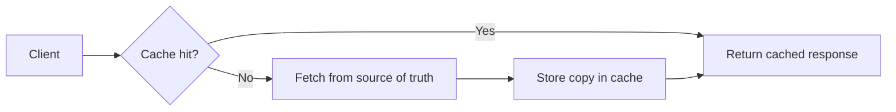
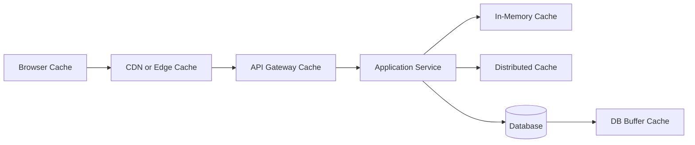
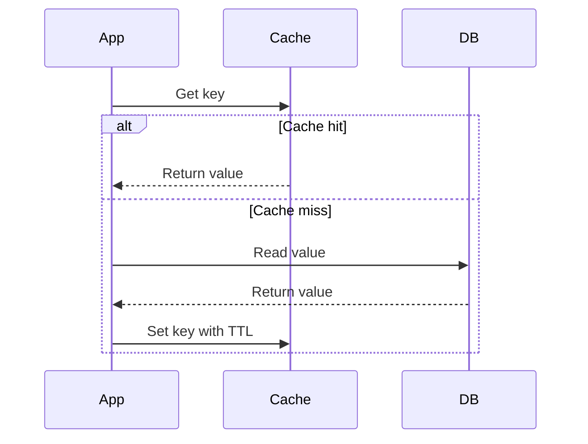
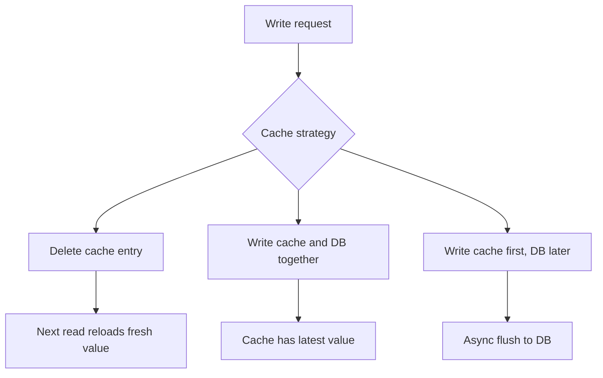
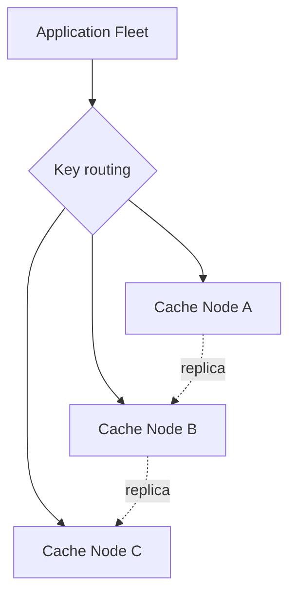
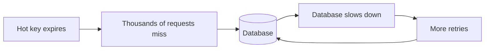
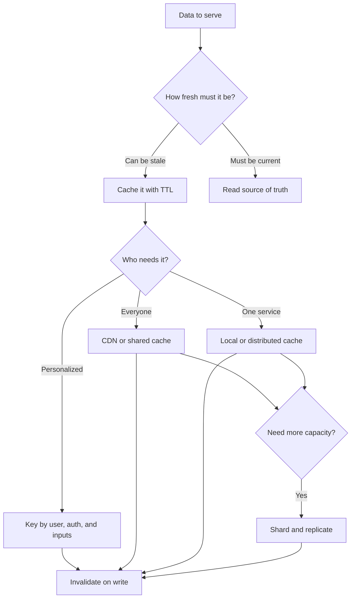

# Caching Patterns 30-Minute Study Guide

Goal: understand caching patterns well enough to explain where to add a cache, how data stays fresh, and what can go wrong in a system design interview.

<!-- SECTION: table-of-contents - DONE -->

## Table of Contents

1. [Caching Mental Model](#1-caching-mental-model)
2. [Where Caches Live](#2-where-caches-live)
3. [Core Read Patterns](#3-core-read-patterns)
4. [Core Write Patterns](#4-core-write-patterns)
5. [Distributed Cache Topologies](#5-distributed-cache-topologies)
6. [Expiration and Eviction](#6-expiration-and-eviction)
7. [Invalidation Strategies](#7-invalidation-strategies)
8. [Failure and Scale Problems](#8-failure-and-scale-problems)
9. [How to Choose a Pattern](#9-how-to-choose-a-pattern)
10. [Final Mental Model](#10-final-mental-model)
11. [30-Minute Review Checklist](#11-30-minute-review-checklist)

<!-- SECTION: mental-model - DONE -->

## 1. Caching Mental Model

A cache stores a copy of data closer to where it is needed so reads are faster and backend systems do less work.

The practical caching question is:

> Which data can be reused, and how stale can it be?



Caching usually optimizes:

| Goal | Meaning | Example |
|---|---|---|
| Lower latency | Return data from a nearby or in-memory store | Product page served from CDN |
| Higher throughput | Reduce repeated backend work | User profile read from Redis |
| Lower cost | Avoid expensive computation or database reads | Search results cached for common queries |
| Better availability | Serve stale data when origin is degraded | CDN serves old static assets during origin outage |

The tradeoff is freshness. A cache can make a system faster, but it can also return old data, overload the origin on misses, or hide consistency bugs.

Mental shortcut: **caching is a controlled stale-read strategy.**

<!-- SECTION: cache-locations - DONE -->

## 2. Where Caches Live

Caches can appear at many layers. In interviews, name the layer because each one has different freshness, ownership, and invalidation behavior.



| Location | Good for | Main caution |
|---|---|---|
| Browser cache | Static assets, images, JS, CSS | Hard to purge instantly from all clients |
| CDN or edge cache | Static content, public pages, media | Must design cache keys and purge rules carefully |
| API gateway cache | Idempotent GET responses | Auth and personalization can leak data if keyed poorly |
| Application memory | Small hot data, config, feature flags | Per-instance cache can be inconsistent across servers |
| Distributed cache | Shared hot data across app instances | Adds network hop and operational dependency |
| Database buffer cache | Recently accessed pages and indexes | Managed by the database, not app-level logic |

Common technologies:

| Need | Typical choice |
|---|---|
| Edge/static content | CDN |
| Shared low-latency cache | Redis or Memcached |
| Per-process memoization | In-memory map or library cache |
| Expensive computed result | Redis, object storage, or materialized view |

Mental shortcut: **cache static data at the edge, shared dynamic data near services, and tiny hot data in memory.**

<!-- SECTION: read-patterns - DONE -->

## 3. Core Read Patterns

### Cache-Aside

Cache-aside means the application checks the cache first. On a miss, it reads from the database and writes the result into the cache.



| Pattern | Best fit | Tradeoff |
|---|---|---|
| Cache-aside | General service reads, Redis-backed APIs | App owns cache logic and miss handling |
| Read-through | Cache library loads from DB automatically | Cleaner app code but tighter cache-store coupling |
| Refresh-ahead | Predictable hot keys that should stay warm | More complexity and possible wasted refreshes |

Cache-aside is the default interview answer because it is simple and explicit. It works well for product details, profile data, session lookups, and read-heavy APIs.

### Read-Through

Read-through means the app asks the cache, and the cache knows how to load from the source of truth on a miss.

This is useful when the platform or cache library already provides the abstraction, but it can hide database access inside cache calls. In interviews, mention that observability and failure behavior must be clear.

### Refresh-Ahead

Refresh-ahead updates hot cache entries before they expire.

Example:

```text
If a key is requested frequently and TTL is almost expired:
refresh it in the background before users see a miss.
```

This reduces latency spikes for very hot keys, but it should be reserved for known hot data. Do not refresh everything.

Mental shortcut: **cache-aside is lazy loading; refresh-ahead is proactive warming.**

<!-- SECTION: write-patterns - DONE -->

## 4. Core Write Patterns

Write patterns decide what happens to the cache when data changes.



| Pattern | Meaning | Best fit | Main risk |
|---|---|---|---|
| Delete-on-write | Update DB, then delete cache key | Most common cache-aside write flow | Race conditions can briefly serve stale data |
| Write-through | Write cache and source of truth together | Data that must be immediately cache-fresh | Higher write latency |
| Write-behind/write-back | Write cache first, persist later | High-write systems that can tolerate delayed persistence | Data loss if cache fails before flush |
| Write-around | Write DB only, populate cache on later read | Data not likely to be read soon | First read after write is slower |

For many interview designs, the safest default is:

```text
write to database -> delete cache key -> next read repopulates cache
```

Write-behind is powerful but risky. Use it only when the system can tolerate eventual persistence, replay logs, or durable queues.

Mental shortcut: **if correctness matters, keep the database as the source of truth and invalidate the cache after writes.**

<!-- SECTION: distributed-topologies - DONE -->

## 5. Distributed Cache Topologies

A distributed cache spreads cached data across multiple machines so the cache can handle more memory, throughput, and failures than one server.



| Concept | Meaning | Why it matters |
|---|---|---|
| Sharding or partitioning | Split keys across cache nodes | Increases capacity and throughput |
| Consistent hashing | Route keys so node changes move fewer keys | Reduces cache churn during scaling |
| Replication | Keep extra copies of cached data | Improves availability and read capacity |
| Peer-to-peer cache | Cache nodes coordinate directly with each other | Avoids a single coordinator but makes consistency harder |

These reuse two concepts covered in depth elsewhere: see [Sharding & Partitioning](../databases/sharding-partitioning.md#4-consistent-hashing-and-virtual-nodes) for consistent hashing and virtual nodes, and [Availability & Replication](../distributed-systems/availability-replication.md) for replication patterns and their freshness tradeoffs.

### Replication

Replication means storing a cached value on more than one cache node.

It helps when a node fails or a hot key receives too much traffic. The tradeoff is that replicas can briefly disagree, especially if invalidation or updates reach one replica before another.

Common choices:

| Replication style | Best fit | Main tradeoff |
|---|---|---|
| Primary-replica | Simpler writes and failover | Replica lag can serve stale values |
| Multi-replica reads | Hot keys or high read traffic | More copies to invalidate |
| Cross-region replica | Lower latency for global users | Higher staleness and conflict risk |

### Peer-to-Peer (P2P)

Peer-to-peer caching means cache nodes talk to each other directly instead of depending on one central coordinator for every operation.

This can improve resilience because the cluster is less dependent on one control node. The cost is more complex membership, replication, invalidation, and split-brain handling.

In an interview, say this carefully:

```text
P2P cache clusters can avoid a central bottleneck, but they make consistency and failure detection harder.
I would use them for high-scale distributed caching only if the platform already supports membership, replication, and rebalancing.
```

Mental shortcut: **distributed caches scale reads with sharding and survive failures with replication, but every extra copy makes freshness harder.**

<!-- SECTION: expiration-eviction - DONE -->

## 6. Expiration and Eviction

Expiration and eviction answer different questions.

| Concept | Question it answers | Examples |
|---|---|---|
| Expiration | When is this value too old? | TTL, absolute expiry, sliding expiry |
| Eviction | What should be removed when cache is full? | LRU, LFU, FIFO, random eviction |

### TTL

TTL means time to live. After the TTL expires, the cache entry should be refreshed or removed.

Short TTLs improve freshness but increase misses. Long TTLs reduce load but increase stale-read risk.

Examples:

| Data | Possible TTL |
|---|---|
| Stock quote | Seconds |
| Restaurant menu | Minutes |
| Product catalog | Minutes to hours |
| Static image with versioned URL | Days to months |
| User permissions | Short TTL or explicit invalidation |

### Eviction Policies

| Policy | Meaning | Good for |
|---|---|---|
| LRU | Remove least recently used item | General-purpose caches |
| LFU | Remove least frequently used item | Stable hot-key workloads |
| FIFO | Remove oldest inserted item | Simple queues, less common for app caches |
| Size-based | Remove large or low-priority entries | Memory-constrained caches |

Mental shortcut: **TTL controls freshness; eviction controls memory.**

<!-- SECTION: invalidation - DONE -->

## 7. Invalidation Strategies

Cache invalidation means removing or updating cached data when the source of truth changes.

The classic hard problem is not deleting one key. It is knowing all the keys that contain the changed data.

| Strategy | How it works | Best fit | Caution |
|---|---|---|---|
| Delete exact key | Remove `user:123` after updating user 123 | Simple entity lookups | Does not clear aggregate/list caches |
| Versioned keys | Include version in key, like `menu:v42` | Static assets, configs, catalogs | Old keys must expire eventually |
| Event-based invalidation | Publish change event and subscribers clear keys | Many services or cache layers | Requires reliable event delivery |
| Tag-based purge | Purge all entries tagged with `product:123` | CDN and content systems | Needs cache support for tags |
| TTL-only | Let entries age out naturally | Data where staleness is acceptable | Users may see old data until expiry |

A common mistake is caching lists without a plan for invalidation.

Example:

```text
Update product:123
Need to invalidate:
- product:123
- category:shoes:page:1
- search:red-shoes
- homepage:featured-products
```

If exact invalidation is hard, use shorter TTLs for aggregate views and exact invalidation for entity reads.

Mental shortcut: **entity caches are easy to invalidate; aggregate caches need a deliberate strategy.**

<!-- SECTION: failure-scale - DONE -->

## 8. Failure and Scale Problems

Caching problems often show up during traffic spikes, cache failures, or deploys.

| Problem | What happens | Mitigation |
|---|---|---|
| Cache stampede | Many requests miss at once and hit the database | Request coalescing, locks, jittered TTLs, stale-while-revalidate |
| Thundering herd | Many clients retry or refresh at the same time | Backoff, jitter, rate limits, queueing |
| Hot key | One key receives too much traffic for one cache node | Replicate hot keys, shard carefully, local cache, request coalescing |
| Cold start | Empty cache after deploy, failover, or flush | Warm cache, gradual rollout, protect database |
| Cache penetration | Requests for missing data repeatedly hit DB | Cache negative results, validate inputs, rate limit |
| Cache avalanche | Many keys expire at the same time | Add TTL jitter, stagger refreshes |
| Stale reads | User sees old value after update | Invalidate on write, shorter TTL, read-your-writes path |
| Split brain | Cache nodes disagree about cluster membership or ownership | Strong cluster membership, quorum, conservative failover |

Hot keys and the full taxonomy of production mitigations (key salting, scatter-gather, request coalescing, adaptive resharding) are covered in [Sharding & Partitioning → Hot Spots](../databases/sharding-partitioning.md#5-hot-spots-what-they-are-and-how-production-systems-fix-them).

### Cache Stampede Example



Better behavior:

```text
Only one request refreshes the key.
Other requests wait briefly or receive a stale value.
```

Mental shortcut: **a cache miss should not become a database DDoS.**

<!-- SECTION: choosing-pattern - DONE -->

## 9. How to Choose a Pattern

Use these interview questions before picking a cache:

1. What data is read repeatedly?
2. What is the source of truth?
3. How stale can the data be?
4. Who invalidates the cache after writes?
5. What is the cache key?
6. Is the response personalized or public?
7. What happens when the cache is empty or down?
8. Can one hot key overload the cache?
9. Does the cache need sharding, replication, or both?
10. How will you measure hit rate, latency, and backend load?

Pattern defaults:

| Scenario | Good default |
|---|---|
| Static assets | CDN with long TTL and versioned file names |
| Public read-heavy pages | CDN or edge cache with purge support |
| User/session/profile reads | Cache-aside with Redis and short TTL |
| Expensive computed result | Cache-aside with TTL and request coalescing |
| Rapid writes, delayed persistence acceptable | Write-behind with durable queue or log |
| Large shared cache | Sharded distributed cache with replication for critical keys |
| Critical balance/payment/inventory data | Avoid stale cache for authoritative reads |

Do not cache everything. Cache data that is expensive to compute or read, requested often, and safe to serve with a known freshness policy.

Mental shortcut: **start with the data freshness requirement, then choose the cache layer and pattern.**

<!-- SECTION: final-model - DONE -->

## 10. Final Mental Model



One-line mental model:

```text
Caching = faster reads + lower backend load + explicit freshness tradeoffs.
```

In an interview, a strong answer sounds like:

```text
I would cache this because reads are frequent and the data can be stale for 5 minutes.
The database remains the source of truth.
I would use cache-aside with Redis, add TTL jitter, invalidate on writes, and protect the database from stampedes.
```

<!-- SECTION: review-checklist - DONE -->

## 11. 30-Minute Review Checklist

1. Explain caching in one sentence.
2. Compare browser, CDN, application, distributed, and database caches.
3. Explain cache hit and cache miss.
4. Explain cache-aside with a read flow.
5. Compare read-through and cache-aside.
6. Explain refresh-ahead and when it is useful.
7. Compare write-through, write-behind, write-around, and delete-on-write.
8. Explain why write-behind can lose data.
9. Explain sharding and consistent hashing in a distributed cache.
10. Explain why cache replication improves availability but can increase staleness.
11. Explain the peer-to-peer cache tradeoff.
12. Define TTL and explain the freshness tradeoff.
13. Compare LRU and LFU eviction.
14. Explain cache invalidation for entity data vs aggregate views.
15. Explain cache stampede and how to prevent it.
16. Explain hot keys and cache avalanche.
17. Explain why personalized responses need careful cache keys.
18. Say when you should not cache authoritative data.
