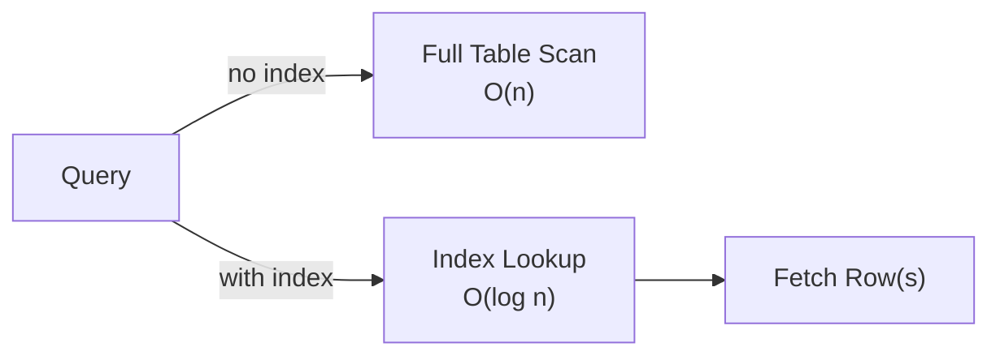

# Database Indexing Study Guide

Goal: understand the index types that come up in system design interviews — what each one is, when to reach for it, and when B-Tree alone is enough.

## Table of Contents

1. [Mental Model](#1-mental-model)
2. [B-Tree Index — the default](#2-b-tree-index-the-default)
3. [Hash Index](#3-hash-index)
4. [Composite Index](#4-composite-index)
5. [Covering Index](#5-covering-index)
6. [Partial Index](#6-partial-index)
7. [Full-Text Index](#7-full-text-index)
8. [Spatial / GiST Index](#8-spatial-gist-index)
9. [Comparison Table](#9-comparison-table)
10. [How to Choose](#10-how-to-choose)
11. [Interview Talking Points](#11-interview-talking-points)
12. [Review Checklist](#12-review-checklist)

---

## 1. Mental Model

An index is a separate data structure the DB maintains alongside the table. Queries use it to jump directly to matching rows instead of scanning every row.

> **Core tradeoff: read speed vs. write overhead + storage.**  
> Every index must be updated on INSERT, UPDATE, and DELETE. Adding indexes blindly hurts write-heavy systems.



Two questions to anchor every indexing decision:
1. What is the access pattern? (equality, range, text search, geo proximity)
2. What is the read/write ratio? (high write load = fewer indexes)

---

## 2. B-Tree Index — the default

**Structure:** balanced sorted tree. Each node holds key ranges; leaf nodes point to rows.

**What it supports:**
- Equality: `WHERE id = 42`
- Range: `WHERE created_at BETWEEN ... AND ...`
- Sorting: `ORDER BY price ASC` (if indexed)
- Prefix scans: `WHERE name LIKE 'foo%'`

**When to use:** almost always. Primary keys, foreign keys, any column in `WHERE`, `JOIN ON`, or `ORDER BY`.

**Limitation:** can't help with keyword search inside text, or proximity queries on coordinates.

```sql
CREATE INDEX idx_users_email ON users(email);
```

---

## 3. Hash Index

**Structure:** hash map — keys are hashed to buckets containing row pointers.

**What it supports:** exact equality only. O(1) lookup.

**What it does not support:** range queries, sorting, prefix scans.

**Interview signal:** rarely worth calling out. B-Tree handles equality just as well and also supports ranges. Some engines (MySQL/InnoDB) don't even expose hash indexes on disk — they're an in-memory optimization. Default to B-Tree.

---

## 4. Composite Index

A B-Tree index built on multiple columns in a specified order: `(col_a, col_b, col_c)`.

**The prefix rule:** the index helps only if the query filters on a leading prefix of the columns.

| Query filters on | Uses `(user_id, status)` index? |
|---|---|
| `user_id` only | Yes |
| `user_id` AND `status` | Yes |
| `status` only | No |

**Column ordering rule:** put the most selective / equality-filtered columns first; put range columns last.

```sql
-- Good: equality on user_id first, then range on created_at
CREATE INDEX idx_orders ON orders(user_id, created_at);

-- Query that benefits:
SELECT * FROM orders WHERE user_id = 99 AND created_at > '2024-01-01';
```

**Use cases:** any query that filters on multiple columns together — feeds, order history, status dashboards.

---

## 5. Covering Index

Not a separate index type. A covering index is a B-Tree that includes every column the query needs — so the DB can answer the query from the index alone without touching the table.

This is called an **index-only scan** and eliminates heap fetches.

```sql
-- Query:
SELECT user_id, status, created_at FROM orders WHERE user_id = 99;

-- Covering index (all 3 columns present):
CREATE INDEX idx_orders_covering ON orders(user_id, status, created_at);
```

**When to reach for it:** hot read endpoints where latency matters. The index is larger and writes are slower — only add it where query frequency justifies the cost.

---

## 6. Partial Index

A B-Tree index built on a filtered subset of rows.

```sql
-- Only index orders that are not yet completed
CREATE INDEX idx_active_orders ON orders(user_id)
WHERE status != 'completed';
```

**Benefits:**
- Much smaller index (ignores the majority of historical rows)
- Faster writes (fewer rows to maintain)
- The query planner uses it only when the query's WHERE clause matches the filter

**Use cases:**
- Soft-delete patterns: `WHERE deleted_at IS NULL`
- Indexing only the active/pending subset of a large table
- Hot paths where 90%+ of data is cold and never queried

---

## 7. Full-Text Index

**Structure:** inverted index — maps each token (word) to the list of rows containing it.

**What it supports:** keyword search inside text fields.

```sql
-- Postgres
CREATE INDEX idx_posts_fts ON posts USING GIN(to_tsvector('english', body));

-- Query
SELECT * FROM posts WHERE to_tsvector('english', body) @@ to_tsquery('database & indexing');
```

**When to use inside the DB:** low-to-medium scale search on structured data (product names, support tickets, comments). Easier to operate than a separate search cluster.

**When to reach for Elasticsearch instead:**
- Relevance ranking matters (TF-IDF, BM25)
- Faceted search / aggregations
- Search at high scale across many services

**Interview signal:** say "I'd use Postgres full-text search for moderate scale; for user-facing search at scale I'd put Elasticsearch in front."

### Why `LIKE '%term%'` forces a full scan even with a B-Tree

A B-Tree stores values **sorted left-to-right**, like a dictionary. To use it the engine must know the **prefix** to seek to, then it walks a contiguous range.

| Pattern | Prefix known? | Index usable? |
|---|---|---|
| `LIKE 'abc%'` | Yes (`abc`) | Range scan |
| `LIKE 'abc%def'` | Yes (`abc`) | Range scan, then filter |
| `LIKE '%abc'` | No | Full scan |
| `LIKE '%abc%'` | No | Full scan |

A **leading wildcard** removes the anchor — matching rows are scattered all over the sorted tree with no contiguous range, so the engine must check every row. The B-Tree's sort order buys you nothing.

**Rule of thumb:** a B-Tree helps only when the predicate constrains a **left-anchored prefix**. For "contains substring" you need full-text or trigram indexing.

### tsvector vs. pg_trgm

Both are usually backed by a GIN index, but they break text into different units, which decides what they're good at.

| | `tsvector` (FTS) | `pg_trgm` (trigram) |
|---|---|---|
| Unit indexed | Stemmed words (lexemes) | 3-char sequences |
| `LIKE '%foo%'` | No help | **Accelerates it** |
| `running` matches `run`? | Yes (stemming) | No |
| `cat` matches `category`? | No | **Yes** (substring) |
| Typo / fuzzy match | No | **Yes** (`similarity`) |
| Relevance ranking | Yes (`ts_rank`) | Similarity score only |
| Language-aware | Yes | No |

- **tsvector** = "search the *document* for *this concept*." Stems words (`running`→`run`), drops stopwords, supports ranking and boolean queries. Use for natural-language search: articles, tickets, comments.
- **pg_trgm** = "find this *character pattern* anywhere." Chops strings into overlapping 3-char windows, so it accelerates `ILIKE '%substring%'` and enables fuzzy/typo matching. No language understanding.

```sql
-- pg_trgm: makes substring + fuzzy search index-assisted
CREATE INDEX idx_name_trgm ON users USING GIN (name gin_trgm_ops);
SELECT * FROM users WHERE name ILIKE '%cat%';            -- now uses the index
SELECT * FROM users WHERE similarity(name, 'jon') > 0.3; -- fuzzy
```

**Interview one-liner:** "`tsvector` for natural-language search with stemming and ranking; `pg_trgm` when I need substring or fuzzy matching — including making `LIKE '%x%'` index-assisted. Different problems, sometimes both."

### What Elasticsearch does that Postgres FTS can't (easily)

Use these as concrete framing for *why* search-as-a-product outgrows Postgres. Each is a capability ES does naturally; the note says what Postgres can't match.

**1. Field-weighted relevance (BM25 + boosting)** — rank by *best* match, with a title hit worth more than a body hit.
> Postgres: `ts_rank` with `setweight` exists but is crude — no corpus-wide IDF by default, and tuning field weights is manual.

**2. Typo tolerance blended into the score** — fuzzy match *and* rank, in one query.
> Postgres: `pg_trgm similarity()` finds fuzzy matches but you sort by raw similarity — it doesn't blend into a relevance score alongside other signals.

**3. Search-as-you-type / autocomplete** — ranked prefix suggestions as the user types (edge n-gram / search-as-you-type analyzers).
> Postgres: only `LIKE 'head%'` prefix scan — no ranked, analyzer-aware suggestions.

**4. Faceted search + live counts alongside results** — the e-commerce sidebar ("Nike 42, Adidas 17"), via aggregations.
> Postgres: `GROUP BY` works, but combining FTS relevance + multiple live facet counts + pagination gets expensive and awkward.

**5. Synonyms** — `laptop` matches `notebook` via a synonym analyzer at index/query time.
> Postgres: no native synonym expansion; you hand-roll it.

**6. Phrase proximity / slop** — match these words within N of each other, any order.
> Postgres: phrase search exists (`<->`), but proximity/slop tuning is limited.

**7. Highlighting matched snippets** — return marked-up fragments for results pages.
> Postgres: `ts_headline` exists but is slower and less flexible.

**8. Did-you-mean / suggesters** — spelling correction suggestions.
> Postgres: nothing built in.

**9. Horizontal scale** — index split into shards + replicas across nodes; search fans out in parallel and scales independently of the OLTP database.
> Postgres: FTS runs inside the primary and competes with transactional load for the same CPU/RAM/I/O.

**The decision rule:** is search *incidental* (a filter over your data) or *the product* (catalog, logs, a search box users live in)? Incidental → stay in Postgres. The product → Elasticsearch. And remember: ES is a **near-real-time secondary index**, eventually consistent and synced via CDC/ETL — never the source of truth.

---

## 8. Spatial / GiST Index

**Structure:** R-Tree or Generalized Search Tree (GiST) — indexes geometric bounding boxes, not scalar values.

**What it supports:** proximity queries, containment, intersection on geographic or geometric data.

```sql
-- Postgres + PostGIS
CREATE INDEX idx_restaurants_location ON restaurants USING GIST(location);

-- "Find all restaurants within 5 km of a point"
SELECT * FROM restaurants
WHERE ST_DWithin(location, ST_MakePoint(-122.4, 37.7)::geography, 5000);
```

**Why B-Tree fails here:** coordinates are 2D. A B-Tree sorts on one axis at a time and can't efficiently answer "within radius" without scanning a huge range.

**When it comes up:** any design with location features — ride-share (find nearby drivers), food delivery (find nearby restaurants), maps (POI search). Always mention GiST/spatial when geography is part of the schema.

---

## 9. Comparison Table

| Index Type       | Structure       | Equality | Range | Sort | Full-Text | Spatial | Write Cost  |
|-----------------|----------------|:--------:|:-----:|:----:|:---------:|:-------:|------------|
| B-Tree           | Balanced tree  | ✅       | ✅    | ✅   | ❌        | ❌      | Low        |
| Hash             | Hash map       | ✅       | ❌    | ❌   | ❌        | ❌      | Low        |
| Composite B-Tree | Balanced tree  | ✅       | ✅*   | ✅*  | ❌        | ❌      | Medium     |
| Covering         | B-Tree + cols  | ✅       | ✅    | ✅   | ❌        | ❌      | Medium-High|
| Partial          | B-Tree subset  | ✅       | ✅    | ✅   | ❌        | ❌      | Low        |
| Full-Text / GIN  | Inverted index | ❌       | ❌    | ❌   | ✅        | ❌      | Medium     |
| GiST / Spatial   | R-Tree         | ❌       | ❌    | ❌   | ❌        | ✅      | Medium     |

\* only on prefix columns

---

## 10. How to Choose

```
What is the access pattern?
│
├─ Equality or range on scalar column(s)?
│   ├─ Single column → B-Tree
│   └─ Multiple columns together → Composite B-Tree
│       └─ Query only reads a few columns? → make it Covering
│
├─ Table is huge but only a small subset is "active"?
│   └─ Partial Index
│
├─ User-typed keyword search?
│   ├─ Moderate scale → Full-Text Index (GIN in Postgres)
│   └─ High scale / relevance ranking → Elasticsearch
│
└─ Geographic / proximity queries?
    └─ Spatial / GiST Index (PostGIS)
```

---

## 11. Interview Talking Points

- "My default is a B-Tree on any column that appears in WHERE, JOIN ON, or ORDER BY."
- "For multi-column queries, column order in the composite index matters — equality columns first, range columns last."
- "A covering index eliminates heap fetches. I'd add one on hot read paths where latency is critical."
- "Indexes are a write-tax. In write-heavy systems I'd be selective — only index what query patterns justify."
- "For text search I start with the DB's full-text index. If the product needs relevance ranking or facets at scale, that's an Elasticsearch conversation."
- "B-Tree can't do radius queries. Any feature with 'find nearby X' needs a spatial index — GiST in Postgres, or a geo-aware store like Redis with geo commands."

---

## 12. Review Checklist

- [ ] Can name the right index type for each pattern: equality, range, multi-column, text, geo
- [ ] Can explain the composite index prefix rule with a concrete example
- [ ] Can articulate the write-overhead tradeoff when asked "why not index everything?"
- [ ] Know when to stay inside the DB for full-text vs. when to recommend Elasticsearch
- [ ] Know to call out GiST/spatial whenever location is part of the system design
- [ ] Can describe what a covering index is and when it's worth the overhead
