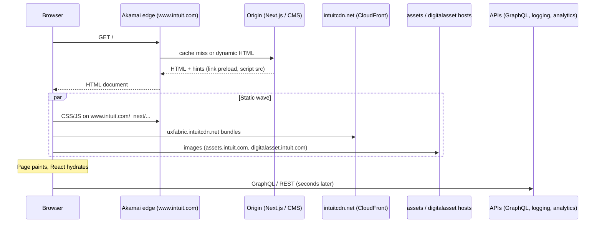
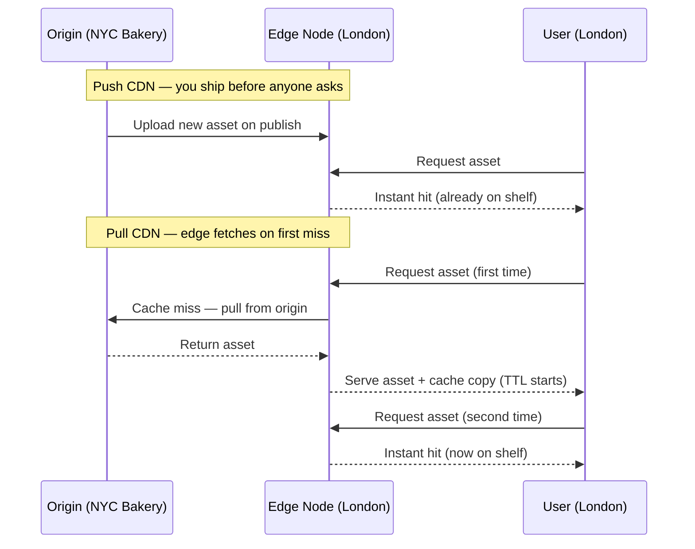

# Client → Edge/CDN: Real-World Example (intuit.com)

Goal: connect the abstract **Client → Edge/CDN** path to what you actually see in DevTools—HTML, CDN asset URLs, CSS/JS, images, and GraphQL calls that appear later.

Related:
- [System Design guide §2](networking-request-path.md#2-internet-request-flow) — DNS, edge, L4, L7 request flow
- [System Design guide §3](networking-request-path.md#3-vip-anycast-and-load-balancer-entry-points) — Anycast, VIP, steering
- [System Design guide §4](networking-request-path.md#4-ddos-protection-by-layer) — what edge absorbs vs gateway
- [Caching Patterns guide §2](../caching-and-scale/caching-patterns.md#2-where-caches-live) — browser, CDN, gateway caches

**Running example:** loading `https://www.intuit.com/` in a browser and reading the Network tab.

Patterns below were observed from live homepage HTML and response headers (Akamai at edge, multiple asset CDNs, Next.js, deferred API calls). Hostnames and paths change over time; the **mental model** is what matters for interviews.

<!-- SECTION: table-of-contents - DONE -->

## Table of Contents

1. [The Big Picture: One Visit, Many Doors](#1-the-big-picture-one-visit-many-doors)
2. [Phase 0 — DNS and Edge Pick](#2-phase-0-dns-and-edge-pick)
3. [Phase 1 — HTML Arrives](#3-phase-1-html-arrives)
4. [Phase 2 — CSS, JS, and Images](#4-phase-2-css-js-and-images)
5. [Phase 3 — Paint, Hydrate, Second Wave](#5-phase-3-paint-hydrate-second-wave)
6. [Phase 4 — GraphQL and APIs (Later)](#6-phase-4-graphql-and-apis-later)
7. [Map to Study-Guide Layers](#7-map-to-study-guide-layers)
8. [DevTools Checklist](#8-devtools-checklist)
9. [Quick Reference Table](#9-quick-reference-table)
10. [Push CDN vs Pull CDN](#10-push-cdn-vs-pull-cdn)
11. [One-Hour Review Checklist](#11-one-hour-review-checklist)

<!-- SECTION: big-picture - DONE -->

## 1. The Big Picture: One Visit, Many Doors

`www.intuit.com` is not one server. It is a **stack of front doors**, each optimized for a different kind of content.



**Why you see CDN URLs for some things and `www.intuit.com` for others:** teams publish assets to different systems (DAM, design tokens, privacy scripts, Next build output). Each hostname has its own cache rules and origin.

Mental shortcut: **HTML is the manifest; CDNs serve the heavy static copies; APIs run after the app wakes up.**

<!-- SECTION: phase-0 - DONE -->

## 2. Phase 0 — DNS and Edge Pick

1. Browser resolves `www.intuit.com` → IP(s) (often **Anycast** into Akamai).
2. TLS terminates at the **edge** (look for `akamai-grn`, `server-timing: edge` on responses).
3. First request is usually `GET /`.

The HTML document goes through **Akamai → origin** (Next.js / marketing stack). It is **not** cached like a versioned `.js` file with `immutable`—it is dynamic or short-TTL compared to static assets.

From the [VIP/Anycast section](networking-request-path.md#3-vip-anycast-and-load-balancer-entry-points): **DNS chooses an address; Anycast chooses a location.**

<!-- SECTION: phase-1 - DONE -->

## 3. Phase 1 — HTML Arrives

The document is a **Next.js** page (`/_next/static/...`, many `defer` chunk scripts). The HTML already contains:

| In HTML | What it is | Why it's there |
|--------|------------|----------------|
| Large inline scripts | Analytics datalayer, cookies (`ivid`), error logging hooks | Run early; avoid extra round trips |
| `<link rel="stylesheet" href="https://www.intuit.com/icom-components/release/1220/...">` | Versioned marketing component CSS | Release path (`release/1220`) = cache busting |
| `<link rel="preload" ... as="style">` | Fetch hints | Faster first paint |
| `` | Responsive images from DAM | Resize/format at CDN/DAM (`?wid=`, `fmt=jpg`) |
| `<script defer src="/_next/static/chunks/...">` | Code-split app bundles | **Deferred** = run after HTML parse |

**First network burst** is usually:

1. Document: `www.intuit.com/`
2. Many CSS files (icom-components, gwp-components, qbmds, `_next/static/css/...`)
3. Early scripts from **dedicated CDNs** (privacy, GDPR, design tokens)
4. Images referenced in HTML (hero, logos, cards)

**Example hostnames** (observed on homepage):

| Hostname | Role |
|----------|------|
| `privacy-cdn.a.intuit.com` | Cookie / consent scripts (isolated CDN) |
| `uxfabric.intuitcdn.net` | Shared UX bundles (CloudFront: `x-cache: Hit from cloudfront`) |
| `assets.intuit.com/is/image/...` | Image CDN with on-the-fly transforms |
| `digitalasset.intuit.com/render/content/dam/...` | DAM render URLs |
| `www.intuit.com/oidam/...` | Assets on main hostname (still behind edge) |
| `tags.tiqcdn.com` | Tag manager / analytics third-party CDN |

Mental model: **HTML is the shopping list.** It tells the browser what to download; it does not run the full app yet.

<!-- SECTION: phase-2 - DONE -->

## 4. Phase 2 — CSS, JS, and Images

Once the browser parses HTML, it fires **many parallel GETs**. DevTools Network often looks like a wall of requests—that is expected.

### CSS (mostly `www.intuit.com`, versioned paths)

```text
.../icom-components/release/1220/blocks/icom-components/s01-mega-nav.css
.../gwp-components/releases/2206/styles/icom/blocks.icom.css
.../_next/static/css/382196c3cf39c1a9b35b.css
```

**Cache-friendly:** release number in path ≈ cache busting without purging the whole CDN.

### JavaScript — three layers

| Layer | Example | Role |
|-------|---------|------|
| **Edge / shared CDN** | `uxfabric.intuitcdn.net/.../gdprUtilBundle.js` | Cross-site utilities, design system, RUM |
| **Next chunks on www** | `/_next/static/chunks/icom-components.*.js` | Page-specific React / components |
| **Third-party CDN** | `tags.tiqcdn.com/utag/...` | Tag manager / analytics |

Scripts use `defer`: **parse HTML → download in parallel → run in order when DOM ready**.

### Images — why URLs look “CDN-ish”

```text
https://digitalasset.intuit.com/render/content/dam/intuit/ic/en_us/images/...jpg
https://assets.intuit.com/is/image/intuitstage/...?wid=402&fmt=jpg&qlt=10...
https://www.intuit.com/oidam/intuit/ic/en_us/images/...
```

Same idea: **long cache TTL + URL parameters for size/quality**. The browser may fetch desktop, tablet, and mobile variants (`<picture>` / different `src` per breakpoint).

### Cache behavior (examples from response headers)

| Asset | Signal | Meaning |
|-------|--------|---------|
| `uxfabric.intuitcdn.net` | `x-cache: Hit from cloudfront`, large `age` | Served from edge; origin not touched |
| `www.intuit.com/_next/static/chunks/...` | `server-timing: cdn-cache; desc=REVALIDATE`, `akamai-grn` | Edge had copy; revalidated with origin/S3 |

<!-- SECTION: phase-3 - DONE -->

## 5. Phase 3 — Paint, Hydrate, Second Wave

After CSS + critical HTML structure:

1. **First Contentful Paint** — layout from HTML + CSS (nav, hero shell).
2. **Deferred JS runs** — React **hydration**: static HTML becomes interactive.
3. **More chunks load on demand** when components mount or the user scrolls.

DevTools often shows **two waves**:

| Wave | Timing | What you see |
|------|--------|--------------|
| Wave 1 | ~0–2s | HTML, CSS, images, `defer` chunks |
| Wave 2 | ~1–5s+ | Extra `_next` chunks, analytics, APIs |

<!-- SECTION: phase-4 - DONE -->

## 6. Phase 4 — GraphQL and APIs (Later)

GraphQL usually **does not appear in the initial HTML**. It shows up when **running JavaScript** needs live data.

### Typical triggers (marketing homepage)

| Trigger | Example behavior |
|---------|------------------|
| Hydration | Widget needs fresh promos or CMS fields not fully inlined |
| Scroll / viewport | Lazy-load carousel or recommendations |
| User action | Mega-nav, search, sign-in CTA |
| Identity / consent | After cookies (`ivid`, consent wrapper), calls include visitor context |
| A/B or feature flags | Client fetches experiment assignment |

**Network tab timeline:**

```text
t=0s     document, css, js, images  (CDN-heavy)
t=1–3s   more _next chunks, analytics (tiqcdn, logging.api.intuit.com)
t=2–5s+  POST graphql...  (often separate hostname from www)
```

### GraphQL vs static assets

| Request type | Typical path | Cached at edge? |
|--------------|--------------|-----------------|
| `GET` image / CSS / JS | CDN hostnames | Yes, aggressively |
| `POST` GraphQL | API gateway | No (or very limited); hits origin services |
| `POST` logging / telemetry | `*.api.intuit.com` | No |

GraphQL requests are usually:

- **POST** to a GraphQL gateway (not cacheable like `GET logo.png`)
- **Cookie-bearing** when personalized
- Routed to **L7 gateway / federator** in the [request-flow model](networking-request-path.md#2-internet-request-flow)—**not** the image CDN path

Even on a “static-looking” homepage, GraphQL may back: promos, blog cards, nav, locale, experiments, or signed-in hints.

For GraphQL depth, see [GraphQL study guide](../messaging-and-apis/graphql.md).

<!-- SECTION: map-layers - DONE -->

## 7. Map to Study-Guide Layers

```text
Browser
  │
  ├─► www.intuit.com ──────────► Akamai edge ──► Next.js origin (HTML, /_next)
  │
  ├─► uxfabric.intuitcdn.net ──► CloudFront ──► S3 (shared JS/CSS)
  │
  ├─► privacy-cdn.a.intuit.com ► dedicated edge (consent scripts)
  │
  ├─► assets / digitalasset hosts ► DAM + image CDN (photos, SVGs, Lottie JSON)
  │
  └─► (later) *.api.intuit.com / GraphQL host ► gateway → services → DB
                                      ▲
                                      └── NOT the image CDN path
```

**Client → Edge/CDN** covers the first four bullets. GraphQL is **past** that—application tier—which matches “after a while” in DevTools.

Contrast with [reverse proxy vs L4](networking-request-path.md#2-internet-request-flow):

- **L4** (behind edge): picks which connection hits which frontend.
- **L7 reverse proxy / gateway** (origin side): routes HTTP by path; GraphQL lives here.
- **CDN edge** (public): caches static bytes close to users; shields origin from read-heavy traffic.

<!-- SECTION: devtools - DONE -->

## 8. DevTools Checklist

1. **Sort by start time** — document first, then parallel cluster.
2. **Filter by domain** — group `intuitcdn`, `digitalasset`, `assets.intuit`, `www.intuit.com`.
3. **Initiator column on GraphQL** — initiator = some `.js` chunk → client-driven, not HTML.
4. **Response headers:**
   - `x-cache: Hit from cloudfront` → CDN served it
   - `akamai-grn` / `server-timing: edge` → Akamai in path
   - `cache-control: immutable` / long `max-age` → built for edge caching
5. **Hard reload vs normal reload** — second visit should show more disk/memory cache and CDN hits.

<!-- SECTION: quick-ref - DONE -->

## 9. Quick Reference Table

| What you see | What happened |
|--------------|----------------|
| HTML from `www.intuit.com` | Edge → origin; dynamic or short-TTL; includes the load plan |
| CSS/JS on `www.intuit.com` with `release/####` | Versioned static files; Akamai + origin; highly cacheable |
| `*.intuitcdn.net` | Separate shared CDN (CloudFront); cross-product bundles |
| Image URLs on `assets` / `digitalasset` | DAM + image optimization; CDN caches transforms |
| GraphQL (later) | Hydrated app → API gateway; bypasses static CDN; hits services |

<!-- SECTION: push-pull-cdn - DONE -->

## 10. Push CDN vs Pull CDN

A CDN can get content to its edge nodes in one of two ways: **you push it there in advance**, or **the edge pulls it on first request**. Choosing the right model affects storage cost, first-user latency, and operational complexity.

**The analogy:** imagine your origin server is the Main Bakery in New York. CDN edge nodes are Neighborhood Bakeries in London, Tokyo, and LA.



| | Push CDN | Pull CDN |
|---|---|---|
| **When content reaches edge** | On publish — before anyone asks | On first request — after a cache miss |
| **Who controls distribution** | You (origin pushes) | Edge (edge pulls on demand) |
| **First-user latency** | Fast — content already cached | Slow — first visitor waits for origin round-trip |
| **Storage use** | High — all content copied everywhere | Low — only requested content is cached |
| **Stale content risk** | Low — you control what's pushed | Managed by TTL (Time-to-Live) |
| **Best for** | Small/stable sites, rarely-changing content | High-traffic sites with dynamic, ever-changing content |

### TTL and the stale shelf problem (Pull CDN)

In a pull CDN, each cached copy has a **TTL** — a countdown to expiry.

```text
London edge caches croissant.jpg with TTL = 24h
  → Hour 0:   cached, served instantly
  → Hour 24:  TTL expires → entry evicted
  → Hour 25:  next user triggers a new pull from origin
```

Short TTL → fresher content, more origin hits.  
Long TTL → fewer origin hits, risk of users seeing old versions.

For static assets with versioned URLs (like `/_next/static/chunks/app.a1b2c3.js`), TTL can be days or weeks — the filename itself is the cache-bust. For HTML or personalized responses, TTL is short or zero.

### How the intuit.com walkthrough maps to pull CDN

Everything observed in §2–6 above is **pull CDN behavior**:

| What you saw | Pull CDN behavior |
|---|---|
| `x-cache: Hit from cloudfront` on `uxfabric.intuitcdn.net` | Pull hit — edge had the copy |
| `server-timing: cdn-cache; desc=REVALIDATE` on Akamai | Pull miss + revalidate — edge checked with origin |
| `release/1220/` in CSS paths | Long TTL safe because URL changes on deploy |
| GraphQL not cached | Pull CDN skips POST requests entirely — hits origin every time |

Intuit does not visibly use push CDN for its public homepage assets — pull with versioned URLs is the standard pattern for high-traffic web properties.

Mental shortcut: **Push = you ship before they ask. Pull = edge fetches when someone asks. Versioned URLs make pull CDN behave like push without the storage cost.**

<!-- SECTION: checklist - DONE -->

## 11. One-Hour Review Checklist

- [ ] Can you explain why one page uses multiple hostnames (www, intuitcdn, digitalasset, privacy-cdn)?
- [ ] Can you describe Phase 1 vs Phase 4 traffic (static GET vs POST GraphQL)?
- [ ] Can you read `x-cache`, `age`, and `akamai-grn` and infer hit vs miss?
- [ ] Can you explain why GraphQL appears seconds after images and CSS?
- [ ] Can you map this example onto DNS → edge → L4 → L7 from the main system design guide?
