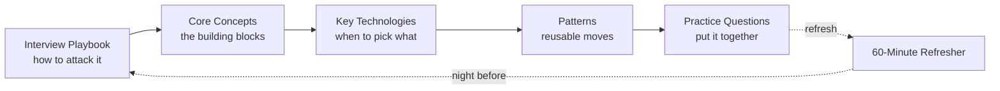

# System Design Interview Guide

An **end-to-end guide for Senior and Staff system design interviews** — built to be studied once and *refreshed fast* before an interview. It is organized in two tracks:

- **Refresher track (fast):** the [Interview Playbook](interview-playbook/attacking-the-interview.md), the [60-Minute Refresher](quick-refresher/60-minute-refresher.md), the [Technology Selection Cheat Sheet](key-technologies/index.md), and each practice question's **Refresher TL;DR**. This is what you read the night before.
- **Deep-dive track (thorough):** the **Core Concepts**, **Patterns**, and full **Practice Questions**. This is where you actually learn the material the first time.

Every page follows the same shape — a **mental model**, concrete **production examples**, **why-this-approach** justification language, comparison tables, mermaid diagrams, **interview language** (30/60-second answers), and a **review checklist**.

## How to use this site

| You have… | Read this |
|---|---|
| **20 minutes** before a call | [Attacking the Interview](interview-playbook/attacking-the-interview.md) + the [60-Minute Refresher](quick-refresher/60-minute-refresher.md) headers |
| **An evening** | Full [60-Minute Refresher](quick-refresher/60-minute-refresher.md) + the [Technology Cheat Sheet](key-technologies/index.md) + 1-2 [Practice Questions](practice-questions/index.md) TL;DRs |
| **A weekend** | One full pass: Playbook → Refresher → skim Core Concepts → 3-4 Practice Questions end-to-end |
| **A week+** | The full deep-dive track: every Core Concept, every Pattern, all 10 Practice Questions |

## The prep arc

1. **[Interview Playbook](interview-playbook/attacking-the-interview.md)** — the repeatable flow (clarify → estimate → API → high-level design → deep dives), the time budget, and what separates a [Senior from a Staff answer](interview-playbook/senior-vs-staff-signals.md).
2. **Core Concepts** — the building blocks: how a request travels, how data is stored and distributed, how systems stay consistent and available, how you cache and estimate scale.
3. **[Key Technologies](key-technologies/index.md)** — the "when do I pick Postgres vs DynamoDB vs Cassandra, Redis vs Memcached, Kafka vs SQS" decisions, in one place.
4. **Patterns** — reusable interview moves: handling contention, multi-step processes, scaling reads/writes, large blobs, long-running tasks.
5. **[Practice Questions](practice-questions/index.md)** — 10 full worked designs, easy → hard, that compose everything above.

## Sections

| Section | Track | Pages |
|---|---|---|
| **[Interview Playbook](interview-playbook/attacking-the-interview.md)** | Refresher | [Attacking the Interview](interview-playbook/attacking-the-interview.md) · [Senior vs Staff Signals](interview-playbook/senior-vs-staff-signals.md) |
| **[Quick Refresher](quick-refresher/60-minute-refresher.md)** | Refresher | [60-Minute Refresher](quick-refresher/60-minute-refresher.md) |
| **Foundations** | Deep dive | [Networking & Request Path](foundations/networking-request-path.md) · [HTTP, SSE & WebSockets](foundations/http-and-realtime.md) · [Client → Edge/CDN](foundations/client-edge-cdn.md) |
| **Databases** | Deep dive | [SQL vs NoSQL & ACID](databases/sql-vs-nosql-acid.md) · [Indexing](databases/indexing.md) · [Pagination](databases/pagination.md) · [Sharding & Partitioning](databases/sharding-partitioning.md) · [Blob Storage](databases/blob-storage.md) |
| **Distributed Systems** | Deep dive | [Consistency: CAP & PACELC](distributed-systems/consistency-cap-pacelc.md) · [Availability & Replication](distributed-systems/availability-replication.md) |
| **Caching & Scale** | Deep dive | [Caching Patterns](caching-and-scale/caching-patterns.md) · [Traffic Estimation](caching-and-scale/traffic-estimation.md) |
| **Messaging & APIs** | Deep dive | [Concurrency](messaging-and-apis/concurrency.md) · [Event-Driven Architecture & Messaging](messaging-and-apis/event-driven-and-messaging.md) · [GraphQL](messaging-and-apis/graphql.md) |
| **Resilience** | Deep dive | [Stability Patterns](resilience/stability-patterns.md) |
| **[Key Technologies](key-technologies/index.md)** | Both | [Cheat Sheet](key-technologies/index.md) · [Datastores](key-technologies/datastores.md) · [Caching](key-technologies/caching.md) · [Messaging & Streaming](key-technologies/messaging-streaming.md) · [Search, Storage & CDN](key-technologies/search-storage-cdn.md) · [Coordination](key-technologies/coordination.md) |
| **Patterns** | Deep dive | [Contention](patterns/contention.md) · [Multi-step Processes](patterns/multi-step-processes.md) · [Scaling Writes](patterns/scaling-writes.md) · [Scaling Reads](patterns/scaling-reads.md) · [Handling Large Blobs](patterns/large-blobs.md) · [Long-Running Tasks](patterns/long-running-tasks.md) |
| **[Practice Questions](practice-questions/index.md)** | Both | [Bitly](practice-questions/url-shortener.md) · [Pastebin](practice-questions/pastebin.md) · [Rate Limiter](practice-questions/rate-limiter.md) · [Web Crawler](practice-questions/web-crawler.md) · [News Feed](practice-questions/news-feed.md) · [WhatsApp](practice-questions/whatsapp.md) · [YouTube](practice-questions/youtube.md) · [Uber](practice-questions/uber.md) · [Google Drive](practice-questions/google-drive.md) · [Ticketmaster](practice-questions/ticketmaster.md) |

## Interactive demos

- [Consistent-hashing ring](assets/consistent-hashing-visual.html) — add/remove nodes, watch keys move (pairs with *Sharding & Partitioning*).
- [Database-choice scenarios](assets/db-choice-interview-scenarios.html) — six worked DB-selection interviews (pairs with *SQL vs NoSQL & ACID*).
- [Wide-column layout](assets/wide-column-visual.html) — partition key + sort key row layout (pairs with *SQL vs NoSQL & ACID*).
