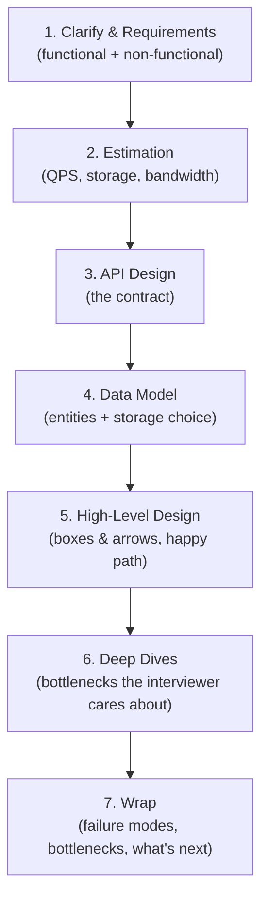
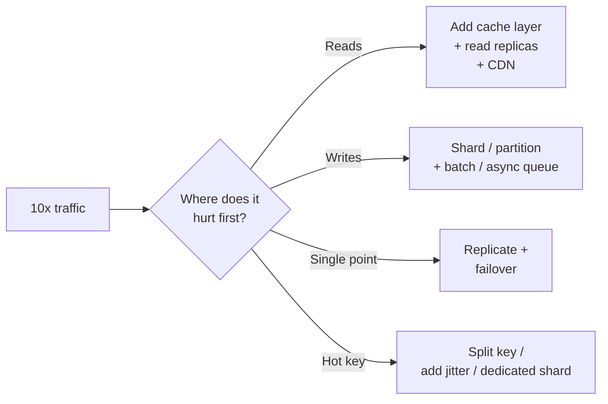

# Attacking the Interview

Goal: walk into any system design interview with a repeatable flow so you never freeze on "where do I start?" A full read takes about 15 minutes; re-read just the flow diagram and time budget before a call.

<!-- SECTION: table-of-contents -->

## Table of Contents

1. [Mental Model](#1-mental-model)
2. [What the Interview Actually Tests](#2-what-the-interview-actually-tests)
3. [The Repeatable Flow](#3-the-repeatable-flow)
4. [The Time Budget](#4-the-time-budget)
5. [Step-by-Step Script](#5-step-by-step-script)
6. [Handling "Now Scale It 10x"](#6-handling-now-scale-it-10x)
7. [Driving the Whiteboard](#7-driving-the-whiteboard)
8. [Final Mental Model](#8-final-mental-model)
9. [Review Checklist](#9-review-checklist)

<!-- SECTION: mental-model -->

## 1. Mental Model

> **A system design interview is a structured conversation, not a quiz.** The interviewer is testing whether you can take an ambiguous, open-ended problem, impose structure, make defensible trade-offs out loud, and go deep where it matters. The single biggest failure mode is jumping to a solution before you've defined the problem.

You are being hired to make decisions under uncertainty with incomplete information. So the meta-skill the interview measures is: **can you drive?** A strong candidate owns the whiteboard, narrates their reasoning, and pulls the interviewer along. A weak candidate waits to be told what to do next.

Mental shortcut: **scope before solve, breadth before depth, trade-offs before tech.**

<!-- SECTION: what-it-tests -->

## 2. What the Interview Actually Tests

| Signal | What the interviewer is checking |
|---|---|
| **Problem framing** | Do you clarify scope and call out assumptions, or build the wrong thing fast? |
| **Structured thinking** | Is there a clear flow, or do you bounce around randomly? |
| **Breadth** | Do you know the standard building blocks (LB, cache, queue, DB, CDN, blob store)? |
| **Depth** | When pushed on one component, can you go three levels down? |
| **Trade-offs** | Do you say *"X over Y because…"* or just name technologies? |
| **Communication** | Are you narrating, or designing silently and presenting a finished answer? |
| **Realism** | Do you know what actually breaks at scale (hot keys, fan-out, replication lag)? |

The first 5 minutes set the tone. If you nail scoping, the interviewer relaxes and the rest is collaborative. If you skip it, you spend the whole hour defending a design that solved the wrong problem.

<!-- SECTION: the-flow -->

## 3. The Repeatable Flow

This order is deliberate: each step feeds the next. Requirements decide what to estimate; estimates decide whether you need sharding/caching; the API defines the data model; the data model shapes the high-level design; the high-level design reveals the bottlenecks worth a deep dive.

**In practice:** this is the same flow used across well-known interview frameworks (Hello Interview's "delivery framework," Alex Xu's *System Design Interview* 4-step approach). Memorize it cold so the structure is automatic and your working memory is free for the actual design.

<!-- SECTION: time-budget -->

## 4. The Time Budget

A typical session is **~45 minutes** of design time (after intros). Spend it roughly like this:

| Phase | Time | Output on the board |
|---|---|---|
| Clarify & requirements | 5 min | Bulleted functional + non-functional reqs, explicit scope cuts |
| Estimation | 3-5 min | QPS (read/write), storage/yr, peak factor — only the numbers that change the design |
| API + data model | 5-7 min | Core endpoints, key entities + chosen store |
| High-level design | 10-15 min | Boxes & arrows: client → LB → service → cache/DB/queue → storage |
| Deep dives | 12-15 min | 2-3 components drilled to mechanism level |
| Wrap / failure modes | 3-5 min | Bottlenecks, single points of failure, "what I'd do next" |

> **Why a budget matters:** the most common way strong engineers fail is running out of time still drawing boxes, never reaching a deep dive. Depth is where senior/staff signal lives. Watch the clock and force yourself into a deep dive by the halfway mark even if the high-level design isn't perfect.

<!-- SECTION: script -->

## 5. Step-by-Step Script

### Step 1 — Clarify & Requirements (5 min)

Separate **functional** ("what it does") from **non-functional** ("how well it does it").

- **Functional:** the 3-5 core use cases. *"Users shorten a URL and get redirected; we track click counts. Do we need custom aliases? Expiry? Analytics dashboards?"*
- **Non-functional:** scale, latency, consistency, availability. *"Read-heavy? How read-heavy? Is a slightly stale click count OK (favor availability), or must it be exact (favor consistency)?"*
- **Explicitly cut scope:** *"I'll treat auth and abuse-prevention as out of scope unless you'd like me to cover them."* Naming what you're skipping is itself a senior signal.

### Step 2 — Estimation (3-5 min)

Only compute numbers that **change a decision**. See [Traffic Estimation](../caching-and-scale/traffic-estimation.md) for the full method.

- Reads/sec and writes/sec at peak (apply a peak factor of ~2-10x average).
- Storage per year (rows × size × time).
- Bandwidth if media is involved.

> **Why:** the estimate justifies your architecture. "100:1 read/write and 50K reads/sec means a single Postgres can't serve reads — so I'll add a cache and read replicas" is exactly the reasoning being tested. Numbers without a conclusion are wasted time.

### Step 3 — API Design (3-5 min)

Write the contract: a handful of endpoints with their inputs/outputs. This anchors everyone on the same nouns and verbs. Prefer REST unless the problem screams streaming (WebSockets) or flexible client-driven queries ([GraphQL](../messaging-and-apis/graphql.md)).

### Step 4 — Data Model (3-5 min)

List the core entities and their relationships, then **pick a store and justify it** (link the [Datastores cheat sheet](../key-technologies/datastores.md)). *"Strong relational structure with transactions → Postgres; massive write throughput with a known access key → DynamoDB/Cassandra."*

### Step 5 — High-Level Design (10-15 min)

Draw the happy path end to end: client → DNS/CDN → load balancer → application service(s) → cache → database, plus async paths (queue → workers) where work is slow. Keep it to boxes and arrows. Narrate the request lifecycle once, fully.

### Step 6 — Deep Dives (12-15 min)

This is where you earn the level. Pick the 1-3 components that are actually hard for *this* problem and drill in:

- Bitly → key generation collisions + read scaling.
- News feed → fan-out on write vs read + the celebrity problem.
- Ticketmaster → contention on a finite inventory.

Let the interviewer steer; they will often say "tell me more about X." If they don't, propose the deep dive yourself: *"The interesting bottleneck here is the feed fan-out — can I dig into that?"*

### Step 7 — Wrap (3-5 min)

Name the remaining weaknesses before the interviewer has to: single points of failure, what happens when the cache/DB/queue dies, monitoring, and what you'd build next with more time. Self-critique is a strength signal, not a weakness.

<!-- SECTION: scale-10x -->

## 6. Handling "Now Scale It 10x"

This is the most common pivot. Don't panic — walk the request path and find the new bottleneck:

The standard escalation ladder for **reads**: index → cache → read replicas → CDN (see [Scaling Reads](../patterns/scaling-reads.md)). For **writes**: batch → queue → shard → LSM-friendly store (see [Scaling Writes](../patterns/scaling-writes.md)). Say the ladder out loud and pick the rung the numbers demand.

> **Why this works:** "scale it 10x" is really "do you know where systems break?" Answering by walking the request path and naming the specific bottleneck (not just "add more servers") is the senior move.

<!-- SECTION: whiteboard -->

## 7. Driving the Whiteboard

- **Narrate constantly.** Silence reads as being stuck. Think out loud even while drawing.
- **State assumptions before acting.** *"I'll assume 100M DAU unless you'd correct me."*
- **Offer the trade-off, then pick.** *"Cache-aside vs write-through — I'll use cache-aside because reads dominate and we tolerate brief staleness."* Never just name a technology; name *why*.
- **Manage time visibly.** *"That's the high-level design; with ~15 min left I want to go deep on the feed fan-out."*
- **Treat pushback as a gift.** "What if Redis goes down?" is an invitation to show resilience thinking, not an accusation.

<!-- SECTION: final-mental-model -->

## 8. Final Mental Model

The flow is the product. If you reliably **scope → estimate → API → data → high-level → deep dive → wrap**, narrate your trade-offs, and watch the clock so you reach a real deep dive, you will pass interviews even on problems you've never seen. The content matters; the structure is what makes the content legible.

> **30-second version:** *"I always start by separating functional from non-functional requirements and doing a quick back-of-envelope estimate, because that justifies the architecture. Then API, data model, and a high-level happy path. I reserve the back half for a deep dive on the real bottleneck, and I close by naming failure modes myself."*

<!-- SECTION: review-checklist -->

## 9. Review Checklist

- [ ] Can you recite the 7-step flow without looking?
- [ ] Do you know the rough time budget for each phase, and that depth > breadth?
- [ ] Can you separate functional from non-functional requirements on the spot?
- [ ] Do you compute only the estimates that change a decision?
- [ ] Can you escalate reads (index → cache → replica → CDN) and writes (batch → queue → shard) from memory?
- [ ] Do you state trade-offs as *"X over Y because…"* rather than naming tech?
- [ ] Do you proactively name failure modes in the wrap-up?
