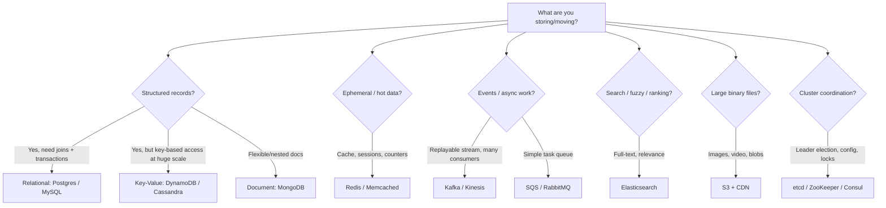

# Technology Selection Cheat Sheet

Goal: one place to refresh the "when do I pick what" decisions, so in an interview you can name a technology *and* justify it in one breath. This page is the overview + decision flow; each category links to a deeper page.

!!! tip "How to use this section"
    Interviewers don't want a brand name — they want the **reasoning**. Every pick below is phrased as *"X because [access pattern / scale / guarantee], not Y because [the thing that disqualifies it]."* That sentence shape is the point.

<!-- SECTION: table-of-contents -->

## Table of Contents

1. [Mental Model](#1-mental-model)
2. [The Decision Flow](#2-the-decision-flow)
3. [Master Selection Table](#3-master-selection-table)
4. [Category Deep Dives](#4-category-deep-dives)
5. [Interview Language](#5-interview-language)
6. [Review Checklist](#6-review-checklist)

<!-- SECTION: mental-model -->

## 1. Mental Model

> **Technology is downstream of access pattern.** Decide *how data is written and read* (by key? by range? full-text? append-only? transactional?), *how much* (QPS, size), and *what guarantee* you need (strong vs eventual consistency), and the right technology mostly falls out. Picking the tech first and bending the problem to fit it is the classic junior mistake.

Mental shortcut: **shape of access + scale + guarantee → technology.** Always say the shape out loud before the name.

<!-- SECTION: decision-flow -->

## 2. The Decision Flow

<!-- SECTION: master-table -->

## 3. Master Selection Table

| Category | Default | Strong alternative | Pick the alternative when… |
|---|---|---|---|
| **Relational DB** | PostgreSQL | MySQL; Spanner/CockroachDB | Need horizontal scale *with* strong consistency across regions → Spanner/Cockroach |
| **Key-value / wide-column** | DynamoDB (managed) | Cassandra (self-hosted) | Multi-region writes, no vendor lock-in, very write-heavy → Cassandra |
| **Document** | MongoDB | DynamoDB (single-table) | Nested, schema-flexible docs with secondary-index queries → Mongo |
| **Cache** | Redis | Memcached | Pure, simple, multi-threaded LRU cache with no persistence → Memcached |
| **Streaming log** | Kafka | Kinesis (managed); Pulsar | Want fully managed on AWS → Kinesis |
| **Task queue** | SQS (managed) | RabbitMQ | Complex routing, priorities, per-message ack semantics → RabbitMQ |
| **Search** | Elasticsearch | OpenSearch; Postgres FTS | Light full-text on existing relational data → Postgres FTS |
| **Object store** | Amazon S3 | GCS / Azure Blob | Match your cloud |
| **CDN** | CloudFront | Cloudflare / Akamai | Edge compute / DDoS focus → Cloudflare |
| **Coordination** | etcd | ZooKeeper; Consul | Service discovery + health + config together → Consul |
| **Time-series** | (Postgres + Timescale) | InfluxDB / Prometheus | High-cardinality metrics at scale → Prometheus/Influx |
| **OLAP / analytics** | (Postgres) | Snowflake / BigQuery / ClickHouse | Large-scale aggregations over columnar data → ClickHouse/BigQuery |

> **Why "default" matters:** in an interview, start from the boring default and *upgrade only when a requirement forces it*. "Postgres handles this until ~X; past that I'd move analytics to ClickHouse" shows judgment. Jumping straight to five exotic systems shows the opposite.

<!-- SECTION: category-deep-dives -->

## 4. Category Deep Dives

- **[Datastores](datastores.md)** — Postgres vs MySQL vs DynamoDB vs Cassandra vs MongoDB vs Spanner.
- **[Caching](caching.md)** — Redis vs Memcached, data structures, persistence, clustering.
- **[Messaging & Streaming](messaging-streaming.md)** — Kafka vs RabbitMQ vs SQS vs Kinesis.
- **[Search, Object Storage & CDN](search-storage-cdn.md)** — Elasticsearch, S3, CloudFront.
- **[Coordination](coordination.md)** — ZooKeeper vs etcd vs Consul.

<!-- SECTION: interview-language -->

## 5. Interview Language

- *"The access pattern is key-based lookups at very high write volume, so I'd use DynamoDB — a relational DB would bottleneck on a single primary."*
- *"I'll start with Postgres; it'll comfortably handle the stated load, and I'd only introduce a separate analytics store once aggregation queries start competing with the transactional workload."*
- *"Reads dominate 100:1, so the database choice matters less than the cache and replica strategy in front of it."*
- *"I need replay and multiple independent consumers, which is exactly Kafka's model — a plain queue would consume the message once and lose that."*

<!-- SECTION: review-checklist -->

## 6. Review Checklist

- [ ] Can you state the *access pattern* before naming any database?
- [ ] Do you know the default pick in each category and the one trigger that makes you upgrade?
- [ ] Can you explain Kafka (log) vs SQS (queue) in one sentence?
- [ ] Can you explain Redis vs Memcached in one sentence?
- [ ] Can you justify SQL vs NoSQL by guarantees and access shape, not popularity?
- [ ] Do you resist adding exotic systems until a requirement forces it?
