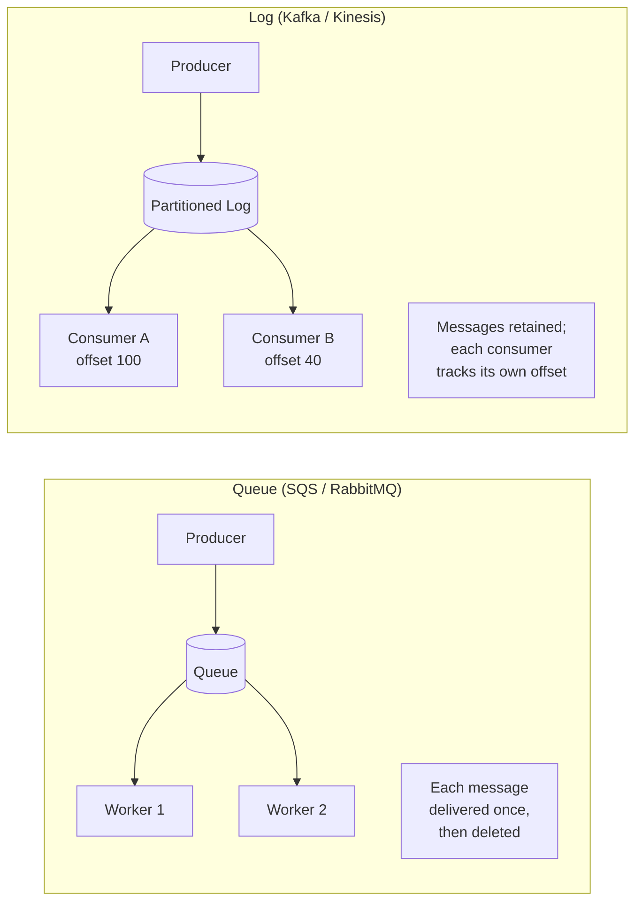

# Messaging & Streaming

Goal: choose between Kafka, RabbitMQ, SQS, and Kinesis and justify it by delivery model. A full read takes about 10 minutes. For the *patterns* (event sourcing, CQRS, delivery semantics, outbox), see [Event-Driven Architecture & Messaging](../messaging-and-apis/event-driven-and-messaging.md).

<!-- SECTION: table-of-contents -->

## Table of Contents

1. [Mental Model](#1-mental-model)
2. [Queue vs Log — the Core Distinction](#2-queue-vs-log-the-core-distinction)
3. [Selection Table](#3-selection-table)
4. [Kafka](#4-kafka)
5. [RabbitMQ](#5-rabbitmq)
6. [SQS](#6-sqs)
7. [Kinesis](#7-kinesis)
8. [Delivery Semantics](#8-delivery-semantics)
9. [Interview Language](#9-interview-language)
10. [Review Checklist](#10-review-checklist)

<!-- SECTION: mental-model -->

## 1. Mental Model

> **First decide queue vs log; the product follows.** A **queue** distributes work — each message is consumed once and then gone. A **log** is a durable, replayable, ordered record — many independent consumers read it at their own offset, and old data sticks around. These are different shapes, and picking the wrong one is the mistake interviewers catch.

Mental shortcut: **"distribute tasks to workers" → queue (SQS/RabbitMQ). "Stream of events many systems replay" → log (Kafka/Kinesis).**

<!-- SECTION: queue-vs-log -->

## 2. Queue vs Log — the Core Distinction

| | Queue | Log |
|---|---|---|
| **Consumption** | Once, then deleted | Many consumers, replayable |
| **Ordering** | Usually best-effort (FIFO option) | Strict per-partition |
| **Retention** | Until consumed (+ short buffer) | Time/size-based (days/forever) |
| **Use for** | Task distribution, work offloading | Event streaming, analytics, audit, CDC |

<!-- SECTION: selection-table -->

## 3. Selection Table

| Need | Pick | Because | In production |
|---|---|---|---|
| Replayable event stream, multiple consumers, high throughput, ordering per key | **Kafka** | The log model; horizontal partitions; durable retention | LinkedIn (origin), Uber, Netflix pipelines |
| Same, but fully managed on AWS | **Kinesis** | Kafka-like log, zero ops, AWS-native | AWS-heavy data pipelines |
| Simple, managed task queue, "just works" | **SQS** | Serverless, infinite scale, dead-letter queues | Async jobs across AWS apps |
| Complex routing, priorities, per-message ack, low latency | **RabbitMQ** | Flexible exchanges/bindings, mature broker | Microservice RPC, work routing |

<!-- SECTION: kafka -->

## 4. Kafka

A distributed, partitioned, replicated **commit log**. Producers append to topics; topics split into **partitions** (the unit of parallelism and ordering); consumers in a **consumer group** each own a subset of partitions.

- **Strengths:** very high throughput, durable retention + replay, ordering within a partition, decouples many consumers from one producer.
- **Trade-offs:** operationally heavy (brokers, ZooKeeper/KRaft, rebalancing); ordering is only *per partition*, so your partition key choice determines what's ordered.
- **Reach for it when:** you need an event backbone — multiple systems consuming the same stream, replay for reprocessing, or a CDC/analytics pipeline. *In production:* Kafka is the de-facto event-streaming standard.

<!-- SECTION: rabbitmq -->

## 5. RabbitMQ

A traditional **message broker** with flexible routing (exchanges → bindings → queues): direct, topic, fanout, headers.

- **Strengths:** rich routing, priorities, per-message acknowledgement, low latency, mature.
- **Trade-offs:** not built for long retention/replay; throughput lower than Kafka; can become a bottleneck if used as a firehose.
- **Reach for it when:** you need smart routing between services or RPC-style work distribution with fine-grained ack control — not a replayable event log.

<!-- SECTION: sqs -->

## 6. SQS

Amazon's fully-managed queue. Standard (at-least-once, best-effort order) or FIFO (exactly-once-ish, ordered, lower throughput).

- **Strengths:** zero ops, effectively infinite scale, built-in dead-letter queues and **visibility timeout** (a consumed message is hidden until acked or it reappears for retry).
- **Trade-offs:** queue semantics only (no replay, no multiple independent consumer groups like Kafka); polling-based.
- **Reach for it when:** you want a simple, reliable task queue on AWS and don't need a replayable log. *In production:* the default async-job backbone for AWS shops.

<!-- SECTION: kinesis -->

## 7. Kinesis

AWS's managed streaming log — Kafka-like (shards = partitions, consumers track position) without running brokers.

- **Reach for it when:** you want Kafka's log model but fully managed and AWS-integrated, and your throughput fits the shard model. Choose **Kafka** instead for max throughput, ecosystem, or multi-cloud.

<!-- SECTION: delivery-semantics -->

## 8. Delivery Semantics

Almost all of these default to **at-least-once** delivery: a message may be delivered more than once (a consumer crash before ack causes redelivery). The interview-critical consequence:

> **At-least-once means consumers must be idempotent.** Processing the same message twice must not double-charge, double-send, or double-count. Use idempotency keys / dedup tables. *Exactly-once* is expensive and usually approximated (Kafka transactions, SQS FIFO dedup) — assume at-least-once unless told otherwise. See [Multi-step Processes](../patterns/multi-step-processes.md).

<!-- SECTION: interview-language -->

## 9. Interview Language

- *"I need replay and several independent consumers off the same stream — that's Kafka's log model, not a queue."*
- *"This is just offloading slow work to background workers, so SQS is the simplest reliable choice — no need for Kafka's operational weight."*
- *"Delivery is at-least-once, so I'll make the consumer idempotent with a dedup key rather than assuming exactly-once."*
- *"Ordering matters per user, so I'll partition by user_id — Kafka only guarantees order within a partition."*

<!-- SECTION: review-checklist -->

## 10. Review Checklist

- [ ] Can you state queue vs log in one sentence?
- [ ] Kafka vs SQS — when does each win?
- [ ] Why does Kafka only guarantee ordering per partition, and how does the partition key matter?
- [ ] What is a visibility timeout and a dead-letter queue?
- [ ] Why must consumers be idempotent under at-least-once delivery?
- [ ] When is RabbitMQ the right call over Kafka?
