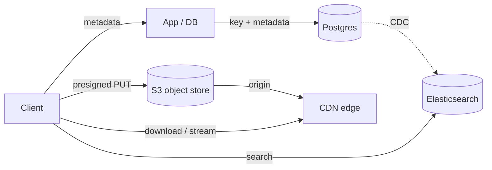

# Search, Object Storage & CDN

Goal: know when to add Elasticsearch, how object storage + CDN fit together, and how to justify each. A full read takes about 9 minutes. For *blob mechanics* (presigned URLs, multipart, resumable), see [Blob Storage](../databases/blob-storage.md) and [Handling Large Blobs](../patterns/large-blobs.md).

<!-- SECTION: table-of-contents -->

## Table of Contents

1. [Mental Model](#1-mental-model)
2. [Search: Elasticsearch](#2-search-elasticsearch)
3. [When NOT to Add Elasticsearch](#3-when-not-to-add-elasticsearch)
4. [Object Storage: S3](#4-object-storage-s3)
5. [CDN: CloudFront & Friends](#5-cdn-cloudfront-friends)
6. [How They Compose](#6-how-they-compose)
7. [Interview Language](#7-interview-language)
8. [Review Checklist](#8-review-checklist)

<!-- SECTION: mental-model -->

## 1. Mental Model

> **These three are "specialized stores you add beside the database," not replacements for it.** Elasticsearch is a search index you keep in sync with the source of truth. S3 is where bytes live while the DB holds the pointer. A CDN is a read-through cache for those bytes at the edge. In all three, the database stays the system of record.

Mental shortcut: **DB owns truth; ES makes it searchable; S3 holds the big bytes; CDN serves them close to users.**

<!-- SECTION: elasticsearch -->

## 2. Search: Elasticsearch

A distributed search and analytics engine built on an **inverted index** (term → list of documents). It powers full-text search, fuzzy matching, relevance ranking, autocomplete, and log/metric analytics.

- **Strengths:** fast full-text and fuzzy search, relevance scoring, aggregations, typeahead, faceting.
- **Trade-offs:** it's a secondary index, not a source of truth — you must **sync** it from your primary store (dual-write is fragile; prefer CDC/event stream → ES). Near-real-time, not strongly consistent. Operationally non-trivial.
- **Reach for it when:** users search across text, need ranked results, or you're building autocomplete/log analytics. *In production:* GitHub code search, Wikipedia search, the ELK logging stack (Elasticsearch + Logstash + Kibana). OpenSearch is the AWS-managed fork.

> **Why keep it separate:** search has a totally different access pattern (inverted index, ranking) than transactional reads. Bolting it onto Postgres works at small scale (Postgres FTS), but at scale you want a purpose-built engine fed asynchronously.

<!-- SECTION: when-not -->

## 3. When NOT to Add Elasticsearch

A common over-engineering trap. Don't add ES when:

- You only need exact-match or prefix lookups → a DB index or Redis is simpler.
- The dataset is small and search is light → **Postgres full-text search** (`tsvector`/`GIN`) avoids a whole new system to sync and operate.
- *Saying this out loud is a senior signal:* "Postgres FTS covers this until we need relevance ranking and fuzzy matching at scale — then I'd introduce Elasticsearch fed by CDC."

<!-- SECTION: s3 -->

## 4. Object Storage: S3

Amazon S3 (and GCS, Azure Blob) store arbitrary binary objects with near-infinite capacity and high durability (11 nines).

- **Use it for:** images, video, audio, documents, backups, ML model weights, data-lake files — anything large or binary.
- **Pattern:** the **database stores metadata + the object key**; bytes live in S3. Clients upload/download **directly** via **presigned URLs**, so large payloads never pass through your app servers (see [Large Blobs](../patterns/large-blobs.md)).
- **Tiers:** Standard → Infrequent Access → Glacier for cost vs retrieval-time trade-offs.
- **Strengths:** cheap, durable, scalable, lifecycle policies (auto-expire/transition). *In production:* the default backing store for media, and origin for CDNs.

<!-- SECTION: cdn -->

## 5. CDN: CloudFront & Friends

A Content Delivery Network caches content at **edge locations** near users, cutting latency and offloading origin.

- **Pull CDN:** fetches from origin on first miss, then caches (TTL-based). Easy; great for the long tail. The default.
- **Push CDN:** you upload content to the CDN ahead of time. Good for large, predictable, infrequently-changing files.
- **Serves:** static assets (JS/CSS/images), video segments, and cacheable API responses. Supports cache invalidation and signed URLs for private content.
- *In production:* CloudFront (AWS), Cloudflare (also edge compute + DDoS), Akamai (enterprise/video). Netflix runs its own CDN (Open Connect) embedded in ISPs.

<!-- SECTION: compose -->

## 6. How They Compose

A media-heavy product typically uses all three plus the DB:

The database is the source of truth (pointers + metadata); S3 holds bytes; the CDN serves those bytes fast; Elasticsearch makes the metadata searchable, synced asynchronously.

<!-- SECTION: interview-language -->

## 7. Interview Language

- *"Search is full-text with relevance ranking, so Elasticsearch fed from the DB via change-data-capture — not a dual write, which drifts."*
- *"Files are large and binary, so they go in S3 with the DB holding only the key; clients upload directly via presigned URLs to keep bytes off our servers."*
- *"Reads are global and the content is cacheable, so I'd put a CDN in front — pull-based, with TTLs and signed URLs for private objects."*
- *"At this scale Postgres full-text search is enough; I'd only add Elasticsearch when ranking and fuzzy search become first-class."*

<!-- SECTION: review-checklist -->

## 8. Review Checklist

- [ ] Can you explain why Elasticsearch is a secondary index, not a source of truth?
- [ ] Do you know to sync ES via CDC/events rather than dual-write?
- [ ] Can you state when Postgres FTS suffices instead of ES?
- [ ] Do you know the DB-pointer + S3-bytes split, and presigned URLs?
- [ ] Pull vs push CDN — when does each apply?
- [ ] Can you draw how DB + S3 + CDN + ES compose in a media app?
