# Event-Driven Architecture & Messaging

Two tightly-linked topics: **Part 1** covers event-driven architecture (events vs commands, event sourcing, CQRS, stream processing, delivery semantics) — the *patterns*. **Part 2** covers the messaging systems that carry those events (queues vs logs, Kafka, consumer semantics, when to use which) — the *infrastructure*.

!!! note "Related"
    Delivery guarantees and ordering are the canonical home of this page — [Concurrency](concurrency.md), [HTTP/Realtime](../foundations/http-and-realtime.md), and [Stability Patterns](../resilience/stability-patterns.md) reference them. Idempotency & retry policy live in [Stability Patterns](../resilience/stability-patterns.md).

## Contents

**Part 1 — Event-Driven Architecture**

- Events, commands, messages; domain events
- Event sourcing; CQRS; stream processing
- Brokers, ESB, actor model, integration patterns
- Delivery guarantees, ordering, idempotency; when to use EDA

**Part 2 — Messaging Systems & Kafka**

- What counts as a messaging system; what Kafka is (and is not)
- Queue vs log; consumer semantics; delivery & ordering
- Feature/ops comparison; when to use which; red flags

---

## Part 1 — Event-Driven Architecture

### Event-Driven Architecture Mental Model

Event-driven architecture (EDA) means services react to facts that already happened instead of calling each other synchronously for every step.

The practical EDA question is:

> What happened, who needs to know, and how do we keep side effects safe when delivery is not perfect?

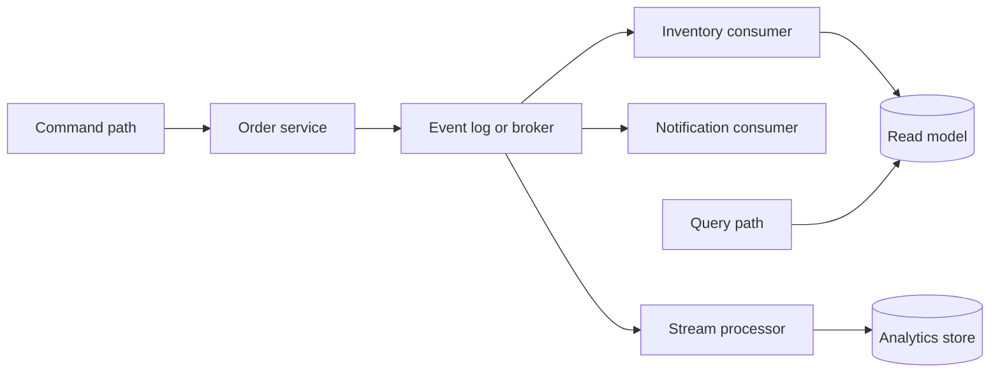

EDA usually optimizes:

| Goal | Meaning | Example |
|---|---|---|
| Loose coupling | Producers do not need every consumer online | `OrderPlaced` triggers shipping, billing, and email independently |
| Scalability | Consumers scale separately from producers | Add more notification workers without changing order API |
| Responsiveness | Accept work now, finish later | API returns after writing event; fulfillment runs async |
| Auditability | History of changes is explicit | Event log shows who changed order status and when |
| Extensibility | New behavior can subscribe to existing events | Fraud service listens to `PaymentCaptured` without API changes |

The tradeoff is distributed complexity. Once work becomes asynchronous, you must design for duplicates, delays, partial failures, ordering, schema evolution, and observability.

Mental shortcut: **EDA turns coordination into published facts plus safe consumers.**

<!-- SECTION: events-commands-messages - DONE -->

### Events, Commands, and Messages

These three words are often mixed up. In interviews, name the intent of each message type.

| Type | Meaning | Tense / direction | Example |
|---|---|---|---|
| Event | A fact that already happened | Past tense, broadcast-friendly | `OrderPlaced`, `PaymentFailed` |
| Command | A request for one handler to do something | Imperative, point-to-point | `PlaceOrder`, `ChargeCard` |
| Message | Generic envelope moving through a channel | Depends on payload | Queue item, bus message, stream record |

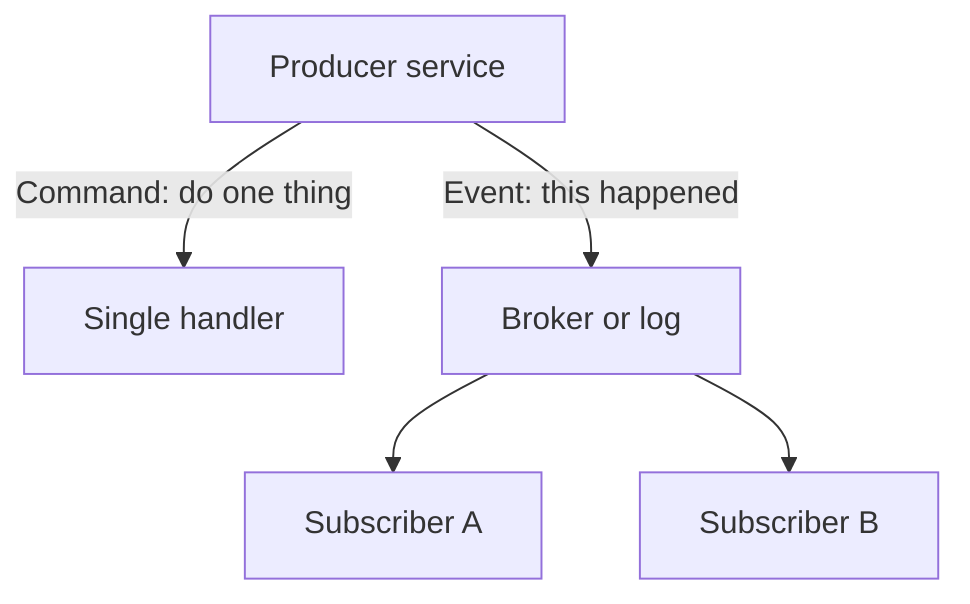

#### Events vs Commands

| Question | Event | Command |
|---|---|---|
| Can many consumers react? | Usually yes | Usually one intended handler |
| Does sender know all receivers? | No | Often yes |
| Is failure the sender's problem? | Not for every subscriber | Yes, if command cannot be handled |
| Good naming | `InvoicePaid` | `PayInvoice` |

#### Message Envelope

A message usually carries more than the payload:

| Field | Why it matters |
|---|---|
| Message ID | Deduplication and tracing |
| Correlation ID | Tie related commands and events across services |
| Causation ID | Show which event caused this event |
| Type / schema version | Safe evolution over time |
| Timestamp | Ordering, replay, and SLA monitoring |
| Partition key | Per-entity ordering in streams |

Mental shortcut: **commands ask; events announce; messages are the transport wrapper.**

<!-- SECTION: domain-events - DONE -->

### Domain Events

A domain event records something meaningful in the business domain. It should use the language of the business, not infrastructure jargon.

Good examples:

- `OrderPlaced`
- `SeatReserved`
- `SubscriptionRenewed`
- `InventoryReserved`

Weak examples:

- `DatabaseUpdated`
- `KafkaMessageReceived`
- `HandlerFinished`

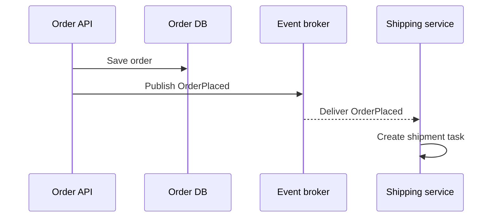

#### Domain Event Design Rules

| Rule | Reason |
|---|---|
| Name events in past tense | Events describe facts |
| Keep payload focused | Consumers should not need the entire aggregate |
| Include identifiers, not full graphs | `orderId`, `customerId`, `totalAmount` |
| Version schemas carefully | Old consumers may still be running |
| Publish after durable state change | Avoid announcing facts that were not committed |

#### Outbox Pattern

A common problem: the database commit succeeds, but the broker publish fails, or the opposite happens.

The outbox pattern writes the event to an outbox table in the same database transaction as the business write. A separate relay process publishes outbox rows to the broker.

```text
BEGIN TRANSACTION
  INSERT order
  INSERT outbox_event
COMMIT
Relay worker reads outbox and publishes to broker
```

Mental shortcut: **domain events are business facts, and they should not be published unless the fact is durable.**

<!-- SECTION: event-sourcing - DONE -->

### Event Sourcing

Event sourcing stores state as an append-only sequence of events instead of overwriting the latest row.

Current state is derived by replaying events:

```text
OrderCreated
ItemAdded
ItemAdded
OrderSubmitted
```

The aggregate's current state is the result of applying those events in order.

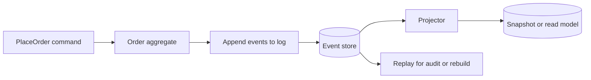

#### Benefits and Costs

| Benefit | Cost |
|---|---|
| Full audit history | More storage and operational complexity |
| Rebuild state by replay | Replay time grows without snapshots |
| Temporal queries | Schema evolution must be planned |
| Natural fit with EDA | Projections can lag behind writes |
| Debugging and analytics | Duplicate or out-of-order events must be handled |

#### Snapshots

Snapshots store the aggregate state at a point in time so replay does not start from event 1 every time.

| Approach | When to use |
|---|---|
| No snapshot | Small aggregates or early prototypes |
| Periodic snapshot | Large event histories |
| Cached projection | Fast reads through CQRS read models |

#### Event Sourcing vs Event-Driven

| Idea | Event sourcing | Event-driven architecture |
|---|---|---|
| Primary goal | Persist state as events | Communicate asynchronously between services |
| Storage | Event log is source of truth | Often database plus broker |
| Scope | Usually one bounded context / aggregate | Often cross-service |

You can use EDA without event sourcing, and event sourcing often publishes integration events after commits.

Mental shortcut: **event sourcing is how one aggregate remembers its history; EDA is how services react to each other.**

<!-- SECTION: cqrs - DONE -->

### CQRS Pattern

Command Query Responsibility Segregation separates writes from reads.

| Path | Responsibility | Optimized for |
|---|---|---|
| Command side | Validate business rules and change state | Correctness and invariants |
| Query side | Serve read-optimized models | Latency and flexible queries |

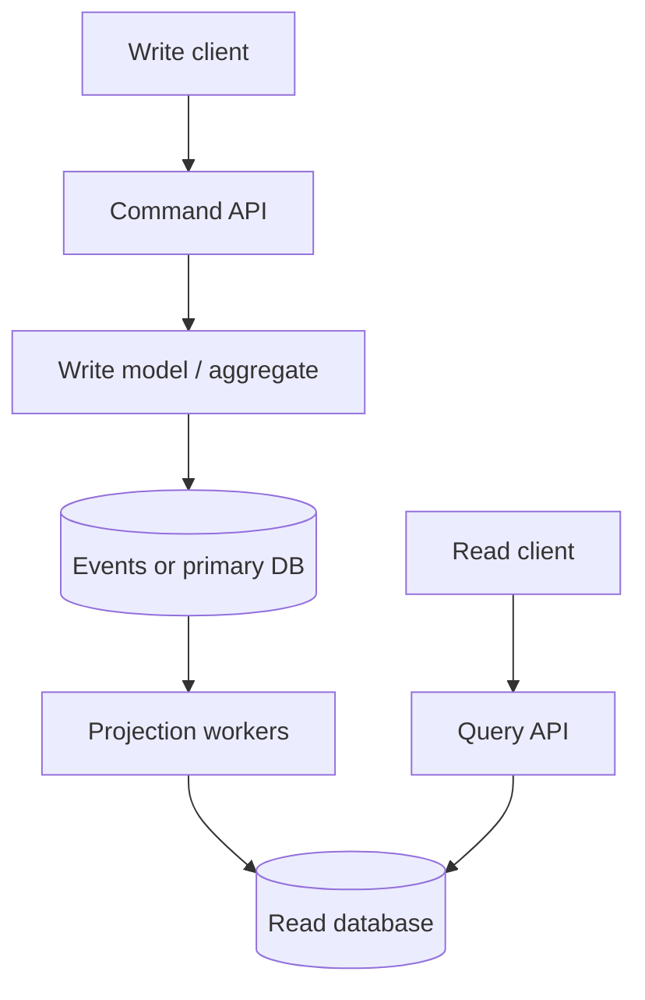

#### Why CQRS Helps in EDA

| Problem | CQRS response |
|---|---|
| Write schema is normalized | Read schema can be denormalized |
| Complex joins slow reads | Build purpose-built views |
| Many consumers need different shapes | Multiple projections from same events |
| Reporting competes with OLTP | Separate read stores |

#### CQRS Levels

| Level | Description | Interview note |
|---|---|---|
| Simple separation | Different methods or services for read and write | Common and practical |
| Separate models | Different tables or documents for reads | Useful when query patterns differ |
| Separate databases | Write DB plus one or more read DBs | Adds eventual consistency |
| Full event sourcing plus CQRS | Writes append events; reads are projections | Powerful but operationally heavy |

#### Consistency Caveat

After a command succeeds, a read model may be stale for milliseconds or seconds. The UI should tolerate eventual consistency or show a pending state.

Mental shortcut: **CQRS means optimize writes and reads separately, then accept projection lag.**

<!-- SECTION: stream-processing - DONE -->

### Event Stream Processing

Stream processing continuously reads events from a log and computes transformations, aggregations, joins, or alerts.

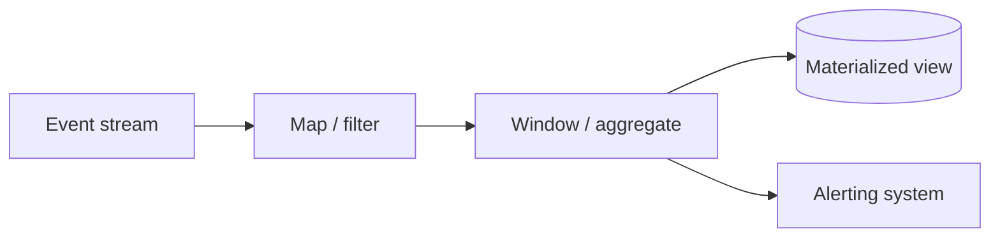

Common use cases:

| Use case | Example |
|---|---|
| Real-time analytics | Count signups per minute |
| Fraud detection | Flag unusual payment velocity |
| Metrics and monitoring | Error rate over 5-minute windows |
| Enrichment | Join clickstream with user profile stream |
| State tracking | Maintain per-user session state |

#### Stream vs Batch

| Aspect | Stream processing | Batch processing |
|---|---|---|
| Latency | Seconds or less | Minutes to hours |
| Input | Unbounded event flow | Bounded dataset |
| Failure recovery | Offsets, checkpoints, state stores | Job rerun on partition |
| Examples | Flink, Kafka Streams, Spark Structured Streaming | Spark batch, warehouse ETL |

#### Key Concepts

| Concept | Meaning |
|---|---|
| Partition | Shard of the stream for parallel processing |
| Key | Events with same key often need ordered processing |
| Window | Time or count boundary for aggregation |
| Watermark | Estimate of how late events may arrive |
| State store | Durable operator state for joins and aggregates |
| Checkpoint | Restart position after failure |

#### Processing Guarantees

Stream systems often claim at-least-once processing. Exactly-once end-to-end usually depends on:

- Idempotent sinks
- Transactional writes to external systems
- Deduplication keys

Mental shortcut: **stream processing is moving computation to the event flow instead of polling databases.**

<!-- SECTION: messaging-brokers - DONE -->

### Messaging and Message Brokers

A message broker decouples producers and consumers. It buffers messages, routes them, and applies delivery semantics.

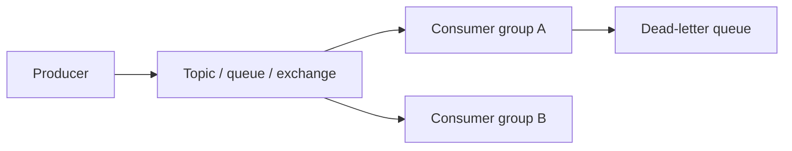

#### Queue vs Log / Stream

| Model | Behavior | Good fit |
|---|---|---|
| Queue | Message often removed after ack | Task distribution, job workers |
| Pub/sub topic | Many subscribers see copies | Notifications, fan-out |
| Log / stream | Durable ordered append-only log | Replay, multiple consumer groups, audit |

| System style | Examples |
|---|---|
| Traditional broker | RabbitMQ, ActiveMQ, Amazon SQS |
| Distributed log | Apache Kafka, Amazon Kinesis, Pulsar |

#### Messaging vs Event Streaming

| Question | Message queue mindset | Event log mindset |
|---|---|---|
| Primary unit | Message / task | Event / record |
| Consumer progress | Ack and delete or hide | Offset in partition |
| Replay | Usually limited | First-class |
| History | Often transient | Retained by policy |
| Multiple independent consumers | Possible but varies | Consumer groups read same log differently |

#### Common Broker Features

| Feature | Why it matters |
|---|---|
| Acknowledgement | Consumer confirms successful processing |
| Visibility timeout | Unacked message becomes available again |
| Dead-letter queue | Isolate poison messages |
| Retry with backoff | Handle transient downstream failures |
| Routing keys / headers | Send subset of messages to specific consumers |
| Partitioning | Scale and preserve order per key |

Mental shortcut: **queues distribute work; logs retain history and enable replay.**

<!-- SECTION: enterprise-service-bus - DONE -->

### Enterprise Service Bus

An Enterprise Service Bus (ESB) is a centralized integration layer that routes, transforms, mediates, and often orchestrates messages between many enterprise applications.

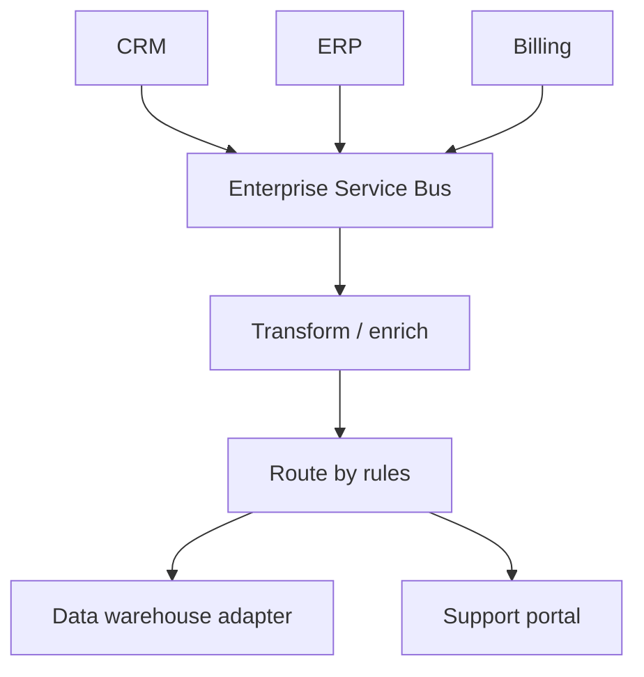

#### What an ESB Typically Provides

| Capability | Example |
|---|---|
| Protocol bridging | HTTP to JMS to FTP |
| Message transformation | XML to JSON, canonical model mapping |
| Routing | Content-based routing |
| Mediation | Enrich message with reference data |
| Orchestration | Multi-step business process across systems |

#### ESB vs Modern EDA

| ESB style | Modern event-driven style |
|---|---|
| Central hub with heavy middleware | Smaller services plus shared broker |
| Smart pipe, thinner endpoints in theory | Smart endpoints, dumb pipe preferred |
| Often synchronous-feeling orchestration | Choreography through events is common |
| Strong vendor and governance model | Cloud-native logs and schema registries |

In interviews, ESB thinking is still useful for legacy integration, but greenfield designs usually prefer:

- Domain-owned services
- Well-defined event contracts
- Schema registry or contract tests
- Choreography over centralized orchestration when possible

Mental shortcut: **ESB centralizes integration logic; modern EDA pushes ownership to services and shared contracts.**

<!-- SECTION: actor-model - DONE -->

### Actor Model

The actor model treats each actor as a lightweight unit that:

- Owns private state
- Processes one message at a time
- Communicates only by sending messages
- Can create more actors

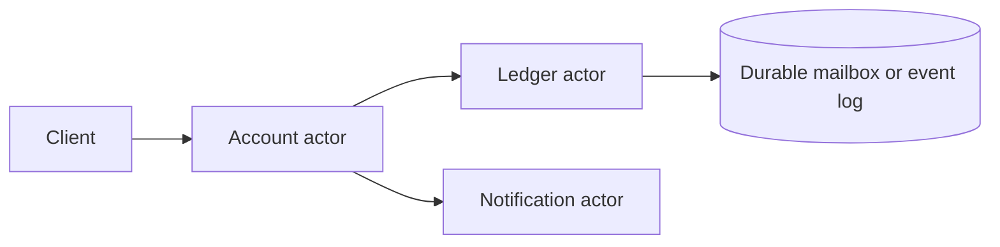

#### Why Actors Relate to EDA

| Idea | Actor interpretation |
|---|---|
| No shared mutable memory | State is isolated per actor |
| Message passing | Commands and events become actor messages |
| Failure isolation | Supervisors can restart failed actors |
| Location transparency | Actor addresses hide deployment details |

#### Actor Systems

| Platform | Notes |
|---|---|
| Akka | JVM, common in Scala/Java systems |
| Orleans | .NET virtual actors with activation model |
| Erlang/OTP | Classic actor runtime, strong supervision trees |

#### Actors vs Queue Workers

| Aspect | Actor | Queue worker |
|---|---|---|
| State | Often in-memory per actor | Often stateless, state in DB |
| Ordering | Per actor mailbox is serial | Depends on queue partitioning |
| Scaling | Many actors across nodes | Many consumers on shared queue |
| Durability | Needs persistence layer for recovery | Queue or log provides durability |

Actors are strong when many independent entities need serialized updates, such as one actor per user session, game room, or bank account.

Mental shortcut: **actors are event-driven at the object level: one owner, one mailbox, no shared locks.**

<!-- SECTION: enterprise-integration - DONE -->

### Enterprise Integration Architecture

Enterprise Integration Patterns (EIP) describe how systems connect in large organizations. Many EDA ideas map directly to these patterns.

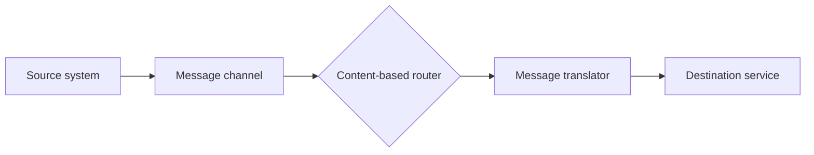

#### High-Value Patterns for Interviews

| Pattern | Meaning | EDA example |
|---|---|---|
| Message channel | Reliable path between components | Kafka topic, SQS queue |
| Publish-subscribe | One publisher, many subscribers | `OrderPlaced` fan-out |
| Message router | Send messages by rule | Route by country or product type |
| Message translator | Convert formats | Legacy XML to JSON event |
| Aggregator | Combine multiple messages into one | Wait for all shipment parts |
| Splitter | Break one message into many | Bulk import to per-row events |
| Dead-letter channel | Handle poison messages | DLQ after max retries |
| Claim check | Store large payload elsewhere, send reference | S3 object ID in event body |
| Saga / process manager | Coordinate multi-step business process | Order workflow across payment and inventory |

#### Choreography vs Orchestration

| Style | How it works | Tradeoff |
|---|---|---|
| Choreography | Services react to events without a central controller | Loose coupling, harder global visibility |
| Orchestration | Central coordinator tells each step what to do next | Easier process view, central failure point |

Example saga for `PlaceOrder`:

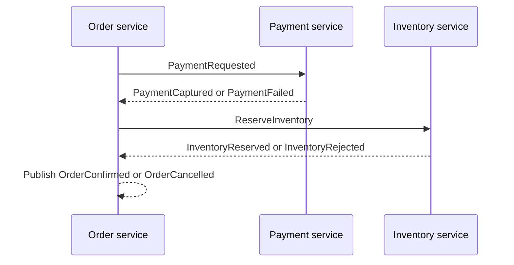

Compensating events undo prior steps when a later step fails:

- `PaymentCaptured` then `InventoryRejected` may trigger `PaymentRefunded`

Mental shortcut: **integration patterns name the pipes and routers; sagas name the multi-step business workflow.**

<!-- SECTION: delivery-ordering-idempotency - DONE -->

### Delivery Guarantees, Ordering, and Idempotency

Distributed messaging is rarely perfect. Design for the guarantee you actually have, not the one you wish you had.

#### Delivery Guarantees

| Guarantee | Meaning | Typical reality |
|---|---|---|
| At-most-once | Message may be lost, not duplicated | Fire-and-forget |
| At-least-once | Message arrives one or more times | Most common with retries |
| Exactly-once | Appears once end-to-end | Hard; usually "effectively once" via idempotency |

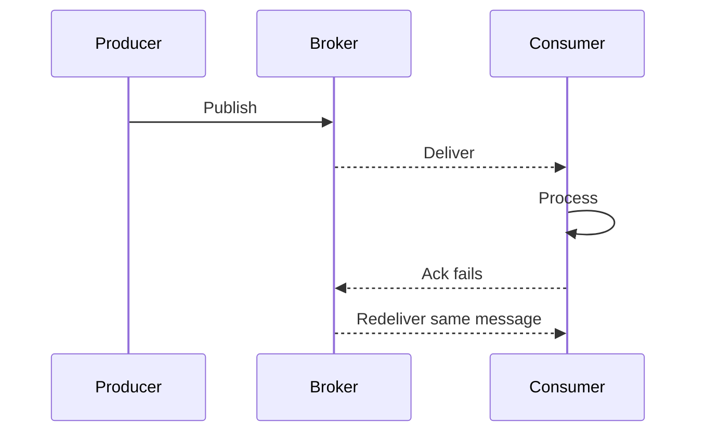

#### Ordering

| Scope | Rule of thumb |
|---|---|
| Global order | Expensive and usually unnecessary |
| Per-partition order | Common in Kafka-style logs |
| Per-entity order | Usually what business needs, such as per `orderId` |
| No order | Independent tasks can process in parallel |

If ordering matters, use the same partition key for related events.

#### Idempotency

An operation is idempotent if running it more than once has the same effect as running it once.

| Technique | How it helps |
|---|---|
| Idempotency key | Client sends `Idempotency-Key`; server stores result |
| Dedup table | Store processed message IDs |
| Natural keys | `orderId + eventType` uniqueness constraint |
| Upserts | `INSERT ... ON CONFLICT` or equivalent |
| Version checks | Ignore older events with stale version numbers |

#### Safe Consumer Template

```text
1. Receive message
2. Check dedup store / idempotency key
3. If already processed, ack and exit
4. Process business logic in transaction
5. Mark message processed
6. Ack broker
```

Mental shortcut: **assume at-least-once delivery and make consumers safe to run twice.**

<!-- SECTION: when-to-use - DONE -->

### When to Use Event-Driven Architecture

EDA is a tool, not a default architecture.

#### Good Fits

| Situation | Why EDA helps |
|---|---|
| Many downstream reactions to one action | Fan-out without coupling producers |
| Peak traffic smoothing | Queue or log absorbs bursts |
| Cross-team integration | Stable event contracts reduce API churn |
| Audit and analytics needs | Events create a natural trail |
| Long-running workflows | Async steps with retries and compensation |
| Read/write shape mismatch | CQRS projections from same event stream |

#### Poor Fits

| Situation | Why EDA hurts |
|---|---|
| Simple CRUD with one database | Sync API plus DB is simpler |
| Strong immediate read-your-writes everywhere | Projections add lag |
| Small team, low scale | Operational overhead may not pay off |
| Tight latency on every step | Extra hops and consumer lag |
| Hard-to-define event contracts | Poor schemas create more coupling than REST |

#### Decision Questions

| Question | If yes, EDA is more attractive |
|---|---|
| Can downstream work happen asynchronously? | Yes |
| Will multiple services need the same fact? | Yes |
| Is replay or audit valuable? | Yes |
| Can users tolerate brief read lag? | Yes |
| Are you ready to operate brokers, DLQs, and lag alerts? | Yes |

Mental shortcut: **use EDA when facts fan out, time decouples, and you can operate async failure modes.**

<!-- SECTION: warnings - DONE -->

### Design Warnings

Event-driven bugs often appear only under retries, deploys, or traffic spikes.

| Warning | What can go wrong | Safer design habit |
|---|---|---|
| Dual writes | DB saved, event not published | Outbox pattern or transactional messaging |
| Chatty synchronous chains disguised as EDA | Still coupled and slow | Publish once, consume many |
| God events | One huge payload breaks consumers | Small facts plus claim check for large data |
| Missing schema versioning | Deploy breaks old consumers | Versioned contracts and compatibility tests |
| Hidden ordering assumptions | Newer state overwritten by older event | Sequence numbers or version checks |
| No DLQ | Poison message blocks queue | Dead-letter and replay tooling |
| Infinite retries | Bad message never exits | Max attempts plus alert |
| Unclear ownership | Nobody owns contract or consumer lag | Service owns its published events |
| "Exactly once" hand-waving | Duplicate charges or emails | Idempotency keys and dedup |
| Global ordering demand | System becomes single-lane | Order only per business key |

#### Red Flags in Interviews

Be careful when you hear:

- "Kafka solves consistency" without discussing consumers and projections.
- "Events instead of APIs" for every query path.
- "Microservices so we need Kafka" without a fan-out or async reason.
- "Saga" without naming compensating actions.
- "Event sourcing everywhere" when CRUD would suffice.

#### Useful Invariants

| System | Invariant |
|---|---|
| Payments | A payment intent should not be captured twice |
| Inventory | Reserved stock cannot be oversold |
| Notifications | A user should not receive duplicate emails for one event |
| Order status | Status transitions should follow allowed state machine |
| Projections | Read model should converge after all events processed |

Mental shortcut: **EDA safety starts with delivery assumptions, idempotency, and explicit invariants.**

<!-- SECTION: interview-language - DONE -->

### Interview Language

For event-driven designs, use terms like:

```text
domain event
integration event
pub/sub
event log
consumer group
projection
eventual consistency
outbox pattern
idempotency key
dead-letter queue
partition key
saga
compensating event
choreography
orchestration
schema evolution
at-least-once delivery
```

Strong opening move:

> I would treat the write path and read path separately. The order service commits state, publishes `OrderPlaced` through an outbox, and downstream services build their own read models or side effects asynchronously.

EDA answer for fan-out:

> When an order is placed, I do not want the order API to call shipping, billing, analytics, and email synchronously. I would emit one domain event to a durable log so each consumer can scale independently and retry safely with idempotent handlers.

Event sourcing answer:

> For this bounded context, I would store state as an append-only event history so we can audit changes and rebuild projections. I would add snapshots because replay cost will grow over time.

CQRS answer:

> Writes go through the command model that enforces invariants. Reads come from a denormalized projection optimized for the UI, accepting brief lag after a write.

Saga answer:

> This is a multi-step workflow across payment and inventory. I would use a saga with compensating events: if inventory reservation fails after payment capture, publish `PaymentRefundRequested` rather than leaving inconsistent state.

<!-- SECTION: final-model - DONE -->

### Final Mental Model

Event-driven architecture means services coordinate by reacting to durable facts.

Use this map:

```text
Command:
Ask one handler to change state.

Domain event:
Announce a business fact after a successful change.

Broker or log:
Decouple producers and consumers.

Projection / CQRS:
Build read models from events.

Stream processing:
Continuously transform event flows.

Delivery reality:
Assume at-least-once; design idempotent consumers.

Workflow:
Use saga patterns when multiple services must agree over time.
```

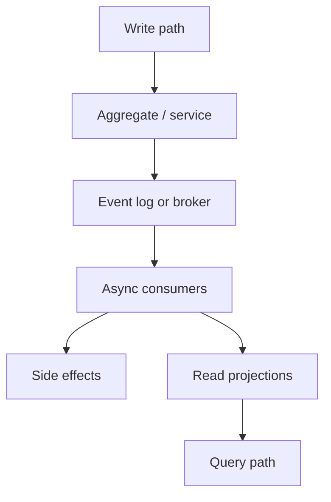

For system design interviews, the strongest answer usually sounds like:

```text
The business fact is X.
It is published after Y commit.
Consumers Z1 and Z2 react independently.
Ordering is required per K.
Retries are safe because of idempotency rule I.
Read models may lag briefly by design.
```

Final shortcut: **EDA is publish facts once, react many times safely, and separate writes from reads when needed.**

<!-- SECTION: checklist - DONE -->

### 30-Minute Review Checklist

Use this checklist to test whether you can explain the topic:

- Can you explain EDA as reacting to facts instead of synchronous chaining?
- Can you distinguish events, commands, and messages with examples?
- Can you define a domain event and name good payload fields?
- Can you explain the outbox pattern and why dual writes fail?
- Can you describe event sourcing as append-only history plus replay?
- Can you explain when snapshots or projections are needed?
- Can you describe CQRS and acceptable read lag?
- Can you contrast queue-based messaging with log-based streaming?
- Can you name broker features like acks, DLQ, and partitioning?
- Can you explain what an ESB does and how it differs from modern EDA?
- Can you describe the actor model as isolated state plus a mailbox?
- Can you name at least three enterprise integration patterns?
- Can you compare choreography and orchestration in a saga?
- Can you explain at-least-once delivery and idempotent consumers?
- Can you describe when per-entity ordering is enough?
- Can you name when EDA is a good fit and when it is overkill?
- Can you state invariants for payments, inventory, or notifications in an event flow?

If you remember only one thing:

```text
Event-driven design is not "add Kafka."
It is deciding which facts to publish, who reacts asynchronously,
and how the system stays correct when messages are duplicated or delayed.
```

---

## Part 2 — Messaging Systems & Kafka

### Messaging Mental Model

In interviews, "Kafka vs messaging" usually means:

> **Queue-based brokers** (distribute work, delete on success) vs **log-based streaming** (retain history, consumers track offsets).

Kafka is not the opposite of messaging. It is messaging infrastructure built as a **distributed, append-only log**.

The practical question is:

> Do I need a **task queue** (process this once, then forget) or a **durable event log** (many readers, replay, retained history)?

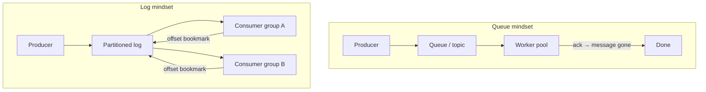

| Mindset | Primary question | Typical outcome |
|---|---|---|
| Queue | Who processes this job next? | Work is consumed and removed |
| Log | What happened, and who needs to read it? | Records stay; readers advance independently |

Mental shortcut: **queues distribute work; logs retain history and enable replay.**

<!-- SECTION: traditional-messaging - DONE -->

### What Counts as a Messaging System

"Messaging system" in interviews usually means a **message broker** that decouples producers and consumers with buffering, routing, and delivery semantics.

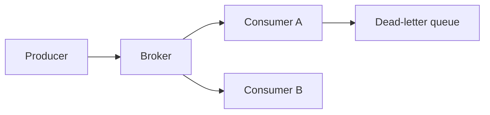

#### Common Broker Styles

| Style | Behavior | Examples |
|---|---|---|
| Point-to-point queue | One consumer typically owns a message until ack | Amazon SQS, IBM MQ queues |
| Pub/sub topic | Many subscribers receive copies | RabbitMQ fanout, SNS topics |
| Enterprise bus | Central routing, transform, orchestration | Legacy ESB, JMS hubs |

#### Well-Known Traditional Brokers

| System | Strengths | Interview note |
|---|---|---|
| RabbitMQ | Flexible routing (exchanges, bindings), mature AMQP | Great for task queues and complex routing |
| Amazon SQS | Managed, simple, scales with ops burden low | Visibility timeout + DLQ are core concepts |
| ActiveMQ / JMS | Enterprise Java integration | Often legacy; know ack and durable subscriptions |
| Azure Service Bus | Queues and topics with sessions | Sessions give ordered processing per session ID |

#### What Queue-Based Brokers Optimize For

| Goal | Meaning | Example |
|---|---|---|
| Work distribution | Split load across workers | Image resize workers pull from a queue |
| Decoupling | Producer does not wait for slow consumer | API enqueues email job, returns fast |
| Backpressure | Buffer spikes without dropping requests | Order spikes buffered in SQS |
| Simple semantics | Message processed → removed | Payroll job runs once per message |

The tradeoff is limited history. After ack (or TTL expiry), the message is usually gone. Replay is not a first-class feature.

Mental shortcut: **traditional messaging = buffer and route tasks; success often means delete.**

<!-- SECTION: kafka-model - DONE -->

### What Kafka Is (and Is Not)

Apache Kafka is a **distributed commit log** used for high-throughput event streaming. Similar systems: Amazon Kinesis, Apache Pulsar, Redpanda.

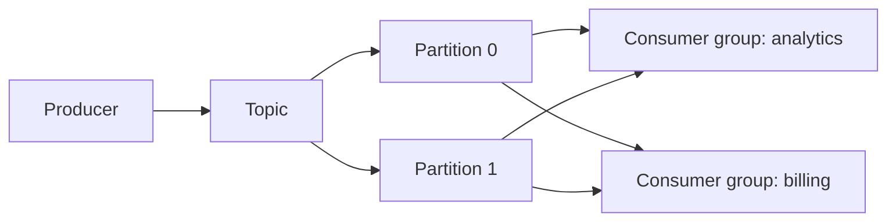

#### Core Kafka Concepts

| Concept | Meaning |
|---|---|
| Topic | Named stream of records |
| Partition | Ordered, append-only shard of a topic; unit of parallelism |
| Offset | Position of a consumer within a partition (bookmark) |
| Consumer group | Set of consumers that cooperatively read a topic; each partition assigned to one member |
| Retention | Records kept by time or size policy, not deleted on read |
| Replication | Copies of partitions on multiple brokers for durability |

#### What Kafka Is

| Property | Why it matters in interviews |
|---|---|
| Durable append-only log | Events survive after consumers read them |
| Replay | Rewind offsets and reprocess |
| Multiple consumer groups | Same data, different independent readers |
| High throughput | Designed for millions of events/sec at scale |
| Per-partition ordering | Events with same key land in same partition |

#### What Kafka Is Not

| Misconception | Reality |
|---|---|
| A simple job queue | Records are retained; "done" means offset committed, not deleted |
| Guaranteed global ordering | Ordering is per partition, not across entire topic |
| Exactly-once everywhere | Requires idempotent producers, transactions, and careful consumer design |
| Free of operational cost | Cluster sizing, rebalance, retention, and monitoring matter |

Mental shortcut: **Kafka is a retained log with offsets, not a delete-on-success queue.**

<!-- SECTION: core-comparison - DONE -->

### Queue vs Log — Core Comparison

This is the table most interviews expect you to know cold.

| Question | Queue / traditional broker | Log / Kafka-style stream |
|---|---|---|
| Primary unit | Message / task | Event / record |
| After successful consume | Often deleted or hidden | Stays until retention expires |
| Consumer progress | Ack (and delete or visibility hide) | Offset per partition |
| Replay | Usually limited or absent | First-class |
| History | Often transient (TTL) | Retained by policy |
| Multiple independent consumers | Possible; behavior varies by broker | Consumer groups read same log differently |
| Competing workers | Split messages across pool | Partitions split work within one group |
| Ordering | Per queue (varies) | Per partition (strong within partition) |
| Good fit | Jobs, RPC-style async, simple tasks | Fan-out, audit, stream processing, reprocessing |

#### Three Models Side by Side

| Model | Behavior | Good fit |
|---|---|---|
| Queue | Message often removed after ack | Task distribution, job workers |
| Pub/sub topic | Many subscribers see copies | Notifications, fan-out |
| Log / stream | Durable ordered append-only log | Replay, multiple consumer groups, audit |

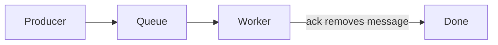

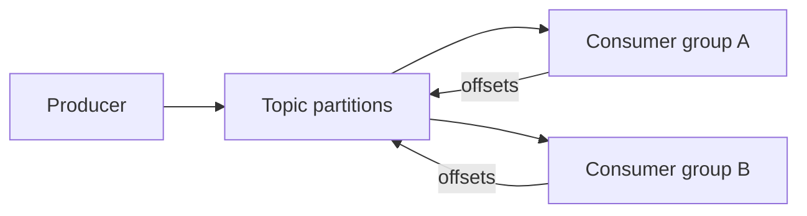

#### Messaging vs Event Streaming Mindset

| Dimension | Message queue mindset | Event log mindset |
|---|---|---|
| Sender intent | "Please process this" | "This fact happened" |
| Consumer contract | Process and acknowledge | Read at your offset, commit when ready |
| Adding a new consumer | May need new queue or copy setup | New consumer group reads from chosen offset |
| Failure recovery | Message becomes visible again | Re-read from last committed offset |

Mental shortcut: **if the business needs history and independent readers, think log; if it needs one-time work, think queue.**

<!-- SECTION: consumer-semantics - DONE -->

### Consumer Semantics

How consumers track progress is the biggest behavioral difference.

#### Queue-Based: Ack and Visibility

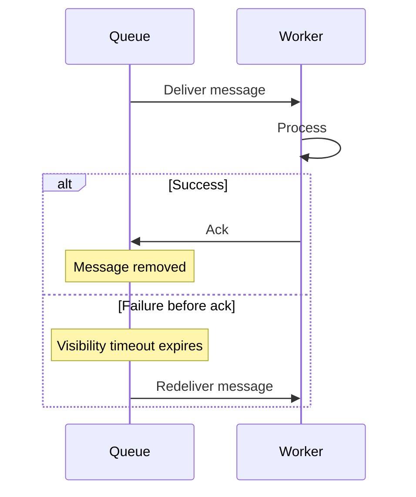

| Mechanism | Meaning |
|---|---|
| Ack | Consumer confirms success; broker removes or hides message |
| Visibility timeout | Unacked message becomes available again (SQS pattern) |
| Competing consumers | Multiple workers pull from same queue; each message goes to one worker |
| Prefetch / in-flight limits | Control how many unacked messages a consumer holds |

**Pitfall:** Long processing without extending visibility → duplicate delivery to another worker.

#### Log-Based: Offsets and Consumer Groups

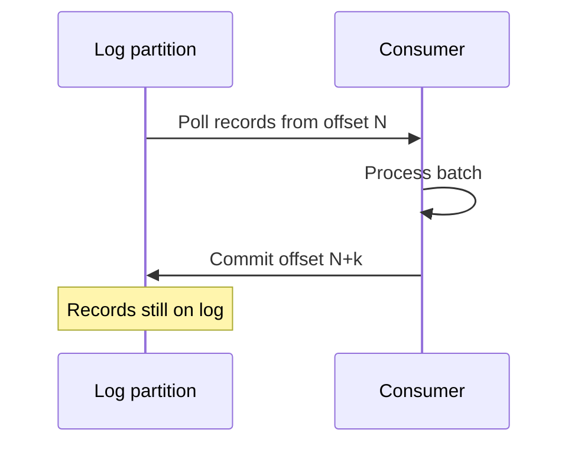

| Mechanism | Meaning |
|---|---|
| Poll | Consumer reads batch of records from assigned partitions |
| Commit offset | Bookmark "I have processed up to here" |
| Consumer group | Partitions divided among members; rebalance on join/leave |
| Replay | Reset offset to earlier position and re-read |

**Pitfall:** Commit offset before side effects finish → message "lost" on crash. Commit after success → possible duplicate on crash (design for at-least-once).

#### Competing Consumers Compared

| Scenario | Queue | Kafka |
|---|---|---|
| Scale workers | Add more consumers to same queue | Add consumers to same group (up to partition count) |
| Max parallelism | Queue depth and consumer count | Number of partitions in topic |
| Same message to many apps | Usually duplicate via fanout or multiple queues | Multiple consumer groups on same topic |
| Reprocess history | Hard | Reset offsets or new group from `earliest` |

Mental shortcut: **queues ack away work; Kafka bookmarks position in a retained log.**

<!-- SECTION: delivery-ordering - DONE -->

### Delivery Guarantees and Ordering

Both styles face duplicates and ordering limits. Name the guarantee you actually have.

#### Delivery Semantics

| Guarantee | Meaning | Typical reality |
|---|---|---|
| At-most-once | May lose messages, no duplicates | Fire-and-forget publish or commit-before-process |
| At-least-once | No loss, duplicates possible | Most common default with retries |
| Exactly-once | Process once end-to-end | Hard; needs idempotency + transactions + dedup |

| System | Default leaning | Interview line |
|---|---|---|
| SQS / RabbitMQ | At-least-once with ack + retry | "I assume duplicates and make handlers idempotent." |
| Kafka | At-least-once with offset commit | "I commit offsets after side effects and use idempotency keys." |
| Kafka transactions | Exactly-once within Kafka ecosystem | "Only when full pipeline supports it; otherwise at-least-once + dedup." |

#### Ordering

| Scope | Queue brokers | Kafka |
|---|---|---|
| Global order | Sometimes single queue = FIFO | Not across whole topic |
| Per entity | FIFO queue or message group ID | Partition by key (`orderId`) |
| Parallelism vs order | One lane = strict order, no scale | More partitions = more parallelism, order only per key |

```text
Rule: If two events for the same Order must be processed in order,
route them to the same partition (Kafka) or same message group (SQS FIFO).
```

#### Idempotency (Required for Both)

| Technique | Example |
|---|---|
| Idempotency key | `paymentId` stored before charging |
| Dedup table | Processed message IDs with TTL |
| Natural idempotency | `SET status = SHIPPED WHERE id = X AND status = PACKED` |
| Upsert by business key | Warehouse projection keyed by `sku` |

Mental shortcut: **assume at-least-once everywhere; ordering is per key, not global.**

<!-- SECTION: feature-ops - DONE -->

### Feature and Ops Comparison

| Feature | Traditional broker | Kafka |
|---|---|---|
| Routing | Rich (exchanges, headers, bindings) | Topic + key → partition |
| Message size | Often smaller default limits | Larger records; use claim check for blobs |
| Retention | Short / until consumed | Policy-based (days, compacted topics) |
| Dead-letter queue | Built-in or common pattern | Custom DLQ topic + skip/retry tooling |
| Delayed delivery | Native in some brokers | Less common; use scheduling layer |
| Request-reply | Temp reply queues common | Possible but not primary pattern |
| Schema management | Ad hoc JSON/XML | Schema Registry common in mature shops |
| Throughput | Strong for task workloads | Built for very high event volume |
| Ops complexity | Lower for managed queues (SQS) | Cluster ops, rebalance, retention tuning |

#### Managed vs Self-Hosted (Interview Context)

| Choice | When to mention |
|---|---|
| SQS / SNS / Service Bus | Fast to adopt, AWS/Azure-native, less ops |
| RabbitMQ self-hosted | Full routing control, team owns uptime |
| MSK / Confluent Cloud | Kafka without running ZooKeeper/KRaft yourself |
| Self-hosted Kafka | Maximum control, highest operational burden |

Mental shortcut: **brokers trade routing flexibility for log retention and replay; Kafka trades ops cost for scale and history.**

<!-- SECTION: when-to-use - DONE -->

### When to Use Which

#### Decision Table

| Requirement | Prefer queue (SQS, RabbitMQ) | Prefer log (Kafka, Kinesis) |
|---|---|---|
| One-time task processing | Yes | Rarely |
| Message should disappear after success | Yes | No (retention-based) |
| Multiple services need same event history | Awkward | Yes |
| Replay / reprocess from past | Limited | Yes |
| Audit trail of all facts | Weak | Yes |
| High fan-out (many independent consumers) | Possible with fanout | Yes (consumer groups) |
| Stream analytics (aggregations, windows) | Poor fit | Yes |
| Complex routing rules | Yes | Simpler model |
| Small team, minimal ops | Managed queue | Managed Kafka |

#### Hybrid Pattern (Strong Interview Answer)

Many production systems use both:

```mermaid
flowchart LR
    OrderSvc["Order service"] --> Kafka["Kafka: domain events"]
    Kafka --> Analytics["Analytics consumer"]
    Kafka --> Billing["Billing consumer"]
    OrderSvc --> SQS["SQS: resize receipt job"]
    SQS --> Worker["Image worker"]
```

| Path | Tool | Why |
|---|---|---|
| `OrderPlaced`, `PaymentCaptured` | Kafka | Fan-out, replay, multiple teams consume |
| Generate PDF, send email batch job | SQS / RabbitMQ | Task done once, no long retention needed |
| Poison message isolation | DLQ on both | Queue DLQ native; Kafka → dead-letter topic |

#### Example Scenarios

| Scenario | Recommendation | One-line reason |
|---|---|---|
| Background email after signup | SQS / queue | Fire-and-forget task, no replay needed |
| Order events to inventory, billing, search | Kafka | One fact, many consumers, retained history |
| Payment webhook retry | Queue with DLQ | Process once, visibility timeout for retries |
| Fraud model retrain on last 90 days | Kafka | Replay from retained log |
| RPC between two services | HTTP/gRPC first | Messaging adds async complexity without need |

Mental shortcut: **Kafka for facts that fan out and may be replayed; queues for jobs that should complete once and disappear.**

<!-- SECTION: warnings - DONE -->

### Design Warnings and Red Flags

| Warning | What can go wrong | Safer habit |
|---|---|---|
| Kafka without fan-out or replay need | Unnecessary ops and complexity | Start with a queue; upgrade when retention/replay required |
| Queue for event sourcing | History lost; cannot rebuild projections | Use a log with retention |
| Commit offset before side effect | Lost processing on crash | Commit after success; accept duplicates |
| Global ordering demand | Single partition bottleneck | Order per business key only |
| Replay without idempotency | Double charges, duplicate emails | Idempotency keys before replay |
| Too few partitions | Cannot scale consumers | Size partitions for peak parallelism |
| Too many partitions | Rebalance overhead, file handles | Plan partition count with growth |
| Treating Kafka like SQS | Confusion about delete vs offset | Explain log retention explicitly |
| No DLQ / poison handling | Stuck consumer lag | Dead-letter topic or queue |
| Dual writes | DB saved, event not published | Outbox pattern |

#### Red Flags in Interviews

Be careful when you hear (or say):

- "We need Kafka" without naming fan-out, replay, or retention.
- "Kafka gives exactly-once" without consumer and downstream design.
- "Messages are processed once" on Kafka without offset and retry discussion.
- "Ordering across the whole system" without partition or key strategy.
- "Replace all APIs with events" when queries need synchronous read paths.

#### Useful Invariants (Either Broker)

| Domain | Invariant |
|---|---|
| Payments | Do not capture the same payment twice |
| Inventory | Do not oversell reserved stock |
| Notifications | One business event → one user-visible email |
| Offsets / acks | Progress marker reflects completed side effects |

Mental shortcut: **the broker does not make you correct; delivery semantics and idempotency do.**

<!-- SECTION: interview-language - DONE -->

### Interview Language

Use terms like:

```text
message broker
point-to-point queue
pub/sub
topic
partition
offset
consumer group
ack
visibility timeout
dead-letter queue
retention
replay
at-least-once
idempotency key
partition key
fan-out
claim check
outbox pattern
compacted topic
```

#### Strong Opening Moves

**Clarify the question:**

> When you say messaging vs Kafka, I would separate queue-based brokers that delete or hide messages after ack from log-based platforms like Kafka that retain records and let each consumer group track its own offset.

**Task queue design:**

> For background jobs like image resizing, I would use a queue such as SQS or RabbitMQ. Workers compete for messages, ack on success, and failed work becomes visible again or moves to a DLQ. I do not need long retention or multiple independent readers of the same history.

**Event backbone design:**

> For order lifecycle facts, I would publish to Kafka. Inventory, billing, and analytics each use their own consumer group on the same topic. If billing deploys a bug, we can reset offsets and replay with idempotent handlers.

**Hybrid design:**

> I would use Kafka for domain events that fan out and may be replayed, and a queue for imperative tasks that should run once and disappear. They solve different decoupling problems.

**Ordering answer:**

> Strict ordering only applies per business key. I would partition by `orderId` so all events for one order stay ordered, while the topic still scales across many orders.

**Delivery guarantee answer:**

> I assume at-least-once delivery. Producers may retry, consumers may crash before commit, so handlers use idempotency keys and stores check version or state before applying side effects.

<!-- SECTION: final-model - DONE -->

### Final Mental Model

```text
Messaging (classic):
  Producer → broker queue/topic → consumer acks → message gone.

Kafka (log):
  Producer → append to partition log → consumer groups read at offsets → records retained.

Choose queue when:
  Work distribution, one-time processing, simple ops.

Choose Kafka when:
  Fan-out, replay, audit history, stream processing, many independent readers.

Both require:
  At-least-once thinking, idempotent consumers, per-key ordering when needed.
```

```mermaid
flowchart TB
    subgraph chooseQueue ["Choose queue"]
        Q1["Job / task"]
        Q2["Delete on success"]
        Q3["Competing workers"]
    end
    subgraph chooseKafka ["Choose Kafka"]
        K1["Domain fact / event"]
        K2["Retain and replay"]
        K3["Multiple consumer groups"]
    end
    Need{"What do you need?"}
    Need -->|"process once"| chooseQueue
    Need -->|"history + fan-out"| chooseKafka
```

For system design interviews, the strongest answer usually sounds like:

```text
The workload is [task | fact].
I need [one consumer | many independent consumers].
I need [no history | replay/audit].
Ordering is required per [key].
Duplicates are safe because [idempotency rule].
Therefore I pick [SQS/RabbitMQ | Kafka] for this path.
```

Final shortcut: **Kafka is not "better messaging" — it is a retained log. Queues are not "worse" — they are optimized for work distribution.**

<!-- SECTION: checklist - DONE -->

### 30-Minute Review Checklist

Use this checklist to test whether you can explain the topic:

- Can you state that Kafka is messaging infrastructure, but log-based rather than queue-based?
- Can you name three traditional brokers and what each is good for?
- Can you define topic, partition, offset, and consumer group?
- Can you contrast ack/delete with offset commit on a retained log?
- Can you draw or describe competing consumers on a queue vs partitions in a consumer group?
- Can you explain why replay is natural in Kafka and limited in most queues?
- Can you describe at-least-once delivery and why idempotency is required for both?
- Can you explain per-partition (or per-key) ordering vs global ordering?
- Can you give a scenario where a queue is the right choice?
- Can you give a scenario where Kafka is the right choice?
- Can you describe a hybrid architecture using both?
- Can you name two design warnings (offset commit timing, replay without dedup)?
- Can you list three interview red flags about choosing Kafka?
- Can you deliver a 30-second "strong opening move" for a fan-out event design?

If you remember only one thing:

```text
Queues distribute work and forget.
Logs retain facts and let many readers catch up at their own pace.
Pick based on whether the business needs history and replay, not hype.
```
