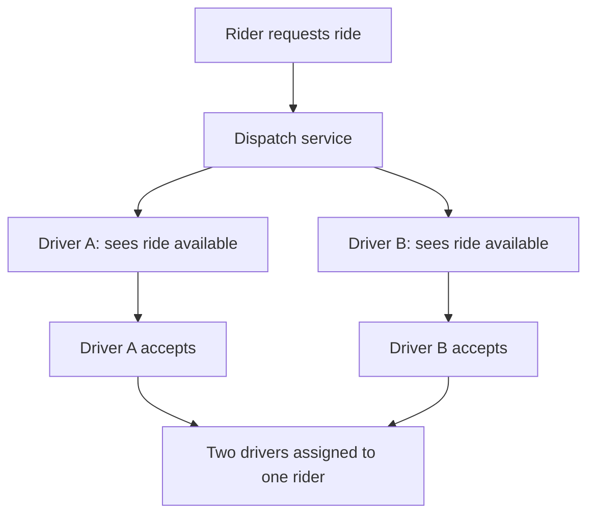
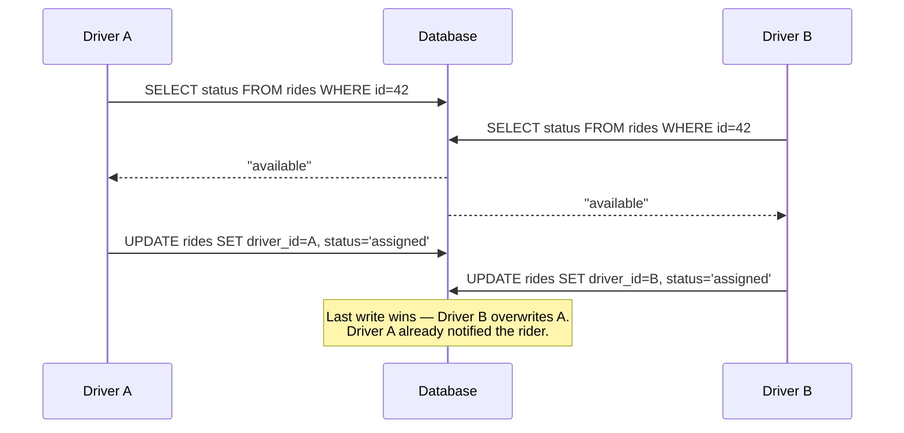
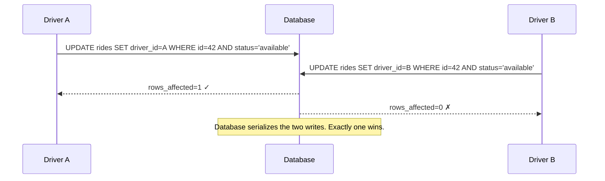
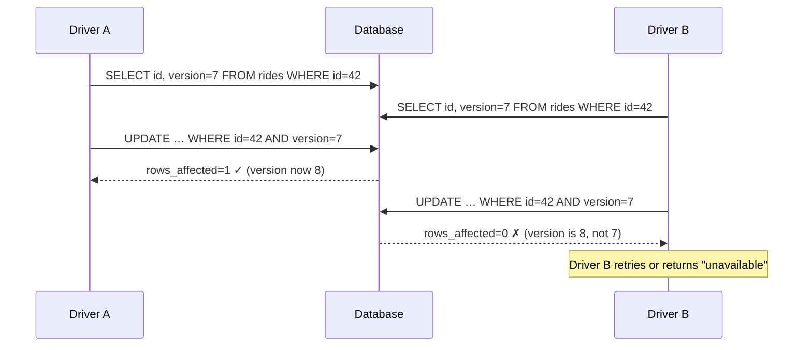
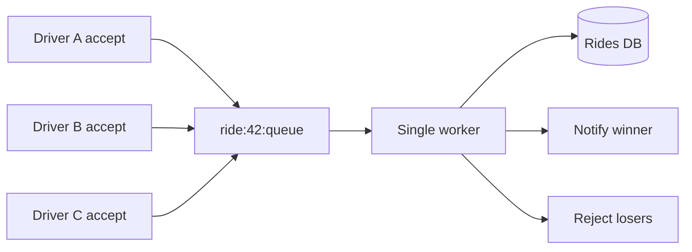
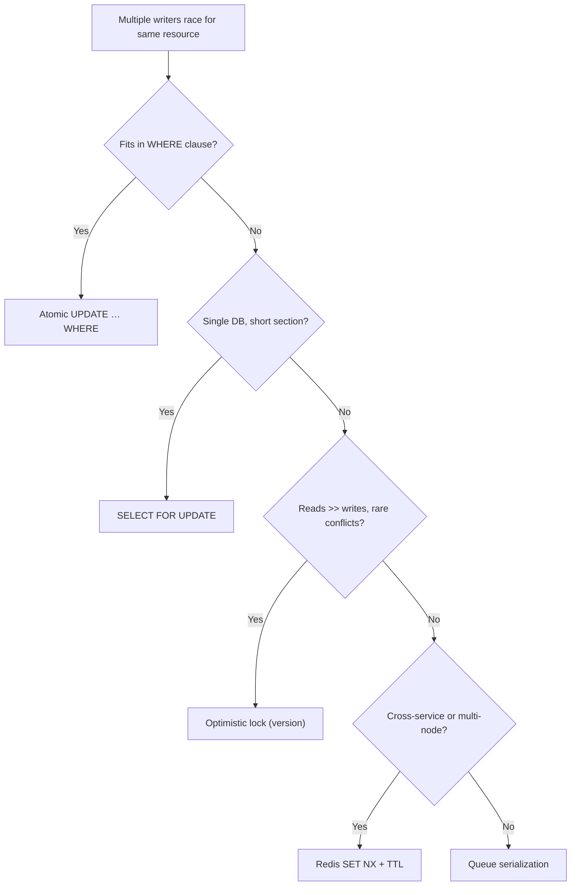

# Dealing with Contention

Goal: recognize contention in a system design interview and choose the right coordination strategy — from a single atomic SQL update to a distributed lock — based on contention level, consistency requirements, and scale. A focused pass on sections 1, 2, and 9–11 takes about 15 minutes; a full read is roughly 35–40 minutes.

<!-- SECTION: table-of-contents -->

## Table of Contents

1. [Contention Mental Model](#1-contention-mental-model)
2. [The Broken Baseline: Read-Check-Write](#2-the-broken-baseline-read-check-write)
3. [Atomic Database Operations](#3-atomic-database-operations)
4. [Pessimistic Locking (SELECT FOR UPDATE)](#4-pessimistic-locking-select-for-update)
5. [Optimistic Locking (Version Field / CAS)](#5-optimistic-locking-version-field-cas)
6. [Distributed Locks (Redis SET NX)](#6-distributed-locks-redis-set-nx)
7. [Queue-Based Serialization](#7-queue-based-serialization)
8. [How Techniques Compare](#8-how-techniques-compare)
9. [System Design Examples](#9-system-design-examples)
10. [Design Warnings](#10-design-warnings)
11. [Interview Language](#11-interview-language)
12. [Final Mental Model](#12-final-mental-model)
13. [Review Checklist](#13-review-checklist)

<!-- SECTION: mental-model -->

## 1. Contention Mental Model

Contention answers one question:

> When multiple processes race to modify the same resource, how do we guarantee exactly one wins — without corrupt state, double-writes, or lost updates?

Use a ride-share platform as the running example throughout this guide:



Without proper coordination, two drivers accept the same ride request simultaneously. One driver makes a pointless trip; the rider gets two phones ringing. The business suffers a support ticket and a wasted driver.

Contention design is about:

| Problem | Pattern family | Interview phrase |
|---|---|---|
| Two writes race | Atomic operation | "One SQL statement, no race window" |
| Multi-step critical section | Pessimistic lock | "Lock the row before reading" |
| Reads are frequent, conflicts are rare | Optimistic lock | "Read freely, validate before write" |
| Coordination spans services or nodes | Distributed lock | "Redis SET NX as a gate" |
| Very high contention or strict ordering | Queue serialization | "Serialize all writes through a queue" |

Mental shortcut: **contention is a gap between read and write — every technique shrinks or eliminates that gap.**

<!-- SECTION: broken-baseline -->

## 2. The Broken Baseline: Read-Check-Write

### What it is

The natural naive pattern: read the current state, check if the operation is allowed, then write.

```python
def accept_ride(driver_id, ride_id):
    ride = db.query("SELECT * FROM rides WHERE id = ?", ride_id)
    if ride.status == "available":          # check
        db.execute("UPDATE rides SET driver_id = ?, status = 'assigned'
                    WHERE id = ?", driver_id, ride_id)  # write
        return "accepted"
    return "unavailable"
```

### Why it breaks

The gap between the `SELECT` and the `UPDATE` is a **race window**. Two processes can both pass the check before either write lands.



**Result:** ride assigned to Driver B, but Driver A was already told "accepted." Both set off toward the pickup.

This pattern is never safe for shared mutable state under concurrent load.

<!-- SECTION: atomic-ops -->

## 3. Atomic Database Operations

### Why we need it

The simplest fix: collapse the read, check, and write into **one SQL statement**. The database executes it atomically — no race window.

### The technical version

```sql
-- Accept ride only if it is still available. Affects 0 rows if already taken.
UPDATE rides
SET    driver_id = :driver_id,
       status    = 'assigned'
WHERE  id        = :ride_id
  AND  status    = 'available';
```

Check the affected row count in your application:
- `rows_affected == 1` → you won
- `rows_affected == 0` → someone else got there first; return "unavailable"



Redis equivalent for a counter:

```
DECR inventory:item:99        # atomic, returns new value
# if result >= 0: success. if result < 0: INCR back and return "sold out"
```

### When to use

- Single-row counters (inventory, seat counts, like counts)
- Simple state transitions (`available → assigned`, `pending → active`)
- Any case where the condition fits in a `WHERE` clause

### Limits

Only handles one row and one condition. If your critical section spans multiple rows, multiple tables, or requires reading intermediate values before deciding what to write, you need a lock.

<!-- SECTION: pessimistic-locking -->

## 4. Pessimistic Locking (SELECT FOR UPDATE)

### Why we need it

Some operations read a row, compute something from it, then write back. An atomic `UPDATE … WHERE` isn't enough when the new value depends on a calculation done in application code.

Example: pricing a ride surge requires reading current active driver count, computing a multiplier, then writing the fare — a multi-step read-compute-write that can't collapse to one SQL statement.

### The technical version

`SELECT FOR UPDATE` acquires a row-level exclusive lock at read time. Other transactions trying to lock the same row block until the first transaction commits or rolls back.

```sql
BEGIN;

SELECT *
FROM   rides
WHERE  id = :ride_id
FOR UPDATE;         -- acquires exclusive lock on this row

-- application code: compute surge price, validate driver eligibility, etc.

UPDATE rides
SET    driver_id = :driver_id,
       status    = 'assigned',
       fare      = :computed_fare
WHERE  id = :ride_id;

COMMIT;             -- lock released here
```

```mermaid
sequenceDiagram
    participant A as Driver A
    participant DB as Database
    participant B as Driver B

    A->>DB: BEGIN; SELECT FOR UPDATE (id=42)
    Note over DB: Row locked by A
    B->>DB: BEGIN; SELECT FOR UPDATE (id=42)
    Note over B: Driver B blocks here
    A->>DB: UPDATE rides SET driver_id=A ...
    A->>DB: COMMIT — lock released
    DB-->>B: B's SELECT FOR UPDATE unblocks
    DB-->>B: Returns row (status='assigned')
    B->>DB: Sees status≠'available', ROLLBACK
```

### When to use

- Short critical sections (milliseconds, not seconds)
- Medium contention: not every request fights for the same row
- When the write value depends on data read inside the transaction

### Limits

- **Deadlocks:** if two transactions lock rows in different orders, they can deadlock. Always lock in a consistent order; set lock timeouts.
- **Throughput ceiling:** high contention on a hot row serializes all writes — one at a time.
- **Single database:** `SELECT FOR UPDATE` is local to one DB instance; doesn't help if the resource spans services.

<!-- SECTION: optimistic-locking -->

## 5. Optimistic Locking (Version Field / CAS)

### Why we need it

Pessimistic locking blocks concurrent readers even when conflicts are rare. If nine out of ten ride requests are for different rides, we're making all nine wait unnecessarily.

Optimistic locking says: **read without blocking, but verify nothing changed before you write.**

### The technical version

Add a `version` (or `updated_at` timestamp) column. Read it with the row. Include it in the `WHERE` clause of the update. If the version changed between your read and write, someone else modified the row — abort and retry.

```sql
-- Read (no lock)
SELECT id, status, version FROM rides WHERE id = :ride_id;
-- → version = 7

-- Write: only succeeds if version is still 7
UPDATE rides
SET    driver_id = :driver_id,
       status    = 'assigned',
       version   = version + 1
WHERE  id        = :ride_id
  AND  version   = 7;           -- optimistic check

-- rows_affected == 0 → conflict → retry or return failure
```



### Retry loop pattern

```python
MAX_RETRIES = 3
for attempt in range(MAX_RETRIES):
    ride = db.query("SELECT * FROM rides WHERE id = ?", ride_id)
    if ride.status != "available":
        return "unavailable"
    rows = db.execute(
        "UPDATE rides SET driver_id=?, status='assigned', version=version+1
         WHERE id=? AND version=?",
        driver_id, ride_id, ride.version
    )
    if rows == 1:
        return "accepted"
    # conflict — loop and retry
return "too_many_conflicts"
```

### When to use

- **High read:write ratio** — most reads don't conflict
- **Short transactions** — conflicts are rare, retries are cheap
- Reporting or analytics queries must not block behind writers

### Limits

- **Contention spikes cause retry storms** — if 50 drivers race for one ride, 49 will conflict and retry simultaneously, creating a thundering herd.
- Not appropriate when conflicts are frequent (degenerate into high retry rates with worse throughput than pessimistic locking).

<!-- SECTION: distributed-locks -->

## 6. Distributed Locks (Redis SET NX)

### Why we need it

`SELECT FOR UPDATE` and version fields only work within a single database. Modern ride-share systems run on horizontally scaled services, multiple app servers, and possibly multiple data stores. You need a coordination primitive that all nodes can agree on.

### The technical version

Redis `SET key value NX PX <ms>` atomically sets the key **only if it does not exist** (`NX`), with a TTL (`PX` in milliseconds). The return value tells you if you acquired the lock.

```
# Acquire: set "lock:ride:42" with a unique token, expire in 5000ms
SET lock:ride:42 driver-A-token NX PX 5000
# → "OK"  (acquired)
# → nil   (already held by someone else)

# Release: only delete if the token is still yours (Lua for atomicity)
if redis.call("GET", KEYS[1]) == ARGV[1] then
    return redis.call("DEL", KEYS[1])
end
return 0
```

```mermaid
sequenceDiagram
    participant A as Driver A (Node 1)
    participant R as Redis
    participant B as Driver B (Node 2)

    A->>R: SET lock:ride:42 token-A NX PX 5000
    R-->>A: OK (lock acquired)
    B->>R: SET lock:ride:42 token-B NX PX 5000
    R-->>B: nil (lock held)
    Note over B: Driver B fails fast or retries with backoff
    A->>R: GET lock:ride:42 → token-A, DEL lock:ride:42
    Note over R: Lock released; next request can acquire
```

**Critical details:**

| Detail | Why it matters |
|---|---|
| Unique token per holder | Prevents a late-expiring holder from releasing another holder's lock |
| TTL (expiry) | Prevents deadlock if the holder crashes before releasing |
| Lua for release | Ensures GET + DEL is atomic — no other client can sneak a write between them |
| TTL must outlast the critical section | If your operation takes 3s but TTL is 2s, the lock auto-expires while you hold it |

### When to use

- Critical section spans multiple services or databases
- You need cross-node coordination (e.g., prevent two worker nodes from processing the same job)
- The operation is short-lived (seconds, not minutes)

### Limits

- **Redis is now a critical dependency** — if Redis goes down, no one can acquire locks. Plan for Redis HA (Sentinel or Cluster).
- **Clock skew / network partition** — Redlock (multi-node Redis algorithm) addresses this at the cost of complexity.
- **Not for long-held locks** — a lock held for minutes is a design smell; reconsider with a queue or saga instead.

<!-- SECTION: queue-serialization -->

## 7. Queue-Based Serialization

### Why we need it

When contention is extremely high — thousands of requests competing for a small number of resources — even distributed locks create a stampede. Every requester is constantly retrying, hammering Redis.

Queue-based serialization eliminates the race entirely: **all requests for a resource go into a queue, processed one at a time by a single worker.**

### The technical version



The worker pulls one message at a time. No locking needed — serialization is guaranteed by the queue.

For a ride-share surge event (New Year's Eve, stadium exit): bucket ride requests by ride ID into a Kafka partition. One consumer per partition processes assignments in order. No two consumers touch the same ride ID simultaneously.

```
Kafka topic: ride-accept-requests
Partition key: ride_id   ← same ride always goes to same partition
```

### When to use

- Very high contention on a hot resource (flash sales, event ticket release, surge pricing)
- Ordering matters (process bids in arrival order)
- You need an audit trail of who requested when

### Limits

- **Latency:** the request must wait for the queue. Unsuitable if the user expects a < 200ms response.
- **Complexity:** adds a queue, consumer, and retry/DLQ infrastructure.
- **Not needed for low contention:** heavyweight solution for a lightweight problem.

<!-- SECTION: comparison -->

## 8. How Techniques Compare

| Technique | Contention level | Scope | Latency added | Failure mode |
|---|---|---|---|---|
| Atomic `UPDATE … WHERE` | Any | Single DB row | Near-zero | Loser gets `rows=0`; must handle |
| Pessimistic lock (`SELECT FOR UPDATE`) | Low–medium | Single DB, short section | Queues waiters | Deadlock if locks taken out of order |
| Optimistic lock (version) | Low–medium | Single DB | Retry on conflict | Retry storm under high contention |
| Distributed lock (Redis SET NX) | Medium | Cross-service | Redis round-trip | Redis outage = no locks; expiry edge cases |
| Queue serialization | Very high | Any | Queue depth × processing time | Consumer lag; DLQ for poison messages |

**Decision rule:**

```
1. Can the check fit in a WHERE clause? → Atomic UPDATE
2. Need multi-step read-compute-write, single DB? → SELECT FOR UPDATE
3. Reads >> writes, conflicts are rare? → Optimistic locking
4. Cross-service or multi-node? → Distributed lock
5. Sustained very high contention or ordering required? → Queue serialization
```

<!-- SECTION: examples -->

## 9. System Design Examples

### Example 1: Ride Assignment at Scale

**Scenario:** 500 drivers simultaneously see and try to accept the same high-demand ride during an airport surge.

| Layer | Technique | Rationale |
|---|---|---|
| Assignment write | Atomic `UPDATE … WHERE status='available'` | Simplest correct solution; DB serializes for free |
| Surge pricing calculation | Pessimistic lock | Reads driver density, computes multiplier, writes fare atomically |
| Per-driver ride history | Optimistic locking | Low conflict; many drivers read their own history |

**Interview line:** "At the write level I'd use an atomic UPDATE with the status in the WHERE clause — the first writer wins, everyone else gets rows=0 and receives 'unavailable.'"

---

### Example 2: Flash Sale — 200 Units, 50,000 Requests in 1 Second

**Scenario:** Limited-edition product drops at noon. Inventory must not go below zero.

| Technique | Problem | Solution |
|---|---|---|
| Optimistic locking | Retry storm — 49,800 conflicts all retry at once | Too high contention |
| Redis atomic `DECR` | Inventory counter in Redis; DECR returns new value | ✓ Fast, sub-millisecond |
| Queue for checkout | Write orders to a queue; worker claims inventory and charges | ✓ Ordered, auditable |

**Combined approach:** Redis DECR for fast "reserve" (immediate user feedback), background queue worker for durable DB write + payment. INCR back if payment fails (compensating step).

**Interview line:** "I'd use a Redis counter for the instant claim and serialize the actual payment+fulfillment through a queue worker."

---

### Example 3: Collaborative Document Edit (Concurrent Writers)

**Scenario:** Two users edit the same document section simultaneously.

| Technique | Fit |
|---|---|
| Pessimistic lock | Blocks one writer entirely — bad UX |
| Optimistic locking (OT / CRDT) | ✓ Merge concurrent edits, show conflict to user if unresolvable |
| Operational Transform | ✓ Industry standard (Google Docs approach) |

**Interview line:** "Collaborative editing needs optimistic concurrency at minimum, and ideally CRDTs or Operational Transform so concurrent edits merge automatically rather than blocking."

<!-- SECTION: warnings -->

## 10. Design Warnings

| Mistake | Why it hurts | Better answer |
|---|---|---|
| Read-check-write without a lock | Race window — two writers both pass the check | Atomic UPDATE or SELECT FOR UPDATE |
| Pessimistic lock held across a network call | Lock held for seconds → contention nightmare | Acquire lock, do all I/O inside DB, release fast |
| Optimistic lock with no retry cap | Infinite retry loop under load | Max retries + exponential backoff + jitter |
| Redis lock without a TTL | Holder crashes → lock never released → deadlock | Always set PX expiry; ensure TTL > critical section duration |
| Redis lock released without checking token | Releasing another holder's lock | Lua-script the GET+DEL atomically |
| Queue for low-contention resources | Unnecessary latency and complexity | Use atomic UPDATE for simple counters |
| Global lock on unrelated resources | All operations serialize unnecessarily | Lock at the finest granularity (per ride ID, not per ride type) |

<!-- SECTION: interview-language -->

## 11. Interview Language

### Phrases that signal competence

```text
The danger here is the gap between read and write — I'd close that gap with an atomic UPDATE
that includes the status check in the WHERE clause.

For a multi-step critical section I'd use SELECT FOR UPDATE, but only if the lock is held
for milliseconds, not seconds — I'd do all computation inside the transaction.

If reads are frequent but writes are rare, optimistic locking avoids blocking readers entirely.
I'd add a version column and abort on conflict, with a capped retry + jitter.

Cross-service coordination needs a distributed lock. I'd use Redis SET NX with a unique token
and a short TTL — and release it only via a Lua script that checks the token first.

For sustained very high contention — a flash sale or event seat drop — I'd serialize writes
through a queue. Redis for instant "you're in line" feedback, queue worker for durable writes.
```

### Sample 60-second answer

> For ride assignment, the core contention is two drivers accepting the same ride. The simplest safe solution is an atomic UPDATE: `UPDATE rides SET driver_id=? WHERE id=? AND status='available'`. First writer gets `rows=1`, everyone else gets `rows=0`. If the fare needs to be calculated before writing — say, for surge pricing — I'd move to `SELECT FOR UPDATE` to lock the row during the calculation, keeping the transaction as short as possible. If this spans multiple services, I'd put a Redis distributed lock as a gate with a TTL, using a Lua script to ensure only the lock holder can release it.

### How this differs from Stability Patterns

| Topic | Question | Patterns |
|---|---|---|
| Contention | How do we decide who wins when multiple writers race? | Locks, CAS, atomic ops, queues |
| Stability | How do we keep the system up when a dependency fails? | Timeouts, circuit breaker, bulkheads |

See also: [Stability Patterns](../resilience/stability-patterns.md), [Concurrency](../messaging-and-apis/concurrency.md).

<!-- SECTION: final-model -->

## 12. Final Mental Model



Use this map:

```text
Atomic UPDATE:
  No lock, no retry, no race — the WHERE clause is the guard.

Pessimistic lock:
  Read with a lock, compute, write. Release fast.

Optimistic lock:
  Read free, validate version before write, retry on conflict.

Distributed lock:
  Redis NX gate for cross-service coordination. Always set TTL.

Queue:
  Eliminate the race entirely. One writer at a time. For high contention or ordering.
```

For system design interviews, the strongest contention answer sounds like:

```text
The race is between X and Y on resource Z.
I'd close the read-write gap with [technique].
The lock is held for [duration] — short enough to avoid contention buildup.
On failure, [retry / reject / compensate].
At scale, I'd move to [next technique] because [reason].
```

Final shortcut: **contention is not a problem you solve once — you pick the least complex technique that closes the race window for your actual contention level.**

<!-- SECTION: checklist -->

## 13. Review Checklist

Use this checklist to test whether you can explain the topic:

- Can you describe the race window in a read-check-write and draw the interleaved sequence?
- Can you write an atomic `UPDATE … WHERE` and explain why it's safe?
- Can you explain `SELECT FOR UPDATE` and why the transaction must be kept short?
- Can you describe what happens when an optimistic lock conflicts and how retry works?
- Can you write the Redis `SET NX PX` command and explain each flag?
- Can you explain why you need a unique token and Lua script for Redis lock release?
- Can you explain what happens if a Redis lock TTL expires while the holder is still working?
- Can you explain when queue serialization beats a distributed lock?
- Can you name the failure mode of each technique under high contention?
- Can you choose the right technique given: contention level, DB scope, operation complexity?
- Can you distinguish contention handling from stability/resilience patterns?

If you remember only one thing:

```text
Contention = gap between read and write.
Every technique shrinks or eliminates that gap.
Pick the simplest one that fits your contention level and scope.
```
