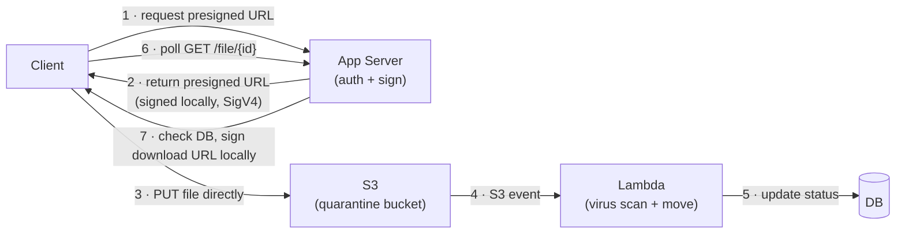
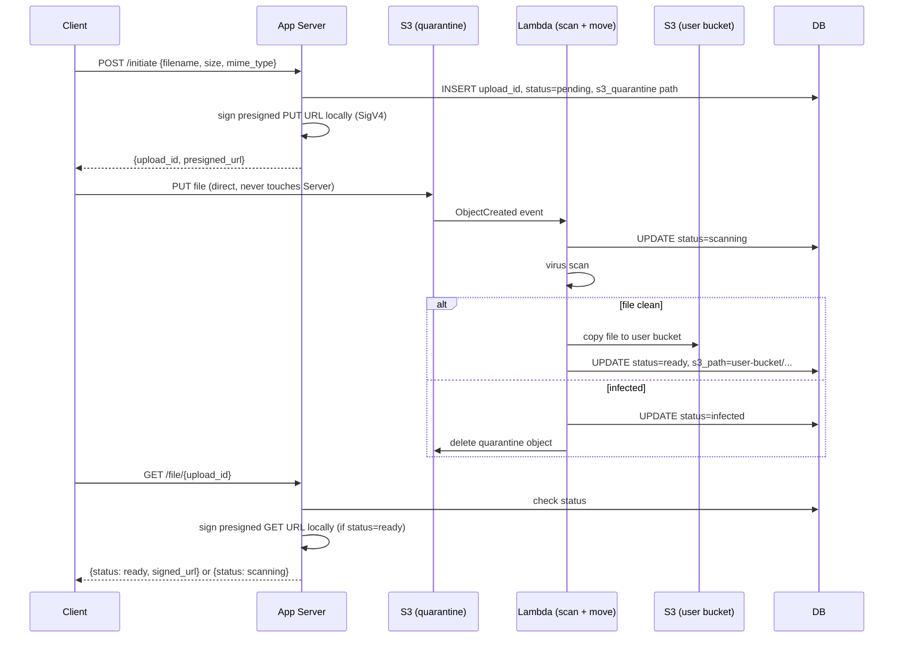
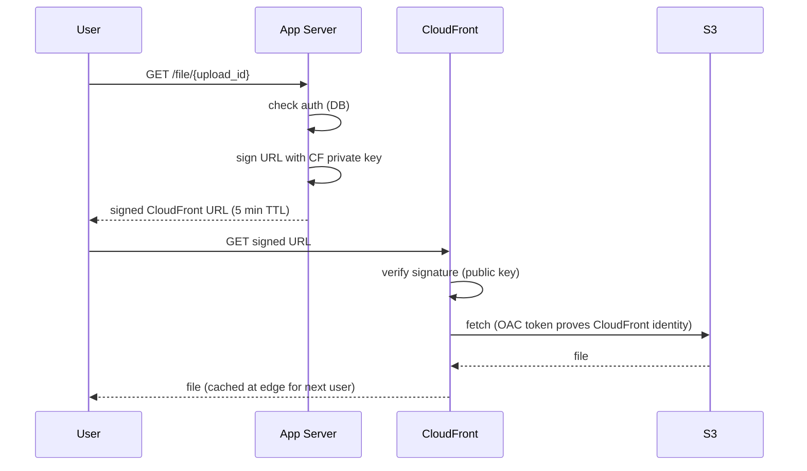
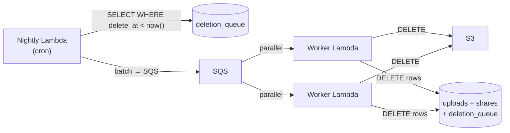
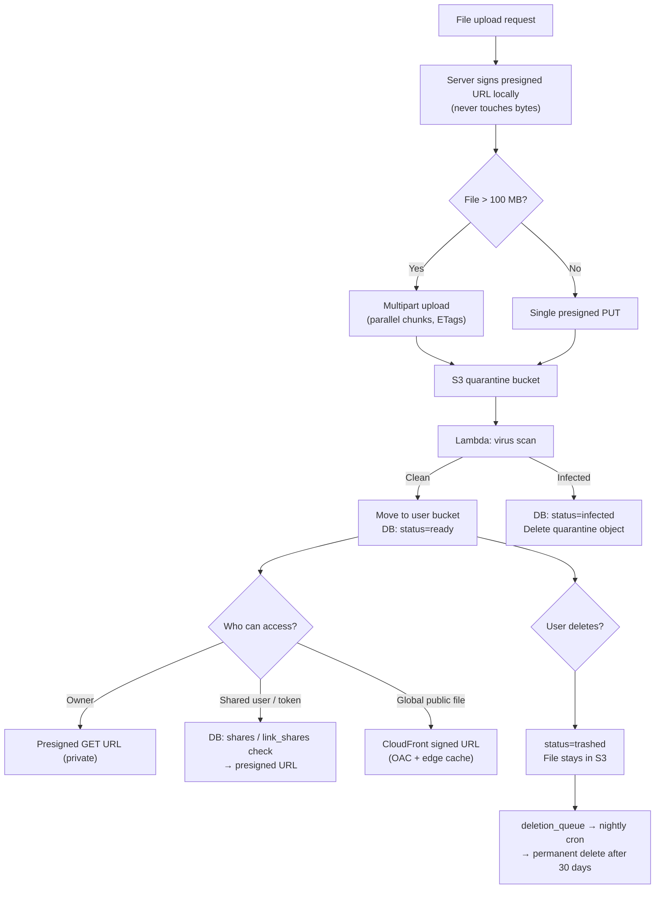

# Secure File Upload Service

Goal: recognize the full design of a private file-storage service in a system design interview — from presigned upload through quarantine scanning, file sharing, soft-delete, and CDN delivery — and explain each decision confidently. A focused pass on sections 1, 2, and 9–11 takes about 15 minutes; a full read is roughly 25–30 minutes.

See [Handling Large Blobs](large-blobs.md) for deep coverage of presigned URL mechanics, multipart upload, resumable uploads, and async post-processing pipelines. This guide builds on those primitives and focuses on the system-level design decisions.

<!-- SECTION: table-of-contents -->

## Table of Contents

1. [Mental Model](#1-mental-model)
2. [Upload State Machine](#2-upload-state-machine)
3. [Quarantine Pipeline](#3-quarantine-pipeline)
4. [File Sharing](#4-file-sharing)
5. [Signed Download URLs vs CDN](#5-signed-download-urls-vs-cdn)
6. [Soft Delete and Trash](#6-soft-delete-and-trash)
7. [Auto-Purge at Scale](#7-auto-purge-at-scale)
8. [Design Warnings](#8-design-warnings)
9. [Interview Language](#9-interview-language)
10. [Final Mental Model](#10-final-mental-model)
11. [Review Checklist](#11-review-checklist)

<!-- SECTION: mental-model -->

## 1. Mental Model

A secure file service has three jobs:

| Job | Who does it |
|---|---|
| Authorize transfers | App server (never touches the bytes) |
| Move bytes | Client ↔ S3 directly via presigned URLs |
| Control access | App server checks DB before minting any URL |

Mental shortcut: **the server hands out signed keys; it never carries luggage.**

!!! note "Presigning is local"
    Minting upload/download presigned URLs is **local SigV4 signing** in the AWS SDK — **no HTTP call to S3**. S3 is used when the client **consumes** the URL (PUT/GET) and for multipart **control** APIs (`CreateMultipartUpload`, `CompleteMultipartUpload`). See [Handling Large Blobs §4](large-blobs.md#4-presigned-urls-direct-client-to-storage-transfer).



The app server is only in the critical path for **authorization and URL signing** — never for file bytes.

<!-- SECTION: upload-state-machine -->

## 2. Upload State Machine

Every upload gets an `upload_id` generated by the server before any URL is issued. This ID is the anchor that ties the presigned URL, the DB row, the Lambda callback, and the download URL together.

```sql
CREATE TABLE uploads (
    upload_id       UUID PRIMARY KEY,
    user_id         UUID NOT NULL,
    filename        TEXT NOT NULL,
    size_bytes      BIGINT,
    mime_type       TEXT,
    s3_quarantine   TEXT,                -- set on presign: "quarantine-bucket/uploads/{upload_id}/file.pdf"
    s3_path         TEXT,                -- set by Lambda after move: "user-bucket/users/{user_id}/{upload_id}/file.pdf"
    mpu_id          TEXT,                -- S3 multipart upload ID (large files only)
    status          TEXT DEFAULT 'pending',
    created_at      TIMESTAMPTZ DEFAULT now(),
    updated_at      TIMESTAMPTZ DEFAULT now()
);
```

**Status flow:**

```
pending → uploaded → scanning → ready
                   → infected → deleted
```

| Status | Meaning | Set by |
|---|---|---|
| `pending` | Presigned URL issued, upload not yet confirmed | App server on `/initiate` |
| `uploaded` | S3 received the file (S3 event fired) | Lambda on ObjectCreated |
| `scanning` | Virus scan in progress | Lambda before scan |
| `ready` | File clean, moved to user bucket, accessible | Lambda after move |
| `infected` | Scan failed; file quarantined | Lambda on detection |
| `deleted` | Soft-deleted (in trash) | App server on DELETE |

**Why `upload_id` and not the S3 path as the key?**

The S3 path is derived — it changes when Lambda moves the file from quarantine to the user bucket. `upload_id` is stable from the first request through the entire lifecycle.

**For multipart uploads**, the server also persists `mpu_id` (the S3 session handle). If a chunk fails and the client requests a retry URL, the server needs the same `mpu_id` to presign a new part URL locally for the correct S3 session.

**Deciding single vs multipart:**

```
POST /initiate  { filename, size_bytes, mime_type }

if size_bytes > threshold (e.g. 100 MB):
    → S3 CreateMultipartUpload, then presign N part URLs locally
else:
    → presign single PUT URL locally
```

The client sends file size up front (it knows it — the file is local). The server decides the strategy.

<!-- SECTION: quarantine-pipeline -->

## 3. Quarantine Pipeline

User-uploaded files must be scanned before they reach other users. The quarantine bucket is a security boundary: files land there first and are only promoted to the user bucket after passing a scan.



**Key decisions:**

| Decision | Rationale |
|---|---|
| Quarantine bucket is separate from user bucket | Infected files never reach user-accessible storage |
| Lambda triggered by S3 event (not client callback) | Resilient to client crashes, tab closes, network drops |
| Lambda writes `s3_path` to DB after move | App server uses this path to generate download URLs |
| Client polls `GET /file/{upload_id}` | Simple; no WebSocket needed for background processing |

For details on the S3 event → async worker pattern, see [Handling Large Blobs §8](large-blobs.md#8-async-post-processing-pipeline).

<!-- SECTION: file-sharing -->

## 4. File Sharing

Sharing is an access-control problem: your DB decides who can see a file. S3 has no concept of sharing — it only knows "valid signature or not."

### Data model

```sql
-- User-to-user sharing
CREATE TABLE shares (
    share_id        UUID PRIMARY KEY,
    upload_id       UUID REFERENCES uploads(upload_id),
    owner_id        UUID NOT NULL,
    recipient_id    UUID NOT NULL,
    created_at      TIMESTAMPTZ DEFAULT now()
);

-- Public link sharing (anyone with the link)
CREATE TABLE link_shares (
    token           UUID PRIMARY KEY,   -- random UUID, unguessable
    upload_id       UUID REFERENCES uploads(upload_id),
    owner_id        UUID NOT NULL,
    expires_at      TIMESTAMPTZ,        -- null = no expiry
    active          BOOLEAN DEFAULT true,
    created_at      TIMESTAMPTZ DEFAULT now()
);
```

### Access control decision tree

Every `GET /file/{upload_id}` passes through this check before the server mints a download URL:

```
status = trashed or infected?  → 403 File unavailable
        ↓
user is the owner?             → allow
        ↓
user in shares table?          → allow
        ↓
active link_shares token?      → allow
        ↓
none of the above              → 403 Forbidden
```

### Public share link flow

```
POST /share/link { upload_id }
→ server verifies ownership
→ INSERT into link_shares { token: UUID(), upload_id, owner_id, active: true }
→ return https://yourapp.com/shared/{token}

GET /shared/{token}
→ server looks up token: active=true and not expired?
→ sign presigned S3 GET URL locally (short TTL: 5–15 min)
→ redirect browser to S3 URL
```

The share link (`yourapp.com/shared/{token}`) points to your server — **not** directly to S3. Your server is the checkpoint every time the link is visited. This means:

- Revoke anytime: `UPDATE link_shares SET active=false WHERE token=...`
- Extend/shorten expiry: `UPDATE link_shares SET expires_at=... WHERE token=...`
- Track access: log each visit before redirecting

**Why not just hand out a long-lived S3 presigned URL directly?**

A long-lived S3 URL cannot be revoked. Once issued, it works until expiry regardless of what the owner wants. A token through your server can be killed instantly.

<!-- SECTION: signed-download-urls-vs-cdn -->

## 5. Signed Download URLs vs CDN

Two patterns for file delivery — the choice depends on privacy and traffic:

| | Presigned S3 GET URL | CloudFront Signed URL |
|---|---|---|
| **Use for** | Private, per-user files | Shared/public files with global audience |
| **Latency** | S3 in one region | Served from nearest edge PoP |
| **Caching** | No caching — fresh S3 fetch each time | Edge-cached; repeat downloads free |
| **Revocation** | Cannot revoke; rely on short TTL | Cannot revoke URL; rely on short TTL |
| **Cost** | S3 data transfer per request | CDN egress (cheaper for high-traffic files) |

### CloudFront + S3 security chain

```
User → CloudFront signed URL → CloudFront edge → S3 (OAC) → file
```

**Origin Access Control (OAC):** S3 bucket policy allows only your specific CloudFront distribution to read objects. Direct S3 URLs (`s3.amazonaws.com/...`) return 403 for everyone, including users who guess the path.

**CloudFront signed URL:** your app server holds a CloudFront private key and signs a URL containing the file path + expiry. CloudFront validates the signature at the edge using the corresponding public key — no call back to your server.



### Signed cookies vs signed URLs

A signed URL is a **bearer token** — anyone who copies it can use it until it expires.

| | Signed URL | Signed Cookie |
|---|---|---|
| How held | In the URL bar — visible, copyable | In browser cookie storage |
| Theft vector | Copy-paste, browser history, referrer headers | Session hijack, shared browser |
| Best for | One-time downloads, shareable links | Repeated private access (video streaming, documents) |
| Revocation | Can't revoke; TTL is your only defence | Can't revoke; TTL is your only defence |

**Short expiry (5–15 min) is the universal mitigation.** By the time a leaked URL reaches an attacker, it's already expired.

For details on CDN delivery, range requests, and cache headers, see [Handling Large Blobs §7](large-blobs.md#7-cdn-delivery-edge-cached-downloads).

<!-- SECTION: soft-delete -->

## 6. Soft Delete and Trash

Trash is soft delete with a timer. The file stays in S3; only the DB record changes.

### Schema changes

Add two columns to `uploads`:

```sql
status      TEXT   -- add 'trashed' as a new status value
trashed_at  TIMESTAMPTZ  -- set when status → trashed
```

### Flows

**Delete (move to trash):**
```
DELETE /file/{upload_id}
→ check ownership
→ UPDATE uploads SET status='trashed', trashed_at=now()
→ file stays in S3, untouched
```

**Restore:**
```
POST /trash/{upload_id}/restore
→ UPDATE uploads SET status='ready', trashed_at=null
```

**Access while trashed:** the access control decision tree (§4) checks `status='trashed'` first → 403 for everyone including the owner. Shares in the `shares` table are **not deleted** — they revive automatically on restore.

**Permanently delete (manual empty trash):**
```
DELETE /trash
→ DELETE object from S3
→ DELETE row from uploads
→ DELETE rows from shares and link_shares
```

<!-- SECTION: auto-purge -->

## 7. Auto-Purge at Scale

Files not manually restored within 30 days should be purged automatically. The challenge: scanning the full `uploads` table nightly gets expensive at scale.

### Option A — Partial index (small/medium scale)

```sql
CREATE INDEX idx_uploads_trashed
ON uploads (trashed_at)
WHERE status = 'trashed';
```

The index only covers trashed rows. The nightly query is fast:

```sql
SELECT upload_id, s3_path FROM uploads
WHERE status = 'trashed'
AND trashed_at < now() - INTERVAL '30 days'
LIMIT 10000;
```

**Use this first.** Handles millions of rows without extra infrastructure.

### Option B — Dedicated deletion queue (large scale)

At very large scale (millions of trashes per day), even an indexed scan touches many rows and runs nightly as a batch — one slow query doing all the work.

A `deletion_queue` table decouples discovery from execution:

```sql
CREATE TABLE deletion_queue (
    upload_id   UUID PRIMARY KEY,
    s3_path     TEXT NOT NULL,
    delete_at   TIMESTAMPTZ NOT NULL,  -- indexed
    created_at  TIMESTAMPTZ DEFAULT now()
);

CREATE INDEX idx_dq_delete_at ON deletion_queue (delete_at);
```

**On trash:** insert a row into `deletion_queue` with `delete_at = now() + 30 days`.  
**Nightly cron:** queries only this lean table (rows are deleted after processing, so it stays small), fans out to SQS, Lambda workers delete from S3 + uploads + deletion_queue.



**Why not EventBridge Scheduler?** EventBridge is clean for low-volume long-delay scheduling, but at 2 million trashes per day it creates 2 million individual schedules — operationally heavy and expensive per-schedule. A DB table + cron is simpler and cheaper at that volume.

<!-- SECTION: warnings -->

## 8. Design Warnings

| Mistake | Why it hurts | Better answer |
|---|---|---|
| Public read on S3 bucket | Anyone who guesses a path can download any file | Block Public Access; require presigned or CloudFront signed URL |
| Using user-controlled path prefix in presigned URL | User A can overwrite User B's files | Server constructs the full path; user controls only filename |
| Storing a long-lived presigned URL in the DB as "the share link" | Cannot revoke; leaks are permanent until expiry | Store a token in `link_shares`; sign a fresh presigned URL locally on each visit |
| No virus scan before promoting files | Infected files reach other users | Quarantine bucket + Lambda scan before move |
| Skipping the quarantine bucket (scan in-place in user bucket) | Infected file visible to other users during scan window | Always scan before promotion |
| Long presigned URL expiry (hours/days) | Stolen URL usable for extended window | 5–15 min for uploads and downloads |
| Deleting shares immediately on trash | Shares don't revive on restore | Suspend via status check; delete shares only on permanent delete |
| Full table scan for auto-purge | Slow at scale; locks rows | Partial index (small scale) or dedicated `deletion_queue` table |

<!-- SECTION: interview-language -->

## 9. Interview Language

### 30-second upload answer

> For file uploads I'd use presigned URLs — the server signs a time-limited URL locally (SigV4, no S3 call to mint it), the client PUTs directly to S3. For files over 100 MB I'd use multipart upload: the server calls CreateMultipartUpload on S3, presigns one part URL per chunk locally, and the client uploads in parallel. The server never handles the bytes. Before files are accessible, they go through a quarantine bucket with a Lambda virus scan triggered by an S3 event.

### 30-second sharing and security answer

> Sharing is a DB problem. There's a `shares` table for user-to-user access and a `link_shares` table for public token links. Every download request hits the server first — the server checks the DB, then mints a short-lived presigned URL. For public files with a global audience I'd put CloudFront in front of S3 with Origin Access Control so direct S3 URLs return 403. Revocation is instant: flip `active=false` in the link_shares row.

### 60-second full system answer

> File uploads go directly to a quarantine S3 bucket via presigned URL — the app server validates auth and signs the URL locally but never touches the bytes. For large files I'd use multipart upload: CreateMultipartUpload on S3, presigned part URLs signed locally. An S3 ObjectCreated event triggers a Lambda that scans the file, moves it to the user bucket on success, and writes the final S3 path to the DB. The client polls a status endpoint until status is `ready`.
>
> Access control lives entirely in the DB: the server checks ownership, a `shares` table, and a `link_shares` token table before minting any download URL. For public or shared files I'd put CloudFront in front of S3 with OAC — users get a short-lived signed CloudFront URL, S3 rejects direct requests. For private files, presigned S3 GET URLs with a 5-minute TTL.
>
> Deletes are soft — status flips to `trashed`, file stays in S3. A nightly cron backed by a `deletion_queue` table purges files older than 30 days by fanning out to SQS and parallel Lambda workers.

<!-- SECTION: final-model -->

## 10. Final Mental Model



| Layer | Pattern | Interview phrase |
|---|---|---|
| Upload | Presigned PUT URL | "Server authorizes and signs locally; client PUTs directly to S3" |
| Large files | Multipart upload | "Create/Complete hit S3; part URLs presigned locally; retry failed part only" |
| Security | Quarantine + Lambda scan | "Files land in quarantine; promoted only after scan" |
| Sharing | DB access control | "Server checks DB before minting any URL; S3 never knows about sharing" |
| Download (private) | Presigned GET URL (5 min TTL) | "Fresh URL per request; short TTL limits leaked-URL exposure" |
| Download (public) | CloudFront + OAC | "Edge-cached; OAC means direct S3 URLs return 403" |
| Soft delete | status=trashed + trashed_at | "File stays in S3; only the DB record changes" |
| Auto-purge | deletion_queue + cron | "Queue on trash; nightly cron fans out to workers" |

Final shortcut: **the app server's only jobs are authorization and local URL signing — it never relays bytes, never stores files, and never answers "who can see this?" with anything other than a DB lookup.**

<!-- SECTION: checklist -->

## 11. Review Checklist

- Can you explain that minting a presigned URL is local SigV4 signing (no S3 round-trip)?
- Can you explain why the quarantine bucket is separate from the user bucket?
- Can you describe the upload state machine (`pending → uploaded → scanning → ready`) and who sets each status?
- Can you explain why `upload_id` is stable but `s3_path` changes during the quarantine flow?
- Can you draw the access control decision tree for `GET /file/{upload_id}`?
- Can you explain why public share links point to your server (not directly to S3)?
- Can you explain Origin Access Control and why it prevents path-guessing attacks?
- Can you explain the difference between a signed CloudFront URL and a presigned S3 URL?
- Can you explain the bearer-token risk of signed URLs and how signed cookies mitigate it?
- Can you explain why soft delete (status=trashed) is preferred over immediate S3 deletion?
- Can you describe the `deletion_queue` pattern and why it beats a full table scan or EventBridge at millions of trashes per day?

See also: [Handling Large Blobs](large-blobs.md), [Blob Storage](../databases/blob-storage.md), [Client → Edge/CDN](../foundations/client-edge-cdn.md).
