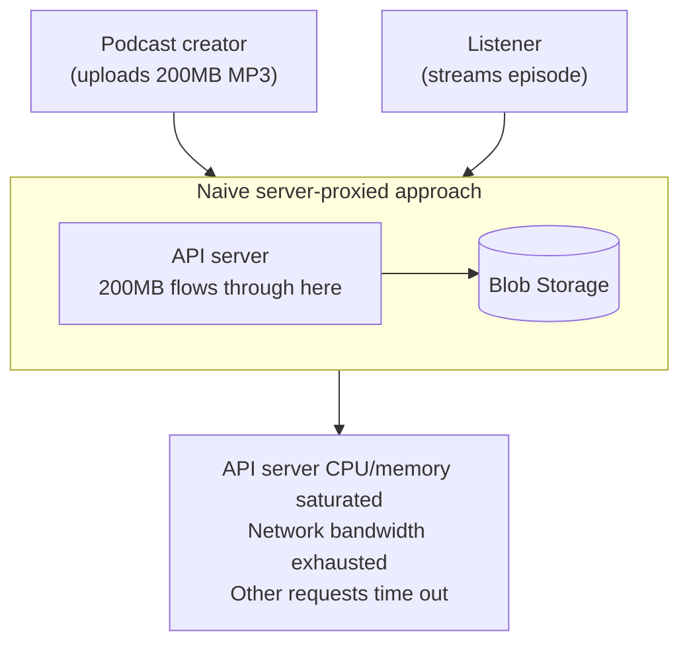
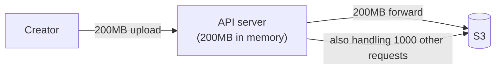
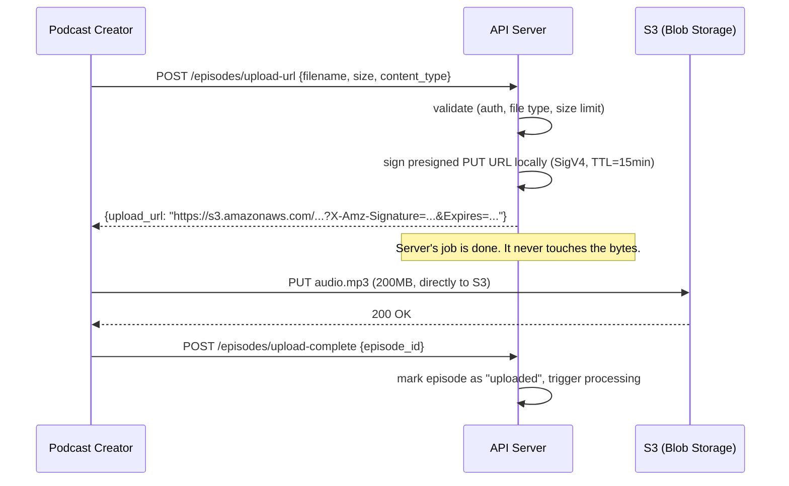
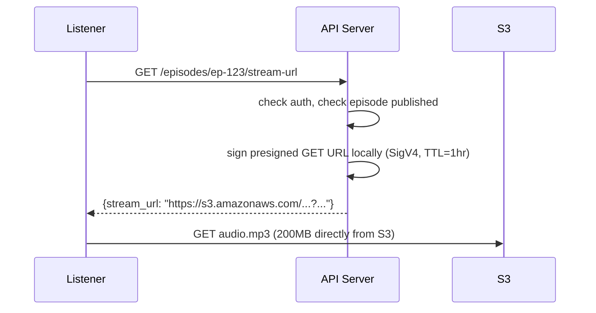
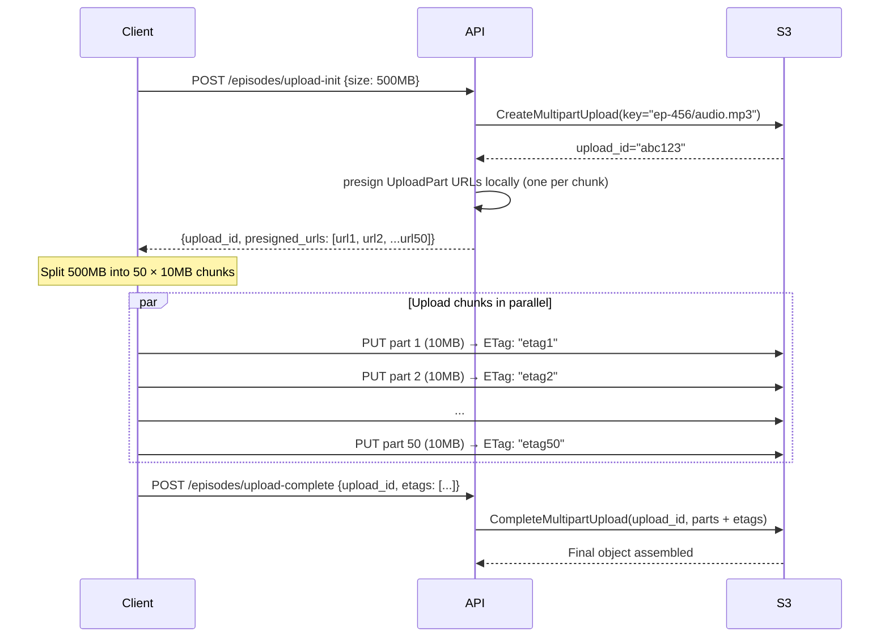
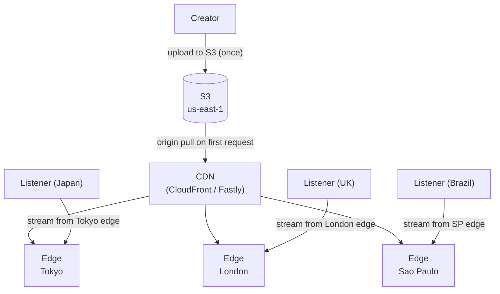
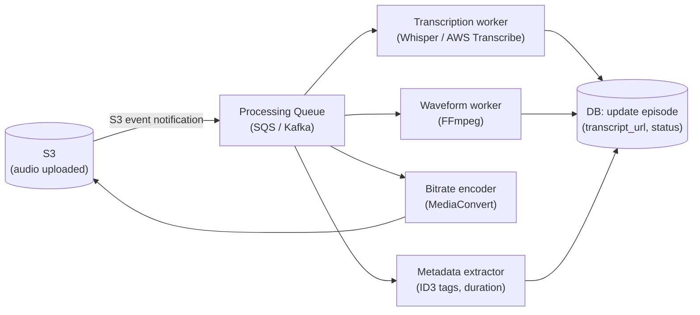
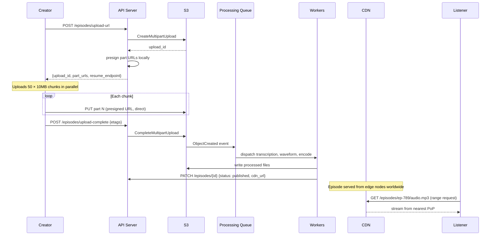
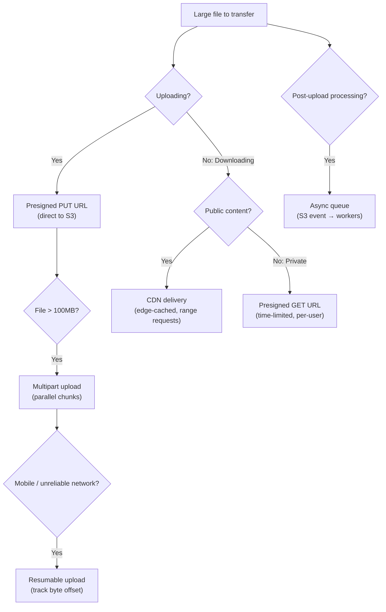

# Handling Large Blobs

Goal: recognize when a system design involves large files and apply the right pattern — from presigned URL direct uploads to resumable chunked transfers and CDN delivery — to keep large binary data off your application servers. A focused pass on sections 1, 2, and 9–11 takes about 15 minutes; a full read is roughly 30–35 minutes.

<!-- SECTION: table-of-contents -->

## Table of Contents

1. [Large Blob Mental Model](#1-large-blob-mental-model)
2. [The Broken Baseline: Server-Proxied Transfer](#2-the-broken-baseline-server-proxied-transfer)
3. [Blob Storage as the Foundation](#3-blob-storage-as-the-foundation)
4. [Presigned URLs: Direct Client-to-Storage Transfer](#4-presigned-urls-direct-client-to-storage-transfer)
5. [Multipart Upload: Parallel Chunked Transfer](#5-multipart-upload-parallel-chunked-transfer)
6. [Resumable Uploads: Survive Network Failures](#6-resumable-uploads-survive-network-failures)
7. [CDN Delivery: Edge-Cached Downloads](#7-cdn-delivery-edge-cached-downloads)
8. [Async Post-Processing Pipeline](#8-async-post-processing-pipeline)
9. [How Patterns Compose](#9-how-patterns-compose)
10. [System Design Examples](#10-system-design-examples)
11. [Design Warnings](#11-design-warnings)
12. [Interview Language](#12-interview-language)
13. [Final Mental Model](#13-final-mental-model)
14. [Review Checklist](#14-review-checklist)

<!-- SECTION: mental-model -->

## 1. Large Blob Mental Model

Large blob patterns answer one question:

> How do we move large binary files (audio, video, documents, images) between clients and storage without those bytes ever touching our application servers?

Use a **podcast hosting platform** as the running example: creators upload audio episodes (50–500MB per file), listeners stream on demand globally. Episodes need waveform generation, transcription, and thumbnail processing after upload.



Large blob design is about:

| Problem | Pattern | Interview phrase |
|---|---|---|
| File bytes flow through app server | Presigned URL | "Client talks directly to S3 — server never touches the bytes" |
| Large file uploads fail on network blip | Multipart upload | "Split into chunks, upload in parallel, resume from last chunk" |
| Mobile upload drops and restarts from zero | Resumable upload | "Server tracks byte offset; client resumes from where it stopped" |
| File downloads are slow for global users | CDN | "Edge-cached delivery; listener streams from nearest PoP" |
| Post-upload processing blocks the upload response | Async pipeline | "Upload completes; processing queue handles transcoding, transcription" |

Mental shortcut: **large blobs should flow directly between the client and object storage — your servers coordinate the transfer, they don't participate in it.**

<!-- SECTION: broken-baseline -->

## 2. The Broken Baseline: Server-Proxied Transfer

### What it is

The naive approach: client uploads to your API server, API server forwards to blob storage. Same for downloads.

```python
# Naive upload handler
@app.post("/episodes/upload")
def upload_episode(file: UploadFile):
    data = file.read()                    # 200MB lives in server memory
    s3.put_object(Bucket="podcasts", Key=file.filename, Body=data)
    return {"status": "uploaded"}
```

### Why it breaks



**What goes wrong:**

| Problem | Impact |
|---|---|
| 200MB held in server memory per concurrent upload | 50 concurrent uploads = 10GB RAM on one server |
| Upload bandwidth consumed by server | Server's network saturated; other requests slow down |
| If server crashes mid-upload | Entire upload lost; user starts over |
| Download: 200MB from S3 to server to client | Double bandwidth cost; 2× latency |
| Connection timeout for slow clients | Mobile user on 4G takes 5 minutes; server holds connection open |
| Horizontal scaling doesn't help | More servers = more servers all proxying bytes |

The server is in the critical path for bytes it adds no value to. It's just a relay.

<!-- SECTION: blob-storage -->

## 3. Blob Storage as the Foundation

### Why not a database

Before discussing transfer patterns, establish why blob storage (S3, GCS, Azure Blob) is the right store:

| | Relational DB | Blob storage |
|---|---|---|
| Large binary objects | Kills query performance, backup time, replication | Purpose-built; scales to exabytes |
| Cost | ~$0.10/GB/month (SSD) | ~$0.023/GB/month (S3 Standard) |
| Durability | Depends on backup policy | 99.999999999% (11 nines) |
| CDN integration | No | Native; S3 + CloudFront = one config |
| Throughput | Shared with transactional queries | Dedicated, parallelizable |

**Rule of thumb:** if it's over ~1MB and doesn't need SQL queries, it belongs in blob storage.

### What your DB stores about blobs

The DB stores **metadata** about the file, not the file itself:

```sql
CREATE TABLE episodes (
    id          UUID PRIMARY KEY,
    podcast_id  UUID NOT NULL,
    title       TEXT NOT NULL,
    storage_key TEXT NOT NULL,    -- "podcasts/ep-123/audio.mp3"
    size_bytes  BIGINT,
    duration_s  INTEGER,
    status      TEXT DEFAULT 'pending',  -- pending, processing, published
    created_at  TIMESTAMPTZ DEFAULT now()
);
```

The `storage_key` is the pointer. The DB never holds the bytes.

<!-- SECTION: presigned-urls -->

## 4. Presigned URLs: Direct Client-to-Storage Transfer

### Why we need it

Even with S3 as the store, we could still proxy bytes through the server. Presigned URLs eliminate this: the server generates a **time-limited signed URL** that gives the client direct access to S3 for that one operation.

### The technical version

!!! note "Presigning is local"
    `generate_presigned_url` / `getSignedUrl` is **client-side SigV4 signing** in the AWS SDK. The server uses IAM credentials already in memory; **no HTTP call to S3** happens when minting the URL. S3 is contacted only when the **client uses** the URL (PUT/GET). Credential refresh (IMDS, STS) may hit AWS, but that is not S3. Multipart is different: `CreateMultipartUpload` and `CompleteMultipartUpload` are real S3 API calls; only **part** URLs are presigned locally.

**Upload flow:**



**Download flow:**



**Key properties of presigned URLs:**

| Property | Detail |
|---|---|
| Minting | Local SigV4 in the SDK — no round-trip to S3 when generating the URL |
| Signed | HMAC signature over key, expiry, allowed operation |
| Time-limited | URL becomes invalid after TTL (e.g. 15 min for upload, 1 hr for download) |
| Operation-specific | A PUT URL cannot be used for GET; a GET URL cannot be used for DELETE |
| No auth required at S3 | Signature is the proof of authorization |

**AWS SDK example (Python):**

```python
def generate_upload_url(episode_id: str, content_type: str) -> str:
    key = f"episodes/{episode_id}/audio.mp3"
    url = s3_client.generate_presigned_url(
        ClientMethod="put_object",
        Params={
            "Bucket": "podcast-audio",
            "Key": key,
            "ContentType": content_type,
        },
        ExpiresIn=900,   # 15 minutes
    )
    return url
```

### When to use

- Any upload or download where the client can make HTTP requests directly
- Files of any size where you want to avoid proxying through servers
- When you need fine-grained access control (per-file, time-limited, operation-specific)

### Limits

- **Client must support HTTP PUT** — some corporate proxies or legacy clients may not.
- **No progress tracking** from the server side — the server doesn't know upload progress; the client must report completion.
- **Not resumable** out of the box — if a presigned PUT fails mid-upload, the client starts over. Use multipart upload for large files.

<!-- SECTION: multipart -->

## 5. Multipart Upload: Parallel Chunked Transfer

### Why we need it

A single HTTP PUT for a 500MB file is fragile: any network interruption fails the entire upload. And it's slow: one sequential stream doesn't saturate the available bandwidth. **Multipart upload** splits the file into chunks and uploads them in parallel.

### The technical version



**Why ETags matter:** S3 returns an ETag (hash) for each uploaded part. The `CompleteMultipartUpload` call must include all ETags — S3 uses them to verify integrity and assemble the final object.

**Chunk size recommendations:**

| File size | Chunk size | Parallel uploads |
|---|---|---|
| < 100MB | 5–10MB | 3–5 |
| 100MB–1GB | 10–50MB | 5–10 |
| > 1GB | 50–100MB | 10–20 |

Minimum chunk size: 5MB (S3 requirement, except for the last part).

**Speed advantage:** 500MB at 50Mbps upload speed takes 80 seconds in series. With 10 parallel streams: ~8 seconds. Parallelism saturates available bandwidth.

### When to use

- Files > 100MB (use multipart by default)
- Users on mobile or unreliable connections (individual chunk failures don't fail the whole upload)
- When upload speed matters (parallel chunks saturate bandwidth)

### Limits

- **Incomplete multipart uploads incur storage costs** — S3 charges for uploaded parts even if the upload is never completed. Set an S3 lifecycle rule to abort incomplete uploads after N days.
- **Complexity** — client must split the file, track ETags, handle partial failures.

<!-- SECTION: resumable -->

## 6. Resumable Uploads: Survive Network Failures

### Why we need it

Multipart upload handles parallel uploads, but if the client loses connectivity mid-upload and restarts, it doesn't know which chunks succeeded. A **resumable upload protocol** tracks progress server-side so the client can resume from the last successful byte.

### The technical version

The industry standard protocol is **TUS (open-source)** or the equivalent in cloud providers (GCS resumable uploads, S3 resumable via multipart). The key idea: the server tracks how many bytes have been received for each upload.

**TUS protocol flow:**

```
1. Client: POST /files
   Upload-Length: 524288000  (500MB)
   → Server returns Location: /files/upload-abc123

2. Client: PATCH /files/upload-abc123
   Content-Range: bytes 0-10485759/*   (first 10MB chunk)
   → Server: Upload-Offset: 10485760

3. [Network drops here]

4. Client reconnects:
   HEAD /files/upload-abc123
   → Server: Upload-Offset: 10485760  (I have the first 10MB)

5. Client: PATCH /files/upload-abc123
   Content-Range: bytes 10485760-20971519/*  (second 10MB chunk, resume here)
```

**Server-side upload state (stored in Redis or DB):**

```python
upload_state = {
    "upload_id": "upload-abc123",
    "episode_id": "ep-789",
    "total_bytes": 524_288_000,
    "received_bytes": 10_485_760,   # updated after each successful chunk
    "storage_key": "episodes/ep-789/audio.mp3",
    "expires_at": "2026-05-26T10:00:00Z"
}
```

**Progress reporting:** client can query the server for upload progress. UI shows a real progress bar instead of a spinner.

### When to use

- Mobile uploads (connections drop frequently)
- Large files (> 100MB) from users on unreliable networks
- Any upload where "start over" is an unacceptable user experience

### Limits

- **Server must maintain upload state** — adds a Redis/DB dependency for tracking byte offsets.
- **Protocol complexity** — TUS is well-specified but requires client and server library support.
- **Orphaned uploads** — users who abandon mid-upload leave partial data. Set expiry on upload state and lifecycle policy on partial S3 objects.

<!-- SECTION: cdn-delivery -->

## 7. CDN Delivery: Edge-Cached Downloads

### Why we need it

Even with presigned URLs pointing directly to S3, a listener in Tokyo downloading from an S3 bucket in us-east-1 adds ~150ms of round-trip latency per request plus the full transfer distance. A **CDN** caches the episode at edge nodes worldwide — the listener streams from the nearest PoP (Point of Presence).

### The technical version



**CDN + presigned URLs:** for public content (published podcast episodes), use a CDN-signed URL or a public S3 URL through CloudFront. For private content (draft episodes), issue presigned CloudFront URLs with a short TTL.

**HTTP Range requests for audio streaming:**

Podcast players don't download the whole file before playing. They issue **range requests** to jump to any point in the episode:

```http
GET /episodes/ep-123/audio.mp3 HTTP/1.1
Range: bytes=5242880-10485759   (skip to ~5MB in, fetch 5MB)
```

CDNs cache by range, so popular seek points warm the cache. The player buffers ahead while streaming.

### Cache headers for audio files:

```http
Cache-Control: public, max-age=31536000, immutable
```

Published audio files never change — set a 1-year TTL. `immutable` tells browsers not to revalidate even at expiry.

### When to use

- Any file served to a geographically distributed audience
- Large files where transfer distance adds meaningful latency
- High-traffic files (popular episodes hit by millions of listeners)

### Limits

- **CDN cost:** egress from CDN is billed per GB. For very rarely accessed files (long-tail episodes), CDN adds cost without benefit — serve from S3 directly for the cold tail.
- **Private files:** CDN cannot cache per-user access-controlled content without signed CDN URLs and edge auth logic.

<!-- SECTION: async-pipeline -->

## 8. Async Post-Processing Pipeline

### Why we need it

After a podcast episode is uploaded, the platform needs to: generate a waveform visualization, transcribe the audio (for search and accessibility), validate audio quality, and generate multiple bitrate versions for adaptive streaming. None of this should block the upload response.

### The technical version



**S3 event trigger:**

```python
# S3 sends an event to SQS when a new object is created
# SQS message:
{
    "bucket": "podcast-audio",
    "key": "episodes/ep-789/audio.mp3",
    "size": 52_428_800,
    "event": "ObjectCreated:Put"
}

# Worker consumes the message:
def process_new_episode(message):
    episode_id = extract_id_from_key(message["key"])
    db.update(episode_id, status="processing")

    dispatch_task("transcribe", episode_id, message["key"])
    dispatch_task("waveform",   episode_id, message["key"])
    dispatch_task("encode",     episode_id, message["key"])
```

**Idempotency for workers:** if SQS redelivers a message (at-least-once delivery), workers must handle duplicates. Use the episode ID as an idempotency key: check if transcription already exists before running it again.

**Status polling / webhooks:** the client polls `GET /episodes/{id}/status` or subscribes to a webhook to know when processing is complete.

### When to use

- Any operation that can happen after the upload (transcoding, transcription, indexing, virus scanning, thumbnail generation)
- Operations that are slow (minutes to hours)
- Operations that can fail and retry independently

### Limits

- **Eventual consistency:** the episode is "uploaded" before processing completes. The platform must handle the intermediate state (show "processing" UI, not "ready to publish").
- **Worker failures:** if a transcription worker fails, the task must be retried. Use a DLQ (Dead Letter Queue) for tasks that fail N times — alert and investigate.
- **Cost of parallel processing:** running transcription + encoding + waveform simultaneously multiplies worker cost. Prioritize or queue by tier if cost is a concern.

<!-- SECTION: compose -->

## 9. How Patterns Compose

Full podcast upload + delivery flow:



**Layered responsibilities:**

| Layer | Pattern | What it prevents |
|---|---|---|
| API server | Presigned URL | Bytes flowing through app server |
| Large file transfer | Multipart upload | Single-stream slowness and failure |
| Unreliable network | Resumable upload | Starting from zero on reconnect |
| Global delivery | CDN + range requests | Long-distance streaming latency |
| Post-upload work | Async processing queue | Blocking upload response on slow operations |

<!-- SECTION: examples -->

## 10. System Design Examples

### Example 1: Video Sharing Platform (User-uploaded video)

**Scenario:** users upload videos (up to 4GB). After upload: transcode to multiple resolutions (4K, 1080p, 720p, 480p), generate thumbnail, extract metadata.

| Component | Pattern | Detail |
|---|---|---|
| Upload | Presigned multipart URL | Direct S3 upload; 100MB chunks; parallel parts |
| Progress | Resumable (TUS or custom) | Mobile users expect resume on reconnect |
| Storage | S3 with lifecycle tiers | Hot tier for recent; Glacier for archive |
| Processing | Async queue → workers | S3 event → SQS → transcoding workers (AWS MediaConvert) |
| Delivery | CDN + adaptive bitrate (HLS/DASH) | Player requests lowest bitrate segment first, upgrades based on bandwidth |

**Interview line:** "Upload goes directly to S3 via presigned multipart URL. An S3 event triggers the transcoding pipeline. Delivery is HLS from CloudFront — the player adapts bitrate based on the viewer's connection."

---

### Example 2: Legal Document Platform (Sensitive PDFs, access-controlled)

**Scenario:** law firms upload case documents (up to 500MB); only authorized users can download them.

| Component | Pattern | Detail |
|---|---|---|
| Upload | Presigned PUT URL (short TTL, 10 min) | Server validates auth before generating URL |
| Storage | S3 private bucket (no public access) | Only accessible via presigned or IAM |
| Download | Presigned GET URL (TTL=1hr) | Generated per-request after auth check; not cached by CDN |
| Virus scan | Async worker on upload | S3 event → scan queue → flag/quarantine before marking as accessible |
| Audit trail | DB log: who accessed what, when | Required for compliance |

**Interview line:** "Documents are private, so every download generates a fresh presigned URL after auth check — no CDN caching. All access is logged to the audit table."

---

### Example 3: Profile Photo Service (Small, high-traffic images)

**Scenario:** profile photos (< 5MB); read by millions of users in every page view.

| Component | Pattern | Detail |
|---|---|---|
| Upload | Presigned PUT URL | Direct to S3; no multipart needed (small file) |
| Processing | Async worker: resize to 3 sizes (thumbnail, medium, full) | S3 event → Lambda → write 3 derived objects |
| Delivery | CDN, 1-year TTL, `immutable` header | Profile photos change rarely; cache aggressively |
| Invalidation | On update: upload new object with new key (content-addressed) | Old key in CDN stays cached; new key is immediately fresh |

**Content-addressing trick:** use a hash of the file content as part of the key (`avatars/{user_id}/{hash}.jpg`). Updating a photo generates a new URL — no CDN invalidation needed.

**Interview line:** "Profile photos are content-addressed — the URL includes a hash of the file, so updating your photo gives a new URL. CDN caches forever; stale URLs just naturally expire."

<!-- SECTION: warnings -->

## 11. Design Warnings

| Mistake | Why it hurts | Better answer |
|---|---|---|
| Storing large files in DB as BLOBs | Kills query performance, backup times, replication | DB stores metadata + storage_key; file bytes go to S3 |
| Proxying large file uploads through app servers | Saturates server memory and network | Presigned URLs for direct client-to-S3 transfer |
| Single presigned URL for a 1GB upload | One network blip = start over | Multipart upload with presigned part URLs |
| Never setting multipart upload lifecycle policy | Incomplete uploads accumulate in S3 and incur storage cost | S3 lifecycle rule: abort incomplete multipart uploads after 7 days |
| Blocking upload response on processing | Creator waits minutes for transcoding | Return 202 Accepted after upload; process async, webhook/poll for completion |
| CDN for private, user-specific content | Users see each other's files | Private files: presigned URLs with short TTL, no CDN caching |
| Serving audio directly from S3 without CDN | High latency for distant users; S3 charges for every request | CloudFront in front of S3 for public files |
| No virus scanning for user uploads | Malicious files reach other users | Async scan worker before file is marked as accessible |

<!-- SECTION: interview-language -->

## 12. Interview Language

### Phrases that signal competence

```text
For file uploads, I'd use presigned URLs — the API server generates a time-limited
signed URL and the client uploads directly to S3. The server never touches the bytes.

For files over 100MB, I'd use multipart upload: split into chunks, upload in parallel,
each chunk gets its own presigned URL. That both saturates available bandwidth and
means a failed chunk can be retried without restarting the whole upload.

On mobile or unreliable networks, I'd add resumable upload support — the server tracks
byte offset so the client can resume from the last successful checkpoint.

For delivery, I'd put CloudFront in front of S3 with a long TTL and Cache-Control:
immutable for published files. Listeners stream from the nearest edge node.

Post-upload processing — transcoding, transcription, thumbnail generation — all go into
an async queue triggered by the S3 ObjectCreated event. The upload response is immediate;
processing happens in the background.
```

### Sample 60-second answer

> For podcast audio uploads, I'd use presigned multipart URLs — the API server validates the upload request and generates presigned URLs for each 10MB chunk. The client uploads all chunks in parallel directly to S3; the server never handles the bytes. For mobile creators, I'd add TUS-style resumable upload: the server tracks byte offset so a dropped connection resumes from the last chunk, not from zero. Once S3 confirms the upload, an S3 event triggers an SQS queue that fans out to transcription, waveform generation, and bitrate encoding workers — all async, the creator sees "processing" in the UI. Published episodes are served via CloudFront with a one-year immutable cache header; listeners stream with HTTP range requests from the nearest edge node.

### How this relates to other patterns

| Topic | Question | Key patterns |
|---|---|---|
| Large blobs | How do we move large files without crushing our servers? | Presigned URLs, multipart, resumable, CDN |
| Scaling reads | How do we serve data to many concurrent readers? | Read replicas, Redis, CDN, search index |
| Blob storage basics | Why blob storage and how to reference it? | [Blob Storage](../databases/blob-storage.md) |

See also: [Blob Storage](../databases/blob-storage.md), [CDN & Edge](../foundations/client-edge-cdn.md), [Scaling Reads](scaling-reads.md).

<!-- SECTION: final-model -->

## 13. Final Mental Model



```text
Presigned URL:      Client ↔ S3 directly. Server signs URL locally (SigV4), never the bytes.
Multipart upload:   Chunks + parallel = fast + resumable-per-chunk.
Resumable upload:   Server tracks byte offset. Mobile-friendly. No restart on reconnect.
CDN delivery:       Edge-cached streaming. Range requests for audio/video seek.
Async pipeline:     S3 event → queue → workers. Upload completes in seconds; processing takes minutes.
```

For interviews, the strongest large blob answer sounds like:

```text
The file goes directly from client to S3 via a presigned URL — the server signs
the URL locally (no S3 call to mint it) and coordinates, but never handles the bytes.
For large files: multipart upload with parallel chunks.
For unreliable networks: resumable upload tracking byte offset.
For delivery: CDN in front of S3 for public files; presigned GET URLs for private.
Post-upload processing fires asynchronously from an S3 event.
```

Final shortcut: **the server's job with large blobs is to authorize and coordinate — not to relay bytes.**

<!-- SECTION: checklist -->

## 14. Review Checklist

- Can you explain why proxying large files through app servers is a problem?
- Can you describe when to use blob storage vs. a database for file data?
- Can you draw the presigned URL upload flow (client → API → S3 URL → client → S3)?
- Can you explain that minting a presigned URL is local SigV4 signing (no S3 round-trip)?
- Can you explain what a presigned URL contains (key, TTL, operation, signature)?
- Can you describe how multipart upload works and why ETags are needed?
- Can you explain what happens if a multipart upload is never completed and how to clean it up?
- Can you describe the TUS resumable upload protocol's core interaction (POST, PATCH, HEAD)?
- Can you explain HTTP Range requests and why they matter for audio/video streaming?
- Can you explain when to use CDN vs. presigned GET URL for file downloads?
- Can you describe the async post-processing pipeline (S3 event → queue → workers)?
- Can you explain why workers in the processing pipeline need idempotency?
- Can you describe content-addressing (hash in the URL) and why it avoids CDN invalidation?

If you remember only one thing:

```text
Large blobs should never flow through your application servers.
Presigned URLs let clients talk directly to blob storage.
The server authorizes and coordinates. It never relays bytes.
CDN delivers to the world. Async queues handle everything after upload.
```
