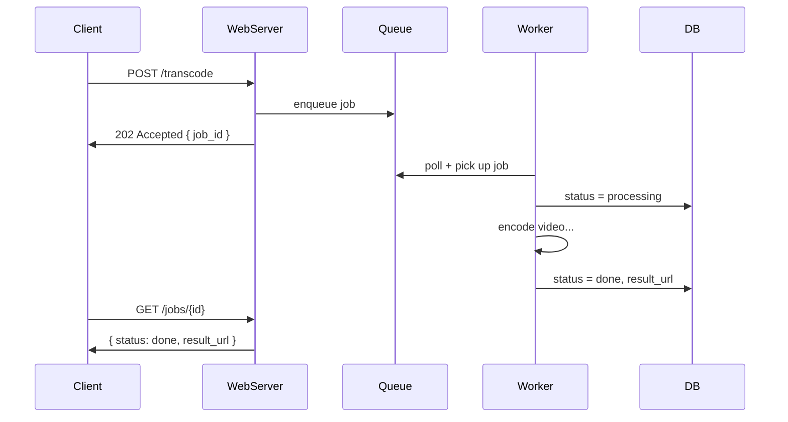
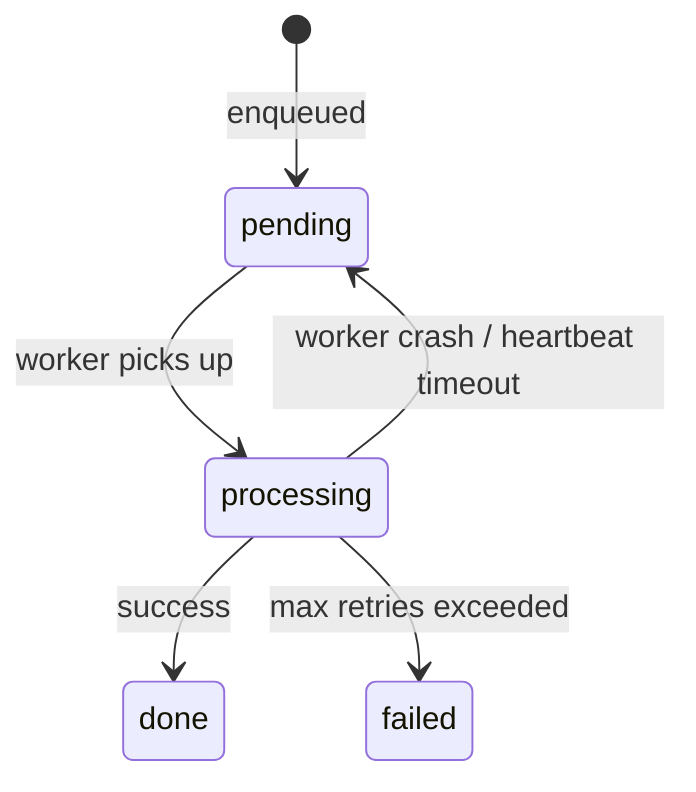

# Managing Long-Running Tasks

Goal: recognize when a task is too slow for synchronous processing and apply the queue + worker + notification pattern confidently in a system design interview. A full read takes about 5 minutes.

<!-- SECTION: table-of-contents -->

## Table of Contents

1. [Mental Model](#1-mental-model)
2. [The Problem: Synchronous Processing Fails](#2-the-problem-synchronous-processing-fails)
3. [The Pattern: Queue + Worker + Job ID](#3-the-pattern-queue--worker--job-id)
4. [Client Notification Strategies](#4-client-notification-strategies)
5. [Failure Handling & Idempotency](#5-failure-handling--idempotency)
6. [Interview Playbook](#6-interview-playbook)

<!-- SECTION: mental-model -->

## 1. Mental Model

> **Accepting work and doing work must be two separate steps.** The moment a task is too slow to fit inside one HTTP round-trip, you split the system in half: a fast intake path that acknowledges immediately, and a background path that processes at its own pace.

Running example used throughout: a video transcoding service. The user uploads a video; the system encodes it to multiple resolutions. Encoding takes minutes — far too long to hold an HTTP connection open.



Mental shortcut: **the server's only job on the initial request is to validate and hand off — never to wait.**

<!-- SECTION: the-problem -->

## 2. The Problem: Synchronous Processing Fails

Holding the HTTP connection open while a slow task runs breaks in three ways:

| Failure | What happens |
|---|---|
| **Timeout** | Browser/load balancer cuts the connection (~30–60s); client gets an error, server keeps working on an orphaned request |
| **Thread starvation** | The server thread is tied up for minutes; it can't serve other users |
| **No feedback** | Client sees a frozen spinner with no way to know if the task is running, stuck, or dead |

Sync is fine for fast operations (< ~2s). This pattern is only needed when a task duration is unpredictable or long.

<!-- SECTION: queue-worker-job-id -->

## 3. The Pattern: Queue + Worker + Job ID

Three actors replace the one overloaded server:

| Actor | Responsibility |
|---|---|
| **Web server** | Validate request, push job to queue, return `job_id` with `202 Accepted` |
| **Job queue** | Buffer of pending work (Redis, RabbitMQ, SQS) |
| **Worker** | Polls queue, executes task, writes status updates to DB |

### Jobs table (the status source of truth)

```sql
CREATE TABLE jobs (
    id          UUID PRIMARY KEY,
    status      TEXT NOT NULL,   -- pending | processing | done | failed
    progress    INT DEFAULT 0,
    result_url  TEXT,
    error       TEXT,
    heartbeat   TIMESTAMP,
    created_at  TIMESTAMP
);
```

### Job lifecycle



The client polls `GET /jobs/{id}` (every 2–5s) until status is `done` or `failed`. Simple, easy to debug — but wasteful for long jobs. Section 4 covers how to push instead.

<!-- SECTION: notification-strategies -->

## 4. Client Notification Strategies

### SSE (Server-Sent Events) — browser clients

The browser opens one persistent HTTP connection; the server streams status events down it as they happen. The connection closes when the job finishes.

**Variant A — DB polling loop** (simpler, fine at low scale):

```python
def stream_job(job_id, request):
    while True:
        if request.is_disconnected():   # browser closed tab — stop immediately
            break
        job = db.query("SELECT status, progress FROM jobs WHERE id=?", job_id)
        yield f"data: {json.dumps(job)}\n\n"
        if job.status in ("done", "failed"):
            break
        time.sleep(2)
```

**Variant B — Redis pub/sub** (production-grade, no wasted DB queries):

```python
def stream_job(job_id, request):
    sub = redis.subscribe(f"job:{job_id}")
    for msg in sub:
        if request.is_disconnected():
            sub.unsubscribe()           # release Redis connection
            break
        yield f"data: {msg}\n\n"
        if json.loads(msg)["status"] in ("done", "failed"):
            sub.unsubscribe()
            break

# Worker publishes when done:
redis.publish(f"job:{job_id}", json.dumps({"status": "done", "result_url": "..."}))
```

In async frameworks (FastAPI, Node.js), SSE handlers run as coroutines — they don't consume OS threads while waiting, so one server can hold thousands of open connections cheaply.

### Notification strategy comparison

| Strategy | Direction | Best for | Not for |
|---|---|---|---|
| **Polling** | Client → Server (repeated) | Simple clients, long intervals | Real-time, high frequency |
| **SSE** | Server → Browser | Live progress bars, job status | Server-to-server |
| **Webhook** | Server → Server | Backend callbacks (Stripe, GitHub) | Browser clients |
| **WebSocket** | Bidirectional | Chat, live collaboration | One-way status updates |

For "notify me when my video is ready" in a browser: **SSE is the right default.**

<!-- SECTION: failure-idempotency -->

## 5. Failure Handling & Idempotency

Workers are just processes — they crash. Two problems arise: detecting the crash, and safely retrying without doing work twice.

### Detecting a dead worker: heartbeats

The worker writes a `heartbeat` timestamp to the jobs table every ~10s. A watchdog process resets stale jobs:

```sql
UPDATE jobs SET status = 'pending'
WHERE status = 'processing'
AND heartbeat < NOW() - INTERVAL '30 seconds';
```

### Detecting a dead worker: visibility timeout (queue-native)

Managed queues (SQS, Google Pub/Sub) hide a job from other workers for a fixed window. If the worker doesn't ACK within the window, the job reappears automatically — no watchdog needed.

### Safe retry: idempotency

On retry, the worker might redo completed steps (re-send email, re-charge card). Record each side-effecting step before moving on:

```python
def transcode_job(job_id):
    if db.query("SELECT 1 FROM job_steps WHERE job_id=? AND step='encode'", job_id):
        pass  # already done
    else:
        encode_video(...)
        db.execute("INSERT INTO job_steps (job_id, step) VALUES (?, 'encode')", job_id)
```

### Combined failure strategy

| Problem | Solution |
|---|---|
| Worker crashes, job stuck in `processing` | Heartbeat + watchdog, or queue visibility timeout |
| Retry causes duplicate side effects | Idempotency keys — record completed steps |
| Repeated transient failures | Exponential backoff + max retry limit → `failed` |

Heartbeat detects the gap. Idempotency makes filling that gap safe. You need both.

<!-- SECTION: interview-playbook -->

## 6. Interview Playbook

### Recognise the pattern

If the core operation takes more than a few seconds — video encoding, bulk email, PDF export, ML inference, data migration — reach for this pattern immediately.

### 60-second script

> **"This operation is too slow for synchronous processing — we'd hit timeouts and block server threads. So we decouple accepting the work from doing it."**
>
> "On the initial request, the web server validates, enqueues a job, and returns a `202 Accepted` with a `job_id` — done in milliseconds. A pool of workers polls the queue, processes jobs, and writes status updates to a jobs table."
>
> "For the client to track progress: if it's a browser, SSE works well — one persistent connection, server streams updates down it. The SSE handler either polls the DB in a loop or subscribes to a Redis channel; either way it checks for client disconnect and cleans up. For backend integrations, webhooks are simpler."
>
> "For reliability: workers send heartbeats; a watchdog resets any job that goes silent back to pending so another worker picks it up. All side effects are idempotent — we record completed steps so retries don't double-send or double-charge."

### One-glance summary

| Rung | Concept | Use when |
|---|---|---|
| 1 | Sync processing | Task is fast (< ~2s) |
| 2 | Job queue + worker | Task is slow — decouple accept from execute |
| 3 | Job ID + polling | Simple status checks, low update frequency |
| 4a | SSE | Browser needs live progress updates |
| 4b | Webhook | Server-to-server callback on completion |
| 5a | Heartbeat + watchdog | Detect crashed workers, reset stuck jobs |
| 5b | Idempotency keys | Make retries safe — avoid duplicate side effects |

**The one rule:** split accept and execute first. Everything else — notification strategy, failure handling — layers on top of that split.
