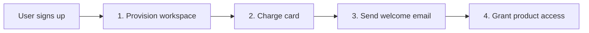
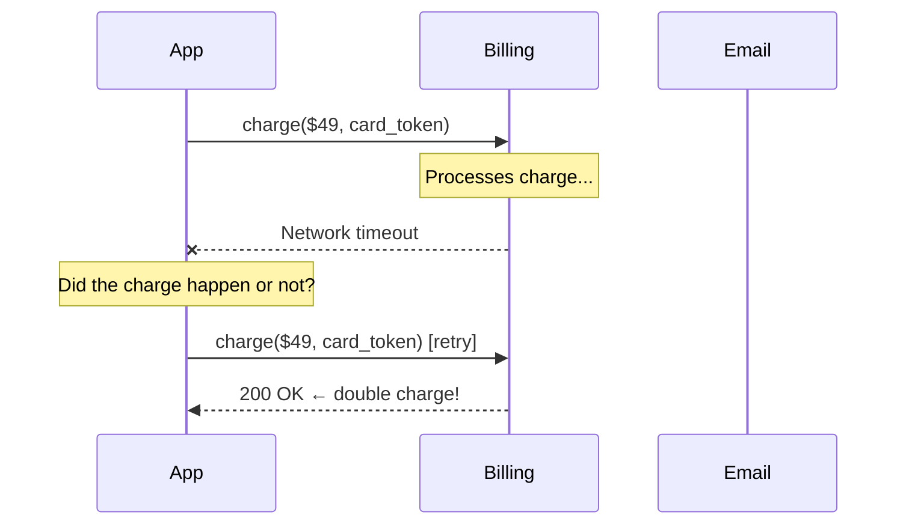
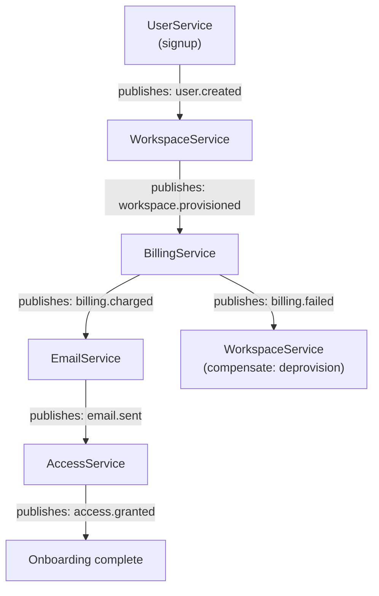
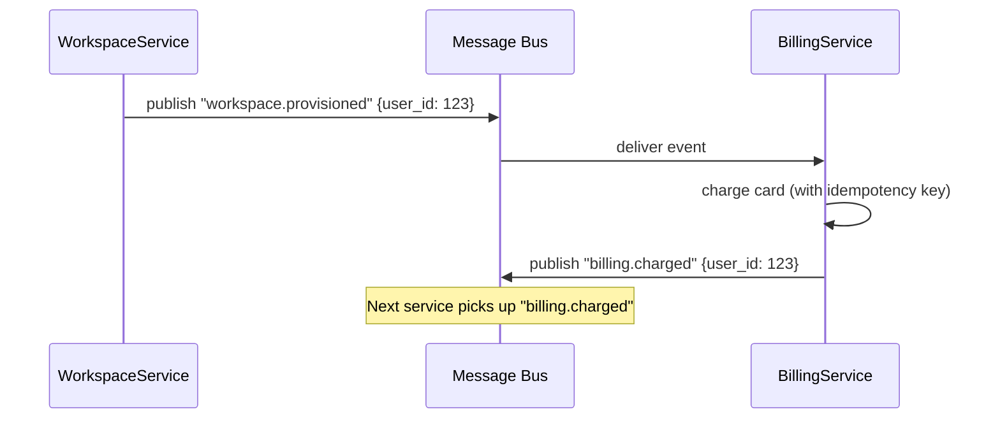
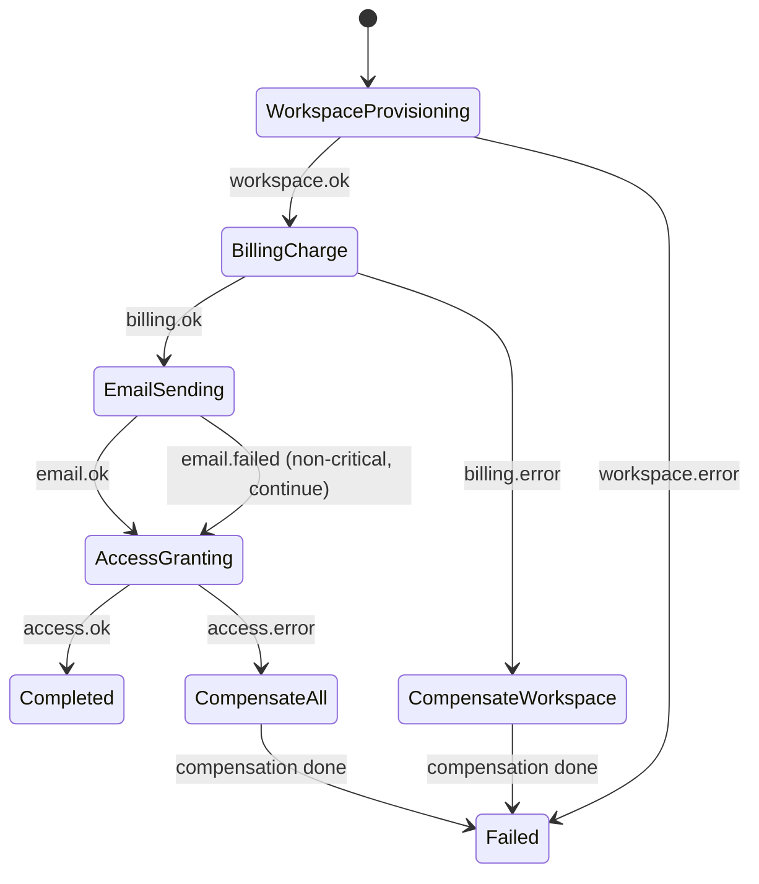
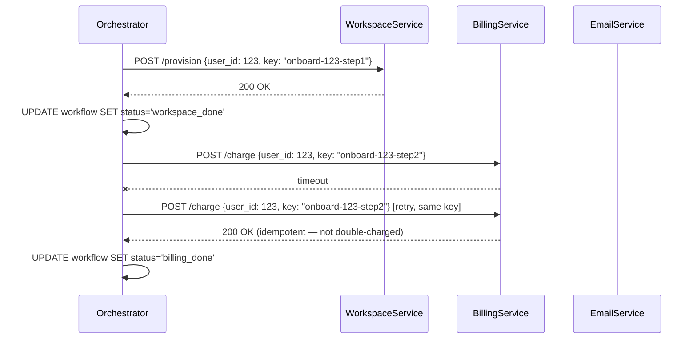
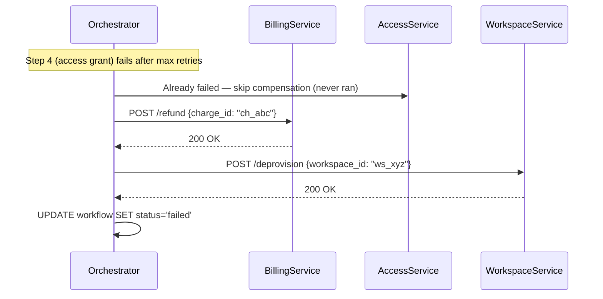
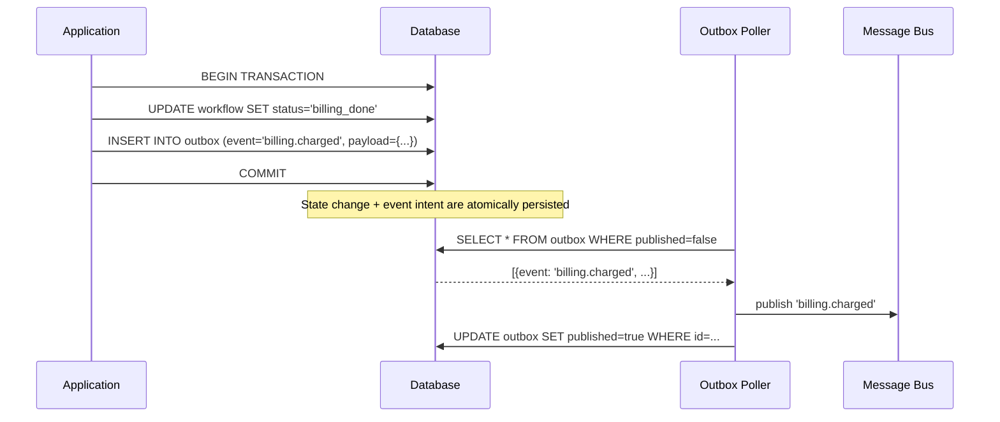
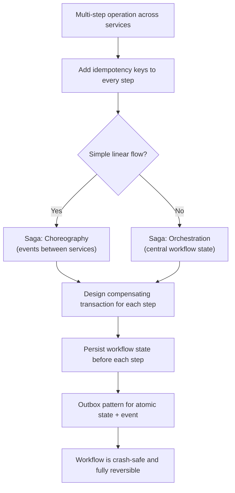

# Multi-step Processes

Goal: recognize when a system design requires coordinating multiple steps across services, and choose the right pattern — from idempotent retries to full saga orchestration — to guarantee the workflow either completes or cleanly undoes itself. A focused pass on sections 1, 2, and 9–11 takes about 15 minutes; a full read is roughly 35–40 minutes.

<!-- SECTION: table-of-contents -->

## Table of Contents

1. [Multi-step Mental Model](#1-multi-step-mental-model)
2. [The Broken Baseline: Naive Sequential Calls](#2-the-broken-baseline-naive-sequential-calls)
3. [Idempotency Keys](#3-idempotency-keys)
4. [Saga: Choreography](#4-saga-choreography)
5. [Saga: Orchestration](#5-saga-orchestration)
6. [Compensating Transactions](#6-compensating-transactions)
7. [Durable State and the Outbox Pattern](#7-durable-state-and-the-outbox-pattern)
8. [How Patterns Compare](#8-how-patterns-compare)
9. [System Design Examples](#9-system-design-examples)
10. [Design Warnings](#10-design-warnings)
11. [Interview Language](#11-interview-language)
12. [Final Mental Model](#12-final-mental-model)
13. [Review Checklist](#13-review-checklist)

<!-- SECTION: mental-model -->

## 1. Multi-step Mental Model

Multi-step process patterns answer one question:

> When a single logical operation spans multiple services or databases, how do we guarantee it fully succeeds — or fully undoes itself — even when steps fail halfway through?

Use a SaaS onboarding flow as the running example throughout this guide:



If step 2 succeeds but step 3 crashes, the user was charged but never got a welcome email or access. If step 3 succeeds but step 4 crashes, the user was charged and emailed but can't log in. Each partial failure is a different broken state — all are bad.

Multi-step design is about:

| Problem | Pattern | Interview phrase |
|---|---|---|
| Retries cause double side effects | Idempotency key | "Same key = same outcome, no matter how many times" |
| Steps across services need coordination | Saga (choreography) | "Services publish events and react to each other" |
| Complex workflow needs a single brain | Saga (orchestration) | "One orchestrator drives every step" |
| A completed step must be reversed | Compensating transaction | "A forward action that undoes a prior step" |
| Orchestrator crash loses progress | Durable state + outbox | "Persist workflow state; atomically couple DB write to event" |

Mental shortcut: **a multi-step operation either fully commits or fully compensates — there is no acceptable in-between state.**

<!-- SECTION: broken-baseline -->

## 2. The Broken Baseline: Naive Sequential Calls

### What it is

The natural approach: call each service in sequence, catch exceptions, move on.

```python
def onboard_user(user_id, plan_id, card_token):
    workspace_service.provision(user_id)          # Step 1
    billing_service.charge(user_id, card_token)   # Step 2
    email_service.send_welcome(user_id)           # Step 3
    access_service.grant(user_id, plan_id)        # Step 4
```

### Why it breaks

Any step can fail in three ways:
- **Definite failure:** service returned an error — didn't execute.
- **Definite success:** service returned 200 — executed.
- **Unknown:** network timeout — *you don't know.*



**Failure scenarios:**

| Step that fails | Broken state |
|---|---|
| Step 1 (provision) | Safe — nothing happened |
| Step 2 (charge) | Workspace created, user not charged |
| Step 3 (email) | Workspace created + charged, no email |
| Step 4 (grant) | Everything done except access — user can't log in |
| Step 2 times out | May or may not be charged — you don't know |

The timeout case is the worst: you can't retry blindly (risk double charge), and you can't skip (user not activated). You need a strategy for all three outcomes.

<!-- SECTION: idempotency -->

## 3. Idempotency Keys

### Why we need it

Retries are unavoidable in distributed systems. The solution isn't to avoid retrying — it's to make retries **safe**. An operation is **idempotent** if calling it once or ten times produces the same result.

### The technical version

The **caller** generates a unique `idempotency_key` before the first attempt. The **server** stores the result of the first successful execution, keyed to that ID. On any retry with the same key, it returns the stored result without re-executing.

```mermaid
sequenceDiagram
    participant App
    participant Billing

    App->>Billing: POST /charge {amount: 49, key: "onboard-u123-step2"}
    Billing-->>App: 200 {status: "charged", charge_id: "ch_abc"}
    Note over Billing: Stores key → result in Redis

    Note over App: Network hiccup; App doesn't know if it succeeded

    App->>Billing: POST /charge {amount: 49, key: "onboard-u123-step2"} [retry]
    Note over Billing: Sees key "onboard-u123-step2" already stored
    Billing-->>App: 200 {status: "charged", charge_id: "ch_abc"} ← same result, no re-charge
```

**Key construction:** tie the key to the logical operation, not just the user. `"{workflow_id}-{step_name}"` or `"{user_id}-{date}-{action}"`.

**Server-side storage:** a fast key-value store (Redis) with a TTL (e.g. 24 hours). On request:
1. Check if key exists → return stored result.
2. If not → execute, store result, return result.

### When to use

- Any state-changing API call that may be retried (charges, provisions, notifications)
- Queue consumer processing — mark messages as processed with an idempotency key
- Every step in a saga

### Limits

Idempotency makes individual steps safe to retry. It does not answer: "what do we do when we're stuck halfway because step 4 keeps failing after step 2 already charged the user?" — that requires a saga.

<!-- SECTION: choreography -->

## 4. Saga: Choreography

### Why we need it

Once individual steps are idempotent, we need to coordinate them. The first saga style: **no central coordinator**. Services react to each other's events directly.

### The technical version

Each service completes its step and publishes a **domain event**. The next service is subscribed to that event and starts its step. Services also publish failure events; prior services listen and compensate.





### When to use

- Simple, mostly-linear workflows
- Services already communicate via a message bus (Kafka, SQS, SNS)
- Teams want low coupling — services don't call each other directly

### Limits

The workflow definition is scattered across every service. Debugging "why didn't the user get access?" means tracing events across four different service logs. Complex branching or parallel steps become hard to reason about. For those cases, use orchestration.

<!-- SECTION: orchestration -->

## 5. Saga: Orchestration

### Why we need it

As workflows grow — parallel steps, conditional branches, retry policies, long waits — choreography's lack of a central view becomes a liability. Orchestration introduces **one service that owns the workflow**.

### The technical version

A dedicated **Saga Orchestrator** (or workflow engine) knows every step, its sequence, and what to do on success or failure. It calls each service explicitly and updates a persisted workflow state after each step.





**What the orchestrator stores:**

```sql
CREATE TABLE workflow_instances (
    id          UUID PRIMARY KEY,
    type        TEXT,        -- "user_onboarding"
    user_id     UUID,
    status      TEXT,        -- "workspace_done", "billing_done", "completed", "failed"
    context     JSONB,       -- data needed by subsequent steps
    updated_at  TIMESTAMPTZ
);
```

On restart after a crash, the orchestrator queries for workflows in non-terminal states and resumes from the last persisted status.

### When to use

- Complex workflows with branching or parallel steps
- Long-running workflows (minutes to days)
- When you need a clear audit trail ("where exactly is this onboarding stuck?")
- When multiple teams need to understand the workflow as a unit

### Choreography vs. Orchestration

| | Choreography | Orchestration |
|---|---|---|
| Workflow definition | Scattered across services | Central in orchestrator |
| Coupling | Low (events only) | Moderate (orchestrator knows all services) |
| Visibility | Hard — trace events across logs | Easy — one status table |
| Debugging | Painful | Straightforward |
| Complexity budget | Simple linear flows | Complex / branching flows |
| Failure handling | Each service publishes failure events | Orchestrator decides: retry, compensate, escalate |

<!-- SECTION: compensating-transactions -->

## 6. Compensating Transactions

### Why we need it

Both choreography and orchestration need a way to "undo" steps that already completed when a later step fails. In a distributed system you can't issue a cross-service `ROLLBACK`. Each service owns its own database.

### The technical version

For every step that causes a visible side effect, design a **compensating transaction** — a forward action that reverses the effect.

| Step | Forward action | Compensating action |
|---|---|---|
| 1 | `provision_workspace(user_id)` | `deprovision_workspace(user_id)` |
| 2 | `charge_card(user_id, $49)` | `refund_card(user_id, $49)` |
| 3 | `send_welcome_email(user_id)` | `send_cancellation_email(user_id)` ← can't un-send; send a new one |
| 4 | `grant_access(user_id, plan)` | `revoke_access(user_id)` |

**Compensate in reverse order.** If steps 1 → 2 → 3 completed and step 4 fails:

```
Compensate: undo step 3 → undo step 2 → undo step 1
```

Never compensate out of order — step 2 may depend on what step 1 created.



### Semantic compensation

Not every step has a true inverse. An email already sent can't be un-sent — you send a follow-up. A database row that was written and read by another process can't be un-seen. This is called **lack of isolation**: sagas trade ACID isolation for distributed availability. Design compensations that are *business-correct*, not mathematically perfect reversals.

### When to use

Every saga — choreography or orchestration — must have compensating transactions designed for each non-idempotent, side-effecting step.

<!-- SECTION: durable-state-outbox -->

## 7. Durable State and the Outbox Pattern

### Why we need it

Two reliability problems remain:

1. **Crash recovery:** if the orchestrator crashes between step 2 and step 3, how does it know to resume at step 3 — not step 1?
2. **Atomicity of state + event:** when the orchestrator writes "step 2 done" to its DB and then publishes an event to Kafka — what if it crashes between the two? DB is updated but the event is never published, so step 3 never starts.

### Part A — Durable state

Persist the workflow status to a database **before** calling the next step. On restart, query for in-progress workflows and resume.

```python
def run_step(workflow_id, step_fn, next_status):
    result = step_fn()                    # call the service
    db.execute(
        "UPDATE workflow_instances SET status = ? WHERE id = ?",
        next_status, workflow_id
    )                                     # persist BEFORE moving on
    return result
```

If the process crashes after calling the service but before writing, the worst case is re-calling the service on restart — which is safe because each service call carries an idempotency key.

### Part B — The Outbox Pattern

Publishing an event and updating DB state are two separate operations. They can't be wrapped in one atomic transaction across DB and Kafka.

**The outbox pattern:** write the event to an `outbox` table **in the same DB transaction** as the state update. A background process reads the outbox and publishes to the message bus.



If the app crashes after COMMIT but before publishing, the poller picks up the unpublished row on the next run. The downstream service handles duplicate delivery with its own idempotency key.

```sql
CREATE TABLE outbox (
    id          UUID DEFAULT gen_random_uuid() PRIMARY KEY,
    event_type  TEXT        NOT NULL,
    payload     JSONB       NOT NULL,
    published   BOOLEAN     DEFAULT false,
    created_at  TIMESTAMPTZ DEFAULT now()
);
```

### When to use

- Any orchestrated workflow that must survive process restarts
- Any event-driven system where "at least once delivery" is required
- High-reliability pipelines (financial transactions, compliance-sensitive workflows)

<!-- SECTION: comparison -->

## 8. How Patterns Compare

| Pattern | Problem solved | Complexity | Best for |
|---|---|---|---|
| Idempotency key | Safe retries | Low | Every API call with side effects |
| Saga — Choreography | Coordinate steps via events | Medium | Simple linear, event-native teams |
| Saga — Orchestration | Central workflow control | High | Complex, branching, long-running |
| Compensating transaction | Undo completed steps | Medium | Every saga with irreversible steps |
| Durable state | Survive orchestrator crashes | Medium | Any long-running workflow |
| Outbox pattern | Atomic state + event | Medium | Event-driven systems needing reliability |

**Decision flow:**

```
1. Can any step be retried? → Add idempotency keys to all steps
2. Steps span multiple services?
   → Simple, linear, event-driven team? → Choreography
   → Complex/branching/need visibility? → Orchestration
3. Any step causes a visible side effect? → Design compensating transactions
4. Workflow must survive crashes? → Durable state
5. Events must reliably trigger downstream? → Outbox pattern
```

<!-- SECTION: examples -->

## 9. System Design Examples

### Example 1: SaaS Onboarding (4 steps, all critical)

**Scenario:** provision workspace → charge card → send email → grant access. All four steps must succeed. If any fails, the user should be left in a clean state.

| Design choice | Rationale |
|---|---|
| Orchestration over choreography | Four steps, all business-critical; need to know where a failed onboarding is stuck |
| Idempotency keys on all four service calls | Safe retries on timeout |
| Compensating transactions: refund + deprovision | If step 3 or 4 fails, reverse steps 2 and 1 |
| Durable workflow state in DB | Resume after crash |
| Outbox for event to next service | Step transitions reliably trigger even if orchestrator restarts |

**Interview line:** "I'd use an orchestrator that persists workflow state before each step and calls each service with an idempotency key. If access grant fails after retries, the orchestrator compensates in reverse — revoke, refund, deprovision."

---

### Example 2: Insurance Claim Processing (Days-long workflow)

**Scenario:** submit claim → fraud check → adjuster review → approve/deny → disburse payment → notify customer. Process takes 2–5 business days.

| Design choice | Rationale |
|---|---|
| Orchestration with durable state | Workflow spans days; must survive multiple restarts |
| Human task steps (adjuster review) | Orchestrator waits for external callback |
| Compensating transactions | If disbursement fails, undo approval status and re-queue for review |
| Outbox + at-least-once notifications | Customer notification must not be lost |

**Interview line:** "A days-long workflow needs an orchestrator backed by persistent state — think Temporal or a home-rolled state machine. Each step is idempotent; the orchestrator polls for stuck workflows and retries with backoff."

---

### Example 3: Multi-vendor Travel Booking

**Scenario:** reserve hotel + reserve rental car + charge card. Three external vendors, each with their own API.

| Approach | Problem |
|---|---|
| Choreography | Each vendor would need to know about the other vendors' failure events — high coupling |
| Orchestration | ✓ Orchestrator calls each vendor, cancels reservations if charge fails |

**Compensating transactions:**

| Step | Forward | Compensate |
|---|---|---|
| Hotel reservation | `POST /reserve` | `DELETE /reservation/{id}` |
| Car reservation | `POST /book` | `POST /cancel/{booking_id}` |
| Card charge | `POST /charge` | `POST /refund/{charge_id}` |

**Interview line:** "I'd use orchestration since steps touch three external APIs and I need to cancel partial reservations on failure. Each cancel is a compensating transaction; the orchestrator runs them in reverse order."

<!-- SECTION: warnings -->

## 10. Design Warnings

| Mistake | Why it hurts | Better answer |
|---|---|---|
| Retrying without idempotency keys | Double side effects on timeout | Generate key at call site; send same key on all retries |
| Compensating in forward order | Later compensations depend on earlier state | Always compensate in reverse step order |
| Long-running step inside a pessimistic lock | Lock held for minutes → contention | Separate the lock acquisition from the long-running work |
| Ignoring "at least once" delivery | Lost events = stuck workflow | Use the outbox pattern; handle duplicates with idempotency |
| No timeout on saga steps | A hung external call blocks the whole workflow | Set per-step timeout; escalate to failed state after N retries |
| Saga without a DLQ / error state | Failed workflows disappear silently | Persist failed workflows; alert on them; provide a retry/skip mechanism |
| Assuming email send can be compensated by deletion | Emails already delivered to inbox | Design semantic undo: send a follow-up cancellation email |
| Orchestration for a two-step process | Overengineering | Two service calls with idempotency keys and a try/compensate block is enough |

<!-- SECTION: interview-language -->

## 11. Interview Language

### Phrases that signal competence

```text
Any time I call an external service that has side effects, I attach an idempotency key —
the same key on all retries so the outcome is always the same.

For a multi-step flow across services, I'd use a saga. I'd choose choreography if the
workflow is simple and the team is already event-driven; orchestration if I need a clear
audit trail or the workflow has branching logic.

For every non-idempotent step, I design a compensating transaction. Compensation always
runs in reverse order because later steps may depend on earlier ones.

I'd persist workflow status before calling each step so the orchestrator can resume
after a crash — and pair each state update with an outbox write so the downstream event
is never lost.
```

### Sample 60-second answer

> For user onboarding, I'd use an orchestrator that drives four steps in sequence: provision, charge, email, grant access. Each service call gets an idempotency key so retries are safe. The orchestrator persists its position after each step, so it can resume if it crashes. If step 4 fails after retries, the orchestrator compensates in reverse: revoke access, refund card, deprovision workspace — in that order. To ensure the event triggering each step isn't lost on restart, I'd use the outbox pattern: the orchestrator writes both the state update and the next event to the database atomically, and a poller publishes the event.

### How this differs from Stability Patterns

| Topic | Question | Patterns |
|---|---|---|
| Multi-step processes | How do we coordinate steps that span services and handle partial failure? | Sagas, idempotency, compensation, outbox |
| Stability | How do we keep a system up when a dependency fails right now? | Timeouts, circuit breaker, bulkheads |

See also: [Stability Patterns](../resilience/stability-patterns.md), [Event-Driven Architecture & Messaging](../messaging-and-apis/event-driven-and-messaging.md).

<!-- SECTION: final-model -->

## 12. Final Mental Model



Use this map:

```text
Idempotency:
  Make every step safe to call more than once.

Choreography:
  Services react to events. No central brain. Simple flows only.

Orchestration:
  One service drives the workflow. Persists state. Decides on failure.

Compensating transaction:
  A forward action that business-correctly reverses a completed step.
  Always in reverse order.

Durable state:
  Persist status before each step. Resume from last known-good state.

Outbox pattern:
  Write state update + event to the same DB transaction.
  Poller publishes the event. Downstream handles duplicates.
```

For system design interviews, the strongest multi-step answer sounds like:

```text
The operation has N steps across M services.
Each step gets an idempotency key so retries are safe.
I'd use [choreography / orchestration] because [reason].
If step K fails, I compensate steps K-1 through 1 in reverse order.
The orchestrator persists state so it survives crashes.
Events triggering next steps go through the outbox so none are lost.
```

Final shortcut: **multi-step processes either fully complete or fully compensate — and idempotency is what makes that survivable under retries and crashes.**

<!-- SECTION: checklist -->

## 13. Review Checklist

Use this checklist to test whether you can explain the topic:

- Can you draw the three failure modes of a sequential service call (failure, success, unknown timeout)?
- Can you explain what an idempotency key is and where it's generated (caller, not server)?
- Can you describe where the server stores idempotency keys and what it does on a duplicate?
- Can you draw a choreography event chain for a 3-step saga?
- Can you explain why choreography gets hard to debug in complex workflows?
- Can you describe what an orchestrator stores in its state table and how it resumes after crash?
- Can you name a situation where you'd choose orchestration over choreography?
- Can you define a compensating transaction and explain why reverse order matters?
- Can you give an example of a step that has no true inverse and how you handle it semantically?
- Can you explain the outbox pattern and what problem it solves (atomic state + event)?
- Can you distinguish multi-step process patterns from contention patterns and stability patterns?

If you remember only one thing:

```text
In distributed systems there is no global ROLLBACK.
Idempotency makes retries safe.
Sagas coordinate the steps.
Compensating transactions undo the ones that can't be rolled back.
Durable state + outbox make the whole thing crash-proof.
```
