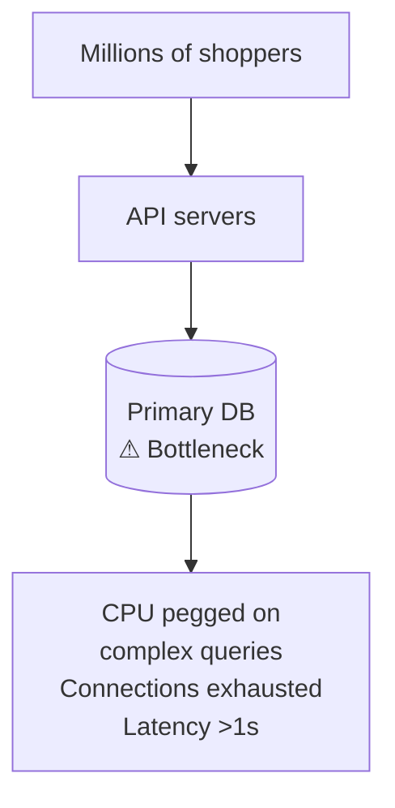
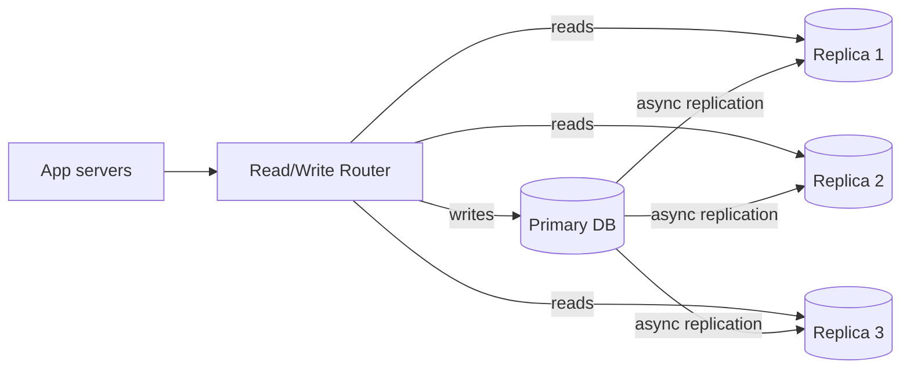
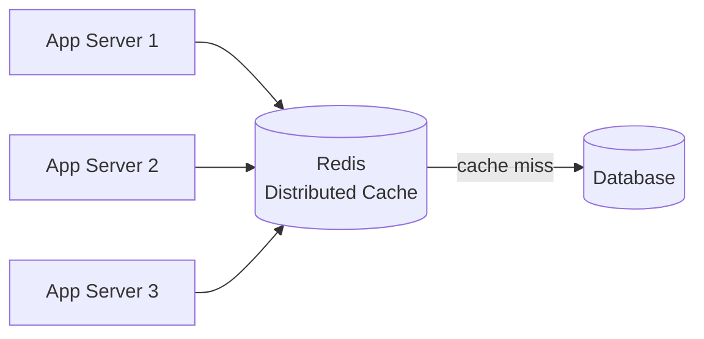
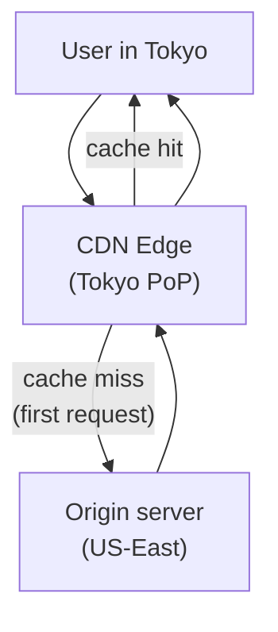
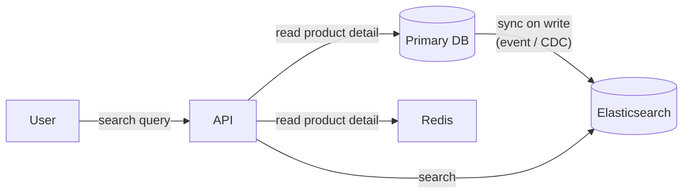
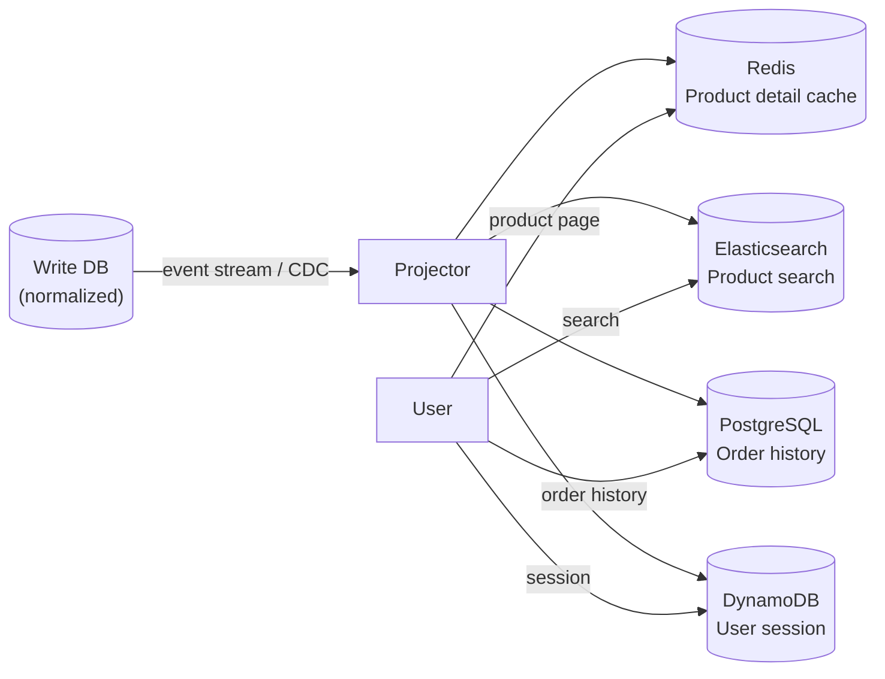
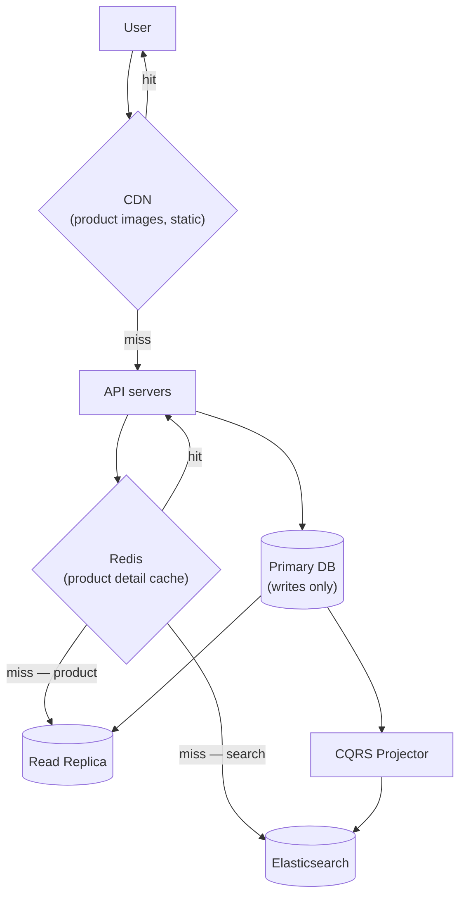
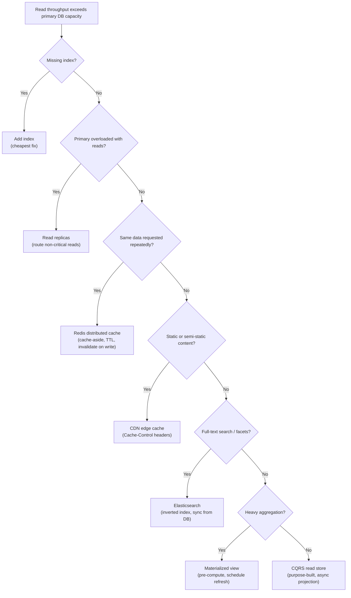

# Scaling Reads

Goal: recognize when read throughput is the bottleneck in a system design interview and apply the right technique — from indexes to CDNs to purpose-built read stores — before the primary database becomes the ceiling. A focused pass on sections 1, 2, and 10–12 takes about 15 minutes; a full read is roughly 35–40 minutes.

<!-- SECTION: table-of-contents -->

## Table of Contents

1. [Read Scaling Mental Model](#1-read-scaling-mental-model)
2. [The Bottleneck: What Breaks Under Read Load](#2-the-bottleneck-what-breaks-under-read-load)
3. [Foundation: Database Indexes](#3-foundation-database-indexes)
4. [Read Replicas](#4-read-replicas)
5. [Application-Level Cache (In-Process)](#5-application-level-cache-in-process)
6. [Distributed Cache (Redis)](#6-distributed-cache-redis)
7. [CDN and Edge Caching](#7-cdn-and-edge-caching)
8. [Search Index (Elasticsearch)](#8-search-index-elasticsearch)
9. [Materialized Views and Pre-Computed Aggregations](#9-materialized-views-and-pre-computed-aggregations)
10. [CQRS: Purpose-Built Read Store](#10-cqrs-purpose-built-read-store)
11. [How Techniques Compose](#11-how-techniques-compose)
12. [System Design Examples](#12-system-design-examples)
13. [Design Warnings](#13-design-warnings)
14. [Interview Language](#14-interview-language)
15. [Final Mental Model](#15-final-mental-model)
16. [Review Checklist](#16-review-checklist)

<!-- SECTION: mental-model -->

## 1. Read Scaling Mental Model

Read scaling answers one question:

> When read traffic exceeds what the primary database can serve, how do we serve more reads without increasing load on the primary — or replace the primary entirely for specific access patterns?

Use an **e-commerce product catalog** as the running example: millions of users browsing product detail pages, searching for items, viewing recommendations, and checking availability. Reads outnumber writes by 100:1 or more.



Read scaling design is about:

| Problem | Technique | Interview phrase |
|---|---|---|
| Query scans full table | Index | "One B-tree lookup instead of a full scan" |
| Primary handles too many read connections | Read replicas | "Route reads to replicas, writes to primary" |
| Same data fetched repeatedly | Application cache | "In-process LRU, avoid the DB entirely" |
| Cache must be shared across servers | Redis | "Distributed cache, single source of cached truth" |
| Static/semi-static content travels far | CDN | "Serve from edge, primary never sees the request" |
| Complex search / full-text queries | Search index | "Inverted index in Elasticsearch, not a DB table scan" |
| Aggregation is expensive to recompute | Materialized view | "Compute once on write, serve instantly on read" |
| Read shape ≠ write shape | CQRS read model | "Purpose-built read store, shaped for the query" |

Mental shortcut: **every read scaling technique moves data closer to the reader or avoids hitting the primary altogether.**

<!-- SECTION: bottleneck -->

## 2. The Bottleneck: What Breaks Under Read Load

### Why reads can crush a database

A read-heavy system fails in different ways than a write-heavy one:

| Symptom | Root cause |
|---|---|
| Query latency spikes | Full table scans, missing indexes |
| Connection pool exhausted | Too many concurrent readers, slow queries hold connections |
| CPU pegged on DB node | Complex JOINs, sorts, aggregations, no caching |
| Replication lag grows | Heavy primary reads compete with write replication |
| Cache miss storms | Cache expires simultaneously → all reads hit DB at once |

For an e-commerce catalog serving 50,000 product page views per second, even 10ms average DB query time means 500 concurrent connections constantly in use. Connection limits (PostgreSQL default: 100) become the ceiling long before disk I/O does.

### The read scaling ladder

Apply in roughly this order — each technique is cheaper and simpler than the next:

```
Index → Read replicas → App cache → Redis → CDN → Search index → Materialized view → CQRS
```

Always start with the simplest thing that addresses the bottleneck. Don't jump to CQRS before checking whether an index would solve it.

<!-- SECTION: indexes -->

## 3. Foundation: Database Indexes

### Why we need it

Before adding any infrastructure, verify the DB query itself is optimal. A missing index on a 10M-row table turns a 1ms query into a 10-second full scan. No cache helps if the uncached query is so slow it times out.

### The technical version

An index is a B-tree (or hash) that maps column values to row locations — a sorted shortcut that avoids scanning every row.

```sql
-- Slow: full table scan on 10M products
SELECT * FROM products WHERE category_id = 42 AND active = true;

-- Add a composite index
CREATE INDEX idx_products_category_active ON products(category_id, active);

-- Now: O(log N) B-tree lookup → microseconds
```

**Key rules:**

| Rule | Why |
|---|---|
| Index columns in WHERE, JOIN, ORDER BY | These are the access patterns indexes serve |
| Composite index: most selective column first | Narrows the result set fastest |
| Index reads are cheap; index writes are not | Every write must update all covering indexes |
| Covering index = includes all selected columns | Avoids a "table heap fetch" after the index lookup |

```sql
-- Covering index: query fulfilled entirely from the index, never touches the row
CREATE INDEX idx_products_cover
ON products(category_id, active)
INCLUDE (name, price, image_url);
```

### When to use

Always, first. Query plan analysis (`EXPLAIN ANALYZE`) before adding any read scaling infrastructure.

### Limits

Indexes don't help:
- Low-cardinality columns (e.g. `boolean active` alone) — too few distinct values
- `LIKE '%keyword%'` full-text search — use a search index instead
- Aggregations over millions of rows — use materialized views or pre-aggregation

<!-- SECTION: read-replicas -->

## 4. Read Replicas

### Why we need it

Once queries are optimized, the next limit is connection count and CPU on the primary. **Read replicas** are exact copies of the primary that serve read-only queries. The primary handles writes only.

### The technical version



**Routing reads to replicas:**

```python
def get_product(product_id):
    # Route read to replica
    return replica_pool.query(
        "SELECT * FROM products WHERE id = ?", product_id
    )

def update_price(product_id, new_price):
    # Writes always go to primary
    primary.execute(
        "UPDATE products SET price = ? WHERE id = ?", new_price, product_id
    )
```

**Replication lag:** replicas receive updates asynchronously. Between a write and its replication, a replica may return stale data. Typical lag: < 100ms on a healthy cluster. Under heavy write load: seconds.

| Read type | Route to |
|---|---|
| User's own recent write (e.g. profile update) | Primary (or wait for sync replica) |
| Browse, search, product detail | Replica — slight staleness acceptable |
| Checkout availability check | Primary — must be current |
| Analytics / reports | Replica or dedicated analytics replica |

### When to use

- Read:write ratio > 5:1
- Primary CPU > 50% from read queries
- Need geographic read distribution (replica per region)

### Limits

- **Replication lag** means replicas may be slightly stale — not suitable for read-your-own-write consistency without extra logic.
- **Replicas don't help with write scaling** — all writes still go to the primary.
- More replicas = more replication load on the primary's network.

<!-- SECTION: app-cache -->

## 5. Application-Level Cache (In-Process)

### Why we need it

Even with replicas, a popular product page may receive 10,000 requests/sec for the same product ID. If each request hits a replica, that's 10,000 DB queries for identical data. An **in-process cache** serves repeated reads from memory — zero network hops, zero DB queries.

### The technical version

An in-process LRU (Least Recently Used) cache lives inside each application server's memory. On cache hit: return immediately. On cache miss: query DB, store result, return.

```python
from cachetools import LRUCache, TTLCache

# LRU: evicts least-recently-used items when full
product_cache = TTLCache(maxsize=10_000, ttl=60)  # 10k items, 60s TTL

def get_product(product_id):
    if product_id in product_cache:
        return product_cache[product_id]   # cache hit: ~microseconds
    product = db.query("SELECT * FROM products WHERE id = ?", product_id)
    product_cache[product_id] = product   # cache miss: store for next time
    return product
```

**Cache hit ratio** is the key metric. A 95% hit ratio on 10k req/sec means only 500 req/sec reach the DB — a 20× reduction.

### When to use

- Small, hot working set that fits in memory (top 10k products, active session data)
- Single-server deployments or when data can be stale per-process
- Ultra-low latency required (microseconds, not milliseconds)

### Limits

- **Inconsistency across servers:** each server has its own cache. An update to product_id=99 invalidates the cache on server A but not B, C, D. Users may see different data.
- **Wasted memory per server:** 10 app servers × 10k items = 10× the memory for the same data.
- **On restart, cache is cold:** all traffic hits the DB until cache warms up.

<!-- SECTION: redis -->

## 6. Distributed Cache (Redis)

### Why we need it

In-process caches create inconsistency across servers. A **distributed cache** (Redis) is a shared cache — all app servers read and write to the same store. An invalidation on one server is seen by all.

### The technical version



**Cache-aside pattern (most common):**

```python
def get_product(product_id):
    key = f"product:{product_id}"
    cached = redis.get(key)
    if cached:
        return deserialize(cached)           # hit: ~0.5ms
    product = db.query("...", product_id)    # miss: ~5ms
    redis.setex(key, 60, serialize(product)) # store with 60s TTL
    return product

def update_product(product_id, data):
    db.execute("UPDATE products ...", data)
    redis.delete(f"product:{product_id}")    # invalidate on write
```

**Write strategies:**

| Strategy | How | When |
|---|---|---|
| Cache-aside (lazy) | Read: check cache, miss → DB → cache. Write: update DB, invalidate cache | Most common. Simple. Slight inconsistency window on update. |
| Write-through | Write to cache and DB simultaneously | Always-fresh cache. Higher write latency. |
| Write-behind (write-back) | Write to cache; async flush to DB | Fastest writes. Risk of data loss if cache fails before flush. |

**The thundering herd problem:** when a popular cached item expires, thousands of simultaneous requests all miss and hit the DB at once.

Solutions:
- **Cache lock:** first miss acquires a lock, fetches from DB, sets cache. Others wait for the lock.
- **Staggered TTL:** add jitter to TTL (`base_ttl + random(0, 30)`) so popular items don't all expire simultaneously.
- **Probabilistic early expiration:** refresh the cache slightly before TTL expires.

### When to use

- Multiple app servers sharing cached state
- Session data, user preferences, product catalog, leaderboards
- Rate limiting counters (Redis `INCR` + `EXPIRE`)

### Limits

- **Redis is now a critical dependency** — plan for Redis HA (Sentinel or Cluster).
- **Cache invalidation is hard** — stale reads are possible in the window between DB write and cache delete.
- **Not suitable for large objects** — Redis is in-memory; storing 100MB blobs defeats the purpose. See [Large Blobs](large-blobs.md).

<!-- SECTION: cdn -->

## 7. CDN and Edge Caching

### Why we need it

Even Redis has latency: ~0.5ms for a nearby Redis node. For a user in Sydney hitting a Redis node in US-East, that's 200ms. And Redis still serves from a central location. A **CDN** pushes content to edge servers worldwide — reads are served from the nearest PoP (Point of Presence), often in < 5ms.

### The technical version



**What CDNs cache well:**

| Content | CDN cacheable? | TTL |
|---|---|---|
| Product images, static assets | ✓ | Days to weeks |
| Product detail page (HTML) | ✓ if same for all users | Minutes |
| Personalized pages (cart, recommendations) | ✗ | Not cacheable |
| API responses with `Cache-Control` headers | ✓ | Seconds to minutes |
| User session data | ✗ | Never |

**Cache-Control headers tell CDNs how long to cache:**

```http
Cache-Control: public, max-age=300, stale-while-revalidate=60
```

- `max-age=300`: serve from CDN for up to 5 minutes
- `stale-while-revalidate=60`: serve stale for 1 minute while refreshing in background

**CDN invalidation:** push an invalidation request to the CDN to evict a specific URL immediately (e.g. after a product price change).

### When to use

- Static assets (images, CSS, JS) — always
- Product catalog pages with moderate update frequency
- Global user base (CDN reduces latency to international users dramatically)
- High read traffic that can tolerate seconds-to-minutes of staleness

### Limits

- **Not suitable for real-time data** — a CDN TTL of 30s means users may see 30-second-old data.
- **Personalized content** can't be cached by a shared CDN (unless you use edge workers or vary by cookie).
- **CDN cache invalidation can take time** — propagating a purge to thousands of edge nodes isn't instantaneous.

<!-- SECTION: search -->

## 8. Search Index (Elasticsearch)

### Why we need it

SQL `LIKE '%keyword%'` is a full table scan. Sorting by relevance, fuzzy matching misspellings, faceted filtering (filter by brand AND price AND rating simultaneously) — these are all expensive or impossible in a traditional relational DB. A **search index** is purpose-built for these access patterns.

### The technical version

A search engine builds an **inverted index**: for each word (token), it stores a list of documents containing that word. Lookups are O(1) per token.

```
Token: "running"  → [product:42, product:107, product:8821, ...]
Token: "shoes"    → [product:42, product:55, product:8821, ...]
Query: "running shoes" → intersection: [product:42, product:8821]
```

**Elasticsearch example for product search:**

```json
GET /products/_search
{
  "query": {
    "bool": {
      "must": { "match": { "description": "running shoes" }},
      "filter": [
        { "term": { "category": "footwear" }},
        { "range": { "price": { "gte": 50, "lte": 150 }}}
      ]
    }
  },
  "aggs": {
    "by_brand": { "terms": { "field": "brand" }}
  }
}
```

This query does full-text search + category filter + price range + facet aggregation in a single request — milliseconds on billions of documents.

**Data flow:** the DB is still the source of truth. Elasticsearch is a read replica shaped for search.



### When to use

- Full-text search (product names, descriptions, reviews)
- Faceted filtering with many dimensions
- Autocomplete / type-ahead
- Fuzzy matching (typo tolerance)
- Log and event analytics at scale

### Limits

- **Eventually consistent** — ES index lags the DB by seconds. Don't use it for checkout availability.
- **Operational complexity** — separate cluster, index mappings, sync pipeline.
- **Not a replacement for the DB** — use ES for search, DB for transactional reads.

<!-- SECTION: materialized-views -->

## 9. Materialized Views and Pre-Computed Aggregations

### Why we need it

Some queries are expensive to compute on every request: "total sales this month by category," "top 100 products by rating," "how many users are active today." These aggregations scan millions of rows. Computing them at read time is slow and hammers the DB.

**Materialized views** compute the result once and cache it as a table. Reads are O(1) lookups.

### The technical version

**Database materialized view (PostgreSQL):**

```sql
-- Define the materialized view
CREATE MATERIALIZED VIEW product_stats AS
SELECT
    p.category_id,
    COUNT(*)           AS product_count,
    AVG(r.rating)      AS avg_rating,
    SUM(s.units_sold)  AS total_sold
FROM products p
JOIN reviews r  USING (product_id)
JOIN sales   s  USING (product_id)
GROUP BY p.category_id;

-- Refresh on a schedule (e.g. every 5 minutes)
REFRESH MATERIALIZED VIEW CONCURRENTLY product_stats;

-- Read is instant: single-row lookup per category
SELECT avg_rating FROM product_stats WHERE category_id = 42;
```

**Application-level pre-aggregation:** a background job runs heavy queries and writes results to a summary table.

```python
# Runs every 5 minutes via cron / scheduler
def refresh_category_stats():
    stats = db.query("""
        SELECT category_id, COUNT(*), AVG(rating), SUM(units_sold)
        FROM products JOIN reviews USING(product_id) JOIN sales USING(product_id)
        GROUP BY category_id
    """)
    db.execute("TRUNCATE category_stats")
    db.bulk_insert("category_stats", stats)
```

**When freshness matters:** adjust the refresh interval to the acceptable staleness for the use case. Leaderboards can be 60s stale; financial reports probably can't.

### When to use

- Dashboards and reporting queries that are slow to compute
- Leaderboards, rankings, recommendation scores
- Any aggregation query that appears on high-traffic pages
- Analytics that can tolerate slight staleness

### Limits

- **Staleness** proportional to refresh interval. Not suitable for real-time data.
- **Refresh cost** — `REFRESH MATERIALIZED VIEW` briefly locks the view (use `CONCURRENTLY` to avoid this in PostgreSQL).
- **Maintenance overhead** — views must be refreshed; if the refresh pipeline fails, data goes stale silently.

<!-- SECTION: cqrs-read -->

## 10. CQRS: Purpose-Built Read Store

### Why we need it

When the read shape is fundamentally different from the write shape — and no amount of indexing, caching, or materialization makes the primary DB fast enough — a **dedicated read store** shaped specifically for the query pattern is the answer.

### The technical version

A CQRS read store is a completely separate data store, populated asynchronously from the write store, shaped for the exact queries it serves.



**Each read store is chosen for its access pattern:**

| Query | Read store | Why |
|---|---|---|
| Full-text product search + facets | Elasticsearch | Inverted index, facet aggregation |
| Product detail page | Redis | Sub-millisecond key-value lookup |
| Order history (sorted by date) | PostgreSQL replica | Range queries with index |
| User session | DynamoDB | Low-latency key-value at scale |
| Category stats | Materialized view | Pre-aggregated, O(1) read |

### When to use

- No single DB technology handles all read patterns efficiently
- Read:write ratio is very high and read latency is critical
- Different parts of the system need radically different consistency / latency tradeoffs
- You're already using CQRS for the write side

### Limits

- **Eventual consistency** — projectors lag behind the write store. All reads are slightly stale.
- **Complexity** — multiple data stores, a sync/projection pipeline, schema evolution.
- **Fan-out** — one write event triggers updates to many read stores. Projector failures must be handled idempotently.

<!-- SECTION: compose -->

## 11. How Techniques Compose

In a mature e-commerce system, all layers work together:



**Layered responsibilities:**

| Layer | Technique | What it offloads from the primary |
|---|---|---|
| CDN | Edge cache | All static asset reads; semi-static page reads |
| Redis | Distributed cache | Hot product detail, session data |
| Read replica | DB replica | All non-write-critical reads |
| Elasticsearch | Search index | Full-text + faceted queries |
| Materialized view | Pre-aggregation | Heavy aggregation queries |
| CQRS read stores | Purpose-built | Queries that don't fit any above |

<!-- SECTION: examples -->

## 12. System Design Examples

### Example 1: Product Catalog (50k req/sec, mostly reads)

**Scenario:** 10M product catalog, 50,000 page views/sec, 99% reads.

| Layer | Choice | Rationale |
|---|---|---|
| Product images | CDN (CloudFront) | Static; global users; never hits origin after first load |
| Product detail API | Redis cache, 60s TTL | 95% cache hit rate → 2,500 DB queries/sec instead of 50k |
| Search | Elasticsearch | Full-text + facets; can't do this with SQL LIKE |
| Inventory (checkout) | Primary DB | Must be real-time; no caching |
| Category stats | Materialized view, refresh 5min | Dashboard aggregation, no need for real-time |

**Interview line:** "Product pages get a Redis cache with a 60s TTL. Product images go to a CDN. Search uses Elasticsearch. The primary DB only sees writes and checkout inventory checks."

---

### Example 2: Social Feed Read Path (Fan-out on Read vs. Write)

**Scenario:** news feed showing posts from followed accounts. 10M users, average 500 follows.

| Approach | Write cost | Read cost | Best for |
|---|---|---|---|
| Fan-out on write | On post: write to each follower's feed table (N writes) | O(1): `SELECT FROM feed WHERE user_id=?` | Users with < 10k followers |
| Fan-out on read | On post: write once. On feed load: JOIN posts from all followed users | O(follows): expensive JOIN | Low-follower accounts |
| Hybrid | Fan-out on write for normal users; fan-in on read for high-follower accounts | Mixed | Most production systems |

**Interview line:** "I'd use fan-out on write for users with < 5k followers — pre-build each user's feed at write time so reads are instant. For celebrity accounts with millions of followers, fan-out on write is too expensive; I'd merge their posts at read time from a small high-follower cache."

---

### Example 3: Analytics Dashboard (Heavy Aggregation)

**Scenario:** merchant dashboard showing sales by category, region, time — updated every 5 minutes.

| Option | Problem | Solution |
|---|---|---|
| Real-time SQL aggregation | Scans millions of orders per page load | Too slow |
| Materialized view, refresh 5min | ✓ Pre-computed; page load is O(1) | |
| CQRS read store (separate analytics DB) | ✓ Dedicated analytics replica, no impact on transactional DB | |

**Interview line:** "Merchant analytics can tolerate 5-minute staleness — I'd use a materialized view refreshed on a cron schedule. For real-time analytics at scale, I'd use a dedicated OLAP store like ClickHouse, fed from the event stream."

<!-- SECTION: warnings -->

## 13. Design Warnings

| Mistake | Why it hurts | Better answer |
|---|---|---|
| Adding Redis before checking indexes | Cache hides a slow query that will still bite you under cache miss storms | `EXPLAIN ANALYZE` first; fix query plan before caching |
| Caching with no TTL | Stale data served indefinitely; cache never reflects updates | Always set TTL; invalidate explicitly on write |
| Single Redis instance with no HA | Cache outage → all reads hit DB simultaneously → cascade | Redis Sentinel or Cluster for production |
| Routing all reads to primary | Defeats the purpose of replicas | Route non-critical reads to replicas; use primary only for write-critical reads |
| CDN for personalized content | Users see each other's data | Only CDN-cache public, user-agnostic content |
| Elasticsearch as source of truth | ES index can lag or become inconsistent | DB is always authoritative; ES is a derived read index |
| Thundering herd on cache expiry | All keys expire at the same time → DB spike | Jitter TTLs; use stale-while-revalidate |
| Fan-out on write for celebrities | 10M follower writes per post | Hybrid: fan-out for normal, fan-in for high-follower |

<!-- SECTION: interview-language -->

## 14. Interview Language

### Phrases that signal competence

```text
Before adding any infrastructure, I'd check the query plan — a missing index often
explains 10× latency and costs nothing to fix.

I'd add read replicas to offload the primary. Reads that can tolerate slight staleness
(browse, search) go to replicas; inventory checks and checkout go to the primary.

For high-traffic hot data — product detail pages — I'd add a Redis cache with a 60s TTL
and cache-aside pattern. On write, I invalidate the key. Thundering herd is mitigated
with jittered TTLs and stale-while-revalidate.

Product images and static assets go to a CDN — they never reach the origin server after
the first request.

For full-text search with faceted filtering, SQL can't do this efficiently. I'd use
Elasticsearch as a read index, kept in sync from the primary via CDC or event stream.

For heavy aggregation queries on dashboards, I'd use a materialized view refreshed on a
schedule — the read is instant, we just accept N-minute staleness.
```

### Sample 60-second answer

> For a product catalog at 50k reads/sec, I'd layer the solution. First, check indexes — every query should use an index, not a full scan. Product images and JS/CSS go to a CDN; they never touch the backend. Product detail pages hit a Redis cache first — 95% cache hit rate drops effective DB load to ~2,500 req/sec, which two or three replicas handle easily. Full-text product search goes to Elasticsearch, kept in sync from the primary via the write event stream. For the merchant analytics dashboard, a materialized view refreshed every 5 minutes gives sub-millisecond reads. The primary database only sees writes and real-time inventory checks at checkout.

### How this differs from Scaling Writes

| Topic | Question | Key techniques |
|---|---|---|
| Scaling reads | How do we serve data out faster without crushing the primary? | Replicas, cache, CDN, search index, CQRS read store |
| Scaling writes | How do we get data in faster? | Queues, batching, sharding, LSM, CQRS write side |

See also: [Scaling Writes](scaling-writes.md), [Caching Patterns](../caching-and-scale/caching-patterns.md), [Sharding & Partitioning](../databases/sharding-partitioning.md).

<!-- SECTION: final-model -->

## 15. Final Mental Model



```text
Index:               Zero infrastructure. Always check first.
Read replicas:       Move reads off the primary. One DB connection pool per replica.
Redis cache:         Shared in-memory layer. Cache-aside. TTL + invalidation.
CDN:                 Serve from the edge. Never reach origin for static content.
Elasticsearch:       Full-text search, facets, fuzzy match. Derived from DB.
Materialized view:   Pre-compute heavy aggregations. Acceptable staleness.
CQRS read store:     Shape data for the exact query. Purpose-built per access pattern.
```

For interviews, the strongest read scaling answer sounds like:

```text
The read bottleneck is [missing index / primary overloaded / same data repeated / expensive aggregation].
I'd address it with [index / replica / Redis / CDN / ES / materialized view].
The staleness tradeoff is [real-time / seconds / minutes].
I'd still route [checkout / inventory / write-critical reads] to the primary.
```

Final shortcut: **read scaling is about serving data from somewhere closer to the reader than the primary database — and making sure the primary only sees reads it absolutely must.**

<!-- SECTION: checklist -->

## 16. Review Checklist

- Can you explain what `EXPLAIN ANALYZE` shows and what a "full table scan" means?
- Can you write a composite index and explain column ordering?
- Can you draw the read replica topology and explain replication lag?
- Can you name two scenarios where you'd route reads to the primary instead of a replica?
- Can you describe the cache-aside pattern with code (get → miss → DB → set)?
- Can you explain the thundering herd problem and two ways to mitigate it?
- Can you explain what `Cache-Control: public, max-age=300, stale-while-revalidate=60` does?
- Can you describe what an inverted index is and why `LIKE '%keyword%'` doesn't use an index?
- Can you explain how Elasticsearch stays in sync with the primary DB?
- Can you define a materialized view and explain when to use `REFRESH CONCURRENTLY`?
- Can you draw a CQRS read topology with three different read stores?
- Can you explain fan-out on write vs. fan-out on read and when each is appropriate?
- Can you distinguish read scaling techniques from write scaling techniques?

If you remember only one thing:

```text
Read scaling moves data closer to the reader.
Index → replica → cache → CDN → search index → materialized view → CQRS read store.
Start with the simplest thing that addresses the actual bottleneck.
The primary DB should only see writes and reads that absolutely must be real-time.
```
