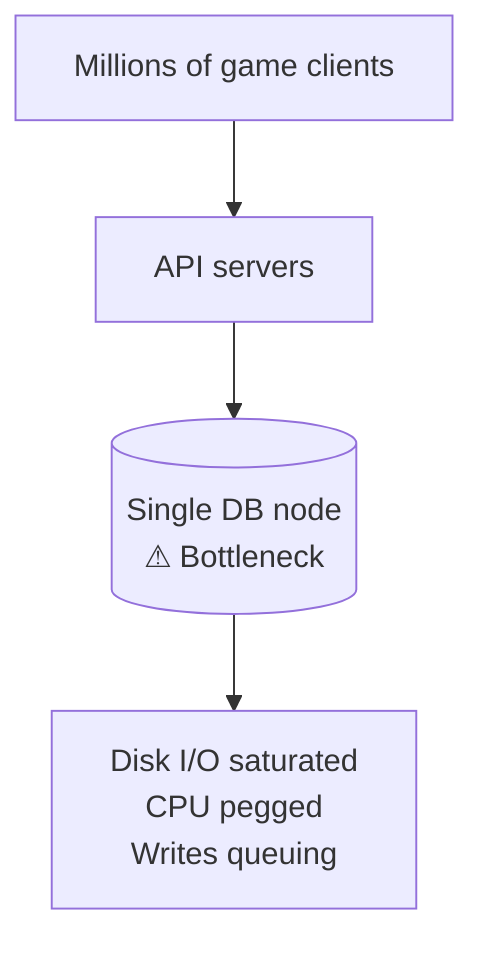
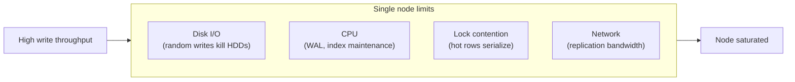
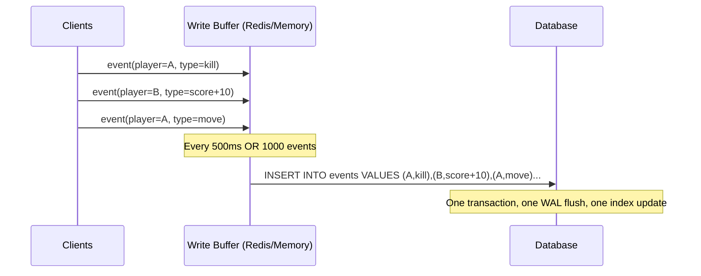
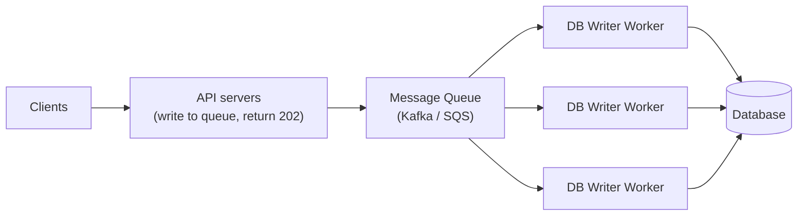
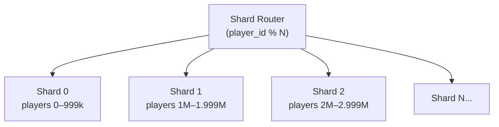
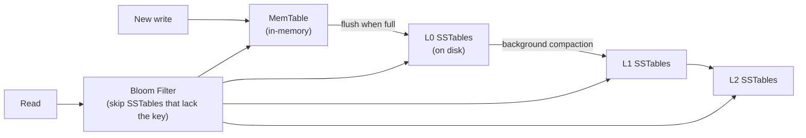
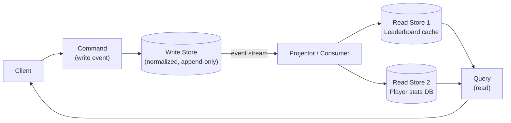
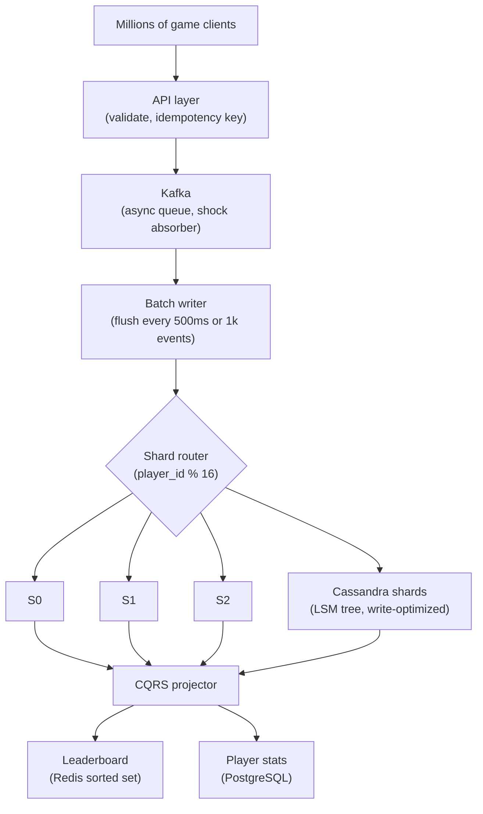
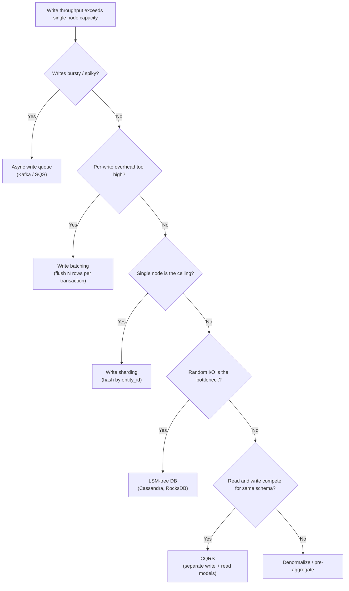

# Scaling Writes

Goal: recognize when write throughput is the bottleneck in a system design interview and apply the right technique — from batching to sharding to write-optimized data structures — before a single node becomes the ceiling. A focused pass on sections 1, 2, and 9–11 takes about 15 minutes; a full read is roughly 35–40 minutes.

<!-- SECTION: table-of-contents -->

## Table of Contents

1. [Write Scaling Mental Model](#1-write-scaling-mental-model)
2. [The Bottleneck: Single-Node Write Limits](#2-the-bottleneck-single-node-write-limits)
3. [Write Batching and Buffering](#3-write-batching-and-buffering)
4. [Async Write Queue](#4-async-write-queue)
5. [Write Sharding (Horizontal Partitioning)](#5-write-sharding-horizontal-partitioning)
6. [Write-Optimized Data Structures (LSM Trees)](#6-write-optimized-data-structures-lsm-trees)
7. [CQRS: Separate Write and Read Models](#7-cqrs-separate-write-and-read-models)
8. [Denormalization and Pre-aggregation](#8-denormalization-and-pre-aggregation)
9. [How Techniques Compose](#9-how-techniques-compose)
10. [System Design Examples](#10-system-design-examples)
11. [Design Warnings](#11-design-warnings)
12. [Interview Language](#12-interview-language)
13. [Final Mental Model](#13-final-mental-model)
14. [Review Checklist](#14-review-checklist)

<!-- SECTION: mental-model -->

## 1. Write Scaling Mental Model

Write scaling answers one question:

> When write traffic exceeds what a single database node can sustain, how do we distribute, defer, or restructure writes to stay under hardware limits?

Use a **real-time game event tracking** system as the running example: millions of players simultaneously emitting match events (kills, power-ups, position updates, score changes). Each event is a write. Each leaderboard update requires a write. A naive single-node DB collapses under this load.



Write scaling design is about:

| Problem | Technique | Interview phrase |
|---|---|---|
| Single DB can't absorb all writes | Write batching | "Accumulate and flush in groups" |
| Writes block user response | Async queue | "Decouple write from acknowledgment" |
| One node can't handle total volume | Write sharding | "Spread writes across N partitions" |
| B-tree random I/O is the ceiling | LSM-tree DB | "Sequential append, compact later" |
| Write path and read path fight for resources | CQRS | "Separate models, separate stores" |
| Joins at write time are cheaper than at read time | Denormalization | "Pre-join on write, serve flat on read" |

Mental shortcut: **every write scaling technique either reduces write volume, defers it, or spreads it across more hardware.**

<!-- SECTION: bottleneck -->

## 2. The Bottleneck: Single-Node Write Limits

### What limits a single node

A typical PostgreSQL primary on commodity hardware saturates at roughly:

| Resource | Approximate ceiling |
|---|---|
| Disk IOPS (HDD) | ~200 random writes/sec |
| Disk IOPS (SSD) | ~10,000–50,000 writes/sec |
| Network bandwidth | ~1–10 Gbps |
| CPU for WAL + index maintenance | Scales with core count |
| Lock contention on hot rows | Serialized — 1 writer at a time per row |

For game events at 100,000 writes/sec, even a high-end NVMe SSD DB node is near its limit. With B-tree index maintenance, WAL writes, and replication lag, real throughput is often 5–10× lower than theoretical peaks.

### What the interviewer is probing

When an interviewer asks "how does this scale to 10M users?" for a write-heavy system, they want to see:
1. You identify *where* the bottleneck is (DB disk I/O, hot row contention, index maintenance)
2. You apply the right technique at the right layer
3. You acknowledge the tradeoff (consistency, latency, complexity)



<!-- SECTION: batching -->

## 3. Write Batching and Buffering

### Why we need it

Each individual write carries overhead: network round-trip, WAL flush, index update, fsync. If you can group 1,000 writes into one DB operation, you pay the overhead once instead of 1,000 times.

### The technical version

**In-memory write buffer:** accumulate writes in memory (per-process or in a shared cache like Redis), then flush to the DB on a schedule or when the buffer reaches a size threshold.



**Batch INSERT vs. individual INSERT:**

```sql
-- Slow: 1000 round-trips, 1000 WAL flushes
INSERT INTO game_events (player_id, type, ts) VALUES (1, 'kill', now());
INSERT INTO game_events (player_id, type, ts) VALUES (2, 'score', now());
-- ... 998 more

-- Fast: 1 round-trip, 1 WAL flush
INSERT INTO game_events (player_id, type, ts)
VALUES (1, 'kill', now()), (2, 'score', now()), ...;  -- 1000 rows
```

**Tuning knobs:**

| Knob | Effect |
|---|---|
| Flush interval | Shorter = lower latency, higher overhead. Longer = more throughput, more data loss risk on crash |
| Buffer size (max rows) | Prevents runaway memory use; triggers flush before interval |
| Async vs sync flush | Async = throughput-first. Sync = durability-first |

### When to use

- Event/log data where slight delays are acceptable (analytics, telemetry, audit logs)
- Metrics pipelines (write aggregated counts, not raw rows)
- Any workload where the client doesn't need an immediate consistent read

### Limits

- **Durability window:** if the process crashes, buffered writes are lost. Size the window to your acceptable data-loss budget.
- **Hot-key amplification:** batching helps throughput but doesn't solve hot-row lock contention. A single heavily updated row (leaderboard rank #1) still serializes even in a batch.

<!-- SECTION: async-queue -->

## 4. Async Write Queue

### Why we need it

Batching inside an app server is fragile — server crashes lose the buffer. And the app server still blocks until the DB confirms the batch. A **message queue** decouples the write acknowledgment from the actual DB write: the client gets a fast "accepted" response, and workers drain the queue into the DB at a sustainable rate.

### The technical version



**Flow:**
1. Client sends event → API server validates, publishes to Kafka → returns `202 Accepted`.
2. DB writer workers consume from Kafka in batches, write to DB.
3. Workers can scale independently of the API tier.
4. Queue acts as a **buffer and shock absorber** during traffic spikes.

**Kafka partition key:** assign `player_id` as the partition key so all events for one player land on one partition, consumed by one worker — preserving per-player ordering without cross-partition coordination.

```
Topic: game-events
Partition key: player_id
Partitions: 64   ← ~1 writer worker per partition
```

**Backpressure:** if DB writes lag, the queue depth grows. Monitor consumer lag. Scale workers or apply upstream rate limiting before the queue becomes unbounded.

### When to use

- Spiky write traffic (game match start/end, product launch, breaking news)
- Writes that don't need synchronous consistency (leaderboard updates, analytics, notifications)
- Workloads where write rate > sustainable DB write rate (queue absorbs the difference)

### Limits

- **Eventual consistency:** reads may not see a just-written event until the worker flushes it. Not suitable if the user expects to read their own write immediately.
- **Operational complexity:** Kafka cluster, consumer lag monitoring, DLQ for failed events, replay on bugs.
- **Message ordering:** only guaranteed within a partition. Cross-player ordering requires additional coordination.

<!-- SECTION: sharding -->

## 5. Write Sharding (Horizontal Partitioning)

### Why we need it

Even with batching and queues, a single DB node eventually hits its hardware ceiling. The answer is to spread writes across multiple physical nodes: **write sharding**.

### The technical version

Partition the data by a shard key. Writes for shard key value X always go to node N. Each node handles a fraction of total write volume.



**Shard key choice — the most important decision:**

| Shard key | Pros | Cons |
|---|---|---|
| `player_id` (hash) | Even distribution, no hot spots | Cross-player queries require scatter-gather |
| `match_id` | All match data co-located | Hot matches overload one shard |
| `region` | Data locality for compliance | Uneven traffic between regions |
| `created_at` (time range) | Simple, sequential | Recent shard is always the hot shard |

**Hash vs. range sharding:**

| Type | How | Use case |
|---|---|---|
| Hash sharding | `shard = hash(key) % N` | Even distribution, no ordering needed |
| Range sharding | `shard = key ranges` | Range scans needed (e.g. time series) |

**Rebalancing:** adding a shard means remapping keys. Consistent hashing minimizes the data that needs to move. See [Sharding & Partitioning](../databases/sharding-partitioning.md) for consistent hashing details.

### When to use

- Total write volume exceeds a single node's sustainable throughput
- Write patterns are well-understood enough to choose a stable shard key
- You can tolerate scatter-gather for cross-shard queries

### Limits

- **Cross-shard queries** (e.g. global leaderboard across all players) require scatter-gather from all shards and a merge step — expensive.
- **Hot shards:** a viral player or match concentrates writes on one shard. Use sub-sharding or jitter in the key.
- **Schema changes** must be applied to every shard.

<!-- SECTION: lsm -->

## 6. Write-Optimized Data Structures (LSM Trees)

### Why we need it

PostgreSQL and MySQL use **B-trees** for indexes. B-tree updates are random I/O — writing to arbitrary positions on disk. SSDs handle this better than HDDs, but random I/O is still slower than sequential I/O. For pure write-heavy workloads, there's a better structure.

### The technical version

**Log-Structured Merge Trees (LSM trees)** convert random writes into sequential writes:

1. **Writes land in a MemTable** (in-memory sorted structure) — extremely fast.
2. When the MemTable fills, it's flushed to disk as an immutable **SSTable** (Sorted String Table) — purely sequential I/O.
3. A background **compaction** process merges SSTables and removes stale versions.



**Tradeoff: writes are fast, reads pay the compaction tax**

| | B-tree (PostgreSQL) | LSM tree (Cassandra, RocksDB) |
|---|---|---|
| Write | Random I/O (slower) | Sequential append (fast) |
| Read | One tree lookup (fast) | May check MemTable + multiple SSTables |
| Space | Compact | Temporary write amplification during compaction |
| Best for | Read-heavy, general workloads | Write-heavy, time-series, log data |

**When to choose LSM-tree databases:**

- **Apache Cassandra:** wide-column, linear write scaling, time-series/event data
- **RocksDB (embedded):** embedded key-value store used inside Kafka, TiKV, CockroachDB
- **ScyllaDB:** Cassandra-compatible, C++ rewrite with lower latency

### When to use

- Pure write-heavy workloads where reads can tolerate slightly higher latency
- Time-series data (sensor readings, events, logs)
- Append-only data where updates/deletes are rare

### Limits

- **Read amplification:** a read may need to check many SSTables. Bloom filters mitigate this but add memory overhead.
- **Compaction I/O:** background compaction competes with live writes. Under sustained high write load, compaction can fall behind, degrading reads.
- **Not a drop-in for relational queries:** LSM-tree databases typically don't support complex SQL joins.

<!-- SECTION: cqrs -->

## 7. CQRS: Separate Write and Read Models

### Why we need it

Write paths and read paths have conflicting requirements. Writes want normalized data (single source of truth, simple to maintain consistency). Reads want denormalized, pre-joined data (fast, single query). Trying to serve both from the same schema means both suffer.

**Command Query Responsibility Segregation (CQRS)** separates them entirely: a **write model** (optimized for ingestion) and one or more **read models** (optimized for serving queries).

### The technical version



**Game events example:**

- **Write model:** append game events to Kafka (player_id, event_type, value, ts). Writes are sequential, never updated.
- **Projector:** Kafka consumer reads the event stream and materializes views:
  - Leaderboard: top 100 players by score → Redis sorted set
  - Player profile stats: kills, wins, playtime → PostgreSQL
  - Match history: last 20 matches → DynamoDB

Each read model is shaped for its query pattern. Adding a new query type means building a new projector, not modifying the write path.

### When to use

- Write model and read model have different shapes (normalized vs. denormalized)
- Different parts of the system need different consistency guarantees
- Read volume is orders of magnitude higher than write volume
- You need multiple specialized read views of the same data

### Limits

- **Eventual consistency:** projectors lag behind the write store by milliseconds to seconds. A player's score update appears on the leaderboard after the projector processes it, not instantly.
- **Complexity:** two (or more) data stores, projector code, event schema evolution.
- **Projector failures:** if a projector crashes mid-stream, it must resume from a checkpoint. Idempotent event handling is required.

<!-- SECTION: denormalization -->

## 8. Denormalization and Pre-aggregation

### Why we need it

Normalized schemas require joins at read time. For a player stats page that joins `events`, `matches`, `players`, and `achievements`, a read with 4 joins on millions of rows is expensive. Moving this computation to write time makes reads cheap at the cost of more complex writes.

### The technical version

**Counter pre-aggregation:** instead of counting raw event rows at query time, maintain running counters updated on each write.

```sql
-- On each kill event, atomically increment the player's kill counter
UPDATE player_stats
SET    kills = kills + 1,
       updated_at = now()
WHERE  player_id = :player_id;

-- Read is O(1): single row lookup, no aggregation
SELECT kills FROM player_stats WHERE player_id = :player_id;
```

**Materialized summary tables:** a background job (or trigger) maintains pre-joined summary rows.

```sql
-- Materialized: top 100 leaderboard, refreshed every 60 seconds
CREATE TABLE leaderboard_cache AS
SELECT player_id, name, total_score
FROM   players p JOIN player_stats s USING (player_id)
ORDER  BY total_score DESC LIMIT 100;
```

**Fan-out on write:** for a social feed, when a player posts a highlight clip, write it to every follower's feed table at write time. Reads are a simple `SELECT … WHERE follower_id = ?` scan.

| | Fan-out on write | Fan-out on read |
|---|---|---|
| Write cost | High (N follower writes) | Low (one write) |
| Read cost | Low (pre-built per-user feed) | High (join followers + posts) |
| Best for | Read-heavy feeds, < 10k followers | Write-heavy or celebrity accounts |
| Consistency | Slightly stale (async fan-out) | Always fresh |

### When to use

- Read traffic >> write traffic (leaderboards, dashboards, feeds)
- Aggregations are known in advance and don't change often
- Reads must be < 10ms (dashboards, real-time leaderboards)

### Limits

- **Write amplification:** one incoming event causes N writes (fan-out). For high-follower accounts (celebrities), fan-out becomes prohibitively expensive — use a hybrid: fan-out for normal users, fan-in at read time for high-follow accounts.
- **Stale data:** pre-aggregated data is accurate as of the last batch run.

<!-- SECTION: compose -->

## 9. How Techniques Compose

In a high-write system, techniques layer naturally:



**Layered responsibilities:**

| Layer | Technique | Responsibility |
|---|---|---|
| Client → API | Idempotency key | Safe retries |
| API → Queue | Async write queue | Decouple, absorb spikes |
| Queue → DB | Write batching | Reduce per-write overhead |
| DB nodes | Write sharding | Distribute volume across hardware |
| DB engine | LSM tree | Maximize write throughput per node |
| DB → Read store | CQRS / projector | Shape data for read access patterns |
| Write model | Denormalization | Pre-aggregate hot queries |

<!-- SECTION: examples -->

## 10. System Design Examples

### Example 1: Game Event Ingestion (100k events/sec)

**Scenario:** 1M concurrent players, each emitting ~0.1 events/sec = 100k events/sec.

| Layer | Choice | Rationale |
|---|---|---|
| Ingest | Kafka, partition by `player_id` | Absorbs spikes; preserves per-player order |
| Write | Batch consumer, flush 1k events per DB transaction | 100× reduction in write overhead |
| Storage | Cassandra (LSM tree) | Write-optimized; linear scale-out |
| Leaderboard | CQRS projector → Redis sorted set | Pre-computed; O(log N) update, O(1) read |

**Interview line:** "I'd decouple ingestion from persistence with Kafka, batch-flush to Cassandra for its write-optimized LSM tree, and project leaderboard state into a Redis sorted set. That separates write throughput from read latency."

---

### Example 2: Real-time Analytics Counters (Like/view counts)

**Scenario:** viral post receiving 50,000 like events/sec on a single row — pure hot-key contention.

| Approach | Problem | Solution |
|---|---|---|
| Direct `UPDATE likes = likes + 1` | Lock contention: 50k serialized writes on one row | Counter sharding |
| Counter sharding | Split one counter into N shards (e.g. 16 rows), each atomically incremented, read is `SUM(shard_counts)` | ✓ |
| Redis `INCR` | Sub-millisecond atomic increment; flush to DB async | ✓ for real-time display |

**Combined approach:** Redis `INCR` for instant counter updates; background job periodically flushes Redis counter to DB for durability.

**Interview line:** "A single hot counter under 50k concurrent increments needs counter sharding or a Redis INCR with async flush — direct SQL updates will serialize and bottleneck."

---

### Example 3: IoT Sensor Ingest (1M writes/sec)

**Scenario:** 1M IoT devices write temperature/status readings once per second.

| Design | Rationale |
|---|---|
| Kafka partitioned by `device_id` | Scales to 1M/sec with ~1000 partitions |
| Time-series DB (InfluxDB, TimescaleDB) | LSM-like, optimized for append-only time-series |
| Pre-aggregate in consumers | Write per-device 1-min averages instead of raw rows |
| Retain raw data in cold storage (S3) | Cheap, queryable via Athena for historical analysis |

**Interview line:** "For 1M writes/sec I'd use a time-series database with a Kafka ingest layer. Pre-aggregate to per-minute summaries on ingest; raw rows go to S3 for long-term storage."

<!-- SECTION: warnings -->

## 11. Design Warnings

| Mistake | Why it hurts | Better answer |
|---|---|---|
| "Just add write replicas" | Standard replication doesn't help writes — replicas are read-only | Sharding or queue-based write spreading |
| Async queue with no backpressure | Queue grows unbounded during spikes → OOM / data loss | Monitor consumer lag; apply upstream rate limiting; size queue with retention |
| Time-based shard key (e.g. `created_at`) | All new writes hit the same "current" shard — guaranteed hot spot | Hash sharding by user/entity ID |
| Fan-out on write for high-follower accounts | Celebrity with 10M followers = 10M writes per post | Hybrid: fan-out for normal users, fan-in at read time for power users |
| Batching across transactions | Batching 1000 events into one DB transaction means 1000-event atomicity — if it fails, lose all 1000 | Size batches to your acceptable loss window; idempotency on replay |
| Treating queue as durable storage | Queues have retention limits (Kafka: configurable, SQS: 14 days) | Flush to durable store; queue is for throughput, not long-term storage |
| Picking LSM DB for read-heavy workload | LSM reads are slower due to read amplification | LSM for write-heavy; B-tree for read-heavy |

<!-- SECTION: interview-language -->

## 12. Interview Language

### Phrases that signal competence

```text
The write bottleneck here is disk I/O on a single node. I'd first add a Kafka queue to
absorb burst writes and decouple ingestion from persistence.

I'd batch-flush from Kafka consumers into the DB — 1000 events per transaction
reduces per-write overhead by 1000×.

For total write volume beyond a single node, I'd shard by [entity_id] using hash
sharding so each node handles 1/N of total writes.

For pure write-heavy workloads like event logs, I'd use Cassandra or a LSM-tree DB —
writes land in a MemTable and flush sequentially, avoiding B-tree random I/O.

I'd use CQRS to keep the write model append-only and project read-optimized views
asynchronously. This separates write throughput from read latency requirements.

Hot counters under heavy contention get counter sharding — split one row into N
shards, sum on read.
```

### Sample 60-second answer

> For 100k game events per second, I'd decouple ingestion from persistence with Kafka, partitioned by player ID to preserve per-player ordering. Consumers batch-flush 1000 events per transaction into Cassandra — Cassandra's LSM tree turns those writes into sequential disk I/O rather than the random I/O that limits B-tree databases. At 100k/sec with 64 Cassandra nodes, each node sees ~1,500 writes/sec, well within capacity. For the leaderboard, I'd use CQRS: a projector reads the event stream and materializes top-100 state into a Redis sorted set, so leaderboard reads are O(1) regardless of write volume.

### How this differs from Scaling Reads

| Topic | Question | Key techniques |
|---|---|---|
| Scaling writes | How do we get data in faster? | Queues, batching, sharding, LSM, CQRS write side |
| Scaling reads | How do we serve data out faster? | Caching, read replicas, CDN, indexes, CQRS read side |

See also: [Scaling Reads](scaling-reads.md), [Sharding & Partitioning](../databases/sharding-partitioning.md), [Event-Driven Architecture](../messaging-and-apis/event-driven-and-messaging.md).

<!-- SECTION: final-model -->

## 13. Final Mental Model



```text
Async queue:     Decouple write acknowledgment from DB persistence. Absorb spikes.
Batching:        Amortize per-write overhead across N rows per transaction.
Sharding:        Spread write volume across N nodes by entity partition.
LSM tree:        Convert random writes to sequential I/O. Choose Cassandra for event data.
CQRS:            Append-only write model; async projectors build read views.
Denormalization: Pre-aggregate on write; reads become single-row lookups.
```

For interviews, the strongest write scaling answer sounds like:

```text
The write bottleneck is [disk I/O / hot row / single node].
I'd [queue / batch / shard] to address it.
The consistency tradeoff is [eventual / slightly stale / partition-level].
At scale, I'd move to [LSM DB / CQRS] because [reason].
```

Final shortcut: **scaling writes is about moving from random single-row operations to sequential batched operations spread across many nodes.**

<!-- SECTION: checklist -->

## 14. Review Checklist

- Can you name the hardware limits that cap a single-node DB's write throughput?
- Can you explain why batch INSERT is faster than N individual INSERTs?
- Can you draw the async queue pattern and explain what happens when the consumer lags?
- Can you explain how Kafka partition keys preserve per-entity ordering?
- Can you describe hash sharding vs. range sharding and when each applies?
- Can you explain why time-based shard keys create hot spots?
- Can you describe how LSM trees convert random writes to sequential I/O?
- Can you name two databases that use LSM trees?
- Can you draw a CQRS diagram showing a write store, projector, and two read stores?
- Can you explain the fan-out on write vs. fan-out on read tradeoff for social feeds?
- Can you describe counter sharding for a hot like-count row?
- Can you explain why read replicas do NOT help write throughput?

If you remember only one thing:

```text
Every write scaling technique reduces write volume, defers it, or spreads it.
Queues defer. Batching reduces. Sharding spreads.
LSM trees make each individual write cheaper.
CQRS makes writes simpler by making reads someone else's problem.
```
