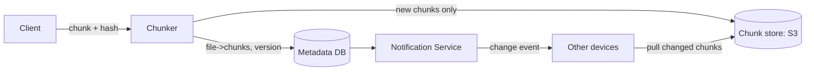
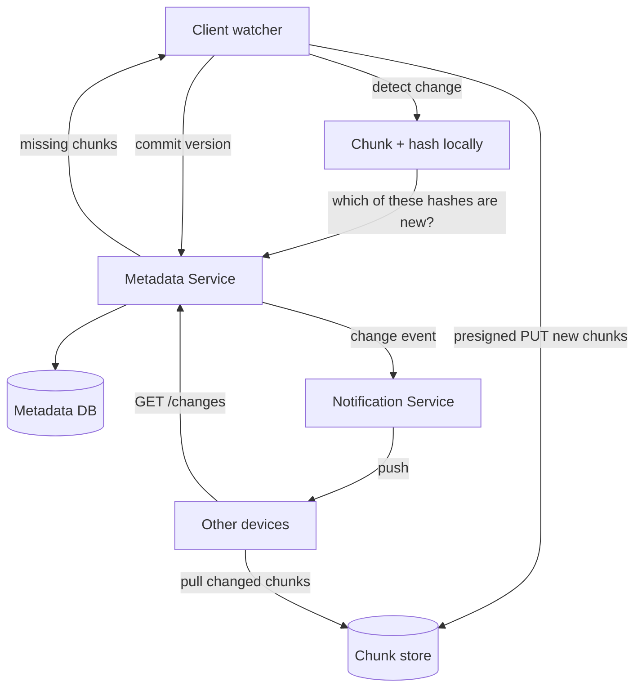

# 9. Google Drive / Dropbox

Difficulty: ★★★★ Hard. File sync and storage: chunking, deduplication, the metadata/blob split at scale, and multi-device conflict resolution. A full read takes about 26 minutes.

<!-- SECTION: tldr -->

## 0. Refresher TL;DR

1. **Chunking:** split files into **fixed/content-defined chunks**; sync and store at chunk granularity so editing a 1GB file only transfers changed chunks.
2. **Deduplication:** hash each chunk; store each unique chunk once (content-addressed). Saves storage and bandwidth massively.
3. **Metadata/blob split:** chunks live in **object storage (S3)**, keyed by content hash; a **metadata DB** stores the file→chunk-list mapping, versions, and the namespace tree.
4. **Sync:** clients watch for local changes and poll/subscribe for remote changes; a **notification service** tells devices when to pull updates.
5. **Conflict resolution:** concurrent edits from two devices → versioning + last-writer-wins or conflict copies; track a per-file version vector.



<!-- SECTION: table-of-contents -->

## Table of Contents

1. [Clarify & Requirements](#1-clarify-requirements)
2. [Estimation](#2-estimation)
3. [API Design](#3-api-design)
4. [Data Model](#4-data-model)
5. [High-Level Design](#5-high-level-design)
6. [Deep Dives](#6-deep-dives)
7. [Scaling & Failure Modes](#7-scaling-failure-modes)
8. [Operational Excellence & Incident Response](#8-operational-excellence-incident-response)
9. [Senior vs Staff Talking Points](#9-senior-vs-staff-talking-points)
10. [Review Checklist](#10-review-checklist)

<!-- SECTION: requirements -->

## 1. Clarify & Requirements

**Functional**

- Upload/download files; organize in folders.
- **Sync** across a user's devices automatically.
- Share files/folders with other users.
- Version history; recover previous versions.

**Non-functional**

- **Efficient sync** — transfer only what changed, not whole files.
- Durable, consistent metadata; never lose a file.
- Handle large files and intermittent connectivity (resumable).
- Reasonable consistency: a change should propagate to other devices quickly.

**Scope cuts:** real-time collaborative editing (Google Docs OT/CRDT is a different problem — mention it), permissions UI, search.

<!-- SECTION: estimation -->

## 2. Estimation

- Say 100M users, avg 100 GB each → **exabytes** of storage → object storage, with **dedup** to cut it down dramatically (many users store identical files — installers, shared docs).
- Upload/download bandwidth is large but, with chunk-level sync, you move only deltas.
- Metadata: billions of files × versions × chunk lists → a large but structured store that must be queried per user/folder.

> **Conclusion:** the design wins or loses on **chunking + dedup** (bandwidth/storage efficiency) and **metadata consistency + sync** (correctness across devices).

<!-- SECTION: api -->

## 3. API Design

```
POST /files/metadata     { path, size, chunk_hashes[] }  → which chunks are missing
PUT  (presigned)         upload missing chunks directly to S3
POST /files/commit       { file_id, version, chunk_hashes[] }  finalize a version
GET  /files/{id}         → { metadata, chunk_list, version }
GET  /changes?cursor=... → list of changes since cursor (delta sync)
WS / long-poll /notifications  → "your namespace changed, pull"
```

<!-- SECTION: data-model -->

## 4. Data Model

```
file
  file_id     STRING (PK)
  owner_id, path
  current_version INT
  is_folder   BOOL

file_version
  file_id, version, chunk_hashes[ ], size, created_at, device_id

chunk           (content-addressed)
  chunk_hash  STRING (PK)   -- sha256 of chunk content
  s3_key      STRING
  ref_count   INT           -- for garbage collection

namespace_cursor
  user_id -> latest_change_seq   (for delta sync)
```

**Storage choice:** **chunks in S3**, content-addressed by hash (dedup falls out: identical content → identical key → stored once). **Metadata in a strongly-consistent store** — file/version/chunk-list correctness is non-negotiable (lose metadata = lose the file even if bytes survive). Often sharded by user/namespace. See [Blob Storage](../databases/blob-storage.md) and [Datastores](../key-technologies/datastores.md).

<!-- SECTION: high-level -->

## 5. High-Level Design



<!-- SECTION: deep-dives -->

## 6. Deep Dives

### Deep dive 1 — Chunking & delta sync

Files are split into **chunks** (e.g., 4 MB). Sync operates on chunks, not whole files:

- On change, the client re-chunks, hashes each chunk, and asks the metadata service **which hashes are new**.
- Only **new chunks** are uploaded. Editing a few bytes of a 1 GB file transfers one chunk, not a gigabyte.
- **Fixed-size** chunking is simple; **content-defined chunking** (rolling hash boundaries) handles insertions better (a byte inserted at the front doesn't shift every subsequent chunk).

> **Why chunk:** "Whole-file transfer wastes bandwidth and time on large files with small edits. Chunking lets sync move only the delta, and it's the foundation for dedup and resumable upload."

### Deep dive 2 — Deduplication (content addressing)

Each chunk is stored under the **hash of its content** (`sha256`). Consequences:

- **Global dedup:** the same chunk uploaded by a million users is stored **once**. Massive storage + bandwidth savings.
- **Idempotent uploads:** re-uploading an existing chunk is a no-op (the key already exists).
- **Garbage collection:** a `ref_count` (or mark-and-sweep) deletes a chunk only when no file version references it.

*Caveat to mention:* content-addressing exposes that two users have identical files (a privacy/security consideration); per-user encryption changes the dedup story.

### Deep dive 3 — Metadata consistency & sync

The metadata DB is the **source of truth** — bytes in S3 are meaningless without the file→chunk mapping. So:

- **Commit a version atomically:** a file version points to an immutable list of chunk hashes. Upload chunks first, then commit metadata (so a crash leaves orphan chunks, not a dangling metadata pointer — orphans are GC'd; dangling pointers lose data).
- **Delta sync:** each user namespace has a monotonically increasing change cursor. Devices call `GET /changes?cursor=X` to get everything since they last synced — efficient and resumable.
- **Notifications:** a long-poll/WebSocket service tells idle devices "you have changes, pull now" so sync is near-real-time without constant polling.

### Deep dive 4 — Conflict resolution

Two devices edit the same file while one is offline:

- Each version records its **parent version** and originating device. On commit, if the parent isn't the current version, it's a **conflict**.
- Strategies: **last-writer-wins** (simple, can lose data), or **create a conflict copy** ("file (conflicted copy from Device B)") so nothing is lost — Dropbox's choice. Track lineage with version vectors.
- True concurrent *collaborative* editing (multiple cursors in one doc) needs **OT or CRDTs** — a different, harder problem; call it out as out of scope unless asked.

<!-- SECTION: scaling -->

## 7. Scaling & Failure Modes

| Concern | Handling |
|---|---|
| **Exabyte storage** | S3 + global chunk dedup (store identical content once) |
| **Large file, tiny edit** | Chunk-level delta sync transfers only changed chunks |
| **Partial upload / flaky network** | Resumable chunk uploads; commit only after all chunks land |
| **Orphan chunks** | Upload-then-commit ordering + ref-count GC |
| **Metadata scale** | Shard metadata DB by user/namespace |
| **Sync storms / thundering herd** | Notification service + cursor-based delta pull, not full re-scan |
| **Concurrent edits** | Version vectors + conflict copies (no silent data loss) |

<!-- SECTION: operations -->

## 8. Operational Excellence & Incident Response

**Operational excellence:** The user-facing SLO is **sync latency** (local change → visible on other devices) and **upload/download success rate**; the correctness SLO is **conflict rate** and, critically, **metadata/blob consistency** (no dangling pointers). Watch chunk-store (blob) health, dedup hit rate, and the sync/notification backlog. Roll out chunking or dedup changes very carefully behind flags on a canary cohort — a bug here risks data integrity, not just latency.

**Incident response:** The incident that matters most is **metadata/blob divergence** — metadata referencing chunks that didn't durably land (or vice versa) — which is a data-integrity sev, detected by reconciliation/integrity-check jobs and mitigated by the upload-then-commit ordering plus orphan GC. A **sync storm** (many clients re-syncing at once, e.g. after an outage) is throttled with backoff and rate-limited notifications. If the chunk store degrades, downloads still serve already-cached chunks and uploads queue rather than fail. Keep runbooks for reconciliation and sync-storm throttling; run blameless postmortems with concrete integrity-guard action items.

<!-- SECTION: talking-points -->

## 9. Senior vs Staff Talking Points

- **Senior:** "Chunk files, hash chunks for dedup, store chunks in S3 content-addressed, metadata DB as source of truth, delta sync via a change cursor, conflict copies for concurrent edits."
- **Staff:** "Two pillars: efficiency and correctness. Efficiency comes from chunking plus content-addressed dedup — identical chunks store once globally, and sync moves only changed chunks, which also gives resumable uploads for free. Correctness comes from treating the metadata DB as the real source of truth: I upload chunks first and commit the version atomically afterward, so a crash leaves GC-able orphans rather than a metadata pointer to missing bytes. Sync is cursor-based delta pull driven by a notification service, and conflicts produce conflict copies rather than last-writer-wins data loss. Real-time co-editing is a separate CRDT/OT problem I'd scope out."
- Reusable lessons: **content addressing for dedup**, **upload bytes then commit metadata**, and **delta sync via cursors**.

<!-- SECTION: review-checklist -->

## 10. Review Checklist

- [ ] Why chunk files, and fixed-size vs content-defined chunking?
- [ ] How does content-addressing give dedup, idempotent upload, and require GC?
- [ ] Why is the metadata DB the source of truth, and why upload-then-commit?
- [ ] How does cursor-based delta sync + notifications work?
- [ ] How do you resolve concurrent edits without losing data?
- [ ] Why is collaborative real-time editing a different (CRDT/OT) problem?
