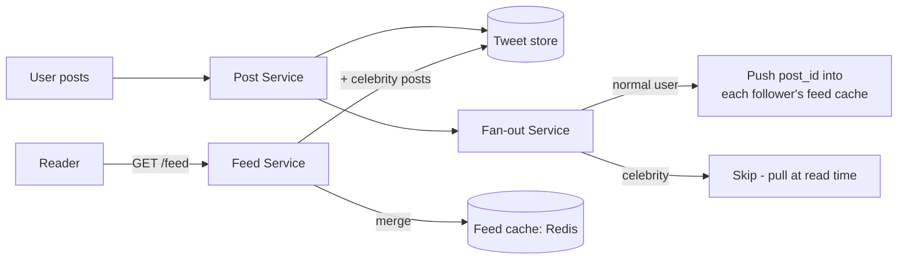
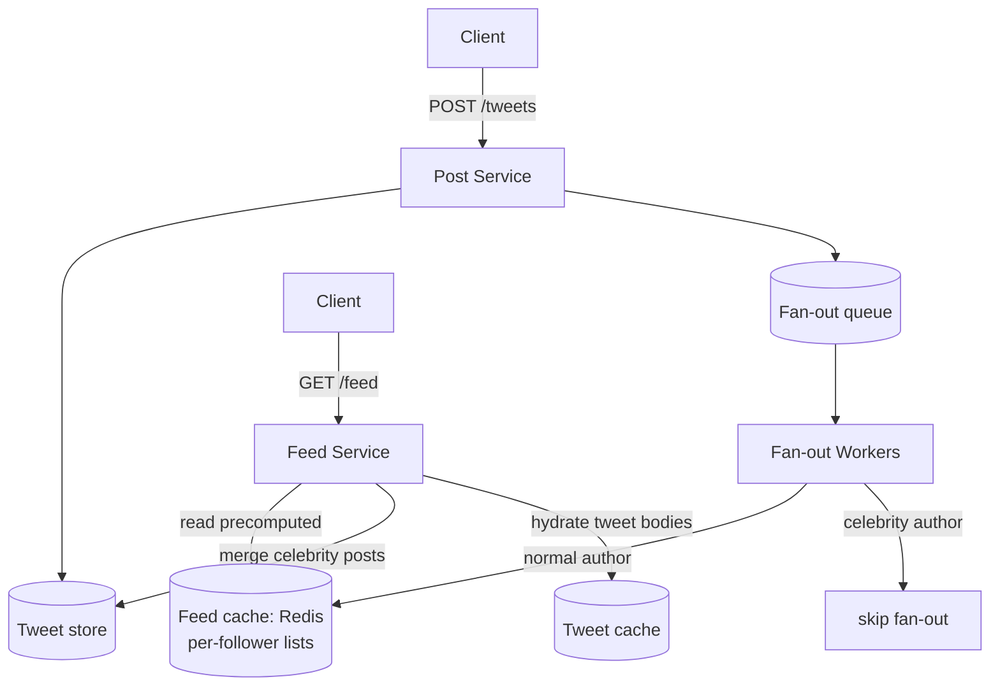
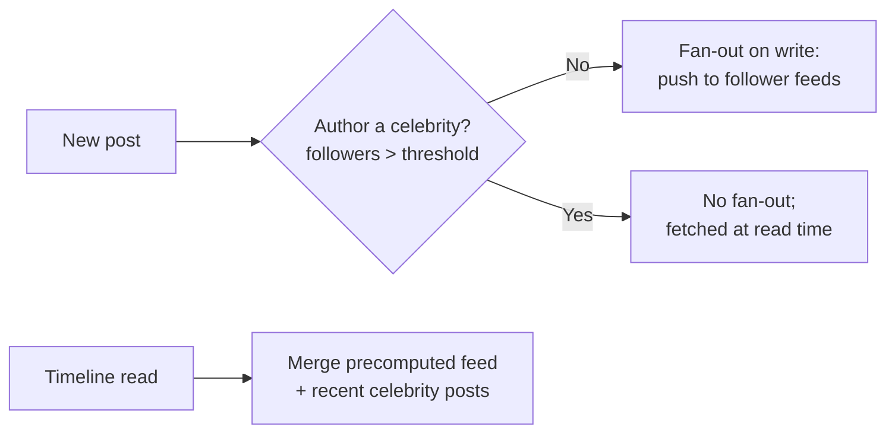

# 5. News Feed (Twitter)

Difficulty: ★★★ Medium. The classic fan-out problem. The whole interview hinges on **fan-out on write vs read** and the **celebrity problem**. A full read takes about 25 minutes.

<!-- SECTION: tldr -->

## 0. Refresher TL;DR

1. **The core decision: fan-out on write vs read.** On write, push each post into followers' precomputed feeds (fast reads, expensive writes). On read, pull-and-merge from followees at read time (cheap writes, expensive reads).
2. **Hybrid is the real answer:** fan-out on write for normal users; **fan-out on read for celebrities** (millions of followers) to avoid a write storm. Merge the two at read time.
3. **Feed storage:** precomputed feeds live in a **cache (Redis lists)** keyed by user — the read path serves from memory.
4. **Post storage:** tweets in a write-optimized store; the feed holds **post IDs**, hydrated from a cache/store on read.
5. **Consistency:** feeds are **eventually consistent** — a few seconds of delay for a post to appear is fine. Say so.



<!-- SECTION: table-of-contents -->

## Table of Contents

1. [Clarify & Requirements](#1-clarify-requirements)
2. [Estimation](#2-estimation)
3. [API Design](#3-api-design)
4. [Data Model](#4-data-model)
5. [High-Level Design](#5-high-level-design)
6. [Deep Dives](#6-deep-dives)
7. [Scaling & Failure Modes](#7-scaling-failure-modes)
8. [Operational Excellence & Incident Response](#8-operational-excellence-incident-response)
9. [Senior vs Staff Talking Points](#9-senior-vs-staff-talking-points)
10. [Review Checklist](#10-review-checklist)

<!-- SECTION: requirements -->

## 1. Clarify & Requirements

**Functional**

- Post a tweet.
- Follow/unfollow users.
- View a home timeline: recent posts from people you follow, reverse-chronological (or ranked).

**Non-functional**

- **Read-heavy** — people scroll far more than they post (~100:1).
- Timeline reads must be **fast** (<200ms).
- Eventual consistency is fine (a post can take seconds to appear).
- **Highly available.** Scale: 100s of millions of users; some accounts have 100M+ followers.

**Scope cuts:** skip ranking ML, ads, DMs, search — focus on timeline generation.

<!-- SECTION: estimation -->

## 2. Estimation

- 200M DAU, each posts ~2/day → 400M posts/day ≈ **~5K posts/sec** (peak ~10-50K).
- Each reads timeline ~10/day → **~25K timeline reads/sec** (peak much higher).
- **Fan-out math (the key number):** avg 200 followers → each post writes to 200 feeds → 400M posts × 200 = **80B feed-writes/day** on fan-out-on-write. A celebrity with 100M followers → one post = **100M writes**. *This single number is why the celebrity problem exists.*

> **Conclusion:** fan-out on write makes reads trivially fast but generates astronomical write amplification for high-follower accounts → hybrid model.

<!-- SECTION: api -->

## 3. API Design

```
POST /tweets             { "text": "...", "media?": [...] }  → 201 { tweet_id }
POST /users/{id}/follow                                       → 200
GET  /feed?cursor=...&limit=20  → { tweets: [...], next_cursor }   (cursor pagination)
```

Note cursor (not offset) pagination — feeds mutate constantly. See [Pagination](../databases/pagination.md).

<!-- SECTION: data-model -->

## 4. Data Model

```
tweet
  tweet_id   SNOWFLAKE (PK, time-sortable)
  user_id    STRING
  text       STRING
  media_keys [STRING]          -- S3 pointers
  created_at TIMESTAMP

follow
  follower_id  STRING
  followee_id  STRING
  -- indexed both directions

feed (in Redis, per user)
  user_id -> [ tweet_id, tweet_id, ... ]   (capped list, newest first)
```

**Storage choice:** tweets in a write-scalable store (Cassandra/Manhattan-style or sharded by tweet_id); the **graph** (follows) in its own store; **precomputed feeds in Redis** (lists of tweet IDs). Use **Snowflake IDs** (timestamp-prefixed) so tweet IDs sort by time without a separate sort key. See [Datastores](../key-technologies/datastores.md).

<!-- SECTION: high-level -->

## 5. High-Level Design



<!-- SECTION: deep-dives -->

## 6. Deep Dives

### Deep dive 1 — Fan-out on write vs read (the central trade-off)

| | Fan-out on **write** (push) | Fan-out on **read** (pull) |
|---|---|---|
| When a post happens | Write post_id into every follower's feed | Do nothing extra |
| When a feed is read | Read precomputed list (fast) | Query all followees, merge, sort (slow) |
| Read latency | **Low** | **High** |
| Write cost | **High** (∝ follower count) | Low |
| Best for | Users with few followers | Users with huge follower counts |
| Wasted work | Inactive followers' feeds still written | None |

Neither alone works at Twitter scale: pure push dies on celebrities (100M writes/post); pure pull dies on read latency (merging thousands of followees per timeline view).

### Deep dive 2 — The hybrid model (the answer)



- **Normal users:** fan-out on write — their posts are pushed into followers' Redis feeds. Reads are instant.
- **Celebrities** (followers > ~10K-100K threshold): **no fan-out**. Their recent posts are pulled at read time and merged into the requesting user's timeline.
- **Read path:** take the precomputed feed from Redis, then for each celebrity the user follows, fetch their recent posts and merge-sort by time. Since a user follows few celebrities, this merge is cheap.

> **Why hybrid:** "Fan-out on write gives fast reads but explodes for high-follower accounts; fan-out on read is cheap to write but slow to read. The hybrid pays the write cost only for the 99% of accounts where it's cheap, and switches celebrities to read-time pull so one post never triggers 100M writes. The merge at read time is small because users follow only a handful of celebrities."

### Deep dive 3 — Feed storage & hydration

The feed stores **tweet IDs**, not full tweets — so a viral tweet isn't duplicated across millions of feeds. On read, hydrate IDs → tweet bodies from a **tweet cache** (Redis) backed by the tweet store. Cap each feed list (e.g., latest 800) so memory is bounded; older history is paged from the store.

### Deep dive 4 — Async fan-out & failure

Fan-out runs **asynchronously** off a queue, never on the post request's hot path. The post returns as soon as it's durably stored; workers fan it out in the background (eventual consistency). At-least-once delivery → fan-out must be idempotent (adding the same tweet_id to a feed list twice is a no-op with a set/dedup). See [Scaling Writes](../patterns/scaling-writes.md) and [Long-Running Tasks](../patterns/long-running-tasks.md).

<!-- SECTION: scaling -->

## 7. Scaling & Failure Modes

| Concern | Handling |
|---|---|
| **Celebrity post** | No fan-out; pull-and-merge at read time |
| **Fan-out backlog** | Queue absorbs bursts; workers scale horizontally; prioritize active users |
| **Feed cache eviction** | Rebuild a user's feed lazily from the tweet store on miss |
| **Hot tweet hydration** | Tweet cache; store IDs not bodies to avoid duplication |
| **Thundering herd on a viral tweet** | Cache the tweet; coalesce hydration requests |
| **Inactive users** | Optionally don't fan out to inactive accounts; build their feed on login |

<!-- SECTION: operations -->

## 8. Operational Excellence & Incident Response

**Operational excellence:** The feed's user-facing SLOs are **feed-load latency** (served from the feed cache) and **time-to-feed** — how long after a post until it lands in followers' feeds. Watch **feed-cache hit rate**, **fan-out lag / queue depth**, and post-ingest error rate. Because the design hinges on a fan-out-on-write vs read split, dashboard the two paths separately and roll out fan-out changes behind flags so you can shift the read/write boundary without a deploy.

**Incident response:** The signature incident is a **celebrity fan-out storm** — a high-follower account posts and the fan-out queue explodes, delaying everyone's feeds. The mitigation is the hybrid model itself: flip hot accounts to **pull (fan-out-on-read)** so their posts merge at read time instead of fanning to millions, ideally via a follower-count threshold that trips automatically. Detect it via fan-out lag breaching SLO. If the feed cache degrades, serve a slightly **stale feed** rather than failing — feeds tolerate eventual consistency. Keep runbooks for the celebrity threshold and cache rebuild; blameless postmortems tune the fan-out threshold and queue capacity.

<!-- SECTION: talking-points -->

## 9. Senior vs Staff Talking Points

- **Senior:** "Fan-out on write into Redis feeds for fast reads; cursor pagination; store tweet IDs not bodies."
- **Staff:** "Pure fan-out-on-write can't survive celebrities — one post would be 100M feed writes — so I'd go hybrid: push for normal authors, pull-and-merge for high-follower accounts past a threshold, merged at read time, which stays cheap because users follow few celebrities. Fan-out is async off a queue so the post path is fast and eventually consistent, idempotent on replay, and feeds store IDs to avoid duplicating viral tweets across millions of lists. I'd also skip fan-out to inactive users and lazily rebuild their feed on login to cut wasted writes."
- This is *the* problem to know cold — the fan-out trade-off recurs in any follower/subscriber system.

<!-- SECTION: review-checklist -->

## 10. Review Checklist

- [ ] Can you contrast fan-out on write vs read across read latency, write cost, and best-fit?
- [ ] Can you explain the celebrity problem with the actual write-amplification number?
- [ ] Can you describe the hybrid model and the read-time merge?
- [ ] Why store tweet IDs in feeds, not bodies?
- [ ] Why is fan-out async + idempotent, and why is eventual consistency acceptable?
- [ ] Why cursor pagination over offset for a feed?
