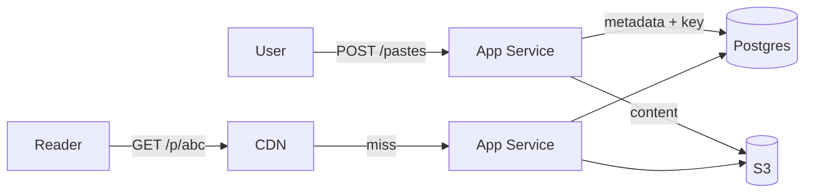
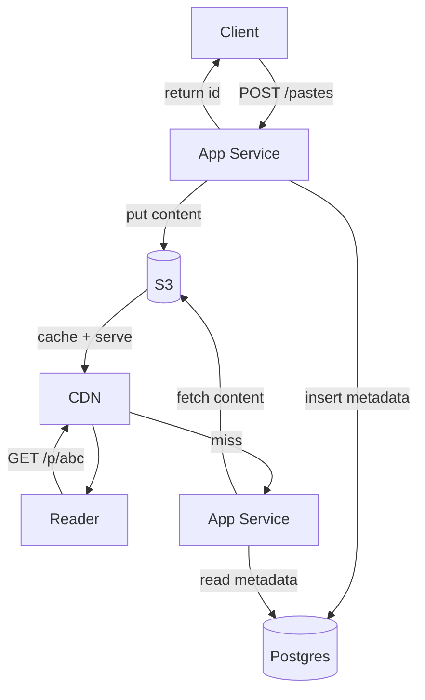

# 2. Pastebin

Difficulty: ★ Easy. Like the URL shortener but the payload is a *document*, which introduces the metadata/blob split, TTL/expiry, and CDN delivery. A full read takes about 18 minutes.

<!-- SECTION: tldr -->

## 0. Refresher TL;DR

1. **Split storage:** paste **content goes in object storage (S3)**; the database holds only **metadata + the S3 key**. Don't store large text blobs in the DB row.
2. **Key generation:** same as Bitly — counter + base62 or random-with-check for the paste ID.
3. **Read-heavy + cacheable:** popular pastes are served from **CDN/cache**; the read path mirrors a URL shortener.
4. **Expiry:** TTL handled by **S3 lifecycle policy** (auto-delete) + a metadata `expires_at`; never scan to clean up.
5. **Consistency:** a paste is write-once, read-many (immutable), which makes caching trivial and avoids invalidation.



<!-- SECTION: table-of-contents -->

## Table of Contents

1. [Clarify & Requirements](#1-clarify-requirements)
2. [Estimation](#2-estimation)
3. [API Design](#3-api-design)
4. [Data Model](#4-data-model)
5. [High-Level Design](#5-high-level-design)
6. [Deep Dives](#6-deep-dives)
7. [Scaling & Failure Modes](#7-scaling-failure-modes)
8. [Operational Excellence & Incident Response](#8-operational-excellence-incident-response)
9. [Senior vs Staff Talking Points](#9-senior-vs-staff-talking-points)
10. [Review Checklist](#10-review-checklist)

<!-- SECTION: requirements -->

## 1. Clarify & Requirements

**Functional**

- Create a paste (text, up to a few MB) → get a short URL.
- Read a paste by URL.
- Optional expiry (burn after reading / TTL), custom alias, syntax highlighting.

**Non-functional**

- Read-heavy; pastes are **immutable** once created (no edits → no invalidation problem).
- Low-latency reads; popular pastes should be cacheable.
- Durable storage of content.

**Scope cuts:** skip accounts, private/encrypted pastes, and abuse filtering unless asked.

<!-- SECTION: estimation -->

## 2. Estimation

Assume 10M new pastes/month, avg 10 KB, 10:1 read:write.

- Writes: ~4/sec (peak ~40/sec). Reads: ~40/sec (peak ~400/sec). Modest.
- Storage: 10M × 10 KB × 12 × 5yr ≈ **6 TB** of content. This is why content goes in **object storage**, not DB rows — bytes dominate.
- Metadata: ~6B rows × ~200 bytes ≈ ~1 TB — fine for one DB with sharding later.

> **Conclusion:** content volume (TBs of blobs) ≫ metadata, and pastes are immutable → put bytes in S3 + CDN, keep only pointers in the DB.

<!-- SECTION: api -->

## 3. API Design

```
POST /pastes      { "content": "...", "ttl?": 3600, "alias?": "..." }
                  → 201 { "url": "https://pb.in/abc123" }

GET  /pastes/{id} → 200 { "content": "...", "created_at": ... }
                    (content may be served/redirected via CDN)

DELETE /pastes/{id}
```

For large content, optionally return a **presigned S3 URL** so the client uploads bytes directly (see [Large Blobs](../patterns/large-blobs.md)).

<!-- SECTION: data-model -->

## 4. Data Model

```
paste
  id           STRING (PK)        -- "abc123"
  s3_key       STRING             -- pointer to content in S3
  size_bytes   INT
  created_at   TIMESTAMP
  expires_at   TIMESTAMP NULL
  content_type STRING
```

**Storage choice:** **Postgres for metadata** (simple, relational-ish, easy to query/expire) + **S3 for content**. The DB row never holds the paste body. *Why:* storing multi-KB-to-MB blobs in DB rows bloats the table, slows scans, and wastes the cache. The metadata/blob split keeps the hot DB tiny and pushes bytes to cheap, durable object storage. See [Blob Storage](../databases/blob-storage.md).

<!-- SECTION: high-level -->

## 5. High-Level Design



<!-- SECTION: deep-dives -->

## 6. Deep Dives

### Deep dive 1 — Why the metadata/blob split

The single most important decision. Content (KB–MB) lives in **S3**; the DB stores a **pointer**. Benefits:

- DB stays small and fast (only pointers + metadata), so indexes and cache stay effective.
- S3 gives 11-nines durability and near-infinite scale cheaply.
- The CDN can cache content directly from S3 as origin.

*Failure mode to mention:* a write that stores content in S3 but crashes before the metadata insert leaves an **orphaned object**. Fix with a background reconciliation job (or write metadata first as `pending`, upload, then mark `ready`).

### Deep dive 2 — Expiry / TTL at scale

Don't scan the table for expired pastes. Two layers:

1. **S3 lifecycle policy** auto-deletes objects after their TTL — no compute on your side.
2. **Metadata `expires_at`** is checked lazily on read (return 404 if expired) and optionally cleaned by a low-priority sweep.

For "burn after reading," delete (or mark consumed) on first successful read inside a transaction so a second read 404s.

### Deep dive 3 — Read scaling & caching

Pastes are **immutable**, which removes cache invalidation entirely — once cached, an entry is valid until expiry. So:

- **CDN** caches popular pastes at the edge.
- **Redis** in front of the DB for metadata lookups.
- This is strictly easier than the URL shortener's analytics-coupled read path.

> **Why immutability matters:** "Because pastes never change, I get caching almost for free — no invalidation, long TTLs, and the CDN can serve content straight from S3." This is a clean trade-off to call out.

### Deep dive 4 — Large pastes & direct upload

For multi-MB pastes, route bytes around your app servers: hand the client a **presigned S3 PUT URL**, then confirm the upload and write metadata. This keeps large payloads off your compute and is the same pattern used for file uploads. See [Handling Large Blobs](../patterns/large-blobs.md).

<!-- SECTION: scaling -->

## 7. Scaling & Failure Modes

| Concern | Handling |
|---|---|
| **Hot paste (viral)** | CDN edge caching; immutability means infinite-TTL caching is safe |
| **Metadata growth** | Shard the metadata DB by paste ID once it's large |
| **Orphaned S3 objects** | Reconciliation job, or write `pending` metadata before upload |
| **S3 outage** | Reads of cached pastes still serve from CDN; new writes fail fast |
| **Expiry storms** | S3 lifecycle handles deletes; lazy 404 on read avoids scan jobs |

<!-- SECTION: operations -->

## 8. Operational Excellence & Incident Response

**Operational excellence:** Pastebin is read-heavy and blob-backed, so the SLOs that matter are **read availability and latency** (served largely from the CDN) and **paste-create success rate**. Watch **CDN hit rate**, blob-store (S3) error/latency, and metadata-DB health — a falling CDN hit rate is the early warning that origin load is about to climb. Canary the create and read paths independently, since they scale and fail differently, with fast rollback.

**Incident response:** The headline incident is blob-store or CDN degradation, and reads degrade gracefully — fall back from CDN to origin, and from a failed region to a secondary — while the metadata/blob split means a metadata blip still lets already-cached content serve. Detect it via a hit-rate drop or a spike in origin 5xx. The quieter failure is the **expiry/TTL sweeper lagging**, leaving expired pastes reachable: alert on sweeper backlog and lean on lazy expiry (check `expires_at` on read) as the backstop so correctness never depends solely on the sweeper. Keep runbooks for CDN failover and sweeper catch-up, and run blameless postmortems that feed new alert thresholds.

<!-- SECTION: talking-points -->

## 9. Senior vs Staff Talking Points

- **Senior:** "Metadata in Postgres, content in S3, CDN in front; immutability makes caching trivial; TTL via S3 lifecycle."
- **Staff:** "The interesting edge is the dual-write between S3 and the metadata DB — I'd avoid orphans by writing `pending` metadata first, uploading, then flipping to `ready`, with a reconciliation sweep as a backstop. For large pastes I'd hand out presigned URLs so bytes never touch app servers, and because pastes are immutable I can use very long CDN TTLs and skip invalidation entirely."
- This problem teaches the **metadata/blob split** that recurs in YouTube and Google Drive.

<!-- SECTION: review-checklist -->

## 10. Review Checklist

- [ ] Why does content go in S3 and only a pointer in the DB?
- [ ] How do you avoid orphaned objects on a partial write?
- [ ] How do you expire pastes without scanning (S3 lifecycle + lazy 404)?
- [ ] Why does immutability make caching easy (no invalidation)?
- [ ] When/why hand out a presigned URL for large pastes?
