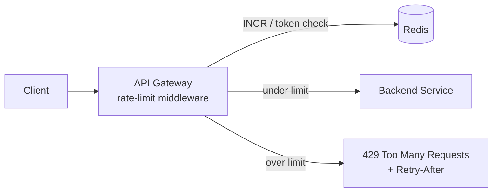
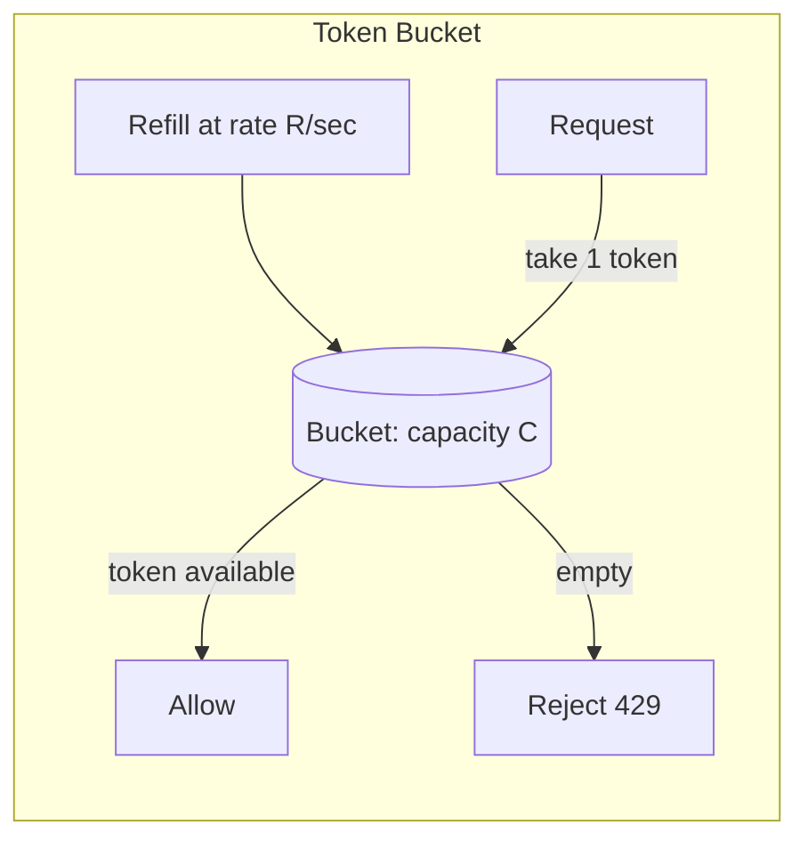
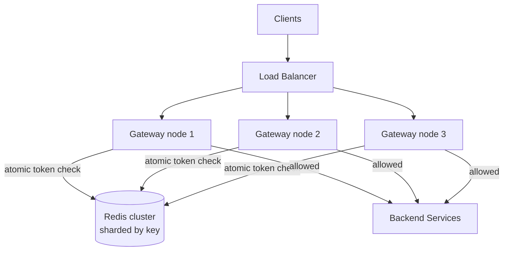

# 3. Rate Limiter

Difficulty: ★★ Easy-Medium. A focused problem about algorithms (token bucket vs sliding window) and distributed atomic counters. A full read takes about 20 minutes.

<!-- SECTION: tldr -->

## 0. Refresher TL;DR

1. **Algorithm:** **token bucket** is the default — allows bursts, smooth, cheap. Sliding-window-log is most accurate but memory-heavy; sliding-window-counter is the good-enough approximation.
2. **Where it lives:** at the **API gateway / edge**, in front of services — reject early, before requests consume backend resources.
3. **Distributed state:** counters live in **Redis** (shared across gateway nodes) using **atomic INCR / Lua** so concurrent requests can't race past the limit. See [Contention](../patterns/contention.md).
4. **Identify the caller:** key the limit by user ID, API key, or IP — decide the dimension.
5. **Fail open vs closed:** if Redis is down, decide whether to **allow** (fail open, prioritize availability) or **block** (fail closed, prioritize protection). Usually fail open with a local fallback.



<!-- SECTION: table-of-contents -->

## Table of Contents

1. [Clarify & Requirements](#1-clarify-requirements)
2. [Estimation](#2-estimation)
3. [API Design](#3-api-design)
4. [Algorithms](#4-algorithms)
5. [High-Level Design](#5-high-level-design)
6. [Deep Dives](#6-deep-dives)
7. [Scaling & Failure Modes](#7-scaling-failure-modes)
8. [Operational Excellence & Incident Response](#8-operational-excellence-incident-response)
9. [Senior vs Staff Talking Points](#9-senior-vs-staff-talking-points)
10. [Review Checklist](#10-review-checklist)

<!-- SECTION: requirements -->

## 1. Clarify & Requirements

**Functional**

- Limit each caller to N requests per window (e.g., 100/min).
- Return **429 Too Many Requests** with a `Retry-After` header when exceeded.
- Configurable limits per route / per tier (free vs paid).

**Non-functional**

- **Low latency** — the limiter is on every request's hot path; it must add <1ms.
- **Distributed** — limits enforced consistently across many gateway nodes.
- **Accurate enough** — small over-counting at boundaries is usually acceptable; decide.
- Highly available; must degrade gracefully if the counter store fails.

**Scope cuts:** focus on the algorithm + distributed counter; skip billing integration.

<!-- SECTION: estimation -->

## 2. Estimation

The limiter sits on *every* request, so its QPS equals total traffic — say 1M req/sec at a large gateway. Each check is one Redis op. Key insight: the state per caller is tiny (a counter + timestamp), so memory is small, but **op throughput is enormous** → the store must do millions of atomic ops/sec → Redis, sharded by key.

<!-- SECTION: api -->

## 3. API Design

The limiter is middleware, not a user-facing API. Conceptually:

```
allow(key, limit, window) -> { allowed: bool, remaining: int, reset_at: ts }
```

On the wire, a blocked request gets:

```
HTTP 429 Too Many Requests
Retry-After: 30
X-RateLimit-Limit: 100
X-RateLimit-Remaining: 0
```

<!-- SECTION: algorithms -->

## 4. Algorithms

Know these four and their trade-offs cold — this is the core of the question:

| Algorithm | How it works | Pro | Con |
|---|---|---|---|
| **Fixed window** | Count requests per fixed clock window (e.g., per minute) | Trivial, one counter | **Boundary burst:** 2x limit possible across the window edge |
| **Sliding window log** | Store timestamp of every request; count those in the last window | Exact | Memory grows with request count; expensive |
| **Sliding window counter** | Weighted blend of current + previous fixed window | Smooth, cheap, accurate enough | Slight approximation |
| **Token bucket** | Bucket fills at rate R, each request takes a token; empty → reject | Allows controlled bursts; cheap (2 values) | Tuning burst vs rate |
| **Leaky bucket** | Queue drains at a fixed rate | Smooths output rate | Adds latency; queue can fill |

**Recommended default: token bucket** — it permits natural bursts (good UX) while bounding the long-run rate, and stores only `{tokens, last_refill}` per key. **Sliding window counter** is the best choice when you want a strict rolling limit without the memory of a log.



<!-- SECTION: high-level -->

## 5. High-Level Design

Run the limiter as **middleware in the API gateway** so requests are rejected before reaching backends. Counters are kept in **Redis**, shared across all gateway instances.



<!-- SECTION: deep-dives -->

## 6. Deep Dives

### Deep dive 1 — The distributed counter race (why atomicity matters)

With many gateway nodes hitting the same counter, a naive `GET count; if < limit { SET count+1 }` is a classic [read-check-write race](../patterns/contention.md): two nodes both read 99, both allow, count becomes 101. **Fix:** do the check-and-decrement **atomically** in Redis.

- Simple case: `INCR key` + `EXPIRE` — atomic increment; reject if the returned value exceeds the limit (fixed window).
- Token bucket: run a **Lua script** that reads tokens, refills based on elapsed time, decrements, and returns allow/deny — executed atomically server-side so no two requests interleave.

> **Why Redis + Lua:** Redis is single-threaded per shard and executes a Lua script atomically, which gives you compare-and-act semantics without a distributed lock. This is the cleanest way to enforce a shared limit across nodes.

### Deep dive 2 — Local vs centralized counters

A round-trip to Redis on every request adds latency. Two refinements:

- **Local token bucket per node** with periodic sync: each node gets a share of the global budget. Fast, but globally approximate and unfair under skew.
- **Centralized Redis** (recommended for accuracy): one source of truth, slight latency. Shard by key so no single Redis node is a bottleneck; co-locate the gateway with Redis to keep the hop cheap.

Trade-off: **accuracy vs latency**. State which you're optimizing. For most APIs, centralized Redis with a fast local path is the right balance.

### Deep dive 3 — Failure handling: fail open vs fail closed

If Redis is unreachable:

- **Fail open** (allow requests): protects availability — a rate-limiter outage shouldn't take down the API. Risk: a flood gets through during the outage.
- **Fail closed** (block): protects the backend at the cost of rejecting legitimate traffic.

Most systems **fail open** with a **local in-memory fallback limiter** so there's still coarse protection. Say which you'd pick and why — it's a judgment signal.

### Deep dive 4 — Where to enforce & what to key on

- **Placement:** at the **edge/gateway** (reject early) — not deep in each service.
- **Key dimension:** by API key (per customer), user ID (per account), or IP (anonymous). You can layer multiple (per-IP *and* per-user) to stop both broad floods and single-account abuse.
- **Tiered limits:** free vs paid → different limits; store the limit config separately and look it up.

<!-- SECTION: scaling -->

## 7. Scaling & Failure Modes

| Concern | Handling |
|---|---|
| **Millions of ops/sec** | Shard Redis by key; each key's ops land on one shard |
| **Hot key (one huge customer)** | Dedicated shard, or local-bucket approximation for that key |
| **Redis down** | Fail open + local fallback limiter; circuit breaker |
| **Clock skew (sliding window)** | Use the Redis server's clock inside the Lua script, not node clocks |
| **Boundary bursts** | Prefer sliding window counter or token bucket over fixed window |

<!-- SECTION: operations -->

## 8. Operational Excellence & Incident Response

**Operational excellence:** A rate limiter sits in the hot path of *every* downstream service, so its own latency budget is tiny (sub-millisecond) and its availability bar is higher than the things it protects. The defining operational decision is **fail-open vs fail-closed**: if the backing store is unreachable, do you allow traffic (protect availability) or block it (protect the backend)? For most user-facing APIs the answer is fail-open. Watch **Redis latency/saturation**, the **429 throttle rate**, and the **false-throttle rate**, and roll out limit changes via config/flags so a misconfigured limit is reverted in seconds, not a redeploy.

**Incident response:** The nightmare incident is the limiter itself causing the outage — Redis slows or dies and every request blocks on it, taking down the whole platform. Mitigation is the fail-open default plus a circuit breaker and a short timeout so the limiter degrades to pass-through rather than a hard dependency. The opposite incident is a bad limit config throttling legitimate traffic (a 429 spike with no real abuse), caught by the false-throttle alert and fixed by flag rollback. Keep a global kill switch to disable limiting entirely, and run blameless postmortems that re-tune limits and timeouts.

<!-- SECTION: talking-points -->

## 9. Senior vs Staff Talking Points

- **Senior:** "Token bucket in gateway middleware, counters in Redis, atomic INCR/Lua to avoid the check-then-set race, 429 + Retry-After."
- **Staff:** "The crux is the distributed counter race — I'd push the entire check-refill-decrement into an atomic Redis Lua script so concurrent nodes can't both pass at the boundary. I'd shard Redis by key for throughput, and crucially decide the failure posture up front: fail open with a local fallback, because a rate-limiter outage must not become an API outage. I'd also use the Redis server clock inside the script to avoid node clock-skew bugs."
- The reusable lesson: **shared mutable state across nodes → make the operation atomic, don't lock.**

<!-- SECTION: review-checklist -->

## 10. Review Checklist

- [ ] Can you compare fixed window, sliding window (log + counter), token bucket, leaky bucket?
- [ ] Why is fixed window vulnerable to boundary bursts?
- [ ] Why does the distributed counter need atomic ops (the race)?
- [ ] How does a Lua script give compare-and-act without a lock?
- [ ] Fail open vs fail closed — which and why?
- [ ] Where do you enforce, and what do you key on?
