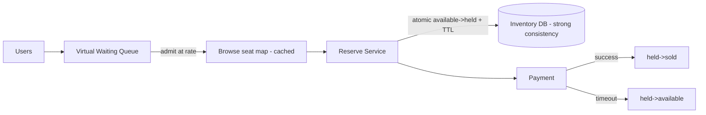
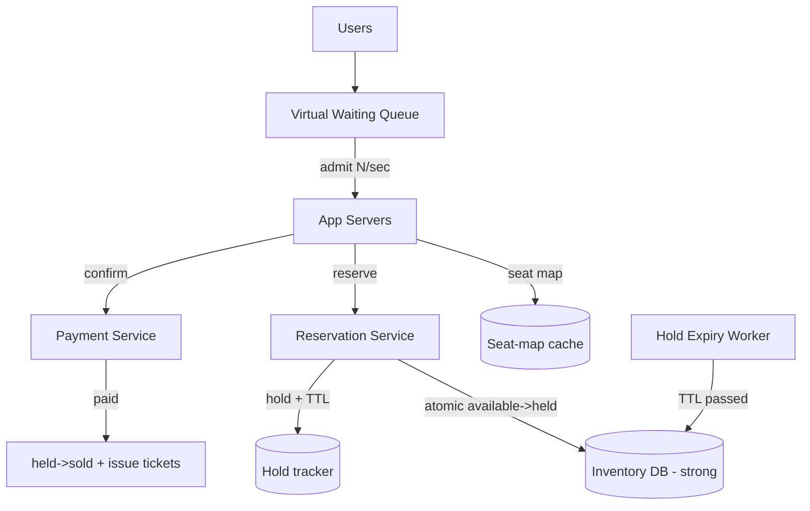
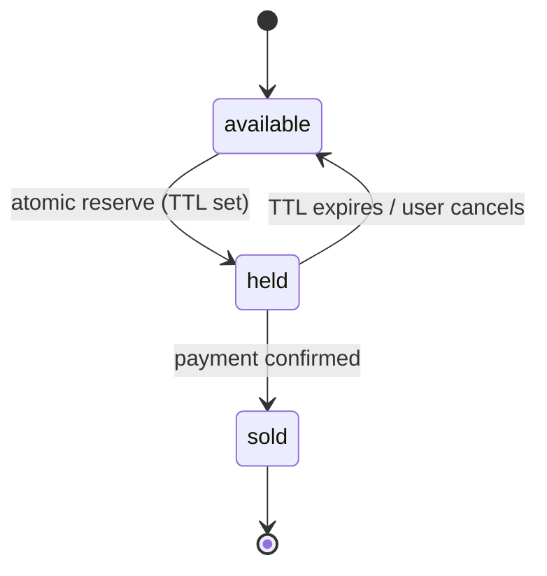

# 10. Ticketmaster

Difficulty: ★★★★★ Hard. The contention capstone: a finite inventory of seats, massive read spikes, and the requirement that no seat is ever sold twice. A full read takes about 26 minutes.

<!-- SECTION: tldr -->

## 0. Refresher TL;DR

1. **The core problem is contention:** thousands of users racing for the same seats. No seat may be double-sold. This is the [Contention](../patterns/contention.md) pattern at full intensity.
2. **Reserve-then-pay:** a seat is **held** (short TTL) the moment a user selects it, then confirmed on payment. Holds prevent double-booking and give the user time to check out.
3. **Strong consistency on inventory:** seat state lives in a **transactional store**; the reserve uses an **atomic conditional update** (available → held) or a row lock — not read-check-write.
4. **Massive read spikes:** a hot on-sale draws huge browse traffic → **cache the event/seat-map reads** and use a **virtual waiting queue** to admit users at a controlled rate.
5. **Expire holds reliably:** a hold not paid within N minutes must auto-release back to inventory.



<!-- SECTION: table-of-contents -->

## Table of Contents

1. [Clarify & Requirements](#1-clarify-requirements)
2. [Estimation](#2-estimation)
3. [API Design](#3-api-design)
4. [Data Model](#4-data-model)
5. [High-Level Design](#5-high-level-design)
6. [Deep Dives](#6-deep-dives)
7. [Scaling & Failure Modes](#7-scaling-failure-modes)
8. [Operational Excellence & Incident Response](#8-operational-excellence-incident-response)
9. [Senior vs Staff Talking Points](#9-senior-vs-staff-talking-points)
10. [Review Checklist](#10-review-checklist)

<!-- SECTION: requirements -->

## 1. Clarify & Requirements

**Functional**

- Browse events and view a seat map with availability.
- Reserve specific seat(s) and pay.
- Guarantee a seat is sold to exactly one buyer.
- Release seats if payment isn't completed in time.

**Non-functional**

- **Strong consistency on inventory** — double-selling a seat is unacceptable.
- **Handle massive spikes** — popular on-sales bring orders of magnitude more browsers than seats.
- Low-latency browsing; reservations must feel instant.
- Fairness is desirable (first-come queueing).

**Scope cuts:** dynamic pricing, recommendations, fraud — focus on the inventory/reservation core.

<!-- SECTION: estimation -->

## 2. Estimation

- A hot event: 50K seats, but **millions** of users hammering at on-sale moment → read:write skew is extreme and **bursty** (a spike at one instant, not steady).
- Browse reads ≫ reservation writes. Reads are cacheable (seat map), but availability changes fast during a hot sale.
- Writes (reservations) are low in absolute volume but **highly contended** — many users targeting the same few good seats simultaneously.

> **Conclusion:** this isn't a throughput problem, it's a **contention + spike** problem. The design centers on serializing access to each seat correctly while shielding the system from the browse stampede.

<!-- SECTION: api -->

## 3. API Design

```
GET  /events/{id}                 → event details (cached)
GET  /events/{id}/seats           → seat map + availability (cached, short TTL)
POST /events/{id}/reservations    { seat_ids[] }  → { reservation_id, expires_at }  (holds seats)
POST /reservations/{id}/confirm   { payment_token } → { ticket_ids[] }              (held → sold)
DELETE /reservations/{id}         release a hold
```

<!-- SECTION: data-model -->

## 4. Data Model

```
event
  event_id, venue_id, name, starts_at

seat
  seat_id      STRING (PK)
  event_id     STRING
  section, row, number
  status       ENUM(available, held, sold)
  hold_expires_at TIMESTAMP NULL
  held_by      reservation_id NULL
  version      INT          -- for optimistic locking

reservation
  reservation_id, user_id, seat_ids[], status(held, confirmed, expired), expires_at
```

**Storage choice:** seat inventory in a **strongly-consistent transactional store (Postgres / a CP store)** — correctness beats availability here; you cannot eventually-consistent your way out of double-selling a seat. This is the opposite of the [news feed](news-feed.md), where eventual consistency was fine. See [CAP & PACELC](../distributed-systems/consistency-cap-pacelc.md) and [Datastores](../key-technologies/datastores.md).

<!-- SECTION: high-level -->

## 5. High-Level Design



<!-- SECTION: deep-dives -->

## 6. Deep Dives

### Deep dive 1 — Preventing double-booking (the crux)

Two users click the same seat at the same instant. A naive `SELECT status; if available: UPDATE sold` is a textbook [read-check-write race](../patterns/contention.md). Options, in escalation order:

| Technique | How | Trade-off |
|---|---|---|
| **Atomic conditional update** | `UPDATE seat SET status='held', held_by=? WHERE seat_id=? AND status='available'` — check `rows_affected` | Simplest, correct, no explicit lock; one writer wins atomically |
| **Optimistic locking** | Version column; update fails if version changed | Good under low contention; retry storms under high |
| **Pessimistic lock** | `SELECT ... FOR UPDATE` then update | Serializes; holds a DB lock — risky across network/payment calls |
| **Distributed lock** | Redis `SET NX` per seat | Works across services; lock failover edge cases |

**Recommended: the atomic conditional update.** The `WHERE status='available'` makes the check-and-set a single atomic operation — exactly one of two racing requests gets `rows_affected = 1` and wins; the other gets 0 and is told the seat is gone. No read-then-write gap.

> **Why not hold a DB lock across payment:** never hold a pessimistic lock while waiting on a slow external payment — it would serialize and exhaust connections. Instead, flip the seat to **`held` with a TTL** (a logical lock you control), release the DB lock immediately, and confirm on payment.

### Deep dive 2 — Reserve-then-pay with hold expiry



- Selecting a seat **holds** it (atomic transition + `hold_expires_at = now + 10 min`).
- The user pays within the window → `held → sold`, issue tickets.
- If they don't, the hold **must auto-release**. Two mechanisms: a **sweeper job** that resets expired holds, and/or **lazy expiry** (treat a held seat whose TTL passed as available on the next reserve attempt, then atomically claim it). Redis key TTLs are handy for the hold tracker.

> **Why holds:** they give the buyer time to check out while guaranteeing no one else can take the seat, and they bound how long inventory is locked so abandoned carts don't permanently remove seats from sale.

### Deep dive 3 — Surviving the browse stampede (virtual waiting queue)

At on-sale, millions arrive in seconds for 50K seats. Letting them all hit the reservation path melts the inventory DB. Solution: a **virtual waiting queue**:

- Users entering are placed in a queue (often a token/position in Redis); the system **admits them to the live purchase flow at a controlled rate** the backend can handle.
- Users see "you're number 12,000 in line" — this both **protects the system** and **adds fairness**.
- Browse/seat-map reads are served from **cache** (short TTL); only the actual reserve action hits the strongly-consistent inventory.

> **Why a queue, not just autoscaling:** the contention is on a *finite, fixed* resource (50K seats). Throwing servers at it doesn't help — they'd all contend on the same rows. Rate-admitting users converts a thundering spike into a manageable stream and is the standard real-world approach (Ticketmaster, Queue-it).

### Deep dive 4 — Consistency vs availability choice

Inventory is a **CP** choice: during trouble, it's better to reject/slow a purchase than to risk selling a seat twice. Contrast with browsing, which can be **AP** (a slightly stale seat map is fine; the atomic reserve is the real arbiter). Splitting these — cached AP reads, strongly-consistent CP writes — is the key architectural move.

<!-- SECTION: scaling -->

## 7. Scaling & Failure Modes

| Concern | Handling |
|---|---|
| **On-sale spike** | Virtual waiting queue admits users at a sustainable rate; cache seat-map reads |
| **Double-booking** | Atomic conditional update (check-and-set in one statement) |
| **Lock held across payment** | Don't — flip to `held` with TTL, release the DB lock, confirm async |
| **Abandoned carts** | Hold TTL + sweeper/lazy expiry returns seats to inventory |
| **Inventory DB hot rows** | Contention is inherent; queue limits concurrency; partition by event so events don't interfere |
| **Stale seat map** | Acceptable (AP read); the atomic reserve is the source of truth |
| **Payment service down** | Holds expire and release; user retried; no seat lost or oversold |

<!-- SECTION: operations -->

## 8. Operational Excellence & Incident Response

**Operational excellence:** Ticketmaster's defining metric is a **correctness** one: **oversell count, which must be exactly zero** — any nonzero value is an instant sev1. Alongside it, watch **inventory-DB latency/contention**, **virtual-queue wait time** (the fairness/UX SLO during on-sale), and reserve success rate. The browse path (AP, cached) and purchase path (CP) fail differently, so dashboard them separately. Roll out inventory/reservation changes with extreme caution behind flags — never weaken the atomic guard in a hurry.

**Incident response:** The expected "incident" is the **on-sale spike** itself, and the **virtual waiting queue is the load-shedding mechanism** — admit users at a sustainable rate so the inventory DB never sees the full thundering herd; if it still saturates, tighten the admission rate. A **payment-provider outage** is safe by design: TTL'd `held` seats expire and return to inventory, so no seat is lost or oversold — alert on held-expiry backlog and surface a clear retry to users. The one rule under pressure: **never disable the atomic `UPDATE ... WHERE status='available'` reserve guard**, since it's the only thing preventing double-booking. Keep runbooks for admission-rate tuning and payment failover; blameless postmortems treat any oversell as a top-priority correctness defect.

<!-- SECTION: talking-points -->

## 9. Senior vs Staff Talking Points

- **Senior:** "Reserve-then-pay with a TTL hold, atomic conditional update to prevent double-booking, cache the browse path, expire abandoned holds."
- **Staff:** "I'd frame the whole system around the split between an AP browse path and a CP purchase path. Browsing is cached and tolerates a stale seat map; the reserve is the real arbiter and must be strongly consistent. The double-booking guarantee comes from an atomic check-and-set — `UPDATE ... WHERE status='available'` — so exactly one racer wins with no read-write gap, and critically I never hold a DB lock across the payment call; I flip the seat to a TTL'd `held` state, release immediately, and confirm on payment, with a sweeper to reclaim expired holds. Because the contention is on a fixed inventory, autoscaling doesn't help — a virtual waiting queue rate-admits users, which both protects the inventory DB and gives fairness."
- This is the capstone for **contention**: it forces you to combine atomic operations, logical TTL locks, consistency-model choice, and load-shedding.

<!-- SECTION: review-checklist -->

## 10. Review Checklist

- [ ] Why is `UPDATE ... WHERE status='available'` (check `rows_affected`) the clean fix for double-booking?
- [ ] Why must you NOT hold a DB lock across the payment step, and what do you do instead?
- [ ] How does the reserve→held(TTL)→sold lifecycle work, and how are abandoned holds released?
- [ ] Why a virtual waiting queue instead of autoscaling for the spike?
- [ ] Why split an AP browse path from a CP purchase path?
- [ ] Which earlier pattern does this build on, and how does it differ from the news feed's consistency choice?
