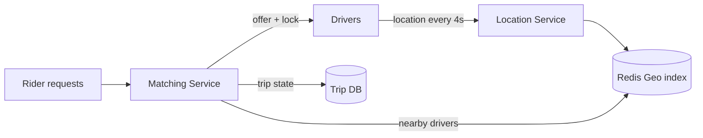
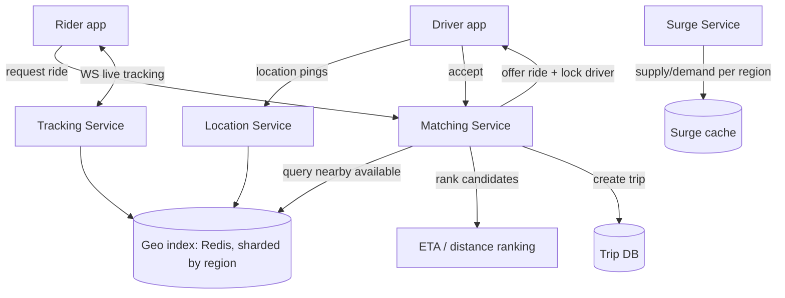

# 8. Uber / Lyft

Difficulty: ★★★★ Hard. A geospatial matching problem: indexing locations, finding nearby drivers, real-time location streams, and matching under contention. A full read takes about 26 minutes.

<!-- SECTION: tldr -->

## 0. Refresher TL;DR

1. **Geospatial index:** find nearby drivers fast with a **geohash / S2 / quadtree** index (not a brute-force distance scan). This is the heart of the problem.
2. **Live location:** drivers stream location every few seconds over a persistent connection; current positions live in an **in-memory geo store (Redis geo)**, not the durable DB.
3. **Matching:** query the geo index for candidates near the rider, rank, and **dispatch with a lock/offer** so two riders can't both get the same driver. See [Contention](../patterns/contention.md).
4. **Two write paths:** high-frequency location updates (ephemeral, huge volume) vs trip state (durable, transactional) — keep them separate.
5. **Surge:** computed per-region from supply/demand ratio, updated periodically — eventually consistent.



<!-- SECTION: table-of-contents -->

## Table of Contents

1. [Clarify & Requirements](#1-clarify-requirements)
2. [Estimation](#2-estimation)
3. [API Design](#3-api-design)
4. [Data Model](#4-data-model)
5. [High-Level Design](#5-high-level-design)
6. [Deep Dives](#6-deep-dives)
7. [Scaling & Failure Modes](#7-scaling-failure-modes)
8. [Operational Excellence & Incident Response](#8-operational-excellence-incident-response)
9. [Senior vs Staff Talking Points](#9-senior-vs-staff-talking-points)
10. [Review Checklist](#10-review-checklist)

<!-- SECTION: requirements -->

## 1. Clarify & Requirements

**Functional**

- Riders request a ride from A to B.
- Match a rider to a nearby available driver.
- Track driver/rider locations in real time during the trip.
- Fare estimation + surge pricing.

**Non-functional**

- **Low-latency matching** (seconds) and location updates.
- **High write volume** from continuous location pings.
- **Correctness on matching:** one driver → one active trip at a time.
- Geographically distributed; regional.

**Scope cuts:** payments, ratings, driver onboarding, maps/routing internals (assume a routing service exists).

<!-- SECTION: estimation -->

## 2. Estimation

- Say 10M active drivers pinging location every ~4s → **~2.5M location writes/sec**. This is the dominant write load and it's *ephemeral* (only the latest matters).
- Ride requests far lower (~10K-100K/sec peak).
- Location data churns constantly; you don't durably store every ping — you keep the **current** position in memory and optionally sample a trail.

> **Conclusion:** two very different workloads — a firehose of ephemeral location updates (→ in-memory geo store) and lower-volume durable trip transactions (→ DB). Separate them.

<!-- SECTION: api -->

## 3. API Design

```
POST /drivers/location   { driver_id, lat, lng }        (high frequency)
POST /rides/request      { rider_id, pickup, dropoff }  → { ride_id, status: matching }
GET  /rides/{id}         → { status, driver, eta }
WS   /rides/{id}/track   live location stream during trip
GET  /fare/estimate?pickup=..&dropoff=..  → { fare, surge_multiplier }
```

<!-- SECTION: data-model -->

## 4. Data Model

```
driver_location  (Redis geo / in-memory)
  driver_id -> { lat, lng, status(available|on_trip), updated_at }

trip  (durable DB)
  ride_id     STRING (PK)
  rider_id, driver_id
  status      ENUM(requested, matched, enroute, ongoing, completed, cancelled)
  pickup, dropoff, fare
  created_at, updated_at

surge_by_region (cache)
  region_id -> multiplier
```

**Storage choice:** **current locations in Redis** (geo commands, TTL, sub-ms) — durable storage of 2.5M ephemeral writes/sec would be wasteful and pointless. **Trips in a relational/strongly-consistent store** (transactions matter — a trip's lifecycle and the driver-assignment must be correct). See [Datastores](../key-technologies/datastores.md).

<!-- SECTION: high-level -->

## 5. High-Level Design



<!-- SECTION: deep-dives -->

## 6. Deep Dives

### Deep dive 1 — Geospatial indexing (the core)

"Find available drivers within 2km of the rider" — you can't scan millions of drivers computing distance each time. You need a **spatial index**:

| Approach | Idea | Notes |
|---|---|---|
| **Geohash** | Encode lat/lng into a string prefix; nearby points share prefixes | Simple; query a cell + its 8 neighbors; uneven cell density |
| **S2 (Google)** | Map sphere to cells via a Hilbert curve | Used by Uber/Google; good uniformity, hierarchical |
| **Quadtree** | Recursively subdivide space; denser areas split more | Adapts to density; rebalancing needed |
| **H3 (Uber)** | Hexagonal hierarchical grid | Uber's own; even neighbor distances |

**Mechanism:** index each driver under their cell. A rider's query maps their location to a cell and reads that cell + neighbors, returning candidate drivers — turning an O(N) distance scan into an O(drivers-in-a-few-cells) lookup. **Redis geo commands** (`GEOADD`/`GEOSEARCH`) implement this directly.

> **Why a geo index:** "Proximity search over millions of moving points must not be a linear scan. A geohash/S2/quadtree groups nearby points so a query touches only a handful of cells. I'd shard the index by region so each city's load is independent."

### Deep dive 2 — Location update firehose

2.5M pings/sec, but only the **latest** position matters:

- Write current location to the **in-memory geo store** (overwrite, with TTL so stale drivers drop out).
- Don't durably persist every ping; optionally sample a sparse trail for trip records/analytics asynchronously.
- Shard the geo store **by region** so the write load is distributed and a query stays within a region's shard.

This is [scaling writes](../patterns/scaling-writes.md) by recognizing the data is ephemeral — the cheapest write is the one you don't durably store.

### Deep dive 3 — Matching under contention

When a rider requests, the matcher finds nearby drivers and offers the ride. The hazard: two riders matched to the **same** driver.

- Query candidates → rank by ETA/distance → **offer** to the best, marking the driver **reserved/locked** (status flips to "offered") so concurrent matches skip them. See [Contention](../patterns/contention.md).
- If the driver declines or times out, **release the lock** and offer the next candidate.
- The driver-assignment + trip creation is a **transaction** (or an atomic compare-and-set on driver status) so one driver maps to exactly one active trip.

> **Why a lock/offer, not just "pick nearest":** matching is a race — many riders, shared driver pool. Without reserving the driver during the offer window, two trips could claim them. An atomic status transition (available → offered → on_trip) serializes it.

### Deep dive 4 — Surge pricing

Per region, compute a **supply/demand ratio** (waiting riders ÷ available drivers) on a short interval; map to a multiplier; cache per region. Riders read the cached multiplier at request time. It's **eventually consistent** and approximate by design — recomputed every few seconds, not per request.

<!-- SECTION: scaling -->

## 7. Scaling & Failure Modes

| Concern | Handling |
|---|---|
| **2.5M location writes/sec** | In-memory geo store, sharded by region; ephemeral (overwrite + TTL) |
| **Hot region (downtown rush)** | Finer-grained cells; shard that region further; the index is regional so blast radius is local |
| **Double-matching a driver** | Atomic status transition / lock during the offer window |
| **Driver app offline** | TTL drops stale locations from the index automatically |
| **Geo store failure** | Regional sharding limits blast radius; drivers re-register on reconnect |
| **Trip DB consistency** | Strongly-consistent store + transactions for trip lifecycle |

<!-- SECTION: operations -->

## 8. Operational Excellence & Incident Response

**Operational excellence:** Two workloads need two SLO views. For matching, watch **time-to-match** and **match-success rate per region** (the rider-facing SLO); for the location firehose, watch **ingest lag / location staleness** and geo-store **saturation**. Dashboard per region, not just globally — a healthy fleet average hides a melting downtown cell. Roll out matching changes behind per-region feature flags so a bad ranking tweak is contained and instantly reversible.

**Incident response:** The defining incident is a regional geo-store failure — but because the index is sharded by region, the blast radius is one city, and drivers re-register on reconnect as TTLs refresh. Detect it via a spike in stale-location ratio or a drop in regional match success. Surge is the other hazard: a bad supply/demand signal or feedback loop can spike prices, so cap the multiplier and keep a kill switch to pin surge to 1.0. Double-matching is guarded by the atomic available→offered→on_trip transition rather than by alerting, but track its conflict rate as a correctness signal. Codify regional failover and surge-disable into runbooks, and run blameless postmortems that tighten those guards.

<!-- SECTION: talking-points -->

## 9. Senior vs Staff Talking Points

- **Senior:** "Geohash/S2 index in Redis for proximity search, ephemeral in-memory location updates, lock the driver during the match offer, surge computed per region."
- **Staff:** "I'd split the system by workload: a firehose of ephemeral location pings that only ever needs the latest value goes to an in-memory geo index sharded by region — durably storing 2.5M writes/sec would be pure waste — while the trip lifecycle goes to a strongly-consistent transactional store because assignment correctness matters. The matching race is the subtle part: I reserve the driver with an atomic available→offered→on_trip transition during the offer window so two riders can't claim the same driver. Regional sharding keeps a hot downtown's load and failures local."
- Reusable lessons: **spatial indexing for proximity**, **don't durably store ephemeral data**, and **matching is a contention problem**.

<!-- SECTION: review-checklist -->

## 10. Review Checklist

- [ ] Can you explain geohash/S2/quadtree and why proximity search can't be a linear scan?
- [ ] Why keep current locations in memory and not durably store every ping?
- [ ] Why shard the geo index by region?
- [ ] How do you prevent double-matching a driver (atomic status / lock)?
- [ ] Why are surge prices computed periodically and eventually consistent?
- [ ] Which parts need strong consistency (trip) vs not (location, surge)?
