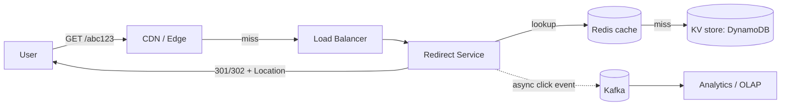
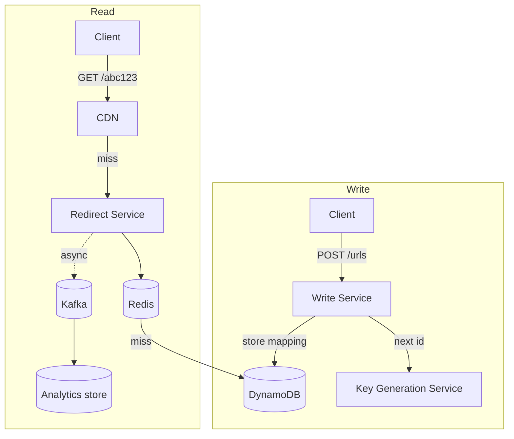

# 1. URL Shortener (Bitly)

Difficulty: ★ Easy. The canonical warm-up — but a great answer still shows read-scaling and key-generation depth. A full read takes about 20 minutes; re-skim the TL;DR before an interview.

<!-- SECTION: tldr -->

## 0. Refresher TL;DR

The five decisions that define this design:

1. **Key generation:** pre-generate keys with a counter + **base62 encode**, or hash + collision-check. Avoid read-check-write races.
2. **Storage:** a **key-value store** (DynamoDB) — access is purely by short code, no joins. Relational works too at small scale.
3. **Read path is everything:** ~100:1 read/write. **Cache-aside (Redis) + CDN** carry the redirects; the DB is mostly a cold fallback.
4. **Redirect:** **301 (permanent)** caches in browsers and saves load but kills analytics; **302 (temporary)** preserves click tracking. Pick 302 if analytics matter.
5. **Analytics** is a *separate* write path — fire an async event to a stream, never block the redirect on a counter write.



<!-- SECTION: table-of-contents -->

## Table of Contents

1. [Clarify & Requirements](#1-clarify-requirements)
2. [Estimation](#2-estimation)
3. [API Design](#3-api-design)
4. [Data Model](#4-data-model)
5. [High-Level Design](#5-high-level-design)
6. [Deep Dives](#6-deep-dives)
7. [Scaling & Failure Modes](#7-scaling-failure-modes)
8. [Operational Excellence & Incident Response](#8-operational-excellence-incident-response)
9. [Senior vs Staff Talking Points](#9-senior-vs-staff-talking-points)
10. [Review Checklist](#10-review-checklist)

<!-- SECTION: requirements -->

## 1. Clarify & Requirements

**Functional**

- Shorten a long URL → return a short URL.
- Redirect a short URL → original.
- Optional: custom alias, expiry, click analytics.

**Non-functional**

- **Read-heavy** (redirects ≫ creations), ~100:1.
- Redirects must be **low latency** (<~100ms) and **highly available** — a dead shortener breaks every embedded link.
- Short codes must be **unique** and ideally short (~7 chars).
- Analytics can be **eventually consistent**.

**Scope cuts (say these out loud):** skip user accounts, abuse/spam detection, and billing unless asked. Focus on generation, redirect, and read scale.

<!-- SECTION: estimation -->

## 2. Estimation

Assume 100M new URLs/month and 100:1 read:write.

- Writes: 100M / 2.6M sec ≈ **~40 writes/sec** (peak ~400/sec).
- Reads: ≈ **~4,000 reads/sec** (peak ~40K/sec).
- Storage: 100M/month × 12 × 5yr ≈ **6B records**. At ~500 bytes each ≈ **~3 TB**. Trivial for any modern store.
- **Keyspace:** base62 (a-z, A-Z, 0-9). 62⁷ ≈ **3.5 trillion** combinations — 7 chars is plenty.

> **Conclusion that drives design:** 40K peak reads/sec on a tiny dataset means the *read path*, not storage, is the whole problem → cache + CDN. Writes are negligible.

<!-- SECTION: api -->

## 3. API Design

```
POST /urls            { "long_url": "...", "alias?": "...", "ttl?": 3600 }
                      → 201 { "short_url": "https://sho.rt/abc123" }

GET  /{short_code}    → 302 Found, Location: <long_url>
                      (or 301 Permanent)

GET  /urls/{code}/stats → { clicks, referrers, ... }   (optional)
```

<!-- SECTION: data-model -->

## 4. Data Model

One core entity:

```
url_mapping
  short_code   STRING (PK)      -- "abc123"
  long_url     STRING
  created_at   TIMESTAMP
  expires_at   TIMESTAMP NULL
  owner_id     STRING NULL
```

**Storage choice:** a **key-value store like DynamoDB** — every access is a point lookup by `short_code`, there are no joins or range scans, and it scales reads/writes horizontally with predictable latency. *A single Postgres also works fine at this scale* (3 TB, 40K reads/sec served mostly from cache) — say that, then justify whichever you pick. See [Datastores](../key-technologies/datastores.md).

<!-- SECTION: high-level -->

## 5. High-Level Design

The write path creates a mapping; the read path redirects. They scale very differently, so design them separately.



<!-- SECTION: deep-dives -->

## 6. Deep Dives

### Deep dive 1 — Key generation (the heart of the problem)

Three approaches; know the trade-offs:

| Approach | How | Pro | Con |
|---|---|---|---|
| **Hash (MD5/SHA) + truncate** | Hash the long URL, take first 7 base62 chars | Stateless, deterministic | Collisions → must check-and-retry; same URL → same code (may be undesirable) |
| **Random + collision check** | Generate random 7-char code, check DB | Simple, unguessable | Read-check-write race; collisions grow as keyspace fills |
| **Counter + base62 encode** | Global incrementing ID → encode to base62 | No collisions ever, short codes | Need a distributed counter; codes are sequential/guessable |

**Recommended: counter + base62.** A monotonic ID guarantees uniqueness with zero collision checks. To avoid a single-counter bottleneck, hand out **ID ranges in blocks** to each app server (e.g., a Key Generation Service / ZooKeeper or a DB sequence gives server A ids 1-1000, server B 1001-2000). Each server then base62-encodes locally.

> **Why this beats random+check:** the naive "generate random, SELECT to check, INSERT" is a [read-check-write race](../patterns/contention.md) — two requests can pick the same code between the check and the insert. The counter approach sidesteps contention entirely. If asked to avoid guessable sequential codes, base62-encode the counter then XOR/permute, or interleave with a per-server prefix.

### Deep dive 2 — Scaling the read path

40K peak redirects/sec on a 3 TB dataset: the read path dominates. Escalation ladder (see [Scaling Reads](../patterns/scaling-reads.md)):

1. **Cache-aside with Redis** — the working set (recently/popular links) is tiny and hot. A high hit rate means most redirects never touch the DB.
2. **CDN / edge** — for very hot links, cache the redirect response at the edge so it never reaches origin.
3. **Read replicas** — the DB serves only cold misses; replicas absorb those.

*Why cache-aside:* reads dominate and a brief staleness window is harmless (a mapping rarely changes). *Failure mode:* a viral link's cache entry expiring → stampede onto the DB → add **TTL jitter + request coalescing**.

### Deep dive 3 — 301 vs 302 redirect

| | 301 Permanent | 302 Temporary |
|---|---|---|
| Browser caches it | Yes → fewer requests, less load | No → every click hits you |
| Analytics | **Broken** (subsequent clicks skip you) | **Works** (every click comes through) |
| Use when | You don't need per-click analytics | You need click tracking |

> **The trade-off to verbalize:** "301 offloads traffic but blinds your analytics; 302 keeps every click visible at the cost of load. Since the prompt wants click analytics, I'd use 302 and lean on caching for the load."

### Deep dive 4 — Analytics without blocking redirects

Never increment a click counter synchronously on the redirect — it adds a write to the hot read path and creates [write contention](../patterns/scaling-writes.md) on popular links. Instead, **fire an async event** (`click` → Kafka) and aggregate downstream into an OLAP store. The redirect returns immediately; counts are eventually consistent.

<!-- SECTION: scaling -->

## 7. Scaling & Failure Modes

| Concern | Handling |
|---|---|
| **10x reads** | Bigger cache + more CDN edge caching + read replicas; storage is unaffected |
| **Hot link (viral)** | Edge-cache it; TTL jitter + coalescing to prevent stampede |
| **Cache down** | Degrade to DB reads behind a circuit breaker — never a hard dependency |
| **Counter/KGS down** | Servers pre-fetch ID blocks, so they keep minting codes through a brief outage |
| **Expiry cleanup** | TTL on the row (DynamoDB TTL) or a lazy sweep — don't scan the whole table |

<!-- SECTION: operations -->

## 8. Operational Excellence & Incident Response

**Operational excellence:** The redirect path defines the SLO — target ~99.99% availability and p99 < ~100ms, since a dead or slow shortener silently breaks every embedded link in the wild. Watch three signals: **cache hit rate** (a dip is the leading indicator of impending DB overload), **redirect error/latency**, and **ID-block headroom** on the key-generation service. Ship the redirect service via canary with instant rollback — it's the highest-blast-radius component, so never roll it out fleet-wide at once.

**Incident response:** The classic incident is the cache tier degrading — redirects fall through to the DB and latency climbs toward a cascading overload. Mitigation is built in: a circuit breaker sheds to DB reads (cache is an accelerator, not a hard dependency), and a viral link's entry expiring is contained by TTL jitter + request coalescing so one hot key can't stampede the origin. If key generation stalls, servers keep minting from pre-fetched ID blocks, so it's a warning, not a page. Keep runbooks for cache cold-start and ID-block exhaustion, and run blameless postmortems that turn each event into a new alert threshold or guardrail.

<!-- SECTION: talking-points -->

## 9. Senior vs Staff Talking Points

- **Senior:** "Counter + base62 to avoid collision races; cache-aside since it's 100:1 read-heavy; 302 to keep analytics."
- **Staff:** "I'd separate the analytics write path from the redirect path entirely — coupling them makes the hot read path pay for counter contention on viral links. ID generation hands out ranges per server so there's no global counter bottleneck or single point of failure, and I'd add edge caching with TTL jitter so a viral link can't stampede the origin when its entry expires."
- The whole problem is really **read scaling + safe unique-key generation**; everything else is plumbing.

<!-- SECTION: review-checklist -->

## 10. Review Checklist

- [ ] Can you justify counter+base62 over random+collision-check (the race)?
- [ ] Can you size the keyspace (62⁷) and explain why 7 chars suffices?
- [ ] Can you give the read-scaling ladder and why cache-aside fits?
- [ ] 301 vs 302 — the analytics trade-off?
- [ ] Why analytics must be an async, separate write path?
- [ ] How you avoid a single-counter bottleneck (ID ranges per server)?
