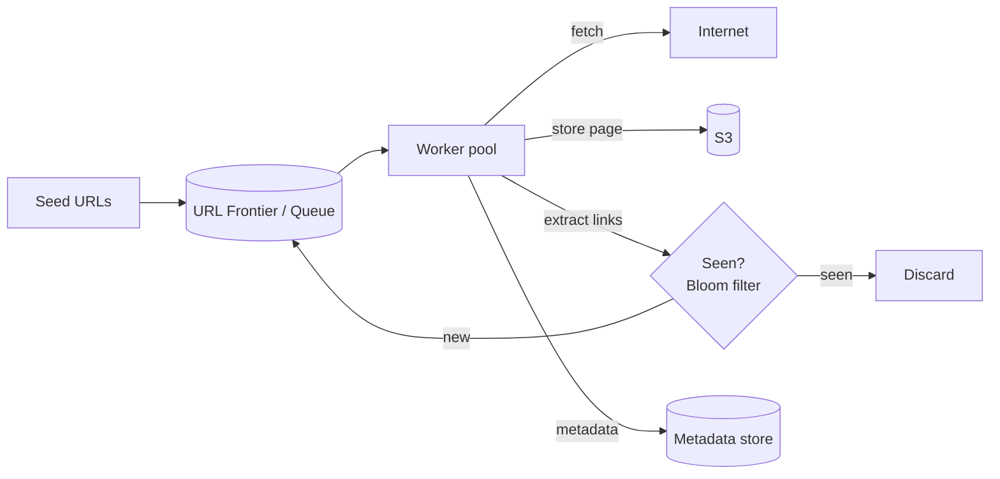
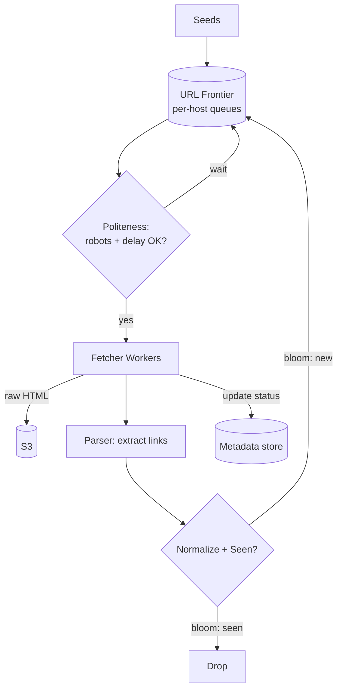

# 4. Web Crawler

Difficulty: ★★ Medium. A queue-and-workers problem with interesting twists: dedup at scale (bloom filters), politeness, and BFS frontier management. A full read takes about 22 minutes.

<!-- SECTION: tldr -->

## 0. Refresher TL;DR

1. **Architecture:** a **URL frontier (queue) + worker pool** — the canonical [long-running task](../patterns/long-running-tasks.md) shape, scaled out. Workers fetch, parse, extract links, enqueue new URLs.
2. **Dedup:** "have I seen this URL?" across billions → **bloom filter** (fast, memory-cheap, small false-positive rate) in front of a durable seen-set.
3. **Politeness:** don't hammer one host — **per-host rate limiting / queues**, respect `robots.txt`, crawl-delay.
4. **Storage:** raw pages → **S3/blob store**; URL/metadata + link graph → a scalable store. Bytes dominate.
5. **Frontier prioritization:** BFS by default; prioritize by page rank / freshness; partition the frontier by host for politeness.



<!-- SECTION: table-of-contents -->

## Table of Contents

1. [Clarify & Requirements](#1-clarify-requirements)
2. [Estimation](#2-estimation)
3. [API & Components](#3-api-components)
4. [Data Model](#4-data-model)
5. [High-Level Design](#5-high-level-design)
6. [Deep Dives](#6-deep-dives)
7. [Scaling & Failure Modes](#7-scaling-failure-modes)
8. [Operational Excellence & Incident Response](#8-operational-excellence-incident-response)
9. [Senior vs Staff Talking Points](#9-senior-vs-staff-talking-points)
10. [Review Checklist](#10-review-checklist)

<!-- SECTION: requirements -->

## 1. Clarify & Requirements

**Functional**

- Start from seed URLs, fetch pages, extract links, recurse.
- Store page content for downstream use (indexing, ML training).
- Respect `robots.txt` and politeness (don't overload sites).
- Avoid re-crawling the same URL; re-crawl periodically for freshness.

**Non-functional**

- **Massive scale:** billions of pages.
- **Polite:** never DoS a host.
- **Fault-tolerant:** workers crash; the crawl must resume without losing or duplicating work.
- **Extensible:** pluggable parsing/filtering.

**Scope cuts:** skip JavaScript rendering, the search index itself, and ranking — focus on the crawl.

<!-- SECTION: estimation -->

## 2. Estimation

Target 1B pages/month.

- Fetch rate: 1B / 2.6M sec ≈ **~400 pages/sec** sustained (peak higher) → a worker pool, not one machine.
- Storage: 1B × ~100 KB avg ≈ **~100 TB/month** of raw HTML → **object storage**, compressed.
- Seen-set: billions of URL hashes. A naive hash set is huge in RAM → **bloom filter** to keep membership checks cheap.

> **Conclusion:** the hard parts are (a) checking "seen?" billions of times cheaply, and (b) being polite while parallel — these drive the bloom filter and per-host frontier decisions.

<!-- SECTION: api -->

## 3. API & Components

Not a user API; the components are:

| Component | Role |
|---|---|
| **URL Frontier** | Priority queue(s) of URLs to crawl, partitioned by host |
| **Fetcher workers** | Download pages (with DNS cache, connection pooling) |
| **Parser** | Extract links + content from fetched pages |
| **Dedup service** | Bloom filter + durable seen-set |
| **Content store** | S3 for raw pages |
| **Metadata store** | URL status, last-crawled, link graph |
| **Politeness manager** | robots.txt cache + per-host rate control |

<!-- SECTION: data-model -->

## 4. Data Model

```
url_metadata
  url_hash     BYTES (PK)      -- hash of normalized URL
  url          STRING
  status       ENUM(pending, crawled, failed)
  last_crawled TIMESTAMP
  host         STRING
  s3_key       STRING NULL     -- pointer to stored page

robots_cache
  host         STRING (PK)
  rules        TEXT
  crawl_delay  INT
  fetched_at   TIMESTAMP
```

**Storage choice:** raw pages → **S3** (cheap, huge, durable). URL metadata + the link graph → a **wide-column / KV store** (Cassandra/Bigtable) keyed by URL hash — access is by-key membership and status updates at huge scale, no joins. See [Datastores](../key-technologies/datastores.md).

<!-- SECTION: high-level -->

## 5. High-Level Design



<!-- SECTION: deep-dives -->

## 6. Deep Dives

### Deep dive 1 — Dedup with bloom filters

Before enqueuing an extracted URL, ask "have we seen it?" Billions of times. A hash set of all URLs would need terabytes of RAM.

A **bloom filter** is a probabilistic membership structure: a bit array + k hash functions. It answers "definitely not seen" or "probably seen," using a few bits per element.

- **Trade-off:** false positives (says "seen" when new → you skip a real URL) but **never false negatives**. Tune the size for an acceptable FP rate (e.g., 1%).
- Back it with a **durable seen-set** (in the metadata store) for cases where correctness matters; the bloom filter is the cheap front-line filter that avoids most lookups.

> **Why a bloom filter:** "We can't keep billions of URLs in a RAM hash set, so a bloom filter gives O(1) membership in a few bits per URL; the cost is a small false-positive rate, meaning we occasionally skip a URL we haven't actually crawled — acceptable for a crawler."

### Deep dive 2 — Politeness (the part juniors miss)

A parallel crawler can accidentally DoS a site. Politeness means:

- **Respect `robots.txt`** — cache per host, honor disallow rules and `crawl-delay`.
- **Per-host rate limiting** — partition the frontier so each host's URLs go to a queue/worker that paces requests (e.g., 1 req/sec/host). This is why the frontier is partitioned by host, not globally FIFO.
- **Back off** on 429/503 from a host.

> **Why partition the frontier by host:** politeness is per-host, so you need per-host ordering and pacing. A single global queue would either crawl one host too fast or serialize everything too slowly. Mapping host → queue → worker gives parallelism *across* hosts and politeness *within* a host.

### Deep dive 3 — Frontier as the resumable work queue

The frontier is a [durable queue + worker pool](../patterns/long-running-tasks.md). Key properties:

- **Durable** (Kafka/SQS or a DB-backed queue) so a worker crash doesn't lose URLs.
- **At-least-once** delivery → workers must be **idempotent** (re-fetching a page is harmless if dedup + content overwrite are idempotent).
- **Prioritized:** BFS by default; you can prioritize by domain importance or freshness needs.

### Deep dive 4 — Freshness & re-crawling

Pages change. Track `last_crawled` and re-enqueue URLs on a schedule weighted by how often a page changes (news sites often, archives rarely). This is a second producer into the frontier.

<!-- SECTION: scaling -->

## 7. Scaling & Failure Modes

| Concern | Handling |
|---|---|
| **Worker crash** | Durable frontier + at-least-once + idempotent fetch; visibility timeout re-queues |
| **Spider trap (infinite URLs)** | Max depth/URL limits per host, detect parameter explosions |
| **Bloom filter fills up** | Scale/rotate filters (partition by host shard), or use a scalable/counting bloom filter |
| **Hot host (huge site)** | Dedicated per-host queue with its own pacing; shard that host's URL space |
| **Duplicate content (same page, many URLs)** | Content hashing (dedup by body, not just URL) |
| **DNS bottleneck** | Cache DNS aggressively in the fetcher |

<!-- SECTION: operations -->

## 8. Operational Excellence & Incident Response

**Operational excellence:** A crawler is a long-running pipeline, so the health signals are **frontier queue depth and age** (is the backlog growing or draining?), **crawl throughput (pages/sec)**, **politeness-violation rate** (requests exceeding per-host limits), and **dedup false-positive rate** (the bloom filter silently dropping new URLs). Dashboard worker-fleet saturation and fetch error rates by domain. Roll out parser/extractor changes on a canary subset of workers — a regression can poison the frontier fleet-wide.

**Incident response:** The classic incidents are a **crawler trap** (infinite or generated URL space) and a **poison page** that crashes the parser. Detect via a runaway queue-growth alert or a spike in fetch/parse errors from one domain, and mitigate by quarantining the offending domain/URL pattern and tightening per-host limits. Worker crashes are routine, not incidents: because consumers are idempotent and work is re-enqueued on visibility timeout, a dead worker just means its in-flight URLs get retried — track redelivery rate to catch a poison message looping forever. Keep runbooks for trap quarantine and bloom-filter resize/rotation; blameless postmortems convert each trap into a new frontier guardrail.

<!-- SECTION: talking-points -->

## 9. Senior vs Staff Talking Points

- **Senior:** "Frontier queue + worker pool, bloom filter for dedup, store pages in S3, respect robots.txt with per-host rate limits."
- **Staff:** "Two design forces dominate: cheap membership at billions of URLs (bloom filter front-line + durable seen-set backstop, accepting a tuned false-positive rate), and politeness, which forces a host-partitioned frontier so I get cross-host parallelism with per-host pacing. The frontier is a durable at-least-once queue, so fetch must be idempotent, and I'd dedup on content hash too — the same page hides behind many URLs. For freshness, a scheduler re-enqueues URLs weighted by change rate."
- Reusable lessons: **bloom filters for huge membership sets**, and **partition the work queue by the dimension your constraint operates on** (here, host).

<!-- SECTION: review-checklist -->

## 10. Review Checklist

- [ ] Can you explain a bloom filter, its false-positive (not false-negative) property, and why it fits dedup?
- [ ] Why is the frontier partitioned by host (politeness + parallelism)?
- [ ] How do you respect robots.txt and pace per host?
- [ ] Why must fetch workers be idempotent (at-least-once queue)?
- [ ] How do you handle spider traps and duplicate content?
- [ ] How do you re-crawl for freshness?
