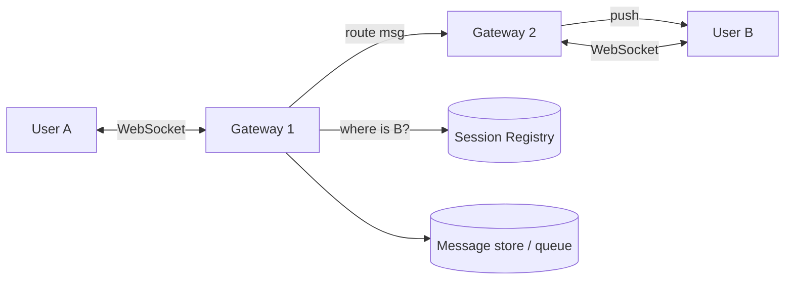
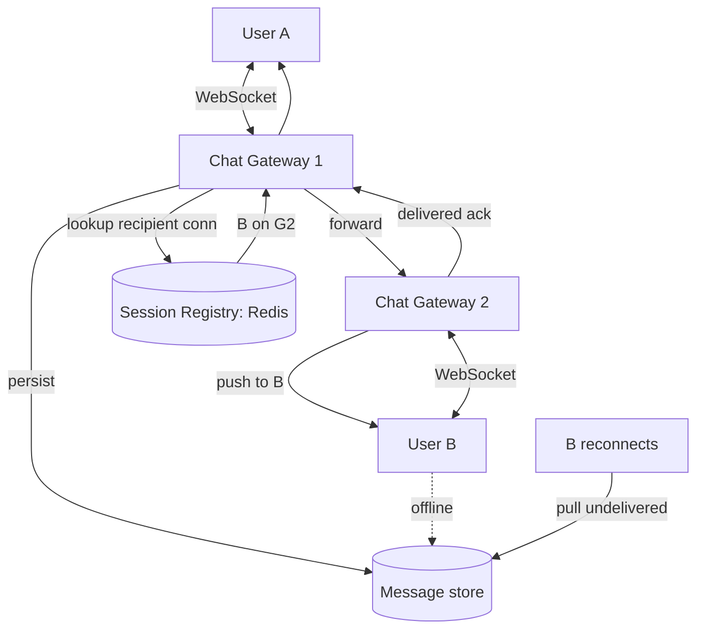

# 6. WhatsApp / Chat

Difficulty: ★★★ Medium. Real-time messaging: persistent connections, delivery guarantees, presence, and group fan-out. A full read takes about 25 minutes.

<!-- SECTION: tldr -->

## 0. Refresher TL;DR

1. **Transport:** **WebSockets** (persistent, bidirectional) between client and a stateful gateway — not polling. See [HTTP & Realtime](../foundations/http-and-realtime.md).
2. **Connection routing:** a **session registry** maps user → which gateway server holds their live connection, so a sender's server can route a message to the recipient's server.
3. **Delivery + offline:** messages persist to a **per-user inbox/message store**; if the recipient is offline, store and deliver on reconnect. Track **sent → delivered → read** receipts.
4. **Ordering & idempotency:** per-conversation ordering via sequence numbers; client-generated message IDs make retries idempotent (no dupes).
5. **Groups:** fan-out a group message to each member's inbox; large groups are a smaller-scale fan-out problem.



<!-- SECTION: table-of-contents -->

## Table of Contents

1. [Clarify & Requirements](#1-clarify-requirements)
2. [Estimation](#2-estimation)
3. [API Design](#3-api-design)
4. [Data Model](#4-data-model)
5. [High-Level Design](#5-high-level-design)
6. [Deep Dives](#6-deep-dives)
7. [Scaling & Failure Modes](#7-scaling-failure-modes)
8. [Operational Excellence & Incident Response](#8-operational-excellence-incident-response)
9. [Senior vs Staff Talking Points](#9-senior-vs-staff-talking-points)
10. [Review Checklist](#10-review-checklist)

<!-- SECTION: requirements -->

## 1. Clarify & Requirements

**Functional**

- 1:1 messaging; group messaging.
- Delivery + read receipts (sent / delivered / read).
- Online/last-seen presence.
- Offline delivery (recipient gets messages on reconnect).
- Media messages (images, video).

**Non-functional**

- **Low latency** real-time delivery.
- **Reliable:** messages must not be lost; delivered exactly once to the user (no dupes).
- **Ordered** within a conversation.
- Highly available; billions of users, hundreds of billions of messages/day.

**Scope cuts:** end-to-end encryption mechanics, voice/video calls (mention them, don't design).

<!-- SECTION: estimation -->

## 2. Estimation

- 2B users, 100B messages/day → **~1-2M messages/sec** average, multiples at peak.
- **Connections:** tens of millions to billions of *concurrent* WebSocket connections → many gateway servers, each holding ~100K-1M connections. Connection management is a core challenge.
- Message size small (~100s of bytes text); media goes to blob storage separately.
- Storage: messages are often short-lived on the server (delivered then optionally dropped) — clarify retention. If stored, 100B/day × small = large but manageable in a wide-column store.

> **Conclusion:** the hard parts are (a) holding millions of persistent connections and routing between them, and (b) reliable, ordered, exactly-once-to-user delivery including offline.

<!-- SECTION: api -->

## 3. API Design

Over the WebSocket (message frames), plus some REST:

```
WS send:     { type: "msg", client_msg_id, conversation_id, text }
WS receive:  { type: "msg", msg_id, seq, sender, text, ts }
WS receipt:  { type: "ack", msg_id, state: delivered|read }

REST:
POST /conversations            create group
GET  /conversations/{id}/messages?cursor=...   history (cursor pagination)
POST /media  -> presigned URL  (media uploaded to blob store)
```

<!-- SECTION: data-model -->

## 4. Data Model

```
message
  msg_id          SNOWFLAKE (PK)
  conversation_id STRING
  seq             BIGINT          -- per-conversation ordering
  sender_id       STRING
  body            STRING / media_key
  created_at      TIMESTAMP
  -- partition by conversation_id

session_registry  (Redis)
  user_id -> { gateway_server, conn_id, last_seen }

receipt
  msg_id, user_id, state(delivered|read), ts
```

**Storage choice:** messages in a **wide-column store (Cassandra)** partitioned by `conversation_id`, clustered by `seq` — so reading a conversation is a single-partition ordered scan, and writes scale horizontally. Session registry in **Redis** (ephemeral, fast). Media in **S3**. *Why wide-column:* the access pattern is "read a conversation's messages in order" and "append a message" at enormous write volume — exactly its sweet spot. See [Datastores](../key-technologies/datastores.md).

<!-- SECTION: high-level -->

## 5. High-Level Design



<!-- SECTION: deep-dives -->

## 6. Deep Dives

### Deep dive 1 — Connection management & routing

Clients hold a **WebSocket** to a **stateful gateway** server. To deliver A→B, A's gateway must find B's connection:

- A **session registry** (Redis) maps `user_id → {gateway_server, conn_id}`, updated on connect/disconnect.
- A's gateway looks up B, then forwards the message to B's gateway (via internal RPC or a message bus), which pushes it down B's socket.

> **Why WebSockets over polling:** real-time chat needs server-initiated push with low latency; polling wastes resources and adds lag, and SSE is one-way. WebSockets give a single bidirectional connection. The cost is **stateful servers** — a load balancer must keep a connection pinned, and you need the registry to route across the fleet. See [HTTP & Realtime](../foundations/http-and-realtime.md).

### Deep dive 2 — Reliable delivery & offline

Messages must survive crashes and reach offline users:

1. On send, **persist the message** to the store *before* acking the sender (durable).
2. If the recipient is **online**, push immediately; await a **delivered** ack.
3. If **offline** (or push unacked), it stays in their inbox/undelivered set; on reconnect the client **pulls undelivered messages** by last-seen seq.
4. **Receipts:** the recipient's `delivered` and `read` events flow back to the sender the same way.

This is at-least-once at the transport layer; **exactly-once *to the user*** is achieved with dedup on message ID.

### Deep dive 3 — Ordering & idempotency

- **Per-conversation ordering:** assign a monotonic `seq` per conversation (or rely on time-sortable Snowflake IDs). Clients render by seq.
- **Idempotency:** the client attaches a `client_msg_id`; retries (after a flaky network) carry the same ID, so the server dedups and doesn't create a second message. This prevents the "sent twice" bug on retry. See [Multi-step Processes](../patterns/multi-step-processes.md).

### Deep dive 4 — Presence & group fan-out

- **Presence (online/last-seen):** gateways heartbeat each connection; the registry tracks `last_seen`. Broadcasting every presence change to all contacts is expensive — debounce/aggregate, and compute presence on demand for the chats a user is viewing.
- **Groups:** a group message fans out to each member's inbox (a bounded [fan-out](../patterns/scaling-writes.md) — groups are far smaller than a celebrity's followers). For very large groups, fan out asynchronously and consider read-time pull, mirroring the [news feed](news-feed.md) hybrid.

<!-- SECTION: scaling -->

## 7. Scaling & Failure Modes

| Concern | Handling |
|---|---|
| **Millions of connections** | Many gateway servers; sticky routing; horizontal scale; registry tracks placement |
| **Gateway crash** | Clients auto-reconnect to another gateway; pull undelivered on reconnect; registry updated |
| **Duplicate on retry** | client_msg_id dedup → exactly-once to the user |
| **Out-of-order** | Per-conversation seq; client sorts |
| **Large group** | Async fan-out; cap; read-time pull for huge groups |
| **Presence storms** | Debounce; compute on demand, not broadcast-all |
| **Hot conversation partition** | Single conversation is naturally bounded; partition by conversation_id |

<!-- SECTION: operations -->

## 8. Operational Excellence & Incident Response

**Operational excellence:** The SLOs that matter are **message-delivery latency** (send→deliver p99) and **delivery success rate**. Watch **active connection count and churn**, **undelivered-queue depth** (messages waiting on offline recipients), and per-gateway saturation. Connection state is the operational pressure point, so dashboard reconnection rate and gateway fan-in. Roll out gateway changes gradually — a bad deploy drops millions of live connections at once — draining connections before rolling and canarying first.

**Incident response:** The defining incident is a **WebSocket gateway crash**, which triggers a **reconnection storm** as every dropped client retries simultaneously. Mitigate with jittered/backoff reconnects on the client plus capacity headroom and a load balancer that spreads the reconnects across healthy gateways. Because delivery is **at-least-once**, recipients dedup on `client_msg_id`, so a redelivery after reconnect is harmless — track the duplicate rate to confirm dedup is working. Undelivered messages persist until the recipient returns, so a queue-depth spike is a warning, not data loss. Keep runbooks for gateway failover and reconnection-storm throttling; blameless postmortems harden the reconnect path.

<!-- SECTION: talking-points -->

## 9. Senior vs Staff Talking Points

- **Senior:** "WebSockets to stateful gateways, a Redis session registry to route between users, persist before ack, pull undelivered on reconnect, seq for ordering."
- **Staff:** "Two crux problems: routing across millions of stateful connections, which I solve with a session registry mapping user→gateway plus inter-gateway forwarding; and reliable exactly-once-*to-the-user* delivery, which I get from persist-before-ack + offline inbox + client_msg_id dedup on retry. Presence is a hidden scaling trap — broadcasting every status change is quadratic, so I debounce and compute on demand. Groups are a bounded fan-out, but I'd switch very large groups to read-time pull just like a feed."
- The reusable lessons: **stateful connections need a routing registry**, and **idempotency keys turn at-least-once transport into exactly-once UX**.

<!-- SECTION: review-checklist -->

## 10. Review Checklist

- [ ] Why WebSockets, and what's the cost (stateful servers + routing)?
- [ ] How does the session registry route a message between two users on different gateways?
- [ ] How do you guarantee delivery to offline users (persist + pull on reconnect)?
- [ ] How do client_msg_ids give exactly-once-to-user on retry?
- [ ] How do you order messages within a conversation?
- [ ] Why is presence a scaling trap, and how do you tame it?
