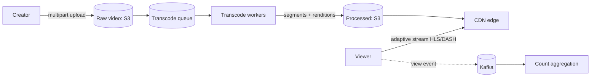
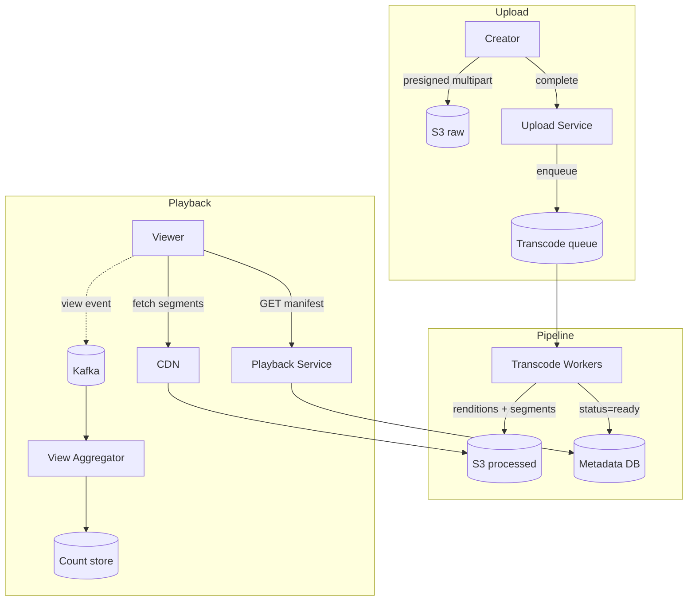
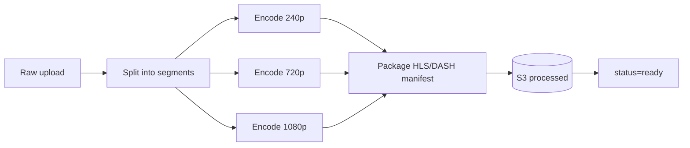

# 7. YouTube / Video Streaming

Difficulty: ★★★★ Medium-Hard. Combines large-blob upload, an async transcoding pipeline, global CDN delivery, and high-volume view counting. A full read takes about 26 minutes.

<!-- SECTION: tldr -->

## 0. Refresher TL;DR

1. **Upload:** clients upload raw video directly to **blob storage via multipart/resumable presigned URLs** — bytes never touch app servers. See [Large Blobs](../patterns/large-blobs.md).
2. **Transcoding:** an async **pipeline (queue + worker fleet)** encodes each upload into multiple resolutions/bitrates and segments it for adaptive streaming. Classic [long-running task](../patterns/long-running-tasks.md).
3. **Delivery:** segments served from a **CDN** (edge-cached); players use **adaptive bitrate (HLS/DASH)** to switch quality to bandwidth.
4. **Metadata:** video metadata in a DB; the heavy bytes live in S3 + CDN (the metadata/blob split again).
5. **View counts:** high-volume, write-heavy → **async aggregation** (stream → batch), eventually consistent, never a synchronous DB increment.



<!-- SECTION: table-of-contents -->

## Table of Contents

1. [Clarify & Requirements](#1-clarify-requirements)
2. [Estimation](#2-estimation)
3. [API Design](#3-api-design)
4. [Data Model](#4-data-model)
5. [High-Level Design](#5-high-level-design)
6. [Deep Dives](#6-deep-dives)
7. [Scaling & Failure Modes](#7-scaling-failure-modes)
8. [Operational Excellence & Incident Response](#8-operational-excellence-incident-response)
9. [Senior vs Staff Talking Points](#9-senior-vs-staff-talking-points)
10. [Review Checklist](#10-review-checklist)

<!-- SECTION: requirements -->

## 1. Clarify & Requirements

**Functional**

- Upload a video.
- Stream/watch a video smoothly across devices and network speeds.
- Search/browse, view counts, basic metadata.

**Non-functional**

- **Massively read-heavy** on playback; uploads comparatively rare.
- **Smooth playback** globally (low buffering) → CDN + adaptive bitrate.
- Durable storage of originals + renditions.
- Upload must tolerate huge files and flaky networks (resumable).

**Scope cuts:** recommendations/ranking, comments, monetization, live streaming (mention live is different).

<!-- SECTION: estimation -->

## 2. Estimation

- Watches ≫ uploads, perhaps 1000:1. Say 1B watch-hours/day.
- **Bandwidth dominates everything:** video at ~5 Mbps × billions of hours → **petabytes/day egress** → this *must* be served by a CDN, not origin. Origin egress would be ruinous.
- Storage: each upload stored as the original + ~5 renditions × segmented → multiply raw size by ~5-10. Petabytes total → **object storage**.
- Transcoding is **CPU-heavy** → a large, elastic worker fleet (often GPU/hardware-accelerated).

> **Conclusion:** the design is dominated by (a) moving huge bytes efficiently (upload + CDN delivery), (b) the transcoding pipeline, and (c) decoupling view counts from playback.

<!-- SECTION: api -->

## 3. API Design

```
POST /videos/upload-url   { filename, size, content_type }
                          → { upload_id, presigned multipart URLs }
POST /videos/{id}/complete  (finalize multipart upload → enqueue transcoding)

GET  /videos/{id}         → { metadata, manifest_url (HLS/DASH), status }
GET  /videos/{id}/manifest.m3u8   → adaptive streaming manifest (via CDN)
POST /videos/{id}/view    (fire-and-forget view event)
```

<!-- SECTION: data-model -->

## 4. Data Model

```
video
  video_id     STRING (PK)
  uploader_id  STRING
  title, desc  STRING
  status       ENUM(uploading, transcoding, ready, failed)
  duration     INT
  created_at   TIMESTAMP

video_rendition
  video_id, resolution(240p..4k), manifest_key, segment_prefix  -- S3 pointers

view_count
  video_id -> count   (aggregated asynchronously)
```

**Storage choice:** metadata in a relational/document store (queryable, modest volume); **all media bytes in S3**; manifests + segments served via **CDN**. View counts aggregated into a counter store. Same **metadata/blob split** as [Pastebin](pastebin.md), at planetary scale. See [Blob Storage](../databases/blob-storage.md).

<!-- SECTION: high-level -->

## 5. High-Level Design



<!-- SECTION: deep-dives -->

## 6. Deep Dives

### Deep dive 1 — Upload (large blobs, resumable)

Videos are large (MBs–GBs) and uploaders have flaky networks. Don't proxy bytes through app servers:

- **Multipart upload:** split the file into chunks uploaded in parallel via **presigned URLs** directly to S3; reassembled on complete.
- **Resumable:** track which parts succeeded so a dropped connection resumes from the last good chunk instead of restarting.
- On `complete`, enqueue a transcoding job.

See [Handling Large Blobs](../patterns/large-blobs.md) for the full pattern.

### Deep dive 2 — The transcoding pipeline

Raw uploads must become multiple **renditions** (240p…4K) and be **segmented** (a few seconds each) for adaptive streaming.



- A **queue + elastic worker fleet** ([long-running tasks](../patterns/long-running-tasks.md)). Each job is CPU-heavy and parallelizable across segments.
- **Idempotent + resumable:** a worker crash mid-encode re-runs only the unfinished segments; record completed segments (see idempotency).
- Status moves `uploading → transcoding → ready`; the client polls or gets notified.

> **Why a pipeline, not synchronous:** encoding takes minutes to hours — far beyond an HTTP request. Splitting accept (upload) from execute (transcode) is mandatory, and segmenting lets the work parallelize across the fleet.

### Deep dive 3 — Adaptive bitrate streaming & CDN

Playback must stay smooth as network conditions change:

- Video is stored as **segments at multiple bitrates** with a **manifest** (HLS `.m3u8` / MPEG-DASH).
- The **player** measures throughput and requests the next segment at the bitrate it can sustain — switching quality mid-stream without rebuffering.
- All segments are served from a **CDN** (edge caches near the viewer). Origin (S3) is hit only on a cache miss. *This is non-negotiable:* serving petabytes/day from origin is infeasible and slow.

### Deep dive 4 — View counts (write scaling)

A viral video gets millions of views/minute. A synchronous `UPDATE ... SET count = count+1` would be a [write-contention](../patterns/scaling-writes.md) hotspot on one row.

- **Fire view events** to a stream (Kafka); **aggregate** asynchronously (batch/stream processing) into the count store.
- Counts are **eventually consistent** (approximate, slightly delayed) — acceptable for a view counter.
- Same principle as the [URL shortener's analytics](url-shortener.md): never put a high-contention counter on the hot path.

<!-- SECTION: scaling -->

## 7. Scaling & Failure Modes

| Concern | Handling |
|---|---|
| **Bandwidth/egress** | CDN serves nearly all playback; origin only on miss; popular content pre-warmed at edge |
| **Transcoding backlog** | Elastic worker fleet; prioritize popular/short videos; queue absorbs bursts |
| **Worker crash mid-encode** | Idempotent per-segment jobs; resume incomplete segments |
| **Upload of huge file on bad network** | Multipart + resumable presigned uploads |
| **Hot video (viral)** | Edge caching everywhere; view counts via async aggregation |
| **Storage cost** | Tier old/rarely-watched renditions to cheaper storage; drop unused resolutions |

<!-- SECTION: operations -->

## 8. Operational Excellence & Incident Response

**Operational excellence:** Three SLOs span the pipeline: **upload success rate**, **transcoding lag** (upload→ready-to-watch), and the viewer experience — **playback start time** and **rebuffer ratio** — served off the CDN. Watch **CDN hit rate**, transcoding-queue backlog, and per-worker throughput. Because transcoding is an async multi-step pipeline, dashboard its backlog and failure/retry rate prominently, and roll out encoder changes behind a canary so a bad codec profile doesn't corrupt a whole batch.

**Incident response:** The classic incident is a **transcoding backlog** — a traffic surge or worker-fleet loss makes new uploads wait hours to go live. Mitigate by autoscaling workers, **prioritizing** popular/short videos, and shedding lower-priority renditions; idempotent, checkpointed jobs mean a crashed worker's task safely retries without re-doing finished segments. The other incident is a **CDN region outage**: detect via a regional rebuffer/error spike and fail over to another CDN/region — origin still holds the bytes. Keep runbooks for backlog drain and CDN failover; blameless postmortems convert each into worker-capacity and priority-tuning changes.

<!-- SECTION: talking-points -->

## 9. Senior vs Staff Talking Points

- **Senior:** "Direct multipart upload to S3, async transcoding pipeline into multiple renditions, CDN + adaptive bitrate for playback, async view counting."
- **Staff:** "The system is bytes-dominated, so two decisions matter most: keep bytes off my servers on both ends — presigned multipart/resumable uploads in, CDN out — and treat transcoding as a segmented, idempotent, elastic pipeline so a crash resumes per-segment rather than re-encoding a two-hour file. Adaptive bitrate over HLS/DASH handles network variance on the client. And I'd never increment a view counter synchronously — events to a stream, aggregated eventually-consistently, because a viral video would otherwise hammer one row."
- Composes three earlier lessons: **large blobs**, **long-running pipelines**, and **async write aggregation**.

<!-- SECTION: review-checklist -->

## 10. Review Checklist

- [ ] Why multipart + resumable uploads, and why presigned (bytes off app servers)?
- [ ] Can you describe the transcoding pipeline and why it's segmented + idempotent?
- [ ] What is adaptive bitrate streaming and why does it need segments + a manifest?
- [ ] Why must a CDN serve playback (egress/latency)?
- [ ] Why are view counts async + eventually consistent?
- [ ] Where does the metadata/blob split appear here?
