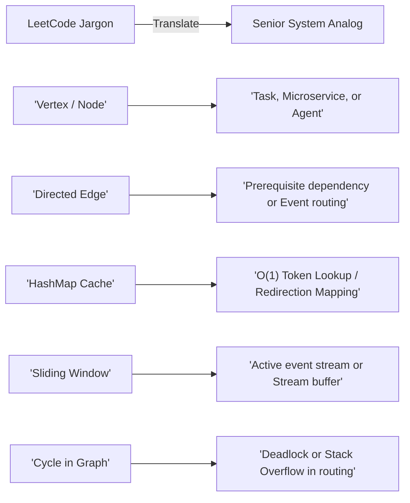

# Coding Patterns for Senior Backend Systems (Java)

!!! note "The Senior Perspective: Algorithms as Micro-Architectures"
    At **13+ years of experience**, your interviewers at **Salesforce** and **ServiceNow** do not just want to see if you can write a loop. They are assessing if you see algorithms as **micro-level distributed systems**. 
    
    This guide is tailored specifically to bridge the gap between LeetCode-style patterns and your background in **Microservices, Identity Access Management (Okta/SSO), Event-Driven Architectures (Kafka), and Multi-Agent AI systems**.

---

## 🗺️ Algorithmic Patterns to Enterprise Systems Map

Instead of grinding generic puzzles, anchor each pattern to the system architectures you build every day. This creates instant spoken rapport ("talk track") during the coding panel.

| Algorithmic Pattern | Enterprise System Equivalence (Your Focus) | Salesforce Target | ServiceNow Target |
|:---|:---|:---|:---|
| **Topological Sort** (Kahn's) | • **Bean Dependency Trees** (Spring Boot Bean Initialization) • **Config-Driven Workflow Orchestrators** (LangGraph multi-agent routing) • **Build Dependency Pipelines** | Hierarchical metadata field-dependency parsing | CMDB Configuration Item (CI) dependency mappings & Change Workflows |
| **Intervals & Sweeping** | • **Resource Booking Engines** (SLA shifts, calendars) • **Rate Limiting Windows** (Fixed-window counters) • **SAML/OIDC Token Expiration Windows** | Salesforce Scheduler, multi-tenant booking conflicts | Shift assignment grids, incident SLA breach timelines |
| **Custom Data Structures** (LRU, Trie) | • **Okta/SSO Token Eviction Caches** (Memory-efficient token validation) • **API Gateway Router Tries** (Dynamic path matching) • **Trie-based Prefix Filter trees** | Dynamic Tenant Router mapping caches | CMDB fast-lookup search-bar indexing, Dynamic autocomplete routing |
| **Sliding Window** | • **Rate Limiters** (Sliding-window log / token buckets) • **Kafka Event Stream Aggregators** (Sliding aggregations over time) • **DOM / payload stream chunking** | Dynamic tenant rate-limiting throttlers | Log alert rate-analyzers, webhook message parsers |
| **Monotonic Stack** | • **Real-time Log Stream Parsers** (Finding next error/warning event) • **Stock ticker & high-water mark systems** | Bulk load balancing request metrics | Event Management priority queues, next-highest task routing |
| **Binary Search** | • **Optimization Problems** (Max throughput under DB limits) • **Distributed Page Offsets** (Database partition lookups) | Multi-tenant resource throttling thresholds | Optimal sharded database partition boundaries |

---

## 🎨 Enterprise "Talk-Track" Invariants

When you present your code, replace LeetCode jargon with **Senior System engineering analogs** to instantly showcase Staff-level signals.

---

## 🚀 The Study Roadmap

Use the following links to access your Java templates and practice problems:

*   [⚡ 7-Day Fast-Track Plan](../fast-track-study-plan.md) — Your customized 7-day schedule, active-recall progress tracker, and local testing guidelines.
*   [Graphs & Topological Sort](graphs/index.md) — *Kahn's algorithm, BFS, and cycle detection* mapped directly to **Spring Boot graphs & LangGraph multi-agent routing engines**.
*   [Custom Data Structure Design](data-structures/index.md) — *Hand-rolled LRU caches & Tries* mapped directly to **SSO token caching and prefix autocompletes**.
*   [Intervals](intervals/index.md) — *Sort-by-start and sort-by-end sweeps* mapped directly to **SLA windows and resource booking schedulers**.
*   [Sliding Window](sliding-window/index.md) — *Contiguous array scans* mapped directly to **event stream buffers & API rate-limiting algorithms**.
*   [Binary Search](binary-search/index.md) — *Search spaces and answer optimization* mapped to **distributed DB partitioning**.
*   [Coding Interview Cheat Sheet](cheatsheet.md) — Your Ctrl-F-able quick-reference containing Java skeletons for 18 core techniques.
*   [Java Quick Hacks](java-quick-hacks.md) — High-yield Java-API idioms to help you write elegant, modular code quickly.
