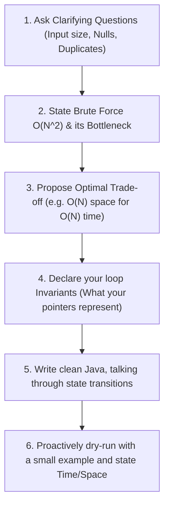

# The Master Study Guide: Salesforce & ServiceNow (Java SSE)

!!! important "Your Absolute Single Source of Truth"
    This document consolidates your entire weekly preparation into **one single place**. No clicking around, no jumping between files. 
    
    It is tailored for a **13+ years Senior/Staff Backend Engineer** focusing on **Java**, **microservices**, **event-driven systems**, and **custom datastores**. It contains your study schedule, memorization techniques, the 6 core algorithmic blueprints, and the critical **Concurrency & Thread-Safety** templates needed to pass the SSE coding bar.

---

## 📅 The 7-Day Fast-Track Roadmap

Spend 60–90 minutes each day using the **Active Recall** method below to master these exact patterns.

| Day | Algorithmic Blueprint | Enterprise Context | Why it is Asked (Salesforce / ServiceNow) |
|---|---|---|---|
| **Day 1** | **Intervals & Scheduling** | SLA Shift/Change Calendars, Resource Booking | Schedulers, tenant conflict detection, SLA incident grids |
| **Day 2** | **Topological Sort & Kahn's** | Event orchestrators, Bean DI Graph trees | Dependency workflows, metadata package dependency engines |
| **Day 3** | **Hand-Rolled LRU Cache** | API Gateway Token caches, DB Buffer Pools | Multi-tenant cache eviction, SSO/Okta token validation caches |
| **Day 4** | **Trie (Prefix Trees)** | API Gateway routers, dynamic filter indexing | Dynamic dynamic prefix autocompletes, CMDB searching |
| **Day 5** | **Sliding Window** | Rate limiters, Kafka event log aggregators | Tenant API throttling, webhook event alerts |
| **Day 6** | **Thread-Safety & Concurrency** | Production-ready high-throughput services | The ultimate SSE differentiator follow-up question |
| **Day 7** | **Active Recall Sweep** | Speed memory test | Writing every blueprint under 5 minutes |

---

## 🧠 How to Tailor & Use This Guide Effectively (Active Recall)

As a senior candidate, your biggest risk is **rusty coding speed** and **getting stuck on pointer syntax** under pressure. You do not need to "re-learn" how BFS works; you need to **cement the code in your fingers**.

### The "Blank-Sheet" Coding Technique
Do this every day for the target templates:
1.  **Study the Template (3 mins):** Look at the Java templates below. Note the core invariants (e.g., the double-linked node rewiring, the in-degree array counts).
2.  **Hide the Guide:** Minimize this document.
3.  **Code from Memory:** Open a blank scratch file in `/Users/kramesan/Scratchpad/BrainDump/interview-prep/scratch/Scratch.java`. Try to write the template from absolute memory.
    *   *If you freeze:* Force your brain to retrieve the logic for 60 seconds. If still stuck, look at the template for 10 seconds, close it, and resume writing.
4.  **Practice the Twist:** Do not just write the template. Verbally explain how you would adjust it to handle the common interview "twists" listed under each section.

---

## 🎙️ The SSE Spoken "Talk-Track" Blueprint

At 13+ years, you are expected to **lead the interview**. Use this flow to display Staff-level signaling:



---

## 🚀 The 6 Critical Algorithmic Blueprints (Java)

---

### 1. Intervals & Scheduling (Min Meeting Rooms Needed)
*   **Use when:** You have a list of `[start, end]` ranges and need to find the maximum number of concurrent overlapping intervals (e.g., how many rooms/servers are needed).
*   **The Invariant:** Sort intervals by **start time**. Use a **Min-Heap (PriorityQueue)** to track the active end times of running meetings. If the next meeting starts *after or when* the earliest meeting ends, we reuse the room (pop heap).
*   **Java Template:**
```java
import java.util.*;

public int minMeetingRooms(int[][] intervals) {
    if (intervals == null || intervals.length == 0) return 0;
    
    // 1. Sort by start time
    Arrays.sort(intervals, (a, b) -> Integer.compare(a[0], b[0]));
    
    // 2. Min-heap tracks end times
    PriorityQueue<Integer> minHeap = new PriorityQueue<>();
    minHeap.add(intervals[0][1]);
    
    for (int i = 1; i < intervals.length; i++) {
        // If the current meeting starts after or when the earliest ending meeting finishes
        if (intervals[i][0] >= minHeap.peek()) {
            minHeap.poll(); // Free up that room
        }
        // Allocate a room (push current end time)
        minHeap.add(intervals[i][1]);
    }
    
    return minHeap.size();
}
```
*   **The Twist:**
    *   *Merge overlapping segments (Merge Intervals):* Sort by start time, maintain a running `last` interval array, and merge in-place if `curr[0] <= last[1]`.

---

### 2. Topological Sort (Kahn's Algorithm)
*   **Use when:** You need to determine a valid order of execution for items with dependency constraints (e.g. Course Schedule, build pipelines, workflow execution).
*   **The Invariant:** Calculate the `in-degree` (incoming arrow count) for each node. Use a `Queue` to process nodes with `0` in-degree (ready to execute). Decrement neighbors' in-degrees as you process.
*   **Java Template:**
```java
import java.util.*;

public List<Integer> findOrder(int numTasks, int[][] prerequisites) {
    List<Integer> order = new ArrayList<>();
    Map<Integer, List<Integer>> adj = new HashMap<>();
    int[] inDegree = new int[numTasks];
    
    // Build Graph & record incoming dependencies
    for (int[] edge : prerequisites) {
        int dest = edge[0];
        int src = edge[1];
        adj.computeIfAbsent(src, k -> new ArrayList<>()).add(dest);
        inDegree[dest]++;
    }
    
    // Queue processes tasks with 0 dependencies
    Queue<Integer> q = new LinkedList<>();
    for (int i = 0; i < numTasks; i++) {
        if (inDegree[i] == 0) q.add(i);
    }
    
    while (!q.isEmpty()) {
        int curr = q.poll();
        order.add(curr);
        
        for (int neighbor : adj.getOrDefault(curr, new ArrayList<>())) {
            inDegree[neighbor]--;
            if (inDegree[neighbor] == 0) {
                q.add(neighbor);
            }
        }
    }
    
    // If order size != total tasks, a cyclic dependency deadlock was detected!
    return order.size() == numTasks ? order : new ArrayList<>();
}
```
*   **The Twist:**
    *   *Cycle detection only (Course Schedule I):* Return `true` if `order.size() == numTasks`.

---

### 3. Custom LRU Cache (Hand-Rolled DLL + Map)
*   **Use when:** You need $O(1)$ lookup, addition, and eviction of the least-recently-used item. (Do not use `LinkedHashMap` in the interview; hand-roll it to show senior pointer skills).
*   **The Invariant:** Use dummy sentinel `head` and `tail` nodes to completely avoid boundary `null` checks during pointer splicing.
*   **Java Template:**
```java
import java.util.*;

public class LRUCache {
    private static class Node {
        int key, value;
        Node prev, next;
        Node(int k, int v) { this.key = k; this.value = v; }
    }

    private final int capacity;
    private final Map<Integer, Node> map = new HashMap<>();
    private final Node head = new Node(0, 0); // Dummy Head
    private final Node tail = new Node(0, 0); // Dummy Tail

    public LRUCache(int capacity) {
        this.capacity = capacity;
        head.next = tail;
        tail.prev = head;
    }

    public int get(int key) {
        if (!map.containsKey(key)) return -1;
        Node node = map.get(key);
        moveToHead(node);
        return node.value;
    }

    public void put(int key, int value) {
        if (map.containsKey(key)) {
            Node node = map.get(key);
            node.value = value;
            moveToHead(node);
        } else {
            if (map.size() >= capacity) {
                Node lru = tail.prev;
                removeNode(lru);
                map.remove(lru.key);
            }
            Node newNode = new Node(key, value);
            addNode(newNode);
            map.put(key, newNode);
        }
    }

    private void addNode(Node node) { // Insert right after dummy head
        node.next = head.next;
        node.prev = head;
        head.next.prev = node;
        head.next = node;
    }

    private void removeNode(Node node) { // Splice node out
        node.prev.next = node.next;
        node.next.prev = node.prev;
    }

    private void moveToHead(Node node) {
        removeNode(node);
        addNode(node);
    }
}
```

---

### 4. Trie (Prefix Tree)
*   **Use when:** You need fast characters-based prefix matching, auto-completing, or wild-card word searching.
*   **The Invariant:** Each node contains a fixed-size `TrieNode[26]` array for children and a boolean flag `isWord` marking a valid string ending.
*   **Java Template:**
```java
import java.util.*;

public class Trie {
    private static class TrieNode {
        private final TrieNode[] children = new TrieNode[26];
        private boolean isWord = false;
    }

    private final TrieNode root = new TrieNode();

    public void insert(String word) {
        TrieNode curr = root;
        for (char c : word.toCharArray()) {
            int idx = c - 'a';
            if (curr.children[idx] == null) {
                curr.children[idx] = new TrieNode();
            }
            curr = curr.children[idx];
        }
        curr.isWord = true;
    }

    public boolean search(String word) {
        TrieNode node = findNode(word);
        return node != null && node.isWord;
    }

    public boolean startsWith(String prefix) {
        return findNode(prefix) != null;
    }

    private TrieNode findNode(String str) {
        TrieNode curr = root;
        for (char c : str.toCharArray()) {
            int idx = c - 'a';
            if (curr.children[idx] == null) return null;
            curr = curr.children[idx];
        }
        return curr;
    }
}
```

---

### 5. Sliding Window (Longest Substring Without Repeats)
*   **Use when:** You need to find the longest or shortest contiguous range that meets a certain condition (e.g. rate limit counters, unique sequences).
*   **The Invariant:** Expand `right` to grow your window. When the condition is violated (e.g., character is repeated), increment `left` to shrink the window until it is valid again.
*   **Java Template:**
```java
import java.util.*;

public int lengthOfLongestSubstring(String s) {
    if (s == null || s.length() == 0) return 0;
    
    Map<Character, Integer> lastSeen = new HashMap<>();
    int left = 0, maxLen = 0;
    
    for (int right = 0; right < s.length(); right++) {
        char c = s.charAt(right);
        
        // If repeating character is inside the active window boundary, jump left
        if (lastSeen.containsKey(c) && lastSeen.get(c) >= left) {
            left = lastSeen.get(c) + 1;
        }
        
        lastSeen.put(c, right);
        maxLen = Math.max(maxLen, right - left + 1);
    }
    
    return maxLen;
}
```

---

## ⚡ The Senior Differentiator: Concurrency & Thread-Safety

At **13+ years**, your interviewers at Salesforce and ServiceNow *will* ask: **"How does this run in a multi-threaded, high-concurrency production system?"**

### 1. Thread-Safe Hand-Rolled LRU Cache
To make our standard LRU Cache thread-safe, wrapping the entire `get` and `put` methods in `synchronized` is a junior-level answer—it causes a massive lock contention bottleneck because reads block other reads.

The optimal Senior approach is using a `ReentrantReadWriteLock`. This allows **multiple threads to read concurrently**, but guarantees **exclusive access for writes** (evictions or modifications).

```java
import java.util.*;
import java.util.concurrent.locks.ReentrantReadWriteLock;

public class ThreadSafeLRUCache {
    private static class Node {
        int key, value;
        Node prev, next;
        Node(int k, int v) { this.key = k; this.value = v; }
    }

    private final int capacity;
    private final Map<Integer, Node> map = new HashMap<>();
    private final Node head = new Node(0, 0);
    private final Node tail = new Node(0, 0);
    
    // High-performance Read/Write lock
    private final ReentrantReadWriteLock rwLock = new ReentrantReadWriteLock();
    private final ReentrantReadWriteLock.ReadLock readLock = rwLock.readLock();
    private final ReentrantReadWriteLock.WriteLock writeLock = rwLock.writeLock();

    public ThreadSafeLRUCache(int capacity) {
        this.capacity = capacity;
        head.next = tail;
        tail.prev = head;
    }

    public int get(int key) {
        writeLock.lock(); // Moving accessed node to head is a WRITE operation on the list!
        try {
            if (!map.containsKey(key)) return -1;
            Node node = map.get(key);
            moveToHead(node);
            return node.value;
        } finally {
            writeLock.unlock();
        }
    }

    public void put(int key, int value) {
        writeLock.lock(); // Exclusive lock for writes
        try {
            if (map.containsKey(key)) {
                Node node = map.get(key);
                node.value = value;
                moveToHead(node);
            } else {
                if (map.size() >= capacity) {
                    Node lru = tail.prev;
                    removeNode(lru);
                    map.remove(lru.key);
                }
                Node newNode = new Node(key, value);
                addNode(newNode);
                map.put(key, newNode);
            }
        } finally {
            writeLock.unlock();
        }
    }

    private void addNode(Node node) {
        node.next = head.next;
        node.prev = head;
        head.next.prev = node;
        head.next = node;
    }

    private void removeNode(Node node) {
        node.prev.next = node.next;
        node.next.prev = node.prev;
    }

    private void moveToHead(Node node) {
        removeNode(node);
        addNode(node);
    }
}
```

### 2. High-Performance Java Concurrency Cheat Sheet
Memorize these drop-in primitives for quick coding follow-ups:

*   **Atomic Integer Counter:** Use `AtomicInteger` to avoid locks entirely when managing thread-safe counts or rate limiter buckets:
    ```java
    import java.util.concurrent.atomic.AtomicInteger;
    private final AtomicInteger requestCount = new AtomicInteger(0);
    // Safe thread-increment:
    int current = requestCount.incrementAndGet();
    ```
*   **High-Throughput Map:** Never use `Hashtable` or `Collections.synchronizedMap`. Always use `ConcurrentHashMap` for high-throughput thread-safe lookups:
    ```java
    import java.util.concurrent.ConcurrentHashMap;
    private final ConcurrentHashMap<String, Integer> tokenBucket = new ConcurrentHashMap<>();
    
    // Atomic put-if-absent (prevents race conditions during initialization)
    tokenBucket.putIfAbsent("tenantId", 10);
    
    // Atomic merge (updates counters safely without explicit locks)
    tokenBucket.merge("tenantId", 1, Integer::sum);
    ```
