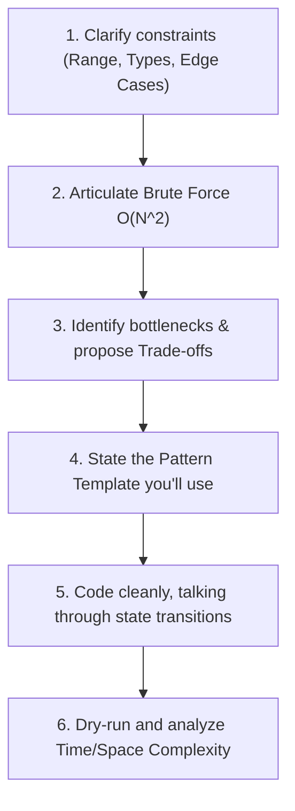

# 7-Day Fast-Track Study Plan: Salesforce & ServiceNow (SSE)

Congratulations on landing interviews with **Salesforce** and **ServiceNow**! 

At the **Senior Software Engineer (SSE)** level, the expectation is not just writing code that gets a green check on LeetCode. You are evaluated on:
1.  **Systematic Problem Solving:** Leading the interview, asking deep clarifying questions, and articulating trade-offs *before* writing a line of code.
2.  **Structural Cleanliness:** Writing highly modular, self-documenting code using standard patterns instead of ad-hoc workarounds.
3.  **Template Mastery:** Memorizing core skeleton templates so you don't waste 15 minutes reinventing standard traversals or pointer logic.

This **7-Day Fast-Track Study Plan** is built specifically to establish template muscle-memory quickly and teach you how to apply them to interview twists under pressure.

---

## 📅 The 7-Day Schedule

Each day targets high-yield patterns that are highly relevant to Salesforce and ServiceNow systems.

| Day | High-Yield Coding Pattern | Salesforce Relevance | ServiceNow Relevance | Target Practice Docs |
|---|---|---|---|---|
| **Day 1** | **Intervals & Scheduling** | Salesforce Calendar, Booking APIs, Resource Allocation | Change Management windows, SLA/Shift booking grids | [Intervals Overview](coding-patterns/intervals/index.md) |
| **Day 2** | **Graphs & Topological Sort** | Schema Builder mappings, Profile permissions trees | Workflow engines, CMDB configuration item hierarchies | [Graphs Overview](coding-patterns/graphs/index.md) |
| **Day 3** | **Data Structure Design** | Multi-tenant caching layers, dyn-query indices | Workflow queues, fast search-bar autocomplete trees | [Data Structures Overview](coding-patterns/data-structures/index.md) |
| **Day 4** | **Sliding Window & 2-Pointers** | String parsers, bulk payload data cleanups | Text parsing, log analytics, sequence scanners | [Sliding Window Overview](coding-patterns/sliding-window/index.md) |
| **Day 5** | **Heap & Monotonic Stack** | Log file merging, queue prioritize, stock indexes | Priority-based task routing, event stream logs | [Cheatsheet Reference](coding-patterns/cheatsheet.md) |
| **Day 6** | **Binary Search (Optimization)** | High-throughput capacity planning | Load-distribution & page offset optimizations | [Binary Search Overview](coding-patterns/binary-search/index.md) |
| **Day 7** | **Memory Sweep & Talk-Track Mock** | Final memory recall test of core skeletons | Final memory recall test of core skeletons | [Java Quick Hacks](coding-patterns/java-quick-hacks.md) |

---

## 🧠 How to Use This Project Effectively (Active Recall)

Reading solutions creates an **illusion of competence**. In the actual interview, when you are stressed, your mind can go blank. Use this project as an **Active Recall Workspace** to cement the templates in your muscle memory.

### The "Blank-Sheet" Memory Hack
Do this for every core template (e.g., Kahn's Algorithm, Hand-rolled LRU Cache, Merge Intervals, Sliding Window):

1.  **Study the template:** Open the target index or [cheatsheet](coding-patterns/cheatsheet.md). Spend 3 minutes studying the skeleton shape. Note the invariants (the pointers, visited sets, state queues).
2.  **Hide the cheatsheet:** Close the guide window.
3.  **Write it from memory:** Create a temporary scratch file in the scratch workspace: `/Users/kramesan/Scratchpad/BrainDump/interview-prep/scratch/`. Try to write the complete template from absolute memory.
    *   *If you get stuck:* Do not look at the solution immediately. Force your brain to retrieve the next step for 60 seconds. If still stuck, look at the cheatsheet for 10 seconds, close it, and resume writing.
4.  **Dry Run with a concrete input:** Verbally trace a small input array (e.g. `[ [1,3], [2,6] ]`) line-by-line over your code. Ensure your loop invariants hold.

---

## 📈 Active Recall Progress Tracker

Use this table to log your active recall progress. Tick these boxes as you master each pattern template.

```markdown
| Target Template | Coded From Memory? | Dry-Run Success? | Twist Explained? | Priority |
|:---|:---:|:---:|:---:|:---|
| **Merge Intervals** (Sort-by-start + sweep) | [ ] | [ ] | [ ] | 🔥 Critical |
| **Non-Overlapping Intervals** (Sort-by-end) | [ ] | [ ] | [ ] | 🔥 Critical |
| **Topological Sort** (Kahn's / In-degree queue) | [ ] | [ ] | [ ] | 🔥 Critical |
| **Graph DFS Cycle Detection** (Coloring DFS) | [ ] | [ ] | [ ] | 🔥 Critical |
| **Hand-Rolled LRU Cache** (Map + custom DLL) | [ ] | [ ] | [ ] | 🔥 Critical |
| **Trie (Prefix Tree)** (Nodes with array children) | [ ] | [ ] | [ ] | ⚡ High |
| **Sliding Window** (Variable character window) | [ ] | [ ] | [ ] | ⚡ High |
| **Monotonic Stack** (Next Greater Element) | [ ] | [ ] | [ ] | ⚡ High |
| **Binary Search on Answer** (Koko eating speed) | [ ] | [ ] | [ ] | ⚡ High |
```

---

## 🎙️ The SSE "Talk-Track" Blueprint

Senior and Staff Engineers are expected to lead the coding session. Practice saying these aloud as you mock-solve:



### 1. Clarification & Edge Cases
*   *Before writing any code, ask:* "What are the limits on the input sizes? Are duplicates possible? How should we handle empty, null, or single-element inputs? For intervals, do overlapping boundaries touch (`[1,2]` and `[2,3]`) conflict?"

### 2. State the Bottleneck & Trade-off
*   *Say out loud:* "The brute force approach takes $O(n^2)$ because we scan all pairs. We can optimize this by trading $O(n)$ memory for $O(n)$ time using a hash map to look up previous elements in constant time."
*   *Or:* "Because the array is already sorted, we can avoid the cost of hashing by using a two-pointer technique to solve this in $O(n)$ time and $O(1)$ extra space."

### 3. Maintain Invariant Declarations
*   *Explain what your variables represent:* "We will maintain a sliding window from index `left` to `right`. At any point in our loop, the elements within `[left, right]` represent the longest contiguous subarray containing strictly unique characters..."

---

## 🛠️ Testing Your Code Locally

You have Java compiling capabilities locally to test your templates.

To run quick scratch code validations:
1.  Navigate to your scratch folder `/Users/kramesan/Scratchpad/BrainDump/interview-prep/scratch/`.
2.  Write a simple class with a `public static void main(String[] args)` method to trace your Java templates.
3.  Compile and execute using:
    ```bash
    javac Scratch.java && java Scratch
    ```
