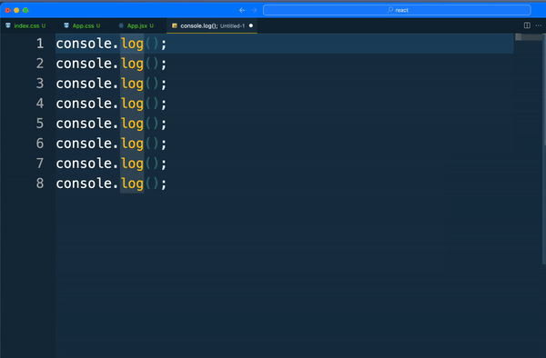
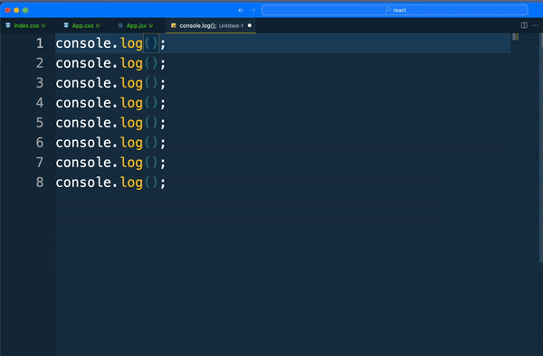
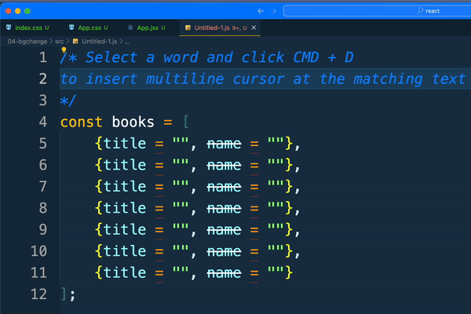
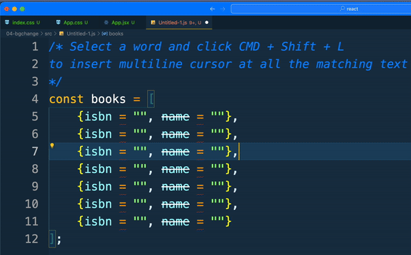
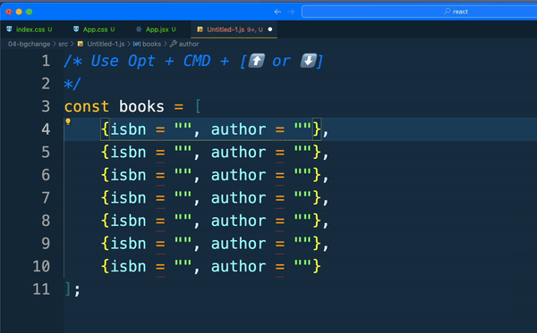
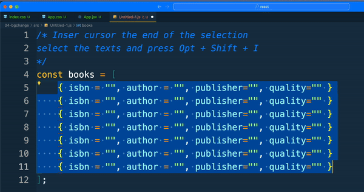

# Visual Studio Code Extensions

A list of Visual Studio Code extensions we use in courses. Not intended to be exhaustive. All of these are optional.

### General

These will actually make your experience in VS Code better:

- [copilot](https://marketplace.visualstudio.com/items?itemName=GitHub.copilot)
- [spell checker](https://marketplace.visualstudio.com/items?itemName=streetsidesoftware.code-spell-checker)
- [open in browser](https://marketplace.visualstudio.com/items?itemName=techer.open-in-browser) Handy lightweight utility for opening files in a browser. Does not use a web server, unlike Live Preview or similar extensions.

### Programming
- [python](https://marketplace.visualstudio.com/items?itemName=ms-python.python)
- [python debugger](https://marketplace.visualstudio.com/items?itemName=ms-python.debugpy)
- [pylance](https://marketplace.visualstudio.com/items?itemName=ms-python.vscode-pylance)
- [Spring Boot extension pack](https://marketplace.visualstudio.com/items?itemName=vmware.vscode-boot-dev-pack)
- [Extension pack for Java](https://marketplace.visualstudio.com/items?itemName=vscjava.vscode-java-pack) - delete Intellicode extension after that 

### Themes

- [Cobalt2 Theme Official](https://marketplace.visualstudio.com/items?itemName=wesbos.theme-cobalt2)
- [One Dark Pro](https://marketplace.visualstudio.com/items?itemName=zhuangtongfa.Material-theme) 
- [Overnight](https://marketplace.visualstudio.com/items?itemName=cev.overnight)
- [LubnaDev-Theme](https://marketplace.visualstudio.com/items?itemName=lubnadev.lubnadev-theme)
- [Tomorrow Night Blue](https://marketplace.visualstudio.com/items?itemName=gerane.Theme-TomorrowNightBlue) 

## Decoration

These make the experience of using VS Code nicer. Not required.

- [Peacock](https://marketplace.visualstudio.com/items?itemName=johnpapa.vscode-peacock) Colors VS Code according to your project (red for Angular, blue for React, etc.; can customize according to prefs)
- [vscode-icons](https://marketplace.visualstudio.com/items?itemName=vscode-icons-team.vscode-icons)

### JavaScript

- [ESLint](https://marketplace.visualstudio.com/items?itemName=dbaeumer.vscode-eslint) code style enforcer (and also formatter)
- [Prettier](https://marketplace.visualstudio.com/items?itemName=esbenp.prettier-vscode) code formatter

### React configuration

- [React Dev Tools](https://beta.reactjs.org/learn/react-developer-tools)

### Redux Toolkit

- [Redux DevTools](https://github.com/reduxjs/redux-devtools)

### Productivity

*  MultiLine Cursor
    1. Using Option Key + Mouse Click to add multiple cursors, Use Shift + [ ⬅️ or ➡️ ] to select texts at multiple cursors
    
    2. Holding Option + Shift Key and click at the last line where you want to include multiline cursor
    
    3. Select a word and click CMD + D to insert multiline cursor at the matching text 
    
    4. Select a word and click CMD + Shift + L to insert multiline cursor at all the matching text
    
    5. Use Opt + CMD + [ ⬆️ or ⬇️ ] 
    
    6. Inser cursor the end of the selection select the texts and press Opt + Shift + I
    
   

